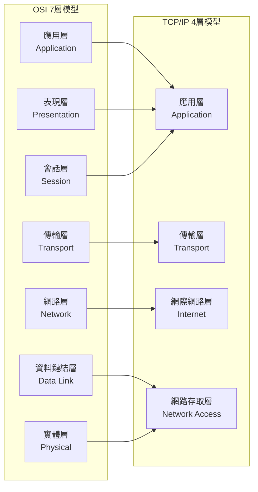
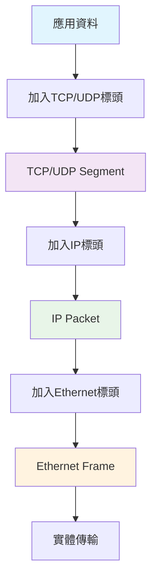
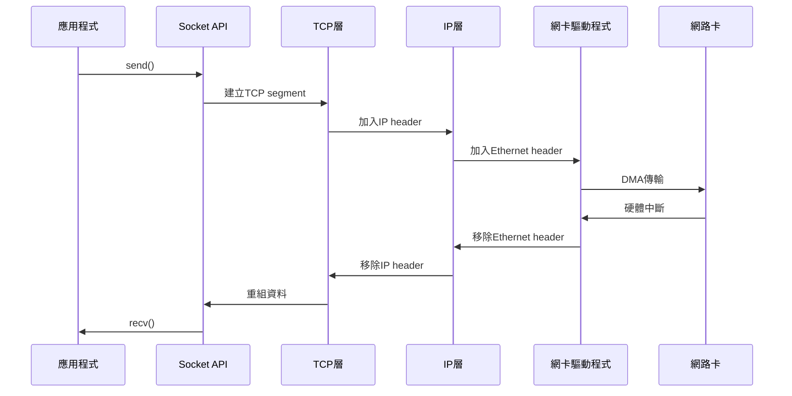

# 網路模型與分層架構

## 1. 網路分層模型概述

### 1.1 為什麼需要分層？

分層架構是網路設計的核心思想，解決複雜系統的設計問題：

- **模組化**：每層專注特定功能，降低設計複雜度
- **標準化**：不同廠商可以實作相同層級的標準
- **靈活性**：某層的變更不影響其他層
- **互操作性**：不同系統間的通信標準

### 1.2 OSI 7層模型 vs TCP/IP 4層模型



---

## 2. 各層功能詳解

### 2.1 實體層 (Physical Layer)

**功能**：將數位訊號轉換為物理傳輸媒介上的訊號

**關鍵概念**：
- **傳輸媒介**：雙絞線、光纖、無線電波
- **調變**：將數位訊號轉為類比訊號
- **電氣特性**：電壓準位、時序、連接器規格

**Linux 視角**：
```bash
# 查看網路介面狀態
ethtool eth0
# 查看實體連接狀態  
cat /sys/class/net/eth0/carrier
```

### 2.2 資料鏈結層 (Data Link Layer)

**功能**：在直接相連的節點間提供可靠的點對點傳輸

**關鍵概念**：
- **MAC地址**：硬體地址，用於區域網路內定址
- **影格 (Frame)**：資料鏈結層的資料單位
- **錯誤檢測**：CRC校驗和
- **流量控制**：防止傳送端淹沒接收端

**協議範例**：Ethernet, WiFi (802.11), PPP

**Linux 工具**：
```bash
# 查看MAC地址
ip link show
# ARP表格 (Address Resolution Protocol)
arp -a
# 橋接設定
brctl show
```

### 2.3 網路層 (Network Layer)

**功能**：在不同網路間路由封包，提供邏輯定址

**關鍵概念**：
- **IP地址**：邏輯地址，全域唯一
- **路由**：決定封包傳送路徑
- **封包 (Packet)**：網路層資料單位
- **分片**：將大封包切割成小封包

**主要協議**：IPv4, IPv6, ICMP, OSPF, BGP

**Linux 工具**：
```bash
# 查看路由表
ip route show
# 追蹤路由路徑
traceroute google.com
# ICMP測試
ping -c 4 8.8.8.8
```

### 2.4 傳輸層 (Transport Layer)

**功能**：提供端對端的可靠或不可靠傳輸服務

**關鍵概念**：
- **連接埠 (Port)**：區分不同應用程式
- **分段 (Segment)**：傳輸層資料單位
- **可靠性**：錯誤檢測、重傳、順序保證
- **多工**：多個應用程式共用網路

**主要協議**：TCP (可靠), UDP (不可靠), SCTP

**Linux 工具**：
```bash
# 查看連接狀態
ss -tuln
# 網路統計
netstat -s
# 傳輸層參數調整
sysctl net.ipv4.tcp_congestion_control
```

### 2.5 應用層 (Application Layer)

**功能**：為應用程式提供網路服務

**主要協議**：
- **HTTP/HTTPS**：網頁傳輸
- **DNS**：域名解析  
- **SMTP/POP3/IMAP**：電子郵件
- **FTP/SFTP**：檔案傳輸
- **SSH**：安全遠端登入

---

## 3. 資料封裝過程 (Data Encapsulation)



### 3.1 各層資料單位

| 層級 | 資料單位 | 包含內容 |
|------|----------|----------|
| 應用層 | Message/Data | 應用資料 |
| 傳輸層 | Segment | TCP/UDP Header + Data |
| 網路層 | Packet | IP Header + Segment |
| 資料鏈結層 | Frame | Ethernet Header + Packet + Trailer |
| 實體層 | Bits | 電氣訊號 |

### 3.2 標頭資訊範例

**Ethernet Header (14 bytes)**：
- 目的MAC地址 (6 bytes)
- 來源MAC地址 (6 bytes)  
- 類型/長度 (2 bytes)

**IP Header (20+ bytes)**：
- 版本、標頭長度、服務類型
- 總長度、識別碼、旗標、片段偏移
- TTL、協議、標頭校驗和
- 來源IP地址、目的IP地址

---

## 4. Linux 網路棧處理流程



### 4.1 核心空間 vs 使用者空間

**核心空間處理**：
- 中斷處理 (硬中斷/軟中斷)
- 協議棧處理
- 記憶體管理

**使用者空間**：
- 應用程式邏輯
- Socket API呼叫
- 緩衝區管理

**關鍵概念**：
- **上下文切換**：使用者態 ↔ 核心態切換成本
- **零拷貝**：減少不必要的記憶體複製
- **中斷處理**：硬中斷處理網路封包接收

---

## 5. 實務範例：封包追蹤

### 5.1 使用 tcpdump 觀察分層

```bash
# 基本封包擷取
sudo tcpdump -i eth0 -n -v

# 顯示完整標頭資訊
sudo tcpdump -i eth0 -n -v -X host 8.8.8.8

# 分析特定層級
sudo tcpdump -i eth0 'tcp port 80'          # 傳輸層
sudo tcpdump -i eth0 'host 192.168.1.1'     # 網路層  
sudo tcpdump -i eth0 'ether host aa:bb:cc:dd:ee:ff'  # 資料鏈結層
```

### 5.2 分析範例輸出

```
12:34:56.789012 IP 192.168.1.100.54350 > 8.8.8.8.53: 
    Flags [S], seq 123456789, win 65535, length 0
```

**解析**：
- `192.168.1.100.54350`：來源IP及連接埠
- `8.8.8.8.53`：目的IP及連接埠  
- `Flags [S]`：TCP SYN旗標
- `seq 123456789`：序列號
- `win 65535`：視窗大小

---

## 6. 常見誤解與注意事項

### 6.1 常見誤解

❌ **錯誤觀念**：「資料直接從應用程式傳到網路卡」
✅ **正確理解**：每層都會處理和添加標頭資訊

❌ **錯誤觀念**：「MAC地址用於網際網路路由」  
✅ **正確理解**：MAC地址僅用於區域網路，路由使用IP地址

❌ **錯誤觀念**：「TCP比UDP安全」
✅ **正確理解**：TCP提供可靠傳輸，安全性需靠上層協議

### 6.2 效能考量

**核心參數調整**：
```bash
# TCP緩衝區大小
sysctl net.core.rmem_max=134217728
sysctl net.core.wmem_max=134217728

# 網路裝置佇列長度
sysctl net.core.netdev_max_backlog=5000

# TCP congestion control
sysctl net.ipv4.tcp_congestion_control=bbr
```

---

## 7. 延伸學習

### 7.1 重要 RFC 文件

- **RFC 791**：Internet Protocol (IPv4)
- **RFC 793**：Transmission Control Protocol (TCP)  
- **RFC 768**：User Datagram Protocol (UDP)
- **RFC 826**：Address Resolution Protocol (ARP)

### 7.2 深入主題

- **軟體定義網路 (SDN)**：分離控制平面與資料平面
- **網路虛擬化**：VLAN, VxLAN, 覆疊網路
- **容器網路**：Docker網路、Kubernetes CNI
- **高效能網路**：DPDK、SR-IOV、內核旁路

---

**下一章預告**：深入探討 TCP/UDP 協議原理、三次握手、四次揮手等傳輸層核心機制。