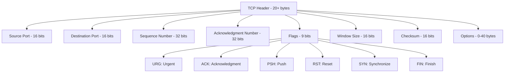
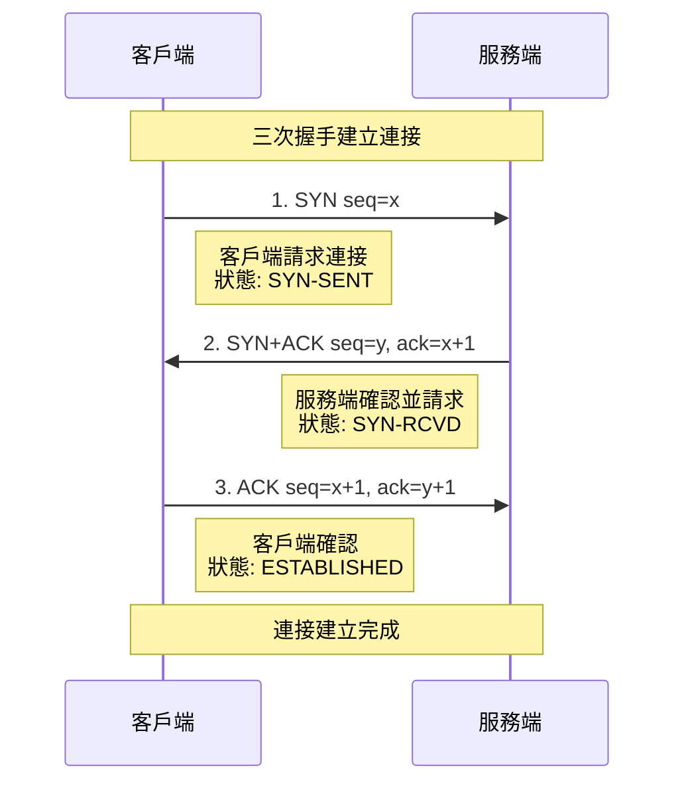
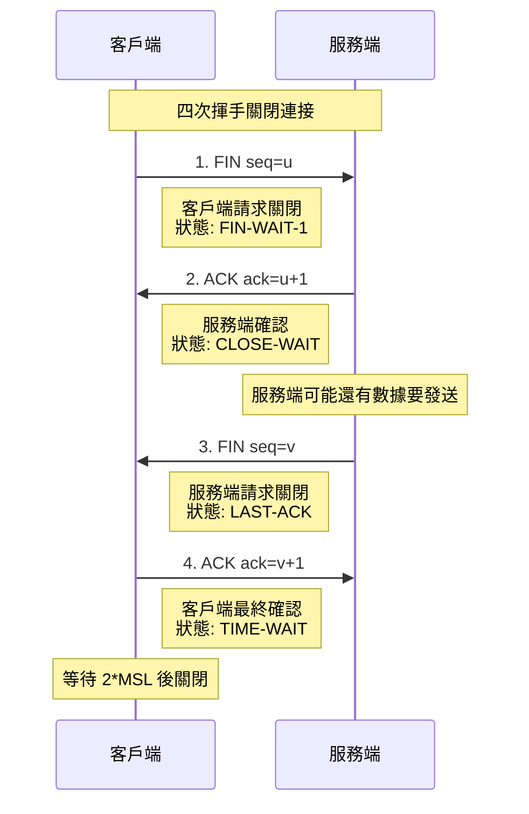
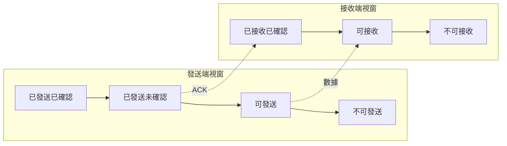
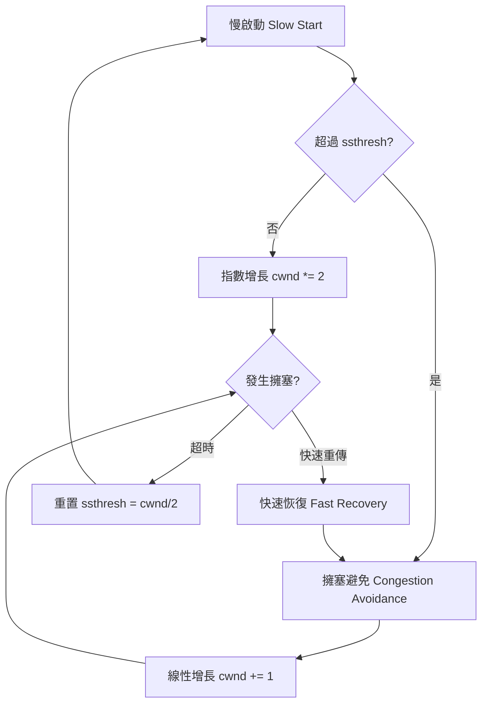
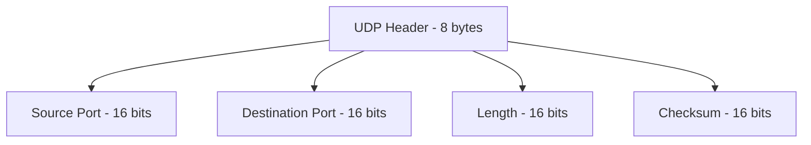
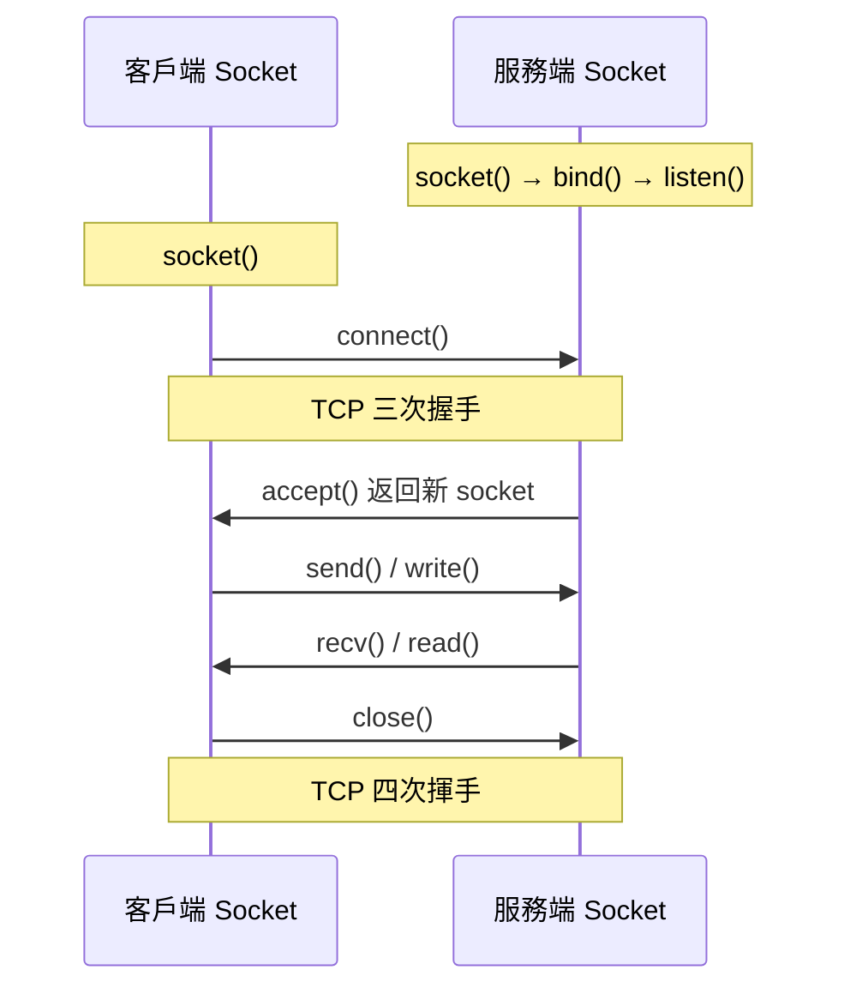

# 傳輸層協議

## 1. 傳輸層協議概述

### 1.1 傳輸層的作用

傳輸層是端對端通信的核心，負責：

- **程序間通信**：通過Port區分不同應用程式
- **可靠性控制**：錯誤檢測、重傳、順序保證
- **流量控制**：防止傳送端超過接收端處理能力
- **多工與分工**：多個應用共用一個網路連接

### 1.2 TCP vs UDP 比較

| 特性 | TCP | UDP |
|------|-----|-----|
| **連接方式** | 面向連接 | 無連接 |
| **可靠性** | 可靠傳輸 | 不可靠傳輸 |
| **速度** | 較慢 | 較快 |
| **頭部開銷** | 20-60 bytes | 8 bytes |
| **流量控制** | 有 | 無 |
| **擁塞控制** | 有 | 無 |
| **適用場景** | HTTP, HTTPS, FTP, SSH | DNS, DHCP, 視頻串流 |

---

## 2. TCP 詳解 (Transmission Control Protocol)

### 2.1 TCP 特性

**可靠傳輸保證**：
- **錯誤檢測**：校驗和 (Checksum)
- **確認機制**：ACK確認
- **重傳機制**：超時重傳、快速重傳
- **順序保證**：序列號 (Sequence Number)
- **重複檢測**：防止重複數據

### 2.2 TCP 標頭格式



**重要欄位**：
- **Sequence Number**：數據的起始位置
- **Acknowledgment Number**：期望收到的下一個字節
- **Window Size**：接收視窗大小，用於流量控制
- **Flags**：控制位元，用於連接管理

---

## 3. TCP 三次握手 (Three-Way Handshake)

### 3.1 握手流程



### 3.2 為什麼需要三次握手？

**防止失效連接請求**：
1. 客戶端發送SYN，但網路延遲
2. 客戶端重新發送SYN，成功建立連接並完成通信
3. 舊的SYN到達服務端，服務端回應SYN+ACK
4. 如果只有兩次握手，服務端會錯誤建立連接

**同步雙方初始序列號**：
- 確保雙方都知道對方的起始序列號
- 建立可靠的雙向通信通道

### 3.3 Linux 中觀察三次握手

```bash
# 使用 tcpdump 觀察握手過程
sudo tcpdump -i any -n 'tcp[tcpflags] & (tcp-syn|tcp-ack) != 0' port 80

# 使用 ss 查看連接狀態
ss -tuln state listening
ss -tun state syn-sent
ss -tun state established
```

---

## 4. TCP 四次揮手 (Four-Way Handshake)

### 4.1 揮手流程



### 4.2 為什麼需要四次揮手？

**TCP 全雙工特性**：
- 連接的每個方向都需要獨立關閉
- 一方關閉發送，但仍可接收數據
- 確保雙方數據都能完整傳輸

**TIME-WAIT 狀態的作用**：
- 確保最後的ACK能夠到達對方
- 防止舊連接的延遲數據影響新連接
- 等待時間：2 * MSL (Maximum Segment Lifetime)

### 4.3 TIME-WAIT 問題處理

```bash
# 查看 TIME-WAIT 連接數量
ss -tun state time-wait | wc -l

# 調整 TIME-WAIT 相關參數
sysctl net.ipv4.tcp_tw_reuse=1
sysctl net.ipv4.tcp_fin_timeout=30

# 檢視 TIME-WAIT 設置
cat /proc/sys/net/ipv4/tcp_fin_timeout
```

---

## 5. TCP 流量控制 (Flow Control)

### 5.1 滑動視窗機制



**視窗控制原理**：
- **發送視窗**：發送端維護的可發送數據範圍
- **接收視窗**：接收端通告的可接收數據量
- **視窗大小**：動態調整，防止接收端溢出

### 5.2 視窗調整機制

```bash
# 查看 TCP 視窗設置
sysctl net.ipv4.tcp_rmem    # 接收緩衝區
sysctl net.ipv4.tcp_wmem    # 發送緩衝區
sysctl net.core.rmem_max    # 最大接收緩衝區
sysctl net.core.wmem_max    # 最大發送緩衝區

# 調整視窗大小
echo 'net.core.rmem_max = 134217728' >> /etc/sysctl.conf
echo 'net.core.wmem_max = 134217728' >> /etc/sysctl.conf
```

---

## 6. TCP 擁塞控制 (Congestion Control)

### 6.1 擁塞控制算法



### 6.2 主要擁塞控制算法

**Reno (經典算法)**：
- 慢啟動 → 擁塞避免 → 快速重傳 → 快速恢復

**CUBIC (Linux 默認)**：
- 三次函數增長，更適合高頻寬延遲網路

**BBR (Google 開發)**：
- 基於頻寬和 RTT 估計，而非丟包檢測

```bash
# 查看可用的擁塞控制算法
cat /proc/sys/net/ipv4/tcp_available_congestion_control

# 查看當前算法
cat /proc/sys/net/ipv4/tcp_congestion_control

# 設置擁塞控制算法
echo 'bbr' > /proc/sys/net/ipv4/tcp_congestion_control

# 永久設置
echo 'net.ipv4.tcp_congestion_control = bbr' >> /etc/sysctl.conf
```

---

## 7. UDP 詳解 (User Datagram Protocol)

### 7.1 UDP 特性

**簡單快速**：
- 無連接，無需握手
- 無狀態，不維護連接信息
- 頭部開銷小 (8 bytes)
- 無流量控制和擁塞控制

### 7.2 UDP 標頭格式



### 7.3 UDP 應用場景

**適合場景**：
- **DNS 查詢**：查詢快速，重試成本低
- **DHCP**：簡單的請求-響應模式
- **即時通信**：延遲優先於可靠性
- **串流媒體**：丟包可容忍，重傳無意義
- **遊戲**：實時性要求高

**UDP 程式範例**：
```python
import socket

# UDP 服務端
server = socket.socket(socket.AF_INET, socket.SOCK_DGRAM)
server.bind(('0.0.0.0', 8888))

while True:
    data, addr = server.recvfrom(1024)
    print(f"Received from {addr}: {data.decode()}")
    server.sendto(b"Response", addr)
```

---

## 8. Socket 程式設計基礎

### 8.1 TCP Socket 流程



### 8.2 重要 Socket 選項

```c
// C 語言範例
int sockfd = socket(AF_INET, SOCK_STREAM, 0);

// 地址重用 (解決 TIME-WAIT 問題)
int optval = 1;
setsockopt(sockfd, SOL_SOCKET, SO_REUSEADDR, &optval, sizeof(optval));

// TCP_NODELAY (禁用 Nagle 算法)
setsockopt(sockfd, IPPROTO_TCP, TCP_NODELAY, &optval, sizeof(optval));

// 設置接收/發送緩衝區大小
int bufsize = 65536;
setsockopt(sockfd, SOL_SOCKET, SO_RCVBUF, &bufsize, sizeof(bufsize));
setsockopt(sockfd, SOL_SOCKET, SO_SNDBUF, &bufsize, sizeof(bufsize));

// Keep-Alive 設置
setsockopt(sockfd, SOL_SOCKET, SO_KEEPALIVE, &optval, sizeof(optval));
```

---

## 9. Nagle 算法與 TCP_NODELAY

### 9.1 Nagle 算法原理

**目的**：減少小封包數量，提高網路效率

**規則**：
1. 如果有未確認的數據，新的小數據會被緩存
2. 直到收到 ACK 或緩存達到 MSS 大小才發送
3. 適合批量傳輸，不適合互動式應用

### 9.2 何時禁用 Nagle

**需要 TCP_NODELAY 的場景**：
- 即時遊戲
- 金融交易系統
- 遠程桌面
- SSH 互動式會話

```bash
# 系統級設置
echo 'net.ipv4.tcp_low_latency = 1' >> /etc/sysctl.conf

# 應用級設置 (在程式中)
setsockopt(socket, IPPROTO_TCP, TCP_NODELAY, &flag, sizeof(int));
```

---

## 10. 效能調校與監控

### 10.1 TCP 參數調校

```bash
# 基本 TCP 參數
sysctl net.ipv4.tcp_window_scaling=1      # 視窗縮放
sysctl net.ipv4.tcp_timestamps=1          # 時間戳
sysctl net.ipv4.tcp_sack=1                # 選擇性確認

# 連接數限制
sysctl net.core.somaxconn=65535           # 監聽佇列大小
sysctl net.ipv4.tcp_max_syn_backlog=8192  # SYN 佇列大小

# TIME-WAIT 優化
sysctl net.ipv4.tcp_tw_reuse=1            # 重用 TIME-WAIT socket
sysctl net.ipv4.tcp_fin_timeout=15        # FIN 超時時間

# 記憶體設置
sysctl net.ipv4.tcp_rmem="4096 87380 134217728"
sysctl net.ipv4.tcp_wmem="4096 65536 134217728"
```

### 10.2 監控與診斷

```bash
# 連接狀態統計
ss -s

# TCP 統計信息
netstat -s | grep -i tcp

# 查看特定連接詳情
ss -i -n dst 8.8.8.8

# 監控 TCP 重傳
sar -n TCP 1

# 查看 TCP 擁塞視窗
ss -i | grep -E "(cwnd|ssthresh)"
```

---

## 11. 常見問題與故障排除

### 11.1 連接問題

**問題**：Connection refused
**原因**：服務未監聽指定埠
**解決**：
```bash
# 檢查監聽埠
ss -tuln | grep :80
# 檢查防火牆
iptables -L
# 檢查服務狀態
systemctl status nginx
```

**問題**：大量 TIME-WAIT 連接
**原因**：短連接過多
**解決**：
```bash
# 調整參數
sysctl net.ipv4.tcp_tw_reuse=1
# 使用連接池
# 改用長連接 (Keep-Alive)
```

### 11.2 效能問題

**問題**：吞吐量低
**診斷**：
```bash
# 檢查擁塞視窗
ss -i | grep cwnd

# 檢查重傳
netstat -s | grep -i retrans

# 檢查緩衝區
ss -m
```

**解決方案**：
- 調整 TCP 緩衝區大小
- 優化擁塞控制算法
- 使用 TCP_NODELAY (低延遲場景)
- 調整 MSS 大小

---

## 12. 延伸學習

### 12.1 進階主題

- **TCP Fast Open (TFO)**：減少握手延遲
- **QUIC 協議**：基於 UDP 的可靠傳輸
- **TCP BBR**：新一代擁塞控制
- **MPTCP**：多路徑 TCP

### 12.2 實務最佳實踐

**後端開發建議**：
1. 使用連接池，避免頻繁建立/關閉連接
2. 合理設置超時參數
3. 監控連接狀態和重傳情況
4. 根據場景選擇 TCP/UDP
5. 調整內核參數以適應高併發

---

**下一章預告**：深入探討網路層 IP 協議、路由原理、NAT 機制等核心網路概念。