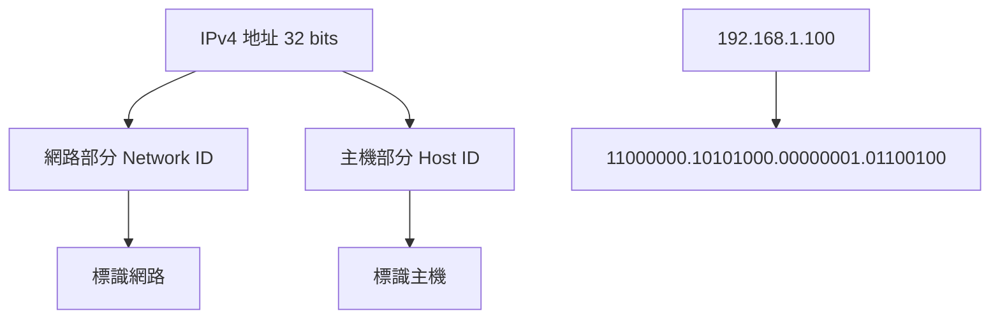
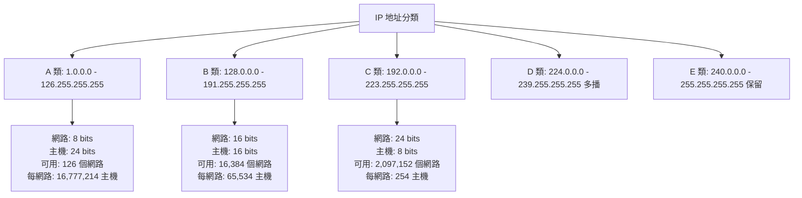
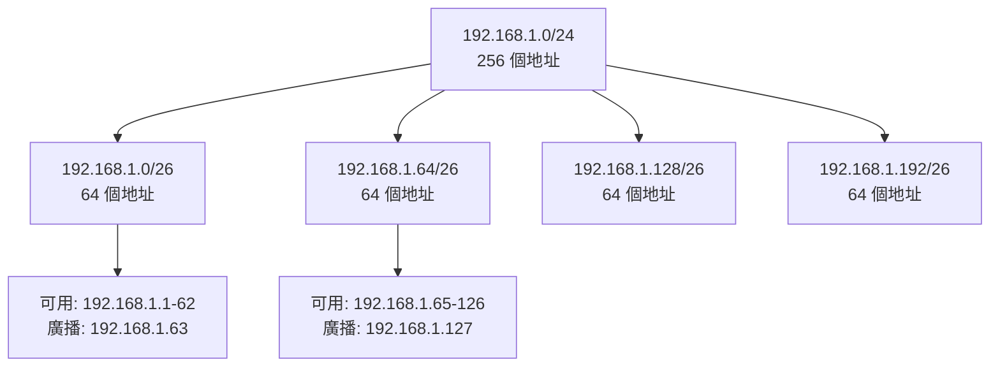
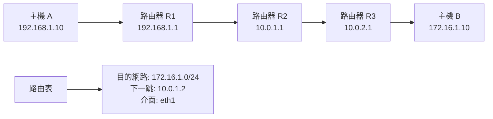
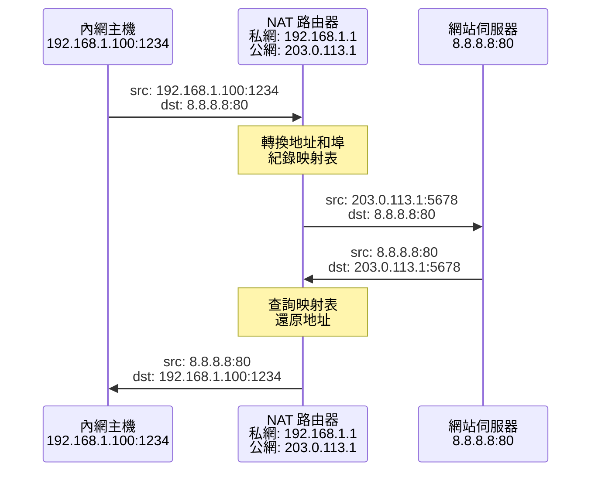
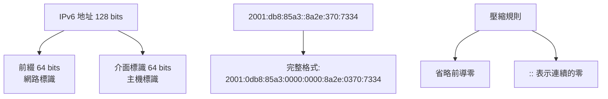
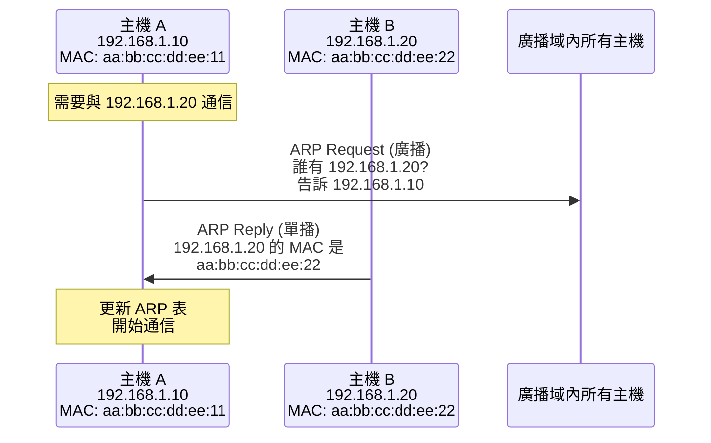
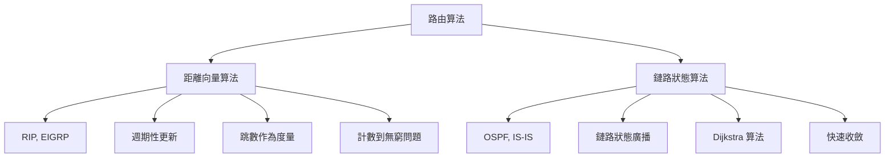
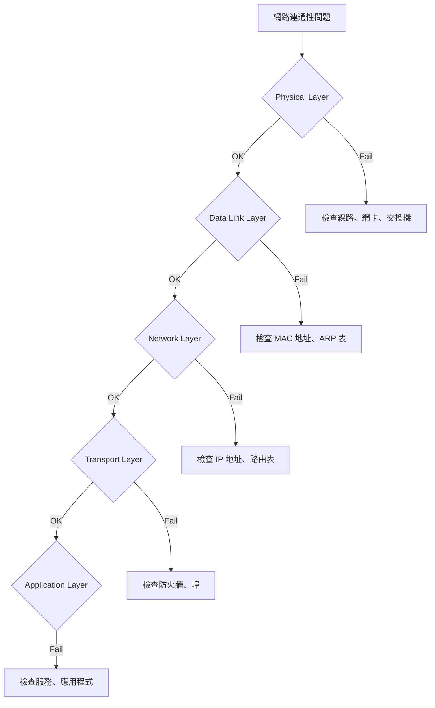

# 網路層

## 1. 網路層概述

### 1.1 網路層的作用

網路層是實現不同網路間互連的關鍵層級，主要功能：

- **邏輯定址**：提供全域唯一的 IP 地址
- **路由選擇**：決定封包從來源到目的地的最佳路徑
- **封包轉發**：在路由器間轉發封包
- **分片與重組**：處理不同網路的 MTU 差異
- **錯誤報告**：通過 ICMP 協議報告網路問題

### 1.2 主要協議

| 協議           | 作用    | 描述               |
| ------------ | ----- | ---------------- |
| **IP**       | 無連接傳輸 | 提供基本的封包傳輸服務      |
| **ICMP**     | 錯誤報告  | 網路診斷和錯誤通知        |
| **ARP**      | 地址解析  | IP 地址到 MAC 地址的映射 |
| **OSPF/BGP** | 路由協議  | 動態路由信息交換         |

---

## 2. IPv4 地址與定址

### 2.1 IPv4 地址結構

**基本格式**：32 位二進制，點分十進制表示法



### 2.2 傳統分類地址



### 2.3 CIDR 無分類地址

**CIDR (Classless Inter-Domain Routing)** 取代傳統分類：

```bash
# CIDR 表示法
192.168.1.0/24    # 網路位 24 bits，主機位 8 bits
10.0.0.0/8        # 網路位 8 bits，主機位 24 bits
172.16.0.0/16     # 網路位 16 bits，主機位 16 bits
```

**子網掩碼計算**：
- `/24` = `255.255.255.0`
- `/16` = `255.255.0.0`  
- `/8` = `255.0.0.0`

### 2.4 特殊 IP 地址

| 地址範圍             | 用途       | 說明           |
| ---------------- | -------- | ------------ |
| `127.0.0.0/8`    | 回環地址     | 本機通信         |
| `10.0.0.0/8`     | 私有地址 A 類 | 內網使用         |
| `172.16.0.0/12`  | 私有地址 B 類 | 內網使用         |
| `192.168.0.0/16` | 私有地址 C 類 | 內網使用         |
| `169.254.0.0/16` | 鏈路本地地址   | DHCP 失敗時自動配置 |
| `224.0.0.0/4`    | 多播地址     | 組播通信         |

### 2.5 Linux IP 地址管理

```bash
# 查看網路介面
ip addr show
ip a    # 簡寫

# 添加 IP 地址
sudo ip addr add 192.168.1.100/24 dev eth0

# 刪除 IP 地址
sudo ip addr del 192.168.1.100/24 dev eth0

# 啟用/禁用網路介面
sudo ip link set eth0 up
sudo ip link set eth0 down

# 查看網路介面統計
ip -s link show eth0
```

---

## 3. 子網劃分與 VLSM

### 3.1 子網劃分原理

**目的**：
- 有效利用 IP 地址空間
- 控制廣播域大小
- 提高網路安全性
- 便於網路管理

**範例**：將 `192.168.1.0/24` 劃分為 4 個子網



### 3.2 VLSM (Variable Length Subnet Mask)

**變長子網掩碼**允許在同一網路中使用不同長度的子網掩碼：

```bash
# 不同需求的子網
192.168.1.0/26    # 62 台主機 (部門 A)
192.168.1.64/27   # 30 台主機 (部門 B)  
192.168.1.96/28   # 14 台主機 (部門 C)
192.168.1.112/30  # 2 台主機 (點對點鏈路)
```

### 3.3 子網計算工具

```bash
# 使用 ipcalc 計算子網
sudo apt install ipcalc
ipcalc 192.168.1.0/24

# 使用 sipcalc (更詳細)
sudo apt install sipcalc  
sipcalc 192.168.1.0/24

# 手動計算範例
# 網路: 192.168.1.0/26
# 掩碼: 255.255.255.192 (11111111.11111111.11111111.11000000)
# 網路地址: 192.168.1.0
# 廣播地址: 192.168.1.63
# 可用主機: 192.168.1.1 - 192.168.1.62
```

---

## 4. 路由原理與實作

### 4.1 路由基本概念

**路由**：決定封包從來源到目的地經過的路徑



### 4.2 路由表結構

Linux 路由表包含：
- **目的網路** (Destination)
- **網路掩碼** (Netmask/Prefix)
- **閘道** (Gateway/Next Hop)
- **介面** (Interface)
- **跳數** (Metric)

```bash
# 查看路由表
ip route show
route -n    # 傳統命令

# 輸出範例
# default via 192.168.1.1 dev eth0
# 192.168.1.0/24 dev eth0 proto kernel scope link src 192.168.1.100
# 10.0.0.0/8 via 192.168.1.1 dev eth0
```

### 4.3 靜態路由設定

```bash
# 添加靜態路由
sudo ip route add 172.16.0.0/16 via 192.168.1.1
sudo ip route add 10.0.0.0/8 via 192.168.1.254 dev eth0

# 添加默認路由
sudo ip route add default via 192.168.1.1

# 刪除路由
sudo ip route del 172.16.0.0/16 via 192.168.1.1

# 永久設定 (Ubuntu/Debian)
cat >> /etc/netplan/01-network-config.yaml << EOF
network:
  version: 2
  ethernets:
    eth0:
      addresses: [192.168.1.100/24]
      gateway4: 192.168.1.1
      routes:
        - to: 172.16.0.0/16
          via: 192.168.1.254
EOF

sudo netplan apply
```

### 4.4 路由優先順序

**路由選擇原則**：
1. **最長前綴匹配** (Longest Prefix Match)
2. **管理距離** (Administrative Distance)  
3. **跳數** (Metric)

```bash
# 多條路由到同一目的地
ip route add 10.0.0.0/8 via 192.168.1.1 metric 100
ip route add 10.0.0.0/16 via 192.168.1.2 metric 50
ip route add 10.0.1.0/24 via 192.168.1.3 metric 10

# 到 10.0.1.100 的封包會選擇第三條路由 (最長前綴)
```

---

## 5. NAT 網路地址轉換

### 5.1 NAT 原理

**NAT (Network Address Translation)** 解決 IPv4 地址不足問題：



### 5.2 NAT 類型

**SNAT (Source NAT)**：
- 修改來源地址
- 用於內網訪問外網

**DNAT (Destination NAT)**：
- 修改目的地址  
- 用於外網訪問內網服務

**MASQUERADE**：
- 動態 SNAT
- 適用於動態 IP

### 5.3 Linux NAT 設定

```bash
# 啟用 IP 轉發
echo 1 > /proc/sys/net/ipv4/ip_forward
echo 'net.ipv4.ip_forward = 1' >> /etc/sysctl.conf

# iptables NAT 規則
# SNAT - 內網訪問外網
iptables -t nat -A POSTROUTING -s 192.168.1.0/24 -o eth0 -j SNAT --to-source 203.0.113.1

# MASQUERADE - 動態公網 IP
iptables -t nat -A POSTROUTING -s 192.168.1.0/24 -o eth0 -j MASQUERADE

# DNAT - 外網訪問內網服務 (埠轉發)
iptables -t nat -A PREROUTING -p tcp --dport 80 -j DNAT --to-destination 192.168.1.10:80
iptables -t nat -A PREROUTING -p tcp --dport 443 -j DNAT --to-destination 192.168.1.10:443

# 查看 NAT 表
iptables -t nat -L -n -v

# 查看連接追蹤
cat /proc/net/nf_conntrack
```

---

## 6. IPv6 基礎

### 6.1 IPv6 地址格式

**地址長度**：128 位，十六進制表示



### 6.2 IPv6 地址類型

| 類型 | 範圍 | 用途 |
|------|------|------|
| **單播** | 2000::/3 | 全域單播地址 |
| **鏈路本地** | fe80::/10 | 本地鏈路通信 |
| **唯一本地** | fc00::/7 | 私有地址 |
| **多播** | ff00::/8 | 組播地址 |
| **回環** | ::1/128 | 本機回環 |

### 6.3 IPv6 設定

```bash
# 查看 IPv6 地址
ip -6 addr show

# 添加 IPv6 地址
sudo ip -6 addr add 2001:db8::1/64 dev eth0

# IPv6 路由
ip -6 route show
sudo ip -6 route add 2001:db8:1::/64 via 2001:db8::1

# 啟用/停用 IPv6
echo 0 > /proc/sys/net/ipv6/conf/all/disable_ipv6  # 啟用
echo 1 > /proc/sys/net/ipv6/conf/all/disable_ipv6  # 停用

# IPv6 防火牆
ip6tables -L
```

---

## 7. ICMP 協議與網路診斷

### 7.1 ICMP 功能

**ICMP (Internet Control Message Protocol)** 用於：
- 錯誤報告
- 網路診斷
- 路徑 MTU 發現
- 時間同步

### 7.2 常用 ICMP 訊息類型

| 類型 | 代碼 | 描述 | 用途 |
|------|------|------|------|
| 0 | 0 | Echo Reply | ping 回應 |
| 3 | 0 | Destination Unreachable - Network | 網路不可達 |
| 3 | 1 | Destination Unreachable - Host | 主機不可達 |
| 3 | 3 | Destination Unreachable - Port | 埠不可達 |
| 8 | 0 | Echo Request | ping 請求 |
| 11 | 0 | Time Exceeded | TTL 超時 |

### 7.3 網路診斷工具

```bash
# ping - 測試連通性
ping -c 4 8.8.8.8
ping6 -c 4 2001:4860:4860::8888

# traceroute - 追蹤路由路徑
traceroute google.com
traceroute6 google.com

# 使用 UDP 而非 ICMP
traceroute -U google.com

# MTU 發現
ping -M do -s 1472 google.com    # IPv4
ping6 -M do -s 1452 google.com   # IPv6

# 路徑 MTU 發現
ip route get 8.8.8.8
```

---

## 8. ARP 協議

### 8.1 ARP 原理

**ARP (Address Resolution Protocol)** 將 IP 地址解析為 MAC 地址：



### 8.2 ARP 表管理

```bash
# 查看 ARP 表
arp -a
ip neighbor show

# 添加靜態 ARP 項目
sudo arp -s 192.168.1.100 aa:bb:cc:dd:ee:ff
sudo ip neighbor add 192.168.1.100 lladdr aa:bb:cc:dd:ee:ff dev eth0

# 刪除 ARP 項目
sudo arp -d 192.168.1.100
sudo ip neighbor del 192.168.1.100 dev eth0

# 清空 ARP 表
sudo ip neighbor flush all

# 查看 ARP 統計
cat /proc/net/arp
```

### 8.3 ARP 安全問題

**ARP 欺騙攻擊**：
- 攻擊者發送偽造的 ARP 回應
- 重定向流量到攻擊者主機
- 實現中間人攻擊

**防護措施**：
```bash
# 靜態 ARP 綁定
sudo arp -s 192.168.1.1 aa:bb:cc:dd:ee:01

# 監控 ARP 表變化
watch -n 1 'arp -a'

# 使用 arpwatch 監控
sudo apt install arpwatch
sudo arpwatch -i eth0
```

---

## 9. 路由協議基礎

### 9.1 靜態路由 vs 動態路由

**靜態路由**：
- 手動配置
- 簡單可靠
- 不能自動適應網路變化
- 適合小型網路

**動態路由**：
- 自動學習和更新
- 能適應網路變化
- 配置複雜
- 適合大型網路

### 9.2 距離向量 vs 鏈路狀態



### 9.3 Linux 路由守護程序

```bash
# 安裝 FRRouting (現代路由套件)
sudo apt install frr

# 啟用 OSPF
sudo vtysh
configure terminal
router ospf
network 192.168.1.0/24 area 0
exit
exit
write memory

# 查看 OSPF 狀態
show ip ospf neighbor
show ip ospf database
show ip route ospf
```

---

## 10. 實務故障排除

### 10.1 連通性問題排查

**分層排查法**：



### 10.2 常用診斷命令

```bash
# 1. 檢查本機網路配置
ip addr show
ip route show
cat /etc/resolv.conf    # DNS 設定

# 2. 測試本機回環
ping 127.0.0.1

# 3. 測試本網段
ping 192.168.1.1        # 默認閘道

# 4. 測試外網連通性
ping 8.8.8.8           # Google DNS
nslookup google.com    # DNS 解析

# 5. 追蹤路由路徑
traceroute google.com
mtr google.com         # 持續追蹤

# 6. 檢查埠連通性
telnet google.com 80
nc -zv google.com 80   # netcat

# 7. 抓包分析
sudo tcpdump -i any icmp         # ICMP 封包
sudo tcpdump -i eth0 host 8.8.8.8  # 特定主機
```

### 10.3 常見問題與解決

**問題 1**：無法上網
```bash
# 檢查步驟
1. ip addr show                    # IP 配置
2. ip route show                   # 路由表
3. ping $(ip route | awk '/default/ { print $3 }')  # 測試閘道
4. ping 8.8.8.8                   # 測試外網
5. nslookup google.com             # 測試 DNS
```

**問題 2**：部分網站無法訪問
```bash
# 可能原因
1. DNS 解析問題: nslookup domain.com
2. 路由問題: traceroute domain.com
3. MTU 問題: ping -M do -s 1472 domain.com
4. 防火牆阻擋: telnet domain.com 80/443
```

**問題 3**：網路速度慢
```bash
# 診斷步驟
1. iperf3 -c server_ip             # 頻寬測試
2. ss -i                           # 查看 TCP 狀態
3. netstat -s                      # 網路統計
4. tcpdump -i eth0                 # 封包分析
```

---

## 11. 效能優化

### 11.1 IP 層參數調校

```bash
# IPv4 轉發優化
sysctl net.ipv4.ip_forward=1
sysctl net.ipv4.conf.all.forwarding=1

# ARP 表大小
sysctl net.ipv4.neigh.default.gc_thresh1=1024
sysctl net.ipv4.neigh.default.gc_thresh2=2048
sysctl net.ipv4.neigh.default.gc_thresh3=4096

# IP 分片處理
sysctl net.ipv4.ipfrag_high_thresh=512000
sysctl net.ipv4.ipfrag_low_thresh=446464

# 路由表優化  
sysctl net.ipv4.route.max_size=2097152
```

### 11.2 路由效能優化

```bash
# 路由緩存
sysctl net.ipv4.route.gc_timeout=300

# 多路徑路由
ip route add 10.0.0.0/8 nexthop via 192.168.1.1 weight 1 \
                        nexthop via 192.168.1.2 weight 1

# 策略路由
ip rule add from 192.168.1.0/24 table 100
ip route add default via 192.168.1.1 table 100
```

---

## 12. 延伸學習

### 12.1 進階主題

- **MPLS (Multi-Protocol Label Switching)**：標籤交換
- **VPN 技術**：IPSec, L2TP, OpenVPN
- **SDN (Software Defined Networking)**：軟體定義網路
- **Network Namespace**：網路命名空間
- **VXLAN**：虛擬延伸區域網路

### 12.2 實務最佳實踐

**後端開發建議**：
1. 理解內網和外網 IP 的區別
2. 正確處理多網卡環境
3. 設計時考慮 NAT 和防火牆
4. 監控路由和連通性狀態
5. 預留 IP 地址空間用於擴展

---

**下一章預告**：深入探討應用層協議，重點介紹 HTTP/HTTPS 和 DNS 等後端開發核心協議。