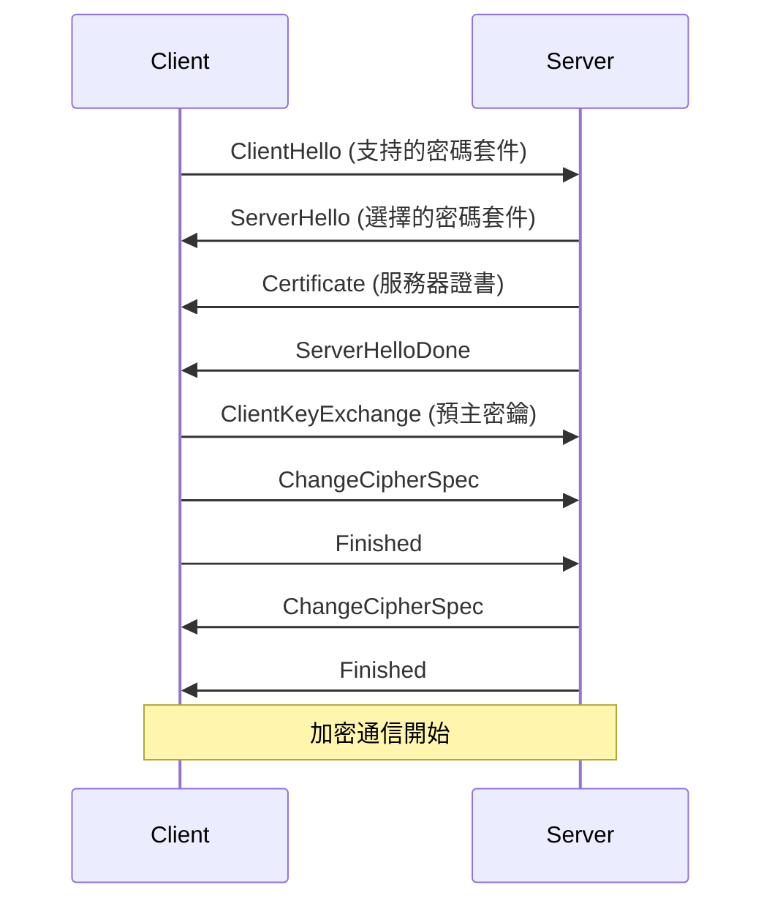
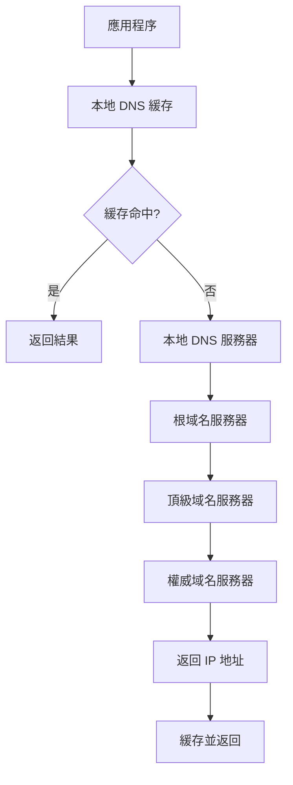

# 應用層協議

## HTTP/HTTPS 協議深入解析

### HTTP 協議基礎

HTTP (HyperText Transfer Protocol) 是應用層的無狀態協議，基於 TCP 連接。

#### HTTP 請求結構
```
GET /api/users HTTP/1.1
Host: example.com
User-Agent: curl/7.68.0
Accept: application/json
Content-Type: application/json
Content-Length: 25

{"username": "john"}
```

#### HTTP 響應結構
```
HTTP/1.1 200 OK
Content-Type: application/json
Content-Length: 45
Server: nginx/1.18.0

{"id": 123, "username": "john"}
```

### HTTP 方法與狀態碼

#### 常用 HTTP 方法
```bash
# GET - 獲取資源
curl -X GET https://api.example.com/users

# POST - 創建資源
curl -X POST -H "Content-Type: application/json" \
     -d '{"name":"john"}' https://api.example.com/users

# PUT - 更新資源
curl -X PUT -H "Content-Type: application/json" \
     -d '{"name":"jane"}' https://api.example.com/users/123

# DELETE - 刪除資源
curl -X DELETE https://api.example.com/users/123
```

#### 重要狀態碼分類
```
1xx - 資訊性響應
  100 Continue
  101 Switching Protocols

2xx - 成功響應
  200 OK
  201 Created
  204 No Content

3xx - 重定向
  301 Moved Permanently
  302 Found
  304 Not Modified

4xx - 客戶端錯誤
  400 Bad Request
  401 Unauthorized
  403 Forbidden
  404 Not Found
  429 Too Many Requests

5xx - 服務器錯誤
  500 Internal Server Error
  502 Bad Gateway
  503 Service Unavailable
  504 Gateway Timeout
```

### HTTP/1.1 vs HTTP/2 vs HTTP/3

| 特性                      | HTTP/1.1                    | HTTP/2                      | HTTP/3 (QUIC)                     |
| :---------------------- | :-------------------------- | :-------------------------- | :-------------------------------- |
| **傳輸層**                 | TCP                         | TCP                         | **UDP**                           |
| **主要連接模式**              | 串行 (單線程)                    | **多路復用** (單一連接)             | **多路復用** (單一連接)                   |
| **資料傳輸格式**              | 純文字 (Text)                  | **二進制** (Binary)            | **二進制** (Binary)                  |
| **隊頭阻塞 (HOL Blocking)** | **嚴重** (應用層和傳輸層)            | **有** (傳輸層 TCP)             | **消除** (基於 UDP 的 QUIC)            |
| **標頭壓縮**                | 無 (重複發送)                    | **HPACK 壓縮**                | **QPACK 壓縮** (更優化)                |
| **連接建立延遲**              | 需 3 次握手 (TCP) + 2 次握手 (TLS) | 需 3 次握手 (TCP) + 2 次握手 (TLS) | **0-RTT/1-RTT** (QUIC 內建 TLS 1.3) |
| **伺服器推送**               | 不支援                         | **支援 (Server Push)**        | **支援 (Server Push)**              |
| **連接遷移**                | 不支援                         | 不支援                         | **支援** (切換網路 IP/Port 連線不中斷)       |

##### 關鍵特性
1. **隊頭阻塞 (Head-of-Line Blocking, HOL Blocking)**
    * 定義： 隊伍中的第一個項目被卡住時，會連帶阻止後面所有項目被處理的現象。
    * HTTP/1.1 (應用層)： 單個連接內請求串行處理，前一個請求延遲會阻塞後續所有請求。
    * HTTP/2 (傳輸層)： 底層 TCP 協議要求封包按序交付。單個 TCP 封包丟失會導致整個連接上的所有多路復用資料流被阻塞，等待重傳。
    * HTTP/3 (消除)： QUIC 協定為每個資料流獨立處理丟包，單個資料流的丟失不影響其他資料流。

2. **多路復用 (Multiplexing)**
    * 定義： 在單一的實體連接上，同時處理多個獨立的邏輯資料流（多個請求/回應）的技術。
    * 優勢： 減少了建立多個連接的開銷和延遲。
    * 支援： HTTP/2 和 HTTP/3 都支援，而 HTTP/1.1 則需要多個連接。

3. **標頭壓縮 (Header Compression)**
    * 定義： 壓縮 HTTP 請求和回應中重複出現的標頭 (Headers) 資訊，以減少傳輸資料量。
    * HTTP/2 (HPACK)： 使用靜態表和動態表索引重複標頭。
    * HTTP/3 (QPACK)： 為 QUIC 優化，解決了 HPACK 在多路復用中可能導致的 HOL 阻塞問題。

4. **伺服器推送 (Server Push)**
    * 定義： 伺服器在客戶端尚未請求時，主動將預期會需要的資源推送到客戶端快取中。
    * 目的： 減少客戶端發現資源到發出請求之間的往返延遲 (Latency)。
    * 支援： HTTP/2 和 HTTP/3 原生支援。

5. **連接遷移 (Connection Migration)**
    * 定義： 在不中斷應用程式狀態的情況下，將網路連接從一組 IP/Port 切換到另一組的能力。
    * HTTP/1.1 & HTTP/2 (不支援)： IP 或 Port 改變會導致 TCP 連接中斷。
    * HTTP/3 (支援)： QUIC 使用連接 ID (Connection ID) 識別連接。即使切換網路（如 Wi-Fi 轉 4G），連接 ID 不變，實現無縫連接切換。

6. **QUIC (Quick UDP Internet Connections)**
    * 定義： HTTP/3 的底層傳輸協定，運行在 UDP 之上，集成了可靠性、加密 (TLS 1.3) 和多路復用功能。
    * 核心優勢： 獨立資料流設計，徹底解決了傳輸層的 HOL 阻塞；將 TLS 1.3 整合到握手，實現 0-RTT/1-RTT 快速連接建立。


#### HTTP/2 特性實例
```bash
# 啟用 HTTP/2 的 curl 請求
curl --http2 -v https://example.com

# 檢查服務器 HTTP/2 支持
curl -I --http2 https://example.com
```

### HTTPS 與 TLS/SSL

#### TLS 握手過程


#### 證書驗證與檢查
```bash
# 檢查證書資訊
openssl s_client -connect example.com:443 -servername example.com

# 查看證書詳細資訊
echo | openssl s_client -connect example.com:443 2>/dev/null | \
openssl x509 -noout -text

# 檢查證書過期時間
echo | openssl s_client -connect example.com:443 2>/dev/null | \
openssl x509 -noout -dates

# 驗證證書鏈
openssl verify -CAfile ca-bundle.crt server.crt
```

### HTTP 持久連接與連接池

#### 連接管理策略
```bash
# 檢查 HTTP 連接
netstat -an | grep :80
ss -tuln | grep :80

# 查看連接池狀態
curl -w "time_namelookup: %{time_namelookup}\n\
time_connect: %{time_connect}\n\
time_appconnect: %{time_appconnect}\n\
time_pretransfer: %{time_pretransfer}\n\
time_redirect: %{time_redirect}\n\
time_starttransfer: %{time_starttransfer}\n\
time_total: %{time_total}\n" \
-o /dev/null -s https://example.com
```

## DNS 域名解析系統

### DNS 查詢流程



### DNS 記錄類型

#### 常見記錄類型
```bash
# A 記錄 - IPv4 地址
dig example.com A

# AAAA 記錄 - IPv6 地址
dig example.com AAAA

# CNAME 記錄 - 別名
dig www.example.com CNAME

# MX 記錄 - 郵件交換
dig example.com MX

# TXT 記錄 - 文本記錄
dig example.com TXT

# NS 記錄 - 名稱服務器
dig example.com NS

# PTR 記錄 - 反向查詢
dig -x 8.8.8.8
```

### DNS 查詢與除錯

#### 使用 dig 進行詳細查詢
```bash
# 完整查詢過程
dig +trace example.com

# 查詢特定 DNS 服務器
dig @8.8.8.8 example.com

# 短格式輸出
dig +short example.com

# 反向查詢
dig +short -x 8.8.8.8

# 查詢所有記錄
dig example.com ANY
```

#### 使用 nslookup
```bash
# 基本查詢
nslookup example.com

# 指定記錄類型
nslookup -type=MX example.com

# 反向查詢
nslookup 8.8.8.8
```

#### 使用 host 命令
```bash
# 基本查詢
host example.com

# 詳細資訊
host -v example.com

# 所有記錄類型
host -a example.com
```

### DNS 緩存管理

#### 系統 DNS 緩存
```bash
# Ubuntu/Debian - 重啟 systemd-resolved
sudo systemctl restart systemd-resolved

# 清除 systemd-resolved 緩存
sudo systemd-resolve --flush-caches

# 查看 DNS 統計
sudo systemd-resolve --statistics

# CentOS/RHEL - 重啟 NetworkManager
sudo systemctl restart NetworkManager
```

#### 瀏覽器 DNS 緩存
```bash
# Chrome - 訪問 chrome://net-internals/#dns
# Firefox - 在地址欄輸入 about:networking#dns
```

### DNS 安全與 DoH/DoT

#### DNS over HTTPS (DoH)
```bash
# 使用 curl 進行 DoH 查詢
curl -H 'accept: application/dns-json' \
'https://cloudflare-dns.com/dns-query?name=example.com&type=A'

# 配置 DoH 服務器
# /etc/systemd/resolved.conf
[Resolve]
DNS=1.1.1.1#cloudflare-dns.com
DNSOverTLS=yes
```

#### DNS over TLS (DoT)
```bash
# 使用 kdig 進行 DoT 查詢
kdig +tls example.com @1.1.1.1

# 測試 DoT 連接
openssl s_client -connect 1.1.1.1:853
```

## 應用層協議除錯與監控

### HTTP 流量分析

#### 使用 tcpdump 捕獲 HTTP
```bash
# 捕獲 HTTP 流量
sudo tcpdump -i any -A 'port 80'

# 捕獲 HTTPS 握手
sudo tcpdump -i any 'port 443'

# 保存到文件
sudo tcpdump -i any -w http.pcap 'port 80'
```

#### 使用 Wireshark 分析
```bash
# 命令行 Wireshark
tshark -i any -f 'port 80' -V

# 過濾 HTTP 請求
tshark -i any -Y 'http.request.method=="GET"'
```

### 應用層性能監控

#### HTTP 請求時間分析
```bash
# 詳細時間分析
curl -w "@curl-format.txt" -o /dev/null -s https://example.com

# curl-format.txt 內容:
#     time_namelookup:  %{time_namelookup}\n
#        time_connect:  %{time_connect}\n
#     time_appconnect:  %{time_appconnect}\n
#    time_pretransfer:  %{time_pretransfer}\n
#       time_redirect:  %{time_redirect}\n
#  time_starttransfer:  %{time_starttransfer}\n
#                     ----------\n
#          time_total:  %{time_total}\n
```

#### DNS 解析時間監控
```bash
# 測量 DNS 解析時間
time nslookup example.com

# 使用 dig 測量
dig example.com | grep "Query time"
```

## 後端開發中的應用層協議

### RESTful API 設計原則

#### 資源導向設計
```bash
# 良好的 API 設計
GET    /api/users          # 獲取用戶列表
GET    /api/users/123      # 獲取特定用戶
POST   /api/users          # 創建用戶
PUT    /api/users/123      # 更新用戶
DELETE /api/users/123      # 刪除用戶

# 嵌套資源
GET    /api/users/123/posts     # 獲取用戶的文章
POST   /api/users/123/posts     # 為用戶創建文章
```

#### HTTP 緩存策略
```bash
# 設置緩存頭
Cache-Control: max-age=3600, public
ETag: "686897696a7c876b7e"
Last-Modified: Wed, 21 Oct 2015 07:28:00 GMT

# 條件請求
If-None-Match: "686897696a7c876b7e"
If-Modified-Since: Wed, 21 Oct 2015 07:28:00 GMT
```

### 常見問題與解決方案

#### HTTP 連接問題
```bash
# 檢查連接狀態
ss -tuln | grep :80
netstat -an | grep :80

# 檢查服務器響應
curl -I https://example.com

# 測試 HTTP/2 支持
curl -I --http2 https://example.com
```

#### DNS 解析問題
```bash
# 檢查 DNS 配置
cat /etc/resolv.conf

# 測試不同 DNS 服務器
dig @8.8.8.8 example.com
dig @1.1.1.1 example.com

# 檢查系統 DNS 緩存
sudo systemd-resolve --status
```

## 實戰練習

### 1. HTTP 服務器性能測試
```bash
# 使用 Apache Bench
ab -n 1000 -c 10 https://example.com/

# 使用 wrk
wrk -t12 -c400 -d30s https://example.com/

# 使用 hey
hey -n 1000 -c 50 https://example.com/
```

### 2. DNS 查詢優化測試
```bash
# 比較不同 DNS 服務器響應時間
for dns in 8.8.8.8 1.1.1.1 208.67.222.222; do
    echo "Testing $dns"
    dig @$dns example.com | grep "Query time"
done
```

### 3. HTTPS 證書監控
```bash
#!/bin/bash
# 證書過期監控腳本
domain="example.com"
expiry_date=$(echo | openssl s_client -connect $domain:443 -servername $domain 2>/dev/null | \
              openssl x509 -noout -enddate | cut -d= -f2)
echo "Certificate for $domain expires on: $expiry_date"
```

## 重點總結

1. **HTTP 協議理解**：掌握請求/響應結構、狀態碼含義
2. **HTTPS 安全性**：理解 TLS 握手過程和證書驗證
3. **DNS 解析機制**：熟悉查詢流程和記錄類型
4. **性能監控**：會使用各種工具分析應用層性能
5. **除錯技能**：能夠診斷和解決常見的應用層問題

## 下一章預告

下一章將深入探討 **Socket 程式設計與 I/O 模型**，學習如何在 Linux 環境下進行高效的網路程式設計。