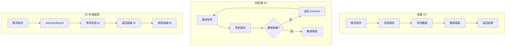

# Socket程式設計與IO模型

## Socket 基礎概念

### Socket 介紹

Socket 是網路程式設計的基礎接口，提供應用程序與網路協議棧的溝通橋梁。

#### Socket 類型
```c
// TCP Socket (SOCK_STREAM)
int tcp_socket = socket(AF_INET, SOCK_STREAM, 0);

// UDP Socket (SOCK_DGRAM)  
int udp_socket = socket(AF_INET, SOCK_DGRAM, 0);

// Unix Domain Socket
int unix_socket = socket(AF_UNIX, SOCK_STREAM, 0);
```

#### Socket 地址結構
```c
// IPv4 地址結構
struct sockaddr_in {
    sa_family_t    sin_family;  // AF_INET
    in_port_t      sin_port;    // 端口號 (網絡字節序)
    struct in_addr sin_addr;    // IPv4 地址
    char           sin_zero[8]; // 填充
};

// IPv6 地址結構
struct sockaddr_in6 {
    sa_family_t     sin6_family;   // AF_INET6
    in_port_t       sin6_port;     // 端口號
    uint32_t        sin6_flowinfo; // 流信息
    struct in6_addr sin6_addr;     // IPv6 地址
    uint32_t        sin6_scope_id; // 範圍 ID
};
```

## TCP Socket 程式設計

### TCP 服務器端程式設計

#### 完整的 TCP 服務器示例
```c
#include <sys/socket.h>
#include <netinet/in.h>
#include <arpa/inet.h>
#include <unistd.h>
#include <string.h>
#include <stdio.h>

#define PORT 8080
#define BUFFER_SIZE 1024

int create_tcp_server() {
    int server_fd, client_fd;
    struct sockaddr_in server_addr, client_addr;
    socklen_t client_len = sizeof(client_addr);
    char buffer[BUFFER_SIZE];
    
    // 1. 創建 socket
    server_fd = socket(AF_INET, SOCK_STREAM, 0);
    if (server_fd < 0) {
        perror("socket failed");
        return -1;
    }
    
    // 2. 設置 socket 選項
    // SO_REUSEADDR: 避免重啓時出現 "Address already in use"
    int opt = 1;
    if (setsockopt(server_fd, SOL_SOCKET, SO_REUSEADDR, &opt, sizeof(opt))) {
        perror("setsockopt failed");
        return -1;
    }
    
    // 3. 綁定 IP 與 Port
    memset(&server_addr, 0, sizeof(server_addr));
    server_addr.sin_family = AF_INET;
    server_addr.sin_addr.s_addr = INADDR_ANY; // 監聽所有網卡
    server_addr.sin_port = htons(PORT); // 主機序轉爲網路序
    
    if (bind(server_fd, (struct sockaddr*)&server_addr, sizeof(server_addr)) < 0) {
        perror("bind failed");
        return -1;
    }
    
    // 4. 監聽連接, 最多 10 個連線
    if (listen(server_fd, 10) < 0) {
        perror("listen failed");
        return -1;
    }
    
    printf("Server listening on port %d\n", PORT);
    
    // 5. 接受連接
    while (1) {
        client_fd = accept(server_fd, (struct sockaddr*)&client_addr, &client_len);
        if (client_fd < 0) {
            perror("accept failed");
            continue;
        }
        
        printf("Client connected: %s:%d\n", 
               inet_ntoa(client_addr.sin_addr), 
               ntohs(client_addr.sin_port));
        
        // 6. 處理客戶端請求
        while (1) {
            int bytes_read = recv(client_fd, buffer, BUFFER_SIZE-1, 0);
            if (bytes_read <= 0) break;
            
            buffer[bytes_read] = '\0';
            printf("Received: %s", buffer);
            
            // 回送數據
            send(client_fd, buffer, bytes_read, 0);
        }
        
        close(client_fd);
        printf("Client disconnected\n");
    }
    
    close(server_fd);
    return 0;
}
```

### TCP 客戶端程式設計

#### 完整的 TCP 客戶端示例
```c
#include <sys/socket.h>
#include <netinet/in.h>
#include <arpa/inet.h>
#include <unistd.h>
#include <string.h>
#include <stdio.h>

#define SERVER_IP "127.0.0.1"
#define SERVER_PORT 8080
#define BUFFER_SIZE 1024

int create_tcp_client() {
    int client_fd;
    struct sockaddr_in server_addr;
    char buffer[BUFFER_SIZE];
    
    // 1. 創建 socket
    client_fd = socket(AF_INET, SOCK_STREAM, 0);
    if (client_fd < 0) {
        perror("socket failed");
        return -1;
    }
    
    // 2. 設置服務器地址
    memset(&server_addr, 0, sizeof(server_addr));
    server_addr.sin_family = AF_INET;
    server_addr.sin_port = htons(SERVER_PORT);
    if (inet_pton(AF_INET, SERVER_IP, &server_addr.sin_addr) <= 0) { // inet_pton 將字串 ip 轉爲網路用的二進制格式
        perror("Invalid address");
        return -1;
    }
    
    // 3. 連接服務器
    if (connect(client_fd, (struct sockaddr*)&server_addr, sizeof(server_addr)) < 0) {
        perror("connect failed");
        return -1;
    }
    
    printf("Connected to server %s:%d\n", SERVER_IP, SERVER_PORT);
    
    // 4. 發送和接收數據
    while (1) {
        printf("Enter message (or 'quit' to exit): ");
        if (!fgets(buffer, BUFFER_SIZE, stdin)) break;
        
        if (strncmp(buffer, "quit", 4) == 0) break;
        
        // 發送數據
        int bytes_sent = send(client_fd, buffer, strlen(buffer), 0);
        if (bytes_sent < 0) {
            perror("send failed");
            break;
        }
        
        // 接收響應
        int bytes_received = recv(client_fd, buffer, BUFFER_SIZE-1, 0);
        if (bytes_received < 0) {
            perror("recv failed");
            break;
        }
        
        buffer[bytes_received] = '\0';
        printf("Server response: %s", buffer);
    }
    
    close(client_fd);
    return 0;
}
```

## UDP Socket 程式設計

### UDP 服務器端
```c
#include <sys/socket.h>
#include <netinet/in.h>
#include <arpa/inet.h>
#include <string.h>
#include <stdio.h>

#define PORT 8080
#define BUFFER_SIZE 1024

int create_udp_server() {
    int server_fd;
    struct sockaddr_in server_addr, client_addr;
    socklen_t client_len = sizeof(client_addr);
    char buffer[BUFFER_SIZE];
    
    // 創建 UDP socket
    server_fd = socket(AF_INET, SOCK_DGRAM, 0);
    if (server_fd < 0) {
        perror("socket failed");
        return -1;
    }
    
    // 綁定地址
    server_addr.sin_family = AF_INET;
    server_addr.sin_addr.s_addr = INADDR_ANY;
    server_addr.sin_port = htons(PORT);
    
    if (bind(server_fd, (struct sockaddr*)&server_addr, sizeof(server_addr)) < 0) {
        perror("bind failed");
        return -1;
    }
    
    printf("UDP Server listening on port %d\n", PORT);
    
    while (1) {
        // 接收數據
        int bytes_received = recvfrom(server_fd, buffer, BUFFER_SIZE-1, 0,
                                    (struct sockaddr*)&client_addr, &client_len);
        if (bytes_received < 0) {
            perror("recvfrom failed");
            continue;
        }
        
        buffer[bytes_received] = '\0';
        printf("Received from %s:%d: %s\n",
               inet_ntoa(client_addr.sin_addr),
               ntohs(client_addr.sin_port),
               buffer);
        
        // 發送響應
        sendto(server_fd, buffer, bytes_received, 0,
               (struct sockaddr*)&client_addr, client_len);
    }
    
    close(server_fd);
    return 0;
}
```

### UDP 客戶端
```c
int create_udp_client() {
    int client_fd;
    struct sockaddr_in server_addr;
    char buffer[BUFFER_SIZE];
    socklen_t server_len = sizeof(server_addr);
    
    // 創建 UDP socket
    client_fd = socket(AF_INET, SOCK_DGRAM, 0);
    if (client_fd < 0) {
        perror("socket failed");
        return -1;
    }
    
    // 設置服務器地址
    server_addr.sin_family = AF_INET;
    server_addr.sin_port = htons(SERVER_PORT);
    inet_pton(AF_INET, SERVER_IP, &server_addr.sin_addr);
    
    while (1) {
        printf("Enter message: ");
        if (!fgets(buffer, BUFFER_SIZE, stdin)) break;
        if (strncmp(buffer, "quit", 4) == 0) break;
        
        // 發送數據
        sendto(client_fd, buffer, strlen(buffer), 0,
               (struct sockaddr*)&server_addr, server_len);
        
        // 接收響應
        int bytes_received = recvfrom(client_fd, buffer, BUFFER_SIZE-1, 0,
                                    (struct sockaddr*)&server_addr, &server_len);
        buffer[bytes_received] = '\0';
        printf("Server response: %s", buffer);
    }
    
    close(client_fd);
    return 0;
}
```

## I/O 模型深入解析

### 五種 I/O 模型比較



### 1. 阻塞 I/O (Blocking I/O)

最簡單的 I/O 模型，應用程序發起系統調用後會被阻塞，直到數據準備好並複製到用戶空間。

```c
// 阻塞 I/O 示例
int blocking_io_example(int sockfd) {
    char buffer[1024];
    
    // 阻塞等待數據
    int n = recv(sockfd, buffer, sizeof(buffer), 0);
    if (n > 0) {
        buffer[n] = '\0';
        printf("Received: %s\n", buffer);
    }
    
    return n;
}
```

### 2. 非阻塞 I/O (Non-blocking I/O)

設置 socket 為非阻塞模式，系統調用立即返回。

```c
#include <fcntl.h>
#include <errno.h>

// 設置非阻塞模式
int set_nonblocking(int fd) {
    int flags = fcntl(fd, F_GETFL, 0);
    if (flags == -1) return -1;
    
    return fcntl(fd, F_SETFL, flags | O_NONBLOCK);
}

// 非阻塞 I/O 示例
int nonblocking_io_example(int sockfd) {
    char buffer[1024];
    
    // 設置非阻塞
    set_nonblocking(sockfd);
    
    while (1) {
        int n = recv(sockfd, buffer, sizeof(buffer), 0);
        
        if (n > 0) {
            // 有數據
            buffer[n] = '\0';
            printf("Received: %s\n", buffer);
            break;
        } else if (n == 0) {
            // 連接關閉
            printf("Connection closed\n");
            break;
        } else if (errno == EAGAIN || errno == EWOULDBLOCK) {
            // 無數據可讀，可以做其他事情
            printf("No data available, doing other work...\n");
            usleep(100000); // 模擬其他工作
            continue;
        } else {
            // 錯誤
            perror("recv failed");
            break;
        }
    }
    
    return 0;
}
```

### 3. I/O 多路復用 (I/O Multiplexing)

使用 select、poll 或 epoll 同時監控多個文件描述符。

#### select 示例
```c
#include <sys/select.h>

int select_example(int *sockfds, int num_socks) {
    fd_set readfds;
    int max_fd = 0;
    char buffer[1024];
    
    while (1) {
        // 初始化文件描述符集合
        FD_ZERO(&readfds);
        
        for (int i = 0; i < num_socks; i++) {
            FD_SET(sockfds[i], &readfds);
            if (sockfds[i] > max_fd) {
                max_fd = sockfds[i];
            }
        }
        
        // 設置超時
        struct timeval timeout;
        timeout.tv_sec = 1;
        timeout.tv_usec = 0;
        
        // 等待事件
        int ready = select(max_fd + 1, &readfds, NULL, NULL, &timeout);
        
        if (ready < 0) {
            perror("select failed");
            break;
        } else if (ready == 0) {
            printf("Timeout occurred\n");
            continue;
        }
        
        // 檢查哪些文件描述符就緒
        for (int i = 0; i < num_socks; i++) {
            if (FD_ISSET(sockfds[i], &readfds)) {
                int n = recv(sockfds[i], buffer, sizeof(buffer)-1, 0);
                if (n > 0) {
                    buffer[n] = '\0';
                    printf("Socket %d received: %s\n", sockfds[i], buffer);
                }
            }
        }
    }
    
    return 0;
}
```

#### poll 示例
```c
#include <poll.h>

int poll_example(int *sockfds, int num_socks) {
    struct pollfd *pollfds = malloc(num_socks * sizeof(struct pollfd));
    char buffer[1024];
    
    // 初始化 pollfd 結構
    for (int i = 0; i < num_socks; i++) {
        pollfds[i].fd = sockfds[i];
        pollfds[i].events = POLLIN;  // 監聽可讀事件
        pollfds[i].revents = 0;
    }
    
    while (1) {
        // 等待事件，超時 1 秒
        int ready = poll(pollfds, num_socks, 1000);
        
        if (ready < 0) {
            perror("poll failed");
            break;
        } else if (ready == 0) {
            printf("Timeout occurred\n");
            continue;
        }
        
        // 檢查事件
        for (int i = 0; i < num_socks; i++) {
            if (pollfds[i].revents & POLLIN) {
                int n = recv(pollfds[i].fd, buffer, sizeof(buffer)-1, 0);
                if (n > 0) {
                    buffer[n] = '\0';
                    printf("Socket %d received: %s\n", pollfds[i].fd, buffer);
                }
                pollfds[i].revents = 0;  // 重置事件
            }
        }
    }
    
    free(pollfds);
    return 0;
}
```

#### epoll 示例 (Linux 專用)
```c
#include <sys/epoll.h>

#define MAX_EVENTS 10

int epoll_example(int *sockfds, int num_socks) {
    int epfd = epoll_create1(0);
    if (epfd == -1) {
        perror("epoll_create1 failed");
        return -1;
    }
    
    struct epoll_event event, events[MAX_EVENTS];
    char buffer[1024];
    
    // 添加文件描述符到 epoll
    for (int i = 0; i < num_socks; i++) {
        event.events = EPOLLIN;  // 監聽可讀事件
        event.data.fd = sockfds[i];
        
        if (epoll_ctl(epfd, EPOLL_CTL_ADD, sockfds[i], &event) == -1) {
            perror("epoll_ctl failed");
            close(epfd);
            return -1;
        }
    }
    
    while (1) {
        // 等待事件
        int nfds = epoll_wait(epfd, events, MAX_EVENTS, 1000);
        
        if (nfds == -1) {
            perror("epoll_wait failed");
            break;
        }
        
        for (int i = 0; i < nfds; i++) {
            if (events[i].events & EPOLLIN) {
                int fd = events[i].data.fd;
                int n = recv(fd, buffer, sizeof(buffer)-1, 0);
                
                if (n > 0) {
                    buffer[n] = '\0';
                    printf("Socket %d received: %s\n", fd, buffer);
                } else if (n == 0) {
                    // 連接關閉，從 epoll 中移除
                    printf("Socket %d closed\n", fd);
                    epoll_ctl(epfd, EPOLL_CTL_DEL, fd, NULL);
                    close(fd);
                }
            }
        }
    }
    
    close(epfd);
    return 0;
}
```

### 4. 信號驅動 I/O (Signal-driven I/O)

使用信號通知數據就緒。

```c
#include <signal.h>

void sigio_handler(int sig) {
    printf("SIGIO signal received\n");
    // 處理 I/O 操作
}

int sigio_example(int sockfd) {
    // 設置信號處理器
    signal(SIGIO, sigio_handler);
    
    // 設置異步 I/O
    fcntl(sockfd, F_SETOWN, getpid());
    int flags = fcntl(sockfd, F_GETFL);
    fcntl(sockfd, F_SETFL, flags | O_ASYNC);
    
    // 主程序可以做其他事情
    while (1) {
        printf("Doing other work...\n");
        sleep(1);
    }
    
    return 0;
}
```

### 5. 異步 I/O (Asynchronous I/O)

真正的異步 I/O，系統負責數據複製。

```c
#include <aio.h>

int aio_example(int fd) {
    struct aiocb aio_req;
    char buffer[1024];
    
    // 初始化 aiocb 結構
    memset(&aio_req, 0, sizeof(aio_req));
    aio_req.aio_fildes = fd;
    aio_req.aio_buf = buffer;
    aio_req.aio_nbytes = sizeof(buffer);
    aio_req.aio_offset = 0;
    
    // 發起異步讀取
    if (aio_read(&aio_req) == -1) {
        perror("aio_read failed");
        return -1;
    }
    
    // 做其他工作
    while (aio_error(&aio_req) == EINPROGRESS) {
        printf("Doing other work while I/O is in progress...\n");
        sleep(1);
    }
    
    // 獲取結果
    ssize_t bytes_read = aio_return(&aio_req);
    if (bytes_read > 0) {
        buffer[bytes_read] = '\0';
        printf("Async read completed: %s\n", buffer);
    }
    
    return 0;
}
```

## 高級 Socket 程式設計技巧

### Socket 選項設置

```c
#include <sys/socket.h>
#include <netinet/tcp.h>

int configure_socket_options(int sockfd) {
    int opt;
    
    // SO_REUSEADDR - 允許重用地址
    opt = 1;
    setsockopt(sockfd, SOL_SOCKET, SO_REUSEADDR, &opt, sizeof(opt));
    
    // SO_REUSEPORT - 允許重用端口 (Linux 3.9+)
    opt = 1;
    setsockopt(sockfd, SOL_SOCKET, SO_REUSEPORT, &opt, sizeof(opt));
    
    // SO_KEEPALIVE - 啟用心跳機制
    opt = 1;
    setsockopt(sockfd, SOL_SOCKET, SO_KEEPALIVE, &opt, sizeof(opt));
    
    // TCP_NODELAY - 禁用 Nagle 算法
    opt = 1;
    setsockopt(sockfd, IPPROTO_TCP, TCP_NODELAY, &opt, sizeof(opt));
    
    // SO_SNDBUF - 設置發送緩衝區大小
    opt = 64 * 1024;  // 64KB
    setsockopt(sockfd, SOL_SOCKET, SO_SNDBUF, &opt, sizeof(opt));
    
    // SO_RCVBUF - 設置接收緩衝區大小
    opt = 64 * 1024;  // 64KB
    setsockopt(sockfd, SOL_SOCKET, SO_RCVBUF, &opt, sizeof(opt));
    
    // SO_LINGER - 設置關閉行為
    struct linger ling;
    ling.l_onoff = 1;   // 啟用 linger
    ling.l_linger = 5;  // 等待 5 秒
    setsockopt(sockfd, SOL_SOCKET, SO_LINGER, &ling, sizeof(ling));
    
    return 0;
}
```

### 錯誤處理與異常情況

```c
#include <errno.h>

int robust_recv(int sockfd, char *buffer, size_t size) {
    int total_received = 0;
    int bytes_received;
    
    while (total_received < size) {
        bytes_received = recv(sockfd, buffer + total_received, 
                            size - total_received, 0);
        
        if (bytes_received > 0) {
            total_received += bytes_received;
        } else if (bytes_received == 0) {
            // 連接關閉
            printf("Connection closed by peer\n");
            break;
        } else {
            // 錯誤處理
            if (errno == EAGAIN || errno == EWOULDBLOCK) {
                // 非阻塞模式下暫時無數據
                continue;
            } else if (errno == EINTR) {
                // 被信號中斷，重試
                continue;
            } else {
                // 其他錯誤
                perror("recv failed");
                return -1;
            }
        }
    }
    
    return total_received;
}

int robust_send(int sockfd, const char *buffer, size_t size) {
    int total_sent = 0;
    int bytes_sent;
    
    while (total_sent < size) {
        bytes_sent = send(sockfd, buffer + total_sent, 
                         size - total_sent, MSG_NOSIGNAL);
        
        if (bytes_sent > 0) {
            total_sent += bytes_sent;
        } else if (bytes_sent == 0) {
            // 不應該發生
            break;
        } else {
            if (errno == EAGAIN || errno == EWOULDBLOCK) {
                // 發送緩衝區滿，稍後重試
                usleep(1000);  // 等待 1ms
                continue;
            } else if (errno == EINTR) {
                // 被信號中斷，重試
                continue;
            } else if (errno == EPIPE) {
                // 連接已斷開
                printf("Connection broken (EPIPE)\n");
                return -1;
            } else {
                perror("send failed");
                return -1;
            }
        }
    }
    
    return total_sent;
}
```

## 實戰應用案例

### 高併發 Echo 服務器

```c
#include <sys/epoll.h>
#include <fcntl.h>
#include <unistd.h>
#include <stdlib.h>
#include <string.h>
#include <stdio.h>
#include <errno.h>

#define MAX_EVENTS 1000
#define BUFFER_SIZE 4096
#define PORT 8080

typedef struct {
    int fd;
    char *read_buffer;
    int read_pos;
    char *write_buffer;
    int write_pos;
    int write_len;
} connection_t;

int set_nonblocking(int fd) {
    int flags = fcntl(fd, F_GETFL, 0);
    if (flags == -1) return -1;
    return fcntl(fd, F_SETFL, flags | O_NONBLOCK);
}

connection_t* create_connection(int fd) {
    connection_t *conn = malloc(sizeof(connection_t));
    if (!conn) return NULL;
    
    conn->fd = fd;
    conn->read_buffer = malloc(BUFFER_SIZE);
    conn->write_buffer = malloc(BUFFER_SIZE);
    conn->read_pos = 0;
    conn->write_pos = 0;
    conn->write_len = 0;
    
    return conn;
}

void destroy_connection(connection_t *conn) {
    if (conn) {
        close(conn->fd);
        free(conn->read_buffer);
        free(conn->write_buffer);
        free(conn);
    }
}

int handle_read(connection_t *conn, int epfd) {
    int bytes_read = recv(conn->fd, 
                         conn->read_buffer + conn->read_pos,
                         BUFFER_SIZE - conn->read_pos - 1, 0);
    
    if (bytes_read > 0) {
        conn->read_pos += bytes_read;
        conn->read_buffer[conn->read_pos] = '\0';
        
        // 查找完整的行
        char *line_end = strchr(conn->read_buffer, '\n');
        if (line_end) {
            int line_len = line_end - conn->read_buffer + 1;
            
            // 複製到寫緩衝區
            memcpy(conn->write_buffer, conn->read_buffer, line_len);
            conn->write_len = line_len;
            conn->write_pos = 0;
            
            // 移動剩餘數據
            memmove(conn->read_buffer, line_end + 1, 
                   conn->read_pos - line_len);
            conn->read_pos -= line_len;
            
            // 修改 epoll 事件為寫
            struct epoll_event event;
            event.events = EPOLLOUT | EPOLLET;
            event.data.ptr = conn;
            epoll_ctl(epfd, EPOLL_CTL_MOD, conn->fd, &event);
        }
        
        return 0;
    } else if (bytes_read == 0) {
        // 連接關閉
        return -1;
    } else if (errno != EAGAIN && errno != EWOULDBLOCK) {
        perror("recv failed");
        return -1;
    }
    
    return 0;
}

int handle_write(connection_t *conn, int epfd) {
    int bytes_sent = send(conn->fd,
                         conn->write_buffer + conn->write_pos,
                         conn->write_len - conn->write_pos, 0);
    
    if (bytes_sent > 0) {
        conn->write_pos += bytes_sent;
        
        if (conn->write_pos >= conn->write_len) {
            // 寫完成，切換回讀模式
            struct epoll_event event;
            event.events = EPOLLIN | EPOLLET;
            event.data.ptr = conn;
            epoll_ctl(epfd, EPOLL_CTL_MOD, conn->fd, &event);
        }
        
        return 0;
    } else if (bytes_sent == 0) {
        return -1;
    } else if (errno != EAGAIN && errno != EWOULDBLOCK) {
        perror("send failed");
        return -1;
    }
    
    return 0;
}

int create_echo_server() {
    int server_fd, epfd;
    struct sockaddr_in server_addr;
    struct epoll_event event, events[MAX_EVENTS];
    
    // 創建服務器 socket
    server_fd = socket(AF_INET, SOCK_STREAM, 0);
    if (server_fd == -1) {
        perror("socket failed");
        return -1;
    }
    
    // 設置 socket 選項
    int opt = 1;
    setsockopt(server_fd, SOL_SOCKET, SO_REUSEADDR, &opt, sizeof(opt));
    set_nonblocking(server_fd);
    
    // 綁定地址
    server_addr.sin_family = AF_INET;
    server_addr.sin_addr.s_addr = INADDR_ANY;
    server_addr.sin_port = htons(PORT);
    
    if (bind(server_fd, (struct sockaddr*)&server_addr, sizeof(server_addr)) == -1) {
        perror("bind failed");
        return -1;
    }
    
    if (listen(server_fd, SOMAXCONN) == -1) {
        perror("listen failed");
        return -1;
    }
    
    // 創建 epoll
    epfd = epoll_create1(0);
    if (epfd == -1) {
        perror("epoll_create1 failed");
        return -1;
    }
    
    // 添加服務器 socket 到 epoll
    event.events = EPOLLIN;
    event.data.fd = server_fd;
    epoll_ctl(epfd, EPOLL_CTL_ADD, server_fd, &event);
    
    printf("Echo server listening on port %d\n", PORT);
    
    while (1) {
        int nfds = epoll_wait(epfd, events, MAX_EVENTS, -1);
        
        for (int i = 0; i < nfds; i++) {
            if (events[i].data.fd == server_fd) {
                // 新連接
                struct sockaddr_in client_addr;
                socklen_t client_len = sizeof(client_addr);
                
                int client_fd = accept(server_fd, 
                                     (struct sockaddr*)&client_addr, 
                                     &client_len);
                if (client_fd == -1) {
                    if (errno != EAGAIN && errno != EWOULDBLOCK) {
                        perror("accept failed");
                    }
                    continue;
                }
                
                set_nonblocking(client_fd);
                
                connection_t *conn = create_connection(client_fd);
                if (!conn) {
                    close(client_fd);
                    continue;
                }
                
                event.events = EPOLLIN | EPOLLET;
                event.data.ptr = conn;
                epoll_ctl(epfd, EPOLL_CTL_ADD, client_fd, &event);
                
                printf("New connection: %d\n", client_fd);
            } else {
                // 客戶端事件
                connection_t *conn = (connection_t*)events[i].data.ptr;
                
                if (events[i].events & EPOLLIN) {
                    if (handle_read(conn, epfd) == -1) {
                        epoll_ctl(epfd, EPOLL_CTL_DEL, conn->fd, NULL);
                        printf("Connection closed: %d\n", conn->fd);
                        destroy_connection(conn);
                    }
                } else if (events[i].events & EPOLLOUT) {
                    if (handle_write(conn, epfd) == -1) {
                        epoll_ctl(epfd, EPOLL_CTL_DEL, conn->fd, NULL);
                        printf("Connection closed: %d\n", conn->fd);
                        destroy_connection(conn);
                    }
                }
            }
        }
    }
    
    close(server_fd);
    close(epfd);
    return 0;
}
```

## 性能優化技巧

### 零拷貝技術

```c
#include <sys/sendfile.h>

// 使用 sendfile 實現零拷貝文件傳輸
ssize_t zero_copy_file_transfer(int out_fd, int in_fd, off_t offset, size_t count) {
    return sendfile(out_fd, in_fd, &offset, count);
}

// 使用 splice 進行管道零拷貝
ssize_t zero_copy_pipe_transfer(int fd_in, int fd_out, size_t len) {
    int pipefd[2];
    if (pipe(pipefd) == -1) {
        return -1;
    }
    
    ssize_t bytes = splice(fd_in, NULL, pipefd[1], NULL, len, SPLICE_F_MOVE);
    if (bytes > 0) {
        bytes = splice(pipefd[0], NULL, fd_out, NULL, bytes, SPLICE_F_MOVE);
    }
    
    close(pipefd[0]);
    close(pipefd[1]);
    
    return bytes;
}
```

### 記憶體映射 I/O

```c
#include <sys/mman.h>

int mmap_file_example(const char *filename) {
    int fd = open(filename, O_RDONLY);
    if (fd == -1) {
        perror("open failed");
        return -1;
    }
    
    struct stat st;
    if (fstat(fd, &st) == -1) {
        perror("fstat failed");
        close(fd);
        return -1;
    }
    
    void *map = mmap(NULL, st.st_size, PROT_READ, MAP_PRIVATE, fd, 0);
    if (map == MAP_FAILED) {
        perror("mmap failed");
        close(fd);
        return -1;
    }
    
    // 使用映射的記憶體
    char *data = (char*)map;
    printf("File content: %.*s\n", (int)st.st_size, data);
    
    // 解除映射
    munmap(map, st.st_size);
    close(fd);
    
    return 0;
}
```

## 測試與除錯

### Socket 程式除錯技巧

```bash
# 查看 socket 狀態
ss -tuln
netstat -tuln

# 查看進程的文件描述符
ls -la /proc/<pid>/fd/

# 監控網路流量
sudo tcpdump -i any port 8080

# 測試連接
telnet localhost 8080
nc localhost 8080

# 壓力測試
ab -n 1000 -c 10 http://localhost:8080/
```

### 常見問題排查

```c
// 檢查 socket 錯誤
int check_socket_error(int sockfd) {
    int error;
    socklen_t len = sizeof(error);
    
    if (getsockopt(sockfd, SOL_SOCKET, SO_ERROR, &error, &len) == -1) {
        perror("getsockopt failed");
        return -1;
    }
    
    if (error != 0) {
        printf("Socket error: %s\n", strerror(error));
        return -1;
    }
    
    return 0;
}

// 檢查連接狀態
int check_connection_status(int sockfd) {
    char buffer[1];
    int result = recv(sockfd, buffer, 1, MSG_PEEK | MSG_DONTWAIT);
    
    if (result == 0) {
        printf("Connection closed by peer\n");
        return 0;  // 連接關閉
    } else if (result == -1) {
        if (errno == EAGAIN || errno == EWOULDBLOCK) {
            return 1;  // 連接正常，無數據
        } else {
            perror("Connection error");
            return -1;  // 連接錯誤
        }
    } else {
        return 1;  // 連接正常，有數據
    }
}
```

## 重點總結

1. **Socket 基礎**：理解 TCP/UDP socket 程式設計模式
2. **I/O 模型**：掌握五種 I/O 模型的差異和適用場景
3. **多路復用**：熟練使用 epoll 進行高併發處理
4. **錯誤處理**：完善的異常處理和連接管理
5. **性能優化**：零拷貝、記憶體映射等高級技術

## 下一章預告

下一章將學習 **Linux 網路工具與除錯**，掌握各種網路診斷和性能分析工具的使用方法。