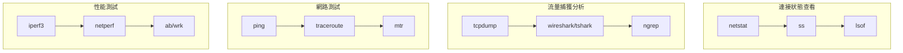

# Linux網路工具與除錯

## 網路監控與診斷工具概覽

Linux 提供了豐富的網路工具用於監控、診斷和除錯網路問題。掌握這些工具是後端開發者的必備技能。



## 連接狀態查看工具

### netstat - 經典網路統計工具

#### 基本用法
```bash
# 顯示所有連接
netstat -a

# 顯示監聽端口
netstat -l

# 顯示 TCP 連接
netstat -t

# 顯示 UDP 連接
netstat -u

# 不解析主機名 (加快速度)
netstat -n

# 顯示進程信息
netstat -p

# 常用組合：顯示所有 TCP 監聽端口
netstat -tln

# 顯示網路統計信息
netstat -s

# 顯示路由表
netstat -r
```

#### 實用示例
```bash
# 查看特定端口的連接
netstat -an | grep :80

# 查看連接數統計
netstat -an | awk '/^tcp/ {print $6}' | sort | uniq -c

# 查看哪些進程在監聽端口
netstat -tlnp

# 查看特定進程的網路連接
netstat -p | grep nginx

# 檢查 TIME_WAIT 連接數
netstat -an | grep TIME_WAIT | wc -l
```

### ss - 現代化的 socket 統計工具

ss 是 netstat 的現代化替代品，速度更快，功能更強大。

#### 基本用法
```bash
# 顯示所有 socket
ss -a

# 顯示監聽中的 socket
ss -l

# 顯示 TCP socket
ss -t

# 顯示 UDP socket
ss -u

# 顯示進程信息
ss -p

# 數字格式顯示 (不解析)
ss -n

# 常用組合
ss -tuln  # TCP/UDP 監聽端口
ss -tupn  # 所有 TCP/UDP 連接包含進程
```

#### 高級過濾功能
```bash
# 顯示特定狀態的連接
ss -t state established
ss -t state listen
ss -t state time-wait

# 顯示特定端口
ss -tuln sport = :80
ss -tuln dport = :3306

# 端口範圍過濾
ss -tuln sport ge :1024

# 顯示特定 IP 的連接
ss -t dst 192.168.1.100

# 組合條件
ss -t state established '( dport = :80 or dport = :443 )'

# 顯示詳細信息
ss -i  # 顯示內部信息
ss -e  # 顯示擴展信息
ss -m  # 顯示記憶體使用
```

#### 實用示例
```bash
# 監控連接變化
watch -n 1 'ss -t state established | wc -l'

# 查看 TCP 重傳
ss -i | grep -E "(unacked|retrans)"

# 查看擁塞窗口信息
ss -i | grep cwnd

# 統計不同狀態的連接數
ss -t -a | awk 'NR>1 {print $1}' | sort | uniq -c

# 查看佔用特定端口的進程
ss -tlnp | grep :8080
```

### lsof - 列出打開文件 (包括網路連接)

```bash
# 顯示所有網路連接
lsof -i

# 顯示特定端口
lsof -i :80
lsof -i :8080-8090  # 端口範圍

# 顯示特定協議
lsof -i tcp
lsof -i udp

# 顯示特定進程的網路連接
lsof -p <pid> -i

# 顯示特定用戶的網路連接
lsof -u username -i

# 顯示監聽端口
lsof -i -sTCP:LISTEN

# 實時監控
lsof -i -r 2  # 每 2 秒刷新一次
```

## 流量捕獲與分析工具

### tcpdump - 命令行封包捕獲工具

#### 基本語法
```bash
tcpdump [選項] [過濾表達式]
```

#### 常用選項
```bash
# -i: 指定網路接口
tcpdump -i eth0

# -n: 不解析主機名
tcpdump -n

# -v/-vv/-vvv: 詳細輸出
tcpdump -v

# -c: 捕獲指定數量的封包
tcpdump -c 100

# -w: 保存到文件
tcpdump -w capture.pcap

# -r: 從文件讀取
tcpdump -r capture.pcap

# -A: 以 ASCII 格式顯示封包內容
tcpdump -A

# -X: 以 hex 和 ASCII 格式顯示
tcpdump -X
```

#### 過濾表達式示例
```bash
# 基本過濾
tcpdump host 192.168.1.1
tcpdump net 192.168.1.0/24
tcpdump port 80
tcpdump portrange 8000-8080

# 協議過濾
tcpdump tcp
tcpdump udp
tcpdump icmp
tcpdump arp

# 方向過濾
tcpdump src host 192.168.1.1
tcpdump dst port 80

# 組合過濾 (使用 and, or, not)
tcpdump tcp and port 80
tcpdump host 192.168.1.1 and not port 22
tcpdump '(tcp port 80 or tcp port 443) and host example.com'

# 複雜過濾
tcpdump 'tcp[tcpflags] & (tcp-syn|tcp-fin) != 0'  # SYN 或 FIN 標志
tcpdump 'tcp[13] & 2 != 0'  # SYN 封包
tcpdump 'tcp[13] & 1 != 0'  # FIN 封包
```

#### 實戰示例
```bash
# 捕獲特定端口的 HTTP 流量
sudo tcpdump -i any -A 'port 80'

# 捕獲 HTTPS 握手
sudo tcpdump -i any 'port 443 and tcp[13] & 2 != 0'

# 監控 DNS 查詢
sudo tcpdump -i any 'port 53'

# 捕獲大封包 (可能的問題)
sudo tcpdump -i any 'greater 1500'

# 監控特定主機的所有流量
sudo tcpdump -i any host 192.168.1.100

# 保存捕獲數據供後續分析
sudo tcpdump -i any -w traffic.pcap 'port 80 or port 443'

# 實時顯示 HTTP 請求
sudo tcpdump -i any -A -s 0 'tcp port 80 and (((ip[2:2] - ((ip[0]&0xf)<<2)) - ((tcp[12]&0xf0)>>2)) != 0)'
```

### Wireshark/tshark - 強大的封包分析工具

#### tshark 命令行使用
```bash
# 基本捕獲
tshark -i eth0

# 顯示特定協議
tshark -i eth0 -f "tcp port 80"

# 保存到文件
tshark -i eth0 -w capture.pcap

# 從文件分析
tshark -r capture.pcap

# 顯示特定字段
tshark -r capture.pcap -T fields -e ip.src -e ip.dst -e tcp.port

# 統計分析
tshark -r capture.pcap -q -z conv,tcp
tshark -r capture.pcap -q -z io,stat,1  # 每秒統計

# HTTP 分析
tshark -r capture.pcap -Y "http.request" \
       -T fields -e ip.src -e http.host -e http.request.uri

# 找出 TCP 重傳
tshark -r capture.pcap -Y "tcp.analysis.retransmission"

# 找出 TCP 亂序
tshark -r capture.pcap -Y "tcp.analysis.out_of_order"
```

### ngrep - 網路層的 grep

```bash
# 基本使用
ngrep -q -i "GET" port 80

# 匹配特定字符串
ngrep -q -i "password" port 80

# 保存匹配結果
ngrep -q -i "error" port 80 -O output.txt

# 指定接口
ngrep -d eth0 -q -i "POST" port 80

# 十六進制模式
ngrep -q -x "474554" port 80  # "GET" 的十六進制
```

## 網路連通性測試工具

### ping - ICMP 回聲測試

```bash
# 基本 ping
ping google.com

# 指定次數
ping -c 4 google.com

# 指定間隔 (秒)
ping -i 0.5 google.com

# 指定封包大小
ping -s 1472 google.com

# 設置超時時間
ping -W 2 google.com

# IPv6 ping
ping6 ipv6.google.com

# 批量 ping
for i in {1..10}; do
    ping -c 1 -W 1 192.168.1.$i | grep "64 bytes" || echo "192.168.1.$i is down"
done
```

### traceroute/tracepath - 路由追蹤

```bash
# 基本路由追蹤
traceroute google.com

# 使用 TCP 而非 ICMP
traceroute -T google.com

# 指定端口
traceroute -p 80 google.com

# 不解析主機名
traceroute -n google.com

# tracepath (不需要 root 權限)
tracepath google.com
```

### mtr - 結合 ping 和 traceroute

```bash
# 基本使用
mtr google.com

# 報告模式 (非交互)
mtr --report --report-cycles 10 google.com

# 指定封包數
mtr -c 50 google.com

# 顯示 AS 信息
mtr --aslookup google.com

# 保存結果
mtr --report --report-cycles 100 google.com > mtr_result.txt
```

## 網路性能測試工具

### iperf3 - 網路帶寬測試

#### 服務器端
```bash
# 啟動 iperf3 服務器
iperf3 -s

# 指定端口
iperf3 -s -p 5002

# 後台運行
iperf3 -s -D
```

#### 客戶端測試
```bash
# 基本測試 (10 秒)
iperf3 -c server_ip

# 指定測試時間
iperf3 -c server_ip -t 30

# 指定帶寬
iperf3 -c server_ip -b 100M

# 並行連接
iperf3 -c server_ip -P 4

# UDP 測試
iperf3 -c server_ip -u

# 反向測試 (服務器發送到客戶端)
iperf3 -c server_ip -R

# 雙向測試
iperf3 -c server_ip --bidir

# JSON 格式輸出
iperf3 -c server_ip -J
```

### curl - HTTP 性能測試

#### 時間測量
```bash
# 詳細時間信息
curl -w "@curl-format.txt" -o /dev/null -s https://example.com

# curl-format.txt 內容：
echo "
     time_namelookup:  %{time_namelookup}
        time_connect:  %{time_connect}
     time_appconnect:  %{time_appconnect}
    time_pretransfer:  %{time_pretransfer}
       time_redirect:  %{time_redirect}
  time_starttransfer:  %{time_starttransfer}
                     ----------
          time_total:  %{time_total}
" > curl-format.txt

# 單行格式
curl -w "DNS:%{time_namelookup} Connect:%{time_connect} TTFB:%{time_starttransfer} Total:%{time_total}\n" \
     -o /dev/null -s https://example.com
```

#### 連接重用測試
```bash
# 測試 Keep-Alive
curl -w "Connect:%{time_connect} Total:%{time_total}\n" \
     -H "Connection: keep-alive" \
     -o /dev/null -s \
     https://example.com https://example.com/page2
```

### Apache Bench (ab) - HTTP 負載測試

```bash
# 基本負載測試
ab -n 1000 -c 10 http://example.com/

# 帶認證
ab -n 1000 -c 10 -A username:password http://example.com/

# POST 請求
ab -n 1000 -c 10 -p data.txt -T "application/json" http://example.com/api

# 輸出到文件
ab -n 1000 -c 10 -g results.tsv http://example.com/
```

### wrk - 現代 HTTP 基準測試工具

```bash
# 基本測試
wrk -t12 -c400 -d30s http://example.com/

# 使用腳本
wrk -t12 -c400 -d30s -s script.lua http://example.com/

# script.lua 示例：
wrk.method = "POST"
wrk.body   = '{"key": "value"}'
wrk.headers["Content-Type"] = "application/json"
```

## 專業網路診斷技巧

### 連接問題診斷流程

```bash
#!/bin/bash
# 網路連接診斷腳本

TARGET_HOST="$1"
TARGET_PORT="$2"

if [ -z "$TARGET_HOST" ] || [ -z "$TARGET_PORT" ]; then
    echo "Usage: $0 <host> <port>"
    exit 1
fi

echo "=== 網路連接診斷報告 ==="
echo "目標: $TARGET_HOST:$TARGET_PORT"
echo "時間: $(date)"
echo

# 1. DNS 解析測試
echo "1. DNS 解析測試"
if dig +short "$TARGET_HOST" | head -1; then
    echo "✓ DNS 解析成功"
else
    echo "✗ DNS 解析失敗"
fi
echo

# 2. ICMP 連通性測試
echo "2. ICMP 連通性測試"
if ping -c 3 -W 2 "$TARGET_HOST" >/dev/null 2>&1; then
    echo "✓ ICMP 可達"
else
    echo "✗ ICMP 不可達"
fi
echo

# 3. 端口連通性測試
echo "3. 端口連通性測試"
if nc -z -w 5 "$TARGET_HOST" "$TARGET_PORT" 2>/dev/null; then
    echo "✓ 端口 $TARGET_PORT 開放"
else
    echo "✗ 端口 $TARGET_PORT 關閉或不可達"
fi
echo

# 4. 路由追蹤
echo "4. 路由追蹤"
traceroute -m 15 "$TARGET_HOST" 2>/dev/null | head -10
echo

# 5. 本地網路配置檢查
echo "5. 本地網路配置"
echo "默認路由:"
ip route | grep default
echo
echo "DNS 配置:"
cat /etc/resolv.conf | grep nameserver
echo
```

### 性能問題診斷

#### TCP 重傳分析
```bash
# 檢查系統 TCP 重傳統計
ss -i | grep -E "(rto|rtt|cwnd|ssthresh)"

# 使用 tcpdump 捕獲重傳
sudo tcpdump -i any 'tcp[tcpflags] & tcp-push != 0' -nn

# 分析重傳率
netstat -s | grep -i retrans
```

#### 網路延遲分析
```bash
# 持續監控延遲
ping -i 0.1 target_host | while read line; do
    echo "$(date): $line"
done | tee ping_log.txt

# 統計延遲分佈
ping -c 1000 target_host | tail -n +2 | \
awk -F= '/time=/{print $4}' | awk '{print $1}' | \
sort -n | awk '
{
    times[NR] = $1
    sum += $1
}
END {
    print "Min:", times[1]
    print "Max:", times[NR]
    print "Avg:", sum/NR
    print "Median:", times[int(NR/2)]
    print "95th percentile:", times[int(NR*0.95)]
}'
```

### 高級監控技巧

#### 實時網路流量監控
```bash
# 使用 iftop 監控接口流量
sudo iftop -i eth0

# 使用 nethogs 監控進程流量
sudo nethogs eth0

# 使用 vnstat 查看歷史流量
vnstat -i eth0

# 簡單的流量監控腳本
#!/bin/bash
INTERFACE="eth0"
while true; do
    RX_BYTES=$(cat /sys/class/net/$INTERFACE/statistics/rx_bytes)
    TX_BYTES=$(cat /sys/class/net/$INTERFACE/statistics/tx_bytes)
    echo "$(date): RX: $RX_BYTES bytes, TX: $TX_BYTES bytes"
    sleep 1
done
```

#### 連接池監控
```bash
# 監控連接狀態分佈
watch -n 1 'ss -t state all | awk "NR>1 {print \$1}" | sort | uniq -c'

# 監控特定端口的連接數變化
watch -n 1 'ss -t sport = :80 | wc -l'

# 監控 TIME_WAIT 連接數
watch -n 1 'ss -t state time-wait | wc -l'
```

## 網路安全診斷

### 端口掃描檢測
```bash
# 使用 nmap 進行端口掃描
nmap -sT target_host  # TCP 連接掃描
nmap -sS target_host  # SYN 掃描
nmap -sU target_host  # UDP 掃描
nmap -sV target_host  # 版本檢測

# 快速掃描常用端口
nmap --top-ports 1000 target_host

# 掃描整個子網
nmap -sn 192.168.1.0/24
```

### 防火牆規則檢查
```bash
# iptables 規則檢查
sudo iptables -L -n -v

# 檢查特定鏈
sudo iptables -L INPUT -n -v

# firewalld 狀態檢查
sudo firewall-cmd --list-all
sudo firewall-cmd --list-ports

# ufw 狀態檢查
sudo ufw status verbose
```

## 故障排除案例

### 案例 1: 連接超時問題
```bash
# 問題：應用程序連接資料庫超時

# 1. 檢查本地連接
ss -tupn | grep :3306

# 2. 測試網路連通性
ping db_server
telnet db_server 3306

# 3. 檢查路由
traceroute db_server

# 4. 檢查防火牆
sudo iptables -L | grep 3306

# 5. 檢查 TCP 參數
sysctl net.ipv4.tcp_syn_retries
sysctl net.ipv4.tcp_fin_timeout
```

### 案例 2: 網路性能問題
```bash
# 問題：網路傳輸速度慢

# 1. 檢查網路接口統計
cat /proc/net/dev

# 2. 檢查錯誤和丟包
ethtool -S eth0 | grep -E "(error|drop)"

# 3. 檢查 TCP 窗口大小
ss -i dst target_host

# 4. 測試帶寬
iperf3 -c target_host

# 5. 檢查系統負載
top
iostat 1
```

### 案例 3: DNS 解析問題
```bash
# 問題：域名解析異常

# 1. 檢查 DNS 配置
cat /etc/resolv.conf

# 2. 測試不同 DNS 服務器
dig @8.8.8.8 example.com
dig @1.1.1.1 example.com

# 3. 檢查 DNS 緩存
sudo systemctl status systemd-resolved
sudo systemd-resolve --statistics

# 4. 追蹤 DNS 查詢
dig +trace example.com

# 5. 檢查 hosts 文件
cat /etc/hosts | grep example.com
```

## 自動化監控腳本

### 網路健康檢查腳本
```bash
#!/bin/bash
# network_health_check.sh

CONFIG_FILE="/etc/network_health.conf"
LOG_FILE="/var/log/network_health.log"

# 配置文件格式：HOST:PORT:DESCRIPTION
# example.com:80:Web Server
# db.example.com:3306:Database Server

log_message() {
    echo "$(date '+%Y-%m-%d %H:%M:%S') - $1" | tee -a "$LOG_FILE"
}

check_connectivity() {
    local host="$1"
    local port="$2"
    local desc="$3"
    
    if nc -z -w 5 "$host" "$port" 2>/dev/null; then
        log_message "OK: $desc ($host:$port) is reachable"
        return 0
    else
        log_message "ERROR: $desc ($host:$port) is unreachable"
        return 1
    fi
}

main() {
    log_message "Starting network health check"
    
    if [[ ! -f "$CONFIG_FILE" ]]; then
        log_message "Config file $CONFIG_FILE not found"
        exit 1
    fi
    
    local error_count=0
    
    while IFS=':' read -r host port desc; do
        [[ "$host" =~ ^#.*$ ]] && continue  # Skip comments
        [[ -z "$host" ]] && continue        # Skip empty lines
        
        if ! check_connectivity "$host" "$port" "$desc"; then
            ((error_count++))
        fi
    done < "$CONFIG_FILE"
    
    if [[ $error_count -gt 0 ]]; then
        log_message "Health check completed with $error_count errors"
        exit 1
    else
        log_message "All services are healthy"
        exit 0
    fi
}

main "$@"
```

## 重點總結

1. **連接診斷**：掌握 ss、netstat、lsof 等工具的使用
2. **流量分析**：熟練使用 tcpdump、wireshark 進行封包分析
3. **性能測試**：了解 iperf3、ab、wrk 等性能測試工具
4. **故障排除**：建立系統化的網路問題診斷流程
5. **自動化監控**：編寫腳本進行持續的網路健康檢查

## 下一章預告

下一章將深入探討 **網路安全、HTTPS 與認證授權**，學習如何保護網路通信和實現安全的身份驗證機制。