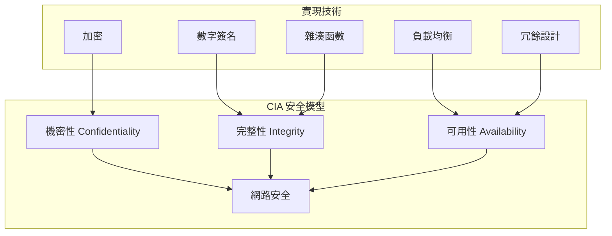
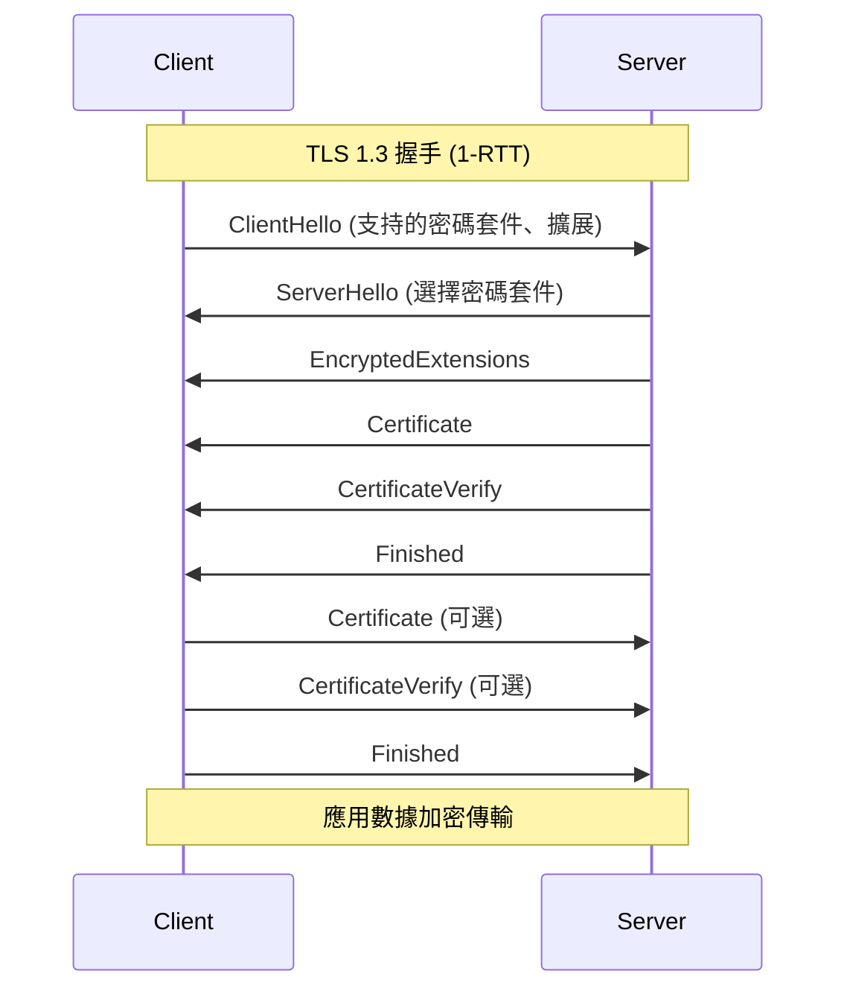
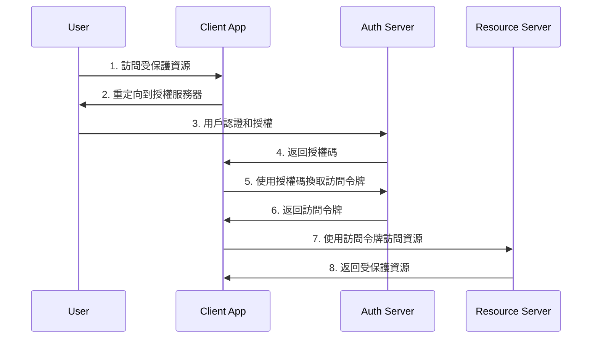

# 網路安全

## 網路安全基礎概念

### CIA 三元組 (Confidentiality, Integrity, Availability)



### 常見網路攻擊類型

#### 1. Man-in-the-Middle (MITM) 攻擊
```bash
# 檢測 ARP 欺騙
arp -a | grep -E "([0-9a-f]{2}:){5}[0-9a-f]{2}" | sort -k2 | uniq -f1 -d

# 監控 ARP 表變化
watch -n 2 'arp -a'

# 使用 arping 檢測 IP 衝突
arping -D -I eth0 192.168.1.100
```

#### 2. DDoS 攻擊識別
```bash
# 檢查連接數異常
ss -tuln | awk '/^tcp/ {print $5}' | cut -d: -f1 | sort | uniq -c | sort -nr | head -10

# 監控 SYN flood
netstat -an | grep SYN_RECV | wc -l

# 檢查異常大量連接
ss -t state established | awk '{print $4}' | cut -d: -f1 | sort | uniq -c | sort -nr | head -20
```

## TLS/SSL 深入解析

### TLS 1.3 握手過程



### 證書管理與驗證

#### 生成自簽名證書
```bash
# 生成私鑰
openssl genrsa -out server.key 2048

# 生成證書請求
openssl req -new -key server.key -out server.csr

# 生成自簽名證書
openssl x509 -req -days 365 -in server.csr -signkey server.key -out server.crt

# 一鍵生成自簽名證書
openssl req -x509 -newkey rsa:2048 -keyout key.pem -out cert.pem -days 365 -nodes \
  -subj "/C=TW/ST=Taipei/L=Taipei/O=MyOrg/CN=localhost"
```

#### 證書鏈驗證
```bash
# 驗證證書鏈
openssl verify -CAfile ca-bundle.crt server.crt

# 檢查證書詳情
openssl x509 -in server.crt -text -noout

# 檢查證書與私鑰是否匹配
openssl x509 -noout -modulus -in server.crt | openssl md5
openssl rsa -noout -modulus -in server.key | openssl md5

# 檢查證書有效期
openssl x509 -in server.crt -dates -noout

# 檢查遠程服務器證書
echo | openssl s_client -showcerts -servername example.com -connect example.com:443 2>/dev/null
```

#### Let's Encrypt 自動化
```bash
# 安裝 certbot
sudo apt update && sudo apt install certbot

# 獲取證書 (standalone 模式)
sudo certbot certonly --standalone -d example.com

# 獲取證書 (webroot 模式)
sudo certbot certonly --webroot -w /var/www/html -d example.com

# 自動續期
sudo certbot renew --dry-run

# 設置自動續期 cron job
echo "0 12 * * * /usr/bin/certbot renew --quiet" | sudo crontab -
```

### 密碼學基礎實現

#### 對稱加密示例 (AES)
```c
#include <openssl/evp.h>
#include <openssl/aes.h>
#include <openssl/rand.h>
#include <string.h>

int aes_encrypt(unsigned char *plaintext, int plaintext_len,
                unsigned char *key, unsigned char *iv,
                unsigned char *ciphertext) {
    EVP_CIPHER_CTX *ctx;
    int len;
    int ciphertext_len;
    
    // 創建並初始化上下文
    if(!(ctx = EVP_CIPHER_CTX_new())) return -1;
    
    // 初始化加密操作
    if(1 != EVP_EncryptInit_ex(ctx, EVP_aes_256_cbc(), NULL, key, iv))
        return -1;
    
    // 加密明文
    if(1 != EVP_EncryptUpdate(ctx, ciphertext, &len, plaintext, plaintext_len))
        return -1;
    ciphertext_len = len;
    
    // 完成加密
    if(1 != EVP_EncryptFinal_ex(ctx, ciphertext + len, &len)) return -1;
    ciphertext_len += len;
    
    // 清理
    EVP_CIPHER_CTX_free(ctx);
    
    return ciphertext_len;
}

int aes_decrypt(unsigned char *ciphertext, int ciphertext_len,
                unsigned char *key, unsigned char *iv,
                unsigned char *plaintext) {
    EVP_CIPHER_CTX *ctx;
    int len;
    int plaintext_len;
    
    if(!(ctx = EVP_CIPHER_CTX_new())) return -1;
    
    if(1 != EVP_DecryptInit_ex(ctx, EVP_aes_256_cbc(), NULL, key, iv))
        return -1;
    
    if(1 != EVP_DecryptUpdate(ctx, plaintext, &len, ciphertext, ciphertext_len))
        return -1;
    plaintext_len = len;
    
    if(1 != EVP_DecryptFinal_ex(ctx, plaintext + len, &len)) return -1;
    plaintext_len += len;
    
    EVP_CIPHER_CTX_free(ctx);
    
    return plaintext_len;
}
```

#### 非對稱加密示例 (RSA)
```c
#include <openssl/rsa.h>
#include <openssl/pem.h>
#include <openssl/err.h>

RSA* create_rsa_key() {
    BIGNUM *bne = NULL;
    RSA *rsa = NULL;
    int bits = 2048;
    unsigned long e = RSA_F4;
    
    // 生成指數
    bne = BN_new();
    if (BN_set_word(bne, e) != 1) {
        BN_free(bne);
        return NULL;
    }
    
    // 生成 RSA 密鑰對
    rsa = RSA_new();
    if (RSA_generate_key_ex(rsa, bits, bne, NULL) != 1) {
        RSA_free(rsa);
        BN_free(bne);
        return NULL;
    }
    
    BN_free(bne);
    return rsa;
}

int rsa_encrypt(RSA *rsa, unsigned char *data, int data_len, 
                unsigned char *encrypted) {
    return RSA_public_encrypt(data_len, data, encrypted, rsa, RSA_PKCS1_PADDING);
}

int rsa_decrypt(RSA *rsa, unsigned char *encrypted, int encrypted_len,
                unsigned char *decrypted) {
    return RSA_private_decrypt(encrypted_len, encrypted, decrypted, rsa, RSA_PKCS1_PADDING);
}
```

#### 數字簽名實現
```c
#include <openssl/sha.h>
#include <openssl/rsa.h>

int rsa_sign(RSA *rsa, unsigned char *data, int data_len,
             unsigned char *signature, unsigned int *sig_len) {
    unsigned char hash[SHA256_DIGEST_LENGTH];
    
    // 計算 SHA-256 雜湊
    SHA256(data, data_len, hash);
    
    // 使用私鑰簽名
    return RSA_sign(NID_sha256, hash, SHA256_DIGEST_LENGTH, 
                   signature, sig_len, rsa);
}

int rsa_verify(RSA *rsa, unsigned char *data, int data_len,
               unsigned char *signature, unsigned int sig_len) {
    unsigned char hash[SHA256_DIGEST_LENGTH];
    
    // 計算 SHA-256 雜湊
    SHA256(data, data_len, hash);
    
    // 使用公鑰驗證簽名
    return RSA_verify(NID_sha256, hash, SHA256_DIGEST_LENGTH,
                     signature, sig_len, rsa);
}
```

## HTTPS 服務器配置

### Nginx HTTPS 配置

#### 基本 HTTPS 配置
```nginx
server {
    listen 443 ssl http2;
    server_name example.com;
    
    # SSL 證書配置
    ssl_certificate /path/to/cert.pem;
    ssl_certificate_key /path/to/key.pem;
    
    # SSL 協議配置
    ssl_protocols TLSv1.2 TLSv1.3;
    ssl_ciphers ECDHE-ECDSA-AES128-GCM-SHA256:ECDHE-RSA-AES128-GCM-SHA256:ECDHE-ECDSA-AES256-GCM-SHA384:ECDHE-RSA-AES256-GCM-SHA384;
    ssl_prefer_server_ciphers off;
    
    # HSTS 頭
    add_header Strict-Transport-Security "max-age=63072000" always;
    
    # OCSP Stapling
    ssl_stapling on;
    ssl_stapling_verify on;
    ssl_trusted_certificate /path/to/chain.pem;
    resolver 8.8.8.8 8.8.4.4 valid=300s;
    
    # SSL Session 緩存
    ssl_session_cache shared:SSL:10m;
    ssl_session_timeout 10m;
    
    location / {
        proxy_pass http://backend;
        proxy_set_header Host $host;
        proxy_set_header X-Real-IP $remote_addr;
        proxy_set_header X-Forwarded-For $proxy_add_x_forwarded_for;
        proxy_set_header X-Forwarded-Proto $scheme;
    }
}

# HTTP 重定向到 HTTPS
server {
    listen 80;
    server_name example.com;
    return 301 https://$server_name$request_uri;
}
```

#### 高安全性配置
```nginx
server {
    listen 443 ssl http2;
    server_name example.com;
    
    # 證書配置
    ssl_certificate /path/to/cert.pem;
    ssl_certificate_key /path/to/key.pem;
    
    # 僅支持 TLS 1.3
    ssl_protocols TLSv1.3;
    ssl_conf_command Ciphersuites TLS_AES_128_GCM_SHA256:TLS_AES_256_GCM_SHA384:TLS_CHACHA20_POLY1305_SHA256;
    
    # 安全頭設置
    add_header Strict-Transport-Security "max-age=63072000; includeSubDomains; preload" always;
    add_header X-Content-Type-Options nosniff always;
    add_header X-Frame-Options DENY always;
    add_header X-XSS-Protection "1; mode=block" always;
    add_header Referrer-Policy "strict-origin-when-cross-origin" always;
    add_header Content-Security-Policy "default-src 'self'; script-src 'self'; style-src 'self' 'unsafe-inline';" always;
    
    # 客戶端證書驗證 (可選)
    ssl_client_certificate /path/to/ca.pem;
    ssl_verify_client optional;
    
    location / {
        # 檢查客戶端證書
        if ($ssl_client_verify != SUCCESS) {
            return 403;
        }
        
        proxy_pass http://backend;
        proxy_set_header X-SSL-Client-Cert $ssl_client_cert;
        proxy_set_header X-SSL-Client-S-DN $ssl_client_s_dn;
    }
}
```

### Apache HTTPS 配置

```apache
<VirtualHost *:443>
    ServerName example.com
    DocumentRoot /var/www/html
    
    # SSL 引擎啟用
    SSLEngine on
    
    # 證書配置
    SSLCertificateFile /path/to/cert.pem
    SSLCertificateKeyFile /path/to/key.pem
    SSLCertificateChainFile /path/to/chain.pem
    
    # 協議和密碼配置
    SSLProtocol all -SSLv3 -TLSv1 -TLSv1.1
    SSLCipherSuite ECDHE-ECDSA-AES256-GCM-SHA384:ECDHE-RSA-AES256-GCM-SHA384
    SSLHonorCipherOrder off
    
    # HSTS
    Header always set Strict-Transport-Security "max-age=63072000; includeSubDomains; preload"
    
    # OCSP Stapling
    SSLUseStapling on
    SSLStaplingCache "shmcb:logs/stapling-cache(150000)"
</VirtualHost>
```

## 身份驗證與授權

### JWT (JSON Web Token) 實現

#### JWT 結構解析
```bash
# JWT 格式: header.payload.signature
# Base64 解碼示例
echo "eyJ0eXAiOiJKV1QiLCJhbGciOiJIUzI1NiJ9" | base64 -d
```

#### C 語言 JWT 實現
```c
#include <json-c/json.h>
#include <openssl/hmac.h>
#include <openssl/sha.h>
#include <openssl/bio.h>
#include <openssl/evp.h>
#include <openssl/buffer.h>

// Base64 編碼
char* base64_encode(const unsigned char* input, int length) {
    BIO *bmem, *b64;
    BUF_MEM *bptr;
    
    b64 = BIO_new(BIO_f_base64());
    bmem = BIO_new(BIO_s_mem());
    b64 = BIO_push(b64, bmem);
    BIO_set_flags(b64, BIO_FLAGS_BASE64_NO_NL);
    BIO_write(b64, input, length);
    BIO_flush(b64);
    BIO_get_mem_ptr(b64, &bptr);
    
    char* buff = malloc(bptr->length + 1);
    memcpy(buff, bptr->data, bptr->length);
    buff[bptr->length] = 0;
    
    BIO_free_all(b64);
    return buff;
}

// HMAC-SHA256 簽名
char* hmac_sha256(const char* key, const char* data) {
    unsigned char hash[32];
    unsigned int hash_len;
    
    HMAC(EVP_sha256(), key, strlen(key), 
         (unsigned char*)data, strlen(data), hash, &hash_len);
    
    return base64_encode(hash, hash_len);
}

// 創建 JWT
char* create_jwt(const char* payload, const char* secret) {
    // Header
    json_object *header = json_object_new_object();
    json_object_object_add(header, "typ", json_object_new_string("JWT"));
    json_object_object_add(header, "alg", json_object_new_string("HS256"));
    const char* header_str = json_object_to_json_string(header);
    char* encoded_header = base64_encode((unsigned char*)header_str, strlen(header_str));
    
    // Payload
    char* encoded_payload = base64_encode((unsigned char*)payload, strlen(payload));
    
    // 創建簽名數據
    int data_len = strlen(encoded_header) + strlen(encoded_payload) + 2;
    char* data = malloc(data_len);
    snprintf(data, data_len, "%s.%s", encoded_header, encoded_payload);
    
    // 生成簽名
    char* signature = hmac_sha256(secret, data);
    
    // 組合 JWT
    int jwt_len = strlen(data) + strlen(signature) + 2;
    char* jwt = malloc(jwt_len);
    snprintf(jwt, jwt_len, "%s.%s", data, signature);
    
    // 清理記憶體
    json_object_put(header);
    free(encoded_header);
    free(encoded_payload);
    free(data);
    free(signature);
    
    return jwt;
}
```

### OAuth 2.0 流程實現

#### 授權碼流程


#### OAuth 2.0 客戶端實現
```bash
#!/bin/bash
# OAuth 2.0 授權碼流程示例

CLIENT_ID="your_client_id"
CLIENT_SECRET="your_client_secret"
REDIRECT_URI="http://localhost:8080/callback"
AUTH_SERVER="https://auth.example.com"
TOKEN_ENDPOINT="$AUTH_SERVER/oauth/token"
AUTH_ENDPOINT="$AUTH_SERVER/oauth/authorize"

# 步驟 1: 獲取授權碼
get_authorization_code() {
    local auth_url="$AUTH_ENDPOINT?response_type=code&client_id=$CLIENT_ID&redirect_uri=$REDIRECT_URI&scope=read"
    echo "請訪問以下 URL 進行授權:"
    echo "$auth_url"
    
    # 啟動臨時 HTTP 服務器接收回調
    python3 -c "
import http.server
import socketserver
from urllib.parse import urlparse, parse_qs

class CallbackHandler(http.server.SimpleHTTPRequestHandler):
    def do_GET(self):
        parsed = urlparse(self.path)
        params = parse_qs(parsed.query)
        if 'code' in params:
            print(f'Authorization Code: {params[\"code\"][0]}')
            self.send_response(200)
            self.send_header('Content-type', 'text/html')
            self.end_headers()
            self.wfile.write(b'Authorization successful! You can close this window.')
        else:
            self.send_response(400)
            self.end_headers()

with socketserver.TCPServer(('', 8080), CallbackHandler) as httpd:
    print('Server started at http://localhost:8080')
    httpd.handle_request()
"
}

# 步驟 2: 使用授權碼換取訪問令牌
get_access_token() {
    local auth_code="$1"
    
    local response=$(curl -s -X POST "$TOKEN_ENDPOINT" \
        -H "Content-Type: application/x-www-form-urlencoded" \
        -d "grant_type=authorization_code" \
        -d "code=$auth_code" \
        -d "redirect_uri=$REDIRECT_URI" \
        -d "client_id=$CLIENT_ID" \
        -d "client_secret=$CLIENT_SECRET")
    
    echo "$response" | python3 -c "
import sys, json
data = json.load(sys.stdin)
if 'access_token' in data:
    print(f'Access Token: {data[\"access_token\"]}')
    if 'refresh_token' in data:
        print(f'Refresh Token: {data[\"refresh_token\"]}')
else:
    print('Error:', data)
"
}

# 步驟 3: 使用訪問令牌調用 API
call_api() {
    local access_token="$1"
    local api_url="$2"
    
    curl -s -H "Authorization: Bearer $access_token" "$api_url"
}
```

### API 密鑰管理

#### 安全的 API 密鑰儲存
```c
#include <keyutils.h>
#include <unistd.h>
#include <string.h>

// 使用 Linux Kernel Keyring 儲存密鑰
int store_api_key(const char* key_name, const char* api_key) {
    key_serial_t keyid = add_key("user", key_name, api_key, 
                                strlen(api_key), KEY_SPEC_USER_KEYRING);
    
    if (keyid == -1) {
        perror("Failed to store API key");
        return -1;
    }
    
    // 設置權限 (僅當前用戶可讀)
    if (keyctl(KEYCTL_SETPERM, keyid, KEY_POS_VIEW | KEY_POS_READ) == -1) {
        perror("Failed to set key permissions");
        return -1;
    }
    
    return 0;
}

// 讀取 API 密鑰
char* get_api_key(const char* key_name) {
    key_serial_t keyid = request_key("user", key_name, NULL, KEY_SPEC_USER_KEYRING);
    
    if (keyid == -1) {
        perror("API key not found");
        return NULL;
    }
    
    long key_size = keyctl(KEYCTL_READ, keyid, NULL, 0);
    if (key_size == -1) {
        perror("Failed to get key size");
        return NULL;
    }
    
    char* buffer = malloc(key_size + 1);
    if (keyctl(KEYCTL_READ, keyid, buffer, key_size) == -1) {
        perror("Failed to read key");
        free(buffer);
        return NULL;
    }
    
    buffer[key_size] = '\0';
    return buffer;
}
```

## 網路安全監控

### 入侵檢測系統

#### 簡單的端口掃描檢測
```bash
#!/bin/bash
# 端口掃描檢測腳本

LOG_FILE="/var/log/security/port_scan.log"
THRESHOLD=10  # 10 秒內超過此閾值認為是掃描

detect_port_scan() {
    # 監控 TCP SYN 封包
    tcpdump -i any -n 'tcp[tcpflags] & tcp-syn != 0' 2>/dev/null | \
    while read line; do
        # 提取源 IP
        src_ip=$(echo "$line" | awk '{print $3}' | cut -d. -f1-4)
        timestamp=$(date +%s)
        
        # 記錄到臨時文件
        echo "$timestamp $src_ip" >> /tmp/syn_packets.tmp
        
        # 檢查最近 10 秒內的連接數
        recent_count=$(awk -v now="$timestamp" -v ip="$src_ip" '
            $2 == ip && (now - $1) <= 10 {count++} 
            END {print count+0}
        ' /tmp/syn_packets.tmp)
        
        if [ "$recent_count" -gt "$THRESHOLD" ]; then
            echo "$(date): Possible port scan detected from $src_ip ($recent_count connections)" | \
                tee -a "$LOG_FILE"
            
            # 可選: 自動封鎖 IP
            # iptables -A INPUT -s $src_ip -j DROP
        fi
        
        # 清理舊記錄
        awk -v now="$timestamp" '(now - $1) <= 60' /tmp/syn_packets.tmp > /tmp/syn_packets.tmp.new
        mv /tmp/syn_packets.tmp.new /tmp/syn_packets.tmp
    done
}

# 後台運行檢測
detect_port_scan &
echo "Port scan detection started (PID: $!)"
```

#### 異常流量檢測
```bash
#!/bin/bash
# 網路流量異常檢測

INTERFACE="eth0"
BASELINE_FILE="/tmp/network_baseline.txt"
ALERT_THRESHOLD=5  # 倍數閾值

# 建立基線
establish_baseline() {
    echo "Building network baseline..."
    for i in {1..60}; do
        rx_bytes=$(cat /sys/class/net/$INTERFACE/statistics/rx_bytes)
        tx_bytes=$(cat /sys/class/net/$INTERFACE/statistics/tx_bytes)
        echo "$rx_bytes $tx_bytes" >> "$BASELINE_FILE"
        sleep 1
    done
    
    # 計算平均值
    awk '{rx+=$1; tx+=$2} END {print rx/NR, tx/NR}' "$BASELINE_FILE" > /tmp/baseline_avg.txt
}

# 檢測異常
detect_anomaly() {
    read avg_rx avg_tx < /tmp/baseline_avg.txt
    
    while true; do
        rx_bytes=$(cat /sys/class/net/$INTERFACE/statistics/rx_bytes)
        tx_bytes=$(cat /sys/class/net/$INTERFACE/statistics/tx_bytes)
        
        # 計算當前速率 (每秒字節數)
        sleep 1
        rx_bytes_new=$(cat /sys/class/net/$INTERFACE/statistics/rx_bytes)
        tx_bytes_new=$(cat /sys/class/net/$INTERFACE/statistics/tx_bytes)
        
        rx_rate=$((rx_bytes_new - rx_bytes))
        tx_rate=$((tx_bytes_new - tx_bytes))
        
        # 檢查是否超過閾值
        if [ "$rx_rate" -gt "$(echo "$avg_rx * $ALERT_THRESHOLD" | bc -l | cut -d. -f1)" ]; then
            echo "$(date): High RX traffic detected: $rx_rate bytes/sec (baseline: $avg_rx)"
        fi
        
        if [ "$tx_rate" -gt "$(echo "$avg_tx * $ALERT_THRESHOLD" | bc -l | cut -d. -f1)" ]; then
            echo "$(date): High TX traffic detected: $tx_rate bytes/sec (baseline: $avg_tx)"
        fi
    done
}

# 運行檢測
if [ ! -f /tmp/baseline_avg.txt ]; then
    establish_baseline
fi

detect_anomaly
```

### 防火牆配置

#### iptables 安全配置
```bash
#!/bin/bash
# 安全的 iptables 配置

# 清空現有規則
iptables -F
iptables -X
iptables -Z

# 設置默認策略
iptables -P INPUT DROP
iptables -P FORWARD DROP
iptables -P OUTPUT ACCEPT

# 允許本地回環
iptables -A INPUT -i lo -j ACCEPT

# 允許已建立的連接
iptables -A INPUT -m state --state ESTABLISHED,RELATED -j ACCEPT

# 允許 SSH (限制連接頻率)
iptables -A INPUT -p tcp --dport 22 -m state --state NEW -m recent --set
iptables -A INPUT -p tcp --dport 22 -m state --state NEW -m recent --update --seconds 60 --hitcount 4 -j DROP
iptables -A INPUT -p tcp --dport 22 -j ACCEPT

# 允許 HTTP/HTTPS
iptables -A INPUT -p tcp --dport 80 -j ACCEPT
iptables -A INPUT -p tcp --dport 443 -j ACCEPT

# 防止 DDoS 攻擊
iptables -A INPUT -p tcp --syn -m limit --limit 1/s --limit-burst 3 -j ACCEPT
iptables -A INPUT -p tcp --syn -j DROP

# 防止端口掃描
iptables -A INPUT -m state --state NEW -p tcp --tcp-flags ALL ALL -j DROP
iptables -A INPUT -m state --state NEW -p tcp --tcp-flags ALL NONE -j DROP
iptables -A INPUT -m state --state NEW -p tcp --tcp-flags ALL FIN,URG,PSH -j DROP
iptables -A INPUT -m state --state NEW -p tcp --tcp-flags ALL SYN,RST,ACK,FIN,URG -j DROP

# 記錄被丟棄的封包
iptables -A INPUT -m limit --limit 5/min -j LOG --log-prefix "iptables denied: " --log-level 7

# 保存規則
iptables-save > /etc/iptables/rules.v4
```

#### nftables 現代配置
```bash
#!/usr/sbin/nft -f

# 清空現有規則
flush ruleset

table inet filter {
    chain input {
        type filter hook input priority 0; policy drop;
        
        # 允許本地回環
        iifname "lo" accept
        
        # 允許已建立的連接
        ct state established,related accept
        
        # 允許 SSH (連接限制)
        tcp dport 22 ct state new limit rate 4/minute accept
        
        # 允許 HTTP/HTTPS
        tcp dport {80, 443} accept
        
        # 防止端口掃描
        tcp flags & (fin|syn|rst|psh|ack|urg) == fin|syn|rst|psh|ack|urg drop
        tcp flags & (fin|syn|rst|psh|ack|urg) == 0 drop
        
        # 記錄並丟棄其他流量
        limit rate 5/minute log prefix "nftables drop: "
        drop
    }
    
    chain forward {
        type filter hook forward priority 0; policy drop;
    }
    
    chain output {
        type filter hook output priority 0; policy accept;
    }
}
```

## 安全審計與合規

### 安全掃描自動化

```bash
#!/bin/bash
# 自動化安全掃描腳本

SCAN_TARGET="$1"
REPORT_DIR="/var/log/security_scan"
DATE=$(date +%Y%m%d_%H%M%S)

# 創建報告目錄
mkdir -p "$REPORT_DIR"

# Nmap 掃描
echo "Running Nmap scan..."
nmap -sS -sV -O -A "$SCAN_TARGET" > "$REPORT_DIR/nmap_$DATE.txt"

# SSL 檢查
echo "Checking SSL configuration..."
if command -v testssl.sh >/dev/null; then
    testssl.sh "$SCAN_TARGET" > "$REPORT_DIR/ssl_$DATE.txt"
fi

# 弱點掃描 (使用 OpenVAS 或 Nessus)
echo "Running vulnerability scan..."
if command -v openvas-cli >/dev/null; then
    # OpenVAS 掃描示例
    openvas-cli -T "$SCAN_TARGET" > "$REPORT_DIR/vuln_$DATE.txt"
fi

# 生成摘要報告
generate_summary() {
    local summary_file="$REPORT_DIR/summary_$DATE.txt"
    
    echo "Security Scan Summary - $(date)" > "$summary_file"
    echo "Target: $SCAN_TARGET" >> "$summary_file"
    echo "=========================" >> "$summary_file"
    
    # 開放端口摘要
    echo "Open Ports:" >> "$summary_file"
    grep "open" "$REPORT_DIR/nmap_$DATE.txt" | head -20 >> "$summary_file"
    echo "" >> "$summary_file"
    
    # SSL 問題摘要
    if [ -f "$REPORT_DIR/ssl_$DATE.txt" ]; then
        echo "SSL Issues:" >> "$summary_file"
        grep -i "high\|critical\|severe" "$REPORT_DIR/ssl_$DATE.txt" >> "$summary_file"
        echo "" >> "$summary_file"
    fi
    
    echo "Scan completed: $(date)" >> "$summary_file"
    
    # 發送通知 (可選)
    # mail -s "Security Scan Report" admin@example.com < "$summary_file"
}

generate_summary
echo "Security scan completed. Reports saved in $REPORT_DIR"
```

## 重點總結

1. **加密技術**：理解對稱、非對稱加密和數字簽名的實現
2. **TLS/SSL**：掌握證書管理和 HTTPS 服務器配置
3. **身份認證**：熟悉 JWT、OAuth 2.0 等認證機制
4. **安全監控**：實現入侵檢測和異常流量監控
5. **防護措施**：配置防火牆和實施安全審計

## 下一章預告

下一章將探討 **後端網路問題與排查**，學習如何診斷和解決常見的後端服務網路問題。