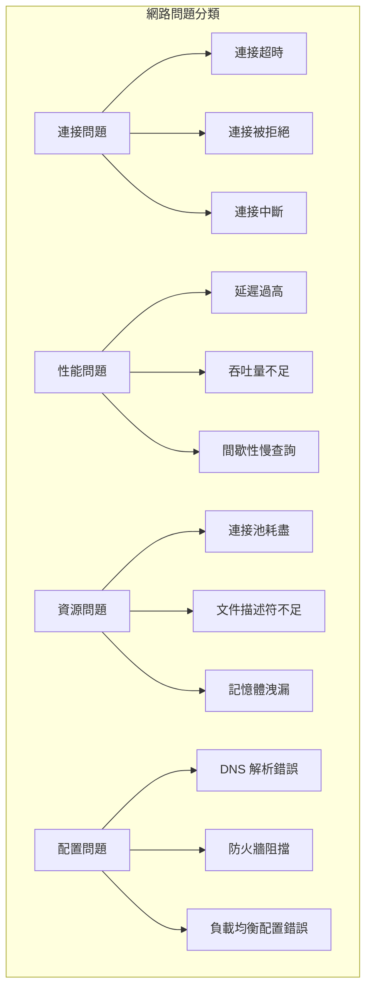

# 後端網路問題與排查

## 常見後端網路問題分類

後端系統的網路問題通常可以分為以下幾個類別：



## 連接問題診斷與解決

### 連接超時問題

#### 診斷步驟
```bash
#!/bin/bash
# 連接超時診斷腳本

diagnose_connection_timeout() {
    local target_host="$1"
    local target_port="$2"
    
    echo "=== 連接超時診斷報告 ==="
    echo "目標: $target_host:$target_port"
    echo "時間: $(date)"
    echo
    
    # 1. 基本網路連通性測試
    echo "1. 網路連通性測試"
    if ping -c 3 -W 2 "$target_host" >/dev/null 2>&1; then
        echo "✓ ICMP 可達"
        ping -c 3 "$target_host" | tail -1
    else
        echo "✗ ICMP 不可達"
    fi
    echo
    
    # 2. 端口連通性測試
    echo "2. 端口連通性測試"
    if timeout 5 bash -c "</dev/tcp/$target_host/$target_port"; then
        echo "✓ 端口 $target_port 可達"
    else
        echo "✗ 端口 $target_port 不可達或超時"
    fi
    echo
    
    # 3. TCP 連接詳細測試
    echo "3. TCP 連接詳細分析"
    nc_output=$(timeout 10 nc -v "$target_host" "$target_port" 2>&1 || echo "timeout")
    echo "$nc_output"
    echo
    
    # 4. 路由追蹤
    echo "4. 路由追蹤分析"
    echo "檢查到目標的路由路徑："
    traceroute -n -m 10 "$target_host" 2>/dev/null | head -10
    echo
    
    # 5. DNS 解析檢查
    echo "5. DNS 解析檢查"
    dns_time=$(dig +short +time=2 "$target_host" 2>/dev/null | tail -1)
    if [ -n "$dns_time" ]; then
        echo "✓ DNS 解析成功: $dns_time"
    else
        echo "✗ DNS 解析失敗或超時"
    fi
    echo
    
    # 6. 本地網路配置檢查
    echo "6. 本地網路配置"
    echo "預設路由:"
    ip route | grep default | head -3
    echo "DNS 服務器:"
    grep nameserver /etc/resolv.conf | head -3
    echo
}

# 使用示例
# diagnose_connection_timeout "db.example.com" "5432"
```

#### 常見原因與解決方案

**1. 防火牆阻擋**
```bash
# 檢查本地防火牆
sudo iptables -L -n | grep -E "(REJECT|DROP)"
sudo ufw status

# 檢查遠程防火牆
nmap -p "$port" "$host"

# 臨時解決方案
sudo iptables -A OUTPUT -p tcp --dport "$port" -j ACCEPT
sudo iptables -A INPUT -p tcp --sport "$port" -j ACCEPT
```

**2. 網路設備問題**
```bash
# 檢查網路接口狀態
ip link show
ethtool eth0

# 檢查網路設備錯誤
cat /proc/net/dev | grep -E "(error|drop)"

# 重啟網路接口
sudo ip link set eth0 down
sudo ip link set eth0 up
```

### 連接被拒絕問題

#### 診斷腳本
```bash
#!/bin/bash
# 連接被拒絕診斷

diagnose_connection_refused() {
    local host="$1"
    local port="$2"
    
    echo "=== 連接被拒絕診斷 ==="
    
    # 1. 檢查服務是否在運行
    echo "1. 檢查服務狀態"
    if [ "$host" = "localhost" ] || [ "$host" = "127.0.0.1" ]; then
        echo "本地服務檢查:"
        ss -tlnp | grep ":$port " || echo "端口 $port 沒有服務監聽"
        
        # 檢查進程
        lsof -i ":$port" || echo "沒有進程使用端口 $port"
    else
        echo "遠程服務檢查:"
        nmap -p "$port" "$host"
    fi
    echo
    
    # 2. 檢查服務配置
    echo "2. 檢查綁定地址"
    if [ "$host" = "localhost" ] || [ "$host" = "127.0.0.1" ]; then
        ss -tlnp | grep ":$port" | while read line; do
            bind_addr=$(echo "$line" | awk '{print $4}')
            echo "服務綁定地址: $bind_addr"
            
            if [[ "$bind_addr" == "127.0.0.1:$port" ]]; then
                echo "⚠ 服務只監聽本地地址，無法從外部訪問"
            elif [[ "$bind_addr" == "0.0.0.0:$port" ]] || [[ "$bind_addr" == "*:$port" ]]; then
                echo "✓ 服務監聽所有地址"
            fi
        done
    fi
    echo
    
    # 3. 檢查 SELinux (如果啟用)
    if command -v getenforce >/dev/null && [ "$(getenforce)" = "Enforcing" ]; then
        echo "3. SELinux 檢查"
        semanage port -l | grep -w "$port" || echo "端口 $port 沒有 SELinux 標籤"
        echo
    fi
    
    # 4. 檢查系統資源
    echo "4. 系統資源檢查"
    echo "文件描述符限制:"
    ulimit -n
    echo "當前打開的文件數:"
    lsof | wc -l
    echo "記憶體使用:"
    free -h | head -2
    echo
}
```

#### 解決方案

**1. 服務未啟動**
```bash
# 檢查服務狀態
sudo systemctl status nginx
sudo systemctl status postgresql

# 啟動服務
sudo systemctl start nginx
sudo systemctl enable nginx

# 檢查服務日誌
sudo journalctl -u nginx -f
```

**2. 綁定地址問題**
```bash
# 修改服務配置文件
# 例如：PostgreSQL
sudo vim /etc/postgresql/13/main/postgresql.conf
# 修改: listen_addresses = '*'

# 例如：Redis
sudo vim /etc/redis/redis.conf
# 修改: bind 0.0.0.0
```

### 連接中斷問題

#### 實時監控連接狀態
```bash
#!/bin/bash
# 連接中斷監控腳本

monitor_connections() {
    local target_host="$1"
    local target_port="$2"
    local check_interval="${3:-5}"
    
    echo "開始監控連接到 $target_host:$target_port"
    echo "檢查間隔: $check_interval 秒"
    echo "時間                    狀態      延遲"
    echo "================================================"
    
    while true; do
        timestamp=$(date '+%Y-%m-%d %H:%M:%S')
        
        # 測試連接
        if timeout 3 bash -c "</dev/tcp/$target_host/$target_port" 2>/dev/null; then
            # 測量延遲
            ping_result=$(ping -c 1 -W 1 "$target_host" 2>/dev/null | grep "time=" | awk -F'time=' '{print $2}' | awk '{print $1}')
            echo "$timestamp    連接正常    ${ping_result:-N/A}"
        else
            echo "$timestamp    連接失敗    N/A"
            
            # 連接失敗時進行額外檢查
            echo "  └─ 診斷資訊:"
            
            # 檢查 DNS
            if ! nslookup "$target_host" >/dev/null 2>&1; then
                echo "      DNS 解析失敗"
            fi
            
            # 檢查路由
            if ! ping -c 1 -W 2 "$target_host" >/dev/null 2>&1; then
                echo "      網路不可達"
            fi
        fi
        
        sleep "$check_interval"
    done
}

# 使用示例
# monitor_connections "database.example.com" "5432" 10
```

#### 連接池問題診斷

```bash
#!/bin/bash
# 連接池問題診斷

diagnose_connection_pool() {
    local service_name="$1"
    
    echo "=== 連接池診斷報告 ==="
    echo "服務: $service_name"
    echo "時間: $(date)"
    echo
    
    # 1. 檢查當前連接數
    echo "1. 當前連接統計"
    echo "TCP 連接狀態分佈:"
    ss -t state all | awk 'NR>1{print $1}' | sort | uniq -c | sort -nr
    echo
    
    # 2. 檢查 TIME_WAIT 連接
    time_wait_count=$(ss -t state time-wait | wc -l)
    echo "TIME_WAIT 連接數: $time_wait_count"
    if [ "$time_wait_count" -gt 1000 ]; then
        echo "⚠ TIME_WAIT 連接數過多，可能導致端口耗盡"
    fi
    echo
    
    # 3. 檢查文件描述符使用情況
    echo "3. 文件描述符使用情況"
    if [ -n "$service_name" ]; then
        pid=$(pgrep "$service_name" | head -1)
        if [ -n "$pid" ]; then
            fd_count=$(ls /proc/"$pid"/fd 2>/dev/null | wc -l)
            fd_limit=$(grep "open files" /proc/"$pid"/limits | awk '{print $4}')
            echo "進程 $service_name (PID: $pid):"
            echo "  當前打開文件數: $fd_count"
            echo "  文件描述符限制: $fd_limit"
            
            if [ "$fd_count" -gt "$((fd_limit * 8 / 10))" ]; then
                echo "⚠ 文件描述符使用率超過 80%"
            fi
        fi
    fi
    echo
    
    # 4. 檢查網路緩衝區
    echo "4. 網路緩衝區狀態"
    echo "TCP 接收緩衝區:"
    ss -i | grep -E "(rcv_space|snd_cwnd)" | head -10
    echo
    
    # 5. 系統級別檢查
    echo "5. 系統級別參數"
    echo "最大文件描述符數: $(cat /proc/sys/fs/file-max)"
    echo "當前使用文件描述符數: $(cat /proc/sys/fs/file-nr | awk '{print $1}')"
    echo "本地端口範圍: $(cat /proc/sys/net/ipv4/ip_local_port_range)"
    echo "TCP 時間參數:"
    echo "  tcp_fin_timeout: $(cat /proc/sys/net/ipv4/tcp_fin_timeout)"
    echo "  tcp_tw_reuse: $(cat /proc/sys/net/ipv4/tcp_tw_reuse)"
}
```

## 性能問題診斷與優化

### 延遲問題分析

#### 網路延遲分解分析
```bash
#!/bin/bash
# 延遲分解分析工具

analyze_latency() {
    local target="$1"
    local count="${2:-10}"
    
    echo "=== 延遲分析報告 ==="
    echo "目標: $target"
    echo "樣本數: $count"
    echo
    
    # 1. ICMP 延遲測試
    echo "1. ICMP 延遲分析"
    ping -c "$count" "$target" | tail -1
    echo
    
    # 2. TCP 連接延遲測試
    echo "2. TCP 連接延遲測試"
    local port_found=false
    for port in 80 443 22; do
        if timeout 2 bash -c "</dev/tcp/$target/$port" 2>/dev/null; then
            echo "測試端口 $port:"
            
            # 使用 hping3 進行精確測量
            if command -v hping3 >/dev/null; then
                hping3 -S -p "$port" -c "$count" "$target" 2>/dev/null | 
                grep "rtt=" | awk -F'rtt=' '{print $2}' | awk '{print $1}' |
                awk '{
                    sum+=$1; n++; 
                    if(min=="" || $1<min) min=$1; 
                    if($1>max) max=$1
                } 
                END {
                    if(n>0) printf "  平均: %.2fms, 最小: %.2fms, 最大: %.2fms\n", sum/n, min, max
                }'
            fi
            
            port_found=true
            break
        fi
    done
    
    if [ "$port_found" = false ]; then
        echo "未找到開放的端口進行 TCP 測試"
    fi
    echo
    
    # 3. 路由跳數分析
    echo "3. 路由路徑分析"
    mtr -r -c "$count" "$target" | tail -n +2 | head -10
    echo
    
    # 4. DNS 解析延遲
    echo "4. DNS 解析延遲"
    for i in $(seq 1 5); do
        dns_time=$(time dig +short "$target" 2>&1 | grep real | awk '{print $2}')
        echo "DNS 查詢 $i: $dns_time"
    done
}
```

#### 應用層延遲分析
```bash
#!/bin/bash
# HTTP 應用層延遲分析

analyze_http_latency() {
    local url="$1"
    local count="${2:-10}"
    
    echo "=== HTTP 延遲分析 ==="
    echo "URL: $url"
    echo
    
    # 創建 curl 格式文件
    cat > /tmp/curl-format.txt << 'EOF'
time_namelookup:  %{time_namelookup}s
time_connect:     %{time_connect}s
time_appconnect:  %{time_appconnect}s
time_pretransfer: %{time_pretransfer}s
time_redirect:    %{time_redirect}s
time_starttransfer: %{time_starttransfer}s
time_total:       %{time_total}s
size_download:    %{size_download} bytes
speed_download:   %{speed_download} bytes/sec
EOF
    
    echo "執行 $count 次測試..."
    echo
    
    # 收集延遲數據
    for i in $(seq 1 "$count"); do
        echo "測試 $i:"
        curl -w "@/tmp/curl-format.txt" -o /dev/null -s "$url"
        echo
    done
    
    # 清理
    rm -f /tmp/curl-format.txt
}

# HTTP 併發延遲測試
concurrent_http_test() {
    local url="$1"
    local concurrent="${2:-10}"
    local requests="${3:-100}"
    
    echo "=== HTTP 併發延遲測試 ==="
    echo "URL: $url"
    echo "併發數: $concurrent"
    echo "總請求數: $requests"
    echo
    
    if command -v ab >/dev/null; then
        ab -n "$requests" -c "$concurrent" "$url"
    elif command -v wrk >/dev/null; then
        wrk -t4 -c"$concurrent" -d10s "$url"
    else
        echo "需要安裝 ab (apache2-utils) 或 wrk"
    fi
}
```

### 吞吐量問題分析

#### 網路吞吐量測試
```bash
#!/bin/bash
# 網路吞吐量測試腳本

test_network_throughput() {
    local target_host="$1"
    local test_duration="${2:-10}"
    
    echo "=== 網路吞吐量測試 ==="
    echo "目標主機: $target_host"
    echo "測試時長: $test_duration 秒"
    echo
    
    # 1. iperf3 測試 (如果可用)
    if command -v iperf3 >/dev/null; then
        echo "1. iperf3 測試結果:"
        
        # TCP 上傳測試
        echo "TCP 上傳測試:"
        iperf3 -c "$target_host" -t "$test_duration" -f M 2>/dev/null || 
        echo "無法連接到 iperf3 服務器"
        
        # TCP 下載測試
        echo "TCP 下載測試:"
        iperf3 -c "$target_host" -t "$test_duration" -f M -R 2>/dev/null ||
        echo "無法連接到 iperf3 服務器"
        
        # UDP 測試
        echo "UDP 測試:"
        iperf3 -c "$target_host" -t "$test_duration" -f M -u -b 100M 2>/dev/null ||
        echo "無法進行 UDP 測試"
        echo
    fi
    
    # 2. 使用 dd 和 nc 進行簡單測試
    echo "2. 簡單吞吐量測試 (如果端口 12345 可用):"
    
    # 在後台啟動接收端
    timeout "$test_duration" nc -l 12345 > /dev/null &
    nc_pid=$!
    
    sleep 1
    
    # 發送測試數據
    dd if=/dev/zero bs=1M count=100 2>/dev/null | 
    timeout "$test_duration" nc "$target_host" 12345 2>/dev/null &&
    echo "數據傳輸完成" ||
    echo "無法建立測試連接"
    
    # 清理
    kill $nc_pid 2>/dev/null
    echo
    
    # 3. 檢查網路接口統計
    echo "3. 網路接口統計:"
    echo "傳輸前統計:"
    cat /proc/net/dev | grep -E "(eth0|ens|enp)" | head -1
    
    sleep 2
    
    echo "傳輸後統計:"
    cat /proc/net/dev | grep -E "(eth0|ens|enp)" | head -1
}
```

#### 應用層吞吐量優化
```c
// 高性能 socket 配置示例
#include <sys/socket.h>
#include <netinet/tcp.h>

int optimize_socket_performance(int sockfd) {
    int opt;
    socklen_t optlen = sizeof(opt);
    
    // 1. 增大 socket 緩衝區
    opt = 1024 * 1024;  // 1MB
    if (setsockopt(sockfd, SOL_SOCKET, SO_SNDBUF, &opt, optlen) < 0) {
        perror("設置發送緩衝區失敗");
        return -1;
    }
    
    if (setsockopt(sockfd, SOL_SOCKET, SO_RCVBUF, &opt, optlen) < 0) {
        perror("設置接收緩衝區失敗");
        return -1;
    }
    
    // 2. 禁用 Nagle 算法 (低延遲需求)
    opt = 1;
    if (setsockopt(sockfd, IPPROTO_TCP, TCP_NODELAY, &opt, optlen) < 0) {
        perror("禁用 Nagle 算法失敗");
        return -1;
    }
    
    // 3. 啟用 TCP Fast Open (Linux 3.7+)
    opt = 5;  // 隊列大小
    if (setsockopt(sockfd, IPPROTO_TCP, TCP_FASTOPEN, &opt, optlen) < 0) {
        // 非致命錯誤，某些系統可能不支持
        perror("啟用 TCP Fast Open 失敗");
    }
    
    // 4. 設置 TCP 用戶超時
    opt = 30000;  // 30 秒
    if (setsockopt(sockfd, IPPROTO_TCP, TCP_USER_TIMEOUT, &opt, optlen) < 0) {
        perror("設置用戶超時失敗");
    }
    
    // 5. 啟用 SO_REUSEPORT (負載分佈)
    opt = 1;
    if (setsockopt(sockfd, SOL_SOCKET, SO_REUSEPORT, &opt, optlen) < 0) {
        perror("啟用 SO_REUSEPORT 失敗");
    }
    
    return 0;
}

// 批量數據傳輸優化
ssize_t batch_send(int sockfd, const void *buf, size_t len) {
    const char *data = (const char *)buf;
    size_t total_sent = 0;
    size_t chunk_size = 64 * 1024;  // 64KB 分塊
    
    while (total_sent < len) {
        size_t to_send = (len - total_sent > chunk_size) ? 
                        chunk_size : (len - total_sent);
        
        ssize_t sent = send(sockfd, data + total_sent, to_send, MSG_MORE);
        if (sent < 0) {
            if (errno == EAGAIN || errno == EWOULDBLOCK) {
                // 非阻塞模式下緩衝區滿，稍後重試
                usleep(1000);  // 等待 1ms
                continue;
            }
            return -1;
        }
        
        total_sent += sent;
    }
    
    return total_sent;
}
```

## 資源問題排查

### 記憶體洩漏檢測

#### 網路相關記憶體洩漏監控
```bash
#!/bin/bash
# 網路記憶體洩漏監控

monitor_network_memory() {
    local process_name="$1"
    local interval="${2:-5}"
    local max_iterations="${3:-100}"
    
    echo "=== 網路記憶體使用監控 ==="
    echo "進程: $process_name"
    echo "監控間隔: $interval 秒"
    echo "最大迭代: $max_iterations 次"
    echo
    
    echo "時間                    PID     記憶體(MB)  TCP連接數  打開文件數"
    echo "================================================================"
    
    for i in $(seq 1 "$max_iterations"); do
        pids=$(pgrep "$process_name")
        
        for pid in $pids; do
            if [ -d "/proc/$pid" ]; then
                timestamp=$(date '+%H:%M:%S')
                
                # 獲取記憶體使用量 (MB)
                mem_kb=$(awk '/VmRSS/ {print $2}' "/proc/$pid/status" 2>/dev/null)
                mem_mb=$((mem_kb / 1024))
                
                # 獲取 TCP 連接數
                tcp_count=$(lsof -p "$pid" 2>/dev/null | grep -c "TCP")
                
                # 獲取打開文件數
                fd_count=$(ls "/proc/$pid/fd" 2>/dev/null | wc -l)
                
                printf "%-20s %-7s %-11s %-10s %-s\n" \
                       "$timestamp" "$pid" "$mem_mb" "$tcp_count" "$fd_count"
                
                # 檢查異常情況
                if [ "$mem_mb" -gt 1000 ]; then
                    echo "  ⚠ 記憶體使用超過 1GB"
                fi
                
                if [ "$tcp_count" -gt 1000 ]; then
                    echo "  ⚠ TCP 連接數超過 1000"
                fi
                
                if [ "$fd_count" -gt 1000 ]; then
                    echo "  ⚠ 打開文件數超過 1000"
                fi
            fi
        done
        
        sleep "$interval"
    done
}

# 使用 valgrind 檢測 C 程式記憶體洩漏
check_memory_leaks() {
    local program="$1"
    shift
    local args="$@"
    
    echo "使用 Valgrind 檢測記憶體洩漏..."
    
    valgrind --tool=memcheck \
             --leak-check=full \
             --show-leak-kinds=all \
             --track-origins=yes \
             --log-file="valgrind_${program##*/}.log" \
             "$program" $args
    
    echo "結果已保存到 valgrind_${program##*/}.log"
}
```

### 文件描述符洩漏檢測

```bash
#!/bin/bash
# 文件描述符洩漏檢測

monitor_file_descriptors() {
    local process_name="$1"
    local threshold="${2:-500}"
    
    echo "=== 文件描述符監控 ==="
    echo "進程: $process_name"
    echo "警告閾值: $threshold"
    echo
    
    while true; do
        pids=$(pgrep "$process_name")
        
        for pid in $pids; do
            if [ -d "/proc/$pid" ]; then
                fd_count=$(ls "/proc/$pid/fd" 2>/dev/null | wc -l)
                fd_limit=$(grep "open files" "/proc/$pid/limits" | awk '{print $4}')
                
                echo "$(date '+%H:%M:%S') PID:$pid FD:$fd_count/$fd_limit"
                
                if [ "$fd_count" -gt "$threshold" ]; then
                    echo "⚠ 文件描述符數量異常！詳細分析："
                    
                    # 分析文件描述符類型
                    echo "文件描述符類型分佈:"
                    lsof -p "$pid" 2>/dev/null | awk 'NR>1 {print $5}' | sort | uniq -c | sort -nr
                    
                    # 檢查網路連接
                    echo "網路連接統計:"
                    lsof -p "$pid" 2>/dev/null | grep -E "(TCP|UDP)" | awk '{print $8}' | sort | uniq -c
                    
                    # 檢查打開的文件
                    echo "打開文件最多的目錄:"
                    lsof -p "$pid" 2>/dev/null | grep REG | awk '{print $9}' | \
                    xargs dirname 2>/dev/null | sort | uniq -c | sort -nr | head -5
                fi
            fi
        done
        
        sleep 5
    done
}

# 檢測殭屍文件描述符
detect_zombie_fds() {
    local pid="$1"
    
    echo "檢測進程 $pid 的殭屍文件描述符..."
    
    # 列出所有文件描述符
    for fd in /proc/"$pid"/fd/*; do
        if [ -L "$fd" ]; then
            target=$(readlink "$fd" 2>/dev/null)
            if [ $? -ne 0 ] || [ -z "$target" ]; then
                fd_num=$(basename "$fd")
                echo "殭屍 FD: $fd_num"
            fi
        fi
    done
}
```

## 配置問題排查

### DNS 配置問題

#### DNS 解析問題全面診斷
```bash
#!/bin/bash
# DNS 問題診斷腳本

diagnose_dns_issues() {
    local domain="$1"
    
    echo "=== DNS 診斷報告 ==="
    echo "域名: $domain"
    echo "時間: $(date)"
    echo
    
    # 1. 系統 DNS 配置檢查
    echo "1. 系統 DNS 配置"
    echo "DNS 服務器配置:"
    cat /etc/resolv.conf
    echo
    
    echo "nsswitch 配置:"
    grep hosts /etc/nsswitch.conf
    echo
    
    # 2. 本地 DNS 緩存檢查
    echo "2. 本地 DNS 緩存"
    if systemctl is-active systemd-resolved >/dev/null 2>&1; then
        echo "systemd-resolved 狀態:"
        systemd-resolve --status | head -20
        echo
        
        echo "DNS 緩存統計:"
        systemd-resolve --statistics
        echo
    fi
    
    # 3. 不同 DNS 服務器測試
    echo "3. 不同 DNS 服務器解析測試"
    for dns_server in 8.8.8.8 1.1.1.1 208.67.222.222; do
        echo "測試 DNS 服務器: $dns_server"
        result=$(dig @"$dns_server" +short +time=2 "$domain" 2>/dev/null)
        if [ -n "$result" ]; then
            echo "  結果: $result"
        else
            echo "  解析失敗或超時"
        fi
    done
    echo
    
    # 4. DNS 記錄類型檢查
    echo "4. DNS 記錄類型檢查"
    for record_type in A AAAA CNAME MX TXT; do
        echo "$record_type 記錄:"
        dig "$domain" "$record_type" +short | head -3
    done
    echo
    
    # 5. 追蹤 DNS 查詢路徑
    echo "5. DNS 查詢路徑追蹤"
    dig +trace "$domain" | tail -10
    echo
    
    # 6. 檢查 DNS 響應時間
    echo "6. DNS 響應時間測試"
    for i in {1..5}; do
        query_time=$(dig "$domain" | grep "Query time" | awk '{print $4 " " $5}')
        echo "查詢 $i: $query_time"
    done
}

# DNS 解析性能測試
dns_performance_test() {
    local domain="$1"
    local count="${2:-100}"
    
    echo "DNS 性能測試 - 域名: $domain, 測試次數: $count"
    
    # 使用 time 和 dig 測試
    echo "開始測試..."
    start_time=$(date +%s.%N)
    
    for i in $(seq 1 "$count"); do
        dig +short "$domain" >/dev/null 2>&1
    done
    
    end_time=$(date +%s.%N)
    total_time=$(echo "$end_time - $start_time" | bc)
    avg_time=$(echo "scale=3; $total_time / $count" | bc)
    
    echo "總時間: ${total_time}s"
    echo "平均時間: ${avg_time}s"
    echo "QPS: $(echo "scale=2; $count / $total_time" | bc)"
}
```

### 負載均衡配置問題

#### Nginx 負載均衡診斷
```bash
#!/bin/bash
# Nginx 負載均衡診斷

diagnose_nginx_lb() {
    local config_file="${1:-/etc/nginx/nginx.conf}"
    
    echo "=== Nginx 負載均衡診斷 ==="
    echo "配置文件: $config_file"
    echo
    
    # 1. 配置語法檢查
    echo "1. 配置語法檢查"
    nginx -t -c "$config_file"
    echo
    
    # 2. 上游服務器狀態檢查
    echo "2. 上游服務器配置"
    grep -A 10 "upstream" "$config_file" | head -20
    echo
    
    # 3. 檢查上游服務器連通性
    echo "3. 上游服務器連通性測試"
    upstream_servers=$(grep -A 10 "upstream" "$config_file" | grep "server" | awk '{print $2}' | sed 's/;$//')
    
    for server in $upstream_servers; do
        if [[ "$server" =~ ^[0-9]+\.[0-9]+\.[0-9]+\.[0-9]+:[0-9]+$ ]]; then
            host=$(echo "$server" | cut -d: -f1)
            port=$(echo "$server" | cut -d: -f2)
            
            echo "測試服務器: $server"
            if timeout 3 bash -c "</dev/tcp/$host/$port"; then
                echo "  ✓ 連接成功"
                
                # 測試 HTTP 響應
                http_code=$(curl -s -o /dev/null -w "%{http_code}" "http://$server/" --connect-timeout 3)
                echo "  HTTP 狀態碼: $http_code"
            else
                echo "  ✗ 連接失敗"
            fi
        fi
    done
    echo
    
    # 4. 檢查 Nginx 狀態
    echo "4. Nginx 運行狀態"
    echo "進程狀態:"
    ps aux | grep nginx | grep -v grep
    echo
    
    echo "監聽端口:"
    ss -tlnp | grep nginx
    echo
    
    # 5. 檢查訪問日誌中的負載分佈
    echo "5. 負載分佈分析 (最近 1000 條記錄)"
    access_log="/var/log/nginx/access.log"
    if [ -f "$access_log" ]; then
        echo "後端服務器請求分佈:"
        tail -1000 "$access_log" | awk '{print $11}' | sort | uniq -c | sort -nr
        echo
        
        echo "響應狀態碼分佈:"
        tail -1000 "$access_log" | awk '{print $9}' | sort | uniq -c | sort -nr
    else
        echo "訪問日誌文件不存在: $access_log"
    fi
}

# 健康檢查實現
implement_health_check() {
    cat << 'EOF'
# Nginx 健康檢查配置示例

upstream backend {
    server 192.168.1.10:8080 max_fails=3 fail_timeout=30s;
    server 192.168.1.11:8080 max_fails=3 fail_timeout=30s;
    server 192.168.1.12:8080 backup;  # 備用服務器
}

server {
    listen 80;
    
    location / {
        proxy_pass http://backend;
        proxy_set_header Host $host;
        proxy_set_header X-Real-IP $remote_addr;
        proxy_set_header X-Forwarded-For $proxy_add_x_forwarded_for;
        
        # 健康檢查相關配置
        proxy_connect_timeout 5s;
        proxy_send_timeout 5s;
        proxy_read_timeout 5s;
        
        # 下一個上游服務器的重試條件
        proxy_next_upstream error timeout invalid_header http_500 http_502 http_503;
        proxy_next_upstream_tries 2;
        proxy_next_upstream_timeout 10s;
    }
    
    # 健康檢查端點
    location /health {
        access_log off;
        return 200 "healthy\n";
        add_header Content-Type text/plain;
    }
}
EOF
}
```

## 自動化故障排除

### 綜合網路診斷腳本

```bash
#!/bin/bash
# 綜合網路問題自動診斷腳本

AUTO_DIAGNOSE_VERSION="1.0"

auto_diagnose() {
    local target="$1"
    local service_type="${2:-web}"  # web, db, api
    
    echo "========================================"
    echo "自動網路診斷工具 v$AUTO_DIAGNOSE_VERSION"
    echo "========================================"
    echo "目標: $target"
    echo "服務類型: $service_type"
    echo "開始時間: $(date)"
    echo

    # 創建診斷報告目錄
    report_dir="/tmp/network_diagnosis_$(date +%Y%m%d_%H%M%S)"
    mkdir -p "$report_dir"
    
    echo "診斷報告將保存到: $report_dir"
    echo

    # 1. 基礎連通性測試
    echo "=== 1. 基礎連通性測試 ==="
    basic_connectivity_test "$target" | tee "$report_dir/01_connectivity.txt"
    echo

    # 2. DNS 解析測試
    echo "=== 2. DNS 解析測試 ==="
    dns_resolution_test "$target" | tee "$report_dir/02_dns.txt"
    echo

    # 3. 端口掃描
    echo "=== 3. 端口掃描 ==="
    port_scan_test "$target" "$service_type" | tee "$report_dir/03_ports.txt"
    echo

    # 4. 性能測試
    echo "=== 4. 性能測試 ==="
    performance_test "$target" "$service_type" | tee "$report_dir/04_performance.txt"
    echo

    # 5. 系統資源檢查
    echo "=== 5. 系統資源檢查 ==="
    system_resource_check | tee "$report_dir/05_resources.txt"
    echo

    # 6. 生成診斷摘要
    echo "=== 6. 診斷摘要 ==="
    generate_diagnosis_summary "$report_dir" | tee "$report_dir/00_summary.txt"
    
    echo "診斷完成！報告保存在: $report_dir"
}

basic_connectivity_test() {
    local target="$1"
    
    echo "測試目標: $target"
    
    # ICMP 測試
    if ping -c 3 -W 3 "$target" >/dev/null 2>&1; then
        echo "✓ ICMP 連通性正常"
        ping -c 3 "$target" | tail -1
    else
        echo "✗ ICMP 連通性失敗"
    fi
    
    # 路由測試
    echo "路由路徑:"
    traceroute -n -m 8 "$target" 2>/dev/null | head -8
}

dns_resolution_test() {
    local target="$1"
    
    # 檢查是否為 IP 地址
    if [[ "$target" =~ ^[0-9]+\.[0-9]+\.[0-9]+\.[0-9]+$ ]]; then
        echo "目標是 IP 地址，跳過 DNS 測試"
        return
    fi
    
    echo "DNS 解析測試:"
    
    # 測試不同 DNS 服務器
    for dns in 8.8.8.8 1.1.1.1 $(grep nameserver /etc/resolv.conf | head -1 | awk '{print $2}'); do
        if [ -n "$dns" ]; then
            result=$(dig @"$dns" +short +time=3 "$target" 2>/dev/null | head -1)
            if [ -n "$result" ]; then
                echo "✓ DNS $dns: $result"
            else
                echo "✗ DNS $dns: 解析失敗"
            fi
        fi
    done
}

port_scan_test() {
    local target="$1"
    local service_type="$2"
    
    # 根據服務類型確定要測試的端口
    case "$service_type" in
        "web")
            ports="80 443 8080 8443"
            ;;
        "db")
            ports="3306 5432 1433 27017 6379"
            ;;
        "api")
            ports="80 443 8080 8000 9000"
            ;;
        *)
            ports="22 80 443"
            ;;
    esac
    
    echo "端口掃描 (服務類型: $service_type):"
    
    for port in $ports; do
        if timeout 3 bash -c "</dev/tcp/$target/$port" 2>/dev/null; then
            echo "✓ 端口 $port: 開放"
            
            # 嘗試獲取服務橫幅
            banner=$(timeout 2 bash -c "echo '' | nc $target $port" 2>/dev/null | head -1)
            if [ -n "$banner" ]; then
                echo "  服務橫幅: $(echo "$banner" | tr -d '\r\n' | head -c 50)"
            fi
        else
            echo "✗ 端口 $port: 關閉或過濾"
        fi
    done
}

performance_test() {
    local target="$1"
    local service_type="$2"
    
    echo "性能測試:"
    
    # 延遲測試
    if ping -c 10 "$target" >/dev/null 2>&1; then
        latency=$(ping -c 10 "$target" | tail -1 | awk -F'/' '{print $5}')
        echo "平均延遲: ${latency}ms"
    fi
    
    # HTTP 測試 (如果是 web 服務)
    if [ "$service_type" = "web" ]; then
        for port in 80 443; do
            if timeout 3 bash -c "</dev/tcp/$target/$port" 2>/dev/null; then
                protocol="http"
                [ "$port" = "443" ] && protocol="https"
                
                echo "HTTP 性能測試 ($protocol):"
                curl -w "連接時間: %{time_connect}s, 首字節時間: %{time_starttransfer}s, 總時間: %{time_total}s\n" \
                     -o /dev/null -s --connect-timeout 5 "$protocol://$target/" 2>/dev/null ||
                echo "HTTP 測試失敗"
                break
            fi
        done
    fi
}

system_resource_check() {
    echo "系統資源狀態:"
    
    # 記憶體使用
    echo "記憶體使用:"
    free -h | head -2
    
    # 文件描述符
    echo "文件描述符限制:"
    echo "軟限制: $(ulimit -n)"
    echo "硬限制: $(ulimit -Hn)"
    echo "系統最大: $(cat /proc/sys/fs/file-max)"
    echo "當前使用: $(cat /proc/sys/fs/file-nr | awk '{print $1}')"
    
    # 網路連接統計
    echo "網路連接統計:"
    ss -tuln | awk 'NR>1' | awk '{print $1}' | sort | uniq -c
    
    # 系統負載
    echo "系統負載:"
    uptime
}

generate_diagnosis_summary() {
    local report_dir="$1"
    
    echo "診斷摘要報告"
    echo "============="
    echo "生成時間: $(date)"
    echo
    
    # 檢查各項測試結果
    echo "測試結果概覽:"
    
    if grep -q "✓.*ICMP.*正常" "$report_dir/01_connectivity.txt"; then
        echo "✓ 基礎連通性: 正常"
    else
        echo "✗ 基礎連通性: 異常"
    fi
    
    if grep -q "✓.*DNS" "$report_dir/02_dns.txt"; then
        echo "✓ DNS 解析: 正常"
    else
        echo "✗ DNS 解析: 異常"
    fi
    
    open_ports=$(grep -c "✓.*開放" "$report_dir/03_ports.txt")
    echo "✓ 開放端口數: $open_ports"
    
    if grep -q "平均延遲" "$report_dir/04_performance.txt"; then
        latency=$(grep "平均延遲" "$report_dir/04_performance.txt" | awk '{print $2}')
        echo "✓ 網路延遲: $latency"
    fi
    
    echo
    echo "建議:"
    
    # 根據測試結果提供建議
    if ! grep -q "✓.*ICMP.*正常" "$report_dir/01_connectivity.txt"; then
        echo "- 檢查網路路由和防火牆配置"
    fi
    
    if ! grep -q "✓.*DNS" "$report_dir/02_dns.txt"; then
        echo "- 檢查 DNS 配置和服務器可用性"
    fi
    
    if [ "$open_ports" -eq 0 ]; then
        echo "- 檢查目標服務是否運行及端口配置"
    fi
    
    echo
    echo "詳細報告請查看 $report_dir 目錄下的各個文件"
}

# 主函數
main() {
    if [ $# -lt 1 ]; then
        echo "使用方法: $0 <目標主機> [服務類型]"
        echo "服務類型: web, db, api (默認: web)"
        echo
        echo "示例:"
        echo "  $0 example.com web"
        echo "  $0 192.168.1.100 db"
        exit 1
    fi
    
    auto_diagnose "$1" "${2:-web}"
}

# 如果直接執行此腳本
if [ "${BASH_SOURCE[0]}" = "${0}" ]; then
    main "$@"
fi
```

## 重點總結

1. **問題分類**：掌握連接、性能、資源、配置四大類網路問題
2. **診斷工具**：熟練使用各種診斷工具和腳本
3. **監控策略**：建立持續監控和告警機制
4. **自動化**：開發自動化診斷和修復腳本
5. **預防措施**：通過配置優化預防常見問題

## 下一章預告

下一章將學習 **網路效能優化基礎**，探討如何系統性地提升網路應用的性能表現。