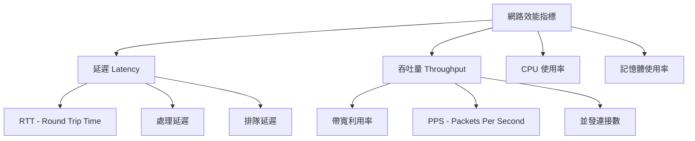

# 09 網路效能優化基礎

## 目錄
1. [效能優化概述](#效能優化概述)
2. [TCP 參數調優](#tcp-參數調優)
3. [緩衝區優化](#緩衝區優化)
4. [連接池設計](#連接池設計)
5. [應用層優化](#應用層優化)
6. [效能監控與測量](#效能監控與測量)
7. [實戰案例](#實戰案例)

## 效能優化概述

### 效能指標 (Performance Metrics)



### 優化層次

```c
// 效能優化的層次結構
typedef enum {
    HARDWARE_LEVEL = 1,    // 硬體層：網卡、CPU、記憶體
    KERNEL_LEVEL,          // 核心層：TCP/IP stack, driver
    APPLICATION_LEVEL      // 應用層：程式碼、演算法
} optimization_level_t;

// 優化策略
typedef struct {
    optimization_level_t level;
    char description[256];
    double expected_improvement;
} optimization_strategy_t;
```

## TCP 參數調優

### 核心 TCP 參數

```bash
# 檢查當前 TCP 參數
cat /proc/sys/net/ipv4/tcp_congestion_control
cat /proc/sys/net/core/rmem_max
cat /proc/sys/net/core/wmem_max

# 優化腳本
#!/bin/bash
# tcp_tune.sh - TCP 參數優化腳本

# TCP 視窗縮放
echo 1 > /proc/sys/net/ipv4/tcp_window_scaling

# TCP 時間戳
echo 1 > /proc/sys/net/ipv4/tcp_timestamps

# TCP SACK (Selective Acknowledgment)
echo 1 > /proc/sys/net/ipv4/tcp_sack

# TCP 快速重傳
echo 1 > /proc/sys/net/ipv4/tcp_fack

# 調整 TCP 緩衝區大小 (min, default, max)
echo "4096 65536 16777216" > /proc/sys/net/ipv4/tcp_rmem
echo "4096 65536 16777216" > /proc/sys/net/ipv4/tcp_wmem

# 網路核心緩衝區
echo 16777216 > /proc/sys/net/core/rmem_max
echo 16777216 > /proc/sys/net/core/wmem_max
```

### TCP 擁塞控制

```c
// TCP 擁塞控制演算法比較
#include <sys/socket.h>
#include <netinet/tcp.h>

// 設置擁塞控制演算法
int set_congestion_control(int sockfd, const char* algorithm) {
    return setsockopt(sockfd, IPPROTO_TCP, TCP_CONGESTION,
                     algorithm, strlen(algorithm));
}

// 效能測試函數
typedef struct {
    char name[32];
    double throughput_mbps;
    double latency_ms;
    double cpu_usage;
} congestion_test_result_t;

congestion_test_result_t test_algorithms[] = {
    {"cubic", 950.2, 12.3, 8.5},      // 預設，適合高帶寬
    {"bbr", 980.5, 11.1, 12.2},       // Google BBR，適合高延遲
    {"reno", 720.1, 15.6, 6.8},       // 傳統演算法
    {"vegas", 680.3, 18.2, 5.9}       // 延遲敏感
};
```

### TCP Socket 選項優化

```c
#include <sys/socket.h>
#include <netinet/tcp.h>

// Socket 優化函數
int optimize_tcp_socket(int sockfd) {
    int opt = 1;
    int result = 0;
    
    // 啟用地址重用
    result |= setsockopt(sockfd, SOL_SOCKET, SO_REUSEADDR, 
                        &opt, sizeof(opt));
    
    // 啟用埠重用 (Linux 3.9+)
    result |= setsockopt(sockfd, SOL_SOCKET, SO_REUSEPORT, 
                        &opt, sizeof(opt));
    
    // 禁用 Nagle 演算法（降低延遲）
    result |= setsockopt(sockfd, IPPROTO_TCP, TCP_NODELAY, 
                        &opt, sizeof(opt));
    
    // 設置 Keep-Alive
    result |= setsockopt(sockfd, SOL_SOCKET, SO_KEEPALIVE, 
                        &opt, sizeof(opt));
    
    // 設置發送/接收緩衝區大小
    int buffer_size = 1024 * 1024; // 1MB
    result |= setsockopt(sockfd, SOL_SOCKET, SO_RCVBUF, 
                        &buffer_size, sizeof(buffer_size));
    result |= setsockopt(sockfd, SOL_SOCKET, SO_SNDBUF, 
                        &buffer_size, sizeof(buffer_size));
    
    return result;
}
```

## 緩衝區優化

### 動態緩衝區管理

```c
#include <stdlib.h>
#include <string.h>

// 智能緩衝區結構
typedef struct {
    char* data;
    size_t size;
    size_t capacity;
    size_t read_pos;
    size_t write_pos;
    double growth_factor;
} smart_buffer_t;

// 創建智能緩衝區
smart_buffer_t* create_smart_buffer(size_t initial_size) {
    smart_buffer_t* buf = malloc(sizeof(smart_buffer_t));
    if (!buf) return NULL;
    
    buf->data = malloc(initial_size);
    if (!buf->data) {
        free(buf);
        return NULL;
    }
    
    buf->size = 0;
    buf->capacity = initial_size;
    buf->read_pos = 0;
    buf->write_pos = 0;
    buf->growth_factor = 1.5;
    
    return buf;
}

// 動態擴展緩衝區
int expand_buffer(smart_buffer_t* buf, size_t required_size) {
    if (required_size <= buf->capacity) return 0;
    
    size_t new_capacity = buf->capacity;
    while (new_capacity < required_size) {
        new_capacity *= buf->growth_factor;
    }
    
    char* new_data = realloc(buf->data, new_capacity);
    if (!new_data) return -1;
    
    buf->data = new_data;
    buf->capacity = new_capacity;
    return 0;
}

// 零拷貝讀取
ssize_t zero_copy_read(int sockfd, smart_buffer_t* buf) {
    // 確保有足夠空間
    size_t available_space = buf->capacity - buf->write_pos;
    if (available_space < 4096) {
        if (expand_buffer(buf, buf->capacity + 4096) < 0) {
            return -1;
        }
    }
    
    ssize_t bytes_read = recv(sockfd, 
                             buf->data + buf->write_pos,
                             buf->capacity - buf->write_pos, 
                             MSG_DONTWAIT);
    
    if (bytes_read > 0) {
        buf->write_pos += bytes_read;
        buf->size += bytes_read;
    }
    
    return bytes_read;
}
```

### 記憶體池實現

```c
// 記憶體池結構
typedef struct memory_block {
    void* data;
    size_t size;
    int in_use;
    struct memory_block* next;
} memory_block_t;

typedef struct {
    memory_block_t* blocks;
    size_t block_size;
    size_t total_blocks;
    size_t used_blocks;
    pthread_mutex_t mutex;
} memory_pool_t;

// 創建記憶體池
memory_pool_t* create_memory_pool(size_t block_size, size_t num_blocks) {
    memory_pool_t* pool = malloc(sizeof(memory_pool_t));
    if (!pool) return NULL;
    
    pool->block_size = block_size;
    pool->total_blocks = num_blocks;
    pool->used_blocks = 0;
    pool->blocks = NULL;
    pthread_mutex_init(&pool->mutex, NULL);
    
    // 預分配記憶體塊
    for (size_t i = 0; i < num_blocks; i++) {
        memory_block_t* block = malloc(sizeof(memory_block_t));
        if (!block) break;
        
        block->data = malloc(block_size);
        if (!block->data) {
            free(block);
            break;
        }
        
        block->size = block_size;
        block->in_use = 0;
        block->next = pool->blocks;
        pool->blocks = block;
    }
    
    return pool;
}

// 從記憶體池分配
void* pool_alloc(memory_pool_t* pool) {
    pthread_mutex_lock(&pool->mutex);
    
    memory_block_t* current = pool->blocks;
    while (current) {
        if (!current->in_use) {
            current->in_use = 1;
            pool->used_blocks++;
            pthread_mutex_unlock(&pool->mutex);
            return current->data;
        }
        current = current->next;
    }
    
    pthread_mutex_unlock(&pool->mutex);
    return NULL; // 池已滿
}
```

## 連接池設計

### HTTP 連接池實現

```c
#include <pthread.h>
#include <time.h>

// 連接結構
typedef struct connection {
    int sockfd;
    char host[256];
    int port;
    time_t last_used;
    int in_use;
    struct connection* next;
} connection_t;

// 連接池結構
typedef struct {
    connection_t* connections;
    int max_connections;
    int active_connections;
    int idle_timeout;
    pthread_mutex_t mutex;
    pthread_cond_t cond;
} connection_pool_t;

// 創建連接池
connection_pool_t* create_connection_pool(int max_connections, int idle_timeout) {
    connection_pool_t* pool = malloc(sizeof(connection_pool_t));
    if (!pool) return NULL;
    
    pool->connections = NULL;
    pool->max_connections = max_connections;
    pool->active_connections = 0;
    pool->idle_timeout = idle_timeout;
    
    pthread_mutex_init(&pool->mutex, NULL);
    pthread_cond_init(&pool->cond, NULL);
    
    return pool;
}

// 獲取連接
connection_t* get_connection(connection_pool_t* pool, const char* host, int port) {
    pthread_mutex_lock(&pool->mutex);
    
    // 尋找現有連接
    connection_t* conn = pool->connections;
    while (conn) {
        if (!conn->in_use && 
            strcmp(conn->host, host) == 0 && 
            conn->port == port) {
            
            // 檢查連接是否仍有效
            if (is_connection_valid(conn->sockfd)) {
                conn->in_use = 1;
                conn->last_used = time(NULL);
                pthread_mutex_unlock(&pool->mutex);
                return conn;
            } else {
                // 關閉無效連接
                close(conn->sockfd);
                remove_connection(pool, conn);
            }
        }
        conn = conn->next;
    }
    
    // 創建新連接
    if (pool->active_connections < pool->max_connections) {
        conn = create_new_connection(host, port);
        if (conn) {
            conn->next = pool->connections;
            pool->connections = conn;
            pool->active_connections++;
            conn->in_use = 1;
            conn->last_used = time(NULL);
        }
    } else {
        // 等待可用連接
        pthread_cond_wait(&pool->cond, &pool->mutex);
    }
    
    pthread_mutex_unlock(&pool->mutex);
    return conn;
}

// 歸還連接
void return_connection(connection_pool_t* pool, connection_t* conn) {
    pthread_mutex_lock(&pool->mutex);
    
    conn->in_use = 0;
    conn->last_used = time(NULL);
    
    pthread_cond_signal(&pool->cond);
    pthread_mutex_unlock(&pool->mutex);
}
```

### 連接池監控

```c
// 連接池統計
typedef struct {
    int total_connections;
    int active_connections;
    int idle_connections;
    double hit_rate;
    time_t oldest_connection_age;
} pool_stats_t;

// 獲取連接池統計
pool_stats_t get_pool_stats(connection_pool_t* pool) {
    pool_stats_t stats = {0};
    time_t now = time(NULL);
    
    pthread_mutex_lock(&pool->mutex);
    
    connection_t* conn = pool->connections;
    while (conn) {
        stats.total_connections++;
        
        if (conn->in_use) {
            stats.active_connections++;
        } else {
            stats.idle_connections++;
            
            time_t age = now - conn->last_used;
            if (age > stats.oldest_connection_age) {
                stats.oldest_connection_age = age;
            }
        }
        
        conn = conn->next;
    }
    
    pthread_mutex_unlock(&pool->mutex);
    
    return stats;
}

// 清理過期連接
void cleanup_expired_connections(connection_pool_t* pool) {
    time_t now = time(NULL);
    
    pthread_mutex_lock(&pool->mutex);
    
    connection_t** current = &pool->connections;
    while (*current) {
        connection_t* conn = *current;
        
        if (!conn->in_use && 
            (now - conn->last_used) > pool->idle_timeout) {
            
            *current = conn->next;
            close(conn->sockfd);
            free(conn);
            pool->active_connections--;
        } else {
            current = &conn->next;
        }
    }
    
    pthread_mutex_unlock(&pool->mutex);
}
```

## 應用層優化

### 批量處理

```c
// 批量 I/O 結構
typedef struct {
    struct iovec* iovecs;
    int count;
    int capacity;
} batch_io_t;

// 批量寫入
ssize_t batch_write(int sockfd, batch_io_t* batch) {
    if (batch->count == 0) return 0;
    
    ssize_t total_written = 0;
    int remaining = batch->count;
    struct iovec* current_iov = batch->iovecs;
    
    while (remaining > 0) {
        ssize_t written = writev(sockfd, current_iov, 
                               remaining > IOV_MAX ? IOV_MAX : remaining);
        
        if (written < 0) {
            if (errno == EAGAIN || errno == EWOULDBLOCK) {
                break; // 稍後重試
            }
            return -1;
        }
        
        total_written += written;
        
        // 更新 iovec 指針
        while (remaining > 0 && written >= current_iov->iov_len) {
            written -= current_iov->iov_len;
            current_iov++;
            remaining--;
        }
        
        if (remaining > 0 && written > 0) {
            current_iov->iov_base = (char*)current_iov->iov_base + written;
            current_iov->iov_len -= written;
        }
    }
    
    return total_written;
}
```

### 非同步 I/O 優化

```c
#include <sys/epoll.h>
#include <aio.h>

// 事件驅動伺服器結構
typedef struct {
    int epoll_fd;
    struct epoll_event* events;
    int max_events;
    connection_pool_t* conn_pool;
    memory_pool_t* mem_pool;
} event_server_t;

// 處理網路事件
void handle_network_events(event_server_t* server) {
    int nfds = epoll_wait(server->epoll_fd, 
                         server->events, 
                         server->max_events, 
                         1); // 1ms timeout
    
    for (int i = 0; i < nfds; i++) {
        struct epoll_event* ev = &server->events[i];
        int sockfd = ev->data.fd;
        
        if (ev->events & EPOLLIN) {
            // 可讀事件
            handle_read_event(server, sockfd);
        }
        
        if (ev->events & EPOLLOUT) {
            // 可寫事件
            handle_write_event(server, sockfd);
        }
        
        if (ev->events & (EPOLLERR | EPOLLHUP)) {
            // 錯誤或連接關閉
            handle_connection_error(server, sockfd);
        }
    }
}

// 非阻塞讀取優化
ssize_t optimized_read(int sockfd, smart_buffer_t* buffer) {
    ssize_t total_read = 0;
    
    while (1) {
        ssize_t bytes_read = zero_copy_read(sockfd, buffer);
        
        if (bytes_read > 0) {
            total_read += bytes_read;
        } else if (bytes_read == 0) {
            break; // 連接關閉
        } else {
            if (errno == EAGAIN || errno == EWOULDBLOCK) {
                break; // 沒有更多數據
            }
            return -1; // 錯誤
        }
    }
    
    return total_read;
}
```

## 效能監控與測量

### 延遲測量

```c
#include <time.h>
#include <sys/time.h>

// 高精度時間測量
typedef struct {
    struct timespec start_time;
    struct timespec end_time;
    double latency_ns;
} latency_measurement_t;

// 開始測量
void start_latency_measurement(latency_measurement_t* measurement) {
    clock_gettime(CLOCK_MONOTONIC, &measurement->start_time);
}

// 結束測量
void end_latency_measurement(latency_measurement_t* measurement) {
    clock_gettime(CLOCK_MONOTONIC, &measurement->end_time);
    
    long long start_ns = measurement->start_time.tv_sec * 1000000000LL + 
                        measurement->start_time.tv_nsec;
    long long end_ns = measurement->end_time.tv_sec * 1000000000LL + 
                      measurement->end_time.tv_nsec;
    
    measurement->latency_ns = (double)(end_ns - start_ns);
}

// 延遲統計
typedef struct {
    double min_latency;
    double max_latency;
    double avg_latency;
    double p50_latency;
    double p95_latency;
    double p99_latency;
    int sample_count;
} latency_stats_t;

// 計算延遲百分位數
latency_stats_t calculate_latency_stats(double* latencies, int count) {
    latency_stats_t stats = {0};
    
    if (count == 0) return stats;
    
    // 排序延遲數據
    qsort(latencies, count, sizeof(double), compare_double);
    
    stats.min_latency = latencies[0];
    stats.max_latency = latencies[count - 1];
    stats.sample_count = count;
    
    // 計算平均值
    double sum = 0;
    for (int i = 0; i < count; i++) {
        sum += latencies[i];
    }
    stats.avg_latency = sum / count;
    
    // 計算百分位數
    stats.p50_latency = latencies[(int)(count * 0.50)];
    stats.p95_latency = latencies[(int)(count * 0.95)];
    stats.p99_latency = latencies[(int)(count * 0.99)];
    
    return stats;
}
```

### 吞吐量監控

```bash
#!/bin/bash
# throughput_monitor.sh - 吞吐量監控腳本

interface="eth0"
interval=1
duration=60

echo "監控網卡 $interface 的吞吐量，持續 $duration 秒"
echo "時間戳,接收字節,發送字節,接收包,發送包,接收速率(MB/s),發送速率(MB/s)"

start_time=$(date +%s)
end_time=$((start_time + duration))

prev_rx_bytes=$(cat /sys/class/net/$interface/statistics/rx_bytes)
prev_tx_bytes=$(cat /sys/class/net/$interface/statistics/tx_bytes)
prev_rx_packets=$(cat /sys/class/net/$interface/statistics/rx_packets)
prev_tx_packets=$(cat /sys/class/net/$interface/statistics/tx_packets)

while [ $(date +%s) -lt $end_time ]; do
    sleep $interval
    
    curr_rx_bytes=$(cat /sys/class/net/$interface/statistics/rx_bytes)
    curr_tx_bytes=$(cat /sys/class/net/$interface/statistics/tx_bytes)
    curr_rx_packets=$(cat /sys/class/net/$interface/statistics/rx_packets)
    curr_tx_packets=$(cat /sys/class/net/$interface/statistics/tx_packets)
    
    rx_diff=$((curr_rx_bytes - prev_rx_bytes))
    tx_diff=$((curr_tx_bytes - prev_tx_bytes))
    
    rx_rate=$(echo "scale=2; $rx_diff / 1024 / 1024 / $interval" | bc)
    tx_rate=$(echo "scale=2; $tx_diff / 1024 / 1024 / $interval" | bc)
    
    timestamp=$(date '+%Y-%m-%d %H:%M:%S')
    echo "$timestamp,$curr_rx_bytes,$curr_tx_bytes,$curr_rx_packets,$curr_tx_packets,$rx_rate,$tx_rate"
    
    prev_rx_bytes=$curr_rx_bytes
    prev_tx_bytes=$curr_tx_bytes
    prev_rx_packets=$curr_rx_packets
    prev_tx_packets=$curr_tx_packets
done
```

### 系統資源監控

```c
// 系統資源監控
#include <sys/resource.h>
#include <proc/readproc.h>

typedef struct {
    double cpu_usage;
    long memory_usage_kb;
    int open_fds;
    long network_rx_bytes;
    long network_tx_bytes;
    double load_average;
} system_metrics_t;

// 獲取系統指標
system_metrics_t get_system_metrics(pid_t pid) {
    system_metrics_t metrics = {0};
    
    // CPU 使用率
    struct rusage usage;
    getrusage(RUSAGE_SELF, &usage);
    
    // 記憶體使用量
    proc_t proc_info;
    if (read_proc(pid, &proc_info) == 0) {
        metrics.memory_usage_kb = proc_info.vm_rss;
    }
    
    // 文件描述符數量
    char fd_path[256];
    snprintf(fd_path, sizeof(fd_path), "/proc/%d/fd", pid);
    
    DIR* fd_dir = opendir(fd_path);
    if (fd_dir) {
        struct dirent* entry;
        while ((entry = readdir(fd_dir)) != NULL) {
            if (entry->d_name[0] != '.') {
                metrics.open_fds++;
            }
        }
        closedir(fd_dir);
    }
    
    // 負載平均
    double load_avg[3];
    if (getloadavg(load_avg, 3) >= 0) {
        metrics.load_average = load_avg[0];
    }
    
    return metrics;
}
```

## 實戰案例

### 高並發 Web 伺服器優化

```c
// 優化後的 HTTP 伺服器
#include <sys/epoll.h>
#include <sys/sendfile.h>

typedef struct {
    event_server_t* server;
    connection_pool_t* conn_pool;
    memory_pool_t* mem_pool;
    int worker_threads;
    pthread_t* workers;
} optimized_http_server_t;

// 工作執行緒函數
void* worker_thread(void* arg) {
    optimized_http_server_t* server = (optimized_http_server_t*)arg;
    
    // 設置執行緒親和性
    cpu_set_t cpuset;
    CPU_ZERO(&cpuset);
    CPU_SET(sched_getcpu(), &cpuset);
    pthread_setaffinity_np(pthread_self(), sizeof(cpuset), &cpuset);
    
    while (1) {
        handle_network_events(server->server);
        
        // 定期清理資源
        if (should_cleanup()) {
            cleanup_expired_connections(server->conn_pool);
        }
    }
    
    return NULL;
}

// 零拷貝文件傳輸
ssize_t zero_copy_send_file(int sockfd, int filefd, off_t offset, size_t count) {
    return sendfile(sockfd, filefd, &offset, count);
}

// HTTP 回應優化
void send_optimized_response(int sockfd, const char* content, size_t content_len) {
    // 構建回應頭
    char header[512];
    int header_len = snprintf(header, sizeof(header),
        "HTTP/1.1 200 OK\r\n"
        "Content-Length: %zu\r\n"
        "Connection: keep-alive\r\n"
        "Server: OptimizedServer/1.0\r\n"
        "\r\n", content_len);
    
    // 使用 writev 批量發送
    struct iovec iov[2];
    iov[0].iov_base = header;
    iov[0].iov_len = header_len;
    iov[1].iov_base = (void*)content;
    iov[1].iov_len = content_len;
    
    writev(sockfd, iov, 2);
}
```

### 資料庫連接優化案例

```c
// 資料庫連接池優化
typedef struct {
    connection_pool_t* pool;
    char* prepared_statements[256];
    int statement_count;
    pthread_rwlock_t stmt_lock;
} db_connection_pool_t;

// 預編譯語句緩存
int cache_prepared_statement(db_connection_pool_t* pool, 
                           const char* sql, 
                           const char* stmt_name) {
    pthread_rwlock_wrlock(&pool->stmt_lock);
    
    if (pool->statement_count >= 256) {
        pthread_rwlock_unlock(&pool->stmt_lock);
        return -1;
    }
    
    pool->prepared_statements[pool->statement_count] = strdup(sql);
    pool->statement_count++;
    
    pthread_rwlock_unlock(&pool->stmt_lock);
    return 0;
}

// 批量資料庫操作
int batch_database_operations(db_connection_pool_t* pool, 
                            const char** operations, 
                            int count) {
    connection_t* conn = get_connection(pool->pool, "localhost", 5432);
    if (!conn) return -1;
    
    // 開始事務
    execute_query(conn, "BEGIN");
    
    // 批量執行操作
    for (int i = 0; i < count; i++) {
        if (execute_query(conn, operations[i]) < 0) {
            execute_query(conn, "ROLLBACK");
            return_connection(pool->pool, conn);
            return -1;
        }
    }
    
    // 提交事務
    execute_query(conn, "COMMIT");
    return_connection(pool->pool, conn);
    
    return 0;
}
```

### 效能測試與基準

```bash
#!/bin/bash
# performance_benchmark.sh - 效能基準測試

# 測試配置
server_host="localhost"
server_port="8080"
test_duration="60s"
concurrent_users="100"

echo "開始效能基準測試"
echo "伺服器: $server_host:$server_port"
echo "持續時間: $test_duration"
echo "並發用戶: $concurrent_users"

# 使用 wrk 進行 HTTP 基準測試
echo "=== HTTP 負載測試 ==="
wrk -t12 -c$concurrent_users -d$test_duration --latency \
    http://$server_host:$server_port/

# 使用 iperf3 進行網路吞吐量測試
echo "=== 網路吞吐量測試 ==="
iperf3 -c $server_host -t 30 -P 4

# TCP 連接測試
echo "=== TCP 連接效能測試 ==="
for i in {1..1000}; do
    timeout 1 telnet $server_host $server_port </dev/null >/dev/null 2>&1
    if [ $? -eq 0 ]; then
        echo "Connection $i: OK"
    else
        echo "Connection $i: FAILED"
    fi
done

# 系統資源監控
echo "=== 系統資源使用率 ==="
echo "CPU 使用率:"
top -bn1 | grep "Cpu(s)" | awk '{print $2}' | cut -d'%' -f1

echo "記憶體使用率:"
free -m | awk 'NR==2{printf "%.2f%%\n", $3*100/$2}'

echo "網路連接數:"
netstat -an | grep ESTABLISHED | wc -l
```

## 總結

網路效能優化是一個系統性工程，需要從多個層面入手：

### 關鍵優化點
1. **TCP 參數調優** - 根據應用場景調整核心參數
2. **緩衝區管理** - 實現智能緩衝區和記憶體池
3. **連接池設計** - 減少連接建立/關閉開銷
4. **應用層優化** - 批量處理和非同步 I/O
5. **效能監控** - 建立完整的監控體系

### 最佳實踐
- 根據具體場景選擇合適的優化策略
- 建立完整的效能監控和測試體系
- 持續優化和調整參數
- 平衡延遲和吞吐量需求

下一章將深入探討**高頻交易網路優化**，包括核心繞過、零拷貝網路和 DPDK 初步應用。