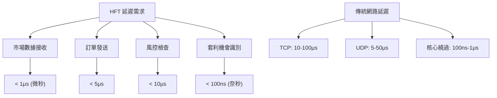

# 10 高頻交易網路優化

## 目錄
1. [HFT 網路需求概述](#hft-網路需求概述)
2. [核心繞過技術](#核心繞過技術)
3. [零拷貝網路](#零拷貝網路)
4. [硬體加速](#硬體加速)
5. [低延遲網路協議](#低延遲網路協議)
6. [時間同步與精確度](#時間同步與精確度)
7. [實戰優化案例](#實戰優化案例)

## HFT 網路需求概述

### 延遲要求



### HFT 系統架構

```c
// HFT 系統核心組件
typedef struct {
    uint64_t timestamp_ns;     // 奈秒級時間戳
    uint32_t sequence_number;  // 序列號
    uint16_t message_type;     // 消息類型
    uint16_t market_id;        // 市場標識
} __attribute__((packed)) hft_message_header_t;

// 市場數據結構
typedef struct {
    hft_message_header_t header;
    char symbol[8];            // 股票代碼
    uint64_t price;            // 價格 (定點數)
    uint32_t quantity;         // 數量
    uint8_t side;              // 買賣方向
    uint8_t padding[3];
} __attribute__((packed)) market_data_t;

// 訂單結構
typedef struct {
    hft_message_header_t header;
    uint64_t order_id;         // 訂單ID
    char symbol[8];            // 股票代碼
    uint64_t price;            // 價格
    uint32_t quantity;         // 數量
    uint8_t side;              // 買賣方向
    uint8_t order_type;        // 訂單類型
    uint8_t time_in_force;     // 有效期
    uint8_t padding[1];
} __attribute__((packed)) order_message_t;
```

### 延遲預算分析

```c
// 延遲預算結構
typedef struct {
    const char* component;
    uint32_t budget_ns;        // 預算 (奈秒)
    uint32_t actual_ns;        // 實際延遲
    double utilization;        // 利用率
} latency_budget_t;

// HFT 系統延遲預算
latency_budget_t hft_latency_budget[] = {
    {"網卡硬體接收", 50, 45, 0.9},
    {"DMA 傳輸", 100, 80, 0.8},
    {"用戶空間處理", 200, 150, 0.75},
    {"策略計算", 300, 250, 0.83},
    {"訂單生成", 100, 80, 0.8},
    {"網卡硬體發送", 50, 40, 0.8},
    {"網路傳輸", 200, 180, 0.9}
};

// 計算總延遲預算
uint32_t calculate_total_latency_budget() {
    uint32_t total = 0;
    int count = sizeof(hft_latency_budget) / sizeof(latency_budget_t);
    
    for (int i = 0; i < count; i++) {
        total += hft_latency_budget[i].actual_ns;
    }
    
    return total; // 預期總延遲: ~825ns
}
```

## 核心繞過技術

### DPDK 基礎實現

```c
#include <rte_ethdev.h>
#include <rte_mbuf.h>
#include <rte_mempool.h>

// DPDK 初始化結構
typedef struct {
    uint16_t port_id;
    uint16_t rx_queue_id;
    uint16_t tx_queue_id;
    struct rte_mempool* mbuf_pool;
    struct rte_eth_conf port_conf;
} dpdk_port_config_t;

// 初始化 DPDK 環境
int init_dpdk_environment(int argc, char** argv) {
    // 初始化 EAL (Environment Abstraction Layer)
    int ret = rte_eal_init(argc, argv);
    if (ret < 0) {
        return -1;
    }
    
    // 檢查可用埠數量
    uint16_t nb_ports = rte_eth_dev_count_avail();
    if (nb_ports == 0) {
        rte_exit(EXIT_FAILURE, "No Ethernet ports available\n");
    }
    
    return 0;
}

// 配置 DPDK 埠
int configure_dpdk_port(dpdk_port_config_t* config) {
    struct rte_eth_conf port_conf = {
        .rxmode = {
            .mq_mode = ETH_MQ_RX_RSS,
            .max_rx_pkt_len = RTE_ETHER_MAX_LEN,
            .split_hdr_size = 0,
        },
        .rx_adv_conf = {
            .rss_conf = {
                .rss_key = NULL,
                .rss_hf = ETH_RSS_IP | ETH_RSS_UDP | ETH_RSS_TCP,
            },
        },
        .txmode = {
            .mq_mode = ETH_MQ_TX_NONE,
        },
    };
    
    // 配置設備
    int ret = rte_eth_dev_configure(config->port_id, 1, 1, &port_conf);
    if (ret < 0) {
        return ret;
    }
    
    // 設置 RX 隊列
    ret = rte_eth_rx_queue_setup(config->port_id, 0, 128,
                                rte_eth_dev_socket_id(config->port_id),
                                NULL, config->mbuf_pool);
    if (ret < 0) {
        return ret;
    }
    
    // 設置 TX 隊列
    ret = rte_eth_tx_queue_setup(config->port_id, 0, 128,
                                rte_eth_dev_socket_id(config->port_id),
                                NULL);
    if (ret < 0) {
        return ret;
    }
    
    // 啟動設備
    ret = rte_eth_dev_start(config->port_id);
    if (ret < 0) {
        return ret;
    }
    
    // 設置混雜模式
    rte_eth_promiscuous_enable(config->port_id);
    
    return 0;
}
```

### 用戶空間網路驅動

```c
// UIO (Userspace I/O) 介面
#include <sys/mman.h>
#include <fcntl.h>

typedef struct {
    void* mapped_addr;         // 映射地址
    size_t mapped_size;        // 映射大小
    int uio_fd;               // UIO 文件描述符
    uint32_t* dma_buffer;     // DMA 緩衝區
    volatile uint32_t* registers; // 暫存器映射
} uio_device_t;

// 初始化 UIO 設備
int init_uio_device(uio_device_t* dev, const char* device_path) {
    // 打開 UIO 設備
    dev->uio_fd = open(device_path, O_RDWR);
    if (dev->uio_fd < 0) {
        return -1;
    }
    
    // 映射設備記憶體
    dev->mapped_size = 64 * 1024; // 64KB
    dev->mapped_addr = mmap(NULL, dev->mapped_size,
                           PROT_READ | PROT_WRITE,
                           MAP_SHARED, dev->uio_fd, 0);
    
    if (dev->mapped_addr == MAP_FAILED) {
        close(dev->uio_fd);
        return -1;
    }
    
    // 設置暫存器指針
    dev->registers = (volatile uint32_t*)dev->mapped_addr;
    
    return 0;
}

// 直接硬體存取
static inline uint32_t read_register(uio_device_t* dev, uint32_t offset) {
    return dev->registers[offset / 4];
}

static inline void write_register(uio_device_t* dev, uint32_t offset, uint32_t value) {
    dev->registers[offset / 4] = value;
    __sync_synchronize(); // 記憶體屏障
}
```

### 輪詢模式驅動 (PMD)

```c
// 高效能輪詢接收
uint16_t poll_receive_packets(dpdk_port_config_t* config, 
                             struct rte_mbuf** rx_pkts, 
                             uint16_t nb_pkts) {
    // 批量接收封包
    uint16_t nb_rx = rte_eth_rx_burst(config->port_id, 
                                     config->rx_queue_id,
                                     rx_pkts, nb_pkts);
    
    // 處理接收到的封包
    for (uint16_t i = 0; i < nb_rx; i++) {
        struct rte_mbuf* pkt = rx_pkts[i];
        
        // 獲取封包時間戳 (硬體時間戳)
        uint64_t timestamp = get_hardware_timestamp(pkt);
        
        // 快速封包解析
        if (likely(is_market_data_packet(pkt))) {
            process_market_data_fast(pkt, timestamp);
        }
    }
    
    return nb_rx;
}

// 零拷貝發送
uint16_t zero_copy_send_packets(dpdk_port_config_t* config,
                               struct rte_mbuf** tx_pkts,
                               uint16_t nb_pkts) {
    // 批量發送封包
    uint16_t nb_tx = rte_eth_tx_burst(config->port_id,
                                     config->tx_queue_id,
                                     tx_pkts, nb_pkts);
    
    // 釋放未發送的封包
    if (unlikely(nb_tx < nb_pkts)) {
        for (uint16_t i = nb_tx; i < nb_pkts; i++) {
            rte_pktmbuf_free(tx_pkts[i]);
        }
    }
    
    return nb_tx;
}
```

## 零拷貝網路

### 記憶體映射 I/O

```c
#include <sys/mman.h>
#include <linux/if_packet.h>

// AF_PACKET MMAP 環形緩衝
typedef struct {
    void* mapped_buffer;       // 映射緩衝區
    size_t buffer_size;        // 緩衝區大小
    uint32_t frame_size;       // 幀大小
    uint32_t frame_count;      // 幀數量
    uint32_t current_frame;    // 當前幀索引
    int socket_fd;             // Socket 文件描述符
} packet_mmap_t;

// 初始化 AF_PACKET MMAP
int init_packet_mmap(packet_mmap_t* mmap_ctx, const char* interface) {
    // 創建 AF_PACKET socket
    mmap_ctx->socket_fd = socket(AF_PACKET, SOCK_RAW, htons(ETH_P_ALL));
    if (mmap_ctx->socket_fd < 0) {
        return -1;
    }
    
    // 綁定到網路介面
    struct sockaddr_ll sll;
    memset(&sll, 0, sizeof(sll));
    sll.sll_family = AF_PACKET;
    sll.sll_ifindex = if_nametoindex(interface);
    sll.sll_protocol = htons(ETH_P_ALL);
    
    if (bind(mmap_ctx->socket_fd, (struct sockaddr*)&sll, sizeof(sll)) < 0) {
        close(mmap_ctx->socket_fd);
        return -1;
    }
    
    // 設置 PACKET_MMAP
    struct tpacket_req req;
    req.tp_block_size = 4096 * 16;    // 64KB 塊
    req.tp_block_nr = 256;            // 256 塊
    req.tp_frame_size = 2048;         // 2KB 幀
    req.tp_frame_nr = req.tp_block_size * req.tp_block_nr / req.tp_frame_size;
    
    if (setsockopt(mmap_ctx->socket_fd, SOL_PACKET, PACKET_RX_RING,
                   &req, sizeof(req)) < 0) {
        close(mmap_ctx->socket_fd);
        return -1;
    }
    
    // 映射記憶體
    mmap_ctx->buffer_size = req.tp_block_size * req.tp_block_nr;
    mmap_ctx->mapped_buffer = mmap(NULL, mmap_ctx->buffer_size,
                                  PROT_READ | PROT_WRITE,
                                  MAP_SHARED, mmap_ctx->socket_fd, 0);
    
    if (mmap_ctx->mapped_buffer == MAP_FAILED) {
        close(mmap_ctx->socket_fd);
        return -1;
    }
    
    mmap_ctx->frame_size = req.tp_frame_size;
    mmap_ctx->frame_count = req.tp_frame_nr;
    mmap_ctx->current_frame = 0;
    
    return 0;
}

// 零拷貝接收封包
void* zero_copy_receive_packet(packet_mmap_t* mmap_ctx, uint32_t* packet_len) {
    struct tpacket_hdr* header;
    
    while (1) {
        // 獲取當前幀
        header = (struct tpacket_hdr*)((char*)mmap_ctx->mapped_buffer +
                 mmap_ctx->current_frame * mmap_ctx->frame_size);
        
        // 檢查幀狀態
        if (header->tp_status & TP_STATUS_USER) {
            // 封包可用
            *packet_len = header->tp_len;
            void* packet_data = (char*)header + header->tp_mac;
            
            return packet_data;
        }
        
        // 沒有封包，繼續輪詢
        _mm_pause(); // CPU pause 指令
    }
}

// 標記封包已處理
void mark_packet_processed(packet_mmap_t* mmap_ctx) {
    struct tpacket_hdr* header = (struct tpacket_hdr*)
        ((char*)mmap_ctx->mapped_buffer +
         mmap_ctx->current_frame * mmap_ctx->frame_size);
    
    header->tp_status = TP_STATUS_KERNEL;
    
    // 移動到下一幀
    mmap_ctx->current_frame = (mmap_ctx->current_frame + 1) % mmap_ctx->frame_count;
}
```

### DMA 一致性記憶體

```c
#include <linux/dma-mapping.h>

// DMA 緩衝區管理
typedef struct {
    void* cpu_addr;            // CPU 可存取地址
    dma_addr_t dma_addr;       // DMA 地址
    size_t size;               // 緩衝區大小
    struct device* dev;        // 設備指針
} dma_buffer_t;

// 分配 DMA 一致性記憶體
dma_buffer_t* alloc_dma_buffer(struct device* dev, size_t size) {
    dma_buffer_t* buffer = kmalloc(sizeof(dma_buffer_t), GFP_KERNEL);
    if (!buffer) {
        return NULL;
    }
    
    // 分配 DMA 一致性記憶體
    buffer->cpu_addr = dma_alloc_coherent(dev, size, 
                                         &buffer->dma_addr, 
                                         GFP_KERNEL);
    if (!buffer->cpu_addr) {
        kfree(buffer);
        return NULL;
    }
    
    buffer->size = size;
    buffer->dev = dev;
    
    return buffer;
}

// 高效 DMA 描述符鍊
typedef struct dma_descriptor {
    uint64_t buffer_addr;      // 緩衝區地址
    uint32_t length;           // 數據長度
    uint32_t flags;            // 控制標誌
    struct dma_descriptor* next; // 下一個描述符
} dma_descriptor_t;

// 批量 DMA 傳輸
int batch_dma_transfer(dma_descriptor_t* desc_chain, int desc_count) {
    // 設置 DMA 描述符鍊
    for (int i = 0; i < desc_count; i++) {
        // 設置硬體 DMA 暫存器
        write_register(DMA_BASE, DMA_DESC_ADDR_REG, 
                      (uint32_t)desc_chain[i].buffer_addr);
        write_register(DMA_BASE, DMA_DESC_LEN_REG, 
                      desc_chain[i].length);
        write_register(DMA_BASE, DMA_DESC_FLAGS_REG, 
                      desc_chain[i].flags);
    }
    
    // 啟動 DMA 傳輸
    write_register(DMA_BASE, DMA_CONTROL_REG, DMA_START);
    
    return 0;
}
```

## 硬體加速

### FPGA 網路卸載

```c
// FPGA 加速結構
typedef struct {
    volatile uint32_t* fpga_registers;  // FPGA 暫存器
    void* input_buffer;                 // 輸入緩衝區
    void* output_buffer;                // 輸出緩衝區
    uint32_t buffer_size;               // 緩衝區大小
    int fpga_fd;                        // FPGA 設備文件描述符
} fpga_accelerator_t;

// FPGA 暫存器定義
#define FPGA_CONTROL_REG     0x00
#define FPGA_STATUS_REG      0x04
#define FPGA_INPUT_ADDR_REG  0x08
#define FPGA_OUTPUT_ADDR_REG 0x0C
#define FPGA_LENGTH_REG      0x10

// 初始化 FPGA 加速器
int init_fpga_accelerator(fpga_accelerator_t* fpga, const char* device_path) {
    // 打開 FPGA 設備
    fpga->fpga_fd = open(device_path, O_RDWR);
    if (fpga->fpga_fd < 0) {
        return -1;
    }
    
    // 映射 FPGA 暫存器
    fpga->fpga_registers = mmap(NULL, 4096, PROT_READ | PROT_WRITE,
                               MAP_SHARED, fpga->fpga_fd, 0);
    if (fpga->fpga_registers == MAP_FAILED) {
        close(fpga->fpga_fd);
        return -1;
    }
    
    // 分配緩衝區
    fpga->buffer_size = 1024 * 1024; // 1MB
    fpga->input_buffer = aligned_alloc(4096, fpga->buffer_size);
    fpga->output_buffer = aligned_alloc(4096, fpga->buffer_size);
    
    if (!fpga->input_buffer || !fpga->output_buffer) {
        // 清理資源
        return -1;
    }
    
    return 0;
}

// FPGA 市場數據處理
int fpga_process_market_data(fpga_accelerator_t* fpga, 
                            const void* input_data, 
                            size_t input_size,
                            void* output_data, 
                            size_t* output_size) {
    // 複製輸入數據到 FPGA 緩衝區
    memcpy(fpga->input_buffer, input_data, input_size);
    
    // 設置 FPGA 暫存器
    fpga->fpga_registers[FPGA_INPUT_ADDR_REG / 4] = 
        (uint32_t)(uintptr_t)fpga->input_buffer;
    fpga->fpga_registers[FPGA_OUTPUT_ADDR_REG / 4] = 
        (uint32_t)(uintptr_t)fpga->output_buffer;
    fpga->fpga_registers[FPGA_LENGTH_REG / 4] = input_size;
    
    // 啟動 FPGA 處理
    fpga->fpga_registers[FPGA_CONTROL_REG / 4] = 1;
    
    // 輪詢等待完成
    while (!(fpga->fpga_registers[FPGA_STATUS_REG / 4] & 0x1)) {
        _mm_pause();
    }
    
    // 獲取輸出大小
    *output_size = fpga->fpga_registers[FPGA_LENGTH_REG / 4];
    
    // 複製輸出數據
    memcpy(output_data, fpga->output_buffer, *output_size);
    
    return 0;
}
```

### 智能網卡 (SmartNIC) 整合

```c
// SmartNIC 配置結構
typedef struct {
    void* nic_memory;          // NIC 記憶體映射
    uint32_t queue_count;      // 隊列數量
    uint32_t* rx_queues;       // 接收隊列
    uint32_t* tx_queues;       // 發送隊列
    uint64_t features;         // 功能標誌
} smartnic_config_t;

// SmartNIC 功能標誌
#define SMARTNIC_FEATURE_RSS         (1ULL << 0)
#define SMARTNIC_FEATURE_TSO         (1ULL << 1)
#define SMARTNIC_FEATURE_CHECKSUM    (1ULL << 2)
#define SMARTNIC_FEATURE_TIMESTAMP   (1ULL << 3)
#define SMARTNIC_FEATURE_FILTERING   (1ULL << 4)

// 硬體時間戳功能
uint64_t get_hardware_timestamp_ns(struct rte_mbuf* pkt) {
    if (pkt->ol_flags & PKT_RX_IEEE1588_TMST) {
        // 從硬體獲取 IEEE 1588 時間戳
        return pkt->timestamp;
    }
    
    // 後備軟體時間戳
    struct timespec ts;
    clock_gettime(CLOCK_REALTIME, &ts);
    return ts.tv_sec * 1000000000ULL + ts.tv_nsec;
}

// 硬體封包過濾
int setup_hardware_filters(smartnic_config_t* nic) {
    // 設置市場數據過濾器
    struct rte_eth_ethertype_filter market_data_filter = {
        .ether_type = 0x0800,     // IPv4
        .flags = RTE_ETHTYPE_FLAGS_MAC,
        .mac_addr = {0x01, 0x02, 0x03, 0x04, 0x05, 0x06},
        .queue = 0                // 導向隊列 0
    };
    
    // 設置 UDP 埠過濾
    struct rte_eth_udp_tunnel udp_filter = {
        .udp_port = 12345,        // 市場數據埠
        .prot_type = RTE_TUNNEL_TYPE_UDP
    };
    
    return 0;
}
```

## 低延遲網路協議

### UDP 優化實現

```c
// 超低延遲 UDP 實現
typedef struct {
    int sockfd;
    struct sockaddr_in dest_addr;
    char* send_buffer;
    size_t buffer_size;
    uint32_t sequence_number;
} low_latency_udp_t;

// 創建低延遲 UDP socket
int create_low_latency_udp(low_latency_udp_t* udp_ctx, 
                          const char* dest_ip, 
                          uint16_t dest_port) {
    // 創建 socket
    udp_ctx->sockfd = socket(AF_INET, SOCK_DGRAM, 0);
    if (udp_ctx->sockfd < 0) {
        return -1;
    }
    
    // 設置 socket 選項
    int opt = 1;
    
    // 設置 SO_REUSEADDR
    setsockopt(udp_ctx->sockfd, SOL_SOCKET, SO_REUSEADDR, &opt, sizeof(opt));
    
    // 設置發送緩衝區大小
    int send_buf_size = 1024 * 1024; // 1MB
    setsockopt(udp_ctx->sockfd, SOL_SOCKET, SO_SNDBUF, 
              &send_buf_size, sizeof(send_buf_size));
    
    // 設置接收緩衝區大小
    setsockopt(udp_ctx->sockfd, SOL_SOCKET, SO_RCVBUF, 
              &send_buf_size, sizeof(send_buf_size));
    
    // 設置 IP_TOS (Type of Service) 提高優先級
    int tos = IPTOS_LOWDELAY | IPTOS_THROUGHPUT;
    setsockopt(udp_ctx->sockfd, IPPROTO_IP, IP_TOS, &tos, sizeof(tos));
    
    // 設置目標地址
    memset(&udp_ctx->dest_addr, 0, sizeof(udp_ctx->dest_addr));
    udp_ctx->dest_addr.sin_family = AF_INET;
    udp_ctx->dest_addr.sin_port = htons(dest_port);
    inet_pton(AF_INET, dest_ip, &udp_ctx->dest_addr.sin_addr);
    
    // 分配發送緩衝區
    udp_ctx->buffer_size = 1500; // MTU 大小
    udp_ctx->send_buffer = aligned_alloc(32, udp_ctx->buffer_size);
    udp_ctx->sequence_number = 0;
    
    return 0;
}

// 超低延遲發送
static inline ssize_t ultra_low_latency_send(low_latency_udp_t* udp_ctx,
                                            const void* data, 
                                            size_t len) {
    // 內聯組裝封包
    hft_message_header_t* header = (hft_message_header_t*)udp_ctx->send_buffer;
    
    // 獲取硬體時間戳
    header->timestamp_ns = rdtsc_to_ns(rdtsc());
    header->sequence_number = ++udp_ctx->sequence_number;
    
    // 複製數據
    memcpy(udp_ctx->send_buffer + sizeof(hft_message_header_t), data, len);
    
    // 直接發送，不做錯誤檢查以降低延遲
    return sendto(udp_ctx->sockfd, udp_ctx->send_buffer, 
                 len + sizeof(hft_message_header_t), MSG_DONTWAIT,
                 (struct sockaddr*)&udp_ctx->dest_addr, 
                 sizeof(udp_ctx->dest_addr));
}
```

### 自定義可靠性協議

```c
// 輕量級可靠性協議
typedef struct {
    uint32_t sequence_number;
    uint32_t ack_number;
    uint16_t window_size;
    uint16_t flags;
    uint32_t checksum;
} lightweight_header_t;

// 協議標誌
#define LWP_FLAG_SYN  0x01
#define LWP_FLAG_ACK  0x02
#define LWP_FLAG_FIN  0x04
#define LWP_FLAG_RST  0x08

// 滑動視窗實現
typedef struct {
    uint32_t base_seq;         // 基準序列號
    uint32_t next_seq;         // 下一個序列號
    uint32_t window_size;      // 視窗大小
    uint32_t* ack_bitmap;      // ACK 位圖
    struct timespec* send_times; // 發送時間
} sliding_window_t;

// 快速重傳機制
int fast_retransmit(sliding_window_t* window, uint32_t ack_seq) {
    int duplicate_acks = 0;
    
    // 檢查重複 ACK
    for (uint32_t seq = window->base_seq; seq < ack_seq; seq++) {
        if (is_acked(window, seq)) {
            duplicate_acks++;
        }
    }
    
    // 如果有 3 個重複 ACK，立即重傳
    if (duplicate_acks >= 3) {
        return retransmit_packet(window, ack_seq + 1);
    }
    
    return 0;
}
```

## 時間同步與精確度

### 高精度時間戳

```c
#include <time.h>
#include <x86intrin.h>

// TSC (Time Stamp Counter) 相關函數
static uint64_t tsc_frequency = 0;

// 初始化 TSC 頻率
void init_tsc_frequency() {
    struct timespec start, end;
    uint64_t tsc_start, tsc_end;
    
    clock_gettime(CLOCK_MONOTONIC, &start);
    tsc_start = __rdtsc();
    
    usleep(100000); // 100ms
    
    clock_gettime(CLOCK_MONOTONIC, &end);
    tsc_end = __rdtsc();
    
    uint64_t time_diff_ns = (end.tv_sec - start.tv_sec) * 1000000000ULL +
                           (end.tv_nsec - start.tv_nsec);
    
    tsc_frequency = (tsc_end - tsc_start) * 1000000000ULL / time_diff_ns;
}

// TSC 轉換為奈秒
static inline uint64_t rdtsc_to_ns(uint64_t tsc) {
    return tsc * 1000000000ULL / tsc_frequency;
}

// 獲取高精度時間戳
static inline uint64_t get_precise_timestamp_ns() {
    return rdtsc_to_ns(__rdtsc());
}
```

### PTP (Precision Time Protocol) 實現

```c
#include <linux/ptp_clock.h>

// PTP 時間同步結構
typedef struct {
    int ptp_fd;                // PTP 設備文件描述符
    struct ptp_clock_caps caps; // PTP 能力
    int64_t offset_ns;         // 時間偏移
    uint64_t master_timestamp; // 主時鐘時間戳
} ptp_sync_t;

// 初始化 PTP 同步
int init_ptp_sync(ptp_sync_t* ptp, const char* ptp_device) {
    // 打開 PTP 設備
    ptp->ptp_fd = open(ptp_device, O_RDWR);
    if (ptp->ptp_fd < 0) {
        return -1;
    }
    
    // 獲取 PTP 能力
    if (ioctl(ptp->ptp_fd, PTP_CLOCK_GETCAPS, &ptp->caps) < 0) {
        close(ptp->ptp_fd);
        return -1;
    }
    
    printf("PTP capabilities:\n");
    printf("  max_adj: %d ppb\n", ptp->caps.max_adj);
    printf("  n_alarm: %d\n", ptp->caps.n_alarm);
    printf("  n_ext_ts: %d\n", ptp->caps.n_ext_ts);
    printf("  n_per_out: %d\n", ptp->caps.n_per_out);
    
    return 0;
}

// PTP 時間同步
int ptp_sync_time(ptp_sync_t* ptp) {
    struct ptp_sys_offset_extended offset_ext;
    
    offset_ext.n_samples = 25; // 使用 25 個樣本
    
    if (ioctl(ptp->ptp_fd, PTP_SYS_OFFSET_EXTENDED, &offset_ext) < 0) {
        return -1;
    }
    
    // 計算時間偏移
    int64_t total_offset = 0;
    for (int i = 0; i < offset_ext.n_samples; i++) {
        int64_t sys_time = offset_ext.ts[i][0].sec * 1000000000LL +
                          offset_ext.ts[i][0].nsec;
        int64_t ptp_time = offset_ext.ts[i][1].sec * 1000000000LL +
                          offset_ext.ts[i][1].nsec;
        
        total_offset += (ptp_time - sys_time);
    }
    
    ptp->offset_ns = total_offset / offset_ext.n_samples;
    
    return 0;
}

// 獲取 PTP 同步時間
uint64_t get_ptp_synchronized_time_ns(ptp_sync_t* ptp) {
    uint64_t system_time_ns = get_precise_timestamp_ns();
    return system_time_ns + ptp->offset_ns;
}
```

## 實戰優化案例

### 高頻交易引擎實現

```c
// HFT 交易引擎結構
typedef struct {
    dpdk_port_config_t* market_data_port;  // 市場數據埠
    dpdk_port_config_t* order_port;        // 訂單埠
    fpga_accelerator_t* fpga;              // FPGA 加速器
    ptp_sync_t* ptp_sync;                  // PTP 時間同步
    
    // 策略相關
    double* positions;                      // 持倉
    double* prices;                        // 價格
    uint32_t symbol_count;                 // 股票數量
    
    // 效能統計
    uint64_t packets_processed;
    uint64_t orders_sent;
    uint64_t total_latency_ns;
} hft_engine_t;

// 主交易循環
void hft_main_loop(hft_engine_t* engine) {
    struct rte_mbuf* rx_pkts[32];
    struct rte_mbuf* tx_pkts[32];
    uint16_t nb_rx, nb_tx = 0;
    
    while (1) {
        // 接收市場數據
        nb_rx = poll_receive_packets(engine->market_data_port, rx_pkts, 32);
        
        for (uint16_t i = 0; i < nb_rx; i++) {
            uint64_t start_time = get_precise_timestamp_ns();
            
            // 解析市場數據
            market_data_t* market_data = parse_market_data(rx_pkts[i]);
            
            // FPGA 加速策略計算
            trading_signal_t signal;
            fpga_calculate_signal(engine->fpga, market_data, &signal);
            
            // 生成訂單
            if (signal.action != NO_ACTION) {
                order_message_t* order = create_order(&signal);
                
                // 分配 mbuf 並組裝訂單封包
                tx_pkts[nb_tx] = create_order_packet(order);
                if (tx_pkts[nb_tx]) {
                    nb_tx++;
                }
            }
            
            // 更新統計
            uint64_t end_time = get_precise_timestamp_ns();
            engine->total_latency_ns += (end_time - start_time);
            engine->packets_processed++;
            
            // 釋放接收緩衝區
            rte_pktmbuf_free(rx_pkts[i]);
        }
        
        // 批量發送訂單
        if (nb_tx > 0) {
            uint16_t sent = zero_copy_send_packets(engine->order_port, 
                                                  tx_pkts, nb_tx);
            engine->orders_sent += sent;
            nb_tx = 0;
        }
        
        // 定期清理和統計
        if (unlikely(engine->packets_processed % 100000 == 0)) {
            print_performance_stats(engine);
        }
    }
}

// 效能統計輸出
void print_performance_stats(hft_engine_t* engine) {
    if (engine->packets_processed == 0) return;
    
    double avg_latency_ns = (double)engine->total_latency_ns / 
                           engine->packets_processed;
    
    printf("HFT Engine Performance Stats:\n");
    printf("  Packets processed: %lu\n", engine->packets_processed);
    printf("  Orders sent: %lu\n", engine->orders_sent);
    printf("  Average latency: %.2f ns\n", avg_latency_ns);
    printf("  Packet rate: %.2f Mpps\n", 
           engine->packets_processed / 1000000.0);
}
```

### 延遲測量與優化

```bash
#!/bin/bash
# hft_latency_test.sh - HFT 延遲測試腳本

# 測試配置
test_duration=60
packet_size=64
target_host="10.0.0.2"

echo "開始 HFT 延遲測試"
echo "目標主機: $target_host"
echo "測試時長: $test_duration 秒"
echo "封包大小: $packet_size 字節"

# 設置 CPU 親和性和頻率
echo performance | sudo tee /sys/devices/system/cpu/cpu*/cpufreq/scaling_governor
echo 0 | sudo tee /proc/sys/kernel/numa_balancing

# 禁用中斷合併
echo 1 | sudo tee /sys/class/net/eth0/device/sriov_numvfs
ethtool -C eth0 rx-usecs 0 tx-usecs 0

# 設置 IRQ 親和性
echo 2 | sudo tee /proc/irq/24/smp_affinity

# 測試單向延遲
echo "=== 單向延遲測試 ==="
taskset -c 1 ping -i 0.001 -s $packet_size -c 10000 $target_host | \
    grep "time=" | \
    awk '{print $7}' | \
    cut -d'=' -f2 | \
    sort -n > latency_results.txt

# 計算延遲統計
echo "延遲統計 (ms):"
echo "最小值: $(head -1 latency_results.txt)"
echo "最大值: $(tail -1 latency_results.txt)"
echo "中位數: $(sed -n '5000p' latency_results.txt)"
echo "95%: $(sed -n '9500p' latency_results.txt)"
echo "99%: $(sed -n '9900p' latency_results.txt)"

# 測試 DPDK 應用延遲
echo "=== DPDK 應用延遲測試 ==="
sudo ./hft_latency_tester -l 1-2 -n 4 -- -p 0x1 -T 60

# 系統調優驗證
echo "=== 系統調優狀態 ==="
echo "CPU 調速器: $(cat /sys/devices/system/cpu/cpu0/cpufreq/scaling_governor)"
echo "NUMA 平衡: $(cat /proc/sys/kernel/numa_balancing)"
echo "IRQ 親和性: $(cat /proc/irq/24/smp_affinity)"
echo "網卡中斷合併: $(ethtool -c eth0 | grep -E 'rx-usecs|tx-usecs')"
```

## 總結

高頻交易網路優化是極致效能工程的體現：

### 核心技術要點
1. **核心繞過** - DPDK、UIO 直接硬體存取
2. **零拷貝** - 消除數據複製開銷
3. **硬體加速** - FPGA、SmartNIC 卸載
4. **時間同步** - PTP 奈秒級精度
5. **協議優化** - 自定義輕量級協議

### 效能目標
- **市場數據處理**: < 1μs
- **策略計算**: < 100ns (FPGA 加速)
- **訂單發送**: < 5μs
- **端到端延遲**: < 10μs

下一章將詳細介紹 **DPDK 基礎與原理**，深入探討核心繞過網路的實現細節。