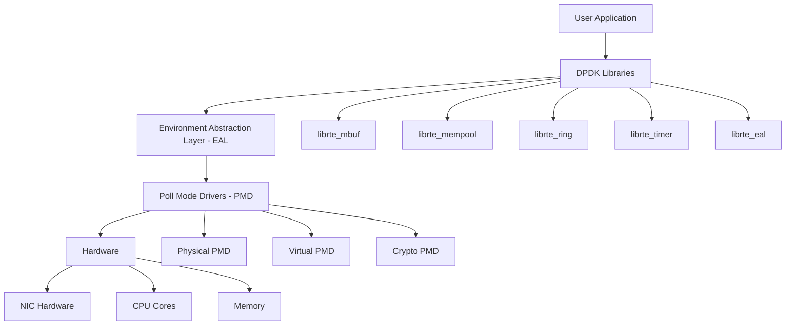

# 11 DPDK基礎與原理

## 目錄
1. [DPDK 概述](#dpdk-概述)
2. [環境抽象層 (EAL)](#環境抽象層-eal)
3. [記憶體管理](#記憶體管理)
4. [環形緩衝區](#環形緩衝區)
5. [輪詢模式驅動 (PMD)](#輪詢模式驅動-pmd)
6. [多核心處理](#多核心處理)
7. [實際應用開發](#實際應用開發)

## DPDK 概述

### DPDK 架構



### DPDK 核心概念

```c
// DPDK 核心數據結構
#include <rte_eal.h>
#include <rte_ethdev.h>
#include <rte_mbuf.h>
#include <rte_mempool.h>

// DPDK 應用程式結構
typedef struct {
    uint16_t nb_ports;              // 埠數量
    uint16_t* port_list;            // 埠列表
    struct rte_mempool* mbuf_pool;  // mbuf 記憶體池
    uint32_t nb_lcores;             // 邏輯核心數量
    uint32_t* lcore_list;           // 核心列表
} dpdk_app_config_t;

// DPDK 統計結構
typedef struct {
    uint64_t rx_packets;            // 接收封包數
    uint64_t tx_packets;            // 發送封包數
    uint64_t rx_bytes;              // 接收字節數
    uint64_t tx_bytes;              // 發送字節數
    uint64_t rx_dropped;            // 丟棄封包數
    uint64_t tx_dropped;            // 發送丟棄數
} dpdk_port_stats_t;

// DPDK 初始化參數
static const char* dpdk_args[] = {
    "dpdk_app",                     // 應用程式名稱
    "-l", "0-3",                    // 使用 CPU 核心 0-3
    "-n", "4",                      // 記憶體通道數
    "--proc-type=primary",          // 主程序
    "--file-prefix=primary",        // 共享檔案前綴
    NULL
};
```

### DPDK vs 傳統網路堆疊比較

```c
// 效能比較數據
typedef struct {
    const char* method;
    uint32_t pps_million;          // 每秒封包數 (百萬)
    uint32_t latency_ns;           // 延遲 (奈秒)
    uint8_t cpu_cores;             // 使用的 CPU 核心數
    double cpu_utilization;        // CPU 利用率
} network_performance_t;

network_performance_t performance_comparison[] = {
    {"Linux Socket", 1.2, 50000, 4, 0.95},
    {"Raw Socket", 2.5, 30000, 4, 0.90},
    {"AF_PACKET", 5.0, 15000, 4, 0.85},
    {"DPDK PMD", 14.8, 1000, 1, 0.70},
    {"DPDK + Batch", 20.0, 800, 1, 0.65}
};

// 計算效能提升比
void calculate_performance_gain() {
    double linux_pps = performance_comparison[0].pps_million;
    double dpdk_pps = performance_comparison[4].pps_million;
    
    printf("DPDK vs Linux Socket:\n");
    printf("PPS improvement: %.1fx\n", dpdk_pps / linux_pps);
    printf("Latency improvement: %.1fx\n", 
           (double)performance_comparison[0].latency_ns / 
           performance_comparison[4].latency_ns);
}
```

## 環境抽象層 (EAL)

### EAL 初始化

```c
#include <rte_eal.h>
#include <rte_launch.h>
#include <rte_lcore.h>

// EAL 初始化函數
int init_dpdk_eal(int argc, char** argv) {
    // 初始化 DPDK EAL
    int ret = rte_eal_init(argc, argv);
    if (ret < 0) {
        rte_panic("Cannot init EAL: %s\n", rte_strerror(rte_errno));
        return -1;
    }
    
    // 檢查邏輯核心
    uint32_t lcore_count = rte_lcore_count();
    printf("Available logical cores: %u\n", lcore_count);
    
    // 檢查記憶體
    const struct rte_memseg* memseg = rte_eal_get_physmem_layout();
    printf("Memory segments:\n");
    for (int i = 0; memseg[i].addr != NULL; i++) {
        printf("  Segment %d: addr=%p, len=%zu, socket=%u\n",
               i, memseg[i].addr, memseg[i].len, memseg[i].socket_id);
    }
    
    // 檢查 PCI 設備
    printf("PCI devices:\n");
    rte_eal_pci_dump(stdout);
    
    return ret;
}

// 核心親和性設置
int set_lcore_affinity() {
    uint32_t lcore_id;
    
    RTE_LCORE_FOREACH(lcore_id) {
        printf("Lcore %u is on socket %u\n", 
               lcore_id, rte_lcore_to_socket_id(lcore_id));
    }
    
    // 設置主核心
    uint32_t main_lcore = rte_get_main_lcore();
    printf("Main lcore: %u\n", main_lcore);
    
    return 0;
}
```

### 大頁記憶體管理

```c
#include <rte_malloc.h>
#include <rte_memory.h>

// 大頁記憶體配置
typedef struct {
    size_t page_size;              // 頁面大小
    uint32_t page_count;           // 頁面數量
    uint32_t socket_id;            // NUMA 節點
    void* mapped_addr;             // 映射地址
} hugepage_config_t;

// 配置大頁記憶體
int setup_hugepages() {
    // 檢查大頁支援
    if (!rte_eal_has_hugepages()) {
        printf("Hugepages not supported\n");
        return -1;
    }
    
    // 獲取大頁資訊
    const struct rte_memseg* seg = rte_eal_get_physmem_layout();
    while (seg && seg->addr) {
        printf("Hugepage segment: addr=%p, iova=%"PRIx64", len=%zu, "
               "hugepage_sz=%zu, socket_id=%u\n",
               seg->addr, seg->iova, seg->len, 
               seg->hugepage_sz, seg->socket_id);
        seg++;
    }
    
    return 0;
}

// DPDK 記憶體分配器
void* dpdk_malloc_aligned(size_t size, unsigned align, int socket_id) {
    return rte_malloc_socket("app_data", size, align, socket_id);
}

// 釋放 DPDK 記憶體
void dpdk_free(void* ptr) {
    rte_free(ptr);
}

// 記憶體池創建
struct rte_mempool* create_optimized_mempool(const char* name,
                                           uint32_t n,
                                           uint32_t cache_size,
                                           uint32_t priv_size,
                                           uint16_t data_room_size,
                                           int socket_id) {
    return rte_pktmbuf_pool_create(name, n, cache_size, priv_size,
                                  data_room_size, socket_id);
}
```

### EAL 服務管理

```c
#include <rte_service.h>
#include <rte_service_component.h>

// 服務回調函數
static int32_t timer_service_callback(void* args) {
    static uint64_t counter = 0;
    counter++;
    
    // 定期統計
    if (counter % 1000000 == 0) {
        printf("Timer service tick: %lu\n", counter);
    }
    
    return 0;
}

// 註冊 EAL 服務
int register_eal_services() {
    // 註冊計時器服務
    struct rte_service_spec service_spec = {
        .name = "timer_service",
        .callback = timer_service_callback,
        .callback_userdata = NULL,
        .capabilities = 0,
        .socket_id = SOCKET_ID_ANY
    };
    
    uint32_t service_id;
    int ret = rte_service_component_register(&service_spec, &service_id);
    if (ret != 0) {
        printf("Failed to register timer service\n");
        return -1;
    }
    
    // 設置服務運行狀態
    rte_service_component_runstate_set(service_id, 1);
    rte_service_set_runstate_mapped_check(service_id, 0);
    
    return 0;
}
```

## 記憶體管理

### mbuf 結構與操作

```c
#include <rte_mbuf.h>

// mbuf 結構詳解
void analyze_mbuf_structure(struct rte_mbuf* m) {
    printf("=== mbuf 結構分析 ===\n");
    printf("buf_addr: %p\n", m->buf_addr);
    printf("buf_iova: 0x%lx\n", m->buf_iova);
    printf("buf_len: %u\n", m->buf_len);
    printf("data_off: %u\n", m->data_off);
    printf("pkt_len: %u\n", m->pkt_len);
    printf("data_len: %u\n", m->data_len);
    printf("nb_segs: %u\n", m->nb_segs);
    printf("port: %u\n", m->port);
    printf("ol_flags: 0x%lx\n", m->ol_flags);
    printf("packet_type: 0x%x\n", m->packet_type);
}

// mbuf 操作函數
struct rte_mbuf* create_packet_mbuf(struct rte_mempool* pool,
                                   const void* data,
                                   uint16_t data_len) {
    // 從記憶體池分配 mbuf
    struct rte_mbuf* m = rte_pktmbuf_alloc(pool);
    if (unlikely(m == NULL)) {
        return NULL;
    }
    
    // 設置數據指針和長度
    char* pkt_data = rte_pktmbuf_append(m, data_len);
    if (unlikely(pkt_data == NULL)) {
        rte_pktmbuf_free(m);
        return NULL;
    }
    
    // 複製數據
    rte_memcpy(pkt_data, data, data_len);
    
    // 設置封包資訊
    m->pkt_len = data_len;
    m->data_len = data_len;
    m->nb_segs = 1;
    
    return m;
}

// mbuf 鍊操作
struct rte_mbuf* create_segmented_mbuf(struct rte_mempool* pool,
                                      const void** data_segments,
                                      uint16_t* segment_lens,
                                      uint16_t nb_segments) {
    struct rte_mbuf* first_mbuf = NULL;
    struct rte_mbuf* current_mbuf = NULL;
    struct rte_mbuf* prev_mbuf = NULL;
    
    for (uint16_t i = 0; i < nb_segments; i++) {
        // 分配新的 mbuf
        current_mbuf = rte_pktmbuf_alloc(pool);
        if (unlikely(current_mbuf == NULL)) {
            if (first_mbuf) rte_pktmbuf_free(first_mbuf);
            return NULL;
        }
        
        // 設置數據
        char* pkt_data = rte_pktmbuf_append(current_mbuf, segment_lens[i]);
        rte_memcpy(pkt_data, data_segments[i], segment_lens[i]);
        
        // 建立鍊結
        if (first_mbuf == NULL) {
            first_mbuf = current_mbuf;
        } else {
            prev_mbuf->next = current_mbuf;
        }
        
        prev_mbuf = current_mbuf;
    }
    
    // 更新總長度和段數
    if (first_mbuf) {
        first_mbuf->nb_segs = nb_segments;
        
        uint32_t total_len = 0;
        for (uint16_t i = 0; i < nb_segments; i++) {
            total_len += segment_lens[i];
        }
        first_mbuf->pkt_len = total_len;
    }
    
    return first_mbuf;
}
```

### 記憶體池優化

```c
// 自定義記憶體池配置
typedef struct {
    const char* name;
    uint32_t nb_elts;              // 元素數量
    uint32_t cache_size;           // 快取大小
    uint16_t priv_size;            // 私有數據大小
    uint16_t data_room_size;       // 數據空間大小
    int socket_id;                 // NUMA 節點
    uint32_t flags;                // 標誌
} mempool_config_t;

// 創建多個專用記憶體池
int create_specialized_mempools(struct rte_mempool** pools) {
    // 小封包池 (64 字節)
    mempool_config_t small_pkt_config = {
        .name = "small_pkt_pool",
        .nb_elts = 8192,
        .cache_size = 256,
        .priv_size = 0,
        .data_room_size = 128,
        .socket_id = SOCKET_ID_ANY,
        .flags = 0
    };
    
    pools[0] = rte_pktmbuf_pool_create(
        small_pkt_config.name,
        small_pkt_config.nb_elts,
        small_pkt_config.cache_size,
        small_pkt_config.priv_size,
        small_pkt_config.data_room_size,
        small_pkt_config.socket_id
    );
    
    // 大封包池 (1500 字節)
    mempool_config_t large_pkt_config = {
        .name = "large_pkt_pool",
        .nb_elts = 4096,
        .cache_size = 128,
        .priv_size = 0,
        .data_room_size = 2048,
        .socket_id = SOCKET_ID_ANY,
        .flags = 0
    };
    
    pools[1] = rte_pktmbuf_pool_create(
        large_pkt_config.name,
        large_pkt_config.nb_elts,
        large_pkt_config.cache_size,
        large_pkt_config.priv_size,
        large_pkt_config.data_room_size,
        large_pkt_config.socket_id
    );
    
    // 巨大封包池 (9000 字節，支援 Jumbo Frame)
    mempool_config_t jumbo_pkt_config = {
        .name = "jumbo_pkt_pool",
        .nb_elts = 1024,
        .cache_size = 64,
        .priv_size = 0,
        .data_room_size = 9216,
        .socket_id = SOCKET_ID_ANY,
        .flags = 0
    };
    
    pools[2] = rte_pktmbuf_pool_create(
        jumbo_pkt_config.name,
        jumbo_pkt_config.nb_elts,
        jumbo_pkt_config.cache_size,
        jumbo_pkt_config.priv_size,
        jumbo_pkt_config.data_room_size,
        jumbo_pkt_config.socket_id
    );
    
    // 檢查所有池是否創建成功
    for (int i = 0; i < 3; i++) {
        if (pools[i] == NULL) {
            printf("Failed to create mempool %d\n", i);
            return -1;
        }
    }
    
    return 0;
}

// 記憶體池統計
void print_mempool_stats(struct rte_mempool* pool) {
    struct rte_mempool_info info;
    rte_mempool_ops_get_info(pool, &info);
    
    printf("=== Mempool Statistics ===\n");
    printf("Name: %s\n", pool->name);
    printf("Size: %u\n", pool->size);
    printf("Cache size: %u\n", pool->cache_size);
    printf("Element size: %u\n", pool->elt_size);
    printf("Available objects: %u\n", rte_mempool_avail_count(pool));
    printf("In use objects: %u\n", rte_mempool_in_use_count(pool));
}
```

## 環形緩衝區

### 無鎖環形緩衝區實現

```c
#include <rte_ring.h>

// 環形緩衝區配置
typedef struct {
    const char* name;
    uint32_t size;                 // 必須是 2 的冪次
    int socket_id;
    uint32_t flags;
} ring_config_t;

// 創建生產者-消費者環形緩衝區
struct rte_ring* create_producer_consumer_ring(const char* name,
                                              uint32_t size,
                                              int socket_id) {
    return rte_ring_create(name, size, socket_id, 
                          RING_F_SP_ENQ | RING_F_SC_DEQ);
}

// 批量入隊操作
static inline unsigned int ring_enqueue_bulk(struct rte_ring* ring,
                                            void* const* obj_table,
                                            unsigned int n) {
    return rte_ring_enqueue_bulk(ring, obj_table, n, NULL);
}

// 批量出隊操作
static inline unsigned int ring_dequeue_bulk(struct rte_ring* ring,
                                            void** obj_table,
                                            unsigned int n) {
    return rte_ring_dequeue_bulk(ring, obj_table, n, NULL);
}

// 高效能封包轉發使用環形緩衝區
typedef struct {
    struct rte_ring* rx_ring;      // 接收環形緩衝區
    struct rte_ring* tx_ring;      // 發送環形緩衝區
    uint32_t batch_size;           // 批量大小
} packet_forwarder_t;

// 封包轉發工作者
int packet_forwarder_worker(void* arg) {
    packet_forwarder_t* forwarder = (packet_forwarder_t*)arg;
    struct rte_mbuf* pkts[32];
    unsigned int nb_rx, nb_tx;
    
    printf("Packet forwarder started on lcore %u\n", rte_lcore_id());
    
    while (1) {
        // 從接收環形緩衝區獲取封包
        nb_rx = rte_ring_dequeue_bulk(forwarder->rx_ring,
                                     (void**)pkts,
                                     forwarder->batch_size, NULL);
        
        if (likely(nb_rx > 0)) {
            // 處理封包 (這裡可以添加實際的處理邏輯)
            for (unsigned int i = 0; i < nb_rx; i++) {
                // 簡單的封包修改示例
                struct rte_ether_hdr* eth_hdr = rte_pktmbuf_mtod(pkts[i], 
                                                               struct rte_ether_hdr*);
                // 交換源和目標 MAC 地址
                struct rte_ether_addr tmp = eth_hdr->src_addr;
                eth_hdr->src_addr = eth_hdr->dst_addr;
                eth_hdr->dst_addr = tmp;
            }
            
            // 發送到發送環形緩衝區
            nb_tx = rte_ring_enqueue_bulk(forwarder->tx_ring,
                                         (void* const*)pkts,
                                         nb_rx, NULL);
            
            // 處理發送失敗的封包
            if (unlikely(nb_tx < nb_rx)) {
                for (unsigned int i = nb_tx; i < nb_rx; i++) {
                    rte_pktmbuf_free(pkts[i]);
                }
            }
        }
    }
    
    return 0;
}
```

### 多生產者多消費者環形緩衝區

```c
// MPMC 環形緩衝區
struct rte_ring* create_mpmc_ring(const char* name, uint32_t size, int socket_id) {
    // 多生產者多消費者環形緩衝區
    return rte_ring_create(name, size, socket_id, 0);
}

// 工作者池結構
typedef struct {
    struct rte_ring* work_ring;    // 工作隊列
    struct rte_ring* result_ring;  // 結果隊列
    uint32_t worker_count;         // 工作者數量
    pthread_t* workers;            // 工作者線程
} worker_pool_t;

// 工作項結構
typedef struct {
    uint32_t task_id;
    void* input_data;
    size_t input_size;
    void* output_data;
    size_t output_size;
} work_item_t;

// 工作者線程函數
void* worker_thread(void* arg) {
    worker_pool_t* pool = (worker_pool_t*)arg;
    work_item_t* work_items[16];
    unsigned int nb_items;
    
    while (1) {
        // 批量獲取工作項
        nb_items = rte_ring_dequeue_bulk(pool->work_ring,
                                        (void**)work_items,
                                        16, NULL);
        
        if (nb_items > 0) {
            // 處理工作項
            for (unsigned int i = 0; i < nb_items; i++) {
                // 執行實際工作
                process_work_item(work_items[i]);
            }
            
            // 將結果放入結果隊列
            rte_ring_enqueue_bulk(pool->result_ring,
                                 (void* const*)work_items,
                                 nb_items, NULL);
        } else {
            // 沒有工作，稍微休息
            rte_pause();
        }
    }
    
    return NULL;
}
```

## 輪詢模式驅動 (PMD)

### PMD 初始化與配置

```c
#include <rte_ethdev.h>

// 埠配置結構
static const struct rte_eth_conf port_conf_default = {
    .rxmode = {
        .mq_mode = ETH_MQ_RX_RSS,
        .max_rx_pkt_len = RTE_ETHER_MAX_LEN,
        .split_hdr_size = 0,
    },
    .rx_adv_conf = {
        .rss_conf = {
            .rss_key = NULL,
            .rss_hf = ETH_RSS_IP | ETH_RSS_TCP | ETH_RSS_UDP,
        },
    },
    .txmode = {
        .mq_mode = ETH_MQ_TX_NONE,
    },
};

// 初始化 DPDK 埠
int init_dpdk_port(uint16_t port_id, struct rte_mempool* mbuf_pool) {
    struct rte_eth_conf port_conf = port_conf_default;
    const uint16_t rx_rings = 1, tx_rings = 1;
    uint16_t nb_rxd = 1024;
    uint16_t nb_txd = 1024;
    int retval;
    
    // 檢查埠是否可用
    if (!rte_eth_dev_is_valid_port(port_id)) {
        return -1;
    }
    
    // 獲取設備資訊
    struct rte_eth_dev_info dev_info;
    retval = rte_eth_dev_info_get(port_id, &dev_info);
    if (retval != 0) {
        printf("Error getting device info for port %u: %s\n",
               port_id, strerror(-retval));
        return retval;
    }
    
    // 調整配置以匹配設備能力
    if (dev_info.tx_offload_capa & DEV_TX_OFFLOAD_MBUF_FAST_FREE) {
        port_conf.txmode.offloads |= DEV_TX_OFFLOAD_MBUF_FAST_FREE;
    }
    
    // 配置設備
    retval = rte_eth_dev_configure(port_id, rx_rings, tx_rings, &port_conf);
    if (retval != 0) {
        return retval;
    }
    
    // 調整描述符數量
    retval = rte_eth_dev_adjust_nb_rx_tx_desc(port_id, &nb_rxd, &nb_txd);
    if (retval != 0) {
        return retval;
    }
    
    // 設置 RX 隊列
    retval = rte_eth_rx_queue_setup(port_id, 0, nb_rxd,
                                   rte_eth_dev_socket_id(port_id),
                                   NULL, mbuf_pool);
    if (retval < 0) {
        return retval;
    }
    
    // 設置 TX 隊列
    struct rte_eth_txconf txconf = dev_info.default_txconf;
    txconf.offloads = port_conf.txmode.offloads;
    retval = rte_eth_tx_queue_setup(port_id, 0, nb_txd,
                                   rte_eth_dev_socket_id(port_id),
                                   &txconf);
    if (retval < 0) {
        return retval;
    }
    
    // 啟動設備
    retval = rte_eth_dev_start(port_id);
    if (retval < 0) {
        return retval;
    }
    
    // 設置混雜模式
    retval = rte_eth_promiscuous_enable(port_id);
    if (retval != 0) {
        return retval;
    }
    
    return 0;
}
```

### 高效能接收處理

```c
// 封包接收統計
typedef struct {
    uint64_t total_packets;
    uint64_t total_bytes;
    uint64_t drop_packets;
    uint64_t error_packets;
    uint64_t last_timestamp;
} rx_stats_t;

// 批量接收處理函數
static inline uint16_t process_rx_packets(uint16_t port_id,
                                         uint16_t queue_id,
                                         struct rte_mempool* mbuf_pool,
                                         rx_stats_t* stats) {
    struct rte_mbuf* bufs[BURST_SIZE];
    const uint16_t nb_rx = rte_eth_rx_burst(port_id, queue_id, bufs, BURST_SIZE);
    
    if (unlikely(nb_rx == 0)) {
        return 0;
    }
    
    // 更新統計
    stats->total_packets += nb_rx;
    
    // 處理每個封包
    for (uint16_t i = 0; i < nb_rx; i++) {
        struct rte_mbuf* m = bufs[i];
        
        // 更新字節統計
        stats->total_bytes += m->pkt_len;
        
        // 封包類型檢測
        uint32_t packet_type = m->packet_type;
        
        if (packet_type & RTE_PTYPE_L3_IPV4) {
            // IPv4 封包處理
            process_ipv4_packet(m);
        } else if (packet_type & RTE_PTYPE_L3_IPV6) {
            // IPv6 封包處理
            process_ipv6_packet(m);
        } else {
            // 其他類型封包
            process_other_packet(m);
        }
        
        // 釋放 mbuf
        rte_pktmbuf_free(m);
    }
    
    return nb_rx;
}

// IPv4 封包處理
static inline void process_ipv4_packet(struct rte_mbuf* m) {
    struct rte_ether_hdr* eth_hdr = rte_pktmbuf_mtod(m, struct rte_ether_hdr*);
    struct rte_ipv4_hdr* ipv4_hdr = (struct rte_ipv4_hdr*)(eth_hdr + 1);
    
    // 檢查校驗和
    if (m->ol_flags & PKT_RX_IP_CKSUM_BAD) {
        printf("IPv4 checksum error\n");
        return;
    }
    
    // 基於協議類型處理
    switch (ipv4_hdr->next_proto_id) {
        case IPPROTO_TCP:
            process_tcp_packet(m, ipv4_hdr);
            break;
        case IPPROTO_UDP:
            process_udp_packet(m, ipv4_hdr);
            break;
        case IPPROTO_ICMP:
            process_icmp_packet(m, ipv4_hdr);
            break;
        default:
            // 未知協議
            break;
    }
}
```

### 零拷貝發送優化

```c
// 批量發送函數
static inline uint16_t transmit_packets(uint16_t port_id,
                                       uint16_t queue_id,
                                       struct rte_mbuf** tx_pkts,
                                       uint16_t nb_pkts) {
    uint16_t nb_tx = rte_eth_tx_burst(port_id, queue_id, tx_pkts, nb_pkts);
    
    // 釋放未發送的封包
    if (unlikely(nb_tx < nb_pkts)) {
        for (uint16_t i = nb_tx; i < nb_pkts; i++) {
            rte_pktmbuf_free(tx_pkts[i]);
        }
    }
    
    return nb_tx;
}

// 預構建封包發送
struct rte_mbuf* create_prebuilt_packet(struct rte_mempool* mbuf_pool,
                                       const struct rte_ether_addr* src_mac,
                                       const struct rte_ether_addr* dst_mac,
                                       uint32_t src_ip,
                                       uint32_t dst_ip,
                                       uint16_t src_port,
                                       uint16_t dst_port,
                                       const void* payload,
                                       uint16_t payload_len) {
    // 分配 mbuf
    struct rte_mbuf* m = rte_pktmbuf_alloc(mbuf_pool);
    if (unlikely(m == NULL)) {
        return NULL;
    }
    
    // 計算總長度
    uint16_t total_len = sizeof(struct rte_ether_hdr) +
                        sizeof(struct rte_ipv4_hdr) +
                        sizeof(struct rte_udp_hdr) +
                        payload_len;
    
    // 設置封包長度
    m->pkt_len = total_len;
    m->data_len = total_len;
    
    // 獲取數據指針
    char* pkt_data = rte_pktmbuf_mtod(m, char*);
    
    // 構建乙太網標頭
    struct rte_ether_hdr* eth_hdr = (struct rte_ether_hdr*)pkt_data;
    rte_memcpy(&eth_hdr->dst_addr, dst_mac, RTE_ETHER_ADDR_LEN);
    rte_memcpy(&eth_hdr->src_addr, src_mac, RTE_ETHER_ADDR_LEN);
    eth_hdr->ether_type = rte_cpu_to_be_16(RTE_ETHER_TYPE_IPV4);
    
    // 構建 IP 標頭
    struct rte_ipv4_hdr* ip_hdr = (struct rte_ipv4_hdr*)(eth_hdr + 1);
    ip_hdr->version_ihl = 0x45;
    ip_hdr->type_of_service = 0;
    ip_hdr->total_length = rte_cpu_to_be_16(total_len - sizeof(struct rte_ether_hdr));
    ip_hdr->packet_id = 0;
    ip_hdr->fragment_offset = 0;
    ip_hdr->time_to_live = 64;
    ip_hdr->next_proto_id = IPPROTO_UDP;
    ip_hdr->src_addr = rte_cpu_to_be_32(src_ip);
    ip_hdr->dst_addr = rte_cpu_to_be_32(dst_ip);
    ip_hdr->hdr_checksum = 0;
    
    // 構建 UDP 標頭
    struct rte_udp_hdr* udp_hdr = (struct rte_udp_hdr*)(ip_hdr + 1);
    udp_hdr->src_port = rte_cpu_to_be_16(src_port);
    udp_hdr->dst_port = rte_cpu_to_be_16(dst_port);
    udp_hdr->dgram_len = rte_cpu_to_be_16(sizeof(struct rte_udp_hdr) + payload_len);
    udp_hdr->dgram_cksum = 0;
    
    // 複製負載數據
    char* payload_ptr = (char*)(udp_hdr + 1);
    rte_memcpy(payload_ptr, payload, payload_len);
    
    // 設置硬體校驗和卸載
    m->ol_flags |= PKT_TX_IP_CKSUM | PKT_TX_IPV4;
    m->l2_len = sizeof(struct rte_ether_hdr);
    m->l3_len = sizeof(struct rte_ipv4_hdr);
    
    return m;
}
```

## 多核心處理

### 核心綁定與 NUMA 優化

```c
#include <rte_lcore.h>
#include <numa.h>

// NUMA 拓撲結構
typedef struct {
    uint32_t socket_id;
    uint32_t* lcore_list;
    uint32_t lcore_count;
    uint64_t memory_size;
} numa_topology_t;

// 獲取 NUMA 拓撲
int get_numa_topology(numa_topology_t** topology, uint32_t* socket_count) {
    *socket_count = rte_socket_count();
    *topology = malloc(sizeof(numa_topology_t) * (*socket_count));
    
    if (*topology == NULL) {
        return -1;
    }
    
    uint32_t socket_idx = 0;
    for (uint32_t socket_id = 0; socket_id < RTE_MAX_NUMA_NODES; socket_id++) {
        if (!rte_socket_exists(socket_id)) {
            continue;
        }
        
        numa_topology_t* topo = &(*topology)[socket_idx];
        topo->socket_id = socket_id;
        topo->lcore_count = 0;
        
        // 分配 lcore 列表
        topo->lcore_list = malloc(sizeof(uint32_t) * RTE_MAX_LCORE);
        
        // 收集屬於此 socket 的 lcore
        RTE_LCORE_FOREACH(lcore_id) {
            if (rte_lcore_to_socket_id(lcore_id) == socket_id) {
                topo->lcore_list[topo->lcore_count++] = lcore_id;
            }
        }
        
        socket_idx++;
    }
    
    return 0;
}

// 核心親和性工作者
typedef struct {
    uint32_t lcore_id;
    uint32_t socket_id;
    struct rte_ring* input_ring;
    struct rte_ring* output_ring;
    struct rte_mempool* mbuf_pool;
    volatile bool stop_flag;
} affinity_worker_t;

// 親和性工作者函數
static int affinity_worker_main(void* arg) {
    affinity_worker_t* worker = (affinity_worker_t*)arg;
    
    printf("Worker started on lcore %u (socket %u)\n",
           worker->lcore_id, worker->socket_id);
    
    // 設置 CPU 親和性
    cpu_set_t cpuset;
    CPU_ZERO(&cpuset);
    CPU_SET(worker->lcore_id, &cpuset);
    
    if (pthread_setaffinity_np(pthread_self(), sizeof(cpuset), &cpuset) != 0) {
        printf("Failed to set CPU affinity for lcore %u\n", worker->lcore_id);
    }
    
    struct rte_mbuf* pkts[32];
    unsigned int nb_pkts;
    
    while (!worker->stop_flag) {
        // 從輸入環形緩衝區獲取封包
        nb_pkts = rte_ring_dequeue_bulk(worker->input_ring,
                                       (void**)pkts, 32, NULL);
        
        if (nb_pkts > 0) {
            // 處理封包
            for (unsigned int i = 0; i < nb_pkts; i++) {
                // 這裡執行實際的封包處理
                process_packet_on_socket(pkts[i], worker->socket_id);
            }
            
            // 將處理後的封包放入輸出環形緩衝區
            rte_ring_enqueue_bulk(worker->output_ring,
                                 (void* const*)pkts, nb_pkts, NULL);
        }
    }
    
    return 0;
}
```

### 管道式處理架構

```c
// 管道階段定義
typedef enum {
    PIPELINE_STAGE_RX = 0,
    PIPELINE_STAGE_PARSE,
    PIPELINE_STAGE_CLASSIFY,
    PIPELINE_STAGE_PROCESS,
    PIPELINE_STAGE_TX,
    PIPELINE_STAGE_COUNT
} pipeline_stage_t;

// 管道配置
typedef struct {
    pipeline_stage_t stage;
    uint32_t lcore_id;
    struct rte_ring* input_ring;
    struct rte_ring* output_ring;
    void* (*stage_func)(void*);
} pipeline_config_t;

// 接收階段
static int pipeline_rx_stage(void* arg) {
    pipeline_config_t* config = (pipeline_config_t*)arg;
    struct rte_mbuf* bufs[BURST_SIZE];
    uint16_t nb_rx;
    
    while (1) {
        // 從網卡接收封包
        nb_rx = rte_eth_rx_burst(0, 0, bufs, BURST_SIZE);
        
        if (nb_rx > 0) {
            // 將封包放入下一階段的環形緩衝區
            unsigned int enqueued = rte_ring_enqueue_bulk(
                config->output_ring, (void* const*)bufs, nb_rx, NULL);
            
            // 處理入隊失敗的封包
            for (unsigned int i = enqueued; i < nb_rx; i++) {
                rte_pktmbuf_free(bufs[i]);
            }
        }
    }
    
    return 0;
}

// 解析階段
static int pipeline_parse_stage(void* arg) {
    pipeline_config_t* config = (pipeline_config_t*)arg;
    struct rte_mbuf* bufs[BURST_SIZE];
    unsigned int nb_pkts;
    
    while (1) {
        // 從上一階段獲取封包
        nb_pkts = rte_ring_dequeue_bulk(config->input_ring,
                                       (void**)bufs, BURST_SIZE, NULL);
        
        if (nb_pkts > 0) {
            // 解析封包
            for (unsigned int i = 0; i < nb_pkts; i++) {
                parse_packet_headers(bufs[i]);
            }
            
            // 傳遞到下一階段
            rte_ring_enqueue_bulk(config->output_ring,
                                 (void* const*)bufs, nb_pkts, NULL);
        }
    }
    
    return 0;
}

// 初始化管道
int init_packet_pipeline(pipeline_config_t* configs, uint32_t stage_count) {
    // 創建環形緩衝區
    for (uint32_t i = 0; i < stage_count - 1; i++) {
        char ring_name[32];
        snprintf(ring_name, sizeof(ring_name), "pipeline_ring_%u", i);
        
        struct rte_ring* ring = rte_ring_create(ring_name, 2048,
                                               SOCKET_ID_ANY,
                                               RING_F_SP_ENQ | RING_F_SC_DEQ);
        if (ring == NULL) {
            return -1;
        }
        
        configs[i].output_ring = ring;
        configs[i + 1].input_ring = ring;
    }
    
    // 啟動各階段工作者
    for (uint32_t i = 0; i < stage_count; i++) {
        if (rte_eal_remote_launch(configs[i].stage_func,
                                 &configs[i],
                                 configs[i].lcore_id) < 0) {
            return -1;
        }
    }
    
    return 0;
}
```

## 實際應用開發

### L2 轉發應用

```c
// L2 轉發應用結構
typedef struct {
    uint16_t nb_ports;
    uint16_t* port_list;
    struct rte_mempool* mbuf_pool;
    struct rte_hash* mac_table;
    uint64_t* port_statistics;
} l2_forward_app_t;

// MAC 學習表條目
typedef struct {
    struct rte_ether_addr mac_addr;
    uint16_t port_id;
    uint64_t timestamp;
} mac_learning_entry_t;

// 初始化 L2 轉發應用
int init_l2_forward_app(l2_forward_app_t* app) {
    // 創建 MAC 學習表
    struct rte_hash_parameters hash_params = {
        .name = "mac_learning_table",
        .entries = 1024,
        .key_len = sizeof(struct rte_ether_addr),
        .hash_func = rte_hash_crc,
        .hash_func_init_val = 0,
        .socket_id = SOCKET_ID_ANY,
    };
    
    app->mac_table = rte_hash_create(&hash_params);
    if (app->mac_table == NULL) {
        return -1;
    }
    
    // 分配統計數組
    app->port_statistics = rte_zmalloc("port_stats",
                                      sizeof(uint64_t) * app->nb_ports * 4,
                                      RTE_CACHE_LINE_SIZE);
    
    return 0;
}

// L2 轉發主函數
static int l2_forward_main_loop(void* arg) {
    l2_forward_app_t* app = (l2_forward_app_t*)arg;
    struct rte_mbuf* bufs[BURST_SIZE];
    uint16_t nb_rx, nb_tx;
    uint32_t lcore_id = rte_lcore_id();
    
    printf("L2 forward started on lcore %u\n", lcore_id);
    
    while (1) {
        // 輪詢所有埠
        for (uint16_t i = 0; i < app->nb_ports; i++) {
            uint16_t port_id = app->port_list[i];
            
            // 接收封包
            nb_rx = rte_eth_rx_burst(port_id, 0, bufs, BURST_SIZE);
            
            if (nb_rx == 0) {
                continue;
            }
            
            // 更新接收統計
            app->port_statistics[port_id * 4] += nb_rx;
            
            // 處理每個封包
            for (uint16_t j = 0; j < nb_rx; j++) {
                l2_forward_packet(app, bufs[j], port_id);
            }
        }
    }
    
    return 0;
}

// L2 封包轉發
static inline void l2_forward_packet(l2_forward_app_t* app,
                                    struct rte_mbuf* m,
                                    uint16_t rx_port) {
    struct rte_ether_hdr* eth_hdr = rte_pktmbuf_mtod(m, struct rte_ether_hdr*);
    
    // MAC 學習
    mac_learning_entry_t entry = {
        .mac_addr = eth_hdr->src_addr,
        .port_id = rx_port,
        .timestamp = rte_rdtsc()
    };
    
    int ret = rte_hash_add_key_data(app->mac_table,
                                   &eth_hdr->src_addr,
                                   &entry);
    
    // MAC 查找
    mac_learning_entry_t* found_entry;
    ret = rte_hash_lookup_data(app->mac_table,
                              &eth_hdr->dst_addr,
                              (void**)&found_entry);
    
    uint16_t dst_port;
    if (ret >= 0) {
        // 找到目標埠
        dst_port = found_entry->port_id;
    } else {
        // 未找到，洪泛到所有埠
        flood_packet(app, m, rx_port);
        return;
    }
    
    // 轉發封包
    if (dst_port != rx_port) {
        uint16_t nb_tx = rte_eth_tx_burst(dst_port, 0, &m, 1);
        if (nb_tx == 0) {
            rte_pktmbuf_free(m);
        } else {
            app->port_statistics[dst_port * 4 + 1] += 1;
        }
    } else {
        // 同一埠，丟棄
        rte_pktmbuf_free(m);
    }
}
```

### 效能監控與調試

```c
// 效能監控結構
typedef struct {
    uint64_t cycles_per_packet;
    uint64_t total_cycles;
    uint64_t total_packets;
    uint64_t cache_misses;
    uint64_t branch_misses;
} performance_monitor_t;

// 效能計數器
static inline uint64_t get_cpu_cycles() {
    return rte_rdtsc();
}

// 監控封包處理效能
void monitor_packet_processing(performance_monitor_t* monitor,
                              struct rte_mbuf** pkts,
                              uint16_t nb_pkts) {
    uint64_t start_cycles = get_cpu_cycles();
    
    // 處理封包
    for (uint16_t i = 0; i < nb_pkts; i++) {
        process_single_packet(pkts[i]);
    }
    
    uint64_t end_cycles = get_cpu_cycles();
    uint64_t cycles_used = end_cycles - start_cycles;
    
    // 更新統計
    monitor->total_cycles += cycles_used;
    monitor->total_packets += nb_pkts;
    monitor->cycles_per_packet = monitor->total_cycles / monitor->total_packets;
}

// 輸出效能報告
void print_performance_report(performance_monitor_t* monitor) {
    double cpu_freq_ghz = rte_get_tsc_hz() / 1e9;
    double ns_per_packet = monitor->cycles_per_packet / cpu_freq_ghz;
    
    printf("=== Performance Report ===\n");
    printf("Total packets processed: %lu\n", monitor->total_packets);
    printf("Total CPU cycles: %lu\n", monitor->total_cycles);
    printf("Cycles per packet: %lu\n", monitor->cycles_per_packet);
    printf("Nanoseconds per packet: %.2f\n", ns_per_packet);
    printf("Packets per second: %.2f M\n",
           (monitor->total_packets * cpu_freq_ghz) /
           (monitor->total_cycles / 1e6));
}
```

## 總結

DPDK 是高效能網路處理的核心技術：

### 關鍵優勢
1. **核心繞過** - 避免核心空間/用戶空間切換開銷
2. **輪詢模式** - 消除中斷處理延遲
3. **大頁記憶體** - 減少 TLB 未命中
4. **NUMA 感知** - 優化記憶體存取模式
5. **批量處理** - 提高快取利用率

### 效能特性
- **低延遲**: 100ns - 1μs 處理時間
- **高吞吐**: 10-100 Mpps 處理能力
- **低 CPU 使用**: 單核心處理大量封包
- **可擴展性**: 支援多核心並行處理

下一章將完成整個網路系列，介紹 **面試精華集**，總結關鍵知識點和常見面試問題。