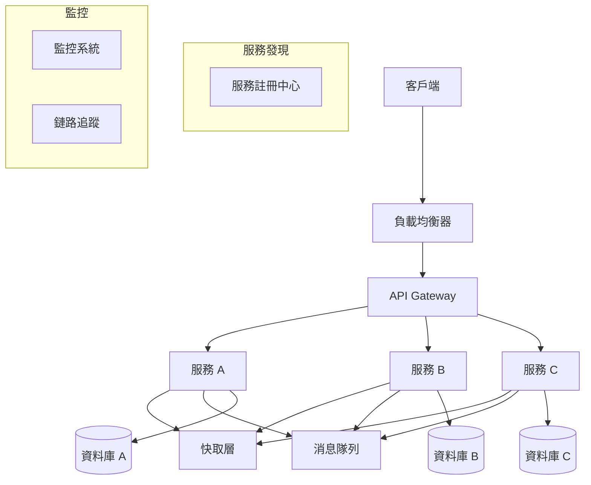

# 12 面試精華集

## 目錄
1. [基礎概念問答](#基礎概念問答)
2. [協議深度問題](#協議深度問題)
3. [效能優化問題](#效能優化問題)
4. [故障排查問題](#故障排查問題)
5. [系統設計問題](#系統設計問題)
6. [編程實作題](#編程實作題)
7. [面試策略與技巧](#面試策略與技巧)

## 基礎概念問答

### OSI 七層模型相關

**Q1: 解釋 OSI 七層模型，並說明 TCP/IP 四層模型與其對應關係**

**標準答案:**
```
OSI 七層模型:
- 應用層 (Application Layer): HTTP, FTP, SMTP
- 表示層 (Presentation Layer): 數據加密、壓縮、格式轉換
- 會話層 (Session Layer): 建立、管理、終止會話
- 傳輸層 (Transport Layer): TCP, UDP, 端到端可靠傳輸
- 網路層 (Network Layer): IP, 路由選擇
- 資料鏈結層 (Data Link Layer): 乙太網, 幀格式
- 實體層 (Physical Layer): 電纜、光纖、無線信號

TCP/IP 對應關係:
- 應用層 → OSI 應用層 + 表示層 + 會話層
- 傳輸層 → OSI 傳輸層
- 網路層 → OSI 網路層  
- 網路介面層 → OSI 資料鏈結層 + 實體層
```

**進階追問:** "為什麼實際應用中 TCP/IP 比 OSI 更普及？"

**Q2: 說明 TCP 三次握手和四次揮手的詳細過程**

**標準答案:**
```c
// 三次握手狀態轉換
typedef enum {
    TCP_CLOSED = 0,
    TCP_LISTEN,
    TCP_SYN_SENT,
    TCP_SYN_RECEIVED,
    TCP_ESTABLISHED
} tcp_handshake_state_t;

// 三次握手過程:
// 1. Client → Server: SYN (seq=x)
// 2. Server → Client: SYN+ACK (seq=y, ack=x+1)  
// 3. Client → Server: ACK (ack=y+1)

// 四次揮手狀態
typedef enum {
    TCP_FIN_WAIT_1,
    TCP_FIN_WAIT_2,
    TCP_TIME_WAIT,
    TCP_CLOSE_WAIT,
    TCP_LAST_ACK
} tcp_close_state_t;

// 四次揮手過程:
// 1. Client → Server: FIN (seq=u)
// 2. Server → Client: ACK (ack=u+1)
// 3. Server → Client: FIN (seq=v)
// 4. Client → Server: ACK (ack=v+1)
```

**進階追問:** "TIME_WAIT 狀態為什麼要等待 2MSL？"

### 網路地址與路由

**Q3: 解釋 CIDR 記法和子網路劃分**

**標準答案:**
```c
// CIDR 計算函數
typedef struct {
    uint32_t network;      // 網路地址
    uint32_t netmask;      // 子網路遮罩  
    uint32_t broadcast;    // 廣播地址
    uint32_t host_min;     // 主機最小地址
    uint32_t host_max;     // 主機最大地址
    uint32_t host_count;   // 可用主機數
} cidr_info_t;

cidr_info_t calculate_cidr(uint32_t ip, uint8_t prefix_len) {
    cidr_info_t info;
    
    // 計算子網路遮罩
    info.netmask = htonl(~((1ULL << (32 - prefix_len)) - 1));
    
    // 計算網路地址
    info.network = ip & info.netmask;
    
    // 計算廣播地址
    info.broadcast = info.network | (~info.netmask);
    
    // 計算主機範圍
    info.host_min = info.network + 1;
    info.host_max = info.broadcast - 1;
    info.host_count = (1ULL << (32 - prefix_len)) - 2;
    
    return info;
}

// 示例: 192.168.1.0/24
// 網路地址: 192.168.1.0
// 子網路遮罩: 255.255.255.0
// 可用主機: 254 個 (192.168.1.1 - 192.168.1.254)
```

**Q4: 解釋 ARP 協議工作原理和 ARP 欺騙攻擊**

**標準答案:**
```c
// ARP 封包結構
typedef struct {
    uint16_t hardware_type;    // 硬體類型 (乙太網 = 1)
    uint16_t protocol_type;    // 協議類型 (IPv4 = 0x0800)
    uint8_t hardware_len;      // 硬體地址長度 (6)
    uint8_t protocol_len;      // 協議地址長度 (4)
    uint16_t operation;        // 操作碼 (請求=1, 回應=2)
    uint8_t sender_mac[6];     // 發送者 MAC
    uint32_t sender_ip;        // 發送者 IP
    uint8_t target_mac[6];     // 目標 MAC
    uint32_t target_ip;        // 目標 IP
} __attribute__((packed)) arp_packet_t;

// ARP 工作流程:
// 1. 主機 A 要與主機 B 通訊，但只知道 B 的 IP
// 2. A 廣播 ARP 請求: "誰有 IP x.x.x.x？請告訴 MAC aa:bb:cc:dd:ee:ff"
// 3. B 收到請求，發送 ARP 回應: "IP x.x.x.x 在 MAC ff:ee:dd:cc:bb:aa"
// 4. A 更新 ARP 表，後續通訊直接使用 MAC 地址

// ARP 欺騙防護
int detect_arp_spoofing(arp_packet_t* arp_pkt, 
                       uint8_t expected_mac[6]) {
    if (arp_pkt->operation == ntohs(2)) { // ARP 回應
        if (memcmp(arp_pkt->sender_mac, expected_mac, 6) != 0) {
            printf("ARP spoofing detected! Expected MAC vs Received MAC\n");
            return 1; // 檢測到 ARP 欺騙
        }
    }
    return 0;
}
```

## 協議深度問題

### TCP 深度分析

**Q5: TCP 擁塞控制演算法有哪些？各自的特點？**

**標準答案:**
```c
// TCP 擁塞控制狀態
typedef enum {
    TCP_CA_SLOW_START,     // 慢啟動
    TCP_CA_CONGESTION_AVOID, // 擁塞避免
    TCP_CA_FAST_RECOVERY,  // 快速恢復
    TCP_CA_LOSS_RECOVERY   // 損失恢復
} tcp_ca_state_t;

// 主要演算法比較
typedef struct {
    const char* name;
    const char* characteristics;
    const char* use_case;
    double efficiency;
} tcp_algorithm_t;

tcp_algorithm_t tcp_algorithms[] = {
    {
        "Reno", 
        "基於丟包檢測，三重複 ACK 觸發快速重傳",
        "傳統網路，中等帶寬",
        0.7
    },
    {
        "Cubic", 
        "立方函數增長，與 RTT 無關的公平性",
        "高帶寬長延遲網路 (Linux 預設)",
        0.85
    },
    {
        "BBR",
        "基於頻寬和 RTT 估算，主動探測",
        "Google 開發，適合各種網路環境",
        0.95
    },
    {
        "Vegas",
        "基於 RTT 變化預測擁塞，主動式",
        "延遲敏感應用",
        0.8
    }
};

// BBR 核心概念實現
typedef struct {
    uint64_t delivery_rate;    // 傳輸速率
    uint32_t min_rtt;         // 最小 RTT
    uint64_t max_bw;          // 最大頻寬
    uint32_t cwnd;            // 擁塞視窗
} bbr_state_t;

void bbr_update_model(bbr_state_t* bbr, uint32_t delivered, 
                     uint32_t interval, uint32_t rtt) {
    // 更新傳輸速率
    if (interval > 0) {
        bbr->delivery_rate = delivered * 1000000 / interval; // bytes/sec
    }
    
    // 更新最大頻寬
    if (bbr->delivery_rate > bbr->max_bw) {
        bbr->max_bw = bbr->delivery_rate;
    }
    
    // 更新最小 RTT
    if (rtt < bbr->min_rtt) {
        bbr->min_rtt = rtt;
    }
    
    // 計算理想擁塞視窗
    bbr->cwnd = (bbr->max_bw * bbr->min_rtt) / 1000000;
}
```

**Q6: TCP Keep-Alive 和應用層心跳的區別？**

**標準答案:**
```c
// TCP Keep-Alive 配置
typedef struct {
    int keepalive_enable;      // 是否啟用
    int keepalive_idle;        // 空閒時間 (秒)
    int keepalive_interval;    // 探測間隔 (秒)  
    int keepalive_probes;      // 探測次數
} tcp_keepalive_config_t;

// 設置 TCP Keep-Alive
int setup_tcp_keepalive(int sockfd) {
    tcp_keepalive_config_t config = {
        .keepalive_enable = 1,
        .keepalive_idle = 600,     // 10 分鐘後開始探測
        .keepalive_interval = 60,   // 每分鐘探測一次
        .keepalive_probes = 3       // 探測 3 次後斷開
    };
    
    setsockopt(sockfd, SOL_SOCKET, SO_KEEPALIVE, 
              &config.keepalive_enable, sizeof(config.keepalive_enable));
    setsockopt(sockfd, IPPROTO_TCP, TCP_KEEPIDLE,
              &config.keepalive_idle, sizeof(config.keepalive_idle));
    setsockopt(sockfd, IPPROTO_TCP, TCP_KEEPINTVL,
              &config.keepalive_interval, sizeof(config.keepalive_interval));
    setsockopt(sockfd, IPPROTO_TCP, TCP_KEEPCNT,
              &config.keepalive_probes, sizeof(config.keepalive_probes));
    
    return 0;
}

// 應用層心跳實現
typedef struct {
    uint32_t sequence;         // 序列號
    uint64_t timestamp;        // 時間戳
    uint32_t payload_len;      // 負載長度
    char payload[];            // 負載數據
} heartbeat_packet_t;

// 區別總結:
// TCP Keep-Alive:
// - 傳輸層實現，透明不佔用應用頻寬
// - 只能檢測網路連接，無法檢測應用狀態
// - 配置選項有限，不夠靈活

// 應用層心跳:
// - 應用層實現，可攜帶業務數據
// - 能檢測完整應用鏈路健康狀態
// - 靈活配置，支援複雜邏輯
```

### HTTP/HTTPS 深度問題

**Q7: HTTP/1.1, HTTP/2, HTTP/3 的主要區別？**

**標準答案:**
```c
// HTTP 版本特性比較
typedef struct {
    const char* version;
    const char* transport;
    bool multiplexing;
    bool header_compression;
    bool server_push;
    bool binary_protocol;
    const char* main_improvements;
} http_version_info_t;

http_version_info_t http_versions[] = {
    {
        "HTTP/1.1",
        "TCP",
        false,
        false,
        false, 
        false,
        "持久連接、管道化、分塊傳輸"
    },
    {
        "HTTP/2",
        "TCP + TLS",
        true,
        true,
        true,
        true,
        "多路復用、頭部壓縮、伺服器推送"
    },
    {
        "HTTP/3", 
        "QUIC (UDP)",
        true,
        true,
        true,
        true,
        "基於 UDP、減少 RTT、抗丟包"
    }
};

// HTTP/2 幀結構
typedef struct {
    uint32_t length:24;        // 幀長度 (24 bits)
    uint8_t type;              // 幀類型
    uint8_t flags;             // 標誌位
    uint32_t stream_id:31;     // 流 ID (31 bits)
    uint8_t reserved:1;        // 保留位 (1 bit)
    uint8_t payload[];         // 幀負載
} __attribute__((packed)) http2_frame_t;

// HTTP/2 幀類型
#define HTTP2_FRAME_DATA         0x0
#define HTTP2_FRAME_HEADERS      0x1
#define HTTP2_FRAME_PRIORITY     0x2
#define HTTP2_FRAME_RST_STREAM   0x3
#define HTTP2_FRAME_SETTINGS     0x4
#define HTTP2_FRAME_PUSH_PROMISE 0x5
#define HTTP2_FRAME_PING         0x6
#define HTTP2_FRAME_GOAWAY       0x7
#define HTTP2_FRAME_WINDOW_UPDATE 0x8
#define HTTP2_FRAME_CONTINUATION 0x9
```

**Q8: HTTPS 握手過程詳解**

**標準答案:**
```c
// TLS 握手階段
typedef enum {
    TLS_CLIENT_HELLO = 1,
    TLS_SERVER_HELLO,
    TLS_CERTIFICATE,
    TLS_SERVER_KEY_EXCHANGE,
    TLS_CERTIFICATE_REQUEST,
    TLS_SERVER_HELLO_DONE,
    TLS_CERTIFICATE_CLIENT,
    TLS_CLIENT_KEY_EXCHANGE,
    TLS_CERTIFICATE_VERIFY,
    TLS_CHANGE_CIPHER_SPEC,
    TLS_FINISHED
} tls_handshake_type_t;

// TLS 握手過程:
// 1. Client Hello: 
//    - 支援的 TLS 版本、加密套件
//    - 隨機數 (Client Random)
//    - SNI (Server Name Indication)

// 2. Server Hello:
//    - 選擇的 TLS 版本、加密套件  
//    - 隨機數 (Server Random)
//    - Session ID

// 3. Certificate:
//    - 伺服器證書鏈
//    - 公鑰資訊

// 4. Server Key Exchange (可選):
//    - DHE/ECDHE 金鑰交換參數

// 5. Certificate Request (可選):
//    - 要求客戶端證書

// 6. Server Hello Done:
//    - 伺服器握手資訊結束

// 7. Client Key Exchange:
//    - 預主密鑰 (Pre-Master Secret)
//    - 用伺服器公鑰加密

// 8. Change Cipher Spec:
//    - 啟用協商的加密參數

// 9. Finished:
//    - 驗證握手完整性

// TLS 1.3 優化 (1-RTT 握手)
typedef struct {
    uint8_t client_random[32];
    uint8_t server_random[32]; 
    uint8_t pre_shared_key[32];
    uint8_t session_ticket[256];
} tls13_session_t;

// TLS 1.3 主要改進:
// - 1-RTT 握手 (vs 2-RTT in TLS 1.2)
// - 0-RTT 恢復連接
// - 前向安全性 (Perfect Forward Secrecy)
// - 移除不安全的加密演算法
```

## 效能優化問題

### 高併發網路程式設計

**Q9: epoll 的工作原理和優勢？ET 模式和 LT 模式的區別？**

**標準答案:**
```c
// epoll 事件結構
struct epoll_event {
    uint32_t events;    // 事件類型
    epoll_data_t data;  // 用戶數據
};

// epoll 工作原理示例
int setup_epoll_server(int listen_port) {
    // 1. 創建 epoll 實例
    int epfd = epoll_create1(EPOLL_CLOEXEC);
    if (epfd < 0) {
        return -1;
    }
    
    // 2. 創建監聽 socket
    int listenfd = socket(AF_INET, SOCK_STREAM, 0);
    // ... bind, listen 等設置
    
    // 3. 將監聽 socket 加入 epoll
    struct epoll_event ev;
    ev.events = EPOLLIN;  // 關注可讀事件
    ev.data.fd = listenfd;
    epoll_ctl(epfd, EPOLL_CTL_ADD, listenfd, &ev);
    
    // 4. 事件循環
    struct epoll_event events[MAX_EVENTS];
    while (1) {
        int nfds = epoll_wait(epfd, events, MAX_EVENTS, -1);
        
        for (int i = 0; i < nfds; i++) {
            if (events[i].data.fd == listenfd) {
                // 處理新連接
                handle_new_connection(epfd, listenfd);
            } else {
                // 處理客戶端數據
                handle_client_data(events[i].data.fd);
            }
        }
    }
    
    return 0;
}

// ET (Edge Triggered) vs LT (Level Triggered) 模式
void demonstrate_et_vs_lt() {
    // LT 模式 (預設):
    // - 只要 fd 可讀/可寫，每次 epoll_wait 都會返回
    // - 編程簡單，不容易遺漏事件
    // - 效能相對較低
    
    // ET 模式:
    // - 只在 fd 狀態發生變化時返回
    // - 必須一次性讀完所有數據
    // - 效能更高，但編程複雜
    
    // ET 模式正確讀取示例:
    ssize_t n;
    char buffer[4096];
    while ((n = read(fd, buffer, sizeof(buffer))) > 0) {
        // 處理數據
        process_data(buffer, n);
    }
    
    if (n < 0 && errno != EAGAIN) {
        // 真正的錯誤
        handle_error();
    }
}

// epoll 優勢:
// 1. O(1) 複雜度 (vs select/poll 的 O(n))
// 2. 沒有 fd 數量限制 (vs select 的 1024 限制)
// 3. 只返回活躍的 fd
// 4. 支援大量併發連接 (C10K 問題的解決方案)
```

**Q10: 如何處理 C10K/C10M 問題？**

**標準答案:**
```c
// C10K 問題解決方案演進
typedef struct {
    const char* approach;
    int max_connections;
    const char* limitations;
    const char* solutions;
} scalability_approach_t;

scalability_approach_t approaches[] = {
    {
        "Thread per connection",
        1000,
        "執行緒開銷大、上下文切換開銷、記憶體消耗",
        "執行緒池、非阻塞 I/O"
    },
    {
        "select/poll",
        10000,
        "O(n) 複雜度、fd 數量限制",
        "epoll/kqueue"
    },
    {
        "epoll/kqueue", 
        100000,
        "系統調用開銷、用戶態/核心態切換",
        "用戶態網路堆疊"
    },
    {
        "User-space networking (DPDK)",
        10000000,
        "複雜度高、硬體依賴",
        "專業化應用"
    }
};

// C10M 架構設計
typedef struct {
    // 網路層優化
    bool use_dpdk;               // 使用 DPDK
    bool kernel_bypass;          // 核心繞過
    bool zero_copy;              // 零拷貝
    
    // 記憶體管理
    bool hugepages;              // 大頁記憶體
    bool numa_aware;             // NUMA 感知
    bool lock_free;              // 無鎖數據結構
    
    // CPU 優化  
    bool cpu_affinity;           // CPU 親和性
    bool polling_mode;           // 輪詢模式
    bool batch_processing;       // 批量處理
} high_performance_config_t;

// 實際優化策略
void optimize_for_c10m() {
    // 1. 核心參數調優
    // echo 1000000 > /proc/sys/fs/file-max
    // echo 1000000 > /proc/sys/net/core/somaxconn
    
    // 2. 記憶體優化
    // 使用大頁記憶體減少 TLB 未命中
    void* hugepage_mem = mmap(NULL, HUGEPAGE_SIZE,
                             PROT_READ | PROT_WRITE,
                             MAP_ANONYMOUS | MAP_HUGETLB, -1, 0);
    
    // 3. CPU 親和性
    cpu_set_t cpuset;
    CPU_ZERO(&cpuset);
    CPU_SET(0, &cpuset);  // 綁定到 CPU 0
    pthread_setaffinity_np(pthread_self(), sizeof(cpuset), &cpuset);
    
    // 4. 無鎖編程
    // 使用原子操作替代鎖
    atomic_int connection_count = ATOMIC_VAR_INIT(0);
    atomic_fetch_add(&connection_count, 1);
}
```

### 記憶體和 CPU 優化

**Q11: 零拷貝技術有哪些？各自的適用場景？**

**標準答案:**
```c
// 零拷貝技術比較
typedef struct {
    const char* technique;
    const char* system_call;
    const char* use_case;
    int copy_operations;
    const char* limitations;
} zero_copy_tech_t;

zero_copy_tech_t zero_copy_techs[] = {
    {
        "sendfile()",
        "sendfile(out_fd, in_fd, offset, count)",
        "文件到 socket 傳輸",
        0,
        "只支援文件到 socket，無法修改數據"
    },
    {
        "splice()",
        "splice(fd_in, off_in, fd_out, off_out, len, flags)",
        "管道數據傳輸",
        0,
        "需要其中一個 fd 是管道"
    },
    {
        "mmap()",
        "mmap(addr, length, prot, flags, fd, offset)",
        "文件映射到記憶體",
        1,
        "可能觸發頁面錯誤，需要處理 SIGBUS"
    },
    {
        "MSG_ZEROCOPY",
        "send(fd, buf, len, MSG_ZEROCOPY)",
        "socket 發送大數據",
        0,
        "Linux 4.14+，需要處理完成通知"
    }
};

// sendfile 示例
ssize_t zero_copy_file_transfer(int socket_fd, int file_fd, size_t file_size) {
    off_t offset = 0;
    ssize_t total_sent = 0;
    
    while (total_sent < file_size) {
        ssize_t sent = sendfile(socket_fd, file_fd, &offset, 
                               file_size - total_sent);
        if (sent < 0) {
            if (errno == EAGAIN) {
                continue; // 非阻塞模式，稍後重試
            }
            return -1;
        }
        total_sent += sent;
    }
    
    return total_sent;
}

// MSG_ZEROCOPY 示例
int zero_copy_send_with_notification(int sockfd, const void* buf, size_t len) {
    // 發送數據
    ssize_t sent = send(sockfd, buf, len, MSG_ZEROCOPY);
    if (sent < 0) {
        return -1;
    }
    
    // 等待完成通知
    struct msghdr msg = {0};
    struct cmsghdr* cmsg;
    char control[CMSG_SPACE(sizeof(struct sock_extended_err))];
    
    msg.msg_control = control;
    msg.msg_controllen = sizeof(control);
    
    int ret = recvmsg(sockfd, &msg, MSG_ERRQUEUE);
    if (ret >= 0) {
        cmsg = CMSG_FIRSTHDR(&msg);
        if (cmsg && cmsg->cmsg_level == SOL_IP && 
            cmsg->cmsg_type == IP_RECVERR) {
            // 零拷貝操作完成，可以安全釋放緩衝區
            return 0;
        }
    }
    
    return -1;
}
```

## 故障排查問題

### 網路問題診斷

**Q12: 如何排查網路延遲問題？**

**標準答案:**
```bash
#!/bin/bash
# 網路延遲診斷腳本

# 1. 基礎連通性測試
echo "=== 基礎連通性測試 ==="
target_host="google.com"
ping -c 10 $target_host

# 2. 路由追蹤
echo "=== 路由追蹤 ==="
traceroute $target_host
mtr -r -c 10 $target_host

# 3. DNS 解析延遲
echo "=== DNS 解析測試 ==="
time nslookup $target_host
dig $target_host +stats

# 4. TCP 連接建立延遲
echo "=== TCP 連接測試 ==="
time timeout 5 telnet $target_host 80

# 5. HTTP 請求各階段延遲
echo "=== HTTP 請求分析 ==="
curl -w "DNS解析: %{time_namelookup}s\n連接建立: %{time_connect}s\nTLS握手: %{time_appconnect}s\n開始傳輸: %{time_starttransfer}s\n總時間: %{time_total}s\n" \
     -o /dev/null -s "https://$target_host"

# 6. 網路介面統計
echo "=== 網路介面統計 ==="
cat /proc/net/dev
ss -i  # 顯示詳細的 socket 資訊

# 7. 系統網路配置檢查
echo "=== 系統配置檢查 ==="
sysctl net.ipv4.tcp_congestion_control
cat /proc/sys/net/core/rmem_max
cat /proc/sys/net/core/wmem_max
```

**延遲排查思路:**
```c
// 延遲分析框架
typedef struct {
    const char* layer;
    const char* potential_issues;
    const char* diagnostic_tools;
    const char* optimization_strategies;
} latency_analysis_t;

latency_analysis_t latency_layers[] = {
    {
        "應用層",
        "程式碼效率、資料庫查詢、演算法複雜度",
        "profiler, strace, gdb",
        "程式碼優化、快取、非同步處理"
    },
    {
        "傳輸層", 
        "TCP 擁塞控制、緩衝區大小、Nagle 演算法",
        "ss, netstat, tcpdump",
        "調整 TCP 參數、禁用 Nagle、增大緩衝區"
    },
    {
        "網路層",
        "路由選擇、分片、QoS",
        "traceroute, mtr, ping",
        "優化路由、避免分片、配置 QoS"
    },
    {
        "實體層",
        "網路設備效能、鏈路品質、距離",
        "iperf3, 硬體監控工具",
        "升級設備、優化網路拓撲"
    }
};
```

**Q13: 如何分析網路封包丟失問題？**

**標準答案:**
```c
// 封包丟失分析工具
typedef struct {
    uint64_t rx_packets;       // 接收封包數
    uint64_t rx_dropped;       // 接收丟棄數
    uint64_t rx_errors;        // 接收錯誤數
    uint64_t tx_packets;       // 發送封包數
    uint64_t tx_dropped;       // 發送丟棄數
    uint64_t tx_errors;        // 發送錯誤數
} network_stats_t;

// 檢查網路介面統計
void check_interface_stats(const char* interface) {
    char path[256];
    FILE* fp;
    
    // 檢查接收統計
    snprintf(path, sizeof(path), 
             "/sys/class/net/%s/statistics/rx_dropped", interface);
    fp = fopen(path, "r");
    if (fp) {
        uint64_t rx_dropped;
        fscanf(fp, "%lu", &rx_dropped);
        printf("RX dropped: %lu\n", rx_dropped);
        fclose(fp);
    }
    
    // 檢查發送統計
    snprintf(path, sizeof(path),
             "/sys/class/net/%s/statistics/tx_dropped", interface);  
    fp = fopen(path, "r");
    if (fp) {
        uint64_t tx_dropped;
        fscanf(fp, "%lu", &tx_dropped);
        printf("TX dropped: %lu\n", tx_dropped);
        fclose(fp);
    }
}

// TCP 重傳檢查
void check_tcp_retransmissions() {
    printf("=== TCP 重傳統計 ===\n");
    system("cat /proc/net/netstat | grep TcpExt");
    system("ss -i | grep -E 'retrans|unacked'");
}
```

```bash
# 封包丟失診斷腳本
#!/bin/bash

echo "=== 封包丟失診斷 ==="

# 1. 網路介面統計
echo "網路介面統計:"
cat /proc/net/dev | grep -E "(eth0|em1)" | \
awk '{print "Interface: " $1 ", RX drops: " $5 ", TX drops: " $13}'

# 2. 核心網路統計
echo "核心網路統計:"
cat /proc/net/snmp | grep -E "(Ip|Tcp|Udp)"

# 3. Socket 緩衝區溢位
echo "Socket 緩衝區統計:"
cat /proc/net/sockstat

# 4. 網卡硬體隊列統計
echo "網卡硬體統計:"
ethtool -S eth0 | grep -E "(drop|error|miss)"

# 5. 防火牆丟包
echo "防火牆統計:"
iptables -nvL | grep -v "^Chain\|^target"

# 6. 實時封包監控
echo "實時封包監控 (5秒):"
timeout 5 tcpdump -i eth0 -nn | wc -l
```

## 系統設計問題

### 分散式系統網路設計

**Q14: 設計一個高可用的微服務網路架構**

**標準答案:**


**架構設計考慮:**
```c
// 服務發現接口
typedef struct {
    char service_name[64];
    char host[128];
    uint16_t port;
    char health_check_url[256];
    uint64_t last_heartbeat;
    bool is_healthy;
} service_instance_t;

// 負載均衡策略
typedef enum {
    LB_ROUND_ROBIN,      // 輪詢
    LB_WEIGHTED_RR,      // 加權輪詢
    LB_LEAST_CONNECTIONS, // 最少連接
    LB_CONSISTENT_HASH,  // 一致性雜湊
    LB_RANDOM            // 隨機
} load_balance_strategy_t;

// 熔斷器狀態
typedef enum {
    CIRCUIT_CLOSED,      // 關閉狀態（正常）
    CIRCUIT_OPEN,        // 開啟狀態（熔斷）
    CIRCUIT_HALF_OPEN    // 半開狀態（測試）
} circuit_breaker_state_t;

typedef struct {
    circuit_breaker_state_t state;
    uint32_t failure_count;
    uint32_t failure_threshold;
    uint64_t last_failure_time;
    uint64_t timeout_duration;
    uint32_t success_threshold;
} circuit_breaker_t;

// 熔斷器實現
bool circuit_breaker_allow_request(circuit_breaker_t* cb) {
    uint64_t now = time(NULL) * 1000; // 毫秒
    
    switch (cb->state) {
        case CIRCUIT_CLOSED:
            return true;
            
        case CIRCUIT_OPEN:
            if (now - cb->last_failure_time > cb->timeout_duration) {
                cb->state = CIRCUIT_HALF_OPEN;
                return true;
            }
            return false;
            
        case CIRCUIT_HALF_OPEN:
            return true;
    }
    
    return false;
}

void circuit_breaker_record_success(circuit_breaker_t* cb) {
    if (cb->state == CIRCUIT_HALF_OPEN) {
        cb->failure_count = 0;
        cb->state = CIRCUIT_CLOSED;
    }
}

void circuit_breaker_record_failure(circuit_breaker_t* cb) {
    cb->failure_count++;
    cb->last_failure_time = time(NULL) * 1000;
    
    if (cb->failure_count >= cb->failure_threshold) {
        cb->state = CIRCUIT_OPEN;
    }
}
```

**Q15: 如何設計一個低延遲的交易系統網路架構？**

**標準答案:**
```c
// 低延遲交易系統架構
typedef struct {
    // 網路優化
    bool kernel_bypass;          // 核心繞過 (DPDK)
    bool zero_copy_networking;   // 零拷貝網路
    bool hardware_timestamping;  // 硬體時間戳
    
    // CPU 優化
    bool cpu_isolation;          // CPU 隔離
    bool numa_optimization;      // NUMA 優化
    bool lock_free_structures;   // 無鎖數據結構
    
    // 記憶體優化
    bool hugepages;              // 大頁記憶體
    bool memory_preallocation;   // 記憶體預分配
    bool cache_line_alignment;   // 快取行對齊
    
    // 應用優化
    bool message_batching;       // 訊息批處理
    bool persistent_connections; // 持久連接
    bool binary_protocol;        // 二進位協議
} low_latency_config_t;

// 低延遲訊息結構
typedef struct {
    uint64_t timestamp_ns;       // 奈秒級時間戳
    uint32_t sequence_number;    // 序列號
    uint16_t message_type;       // 訊息類型
    uint16_t length;             // 訊息長度
    char payload[];              // 負載資料
} __attribute__((packed, aligned(64))) low_latency_message_t;

// 關鍵效能指標
typedef struct {
    uint64_t market_data_latency_ns;  // 市場資料延遲
    uint64_t order_processing_ns;     // 訂單處理延遲
    uint64_t risk_check_ns;           // 風控檢查延遲
    uint64_t order_send_ns;           // 訂單發送延遲
    double throughput_ops_per_sec;    // 吞吐量
} trading_system_metrics_t;

// 延遲目標
#define TARGET_MARKET_DATA_LATENCY_NS    500    // 0.5μs
#define TARGET_ORDER_PROCESSING_NS       2000   // 2μs  
#define TARGET_RISK_CHECK_NS            1000    // 1μs
#define TARGET_ORDER_SEND_NS            1500    // 1.5μs
#define TARGET_TOTAL_LATENCY_NS         5000    // 5μs
```

## 編程實作題

### Socket 程式設計

**Q16: 實現一個支援並發的 TCP Echo 伺服器**

**標準答案:**
```c
#include <sys/epoll.h>
#include <sys/socket.h>
#include <netinet/in.h>
#include <fcntl.h>
#include <unistd.h>
#include <errno.h>
#include <stdio.h>
#include <stdlib.h>
#include <string.h>

#define MAX_EVENTS 1024
#define BUFFER_SIZE 4096

// 設置非阻塞模式
int set_nonblocking(int fd) {
    int flags = fcntl(fd, F_GETFL);
    if (flags < 0) return -1;
    
    return fcntl(fd, F_SETFL, flags | O_NONBLOCK);
}

// 處理新連接
void handle_new_connection(int epfd, int listenfd) {
    struct sockaddr_in client_addr;
    socklen_t client_len = sizeof(client_addr);
    
    int clientfd = accept(listenfd, (struct sockaddr*)&client_addr, &client_len);
    if (clientfd < 0) {
        if (errno != EAGAIN && errno != EWOULDBLOCK) {
            perror("accept");
        }
        return;
    }
    
    // 設置非阻塞
    if (set_nonblocking(clientfd) < 0) {
        close(clientfd);
        return;
    }
    
    // 加入 epoll
    struct epoll_event ev;
    ev.events = EPOLLIN | EPOLLET;  // ET 模式
    ev.data.fd = clientfd;
    
    if (epoll_ctl(epfd, EPOLL_CTL_ADD, clientfd, &ev) < 0) {
        perror("epoll_ctl");
        close(clientfd);
    }
    
    printf("New connection: fd=%d\n", clientfd);
}

// 處理客戶端數據
void handle_client_data(int epfd, int clientfd) {
    char buffer[BUFFER_SIZE];
    ssize_t n;
    
    while ((n = read(clientfd, buffer, BUFFER_SIZE)) > 0) {
        // Echo 回客戶端
        ssize_t written = 0;
        while (written < n) {
            ssize_t w = write(clientfd, buffer + written, n - written);
            if (w < 0) {
                if (errno == EAGAIN || errno == EWOULDBLOCK) {
                    // 修改為關注寫事件
                    struct epoll_event ev;
                    ev.events = EPOLLOUT | EPOLLET;
                    ev.data.fd = clientfd;
                    epoll_ctl(epfd, EPOLL_CTL_MOD, clientfd, &ev);
                    return;
                } else {
                    perror("write");
                    goto close_connection;
                }
            }
            written += w;
        }
    }
    
    if (n < 0) {
        if (errno != EAGAIN && errno != EWOULDBLOCK) {
            perror("read");
            goto close_connection;
        }
    } else if (n == 0) {
        // 客戶端關閉連接
        goto close_connection;
    }
    
    return;

close_connection:
    printf("Connection closed: fd=%d\n", clientfd);
    epoll_ctl(epfd, EPOLL_CTL_DEL, clientfd, NULL);
    close(clientfd);
}

// 主函數
int main(int argc, char* argv[]) {
    if (argc != 2) {
        fprintf(stderr, "Usage: %s <port>\n", argv[0]);
        return 1;
    }
    
    int port = atoi(argv[1]);
    
    // 創建監聽 socket
    int listenfd = socket(AF_INET, SOCK_STREAM, 0);
    if (listenfd < 0) {
        perror("socket");
        return 1;
    }
    
    // 設置地址重用
    int opt = 1;
    setsockopt(listenfd, SOL_SOCKET, SO_REUSEADDR, &opt, sizeof(opt));
    
    // 綁定地址
    struct sockaddr_in server_addr;
    memset(&server_addr, 0, sizeof(server_addr));
    server_addr.sin_family = AF_INET;
    server_addr.sin_addr.s_addr = INADDR_ANY;
    server_addr.sin_port = htons(port);
    
    if (bind(listenfd, (struct sockaddr*)&server_addr, sizeof(server_addr)) < 0) {
        perror("bind");
        return 1;
    }
    
    // 開始監聽
    if (listen(listenfd, SOMAXCONN) < 0) {
        perror("listen");
        return 1;
    }
    
    // 設置非阻塞
    set_nonblocking(listenfd);
    
    // 創建 epoll
    int epfd = epoll_create1(EPOLL_CLOEXEC);
    if (epfd < 0) {
        perror("epoll_create1");
        return 1;
    }
    
    // 將監聽 socket 加入 epoll
    struct epoll_event ev;
    ev.events = EPOLLIN;
    ev.data.fd = listenfd;
    epoll_ctl(epfd, EPOLL_CTL_ADD, listenfd, &ev);
    
    printf("Echo server listening on port %d\n", port);
    
    // 事件循環
    struct epoll_event events[MAX_EVENTS];
    while (1) {
        int nfds = epoll_wait(epfd, events, MAX_EVENTS, -1);
        if (nfds < 0) {
            perror("epoll_wait");
            break;
        }
        
        for (int i = 0; i < nfds; i++) {
            if (events[i].data.fd == listenfd) {
                handle_new_connection(epfd, listenfd);
            } else {
                handle_client_data(epfd, events[i].data.fd);
            }
        }
    }
    
    close(epfd);
    close(listenfd);
    return 0;
}
```

### 封包處理程式設計

**Q17: 實現一個簡單的封包分析器**

**標準答案:**
```c
#include <pcap.h>
#include <netinet/ip.h>
#include <netinet/tcp.h>
#include <netinet/udp.h>
#include <netinet/if_ether.h>
#include <arpa/inet.h>

// 統計結構
typedef struct {
    uint64_t total_packets;
    uint64_t ip_packets;
    uint64_t tcp_packets;
    uint64_t udp_packets;
    uint64_t icmp_packets;
    uint64_t other_packets;
    uint64_t total_bytes;
} packet_stats_t;

static packet_stats_t stats = {0};

// 封包處理函數
void packet_handler(u_char* user_data, const struct pcap_pkthdr* pkthdr, 
                   const u_char* packet) {
    stats.total_packets++;
    stats.total_bytes += pkthdr->len;
    
    // 解析乙太網頭
    struct ethhdr* eth_header = (struct ethhdr*)packet;
    
    if (ntohs(eth_header->h_proto) == ETH_P_IP) {
        stats.ip_packets++;
        
        // 解析 IP 頭
        struct iphdr* ip_header = (struct iphdr*)(packet + sizeof(struct ethhdr));
        
        printf("Packet #%lu: ", stats.total_packets);
        printf("Src IP: %s, ", inet_ntoa(*(struct in_addr*)&ip_header->saddr));
        printf("Dst IP: %s, ", inet_ntoa(*(struct in_addr*)&ip_header->daddr));
        printf("Protocol: ");
        
        switch (ip_header->protocol) {
            case IPPROTO_TCP: {
                stats.tcp_packets++;
                struct tcphdr* tcp_header = (struct tcphdr*)
                    (packet + sizeof(struct ethhdr) + ip_header->ihl * 4);
                printf("TCP (Port %d -> %d)", 
                       ntohs(tcp_header->source), ntohs(tcp_header->dest));
                break;
            }
            case IPPROTO_UDP: {
                stats.udp_packets++;
                struct udphdr* udp_header = (struct udphdr*)
                    (packet + sizeof(struct ethhdr) + ip_header->ihl * 4);
                printf("UDP (Port %d -> %d)",
                       ntohs(udp_header->source), ntohs(udp_header->dest));
                break;
            }
            case IPPROTO_ICMP:
                stats.icmp_packets++;
                printf("ICMP");
                break;
            default:
                stats.other_packets++;
                printf("Other (%d)", ip_header->protocol);
                break;
        }
        
        printf(", Length: %d bytes\n", pkthdr->len);
    }
}

// 列印統計資訊
void print_statistics() {
    printf("\n=== Packet Statistics ===\n");
    printf("Total packets: %lu\n", stats.total_packets);
    printf("Total bytes: %lu\n", stats.total_bytes);
    printf("IP packets: %lu (%.2f%%)\n", stats.ip_packets,
           (double)stats.ip_packets / stats.total_packets * 100);
    printf("TCP packets: %lu (%.2f%%)\n", stats.tcp_packets,
           (double)stats.tcp_packets / stats.total_packets * 100);
    printf("UDP packets: %lu (%.2f%%)\n", stats.udp_packets,
           (double)stats.udp_packets / stats.total_packets * 100);
    printf("ICMP packets: %lu (%.2f%%)\n", stats.icmp_packets,
           (double)stats.icmp_packets / stats.total_packets * 100);
    printf("Other packets: %lu (%.2f%%)\n", stats.other_packets,
           (double)stats.other_packets / stats.total_packets * 100);
}

int main(int argc, char* argv[]) {
    char* device = NULL;
    char errbuf[PCAP_ERRBUF_SIZE];
    pcap_t* handle;
    
    // 獲取預設網路介面
    device = pcap_lookupdev(errbuf);
    if (device == NULL) {
        fprintf(stderr, "Could not find default device: %s\n", errbuf);
        return 1;
    }
    
    printf("Capturing on device: %s\n", device);
    
    // 開啟設備進行封包捕獲
    handle = pcap_open_live(device, BUFSIZ, 1, 1000, errbuf);
    if (handle == NULL) {
        fprintf(stderr, "Could not open device %s: %s\n", device, errbuf);
        return 1;
    }
    
    // 設置信號處理程序
    signal(SIGINT, print_statistics);
    
    // 開始捕獲封包
    pcap_loop(handle, 0, packet_handler, NULL);
    
    // 關閉設備
    pcap_close(handle);
    
    return 0;
}
```

## 面試策略與技巧

### 回答技巧

**通用策略:**
1. **分層回答** - 從基礎概念到深入實現
2. **舉例說明** - 用具體案例輔助說明
3. **主動展示** - 展示相關項目經驗
4. **承認不足** - 不知道時誠實說明，但表示學習意願

**技術問題回答框架:**
```
1. 概念定義 - 簡潔準確地定義概念
2. 工作原理 - 說明底層實現機制
3. 優缺點對比 - 分析技術特點
4. 使用場景 - 說明適用的實際場景
5. 個人經驗 - 分享相關項目經驗
```

### 常見面試陷阱

**陷阱 1: 過度技術細節**
- 錯誤: 一開始就講複雜的實現細節
- 正確: 先講大框架，再根據面試官反應深入

**陷阱 2: 絕對化表述**
- 錯誤: "TCP 一定比 UDP 可靠"
- 正確: "在大多數情況下，TCP 提供了比 UDP 更好的可靠性保證"

**陷阱 3: 不承認不知道**
- 錯誤: 猜測或編造答案
- 正確: "這個問題我不太確定，但我的理解是..."

### 技術深度展示

**初級工程師 (1-3年):**
- 熟悉基本概念和協議
- 能解釋常見網路問題
- 有基礎的 Socket 程式設計經驗

**中級工程師 (3-7年):**
- 深入理解協議實現
- 有效能優化經驗
- 能設計中等複雜度的網路架構

**高級工程師 (7年+):**
- 精通底層實現機制
- 有大規模系統設計經驗
- 能解決複雜的效能和可靠性問題

## 總結

網路技術面試準備要點：

### 核心知識領域
1. **協議基礎** - TCP/IP、HTTP、DNS 等核心協議
2. **效能優化** - 延遲、吞吐量、併發處理
3. **故障排查** - 問題診斷和解決能力
4. **系統設計** - 大規模網路架構設計

### 準備建議
- **理論與實踐結合** - 不僅要懂原理，還要有實際經驗
- **深度與廣度並重** - 既要有專精領域，也要了解相關技術
- **持續學習更新** - 關注新技術趨勢和最佳實踐
- **項目經驗總結** - 準備好具體的項目案例和技術細節

祝您面試順利！🚀