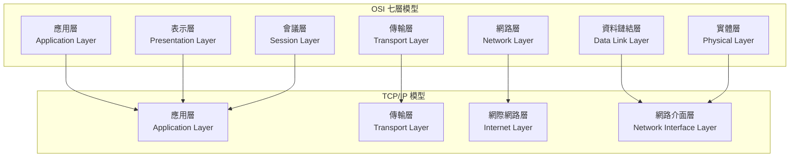

# OSI 七層模型（OSI Model）與 TCP/IP 模型（TCP/IP Model）

## 1. 理論簡介

OSI 七層模型（Open Systems Interconnection Model）是由 ISO 制定的網路通訊參考模型，將網路通訊過程劃分為七個層級，每層負責不同的功能，強調標準化與模組化設計。
TCP/IP 模型則是實際網路（如 Internet）廣泛採用的協定架構，分為四層或五層，設計更貼近實務應用。

---

## 2. 各層功能詳細說明

### OSI 七層模型（OSI Model）

1. **實體層（Physical Layer）**
   定義硬體傳輸介面與訊號（如電壓、纜線、連接器），負責比特流的傳送。

2. **資料鏈結層（Data Link Layer）**
   處理資料幀（Frame）的建立、錯誤偵測與修正，負責點對點的資料傳輸（如 Ethernet、MAC 位址）。

3. **網路層（Network Layer）**
   負責資料封包（Packet）在不同網路間的路由選擇與轉送（如 IP 協定）。

4. **傳輸層（Transport Layer）**
   提供端對端的資料傳輸、流量控制與錯誤修正（如 TCP、UDP）。

5. **會議層（Session Layer）**
   管理應用間的連線與對話（如建立、維護、終止會話）。

6. **表示層（Presentation Layer）**
   處理資料格式轉換、加解密與壓縮（如編碼、字元集轉換）。

7. **應用層（Application Layer）**
   提供應用程式存取網路服務的介面（如 HTTP、FTP、SMTP）。

---

### TCP/IP 模型（TCP/IP Model）

1. **網路介面層（Network Interface Layer）**
   包含 OSI 的實體層與資料鏈結層，負責資料在本地網路的傳輸。

2. **網際網路層（Internet Layer）**
   對應 OSI 的網路層，負責封包的路由與轉送（如 IP）。

3. **傳輸層（Transport Layer）**
   與 OSI 傳輸層相同，負責端對端通訊（如 TCP、UDP）。

4. **應用層（Application Layer）**
   包含 OSI 的應用層、表示層、會議層，提供應用服務（如 HTTP、DNS、SMTP）。

---

## 3. OSI 與 TCP/IP 各層對照表

| OSI 七層模型              | TCP/IP 模型                    | 主要協定範例            |
| --------------------- | ---------------------------- | ----------------- |
| 7. 應用層 (Application)  | 4. 應用層 (Application)         | HTTP, FTP, SMTP   |
| 6. 表示層 (Presentation) | 4. 應用層 (Application)         | SSL, TLS          |
| 5. 會議層 (Session)      | 4. 應用層 (Application)         | RPC, NetBIOS      |
| 4. 傳輸層 (Transport)    | 3. 傳輸層 (Transport)           | TCP, UDP          |
| 3. 網路層 (Network)      | 2. 網際網路層 (Internet)          | IP, ICMP, ARP     |
| 2. 資料鏈結層 (Data Link)  | 1. 網路介面層 (Network Interface) | Ethernet, PPP     |
| 1. 實體層 (Physical)     | 1. 網路介面層 (Network Interface) | Fiber, Copper, 無線 |

---

## 4. Mermaid 圖解：兩大模型分層結構

---

## 5. 實務應用場景

- **HTTP（超文本傳輸協定）**
  屬於 OSI 的應用層（Application Layer），在 TCP/IP 模型中同樣屬於應用層。
  實際運作時，HTTP 透過 TCP（傳輸層）建立連線，並以 IP（網際網路層）進行封包傳送。

- **TCP/IP 在網路設計中的映射**
  例如企業內部網路設計時，會根據 TCP/IP 各層分工：
  - 應用層：設計 Web、郵件、DNS 等服務
  - 傳輸層：選擇 TCP 或 UDP 根據需求（如可靠性或即時性）
  - 網際網路層：規劃 IP 位址、子網路、路由
  - 網路介面層：選擇有線/無線網路技術、交換機、網卡等硬體

---

## 6. 資深後端工程師的設計建議、常見誤區與最佳實踐

- **設計建議**
  - 明確區分各層責任，避免應用層過度耦合底層細節。
  - 選擇協定時考慮需求（如 TCP 適合可靠傳輸，UDP 適合即時性）。
  - 善用現有標準協定，減少自訂協定帶來的維護負擔。

- **常見誤區**
  - 誤以為 TCP/IP 模型與 OSI 模型完全對應，實際上 TCP/IP 更貼近實作，部分層級合併。
  - 忽略資料鏈結層與實體層對網路效能的影響（如 MTU、錯誤率）。
  - 認為所有應用都必須用 TCP，實際上 UDP 在影音串流、即時遊戲等場景更合適。

- **最佳實踐**
  - 應用層協定設計應考慮可擴展性與安全性（如 HTTPS、OAuth）。
  - 定期檢查網路層與資料鏈結層設定，優化效能與安全。
  - 充分利用分層架構，便於除錯、維護與升級。

---