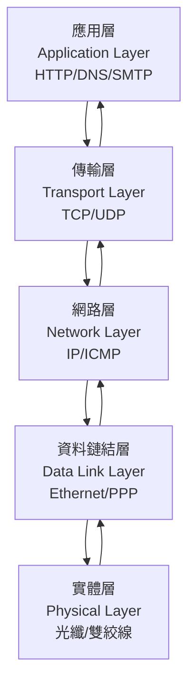

# 各層功能與協議

## 1. 各層常見協議理論與功能說明

### 應用層（Application Layer）
- **HTTP（HyperText Transfer Protocol）**：用於網頁資料傳輸，支援請求/回應模式，無狀態（stateless）。
- **DNS（Domain Name System）**：將網域名稱解析為 IP 位址。
- **SMTP（Simple Mail Transfer Protocol）**：電子郵件傳送協議。

### 傳輸層（Transport Layer）
- **TCP（Transmission Control Protocol）**：連線導向，提供可靠、順序、無遺漏的資料傳輸，具備流量控制與錯誤檢查。
- **UDP（User Datagram Protocol）**：無連線，傳輸速度快但不保證可靠性，常用於即時應用（如影音串流）。

### 網路層（Network Layer）
- **IP（Internet Protocol）**：負責封包尋址與路由，分 IPv4、IPv6。
- **ICMP（Internet Control Message Protocol）**：用於傳送錯誤訊息與網路診斷（如 ping）。

### 資料鏈結層（Data Link Layer）
- **Ethernet（乙太網路協議）**：區域網路常用協議，定義 MAC 位址與資料框架格式。
- **PPP（Point-to-Point Protocol）**：點對點連線協議，常用於撥號連線。

### 實體層（Physical Layer）
- **光纖、雙絞線、無線電波等**：負責實際訊號傳輸，定義電氣、機械、程序規範。

---

## 2. 協議對應分層表

| 協議名稱（英文） | 所屬分層（OSI/TCP/IP）      |
|------------------|----------------------------|
| HTTP             | 應用層 / Application Layer |
| DNS              | 應用層 / Application Layer |
| SMTP             | 應用層 / Application Layer |
| TCP              | 傳輸層 / Transport Layer   |
| UDP              | 傳輸層 / Transport Layer   |
| IP               | 網路層 / Network Layer     |
| ICMP             | 網路層 / Network Layer     |
| Ethernet         | 資料鏈結層 / Data Link Layer|
| PPP              | 資料鏈結層 / Data Link Layer|

---

## 3. Mermaid 圖解：協議分層與資料流動

---

## 4. 真實範例

### HTTP 請求流程
1. 使用者在瀏覽器輸入網址（HTTP 請求）。
2. DNS 解析網址取得伺服器 IP。
3. 瀏覽器透過 TCP 與伺服器建立連線（三次握手）。
4. 傳送 HTTP Request，伺服器回應 HTTP Response。
5. 資料經由 TCP/IP 傳輸，底層以 Ethernet 封裝傳送。

### TCP 封包結構（TCP Segment）
| 欄位             | 說明                       |
|------------------|----------------------------|
| Source Port      | 來源埠號                   |
| Destination Port | 目的埠號                   |
| Sequence Number  | 序號                       |
| Ack Number       | 確認號                     |
| Flags            | 控制旗標（如 SYN, ACK）    |
| Window Size      | 流量控制視窗               |
| Checksum         | 錯誤檢查                   |
| Data             | 資料內容                   |

### Ethernet Frame 範例
| 欄位             | 說明                       |
|------------------|----------------------------|
| Preamble         | 前置碼                     |
| Destination MAC  | 目的 MAC 位址              |
| Source MAC       | 來源 MAC 位址              |
| Type             | 上層協議型別（如 0x0800 表示 IP）|
| Data             | 資料內容                   |
| CRC              | 錯誤檢查                   |

---

## 5. 資深後端工程師的實務建議與最佳實踐

- **協議選擇**：依應用需求選擇協議。例如需可靠傳輸選 TCP，需低延遲可選 UDP。
- **效能考量**：減少不必要的協議層級轉換，HTTP/2、gRPC 可提升效能。
- **安全性**：HTTP 建議搭配 TLS（HTTPS），避免明文傳輸敏感資料。
- **常見誤區**：
  - 誤以為 TCP 傳輸一定不會丟包，實際上網路不穩時仍可能重傳或斷線。
  - 忽略 MTU（最大傳輸單元）設定，導致封包分割與效能下降。
  - 只考慮單一協議，忽略跨層最佳化（如 HTTP Keep-Alive、TCP Fast Open）。
- **除錯建議**：善用 Wireshark、tcpdump 等工具分析協議封包，快速定位問題。
- **文件與規範**：參考官方 RFC 文件，確保協議實作正確。
