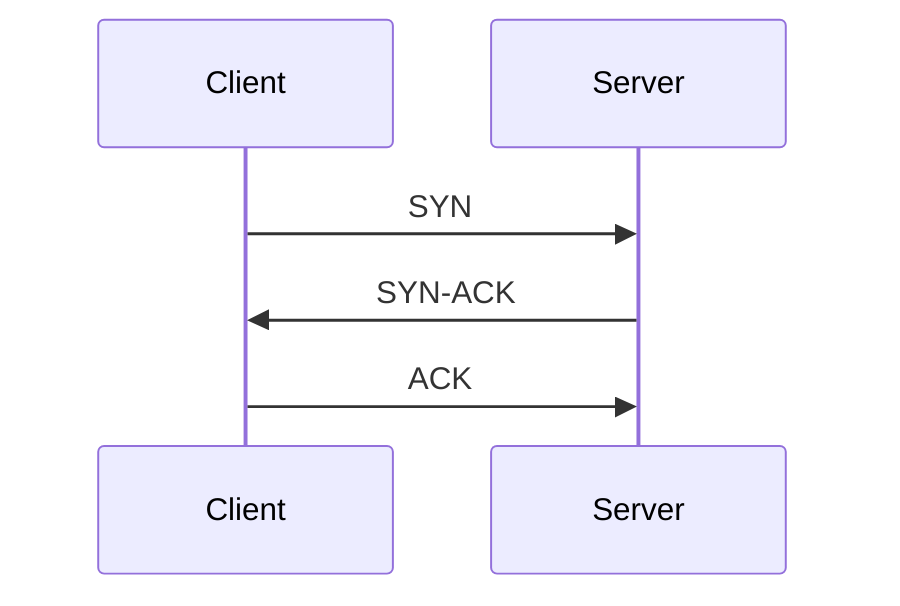
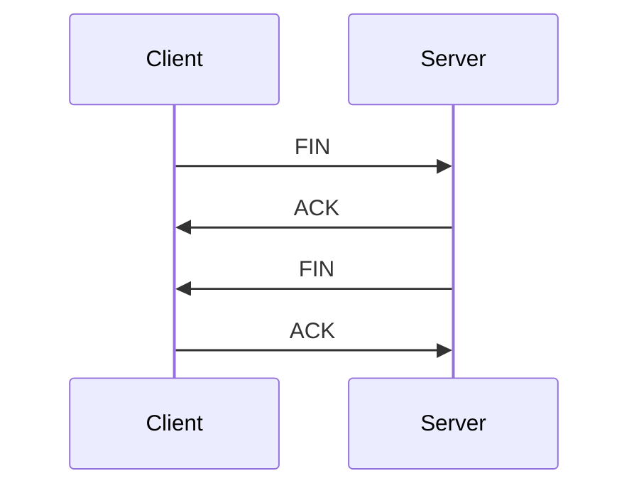

# 常見網路面試題型

## 1. 常見題型理論與詳細解釋

### TCP 與 UDP 差異（TCP vs UDP）

- **TCP（Transmission Control Protocol）**：連線導向（Connection-oriented），提供可靠（Reliable）資料傳輸，具備流量控制（Flow Control）、錯誤檢查（Error Checking）、順序保證（Ordered Delivery）。
- **UDP（User Datagram Protocol）**：無連線（Connectionless），不保證可靠性、順序與完整性，適合即時應用（如影音串流、線上遊戲）。

| 特性             | TCP                        | UDP                        |
|------------------|----------------------------|----------------------------|
| 連線方式         | 連線導向（Connection-oriented） | 無連線（Connectionless）      |
| 傳輸可靠性       | 有（Reliable）              | 無（Unreliable）            |
| 傳輸順序         | 保證順序（Ordered）         | 不保證順序（Unordered）      |
| 流量控制         | 有（Flow Control）          | 無                          |
| 常見應用         | HTTP, FTP, SMTP            | DNS, VoIP, Streaming        |

---

### 三次握手（Three-way Handshake）

- 用於建立 TCP 連線，確保雙方都能收發資料。
1. **SYN**：Client 傳送 SYN 封包給 Server，請求建立連線。
2. **SYN-ACK**：Server 回應 SYN-ACK，表示收到請求並同意建立連線。
3. **ACK**：Client 傳送 ACK，連線建立完成。

---

### 四次揮手（Four-way Handshake）

- 用於終止 TCP 連線，確保雙方資料傳輸結束。
1. **FIN**：Client 傳送 FIN，表示無資料可傳送。
2. **ACK**：Server 回 ACK，確認收到 FIN。
3. **FIN**：Server 傳送 FIN，表示也無資料可傳送。
4. **ACK**：Client 回 ACK，連線正式關閉。

---

## 2. Mermaid 圖解

### 三次握手流程



### 四次揮手流程



---

## 3. 真實世界範例

### 使用 tcpdump 抓取三次握手

```bash
sudo tcpdump -i eth0 tcp[13]=2 or tcp[13]=18 or tcp[13]=16
```
- `tcp[13]=2`：SYN
- `tcp[13]=18`：SYN-ACK
- `tcp[13]=16`：ACK

### 使用 curl 測試 TCP/UDP

- 測試 TCP 連線（HTTP）：
  ```bash
  curl -v http://example.com
  ```
- 測試 UDP（需搭配 netcat）：
  ```bash
  # 啟動 UDP 伺服器
  nc -lu 12345
  # 傳送 UDP 封包
  echo "test" | nc -u 127.0.0.1 12345
  ```

---

## 4. 資深後端工程師的實務建議與最佳實踐

### 答題技巧

- 條理分明，先定義專有名詞（中英文），再說明流程與應用。
- 善用圖解（如 Mermaid）輔助說明。
- 舉實際案例（如 tcpdump、curl）加強說服力。

### 常見誤區

- 混淆 TCP/UDP 適用場景。
- 忽略 TCP 可靠性機制（如重傳、流量控制）。
- 誤解三次握手與四次揮手的細節（如 ACK/FIN 封包順序）。

### 設計思維

- 根據應用需求選擇協議（如即時 vs. 可靠性）。
- 針對高併發設計，考慮連線管理與資源釋放。
- 熟悉網路除錯工具（如 tcpdump、wireshark）提升問題排查效率。

---