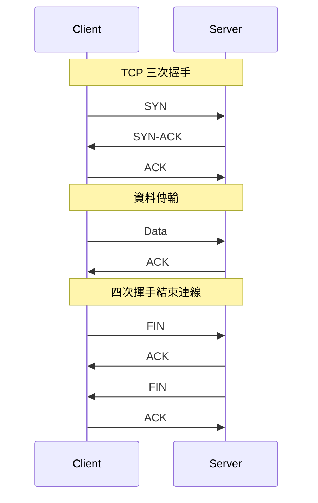
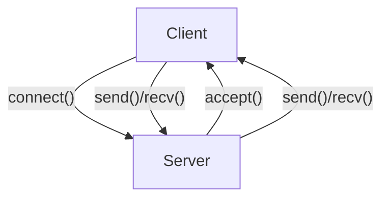

# 網路通訊核心

## 1. TCP、UDP 原理與比較

### TCP（Transmission Control Protocol）
- 連線導向（Connection-oriented），需建立連線（三次握手 Three-way Handshake）
- 提供可靠性（Reliability）：數據包遺失會重傳，確保順序與完整性
- 流量控制（Flow Control）、擁塞控制（Congestion Control）
- 適用於需要高可靠性的應用（如：HTTP、FTP、SMTP）

### UDP（User Datagram Protocol）
- 無連線（Connectionless），不需建立連線
- 不保證可靠性、順序與完整性，無流量與擁塞控制
- 傳輸速度快，適合即時應用（如：VoIP、影音串流、DNS）

| 協議 | 連線方式 | 可靠性 | 流量/擁塞控制 | 傳輸速度 | 適用場景 |
|------|----------|--------|---------------|----------|----------|
| TCP  | 連線導向 | 有     | 有            | 較慢     | 需可靠傳輸 |
| UDP  | 無連線   | 無     | 無            | 較快     | 即時傳輸 |

---

## 2. 流量控制（Flow Control）、擁塞控制（Congestion Control）、Nagle’s Algorithm

### 流量控制（Flow Control）
- 控制發送端傳送速率，避免接收端來不及處理
- 常見機制：滑動視窗（Sliding Window）

### 擁塞控制（Congestion Control）
- 避免網路過載，調整傳送速率
- 常見演算法：慢啟動（Slow Start）、擁塞避免（Congestion Avoidance）、快重傳（Fast Retransmit）、快恢復（Fast Recovery）

### Nagle’s Algorithm
- 將小型封包合併，減少網路負擔
- 適用於 TCP，降低大量小封包造成的效能問題
- 可用 `TCP_NODELAY` 選項關閉

---

## 3. Socket 通訊（阻塞/非阻塞、IO 多路復用）原理與實作

### 阻塞（Blocking）/ 非阻塞（Non-blocking）
- 阻塞：呼叫後程式會等待操作完成（如：`recv()` 等待資料）
- 非阻塞：呼叫後立即返回，需自行判斷狀態

### IO 多路復用（IO Multiplexing）
- 允許單一程序同時監控多個 socket
- 常見方法：`select()`、`poll()`、`epoll`（Linux）

#### Python Socket 實作範例

```python
# 阻塞式 TCP Server
import socket

server = socket.socket(socket.AF_INET, socket.SOCK_STREAM)
server.bind(('0.0.0.0', 8888))
server.listen(5)
conn, addr = server.accept()
data = conn.recv(1024)
conn.sendall(b'Hello, client!')
conn.close()
server.close()
```

```python
# 非阻塞 + select 多路復用
import socket, select

server = socket.socket(socket.AF_INET, socket.SOCK_STREAM)
server.setblocking(False)
server.bind(('0.0.0.0', 8888))
server.listen(5)
inputs = [server]
while True:
    readable, _, _ = select.select(inputs, [], [])
    for s in readable:
        if s is server:
            conn, addr = server.accept()
            conn.setblocking(False)
            inputs.append(conn)
        else:
            data = s.recv(1024)
            if data:
                s.sendall(b'Hello, client!')
            else:
                inputs.remove(s)
                s.close()
```

---

## 4. Mermaid 圖解

### TCP/UDP 傳輸流程



```mermaid
flowchart LR
    A[Client] -- UDP Packet --> B[Server]
    B -- UDP Response --> A
    Note right of A: 無需建立連線，直接傳送
```

### Socket 通訊模型



---

## 5. 真實範例

### Python socket 程式片段
見上方「Socket 通訊」範例。

### tcpdump 抓包流程

```bash
# 抓取 TCP 80 port 封包
sudo tcpdump -i eth0 tcp port 80 -nn -X
```
- `-i eth0`：指定網卡
- `tcp port 80`：過濾條件
- `-nn`：不解析主機/服務名稱
- `-X`：顯示封包內容（十六進位與 ASCII）

---

## 6. 資深後端工程師的實務建議與最佳實踐

- **協議選擇**：需可靠傳輸選 TCP，需低延遲選 UDP，根據應用場景選擇
- **效能調校**：
  - 合理設定 socket buffer
  - 適時關閉 Nagle’s Algorithm (`TCP_NODELAY`)
  - 使用 IO 多路復用提升併發能力
- **常見誤區**：
  - 誤以為 UDP 一定比 TCP 快，實際需考慮網路狀況與丟包重傳
  - 忽略 TCP 連線建立/關閉的資源消耗
  - 未處理 socket 資源釋放，導致 FD 泄漏
- **安全性**：
  - 檢查輸入資料，避免 Buffer Overflow
  - 適當設定防火牆與權限

---