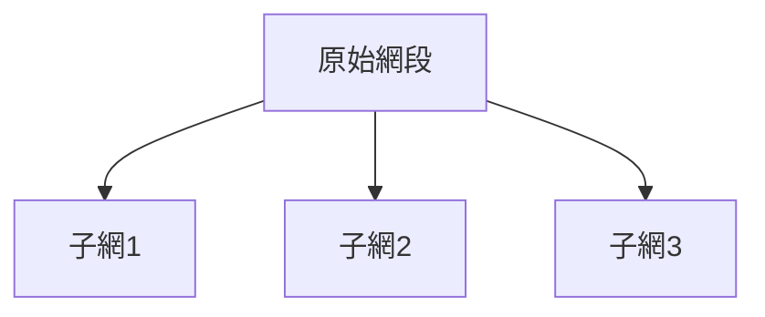
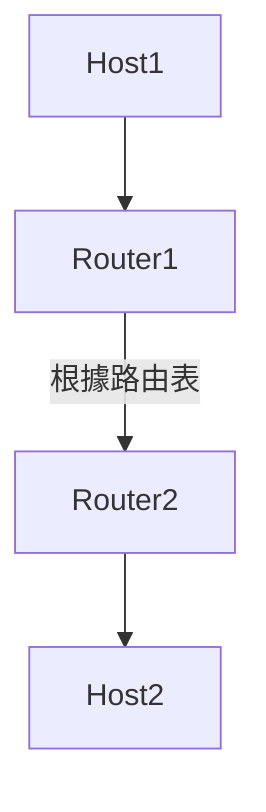
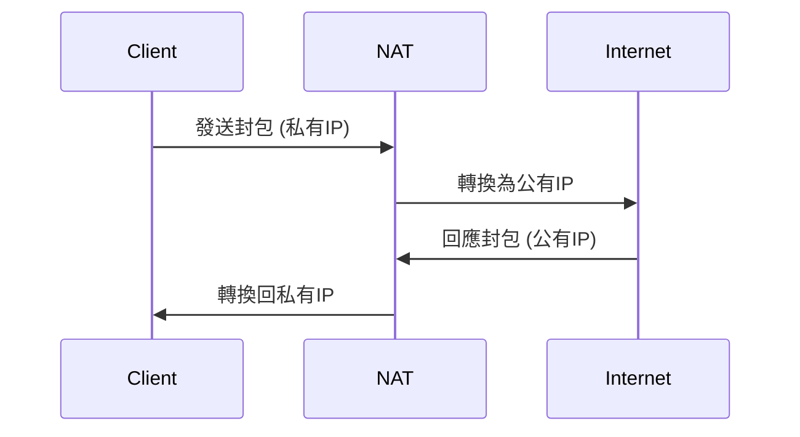

# 06_IP與路由

## 1. IPv4、IPv6、子網劃分（Subnetting）、CIDR（Classless Inter-Domain Routing）理論與計算方式

### IPv4（Internet Protocol version 4）
- 32 位元位址，格式如 `192.168.1.1`
- 分為 A/B/C/D/E 類，常用 A/B/C
- 位址耗盡問題

### IPv6（Internet Protocol version 6）
- 128 位元位址，格式如 `2001:0db8:85a3:0000:0000:8a2e:0370:7334`
- 解決 IPv4 位址不足，支援更多裝置

### 子網劃分（Subnetting）
- 將一個網路切割成多個小網路（子網）
- 透過「子網遮罩（Subnet Mask）」決定網路與主機部分
- 例：`255.255.255.0`（/24）

#### 子網計算方式
- 主機數量計算：$2^{主機位元數} - 2$
- 子網數量計算：$2^{子網位元數}$

### CIDR（Classless Inter-Domain Routing）
- 無類別域間路由
- 以 `/` 表示網路長度，如 `192.168.1.0/24`
- 提高 IP 位址利用率，減少路由表規模

#### CIDR 範例
- `192.168.1.0/26`：主機範圍 `192.168.1.1 ~ 192.168.1.62`，遮罩 `255.255.255.192`

---

## 2. 路由協議（RIP、OSPF、BGP）原理與比較

### RIP（Routing Information Protocol）
- 距離向量（Distance Vector）協議
- 以「跳數（Hop Count）」為度量，最大 15 跳
- 簡單、適用小型網路，收斂慢

### OSPF（Open Shortest Path First）
- 鏈路狀態（Link State）協議
- 使用 Dijkstra 演算法計算最短路徑
- 適用大型企業網路，收斂快，支援分區

### BGP（Border Gateway Protocol）
- 路徑向量（Path Vector）協議
- 用於網際網路骨幹（Internet Backbone）
- 支援政策路由，適合 ISP 間路由

#### 協議比較表

| 協議 | 類型 | 應用範圍 | 收斂速度 | 路由度量 | 備註 |
|------|------|----------|----------|----------|------|
| RIP  | 距離向量 | 小型 LAN | 慢 | 跳數 | 簡單 |
| OSPF | 鏈路狀態 | 企業/大型 | 快 | 路徑成本 | 複雜 |
| BGP  | 路徑向量 | ISP/骨幹 | 中等 | 路徑屬性 | 政策 |

---

## 3. NAT、DHCP、ARP、ICMP 理論與應用

### NAT（Network Address Translation）
- 轉換內部私有 IP 與外部公有 IP
- 節省公有 IP，提升安全性
- 類型：靜態 NAT、動態 NAT、PAT（Port Address Translation）

### DHCP（Dynamic Host Configuration Protocol）
- 自動分配 IP、子網遮罩、閘道、DNS 等參數
- 減少人工設定錯誤

### ARP（Address Resolution Protocol）
- 解析 IP 位址對應的 MAC 位址
- 本地區網內主機通訊必備

### ICMP（Internet Control Message Protocol）
- 傳遞網路診斷與錯誤訊息
- 例：ping、traceroute

---

## 4. 負載均衡（Load Balancing，L4/L7）原理與實務

### L4 負載均衡（傳輸層）
- 依據 TCP/UDP 連線分流
- 例：IP Hash、Round Robin

### L7 負載均衡（應用層）
- 依據 HTTP Header、URL、Cookie 分流
- 支援更細緻的流量控制

### 實務應用
- Nginx、HAProxy、F5、雲端負載均衡服務
- 提升可用性、擴展性

---

## 5. Mermaid 圖解

### 子網劃分



### 路由選擇



### NAT 流程



---

## 6. 真實範例

### 子網計算

- 需求：50 台主機
- 選擇 /26（255.255.255.192），可用主機數 $2^{6}-2=62$
- 範例：`192.168.10.0/26`，主機範圍 `192.168.10.1 ~ 192.168.10.62`

### 路由表範例

| 目的網段 | 子網遮罩 | 下一跳 | 介面 |
|----------|----------|--------|------|
| 0.0.0.0  | 0.0.0.0  | 192.168.1.1 | eth0 |
| 192.168.10.0 | 255.255.255.0 | 0.0.0.0 | eth1 |

### NAT 配置片段（Cisco）

```shell
interface FastEthernet0/0
 ip address 192.168.1.1 255.255.255.0
 ip nat inside
!
interface Serial0/0
 ip address 203.0.113.2 255.255.255.252
 ip nat outside
!
ip nat inside source list 1 interface Serial0/0 overload
access-list 1 permit 192.168.1.0 0.0.0.255
```

---

## 7. 資深後端工程師的實務建議與最佳實踐

- 子網設計時，預留未來擴充空間，避免主機數剛好用盡
- 路由表應簡潔，避免重疊與循環路由
- 使用 OSPF/BGP 等動態路由協議時，定期檢查收斂狀態與路由策略
- NAT 配置需注意連線追蹤限制，避免連線數爆滿
- DHCP 範圍規劃需考慮靜態 IP 需求
- 常見誤區：子網遮罩設錯、路由優先順序錯誤、NAT 端口映射遺漏
- 建議：善用網路模擬工具（如 GNS3、Packet Tracer）驗證設計
