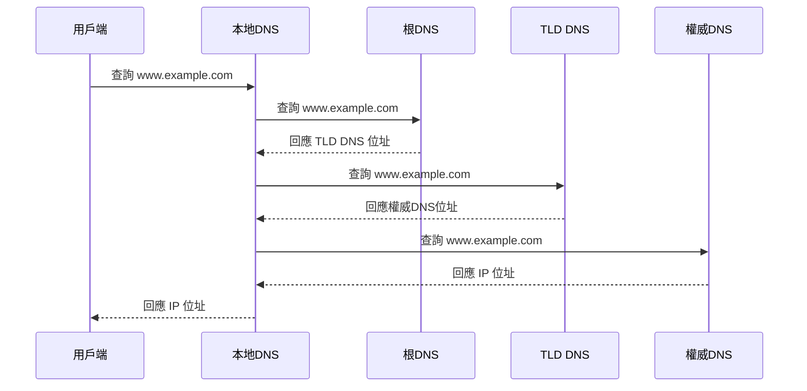
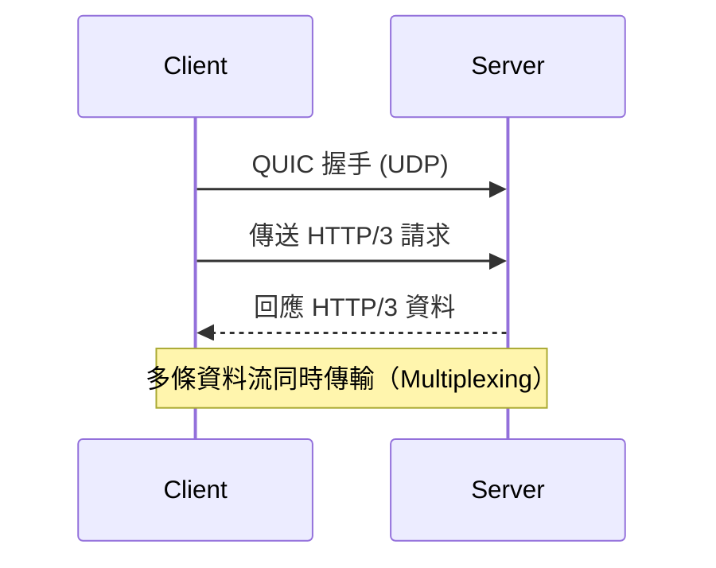

# 07_DNS與應用層協議

## 1. DNS（Domain Name System）原理與解析流程

### DNS 原理
DNS（Domain Name System，網域名稱系統）是一種分散式資料庫系統，負責將人類易讀的網域名稱（如 `www.example.com`）轉換為電腦可識別的 IP 位址（如 `93.184.216.34`），使網路通訊更為便利。

### DNS 解析流程
1. 使用者輸入網址，瀏覽器先查詢本地快取（Cache）。
2. 若無快取，查詢會送至本地 DNS 伺服器（通常由 ISP 提供）。
3. 本地 DNS 伺服器若無對應記錄，會進行遞迴查詢（Recursive Query）或迭代查詢（Iterative Query）。

#### 遞迴查詢（Recursive Query）
- 本地 DNS 伺服器全權負責查詢，直到獲得最終結果或失敗為止。
- 用戶端只需等待回應，不需參與中間過程。

#### 迭代查詢（Iterative Query）
- DNS 伺服器會回傳下一個應查詢的 DNS 伺服器位址，由本地 DNS 伺服器逐步查詢，直到獲得最終結果。

### DNS 解析流程 Mermaid 圖


---

## 2. 應用層協議理論、比較與應用場景

| 協議 | 理論簡述 | 主要應用場景 | 特點/比較 |
|------|----------|-------------|-----------|
| **HTTP/1.1** | HyperText Transfer Protocol 1.1，無狀態、基於 TCP，單連線序列傳輸 | 網頁瀏覽、API | Head-of-line blocking、無多工 |
| **HTTP/2** | 支援多工（Multiplexing）、Header 壓縮、伺服器推送 | 現代網站、API | 多工、效能提升 |
| **HTTP/3（QUIC）** | 基於 QUIC（UDP），減少握手延遲，內建加密 | 高延遲/不穩定網路、行動裝置 | 低延遲、連線遷移 |
| **HTTPS** | HTTP over TLS/SSL，資料加密傳輸 | 安全網站、金融、登入 | 防竊聽、防竄改 |
| **TLS/SSL** | Transport Layer Security / Secure Sockets Layer，傳輸層加密協議 | HTTPS、SMTP、IMAP | 資料加密、身份驗證 |
| **gRPC** | Google Remote Procedure Call，基於 HTTP/2，支援多語言、序列化（Protobuf） | 微服務、內部 API | 高效能、嚴格型別 |
| **WebSocket** | 雙向持久連線，基於 TCP | 即時聊天、遊戲、推播 | 低延遲、全雙工 |
| **MQTT** | Message Queuing Telemetry Transport，輕量級、基於發布/訂閱（Pub/Sub） | IoT、感測器、即時訊息 | 輕量、省流量、QoS |

### HTTP/3 資料流動 Mermaid 圖


---

## 3. 真實範例

### DNS 查詢（dig）
```shell
dig www.google.com

; <<>> DiG 9.16.1-Ubuntu <<>> www.google.com
;; ANSWER SECTION:
www.google.com.    299 IN  A 142.250.206.100
```

### HTTP 測試（curl）
```shell
curl -v https://www.example.com/
```

### gRPC 範例（Python）
```python
import grpc
import helloworld_pb2
import helloworld_pb2_grpc

channel = grpc.insecure_channel('localhost:50051')
stub = helloworld_pb2_grpc.GreeterStub(channel)
response = stub.SayHello(helloworld_pb2.HelloRequest(name='World'))
print(response.message)
```

### WebSocket 範例（JavaScript）
```javascript
const ws = new WebSocket('wss://echo.websocket.org');
ws.onopen = () => ws.send('Hello WebSocket!');
ws.onmessage = (event) => console.log(event.data);
```

### MQTT 範例（Python）
```python
import paho.mqtt.client as mqtt

client = mqtt.Client()
client.connect("broker.hivemq.com", 1883, 60)
client.publish("test/topic", "Hello MQTT!")
client.disconnect()
```

---

## 4. 實務建議與最佳實踐

- **協議選擇**：根據應用需求選擇協議。例如：IoT 選 MQTT，微服務選 gRPC，需雙向即時通訊選 WebSocket。
- **效能考量**：HTTP/2、HTTP/3 提升多工與延遲表現，gRPC 適合高效能內部通訊。
- **安全建議**：所有敏感資料傳輸應使用 HTTPS（TLS/SSL），避免明文傳輸。
- **常見誤區**：
  - 誤以為 HTTP/2/3 一定比 HTTP/1.1 快，實際需視應用場景與網路狀況。
  - 忽略 DNS 快取與 TTL 設定，導致解析延遲或異常。
  - MQTT 適合低頻小訊息，不適合大量即時資料。
- **維運建議**：
  - 定期檢查憑證有效期與 TLS 設定。
  - 監控 DNS 查詢延遲與失敗率。
  - 測試協議兼容性與回退機制。

---