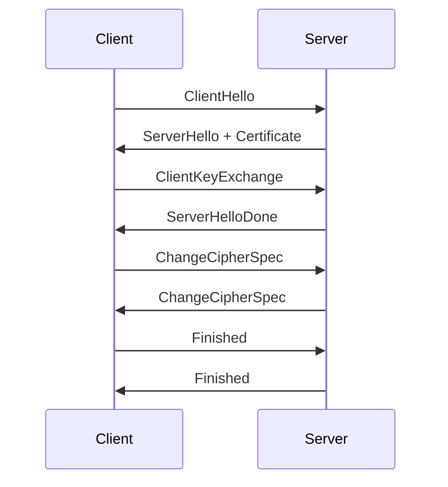
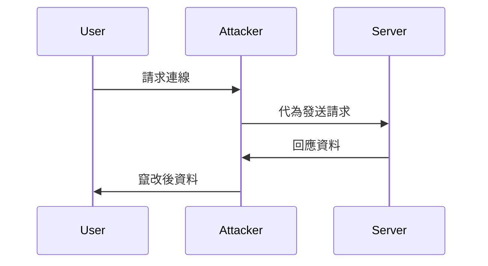

# 08_網路安全

## 1. 防火牆（Firewall）、VPN、Proxy 理論與應用

### 防火牆（Firewall）
- **定義**：防火牆（Firewall）是一種用於監控與控制進出網路流量的安全設備或軟體，根據預設的安全規則允許或阻擋資料封包。
- **應用**：
  - 阻擋未授權存取
  - 過濾惡意流量
  - 分隔內外網路
- **類型**：
  - 封包過濾防火牆（Packet Filtering Firewall）
  - 狀態檢查防火牆（Stateful Inspection Firewall）
  - 應用層防火牆（Application Layer Firewall）

### 虛擬私人網路（VPN, Virtual Private Network）
- **定義**：VPN 透過加密通道在公用網路上建立安全的私有連線，保護資料傳輸的機密性與完整性。
- **應用**：
  - 遠端安全連線
  - 跨區域安全存取內部資源
  - 匿名上網

### 代理伺服器（Proxy）
- **定義**：代理伺服器（Proxy）是位於用戶端與目標伺服器之間的中介，轉發請求並可進行快取、過濾、匿名等功能。
- **應用**：
  - 網頁快取提升效能
  - 過濾不良網站
  - 隱藏用戶真實 IP

---

## 2. 常見攻擊原理與防禦方式

### DDoS（Distributed Denial of Service，分散式阻斷服務）
- **原理**：攻擊者利用大量殭屍主機同時發送大量請求，癱瘓目標伺服器。
- **防禦**：
  - 流量清洗（Traffic Scrubbing）
  - 限速（Rate Limiting）
  - CDN 與分散式架構

### MITM（Man-in-the-Middle，中間人攻擊）
- **原理**：攻擊者攔截並竄改雙方通訊內容。
- **防禦**：
  - 使用 TLS/SSL 加密
  - 驗證憑證真偽
  - 公開金鑰基礎建設（PKI）

### DNS Spoofing（DNS 欺騙）
- **原理**：攻擊者偽造 DNS 回應，將用戶導向惡意網站。
- **防禦**：
  - DNSSEC 驗證
  - 使用可信 DNS 伺服器
  - 定期檢查 DNS 設定

### ARP 欺騙（ARP Spoofing/Poisoning）
- **原理**：攻擊者偽造 ARP 封包，竊取區域網路內資料。
- **防禦**：
  - 靜態 ARP 表
  - ARP 檢測工具
  - 區域網路隔離

---

## 3. 加密與認證機制理論與實務

### TLS 握手（TLS Handshake）
- **理論**：TLS（Transport Layer Security）用於網路傳輸加密，握手過程協商加密演算法並交換金鑰。
- **實務**：HTTPS 網站、郵件加密等。

### JWT（JSON Web Token）
- **理論**：JWT 是一種基於 JSON 的輕量級認證機制，包含 Header、Payload、Signature 三部分。
- **實務**：API 認證、單點登入（SSO）

### OAuth2
- **理論**：OAuth2 是一種授權框架，允許第三方應用存取用戶資源而不暴露密碼。
- **實務**：Google、Facebook 登入、API 授權

---

## 4. Mermaid 圖解

### TLS 握手流程



### MITM 攻擊流程



---

## 5. 真實範例

### iptables 防火牆規則

```bash
# 只允許 80, 443 連線，其餘封鎖
iptables -A INPUT -p tcp --dport 80 -j ACCEPT
iptables -A INPUT -p tcp --dport 443 -j ACCEPT
iptables -A INPUT -j DROP
```

### OpenVPN 配置片段

```conf
client
dev tun
proto udp
remote vpn.example.com 1194
resolv-retry infinite
nobind
persist-key
persist-tun
ca ca.crt
cert client.crt
key client.key
cipher AES-256-CBC
auth SHA256
```

### JWT Token 範例

```json
{
  "alg": "HS256",
  "typ": "JWT"
}
.
{
  "sub": "1234567890",
  "name": "John Doe",
  "iat": 1516239022
}
.
[Signature]
```

---

## 6. 資深後端工程師的實務建議與最佳實踐

- **安全設計原則**：
  - 最小權限原則（Principle of Least Privilege）
  - 預設拒絕（Default Deny）
  - 防禦縱深（Defense in Depth）
- **常見誤區**：
  - 過度信任內部網路
  - 憑證未妥善管理
  - 忽略日誌與異常監控
- **攻防思維**：
  - 定期進行弱點掃描與滲透測試
  - 持續更新與修補系統
  - 建立事件回應流程
- **實務建議**：
  - 使用自動化工具檢查依賴漏洞
  - 強制 HTTPS 與安全 Cookie
  - 嚴格驗證用戶輸入，防止注入攻擊
  - 定期教育團隊資安意識

---