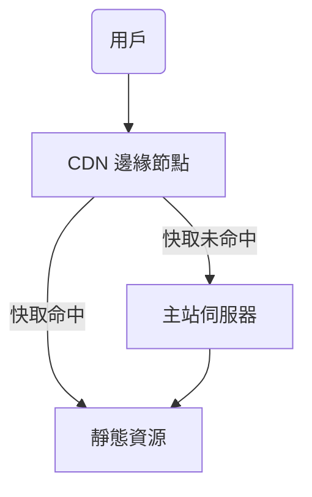
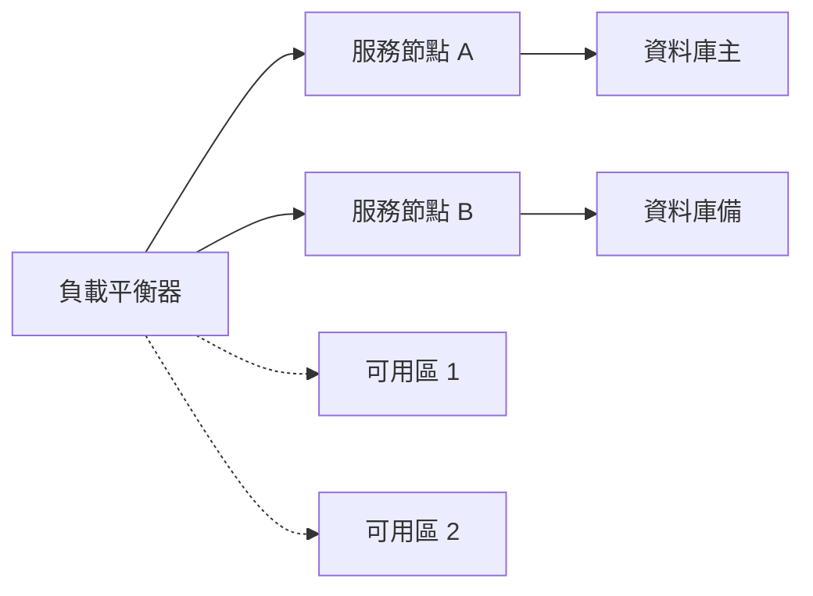

# 09_效能與可靠性

## 1. CDN（Content Delivery Network，內容傳遞網路）原理與邊緣計算（Edge Computing）

### CDN 原理
CDN 透過在全球多個地點部署節點（Edge Node），將靜態資源（如圖片、影片、JS、CSS）緩存於離用戶最近的伺服器，減少主站負載與延遲，提升存取速度與可靠性。
**核心概念**：內容分發、負載均衡、地理分布、快取（Cache）。

### 邊緣計算（Edge Computing）理論與應用
邊緣計算將運算資源下放至靠近資料來源或用戶端的邊緣節點，減少資料傳輸延遲、降低核心伺服器壓力，適用於 IoT、即時影音、智慧城市等場景。
**應用**：即時資料處理、內容個人化、分散式安全防護。

---

## 2. Caching（快取）機制與設計

### DNS Cache
- **原理**：將 DNS 查詢結果暫存於本地或 ISP，減少重複查詢延遲。
- **設計重點**：TTL（Time To Live）設定、快取一致性。

### HTTP Cache
- **原理**：瀏覽器或 Proxy 快取 HTTP 回應（如圖片、API 回應）。
- **設計重點**：Cache-Control、ETag、Last-Modified、Expires 標頭。

### 反向代理 Cache（Reverse Proxy Cache）
- **原理**：如 Nginx、Varnish 於伺服器端快取動態或靜態內容，減少後端壓力。
- **設計重點**：快取鍵設計、過期策略、清除機制。

---

## 3. 高可用架構（High Availability, HA）

### 多活（Active-Active）
多個節點同時對外提供服務，流量分散，任一節點故障時其他節點可接手，提升可用性與容錯。

### 多區部署（Multi-AZ, Availability Zone）
將服務部署於多個地理區域或資料中心，避免單點故障（SPOF），提升災難復原能力。

---

## 4. 離線 / 不可靠網路環境設計原則

- **離線快取**：如 Service Worker 實現前端離線瀏覽。
- **重試與斷線續傳**：API 請求失敗自動重試、檔案分段上傳。
- **資料同步機制**：本地與伺服器資料一致性設計。
- **用戶體驗優化**：明確提示網路狀態、降級服務。

---

## 5. Mermaid 圖解

### CDN 架構



### HA 部署拓撲



---

## 6. 真實範例

### Nginx Cache 設定片段

```nginx
proxy_cache_path /data/nginx/cache levels=1:2 keys_zone=my_cache:10m max_size=1g inactive=60m use_temp_path=off;

server {
  location / {
    proxy_cache my_cache;
    proxy_pass http://backend;
    proxy_cache_valid 200 302 10m;
    proxy_cache_valid 404 1m;
    add_header X-Cache-Status $upstream_cache_status;
  }
}
```

### CDN 配置片段（以 Cloudflare 為例）

- 設定快取規則：將靜態資源（如 .jpg, .css, .js）設為長效快取。
- 啟用自動壓縮（Auto Minify）、圖片優化（Polish）、HTTP/2。

### HA 架構設計（簡述）

- 多台應用伺服器搭配負載平衡器（如 Nginx、AWS ELB）。
- 多區部署，資料庫主備同步。
- 偵測健康狀態，自動故障轉移（Failover）。

---

## 7. 資深後端工程師的實務建議與最佳實踐

- **效能優化**：善用 CDN、快取、壓縮、非同步處理。
- **容錯設計**：避免單點故障，設計自動重試與降級機制。
- **監控與告警**：即時監控流量、延遲、錯誤率，設置告警。
- **常見誤區**：
  - 忽略快取失效與一致性問題。
  - 高可用僅靠單一區域或單一供應商。
  - 未測試災難復原流程。
- **建議**：
  - 定期檢查快取策略與 HA 配置。
  - 模擬故障演練（Chaos Engineering）。
  - 文件化架構設計與異常處理流程。

---