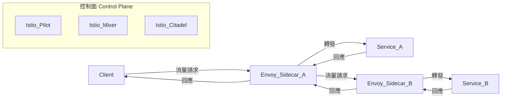
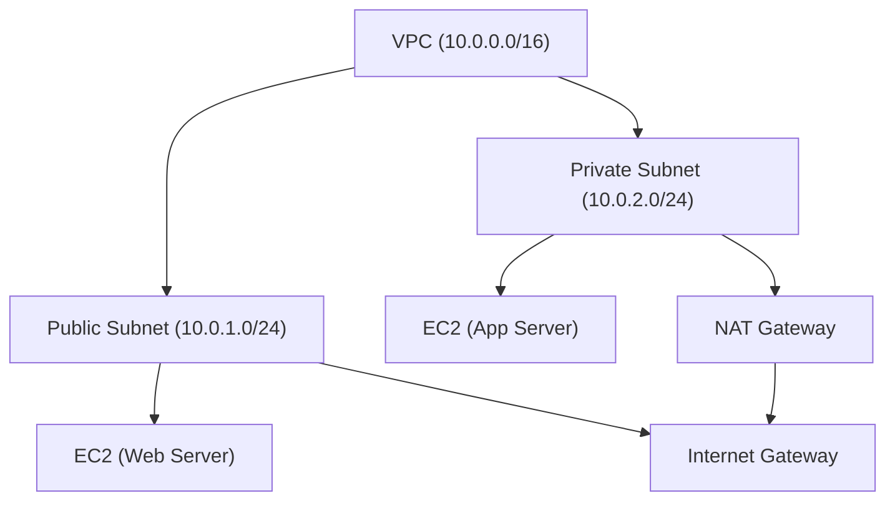

# 10. 雲原生與現代網路

## 1. Container Networking（容器網路：Docker、Kubernetes CNI）

- **原理與設計**
  - **Docker Networking**
    - Docker 預設提供多種網路模式（bridge、host、overlay）。
    - Bridge 模式下，容器透過虛擬橋接器（bridge）與主機及其他容器通訊。
    - Overlay 網路允許跨主機容器通訊，常用於 Swarm 或 Kubernetes。
    - 每個容器分配獨立的虛擬網卡（veth pair），並有獨立 IP。
  - **Kubernetes CNI（Container Network Interface）**
    - CNI 是一套標準介面，讓 Kubernetes 透過外掛（plugin）管理 Pod 網路。
    - 常見 CNI：Calico、Flannel、Cilium、Weave。
    - 每個 Pod 通常有獨立 IP，Pod 間可直接通訊（Flat Network）。
    - CNI 插件負責 IP 分配、路由、網路策略（Network Policy）等。

## 2. Service Mesh（服務網格：Istio、Linkerd）

- **架構與應用**
  - Service Mesh 以 Sidecar Proxy（如 Envoy）注入至每個服務 Pod，攔截進出流量。
  - 控制面（Control Plane）負責配置、流量管理、觀察性（Observability）。
  - 資料面（Data Plane）負責實際流量轉發、加密、認證。
  - 常見功能：流量分流（Canary）、熔斷、重試、服務發現、零信任安全。
  - **Istio**：功能完整，支援多種流量治理與安全策略。
  - **Linkerd**：輕量、易於部署，專注於核心 Service Mesh 能力。

## 3. 雲端 VPC（Virtual Private Cloud）、Subnets、Security Groups

- **理論與實務**
  - **VPC**：在公有雲（如 AWS、GCP、Azure）中建立邏輯隔離的虛擬網路。
  - **Subnets**：VPC 內部可劃分多個子網（Public/Private），用於分隔不同安全層級或服務。
  - **Security Groups**：虛擬防火牆，定義允許/拒絕的流量規則，作用於 EC2、RDS 等資源。
  - **實務建議**：合理劃分子網、最小權限原則設計 Security Group、避免單一點失效。

## 4. API Gateway、反向代理（Nginx、Envoy）

- **原理與設計**
  - **API Gateway**
    - 集中管理 API 請求，負責路由、認證、流量控制、日誌、限流等。
    - 常見產品：Kong、AWS API Gateway、Apigee。
  - **反向代理（Reverse Proxy）**
    - 代理內部服務，隱藏後端結構，提升安全性與可擴展性。
    - **Nginx**：高效能、配置彈性，支援 HTTP/TCP/UDP。
    - **Envoy**：現代化代理，支援動態配置、gRPC、Service Mesh 整合。

## 5. Mermaid 圖解

### Service Mesh 架構



### VPC 與子網拓撲



## 6. 真實範例

### K8s CNI 設定（以 Calico 為例）

```yaml
# calico.yaml 片段
apiVersion: projectcalico.org/v3
kind: IPPool
metadata:
  name: default-ipv4-ippool
spec:
  cidr: 192.168.0.0/16
  ipipMode: Always
  natOutgoing: true
```

### Nginx 反向代理設定

```nginx
server {
    listen 80;
    server_name example.com;

    location /api/ {
        proxy_pass http://backend:8080/;
        proxy_set_header Host $host;
        proxy_set_header X-Real-IP $remote_addr;
    }
}
```

### Envoy 配置片段

```yaml
static_resources:
  listeners:
  - name: listener_0
    address:
      socket_address: { address: 0.0.0.0, port_value: 8080 }
    filter_chains:
    - filters:
      - name: envoy.filters.network.http_connection_manager
        typed_config:
          "@type": type.googleapis.com/envoy.extensions.filters.network.http_connection_manager.v3.HttpConnectionManager
          stat_prefix: ingress_http
          route_config:
            name: local_route
            virtual_hosts:
            - name: backend
              domains: ["*"]
              routes:
              - match: { prefix: "/" }
                route: { cluster: backend }
          http_filters:
          - name: envoy.filters.http.router
  clusters:
  - name: backend
    connect_timeout: 0.25s
    type: logical_dns
    lb_policy: round_robin
    load_assignment:
      cluster_name: backend
      endpoints:
      - lb_endpoints:
        - endpoint:
            address:
              socket_address: { address: backend, port_value: 8080 }
```

### AWS VPC 設計建議

- 公網與私網分離，Web 服務放公網子網，資料庫與內部服務放私網子網。
- 使用 NAT Gateway 讓私網資源可安全存取外部網路。
- Security Group 僅開放必要 Port，避免 0.0.0.0/0。
- 多 AZ（可用區）部署，提升可用性與容錯。

## 7. 資深後端工程師的實務建議與最佳實踐

- **雲原生網路設計**
  - 優先考慮可觀察性（Observability）、自動化（Automation）、彈性擴展（Scalability）。
  - 網路策略（Network Policy）明確規範流量，落實最小權限原則。
- **零信任（Zero Trust）**
  - 不信任任何預設網路，所有流量皆需認證與加密。
  - 結合 Service Mesh、mTLS 強化服務間安全。
- **常見誤區**
  - 忽略跨區網路延遲與費用。
  - Security Group 設定過於寬鬆。
  - 未規劃好子網與路由，導致資源無法互通或暴露風險。
- **建議**
  - 定期審查網路規則與架構。
  - 善用 IaC（Infrastructure as Code）管理網路資源。
  - 監控與日誌不可或缺，便於追蹤與調查問題。
