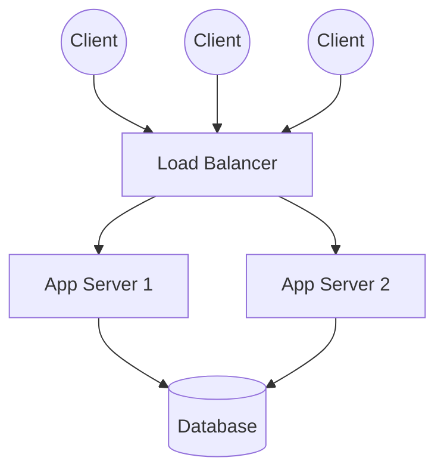
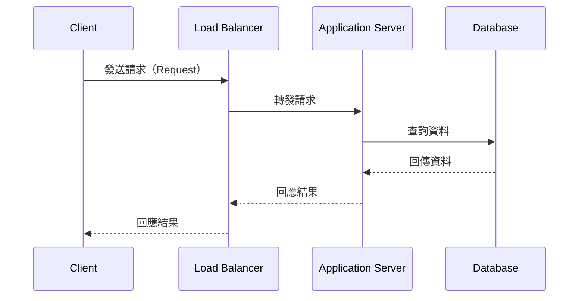
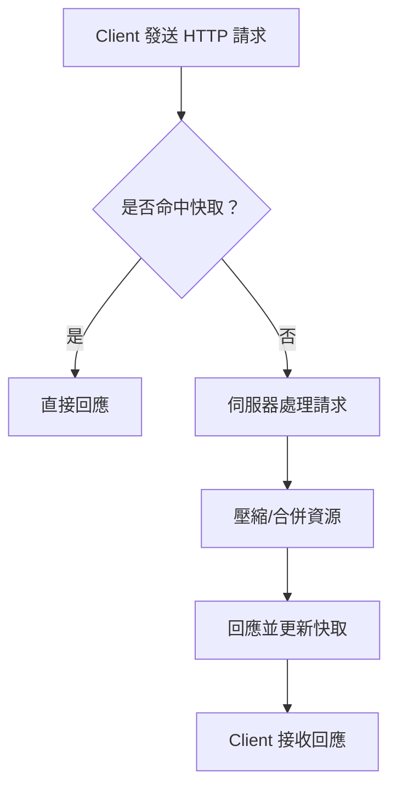

# 12_面試與實務問答集

---

## 1. 面試常見網路題目整理與詳細解答

### 1.1 TCP/UDP 差異（Transmission Control Protocol / User Datagram Protocol）

- **TCP**（傳輸控制協定，Transmission Control Protocol）
  - 連線導向（Connection-oriented）
  - 提供可靠性（Reliability）、順序性（Ordering）、流量控制（Flow Control）、擁塞控制（Congestion Control）
  - 適用於檔案傳輸（File Transfer）、網頁（Web）、電子郵件（Email）等需可靠傳輸場景

- **UDP**（用戶資料報協定，User Datagram Protocol）
  - 無連線（Connectionless）
  - 不保證可靠性、順序性，無流量/擁塞控制
  - 適用於即時影音（Streaming）、線上遊戲（Online Game）、DNS 查詢等需低延遲場景

---

### 1.2 三次握手（Three-way Handshake）

- TCP 建立連線時，需經過三次握手：
  1. Client 發送 SYN 封包（同步序號，Synchronize Sequence Number）
  2. Server 回應 SYN-ACK 封包（同步+確認，Synchronize + Acknowledge）
  3. Client 回送 ACK 封包（確認，Acknowledge）

- 目的：確保雙方都能收發資料，並同步序號，防止舊連線干擾。

---

### 1.3 DNS（Domain Name System）

- 將網域名稱（Domain Name）轉換為 IP 位址（IP Address）
- 查詢流程：Client → 遞迴解析器（Recursive Resolver）→ 根名稱伺服器（Root Server）→ TLD 伺服器（Top-Level Domain Server）→ 權威名稱伺服器（Authoritative Name Server）
- DNS 快取（Caching）可提升查詢效率

---

### 1.4 CDN（Content Delivery Network）

- 內容傳遞網路（Content Delivery Network），將靜態資源分散至多個節點（Edge Node），用戶可就近取得資源
- 優點：降低延遲（Latency）、減輕源站壓力、提升可用性與容錯

---

### 1.5 Socket

- 套接字（Socket）為應用層與傳輸層間的介面
- 支援 TCP/UDP 通訊，常用於伺服器與客戶端資料交換

---

### 1.6 HTTP/HTTPS

- **HTTP**（超文本傳輸協定，HyperText Transfer Protocol）：明文傳輸，無加密
- **HTTPS**（安全超文本傳輸協定，HyperText Transfer Protocol Secure）：以 TLS/SSL 加密，保障資料安全
- HTTPS 需憑證（Certificate），可防止中間人攻擊（Man-in-the-Middle Attack）

---

### 1.7 負載均衡（Load Balancing）

- 將流量分散至多台伺服器，提升可用性與擴展性
- 常見方式：DNS 負載均衡、反向代理（Reverse Proxy）、硬體/軟體負載均衡器（Load Balancer）

---

## 2. 系統設計中網路相關考點

### 2.1 高併發（High Concurrency）

- 需考慮連線數、請求數、資源瓶頸
- 解法：連線池（Connection Pool）、非同步處理（Asynchronous Processing）、快取（Caching）、限流（Rate Limiting）

### 2.2 分散式架構（Distributed Architecture）

- 多節點協作，提升可用性與容錯
- 重點：資料一致性（Consistency）、服務發現（Service Discovery）、分散式追蹤（Distributed Tracing）

### 2.3 API 設計（API Design）

- RESTful API、GraphQL、gRPC 等
- 重點：版本控管（Versioning）、認證授權（Authentication & Authorization）、錯誤處理（Error Handling）、速率限制（Rate Limiting）

---

## 3. 真實案例流程與範例

### 3.1 排查網路延遲（Network Latency）

1. 使用 `ping`、`traceroute` 檢查延遲與路徑
2. 分析各節點延遲，定位瓶頸
3. 檢查伺服器負載、網路擁塞
4. 優化 DNS、使用 CDN、調整路由

### 3.2 定位封包丟失（Packet Loss）

1. 使用 `ping`、`mtr`、`wireshark` 等工具監控封包
2. 分析丟包點，檢查網路設備、線路品質
3. 檢查 MTU 設定、網路防火牆規則

### 3.3 優化 HTTP 請求（HTTP Request Optimization）

1. 啟用壓縮（Compression，如 Gzip）
2. 合併資源、減少請求數
3. 使用快取（Cache-Control、ETag）
4. 採用 CDN，減少跨區延遲

---

## 4. Mermaid 圖解

### 4.1 高併發架構

---

### 4.2 封包流向

---

### 4.3 HTTP 優化流程

---

## 5. 資深後端工程師的實務建議與最佳實踐

- **答題技巧**：
  - 條列重點，先總結再細述
  - 專有名詞標註英文，展現專業
  - 結合實務經驗，舉例說明

- **設計思維**：
  - 以可擴展性（Scalability）、高可用性（High Availability）、安全性（Security）為核心
  - 優先考慮簡單可維護的方案

- **常見誤區**：
  - 忽略網路瓶頸與延遲
  - 過度依賴單一技術或架構
  - 忽視監控與日誌（Monitoring & Logging）

- **最佳實踐**：
  - 定期壓力測試（Stress Test）、性能優化（Performance Tuning）
  - 建立自動化監控與告警
  - 文件化設計與決策過程

---