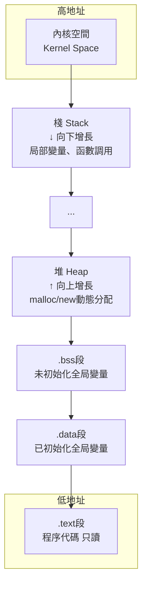
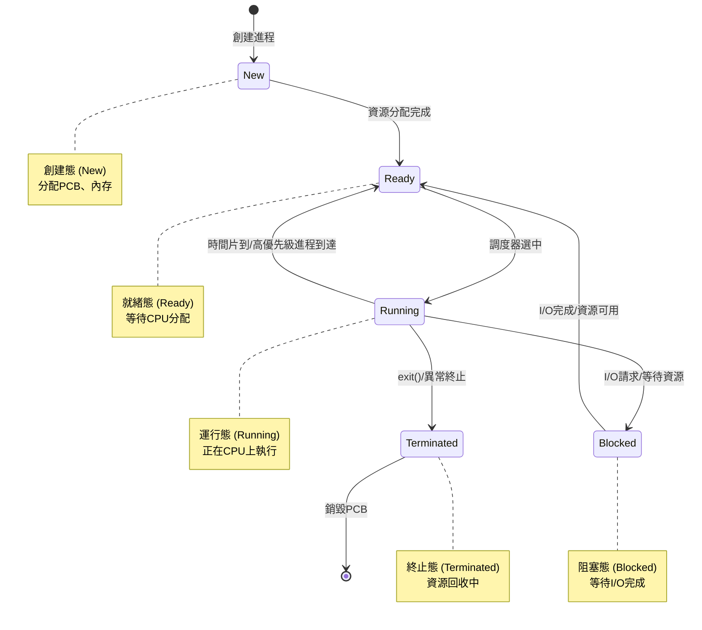
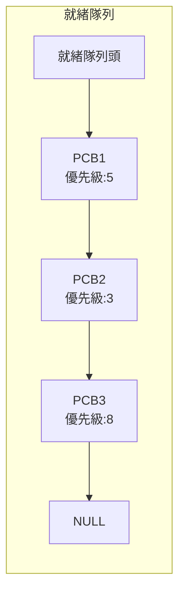
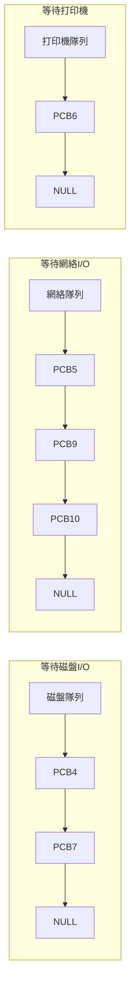
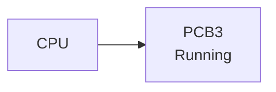
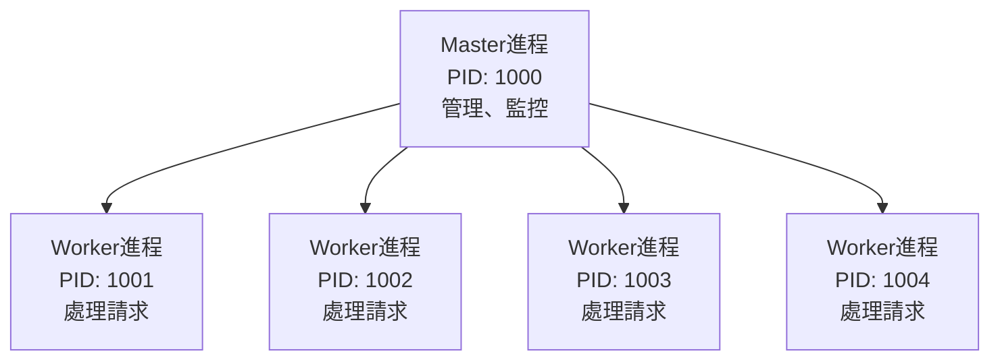

# 01-進程管理 (Process Management)

## 為什麼需要進程？

在沒有操作系統的時代，CPU只能執行單一程序：
1. 從內存中取出指令（PC寄存器指向的地址）
2. 執行指令
3. 重複以上步驟

但這樣有幾個問題：
- **無法同時運行多個程序**：只能等一個程序執行完才能執行下一個
- **CPU利用率低**：程序等待I/O時，CPU閒置
- **資源管理混亂**：每個程序都要自己管理內存、I/O設備

為了解決這些問題，操作系統引入了**進程(Process)**的概念。

---

## 進程是什麼？

### 程序 vs 進程

#### 程序(Program)
- **靜態的**可執行文件，存放在磁盤上
- 只是一堆指令的集合
- 例如：`/usr/bin/nginx`

#### 進程(Process)  
- **動態的**程序執行實例
- 程序在內存中運行時的狀態
- 例如：正在運行的nginx worker進程


### 後端場景理解

當你執行 `./my_server` 時：
1. 操作系統從磁盤讀取可執行文件
2. 分配內存空間
3. 創建進程，開始執行代碼
4. 可以用 `ps aux | grep my_server` 看到這個進程

---

## 進程的組成

一個進程由三個核心部分組成：

### 1. PCB (Process Control Block) - 進程控制塊

PCB是操作系統用來管理進程的**核心數據結構**，存放進程的所有元信息。

#### PCB包含什麼？

**進程描述信息**
- PID (Process ID)：進程唯一標識符
- PPID (Parent Process ID)：父進程ID
- UID (User ID)：進程所屬用戶

**進程管理信息**
- 進程狀態：就緒(Ready)、運行(Running)、阻塞(Blocked)
- CPU使用時間
- 優先級(Priority)

**資源分配清單**
- 分配的內存地址範圍
- 打開的文件描述符(File Descriptor)列表
- 正在使用的I/O設備

**CPU執行上下文**
- PC (Program Counter)：下一條指令地址
- PSW (Program Status Word)：CPU狀態字
- 通用寄存器的值

```mermaid
classDiagram
    class PCB {
        +PID: 1234
        +PPID: 1000
        +UID: 501
        +狀態: Running
        +優先級: 20
        +PC: 0x12345678
        +寄存器: {...}
        +內存範圍: 0x1000-0x5000
        +打開文件: [0,1,2,3,5]
        +CPU使用時間: 1234ms
    }
```

**重要**：PCB是進程存在的**唯一標誌**
- 進程創建 → OS創建PCB
- 進程結束 → OS銷毀PCB

### 2. 程序段 (Text Segment)

存放程序的**可執行代碼**（機器指令）
- 對應編譯後的 `.text` 段
- 通常是**只讀**的，多個進程可以共享

### 3. 數據段 (Data Segment)

存放程序的**數據**
- `.data`：已初始化的全局變量
- `.bss`：未初始化的全局變量
- **堆(Heap)**：動態分配的內存（malloc/new）
- **棧(Stack)**：函數調用棧、局部變量



---

## 進程的狀態與轉換

### 五狀態模型

進程在生命週期中會經歷不同的狀態：



### 狀態詳解

#### 1. 創建態 (New)
- 進程正在被創建
- OS分配PCB、內存等資源
- 初始化PCB

#### 2. 就緒態 (Ready)
- 進程已準備好運行，**等待CPU分配**
- 擁有運行所需的所有資源（除了CPU）
- 存放在**就緒隊列(Ready Queue)**中

#### 3. 運行態 (Running)
- 進程正在CPU上執行
- 在單核CPU上，同一時刻只有一個進程處於運行態
- 多核CPU可以有多個進程同時運行

#### 4. 阻塞態 (Blocked/Waiting)
- 進程等待某個事件發生（通常是I/O操作）
- **主動放棄CPU**
- 存放在**等待隊列(Wait Queue)**中

常見阻塞原因：
- 等待磁盤I/O完成
- 等待網絡數據到達
- 等待用戶輸入
- 等待獲取鎖

#### 5. 終止態 (Terminated)
- 進程執行完成或被強制終止
- 正在進行資源回收、善後處理
- 最終PCB被銷毀

### 狀態轉換觸發條件

| 轉換 | 觸發條件 |
|------|---------|
| New → Ready | 進程創建完成，資源分配成功 |
| Ready → Running | 調度器(Scheduler)選中該進程 |
| Running → Ready | 時間片用完、高優先級進程到達 |
| Running → Blocked | 進程請求I/O、等待資源 |
| Blocked → Ready | I/O完成、資源可用（發出中斷信號） |
| Running → Terminated | 進程調用exit()、異常終止 |

### 後端場景示例

```python
# 一個HTTP服務器處理請求的狀態變化
import socket

server = socket.socket()
server.bind(('0.0.0.0', 8080))
server.listen(5)

while True:
    # Running態：CPU執行代碼
    conn, addr = server.accept()  # ← 無連接時進入Blocked態
                                  #   等待客戶端連接
    
    # I/O完成，中斷觸發 → Blocked → Ready → Running
    
    data = conn.recv(1024)        # ← 可能再次進入Blocked態
                                  #   等待數據到達
    
    # 處理請求 (Running態)
    response = handle_request(data)
    
    conn.send(response)           # ← 可能進入Blocked態
                                  #   等待發送緩衝區可用
    conn.close()
```

---

## 進程的組織方式

操作系統如何管理成千上萬個進程？使用**隊列**。

### 鏈式組織（常用）

#### 就緒隊列 (Ready Queue)
存放所有處於就緒態的進程PCB



#### 阻塞隊列 (Wait Queue)
根據等待事件的不同，分為多個隊列



#### 運行指針
指向當前正在運行的進程PCB



### 索引組織（較少使用）

使用索引表快速查找進程

```
就緒表指針 → [PCB1指針, PCB2指針, PCB3指針, ...]
阻塞表指針 → [PCB4指針, PCB5指針, ...]
```

---

## 進程控制

進程控制就是實現**進程狀態轉換**的操作。

### 為什麼需要原語(Primitive)？

進程狀態轉換涉及**多個操作**，必須**原子性(Atomicity)**執行：
- 要麼全部完成
- 要麼全部不做
- 不能被中斷

例如進程創建：
1. 分配PCB
2. 分配內存
3. 初始化PCB
4. 插入就緒隊列

如果執行到第2步時被中斷，系統會處於不一致狀態。

### 原語的實現：關中斷/開中斷

```c
// 進程控制原語的實現模式
void process_primitive() {
    關中斷();  // 禁止響應中斷信號
    
    // 執行多個操作
    操作1;
    操作2;
    操作3;
    
    開中斷();  // 恢復中斷響應
}
```

**關中斷期間**：
- CPU不檢查外部中斷信號
- 不會發生進程切換
- 保證操作的原子性

### 進程控制原語

#### 1. 創建原語 (fork/create)

**操作步驟**：
1. 申請空白PCB
2. 分配進程所需資源（內存、文件描述符）
3. 初始化PCB（設置PID、狀態等）
4. 將PCB插入就緒隊列

**觸發時機**：
- 用戶登錄系統
- 作業調度（批處理系統）
- 應用程序調用fork/exec創建子進程
- 系統服務需求

**後端示例**：
```c
// Linux下創建進程
pid_t pid = fork();
if (pid == 0) {
    // 子進程
    execve("/usr/bin/worker", args, env);
} else {
    // 父進程
    printf("Created child process: %d\n", pid);
}
```

#### 2. 終止原語 (exit/kill)

**操作步驟**：
1. 從PCB集合中找到終止進程
2. 若進程正在運行，立即剝奪CPU
3. 終止其所有子進程
4. 釋放資源（內存、文件、I/O設備）
5. 刪除PCB

**觸發時機**：
- 進程正常結束（調用exit）
- 進程異常終止（段錯誤、除零錯誤）
- 外界干預（kill命令）

**後端示例**：
```bash
# 查看進程
ps aux | grep nginx
# nginx  1234  0.1  0.5  ...

# 終止進程
kill 1234        # SIGTERM (優雅終止)
kill -9 1234     # SIGKILL (強制終止)
```

#### 3. 阻塞原語 (block/wait)

**操作步驟**：
1. 找到要阻塞的進程PCB
2. **保護進程現場**（保存CPU寄存器到PCB）
3. 將PCB狀態改為Blocked
4. 將PCB插入對應的等待隊列
5. 轉進程調度

**觸發時機**：
- 請求I/O操作
- 等待資源（信號量、鎖）
- 等待子進程結束（waitpid）

**後端示例**：
```python
# Python中的阻塞I/O
file = open('large_file.txt', 'r')
data = file.read()  # ← 進程進入Blocked態
                    #   等待磁盤讀取完成
# 讀取完成後，進程 Blocked → Ready → Running
process_data(data)
```

#### 4. 喚醒原語 (wakeup)

**操作步驟**：
1. 在等待隊列中找到進程PCB
2. 將PCB從等待隊列移除
3. 設置狀態為Ready
4. 將PCB插入就緒隊列

**觸發時機**：
- I/O操作完成（硬件發出中斷）
- 等待的資源可用
- 等待的事件發生

**配對關系**：
- 阻塞和喚醒必須成對出現
- 進程A阻塞等待事件X，當X發生時，OS喚醒進程A

#### 5. 切換原語 (context switch)

**操作步驟**：
1. **保存舊進程上下文**（寄存器值）到PCB
2. 將舊進程PCB插入相應隊列（就緒/阻塞）
3. 選擇新進程執行（調度算法）
4. 更新新進程PCB
5. **恢復新進程上下文**（從PCB加載寄存器值）

**觸發時機**：
- 時間片用完（時鐘中斷）
- 高優先級進程到達
- 當前進程阻塞

**上下文(Context)包括**：
- PC (Program Counter)：下一條指令地址
- PSW (Program Status Word)：CPU狀態
- 通用寄存器（AX, BX, CX...）
- 棧指針(SP)

**進程切換成本**：
```
時間成本：
- 保存/恢復寄存器：幾十個時鐘週期
- 切換頁表：幾百個時鐘週期
- TLB失效：幾千個時鐘週期
- Cache失效：更多時鐘週期

總計：約 1-10 微秒
```

**後端影響**：
- 頻繁切換會降低吞吐量
- 上下文切換是"純開銷"，不產生實際工作
- 這也是為什麼協程(Coroutine)受歡迎：切換成本低

---

## 進程控制三要素總結

所有進程控制原語都在做這三件事：

1. **更新PCB信息**
   - 修改進程狀態
   - 更新資源信息
   - 保存/恢復CPU上下文

2. **調整進程隊列**
   - 插入就緒隊列
   - 移出等待隊列
   - 改變隊列位置

3. **分配/回收資源**（僅創建和終止）
   - 分配內存
   - 打開文件
   - 釋放資源

---

## 後端開發中的進程管理

### 1. 容器與進程隔離

Docker容器本質上是**進程的隔離運行環境**：

```bash
# 啟動容器實際上是創建一個進程
docker run nginx
# 容器內的nginx以PID 1運行

# 在宿主機上可以看到這個進程
ps aux | grep nginx
```

### 2. 多進程架構

**Nginx的Master-Worker模式**：



- Master負責管理、監控
- Worker負責處理請求
- Worker進程崩潰不影響其他Worker

### 3. 進程監控

```bash
# 查看進程狀態
ps aux
# S列：進程狀態
#   R: Running
#   S: Sleeping (可中斷的阻塞)
#   D: Disk sleep (不可中斷的阻塞，通常是I/O)
#   Z: Zombie (殭屍進程)
#   T: Stopped

# 實時監控進程
top
htop

# 查看進程樹
pstree -p
```

### 4. 優雅關閉

```go
// Go語言實現優雅關閉
func main() {
    server := &http.Server{Addr: ":8080"}
    
    // 監聽SIGTERM信號
    sigChan := make(chan os.Signal, 1)
    signal.Notify(sigChan, syscall.SIGTERM, syscall.SIGINT)
    
    go func() {
        <-sigChan
        // 收到終止信號，優雅關閉
        ctx, cancel := context.WithTimeout(context.Background(), 30*time.Second)
        defer cancel()
        server.Shutdown(ctx)  // 等待現有請求處理完
    }()
    
    server.ListenAndServe()
}
```

---

## 關鍵要點

1. **進程是資源分配的基本單位**
   - 每個進程有獨立的地址空間
   - 進程間內存隔離

2. **PCB是進程的靈魂**
   - 進程 = PCB + 代碼 + 數據
   - PCB存在，進程存在

3. **進程狀態轉換由OS控制**
   - 通過原語保證原子性
   - 中斷驅動狀態變化

4. **上下文切換是開銷**
   - 理解這個開銷，才能優化程序設計
   - 這也是線程、協程誕生的原因

5. **後端開發要理解進程**
   - 容器、進程隔離
   - 多進程架構設計
   - 信號處理、優雅關閉
   - 性能調優

---

## 下一章預告

**02-線程與並發同步**將深入探討：
- 為什麼需要線程？
- 線程與進程的關係
- 線程模型（用戶級/內核級）
- 同步機制（鎖、信號量、死鎖）
- 協程基礎
