# 02-線程與並發同步 (Thread & Concurrency Synchronization)

## 為什麼需要線程？

### 進程的局限性

進程雖然解決了多任務問題，但存在以下問題：

**1. 資源開銷大**
```
每個進程需要：
- 獨立的地址空間（幾MB到幾GB）
- 完整的PCB
- 獨立的頁表
- 文件描述符表
```

**2. 進程間通信複雜**
```c
// 進程間通信需要系統調用
int shm_fd = shm_open("/myshm", O_CREAT | O_RDWR, 0666);
void *ptr = mmap(0, SIZE, PROT_WRITE, MAP_SHARED, shm_fd, 0);
```

**3. 創建和切換成本高**
```
進程創建：fork() 需要複製整個地址空間
進程切換：需要切換頁表、刷新TLB、Cache失效
```

### 多核時代的挑戰

當我們想利用多核CPU並行處理同一個任務時：

```
方案1：創建多個進程
問題：
  - 內存浪費（相同代碼被加載多次）
  - 通信困難（需要IPC機制）
  - 開銷巨大

方案2：引入線程 ✓
```

---

## 線程是什麼？

### 核心概念

**線程(Thread)**是進程內部的**獨立執行流**。

```
進程 = 資源容器
線程 = 執行單元

一個進程可以有多個線程
```

### 線程的誕生過程

回顧進程執行：
```
1. CPU的PC寄存器指向main函數第一條指令
2. CPU執行指令
3. PC自動移動到下一條指令
```

線程的創建：
```
把PC指向main以外的其他函數
→ 就創建了一個新的執行流（線程）
```

```c
// 進程執行
int main() {
    do_something();  // ← PC在這裡，單一執行流
    return 0;
}

// 多線程執行
int main() {
    // 主線程：PC在main函數
    pthread_t tid;
    pthread_create(&tid, NULL, worker_func, NULL);  
    // ↑ 創建新線程：PC指向worker_func
    
    // 現在有兩個執行流
    do_something();  // 主線程繼續執行
    pthread_join(tid, NULL);
    return 0;
}

void* worker_func(void* arg) {
    // 工作線程在這裡執行
    do_other_thing();
    return NULL;
}
```

### 視覺化理解

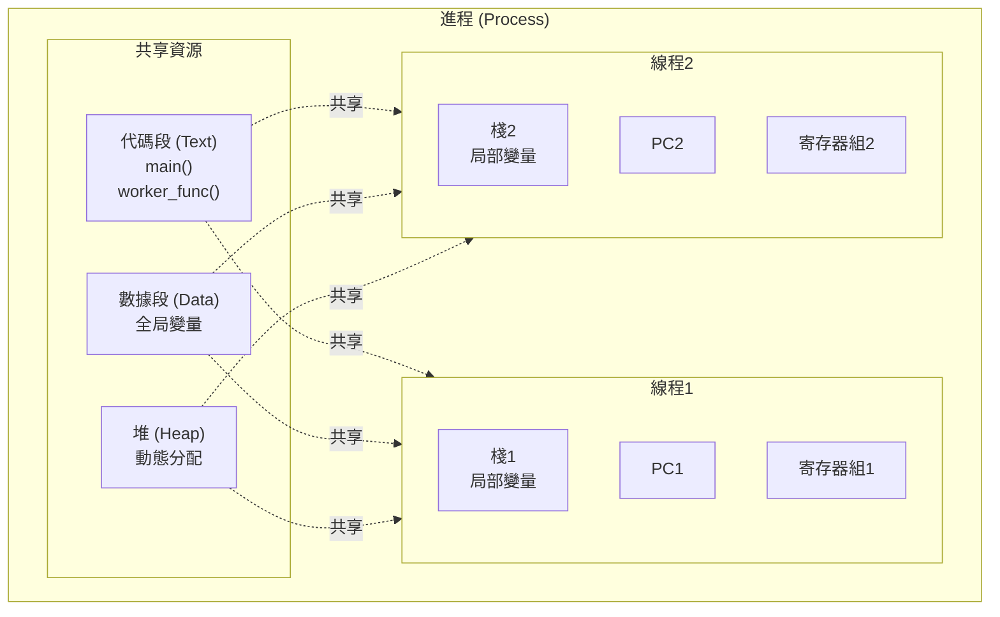

---

## 線程 vs 進程

### 核心區別

| 維度 | 進程 (Process) | 線程 (Thread) |
|------|---------------|--------------|
| **定義** | 資源分配的基本單位 | CPU調度的基本單位 |
| **地址空間** | 獨立 | 共享進程地址空間 |
| **資源擁有** | 擁有完整資源 | 幾乎不擁有資源 |
| **通信** | 需要IPC機制（複雜） | 直接訪問共享內存（簡單但需同步） |
| **創建開銷** | 大（約1-2ms） | 小（約1-10μs） |
| **切換開銷** | 大（需切換地址空間） | 小（同進程內不需切換地址空間） |
| **隔離性** | 強（崩潰不影響其他進程） | 弱（一個線程崩潰可能導致進程終止） |
| **佔用內存** | 約1-4MB（棧+其他） | 約幾百KB到1MB（主要是棧） |

### 線程共享什麼？

**共享資源**（同一進程內的線程）：
- 代碼段 (Text)
- 全局變量 (.data, .bss)
- 堆 (Heap)
- 打開的文件描述符
- 信號處理器
- 進程ID (PID)

**私有資源**（每個線程獨有）：
- 線程ID (TID)
- 程序計數器 (PC)
- 寄存器集合
- 棧 (Stack)
- 棧指針 (SP)
- 錯誤碼 (errno)

### 後端場景理解

```python
# Python多線程示例
import threading

counter = 0  # 全局變量（所有線程共享）

def worker():
    global counter
    local_var = 0  # 局部變量（線程私有，在棧上）
    
    for i in range(100000):
        counter += 1      # 訪問共享數據
        local_var += 1    # 訪問私有數據

# 創建10個線程
threads = []
for i in range(10):
    t = threading.Thread(target=worker)
    threads.append(t)
    t.start()

for t in threads:
    t.join()

print(counter)  # 結果不確定！可能不是1000000
                # 原因：競態條件（Race Condition）
```

---

## 線程的實現方式

### 1. 用戶級線程 (User-Level Thread, ULT)

**由用戶空間的線程庫實現，OS不知道線程的存在。**

#### 工作原理

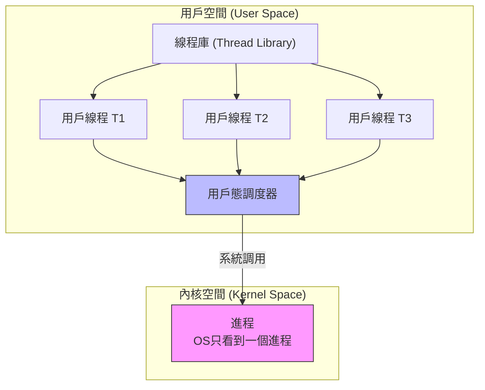

#### 實現示例

```c
// 簡化的用戶級線程實現概念
void thread_library_scheduler() {
    int current = 0;
    while (true) {
        // 輪流執行每個用戶級線程
        run_thread(threads[current]);
        current = (current + 1) % thread_count;
    }
}
```

#### 優點
- 線程切換不需要系統調用（用戶態完成）
- 切換速度快（無需陷入內核）
- 可以在不支持線程的OS上實現

#### 缺點
- **一個線程阻塞，整個進程阻塞**
  ```c
  // 線程1執行
  read(fd, buf, size);  // ← 阻塞式I/O
  // → OS認為整個進程阻塞
  // → 線程2、線程3也無法執行
  ```
  
- **無法利用多核並行**
  - OS只分配一個CPU給進程
  - 所有用戶級線程只能在這一個CPU上輪流執行

### 2. 內核級線程 (Kernel-Level Thread, KLT)

**由操作系統內核實現和管理，OS知道線程的存在。**

#### 工作原理

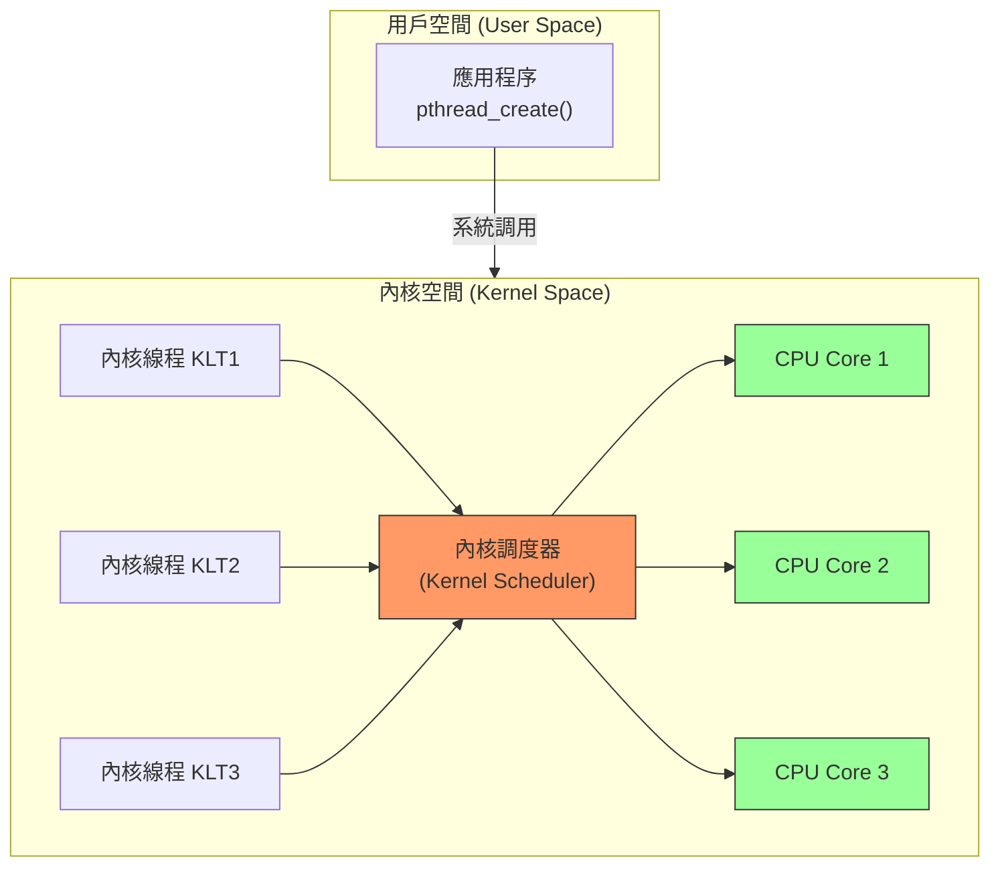

#### 優點
- **一個線程阻塞，其他線程可以繼續執行**
  ```c
  // 線程1
  read(fd, buf, size);  // ← 線程1阻塞
  
  // 線程2、線程3繼續運行
  ```

- **可以利用多核並行**
  - OS可以把不同線程分配到不同CPU核心
  ```
  CPU0: 運行線程1
  CPU1: 運行線程2
  CPU2: 運行線程3
  ```

#### 缺點
- 線程切換需要系統調用（用戶態→內核態）
- 切換開銷較大

#### Linux/Windows實現

**Linux: NPTL (Native POSIX Thread Library)**
```c
#include <pthread.h>

pthread_t tid;
pthread_create(&tid, NULL, thread_func, arg);  // 創建內核級線程
```

**Windows**
```c
#include <windows.h>

HANDLE hThread;
hThread = CreateThread(NULL, 0, ThreadFunc, arg, 0, NULL);
```

---

## 多線程模型

### 1. 一對一模型 (1:1)

**一個用戶線程 ↔ 一個內核線程**

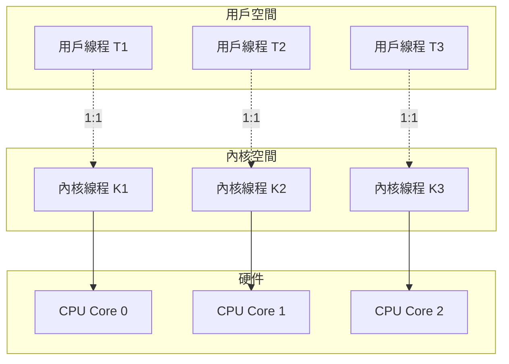

**特點**：
- Linux、Windows默認模型
- 優缺點同內核級線程
- 創建線程上限受內核限制

**使用場景**：
- 大多數通用操作系統
- Java線程、Python線程(CPython除外)

### 2. 多對一模型 (N:1)

**多個用戶線程 ↔ 一個內核線程**

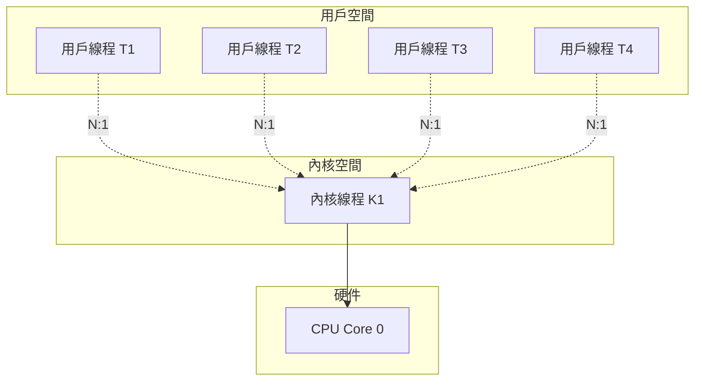

**特點**：
- 優缺點同用戶級線程
- 併發度低

**使用場景**：
- 早期Unix系統
- 現代系統很少使用

### 3. 多對多模型 (M:N)

**多個用戶線程 ↔ 多個內核線程**

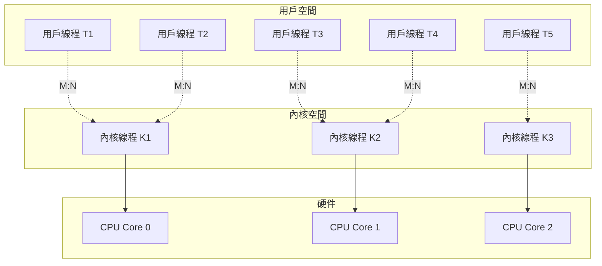

**特點**：
- 平衡了靈活性和性能
- 實現複雜

**使用場景**：
- Go語言的goroutine
- Erlang的進程

### Go的M:N模型詳解

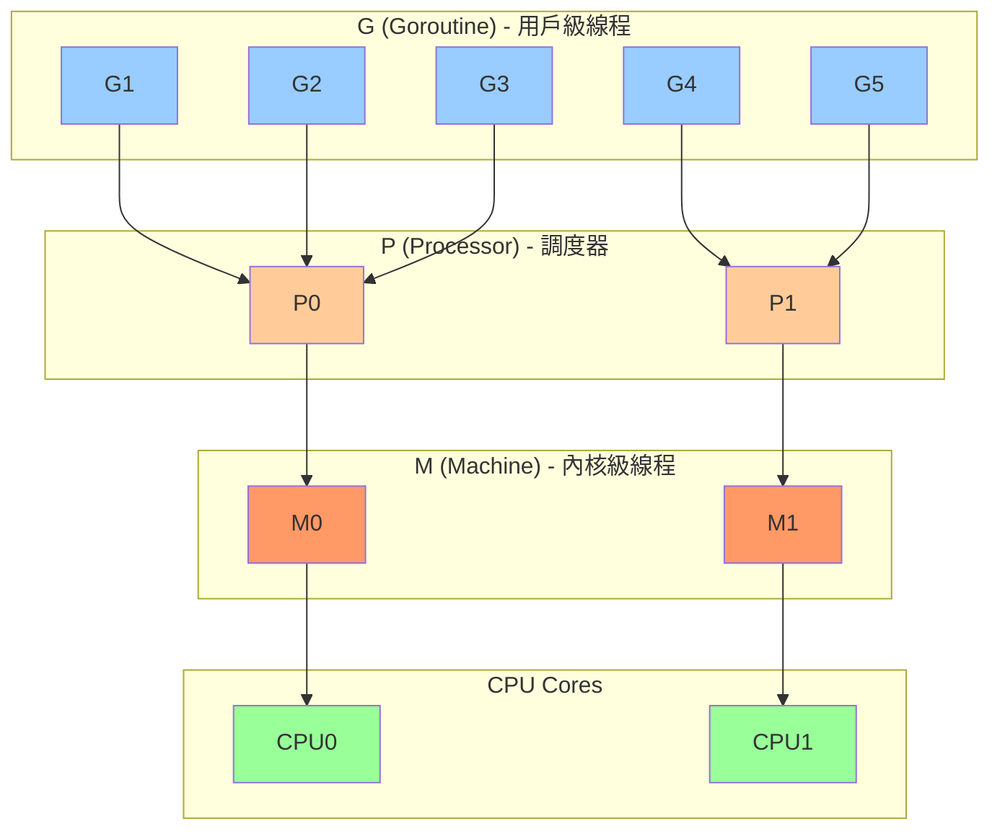

**優勢**：
- 可創建百萬級goroutine（內存佔用小）
- 一個goroutine阻塞不影響其他
- 自動利用多核

```go
// Go語言示例
func main() {
    for i := 0; i < 1000000; i++ {
        go func(id int) {
            // 每個goroutine只佔約2KB內存
            doWork(id)
        }(i)
    }
    time.Sleep(time.Second * 10)
}
```

---

## TCB (Thread Control Block) - 線程控制塊

TCB是操作系統用來管理線程的數據結構。

### TCB內容

| 字段 | 說明 |
|------|------|
| **TID** | 線程ID (Thread ID) |
| **PC** | 程序計數器 (Program Counter) |
| **寄存器** | CPU寄存器的值 |
| **SP** | 棧指針 (Stack Pointer) |
| **狀態** | 運行/就緒/阻塞 |
| **優先級** | 調度優先級 |
| **所屬進程** | 指向PCB的指針 |

### 線程切換需要保存/恢復的上下文

**需要保存**：
- PC (下一條指令地址)
- 通用寄存器
- SP (棧頂位置)
- 其他CPU狀態寄存器

**不需要保存**（同進程內線程切換）：
- 頁表（地址空間相同）
- 文件描述符表
- 全局變量

這就是為什麼**線程切換比進程切換快**！

---

## 並發 vs 並行

### 定義

**並發 (Concurrency)**
- 多個任務在**同一時間段內**交替執行
- 單核CPU通過快速切換實現
- 宏觀並行，微觀串行

**並行 (Parallelism)**
- 多個任務在**同一時刻**真正同時執行
- 需要多核CPU
- 宏觀並行，微觀也並行

### 視覺化對比

**並發 (Concurrency) - 單核CPU**

```mermaid
gantt
    title 並發執行 - 單核CPU (時間片輪轉)
    dateFormat X
    axisFormat %L
    
    section CPU
    T1 :0, 1
    T2 :1, 2
    T1 :2, 3
    T3 :3, 4
    T2 :4, 5
    T1 :5, 6
```

**並行 (Parallelism) - 多核CPU**

```mermaid
gantt
    title 並行執行 - 多核CPU (真正同時)
    dateFormat X
    axisFormat %L
    
    section CPU0
    T1 :0, 6
    
    section CPU1
    T2 :0, 6
    
    section CPU2
    T3 :0, 6
```

### 後端場景

```python
# 並發：適合I/O密集型任務
import threading

def fetch_url(url):
    response = requests.get(url)  # ← 大部分時間在等待網絡
    return response.text

threads = []
for url in urls:
    t = threading.Thread(target=fetch_url, args=(url,))
    threads.append(t)
    t.start()
```

```python
# 並行：適合CPU密集型任務
from multiprocessing import Pool

def compute_heavy_task(data):
    # CPU密集計算
    return expensive_calculation(data)

with Pool(processes=8) as pool:  # 8個進程並行
    results = pool.map(compute_heavy_task, data_list)
```

---

## 並發帶來的問題

### 1. 競態條件 (Race Condition)

多個線程訪問共享數據，結果取決於執行順序。

```c
// 共享變量
int counter = 0;

// 線程1和線程2都執行
void increment() {
    counter++;  // 看似簡單，實際分三步
}
```

**counter++的真實執行**：
```assembly
; counter++的彙編代碼
LOAD  R1, counter    ; 1. 從內存讀取到寄存器
ADD   R1, R1, 1      ; 2. 寄存器加1
STORE counter, R1    ; 3. 寫回內存
```

**競態條件發生**：

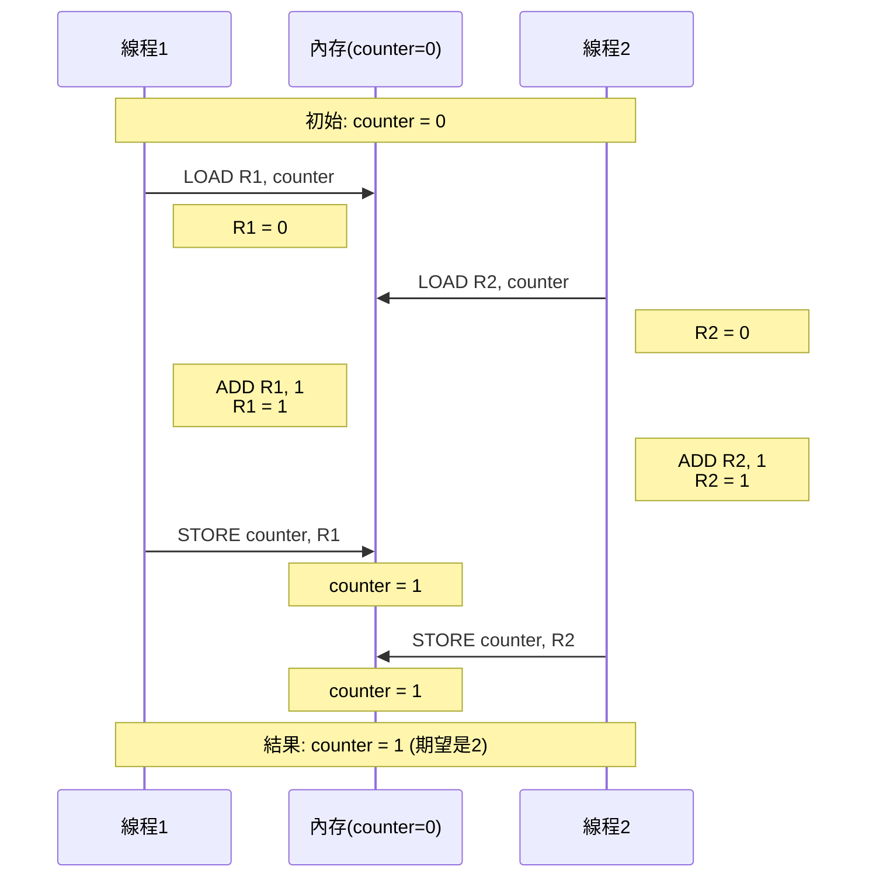

### 2. 數據不一致

多個線程讀寫共享數據，導致數據損壞。

```c
struct BankAccount {
    int balance;
};

// 線程1: 存款
void deposit(struct BankAccount* acc, int amount) {
    int temp = acc->balance;
    temp += amount;
    acc->balance = temp;
}

// 線程2: 取款
void withdraw(struct BankAccount* acc, int amount) {
    int temp = acc->balance;
    temp -= amount;
    acc->balance = temp;
}

// 如果同時執行，balance可能出錯
```

### 3. 原子性問題

一個操作要麼全部完成，要麼全部不做，不能被中斷。

```c
// 非原子操作
x = x + 1;  // 可能被中斷

// 需要原子操作
atomic_inc(&x);
```

---

## 同步機制 (Synchronization Mechanisms)

解決並發問題的工具。

### 1. 互斥鎖 (Mutex - Mutual Exclusion)

**保證同一時刻只有一個線程訪問臨界區。**

#### 基本原理

```c
mutex_t lock;

void critical_section() {
    mutex_lock(&lock);      // 加鎖
    // ─── 臨界區開始 ───
    counter++;
    // ─── 臨界區結束 ───
    mutex_unlock(&lock);    // 解鎖
}
```

#### 工作流程

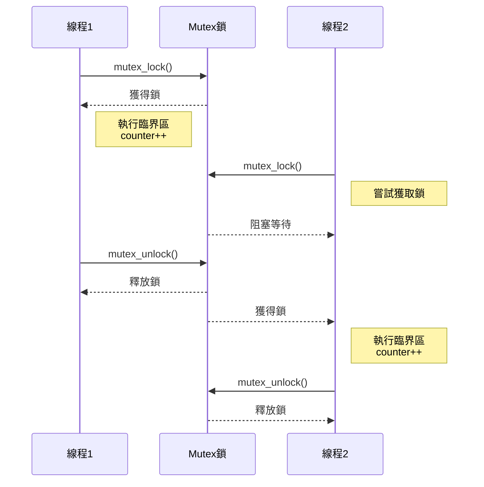

#### 實際使用

**POSIX線程 (pthread)**
```c
#include <pthread.h>

pthread_mutex_t lock = PTHREAD_MUTEX_INITIALIZER;
int counter = 0;

void* thread_func(void* arg) {
    for (int i = 0; i < 100000; i++) {
        pthread_mutex_lock(&lock);
        counter++;
        pthread_mutex_unlock(&lock);
    }
    return NULL;
}
```

**C++ std::mutex**
```cpp
#include <mutex>

std::mutex mtx;
int counter = 0;

void increment() {
    std::lock_guard<std::mutex> lock(mtx);  // RAII自動解鎖
    counter++;
}  // 作用域結束自動unlock
```

**Go語言**
```go
var (
    counter int
    mu      sync.Mutex
)

func increment() {
    mu.Lock()
    counter++
    mu.Unlock()
}
```

#### 性能考慮

```c
// 錯誤：鎖粒度太大
pthread_mutex_lock(&lock);
for (int i = 0; i < 1000000; i++) {
    counter++;
}
pthread_mutex_unlock(&lock);
// 其他線程需要等待很久

// 正確：最小化臨界區
for (int i = 0; i < 1000000; i++) {
    pthread_mutex_lock(&lock);
    counter++;
    pthread_mutex_unlock(&lock);
}
// 但頻繁加鎖也有開銷，需權衡
```

### 2. 自旋鎖 (Spinlock)

**線程不阻塞，而是忙等待(busy-waiting)。**

#### 實現原理

```c
// 簡化的自旋鎖實現
typedef struct {
    int locked;
} spinlock_t;

void spin_lock(spinlock_t* lock) {
    while (__sync_lock_test_and_set(&lock->locked, 1)) {
        // 忙等待，不斷檢查鎖是否釋放
        while (lock->locked) {
            // 空循環，消耗CPU
        }
    }
}

void spin_unlock(spinlock_t* lock) {
    __sync_lock_release(&lock->locked);
}
```

#### Mutex vs Spinlock

| 維度 | Mutex | Spinlock |
|------|-------|----------|
| 等待方式 | 阻塞（線程睡眠） | 忙等待（持續檢查） |
| CPU消耗 | 低（阻塞時不佔CPU） | 高（一直消耗CPU） |
| 上下文切換 | 有 | 無 |
| 適用場景 | 臨界區較大 | 臨界區非常小 |
| 適用場景 | 鎖持有時間長 | 鎖持有時間極短 |

#### 使用場景

```c
// 適合用Spinlock：臨界區極小
spin_lock(&lock);
shared_var = 123;  // 只有一條賦值語句
spin_unlock(&lock);

// 適合用Mutex：臨界區較大
mutex_lock(&lock);
read_from_disk();   // 可能耗時幾毫秒
process_data();
write_to_file();
mutex_unlock(&lock);
```

**Linux內核中的自旋鎖**：
```c
spinlock_t my_lock;
spin_lock(&my_lock);
// 極短的臨界區
spin_unlock(&my_lock);
```

### 3. 信號量 (Semaphore)

**用整數控制多個線程對資源的訪問。**

#### 核心操作

- **P操作 (Wait/Down)**：信號量減1，若小於0則阻塞
- **V操作 (Signal/Up)**：信號量加1，喚醒等待線程

```c
// 信號量定義
typedef struct {
    int value;           // 信號量值
    Queue waiting_list;  // 等待隊列
} semaphore_t;

// P操作（請求資源）
void P(semaphore_t* s) {
    s->value--;
    if (s->value < 0) {
        // 資源不足，阻塞當前線程
        add_to_queue(s->waiting_list, current_thread);
        block();
    }
}

// V操作（釋放資源）
void V(semaphore_t* s) {
    s->value++;
    if (s->value <= 0) {
        // 有線程在等待，喚醒一個
        thread_t* t = remove_from_queue(s->waiting_list);
        wakeup(t);
    }
}
```

#### 二元信號量 (Binary Semaphore)

**value只能是0或1，等同於Mutex**

```c
semaphore_t sem;
sem_init(&sem, 1);  // 初始值為1

// 線程使用
P(&sem);      // 等同於lock
// 臨界區
V(&sem);      // 等同於unlock
```

#### 計數信號量 (Counting Semaphore)

**控制多個資源的訪問**

```c
// 場景：數據庫連接池，最多10個並發連接
semaphore_t pool_sem;
sem_init(&pool_sem, 10);  // 初始值為10

void use_database() {
    P(&pool_sem);         // 獲取一個連接，資源-1
    
    // 使用數據庫連接
    execute_query();
    
    V(&pool_sem);         // 釋放連接，資源+1
}

// 如果10個連接都在使用，第11個線程會阻塞
```

#### 生產者-消費者問題

```c
#define BUFFER_SIZE 10

semaphore_t empty;  // 空槽位數量
semaphore_t full;   // 已填充槽位數量
mutex_t mutex;      // 保護緩衝區

sem_init(&empty, BUFFER_SIZE);  // 初始10個空槽
sem_init(&full, 0);             // 初始0個數據
mutex_init(&mutex);

// 生產者
void producer() {
    while (1) {
        Item item = produce_item();
        
        P(&empty);           // 等待空槽位
        mutex_lock(&mutex);  // 鎖定緩衝區
        
        add_to_buffer(item);
        
        mutex_unlock(&mutex);
        V(&full);            // 增加已填充槽位
    }
}

// 消費者
void consumer() {
    while (1) {
        P(&full);            // 等待有數據
        mutex_lock(&mutex);  // 鎖定緩衝區
        
        Item item = remove_from_buffer();
        
        mutex_unlock(&mutex);
        V(&empty);           // 增加空槽位
        
        consume_item(item);
    }
}
```

### 4. 條件變量 (Condition Variable)

**允許線程等待某個條件成立。**

#### 基本操作

```c
pthread_cond_t cond;
pthread_mutex_t mutex;

// 等待條件
pthread_mutex_lock(&mutex);
while (!condition) {
    pthread_cond_wait(&cond, &mutex);  // 原子地釋放鎖並等待
}
// 條件滿足，重新獲得鎖
do_something();
pthread_mutex_unlock(&mutex);

// 通知條件滿足
pthread_mutex_lock(&mutex);
condition = true;
pthread_cond_signal(&cond);    // 喚醒一個等待線程
// 或 pthread_cond_broadcast(&cond);  // 喚醒所有等待線程
pthread_mutex_unlock(&mutex);
```

#### 為什麼需要配合Mutex？

```c
// 錯誤示範：沒有mutex保護
if (!condition) {
    // ← 如果這時condition變成true？
    cond_wait(&cond);  // 會永久等待！
}

// 正確做法：原子性檢查和等待
mutex_lock(&mutex);
while (!condition) {
    cond_wait(&cond, &mutex);  // 原子地釋放鎖並等待
}
mutex_unlock(&mutex);
```

#### 生產者-消費者(條件變量版本)

```c
#include <pthread.h>

typedef struct {
    int* buffer;
    int size;
    int count;
    int in;
    int out;
    pthread_mutex_t mutex;
    pthread_cond_t not_empty;
    pthread_cond_t not_full;
} BoundedBuffer;

void produce(BoundedBuffer* bb, int item) {
    pthread_mutex_lock(&bb->mutex);
    
    while (bb->count == bb->size) {
        // 緩衝區滿，等待not_full條件
        pthread_cond_wait(&bb->not_full, &bb->mutex);
    }
    
    bb->buffer[bb->in] = item;
    bb->in = (bb->in + 1) % bb->size;
    bb->count++;
    
    pthread_cond_signal(&bb->not_empty);  // 通知消費者
    pthread_mutex_unlock(&bb->mutex);
}

int consume(BoundedBuffer* bb) {
    pthread_mutex_lock(&bb->mutex);
    
    while (bb->count == 0) {
        // 緩衝區空，等待not_empty條件
        pthread_cond_wait(&bb->not_empty, &bb->mutex);
    }
    
    int item = bb->buffer[bb->out];
    bb->out = (bb->out + 1) % bb->size;
    bb->count--;
    
    pthread_cond_signal(&bb->not_full);  // 通知生產者
    pthread_mutex_unlock(&bb->mutex);
    
    return item;
}
```

### 5. 讀寫鎖 (Read-Write Lock)

**允許多個讀者同時讀，但寫者獨占訪問。**

#### 規則

```
1. 多個讀者可以同時持有讀鎖
2. 寫者獨占，不能與任何讀者或寫者共存
3. 讀者優先 或 寫者優先（實現策略）
```

#### 實現

```c
#include <pthread.h>

pthread_rwlock_t rwlock;

// 讀者
void* reader(void* arg) {
    pthread_rwlock_rdlock(&rwlock);  // 獲取讀鎖
    // 讀取共享數據
    read_data();
    pthread_rwlock_unlock(&rwlock);
    return NULL;
}

// 寫者
void* writer(void* arg) {
    pthread_rwlock_wrlock(&rwlock);  // 獲取寫鎖
    // 修改共享數據
    write_data();
    pthread_rwlock_unlock(&rwlock);
    return NULL;
}
```

#### 適用場景

```c
// 場景：緩存系統
// - 讀操作頻繁（95%）
// - 寫操作稀少（5%）

pthread_rwlock_t cache_lock;
HashMap* cache;

// 讀緩存（多個線程可並發執行）
Value get(Key key) {
    pthread_rwlock_rdlock(&cache_lock);
    Value val = hashmap_get(cache, key);
    pthread_rwlock_unlock(&cache_lock);
    return val;
}

// 寫緩存（獨占訪問）
void put(Key key, Value val) {
    pthread_rwlock_wrlock(&cache_lock);
    hashmap_put(cache, key, val);
    pthread_rwlock_unlock(&cache_lock);
}
```

### 同步機制對比

| 機制 | 用途 | 優點 | 缺點 |
|------|------|------|------|
| **Mutex** | 互斥訪問 | 簡單易用 | 可能阻塞 |
| **Spinlock** | 短時間互斥 | 無上下文切換 | 忙等待消耗CPU |
| **Semaphore** | 資源計數 | 靈活 | 容易誤用 |
| **Condition Variable** | 等待條件 | 高效通知機制 | 必須配合Mutex |
| **RWLock** | 讀多寫少 | 讀並發性能高 | 寫者可能饑餓 |

---

## 死鎖 (Deadlock)

### 什麼是死鎖？

**多個線程相互等待對方持有的資源，導致全部阻塞。**

```
線程1持有資源A，等待資源B
線程2持有資源B，等待資源A
→ 兩者永久等待
```

### 經典示例

```c
mutex_t lock_A, lock_B;

// 線程1
void thread1() {
    mutex_lock(&lock_A);     // 持有A
    sleep(1);
    mutex_lock(&lock_B);     // 等待B ← 阻塞
    
    // 臨界區
    
    mutex_unlock(&lock_B);
    mutex_unlock(&lock_A);
}

// 線程2
void thread2() {
    mutex_lock(&lock_B);     // 持有B
    sleep(1);
    mutex_lock(&lock_A);     // 等待A ← 阻塞
    
    // 臨界區
    
    mutex_unlock(&lock_A);
    mutex_unlock(&lock_B);
}

// 執行結果：死鎖
```

### 死鎖的四個必要條件

**同時滿足以下四個條件才會發生死鎖**：

#### 1. 互斥 (Mutual Exclusion)
資源同一時刻只能被一個線程使用

```c
mutex_lock(&lock);  // 只有一個線程能獲得
```

#### 2. 持有並等待 (Hold and Wait)
線程持有至少一個資源，並等待獲取其他資源

```c
mutex_lock(&lock_A);     // 持有A
mutex_lock(&lock_B);     // 等待B
```

#### 3. 不可剝奪 (No Preemption)
資源不能被強制奪走，只能主動釋放

```c
// 不能強制unlock別人的鎖
```

#### 4. 循環等待 (Circular Wait)
存在資源等待環路

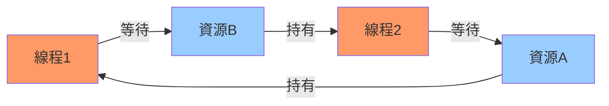

### 死鎖預防

**破壞四個條件之一**

#### 破壞持有並等待

```c
// 方法1：一次性獲取所有資源
global_lock_all();
mutex_lock(&lock_A);
mutex_lock(&lock_B);
global_unlock_all();

// 缺點：降低並發度
```

#### 破壞循環等待（最常用）

**按序獲取資源**

```c
// 規定：總是先鎖A，再鎖B（按地址排序）

void thread1() {
    mutex_lock(&lock_A);  // 先A
    mutex_lock(&lock_B);  // 後B
    // 臨界區
    mutex_unlock(&lock_B);
    mutex_unlock(&lock_A);
}

void thread2() {
    mutex_lock(&lock_A);  // 先A
    mutex_lock(&lock_B);  // 後B
    // 臨界區
    mutex_unlock(&lock_B);
    mutex_unlock(&lock_A);
}

// 不會死鎖！
```

#### 使用trylock

```c
// 嘗試加鎖，失敗則釋放已持有的鎖
void safe_lock() {
    while (1) {
        mutex_lock(&lock_A);
        
        if (mutex_trylock(&lock_B) == 0) {
            // 成功獲取lock_B
            // 臨界區
            mutex_unlock(&lock_B);
            mutex_unlock(&lock_A);
            break;
        } else {
            // 獲取lock_B失敗，釋放lock_A重試
            mutex_unlock(&lock_A);
            usleep(rand() % 100);  // 隨機退避
        }
    }
}
```

### 死鎖檢測

**運行時檢測資源分配圖是否有環**

```python
# Python示例：簡化的死鎖檢測
class DeadlockDetector:
    def __init__(self):
        self.wait_graph = {}  # 等待圖：thread → 等待的resource
        
    def request_lock(self, thread, resource):
        self.wait_graph[thread] = resource
        if self.has_cycle():
            raise DeadlockError("Deadlock detected!")
    
    def has_cycle(self):
        # DFS檢測環
        # ...
```

### 後端開發中的死鎖

#### 數據庫死鎖

```sql
-- 事務1
BEGIN;
UPDATE accounts SET balance = balance - 100 WHERE id = 1;  -- 鎖住id=1
UPDATE accounts SET balance = balance + 100 WHERE id = 2;  -- 等待id=2
COMMIT;

-- 事務2
BEGIN;
UPDATE accounts SET balance = balance - 50 WHERE id = 2;   -- 鎖住id=2
UPDATE accounts SET balance = balance + 50 WHERE id = 1;   -- 等待id=1
COMMIT;

-- 死鎖！
```

**解決方案**：
```sql
-- 按ID順序更新
BEGIN;
UPDATE accounts SET balance = balance - 100 WHERE id = 1;  -- 先id=1
UPDATE accounts SET balance = balance + 100 WHERE id = 2;  -- 後id=2
COMMIT;
```

#### 分布式鎖死鎖

```python
# 使用Redis分布式鎖
def transfer(from_id, to_id, amount):
    # 錯誤：可能死鎖
    lock_from = redis.lock(f"account:{from_id}")
    lock_to = redis.lock(f"account:{to_id}")
    
    with lock_from:
        with lock_to:
            # 轉賬邏輯
            pass

# 正確：按ID排序加鎖
def transfer_safe(from_id, to_id, amount):
    id1, id2 = sorted([from_id, to_id])
    lock1 = redis.lock(f"account:{id1}")
    lock2 = redis.lock(f"account:{id2}")
    
    with lock1:
        with lock2:
            # 轉賬邏輯
            pass
```

---

## 協程 (Coroutine) 基礎

### 協程是什麼？

**用戶態的輕量級線程，可以主動讓出執行權。**

### 協程 vs 函數

```python
# 普通函數
def func():
    print("a")
    return        # ← 返回後，棧幀銷毀
    print("b")    # 永遠不會執行

# 協程
def coroutine():
    print("a")
    yield         # ← 暫停，保存狀態
    print("b")    # 可以恢復執行
    yield
    print("c")
```

### 協程的特性

```python
# Python協程示例
def my_coroutine():
    print("Step 1")
    x = yield 10      # 暫停並返回10，接收外部傳入的值
    print(f"Received: {x}")
    y = yield 20
    print(f"Received: {y}")

# 使用協程
coro = my_coroutine()
value1 = next(coro)           # 輸出: Step 1, 返回10
value2 = coro.send("hello")   # 輸出: Received: hello, 返回20
coro.send("world")            # 輸出: Received: world

# 輸出：
# Step 1
# Received: hello
# Received: world
```

### 協程的實現原理

**協程需要保存上下文，存放在堆上而非棧上**

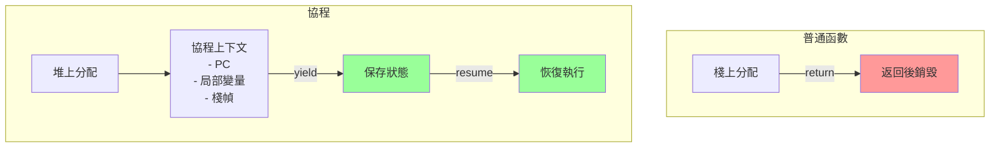

### 協程 vs 線程

| 維度 | 線程 | 協程 |
|------|------|------|
| 調度者 | OS內核 | 用戶程序 |
| 切換開銷 | 大（1-10μs） | 小（<0.1μs） |
| 內存佔用 | 約1MB | 約2-8KB |
| 數量上限 | 幾千 | 幾萬到幾百萬 |
| 搶占式 | 是（時間片） | 否（主動讓出） |
| 利用多核 | 是 | 否（需配合線程池） |

### 後端場景：協程處理高並發

```python
# Python asyncio協程
import asyncio

async def handle_request(request_id):
    print(f"Handling {request_id}")
    await asyncio.sleep(1)  # 模擬I/O，讓出執行權
    print(f"Completed {request_id}")
    return f"Response {request_id}"

async def main():
    # 創建10000個協程
    tasks = [handle_request(i) for i in range(10000)]
    results = await asyncio.gather(*tasks)

# 單線程處理10000個並發請求
asyncio.run(main())
```

```go
// Go語言goroutine
func handleRequest(id int) {
    fmt.Printf("Handling %d\n", id)
    time.Sleep(1 * time.Second)
    fmt.Printf("Completed %d\n", id)
}

func main() {
    for i := 0; i < 100000; i++ {
        go handleRequest(i)  // 創建10萬個goroutine
    }
    time.Sleep(10 * time.Second)
}
```

---

## 關鍵要點

1. **線程是調度的基本單位**
   - 進程 = 資源容器
   - 線程 = 執行單元

2. **理解線程實現方式**
   - 用戶級線程：OS不可見，無法利用多核
   - 內核級線程：OS調度，可並行
   - M:N模型：兼具靈活性和性能（Go、Erlang）

3. **並發必須同步**
   - 競態條件是並發編程的核心問題
   - 選擇合適的同步機制（Mutex、Semaphore、RWLock）
   - 理解性能權衡（Mutex vs Spinlock）

4. **避免死鎖**
   - 按序加鎖是最實用的預防方法
   - 數據庫、分布式鎖都可能死鎖

5. **協程是趨勢**
   - 輕量級、低開銷
   - 適合I/O密集型高並發場景
   - 現代語言普遍支持（Go、Python、Rust、JavaScript）

---

## 下一章預告

**03-進程間通信(IPC)**將探討：
- 共享內存 (Shared Memory)
- 消息隊列 (Message Queue)
- 管道 (Pipe) 與命名管道 (FIFO)
- Unix Domain Socket
- 後端微服務通信場景
