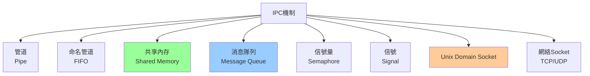
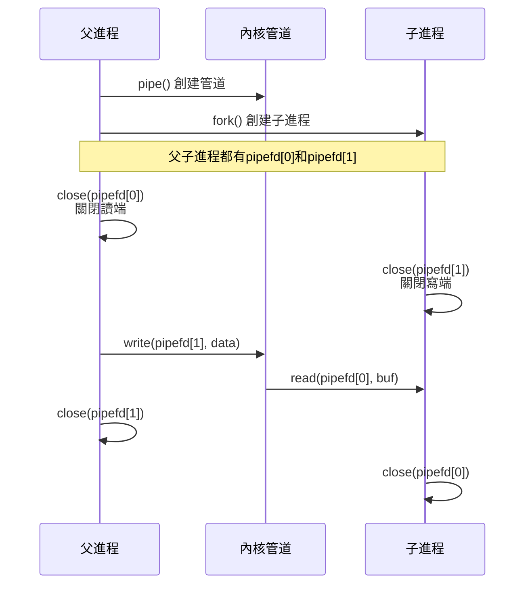
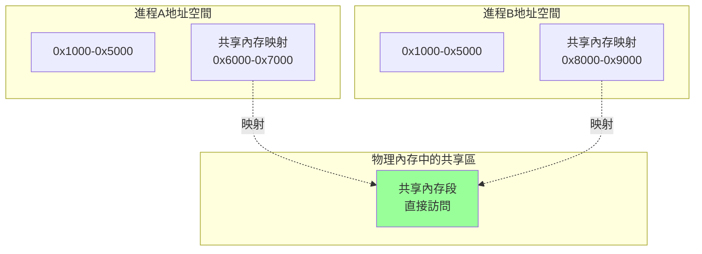
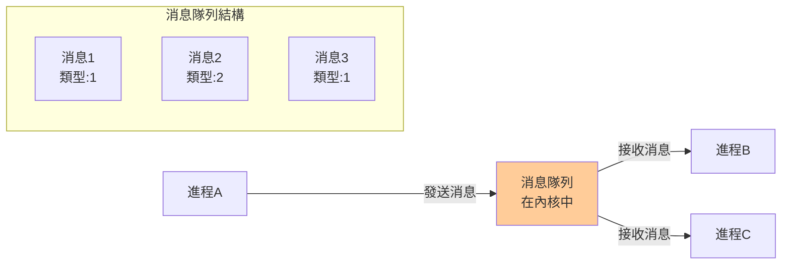
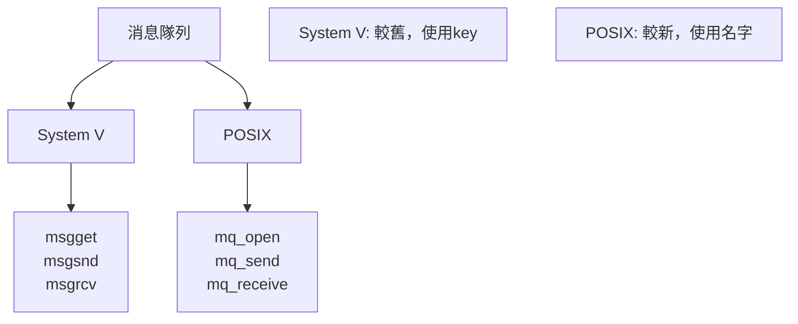
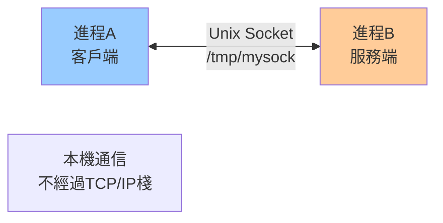
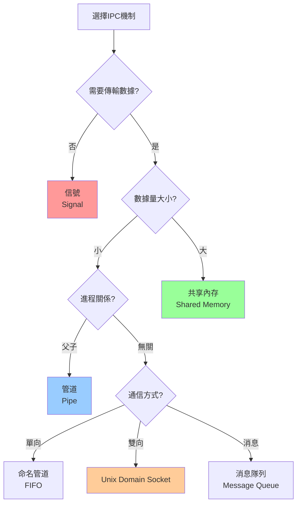
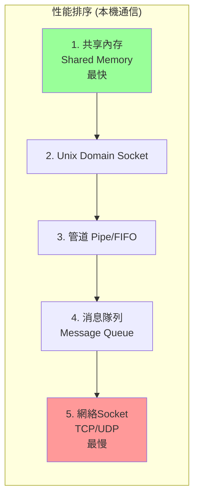

# 03-進程間通信 (IPC - Inter-Process Communication)

## 為什麼需要IPC？

### 進程隔離的問題

我們知道每個進程都有**獨立的地址空間**：

```mermaid
graph TB
    subgraph Process1["進程1"]
        Mem1["地址空間<br/>0x1000-0x5000"]
    end
    
    subgraph Process2["進程2"]
        Mem2["地址空間<br/>0x1000-0x5000"]
    end
    
    Mem1 -.x.-> Mem2
    
    note1["無法直接訪問"]
```

**優點**：
- 安全性：進程A崩潰不影響進程B
- 隔離性：惡意程序無法讀取其他進程數據

**缺點**：
- 進程間無法直接通信
- 協作變得困難

### 實際需求

**後端開發中的典型場景**：

1. **微服務架構**
   - 用戶服務需要調用訂單服務
   - 訂單服務需要調用支付服務

2. **父子進程協作**
   - Nginx Master 管理 Worker 進程
   - Shell 啟動子進程並獲取結果

3. **分布式系統**
   - 多個進程處理同一個任務
   - 需要共享數據或協調工作

---

## IPC機制概覽

Linux提供多種IPC機制：



| 機制 | 數據傳輸方式 | 適用場景 | 性能 |
|------|------------|---------|------|
| **Pipe** | 數據流 | 父子進程、單向 | 高 |
| **FIFO** | 數據流 | 無親緣關係、單向 | 高 |
| **Shared Memory** | 直接訪問內存 | 大量數據交換 | 最高 |
| **Message Queue** | 消息 | 異步通信 | 中 |
| **Semaphore** | 不傳數據（同步） | 進程同步 | - |
| **Signal** | 異步通知 | 事件通知 | 高 |
| **Unix Domain Socket** | 字節流/數據報 | 本機進程、雙向 | 高 |
| **網絡Socket** | 字節流/數據報 | 跨機器通信 | 低 |

---

## 1. 管道 (Pipe)

### 什麼是管道？

**管道是一個固定大小的內核緩衝區，提供單向數據流。**


### 特性

1. **半雙工通信**：數據只能單向流動
2. **FIFO**：先進先出
3. **固定大小**：通常4KB或64KB
4. **只能用於有親緣關係的進程**（父子、兄弟）

### 創建管道

```c
#include <unistd.h>

int pipefd[2];  // pipefd[0]:讀端, pipefd[1]:寫端
int ret = pipe(pipefd);

if (ret == 0) {
    // pipefd[0] 用於讀
    // pipefd[1] 用於寫
}
```

### 使用示例

```c
#include <stdio.h>
#include <unistd.h>
#include <string.h>

int main() {
    int pipefd[2];
    pid_t pid;
    char buf[100];
    
    // 創建管道
    if (pipe(pipefd) == -1) {
        perror("pipe");
        return 1;
    }
    
    // 創建子進程
    pid = fork();
    
    if (pid == 0) {
        // 子進程：讀取數據
        close(pipefd[1]);  // 關閉寫端
        
        ssize_t n = read(pipefd[0], buf, sizeof(buf));
        printf("Child received: %s\n", buf);
        
        close(pipefd[0]);
    } else {
        // 父進程：寫入數據
        close(pipefd[0]);  // 關閉讀端
        
        const char* msg = "Hello from parent!";
        write(pipefd[1], msg, strlen(msg) + 1);
        
        close(pipefd[1]);
        wait(NULL);  // 等待子進程結束
    }
    
    return 0;
}
```

### 工作流程



### 管道的阻塞行為

```c
// 1. 讀空管道
char buf[100];
read(pipefd[0], buf, 100);  
// ← 如果管道為空，read會阻塞
// ← 直到有數據寫入或寫端關閉

// 2. 寫滿管道
char data[100000];
write(pipefd[1], data, 100000);  
// ← 如果管道已滿，write會阻塞
// ← 直到讀端讀走一些數據

// 3. 寫端關閉
// 讀端read()返回0（EOF）

// 4. 讀端關閉
// 寫端write()觸發SIGPIPE信號，進程終止
```

### 後端應用場景

**Shell管道**：
```bash
# ls的輸出通過管道傳給grep
ls -l | grep ".md"

# 等價於
進程1(ls) → 管道 → 進程2(grep)
```

**C語言實現Shell管道**：
```c
// 實現 "ls -l | wc -l"
int pipefd[2];
pipe(pipefd);

if (fork() == 0) {
    // 子進程1：執行ls
    close(pipefd[0]);                // 關閉讀端
    dup2(pipefd[1], STDOUT_FILENO);  // 重定向stdout到管道
    close(pipefd[1]);
    execlp("ls", "ls", "-l", NULL);
} 

if (fork() == 0) {
    // 子進程2：執行wc
    close(pipefd[1]);                // 關閉寫端
    dup2(pipefd[0], STDIN_FILENO);   // 重定向stdin從管道讀
    close(pipefd[0]);
    execlp("wc", "wc", "-l", NULL);
}

// 父進程
close(pipefd[0]);
close(pipefd[1]);
wait(NULL);
wait(NULL);
```

---

## 2. 命名管道 (FIFO - Named Pipe)

### 什麼是FIFO？

**FIFO是有名字的管道，可以用於無親緣關係的進程通信。**

```mermaid
graph LR
    P1[進程A] -->|write| FIFO[/tmp/myfifo<br/>命名管道文件]
    FIFO -->|read| P2[進程B]
    
    note1["進程A和B無需親緣關係"]
    
    style FIFO fill:#9cf
```

### 創建FIFO

```bash
# 命令行創建
mkfifo /tmp/myfifo

# 查看
ls -l /tmp/myfifo
prw-r--r-- 1 user group 0 Nov 10 10:00 /tmp/myfifo
# p: pipe類型
```

```c
// C語言創建
#include <sys/types.h>
#include <sys/stat.h>

int ret = mkfifo("/tmp/myfifo", 0666);
```

### 使用示例

**寫進程**：
```c
#include <fcntl.h>
#include <unistd.h>
#include <string.h>

int main() {
    int fd = open("/tmp/myfifo", O_WRONLY);  // 打開FIFO寫入
    
    const char* msg = "Hello from writer!";
    write(fd, msg, strlen(msg) + 1);
    
    close(fd);
    return 0;
}
```

**讀進程**：
```c
#include <fcntl.h>
#include <unistd.h>
#include <stdio.h>

int main() {
    char buf[100];
    int fd = open("/tmp/myfifo", O_RDONLY);  // 打開FIFO讀取
    
    ssize_t n = read(fd, buf, sizeof(buf));
    printf("Received: %s\n", buf);
    
    close(fd);
    unlink("/tmp/myfifo");  // 刪除FIFO文件
    return 0;
}
```

### Pipe vs FIFO

| 維度 | Pipe | FIFO |
|------|------|------|
| 是否有文件名 | 無 | 有（/tmp/myfifo） |
| 進程關係 | 必須有親緣關係 | 無需親緣關係 |
| 生命週期 | 進程結束自動消失 | 需手動刪除 |
| 使用方式 | pipe() | mkfifo() + open() |

---

## 3. 共享內存 (Shared Memory)

### 什麼是共享內存？

**OS在內存中開闢一塊區域，多個進程都可以映射到各自的地址空間並直接訪問。**



### 特點

- **最快的IPC方式**：直接內存訪問，無需數據拷貝
- **需要同步**：多進程訪問需用信號量或互斥鎖保護
- **持久化**：進程結束後共享內存仍存在（需手動刪除）

### POSIX共享內存API

```c
#include <sys/mman.h>
#include <fcntl.h>

// 1. 創建/打開共享內存
int shm_fd = shm_open("/myshm", O_CREAT | O_RDWR, 0666);

// 2. 設置大小
ftruncate(shm_fd, 4096);

// 3. 映射到進程地址空間
void* ptr = mmap(NULL, 4096, 
                 PROT_READ | PROT_WRITE,
                 MAP_SHARED, 
                 shm_fd, 0);

// 4. 使用共享內存
strcpy((char*)ptr, "Hello Shared Memory!");

// 5. 解除映射
munmap(ptr, 4096);

// 6. 刪除共享內存
shm_unlink("/myshm");
```

### 完整示例

**寫進程**：
```c
#include <stdio.h>
#include <stdlib.h>
#include <string.h>
#include <fcntl.h>
#include <sys/mman.h>
#include <unistd.h>

int main() {
    const char* name = "/myshm";
    const int SIZE = 4096;
    
    // 創建共享內存
    int shm_fd = shm_open(name, O_CREAT | O_RDWR, 0666);
    ftruncate(shm_fd, SIZE);
    
    // 映射到地址空間
    void* ptr = mmap(0, SIZE, PROT_WRITE, MAP_SHARED, shm_fd, 0);
    
    // 寫入數據
    sprintf((char*)ptr, "Hello from writer process!");
    printf("Writer: Data written to shared memory\n");
    
    // 不解除映射，保持共享內存
    return 0;
}
```

**讀進程**：
```c
#include <stdio.h>
#include <stdlib.h>
#include <fcntl.h>
#include <sys/mman.h>
#include <unistd.h>

int main() {
    const char* name = "/myshm";
    const int SIZE = 4096;
    
    // 打開共享內存
    int shm_fd = shm_open(name, O_RDONLY, 0666);
    
    // 映射到地址空間
    void* ptr = mmap(0, SIZE, PROT_READ, MAP_SHARED, shm_fd, 0);
    
    // 讀取數據
    printf("Reader: %s\n", (char*)ptr);
    
    // 清理
    munmap(ptr, SIZE);
    shm_unlink(name);  // 刪除共享內存
    
    return 0;
}
```

### 共享內存 + 信號量同步

```c
// 使用信號量保護共享內存
#include <semaphore.h>

sem_t* sem = sem_open("/mysem", O_CREAT, 0666, 1);

// 寫入前加鎖
sem_wait(sem);
sprintf((char*)ptr, "Protected data");
sem_post(sem);

// 讀取前加鎖
sem_wait(sem);
printf("%s\n", (char*)ptr);
sem_post(sem);
```

### 後端應用場景

**1. 高性能數據共享**：
- Nginx多個Worker共享配置
- Redis父子進程共享數據結構

**2. 緩存系統**：
```c
// 多進程共享緩存
struct Cache {
    char keys[1000][64];
    char values[1000][256];
    int count;
};

void* shm_ptr = create_shared_memory(sizeof(struct Cache));
struct Cache* cache = (struct Cache*)shm_ptr;

// 進程A寫入
cache->count = 10;

// 進程B讀取
printf("Cache count: %d\n", cache->count);
```

---

## 4. 消息隊列 (Message Queue)

### 什麼是消息隊列?

**內核維護的消息鏈表，進程可以發送/接收消息。**



### 特點

- **消息有類型**：可以選擇性接收特定類型的消息
- **FIFO**（同類型消息）：按發送順序接收
- **異步通信**：發送者無需等待接收者
- **持久化**：進程結束後隊列仍存在

### POSIX消息隊列API

```c
#include <mqueue.h>

// 1. 創建/打開消息隊列
struct mq_attr attr;
attr.mq_flags = 0;
attr.mq_maxmsg = 10;     // 最多10條消息
attr.mq_msgsize = 256;   // 每條消息最大256字節

mqd_t mq = mq_open("/mymq", O_CREAT | O_RDWR, 0666, &attr);

// 2. 發送消息
const char* msg = "Hello MQ!";
mq_send(mq, msg, strlen(msg) + 1, 0);  // 優先級0

// 3. 接收消息
char buf[256];
unsigned int prio;
ssize_t n = mq_receive(mq, buf, 256, &prio);

// 4. 關閉和刪除
mq_close(mq);
mq_unlink("/mymq");
```

### 完整示例

**發送進程**：
```c
#include <mqueue.h>
#include <stdio.h>
#include <string.h>

int main() {
    mqd_t mq;
    struct mq_attr attr;
    
    attr.mq_flags = 0;
    attr.mq_maxmsg = 10;
    attr.mq_msgsize = 256;
    
    mq = mq_open("/mymq", O_CREAT | O_WRONLY, 0666, &attr);
    
    const char* messages[] = {
        "Message 1",
        "Message 2",
        "Message 3"
    };
    
    for (int i = 0; i < 3; i++) {
        mq_send(mq, messages[i], strlen(messages[i]) + 1, 0);
        printf("Sent: %s\n", messages[i]);
    }
    
    mq_close(mq);
    return 0;
}
```

**接收進程**：
```c
#include <mqueue.h>
#include <stdio.h>

int main() {
    mqd_t mq;
    char buf[256];
    
    mq = mq_open("/mymq", O_RDONLY);
    
    while (1) {
        ssize_t n = mq_receive(mq, buf, 256, NULL);
        if (n > 0) {
            printf("Received: %s\n", buf);
        } else {
            break;
        }
    }
    
    mq_close(mq);
    mq_unlink("/mymq");
    return 0;
}
```

### System V vs POSIX



### 後端應用場景

**任務隊列**：
```python
# Python示例（概念）
# 生產者：Web服務器
def handle_upload(file):
    # 上傳文件後發送消息到隊列
    mq.send({
        'type': 'process_image',
        'file_path': file.path,
        'user_id': user.id
    })

# 消費者：後台Worker
while True:
    msg = mq.receive()
    if msg['type'] == 'process_image':
        process_image(msg['file_path'])
        notify_user(msg['user_id'])
```

---

## 5. Unix Domain Socket

### 什麼是Unix Domain Socket？

**本機進程間的Socket通信，不經過網絡協議棧。**



### 特點

- **雙向通信**：全雙工
- **面向連接**（SOCK_STREAM）或無連接（SOCK_DGRAM）
- **高性能**：比網絡Socket快（無需協議棧處理）
- **與網絡Socket API相同**：易於遷移

### 使用示例

**服務端**：
```c
#include <sys/socket.h>
#include <sys/un.h>
#include <stdio.h>
#include <unistd.h>

int main() {
    int server_fd, client_fd;
    struct sockaddr_un addr;
    char buf[100];
    
    // 1. 創建Socket
    server_fd = socket(AF_UNIX, SOCK_STREAM, 0);
    
    // 2. 綁定地址
    memset(&addr, 0, sizeof(addr));
    addr.sun_family = AF_UNIX;
    strcpy(addr.sun_path, "/tmp/mysock");
    unlink("/tmp/mysock");  // 刪除舊文件
    
    bind(server_fd, (struct sockaddr*)&addr, sizeof(addr));
    
    // 3. 監聽
    listen(server_fd, 5);
    printf("Server listening on /tmp/mysock\n");
    
    // 4. 接受連接
    client_fd = accept(server_fd, NULL, NULL);
    
    // 5. 接收數據
    ssize_t n = read(client_fd, buf, sizeof(buf));
    printf("Received: %s\n", buf);
    
    // 6. 發送響應
    write(client_fd, "ACK", 4);
    
    close(client_fd);
    close(server_fd);
    unlink("/tmp/mysock");
    
    return 0;
}
```

**客戶端**：
```c
#include <sys/socket.h>
#include <sys/un.h>
#include <stdio.h>
#include <string.h>

int main() {
    int sock_fd;
    struct sockaddr_un addr;
    char buf[100];
    
    // 1. 創建Socket
    sock_fd = socket(AF_UNIX, SOCK_STREAM, 0);
    
    // 2. 連接服務器
    memset(&addr, 0, sizeof(addr));
    addr.sun_family = AF_UNIX;
    strcpy(addr.sun_path, "/tmp/mysock");
    
    connect(sock_fd, (struct sockaddr*)&addr, sizeof(addr));
    
    // 3. 發送數據
    write(sock_fd, "Hello Server!", 14);
    
    // 4. 接收響應
    read(sock_fd, buf, sizeof(buf));
    printf("Server replied: %s\n", buf);
    
    close(sock_fd);
    return 0;
}
```

### 後端應用場景

**Docker守護進程通信**：
```bash
# Docker CLI通過Unix Socket與Docker Daemon通信
/var/run/docker.sock
```

**數據庫連接**：
```python
# MySQL通過Unix Socket連接（比TCP快）
import mysql.connector

conn = mysql.connector.connect(
    unix_socket='/var/run/mysqld/mysqld.sock',
    user='root',
    database='mydb'
)
```

**Redis本機連接**：
```python
import redis

# Unix Socket連接（更快）
r = redis.Redis(unix_socket_path='/tmp/redis.sock')

# vs TCP連接
r = redis.Redis(host='localhost', port=6379)
```

---

## 6. 信號 (Signal)

### 什麼是信號？

**異步通知機制，用於通知進程某個事件發生。**


### 常見信號

| 信號 | 值 | 默認動作 | 說明 |
|------|----|---------| -----|
| SIGINT | 2 | 終止 | Ctrl+C |
| SIGKILL | 9 | 終止 | 強制殺死（無法捕獲） |
| SIGTERM | 15 | 終止 | 正常終止請求 |
| SIGSEGV | 11 | 核心轉儲 | 段錯誤 |
| SIGCHLD | 17 | 忽略 | 子進程狀態改變 |
| SIGUSR1 | 10 | 終止 | 用戶自定義信號1 |
| SIGUSR2 | 12 | 終止 | 用戶自定義信號2 |
| SIGPIPE | 13 | 終止 | 管道破裂 |

### 發送信號

```c
#include <signal.h>
#include <sys/types.h>

// 1. 向指定進程發送信號
kill(pid, SIGTERM);

// 2. 向當前進程發送信號
raise(SIGUSR1);

// 3. 向進程組發送信號
killpg(pgid, SIGINT);
```

```bash
# Shell命令發送信號
kill -15 1234      # SIGTERM
kill -9 1234       # SIGKILL
kill -USR1 1234    # SIGUSR1
```

### 捕獲信號

```c
#include <signal.h>
#include <stdio.h>
#include <unistd.h>

// 信號處理函數
void signal_handler(int signum) {
    printf("Received signal %d\n", signum);
    
    if (signum == SIGTERM) {
        printf("Graceful shutdown...\n");
        // 清理資源
        exit(0);
    }
}

int main() {
    // 註冊信號處理器
    signal(SIGTERM, signal_handler);
    signal(SIGUSR1, signal_handler);
    
    printf("Process PID: %d\n", getpid());
    printf("Waiting for signals...\n");
    
    while (1) {
        sleep(1);
    }
    
    return 0;
}
```

### sigaction（推薦）

```c
#include <signal.h>

void signal_handler(int signum, siginfo_t* info, void* context) {
    printf("Signal %d from PID %d\n", signum, info->si_pid);
}

int main() {
    struct sigaction sa;
    
    sa.sa_sigaction = signal_handler;
    sa.sa_flags = SA_SIGINFO;  // 使用sa_sigaction而非sa_handler
    sigemptyset(&sa.sa_mask);
    
    sigaction(SIGUSR1, &sa, NULL);
    
    pause();  // 等待信號
    return 0;
}
```

### 後端應用場景

**優雅關閉服務器**：
```go
// Go語言示例
package main

import (
    "fmt"
    "os"
    "os/signal"
    "syscall"
)

func main() {
    sigChan := make(chan os.Signal, 1)
    signal.Notify(sigChan, syscall.SIGTERM, syscall.SIGINT)
    
    // 主服務邏輯
    go runServer()
    
    // 等待信號
    sig := <-sigChan
    fmt.Printf("Received signal: %v\n", sig)
    
    // 優雅關閉
    shutdown()
}
```

**重新加載配置**：
```python
# Python示例
import signal
import sys

def reload_config(signum, frame):
    print("Reloading config...")
    load_config_from_file()

signal.signal(signal.SIGUSR1, reload_config)

# 運行中發送信號重載配置
# kill -USR1 <pid>
```

**Nginx信號控制**：
```bash
# 優雅關閉
kill -QUIT <nginx_pid>

# 快速關閉
kill -TERM <nginx_pid>

# 重新加載配置
kill -HUP <nginx_pid>
```

---

## IPC機制選擇指南



### 性能對比



### 決策表

| 需求 | 推薦機制 | 原因 |
|------|---------|------|
| **大量數據交換** | Shared Memory | 零拷貝，最快 |
| **簡單父子通信** | Pipe | 簡單，內核自動管理 |
| **無關進程單向** | FIFO | 有名字，易於訪問 |
| **無關進程雙向** | Unix Domain Socket | 全雙工，可靠 |
| **異步消息** | Message Queue | FIFO，類型化 |
| **事件通知** | Signal | 異步，輕量 |
| **跨機器通信** | 網絡Socket | 唯一選擇 |
| **微服務RPC** | gRPC/HTTP (Socket) | 標準化，跨語言 |

---

## 關鍵要點

1. **理解進程隔離**
   - 獨立地址空間保證安全
   - IPC是打破隔離的橋梁

2. **選擇合適的IPC**
   - 性能：Shared Memory > UDS > Pipe > MQ
   - 易用性：Pipe最簡單
   - 靈活性：Socket最強

3. **共享內存需同步**
   - 必須配合信號量/互斥鎖
   - 否則會有競態條件

4. **信號是異步的**
   - 不要在信號處理器中做復雜操作
   - 只設置標誌位，主循環檢查

5. **後端開發實踐**
   - Docker: Unix Domain Socket
   - Redis/MySQL: Unix Socket優於TCP
   - Nginx: 信號控制進程
   - 微服務: gRPC (網絡Socket)

---

## 下一章預告

**04-CPU調度**將探討：
- 調度算法 (FCFS、SJF、RR、優先級)
- 上下文切換成本
- 實時調度 vs 分時調度
- Linux CFS調度器
- 後端性能調優中的CPU調度
