# 04-CPU調度 (CPU Scheduling)

## 為什麼需要CPU調度？

### 單核CPU的困境

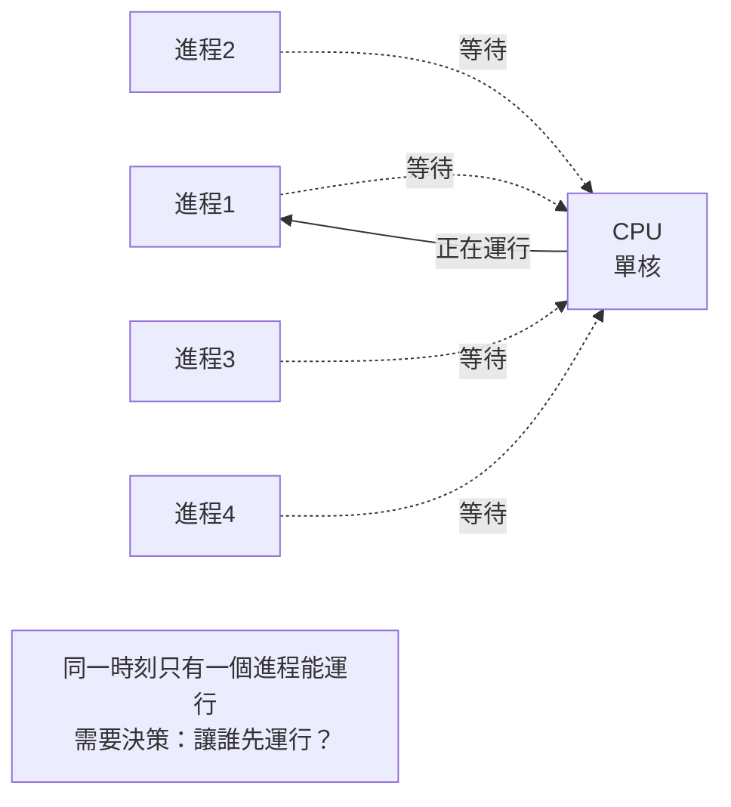

**問題**：
- 就緒隊列有多個進程等待CPU
- CPU同一時刻只能運行一個進程（單核）
- 如何選擇下一個運行的進程？

**目標**：
- 提高CPU利用率
- 提高系統吞吐量
- 降低進程等待時間
- 保證響應時間
- 公平性

---

## 調度器 (Scheduler)

### 調度器的角色

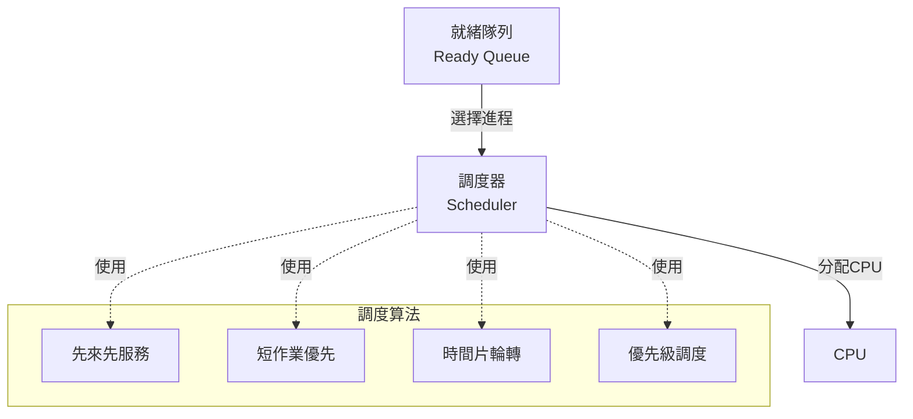

### 調度時機

**何時需要調度？**

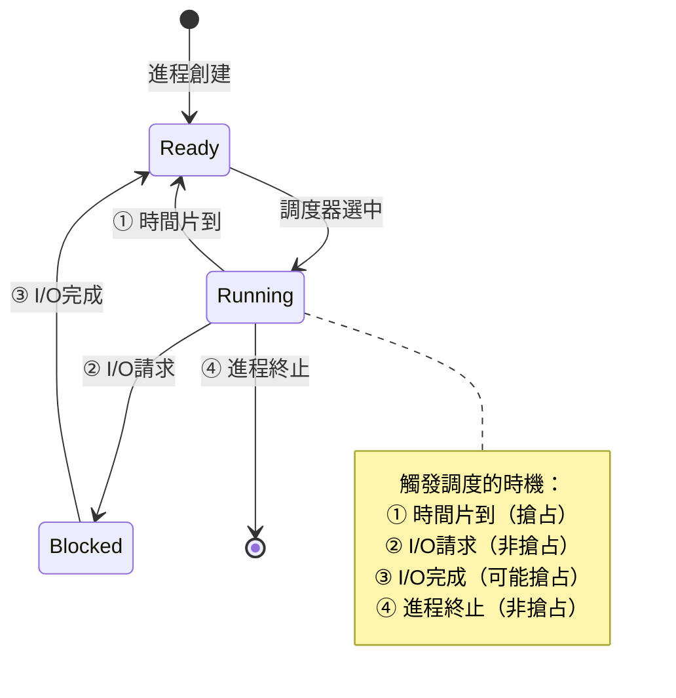

### 搶占式 vs 非搶占式

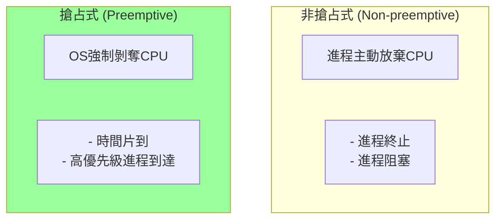

| 特性 | 搶占式 | 非搶占式 |
|------|--------|---------|
| CPU控制權 | OS可強制收回 | 進程主動交出 |
| 響應時間 | 短 | 長 |
| 公平性 | 好 | 可能差 |
| 實現複雜度 | 高 | 低 |
| 適用場景 | 分時系統、實時系統 | 批處理系統 |

---

## 調度算法

### 評價指標

**1. CPU利用率 (CPU Utilization)**
```
CPU利用率 = (CPU忙碌時間 / 總時間) × 100%
```

**2. 吞吐量 (Throughput)**
```
吞吐量 = 單位時間內完成的進程數
```

**3. 週轉時間 (Turnaround Time)**
```
週轉時間 = 完成時間 - 到達時間
```

**4. 等待時間 (Waiting Time)**
```
等待時間 = 週轉時間 - 運行時間
```

**5. 響應時間 (Response Time)**
```
響應時間 = 首次運行時間 - 到達時間
```

---

## 1. 先來先服務 (FCFS - First Come First Served)

### 算法原理

**按照進程到達就緒隊列的順序分配CPU。**

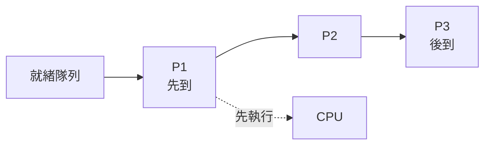

### 示例

| 進程 | 到達時間 | 運行時間 |
|------|---------|---------|
| P1 | 0 | 24 |
| P2 | 1 | 3 |
| P3 | 2 | 3 |

**執行順序**：
```mermaid
gantt
    title FCFS調度
    dateFormat X
    axisFormat %L
    
    section CPU
    P1 :0, 24
    P2 :24, 27
    P3 :27, 30
```

**計算**：
```
P1: 週轉時間 = 24-0 = 24,  等待時間 = 0
P2: 週轉時間 = 27-1 = 26,  等待時間 = 23
P3: 週轉時間 = 30-2 = 28,  等待時間 = 25

平均週轉時間 = (24+26+28)/3 = 26
平均等待時間 = (0+23+25)/3 = 16
```

### 特點

✅ **優點**：
- 實現簡單
- 公平（先到先得）
- 無飢餓問題

❌ **缺點**：
- **護航效應 (Convoy Effect)**：短進程排在長進程後面，等待時間長
- 平均等待時間可能很長
- 不適合分時系統

### 後端場景

```python
# 簡單任務隊列（FCFS）
from queue import Queue

task_queue = Queue()

def worker():
    while True:
        task = task_queue.get()  # 先進先出
        execute_task(task)
        task_queue.task_done()

# 添加任務
task_queue.put(task1)
task_queue.put(task2)
task_queue.put(task3)
```

---

## 2. 短作業優先 (SJF - Shortest Job First)

### 算法原理

**選擇運行時間最短的進程優先執行。**

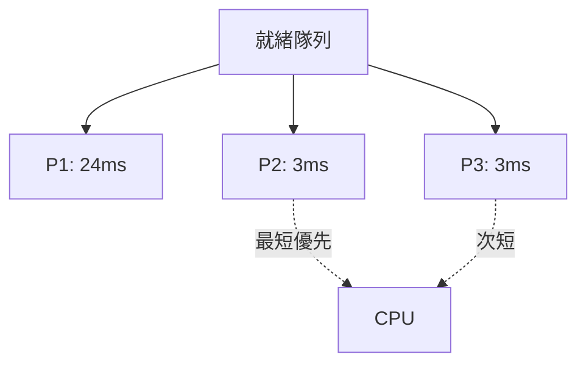

### 非搶占式SJF

**示例**（使用上面相同的進程）：

| 進程 | 到達時間 | 運行時間 |
|------|---------|---------|
| P1 | 0 | 24 |
| P2 | 1 | 3 |
| P3 | 2 | 3 |

**執行順序**：
```mermaid
gantt
    title SJF調度（非搶占）
    dateFormat X
    axisFormat %L
    
    section CPU
    P1 :0, 24
    P2 :24, 27
    P3 :27, 30
```

**計算**：
```
平均等待時間 = (0+23+25)/3 = 16
```
（與FCFS相同，因為P1已經開始執行）

### 搶占式SJF - SRTF

**SRTF (Shortest Remaining Time First)** - 最短剩餘時間優先

當新進程到達時，比較剩餘時間：

| 進程 | 到達時間 | 運行時間 |
|------|---------|---------|
| P1 | 0 | 7 |
| P2 | 2 | 4 |
| P3 | 4 | 1 |
| P4 | 5 | 4 |

**執行順序**：
```mermaid
gantt
    title SRTF調度（搶占）
    dateFormat X
    axisFormat %L
    
    section CPU
    P1 :0, 2
    P2 :2, 4
    P3 :4, 5
    P2 :5, 8
    P4 :8, 12
    P1 :12, 17
```

**分析**：
- t=0: P1開始運行（剩餘7）
- t=2: P2到達（剩餘4），比P1的剩餘5短，搶占
- t=4: P3到達（剩餘1），最短，搶占
- t=5: P3完成，P2剩餘2，P4剩餘4，P1剩餘5，選P2
- t=8: P2完成，P4剩餘4，P1剩餘5，選P4
- t=12: P4完成，P1繼續

```
平均等待時間 = [(17-7)+(8-2-4)+(5-4)+(12-5-4)]/4 = 3
```

### 特點

✅ **優點**：
- **最優平均等待時間**（可證明）
- 短進程優先，響應快

❌ **缺點**：
- **長進程可能飢餓**
- **需要預知運行時間**（實際中難以實現）
- 頻繁搶占增加開銷（SRTF）

### 實際應用

```python
# CPU密集型任務調度
import heapq

class TaskScheduler:
    def __init__(self):
        self.heap = []  # 最小堆（按預估時間）
    
    def add_task(self, task, estimated_time):
        heapq.heappush(self.heap, (estimated_time, task))
    
    def get_next_task(self):
        if self.heap:
            return heapq.heappop(self.heap)[1]
        return None

# 短任務先執行
scheduler.add_task("task1", 100)
scheduler.add_task("task2", 10)   # 先執行
scheduler.add_task("task3", 50)
```

---

## 3. 優先級調度 (Priority Scheduling)

### 算法原理

**每個進程有優先級，選擇優先級最高的進程執行。**

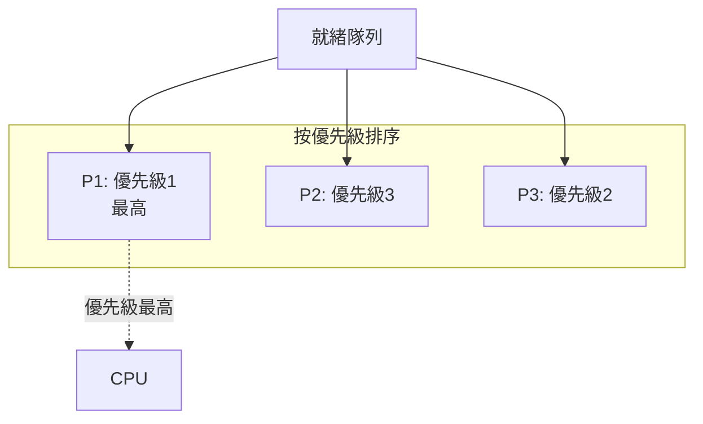

### 示例

| 進程 | 到達時間 | 運行時間 | 優先級 |
|------|---------|---------|--------|
| P1 | 0 | 10 | 3 |
| P2 | 1 | 1 | 1 (最高) |
| P3 | 2 | 2 | 4 |
| P4 | 3 | 1 | 5 |
| P5 | 4 | 5 | 2 |

**搶占式優先級調度**：
```mermaid
gantt
    title 優先級調度（數字越小優先級越高）
    dateFormat X
    axisFormat %L
    
    section CPU
    P1 :0, 1
    P2 :1, 2
    P5 :2, 7
    P1 :7, 16
    P3 :16, 18
    P4 :18, 19
```

### 優先級類型

**靜態優先級**：
- 創建時分配，運行期間不變
- 實現簡單
- 可能導致不公平

**動態優先級**：
- 根據行為動態調整
- 更公平
- 實現復雜

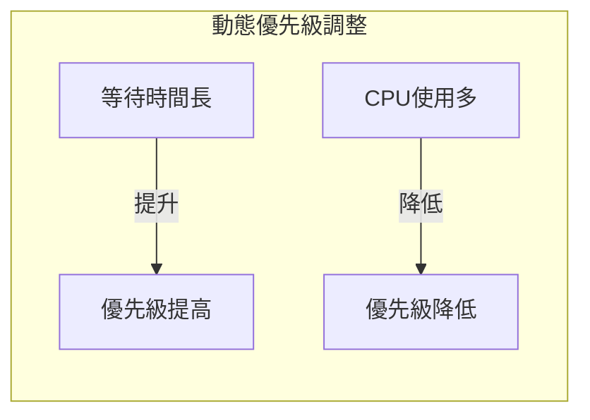

### 優先級反轉 (Priority Inversion)

**問題**：高優先級進程等待低優先級進程釋放資源

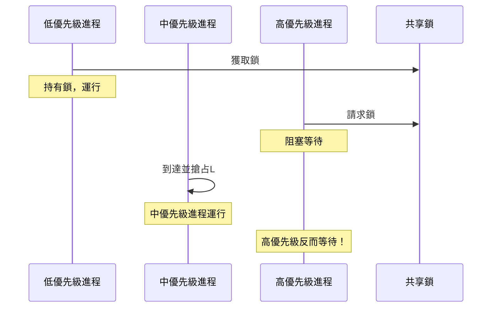

**解決方案**：
1. **優先級繼承 (Priority Inheritance)**：低優先級進程暫時繼承高優先級
2. **優先級天花板 (Priority Ceiling)**：鎖持有者提升到最高優先級

### 特點

✅ **優點**：
- 靈活性高
- 可以區分重要任務
- 適合實時系統

❌ **缺點**：
- 低優先級進程可能飢餓
- 優先級反轉問題
- 優先級設置困難

### 後端應用

```python
# 任務優先級隊列
from queue import PriorityQueue

task_queue = PriorityQueue()

# 添加任務（優先級，任務）
task_queue.put((1, "緊急訂單"))      # 高優先級
task_queue.put((5, "數據分析"))      # 低優先級
task_queue.put((3, "用戶註冊"))      # 中優先級

while not task_queue.empty():
    priority, task = task_queue.get()
    execute(task)  # 按優先級執行
```

---

## 4. 時間片輪轉 (RR - Round Robin)

### 算法原理

**每個進程獲得一個時間片(Time Quantum)，時間到後切換到下一個進程。**

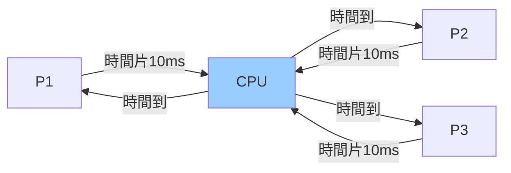

### 示例

| 進程 | 到達時間 | 運行時間 |
|------|---------|---------|
| P1 | 0 | 24 |
| P2 | 0 | 3 |
| P3 | 0 | 3 |

**時間片 = 4ms**：

```mermaid
gantt
    title RR調度（時間片4ms）
    dateFormat X
    axisFormat %L
    
    section CPU
    P1 :0, 4
    P2 :4, 7
    P3 :7, 10
    P1 :10, 14
    P1 :14, 18
    P1 :18, 22
    P1 :22, 26
    P1 :26, 30
```

**計算**：
```
P1: 週轉時間 = 30,  等待時間 = 30-24 = 6
P2: 週轉時間 = 7,   等待時間 = 7-3 = 4
P3: 週轉時間 = 10,  等待時間 = 10-3 = 7

平均等待時間 = (6+4+7)/3 = 5.67
```

### 時間片大小的影響

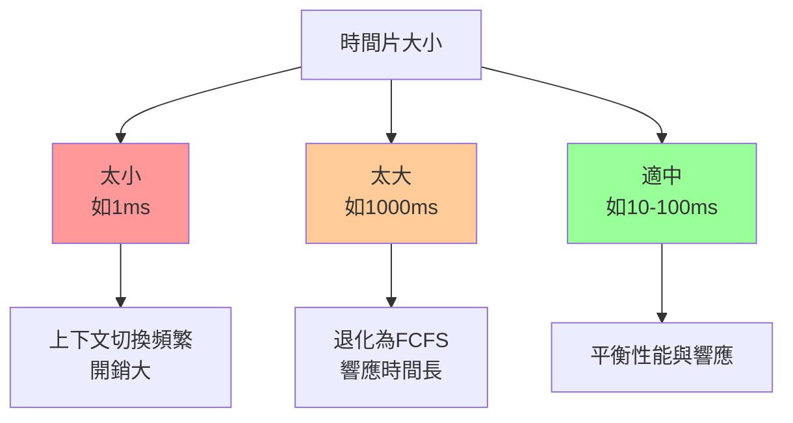

**經驗法則**：
```
時間片 = 10-100ms
上下文切換時間 < 時間片的1%
```

### 特點

✅ **優點**：
- 公平（每個進程都能獲得CPU）
- 響應時間好
- 無飢餓問題
- 適合分時系統

❌ **缺點**：
- 平均等待時間可能較長
- 上下文切換開銷
- 不區分進程重要性

### 後端應用

```go
// Go語言模擬RR調度
type Task struct {
    ID int
    RemainingTime int
}

func RoundRobinScheduler(tasks []Task, timeQuantum int) {
    queue := tasks
    
    for len(queue) > 0 {
        task := queue[0]
        queue = queue[1:]
        
        // 執行一個時間片
        if task.RemainingTime > timeQuantum {
            fmt.Printf("Task %d runs for %dms\n", task.ID, timeQuantum)
            task.RemainingTime -= timeQuantum
            queue = append(queue, task)  // 重新加入隊列
        } else {
            fmt.Printf("Task %d completes\n", task.ID)
        }
    }
}
```

---

## 5. 多級反饋隊列 (MLFQ - Multi-Level Feedback Queue)

### 算法原理

**結合多個隊列，不同隊列有不同優先級和時間片。**

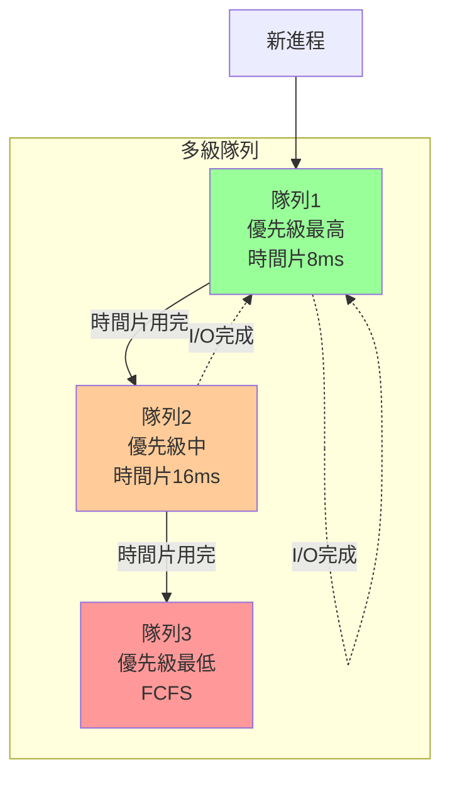

### 規則

1. **優先級**：優先執行高隊列的進程
2. **降級**：時間片用完降到下一級隊列
3. **提升**：I/O操作完成後提升到高隊列（獎勵I/O密集型）
4. **時間片**：低隊列時間片更長

### 示例

```mermaid
gantt
    title MLFQ調度示例
    dateFormat X
    axisFormat %L
    
    section 隊列1(8ms)
    P1 :0, 8
    P2 :8, 16
    
    section 隊列2(16ms)
    P1 :16, 32
    
    section 隊列3(FCFS)
    P1 :32, 50
```

### 動態調整

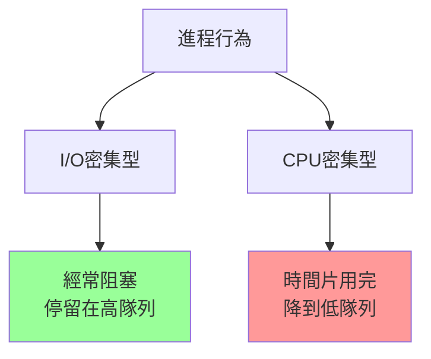

### 防止飢餓

**問題**：低隊列進程可能永遠得不到執行

**解決**：
```c
// 定期提升（Boost）
if (elapsed_time > BOOST_INTERVAL) {
    // 所有進程重置到最高隊列
    move_all_to_highest_queue();
    elapsed_time = 0;
}
```

### 特點

✅ **優點**：
- 自動區分I/O密集和CPU密集
- 短進程優先（在高隊列）
- 長進程也能運行（在低隊列）
- 動態適應

❌ **缺點**：
- 實現復雜
- 參數調整困難

---

## Linux CFS調度器

### CFS (Completely Fair Scheduler)

**Linux 2.6.23引入，目標：完全公平。**

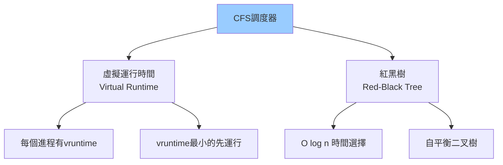

### 核心概念

**虛擬運行時間 (vruntime)**：
```c
vruntime += (實際運行時間) × (NICE_0_LOAD / 進程權重)

// nice值越低（優先級越高），權重越大，vruntime增長越慢
```

**權重表**：
```c
// nice值範圍：-20 到 +19
// nice = 0，權重 = 1024
// nice = -20，權重 = 88761  （最高優先級）
// nice = +19，權重 = 15     （最低優先級）
```

### 調度過程

```mermaid
sequenceDiagram
    participant RBT as 紅黑樹
    participant Scheduler as 調度器
    participant CPU as CPU
    
    RBT->>Scheduler: 取vruntime最小的進程
    Scheduler->>CPU: 分配CPU
    
    Note over CPU: 進程運行一段時間
    
    CPU->>Scheduler: 更新vruntime
    Scheduler->>RBT: 重新插入紅黑樹
    
    Note over RBT: 自動排序
```

### 查看進程優先級

```bash
# 查看進程nice值和優先級
ps -eo pid,ni,pri,comm

# 設置nice值
nice -n 10 ./my_program      # 降低優先級
nice -n -10 ./my_program     # 提高優先級（需要root）

# 修改運行中進程的nice值
renice -n 5 -p 1234
```

### CFS特點

✅ **優勢**：
- 完全公平（理論上）
- 可擴展性好（O(log n)）
- 自動平衡I/O和CPU密集型
- 支持多核

**示例**：
```c
// 進程A: nice=0,  權重=1024
// 進程B: nice=5,  權重=335
// 進程C: nice=-5, 權重=3121

// CPU時間分配比例：
// A: 1024 / (1024+335+3121) = 23%
// B: 335 / (1024+335+3121) = 7%
// C: 3121 / (1024+335+3121) = 70%
```

---

## 實時調度 (Real-Time Scheduling)

### 實時系統需求

**硬實時 (Hard Real-Time)**：
- 必須在截止時間前完成
- 錯過導致災難性後果
- 例如：飛機控制、醫療設備

**軟實時 (Soft Real-Time)**：
- 應該在截止時間前完成
- 錯過導致性能下降
- 例如：視頻播放、遊戲

### Linux實時調度策略

```mermaid
graph TB
    RT[Linux實時調度]
    
    RT --> FIFO[SCHED_FIFO<br/>實時FIFO]
    RT --> RR[SCHED_RR<br/>實時輪轉]
    RT --> DL[SCHED_DEADLINE<br/>截止時間調度]
    
    FIFO --> F1[按優先級FIFO<br/>無時間片]
    RR --> R1[按優先級輪轉<br/>有時間片]
    DL --> D1[EDF算法<br/>最早截止優先]
    
    style RT fill:#f96
```

### SCHED_FIFO

```c
#include <sched.h>

struct sched_param param;
param.sched_priority = 50;  // 1-99

// 設置為實時FIFO
sched_setscheduler(0, SCHED_FIFO, &param);

// 進程運行直到：
// 1. 自己阻塞（I/O）
// 2. 自己主動讓出CPU
// 3. 更高優先級實時進程到達
```

### SCHED_RR

```c
// 與FIFO類似，但有時間片
sched_setscheduler(0, SCHED_RR, &param);

// 時間片用完後，同優先級的下一個進程執行
```

### SCHED_DEADLINE

```c
#include <linux/sched.h>

struct sched_attr attr;
attr.sched_policy = SCHED_DEADLINE;
attr.sched_runtime = 10 * 1000000;   // 10ms
attr.sched_deadline = 20 * 1000000;  // 20ms
attr.sched_period = 50 * 1000000;    // 50ms

sched_setattr(0, &attr, 0);
```

**EDF (Earliest Deadline First)**：
- 選擇截止時間最早的任務
- 理論最優（單核）

---

## 多核調度

### 多核挑戰

```mermaid
graph TB
    subgraph "多核系統"
        CPU0[CPU Core 0]
        CPU1[CPU Core 1]
        CPU2[CPU Core 2]
        CPU3[CPU Core 3]
    end
    
    subgraph "挑戰"
        LB[負載均衡]
        CA[緩存親和性]
        NUMA[NUMA感知]
    end
    
    CPU0 -.-> LB
    CPU1 -.-> CA
    CPU2 -.-> NUMA
```

### 負載均衡

**問題**：某些核心過載，某些空閒

```mermaid
graph LR
    subgraph "不均衡"
        C0[CPU0<br/>負載90%]
        C1[CPU1<br/>負載10%]
    end
    
    subgraph "均衡後"
        C2[CPU0<br/>負載50%]
        C3[CPU1<br/>負載50%]
    end
    
    C0 -->|遷移進程| C2
    C1 -->|遷移進程| C3
```

**Linux負載均衡策略**：
```c
// 定期負載均衡
// 每個CPU定期檢查負載不平衡

// Idle負載均衡
// CPU空閒時主動拉取任務

// Fork負載均衡
// 創建進程時分配到負載輕的CPU
```

### CPU親和性 (Affinity)

**問題**：進程在不同CPU間遷移，緩存失效

```bash
# 查看進程運行在哪個CPU
ps -eo pid,psr,comm

# 設置CPU親和性
taskset -c 0,1 ./my_program    # 只在CPU0和CPU1上運行
taskset -p 0x3 1234            # 綁定到CPU0和CPU1（二進制11）
```

```c
// C語言設置親和性
#include <sched.h>

cpu_set_t mask;
CPU_ZERO(&mask);
CPU_SET(0, &mask);  // 綁定到CPU0

sched_setaffinity(0, sizeof(mask), &mask);
```

### NUMA (Non-Uniform Memory Access)

```mermaid
graph TB
    subgraph "NUMA架構"
        Node0["NUMA Node 0"]
        Node1["NUMA Node 1"]
        
        subgraph Node0
            CPU0["CPU 0-7"]
            Mem0["本地內存"]
        end
        
        subgraph Node1
            CPU1["CPU 8-15"]
            Mem1["本地內存"]
        end
        
        CPU0 -->|快| Mem0
        CPU0 -.慢.-> Mem1
        CPU1 -->|快| Mem1
        CPU1 -.慢.-> Mem0
    end
```

**優化**：
```bash
# 查看NUMA拓撲
numactl --hardware

# 綁定到NUMA節點
numactl --cpunodebind=0 --membind=0 ./my_program
```

---

## 後端性能調優

### 1. 識別CPU瓶頸

```bash
# 查看整體CPU使用
top
htop

# 查看每個CPU核心
mpstat -P ALL 1

# 查看進程CPU使用
pidstat 1
```

### 2. 調整進程優先級

```bash
# 降低優先級（後台任務）
nice -n 19 ./backup_script

# 提高優先級（關鍵服務）
nice -n -10 ./critical_service  # 需要root

# 實時優先級（謹慎使用）
chrt -f 50 ./realtime_app
```

### 3. CPU綁定

```python
# Python綁定CPU
import os

# 綁定到CPU0
os.sched_setaffinity(0, {0})

# 綁定到CPU0-3
os.sched_setaffinity(0, {0, 1, 2, 3})
```

### 4. 避免上下文切換

```python
# 錯誤：過多線程導致頻繁切換
threads = []
for i in range(1000):  # 創建1000個線程
    t = threading.Thread(target=work)
    threads.append(t)
    t.start()

# 正確：使用線程池
from concurrent.futures import ThreadPoolExecutor

with ThreadPoolExecutor(max_workers=4) as executor:  # CPU核心數
    results = executor.map(work, tasks)
```

### 5. 監控調度延遲

```bash
# 查看調度統計
cat /proc/sched_debug

# 查看運行隊列長度
vmstat 1
# r列：運行隊列長度
# 理想值：<= CPU核心數
```

### 6. 應用場景選擇

```mermaid
graph TB
    App[應用類型]
    
    App --> Web[Web服務器]
    App --> DB[數據庫]
    App --> Batch[批處理]
    App --> RT[實時系統]
    
    Web --> W1[CFS默認<br/>nice=0]
    DB --> D1[提高優先級<br/>nice=-5]
    Batch --> B1[降低優先級<br/>nice=19]
    RT --> R1[實時調度<br/>SCHED_FIFO]
    
    style W1 fill:#9cf
    style D1 fill:#9f9
    style B1 fill:#fc9
    style R1 fill:#f96
```

---

## 調度算法總結

| 算法 | 搶占 | 優點 | 缺點 | 適用場景 |
|------|------|------|------|---------|
| **FCFS** | 否 | 簡單公平 | 護航效應 | 批處理 |
| **SJF** | 否 | 最優平均等待 | 飢餓、需預知 | 批處理（理論） |
| **SRTF** | 是 | 最優 | 飢餓、搶占開銷 | 理論研究 |
| **Priority** | 可選 | 靈活 | 飢餓、反轉 | 實時系統 |
| **RR** | 是 | 公平響應快 | 上下文開銷 | 分時系統 |
| **MLFQ** | 是 | 自適應 | 復雜 | 通用系統 |
| **CFS** | 是 | 完全公平 | 實時性差 | Linux默認 |

---

## 關鍵要點

1. **理解調度目標的權衡**
   - 吞吐量 vs 響應時間
   - 公平性 vs 效率
   - 沒有完美的調度算法

2. **選擇合適的調度策略**
   - Web服務：CFS默認
   - 數據庫：提高優先級
   - 批處理：降低優先級
   - 實時：SCHED_FIFO/RR

3. **多核調度複雜性**
   - 負載均衡
   - 緩存親和性
   - NUMA感知

4. **避免常見錯誤**
   - 過多線程（上下文切換）
   - 忽視CPU親和性
   - 實時優先級濫用

5. **監控與調優**
   - 使用top/htop監控
   - 調整nice值
   - 綁定CPU核心

---

## 下一章預告

**05-內存管理**將探討：
- 虛擬內存 (Virtual Memory)
- 分頁 (Paging) 與分段 (Segmentation)
- 頁面置換算法 (LRU、FIFO)
- 內存分配 (malloc/free)
- OOM Killer
- 後端內存調優實戰
