# 05-內存管理 (Memory Management)

## 為什麼需要內存管理？

### 早期問題

**無內存管理的困境**：

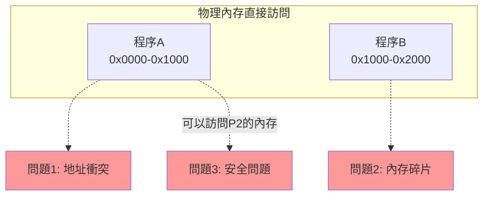

**問題**：
1. **地址衝突**：程序必須知道自己的物理地址
2. **內存不足**：多個程序總和超過物理內存
3. **安全隱患**：程序可以訪問其他程序的內存
4. **碎片化**：頻繁分配釋放導致碎片

---

## 虛擬內存 (Virtual Memory)

### 核心概念

**每個進程都有獨立的虛擬地址空間，OS負責映射到物理內存。**

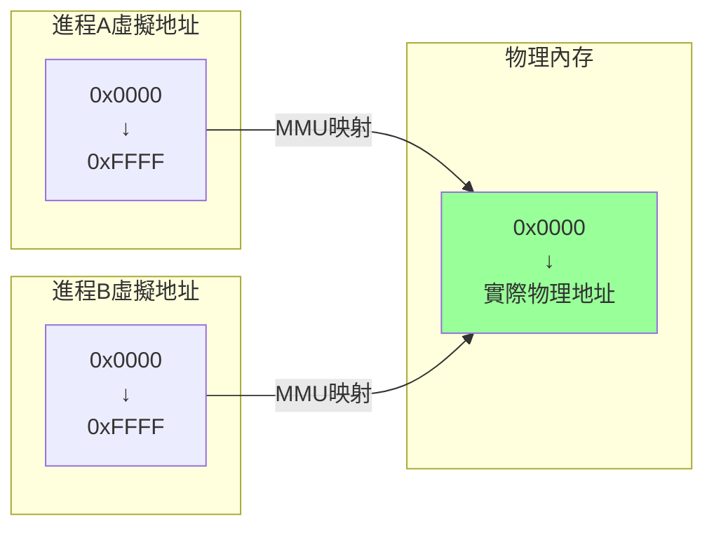

### MMU (Memory Management Unit)

**硬件負責地址轉換**：

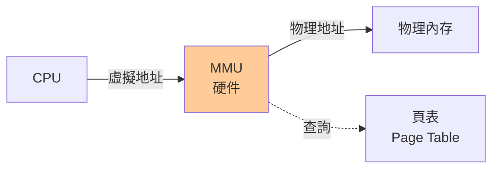

### 虛擬內存的優勢

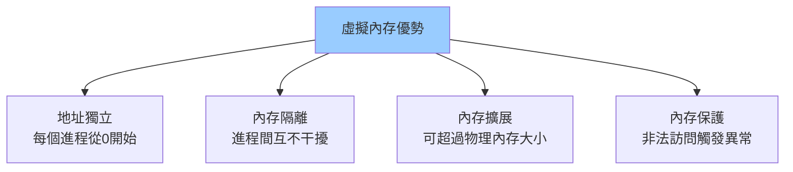

---

## 分頁 (Paging)

### 基本概念

**將虛擬內存和物理內存分成固定大小的頁(Page)和頁框(Page Frame)。**

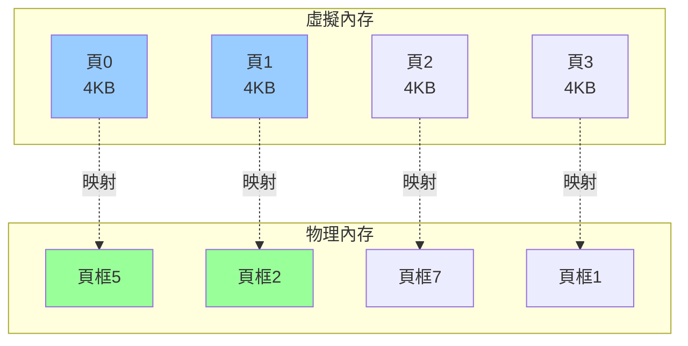

**術語**：
- **頁 (Page)**：虛擬內存的固定大小塊（通常4KB）
- **頁框 (Page Frame)**：物理內存的固定大小塊
- **頁號 (Page Number)**：虛擬地址的高位
- **偏移量 (Offset)**：頁內地址的低位

### 地址轉換

**虛擬地址結構**（32位系統，4KB頁）：

```
虛擬地址 = | 頁號 (20位) | 偏移量 (12位) |
           ↓
      查頁表獲取頁框號
           ↓
物理地址 = | 頁框號 (20位) | 偏移量 (12位) |
```

**示例**：
```
虛擬地址: 0x00012345
二進制:   0000 0000 0000 0001 0010 0011 0100 0101
         |------ 頁號:0x12 ------||-- 偏移:0x345 --|

假設頁表: Page 0x12 → Frame 0x87

物理地址: 0x00087345
```

### 頁表 (Page Table)

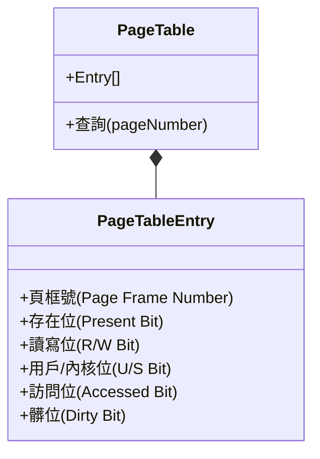

**頁表項 (PTE) 結構**：

| 位 | 名稱 | 說明 |
|----|----|------|
| **P** | Present | 1=在內存，0=在磁盤 |
| **R/W** | Read/Write | 1=可寫，0=只讀 |
| **U/S** | User/Supervisor | 1=用戶態可訪問 |
| **A** | Accessed | 是否被訪問過 |
| **D** | Dirty | 是否被修改過 |
| **PFN** | Page Frame Number | 物理頁框號 |

### 多級頁表

**問題**：32位系統，4KB頁，需要2^20個頁表項 = 4MB頁表！

**解決**：多級頁表（減少內存佔用）


**64位系統（x86-64）**：
```
虛擬地址 48位 (實際使用)
4級頁表：
- Level 4 (PML4)
- Level 3 (PDPT)
- Level 2 (PD)
- Level 1 (PT)
```

### TLB (Translation Lookaside Buffer)

**問題**：每次訪問內存都要查頁表，太慢！

**解決**：TLB緩存最近使用的地址轉換

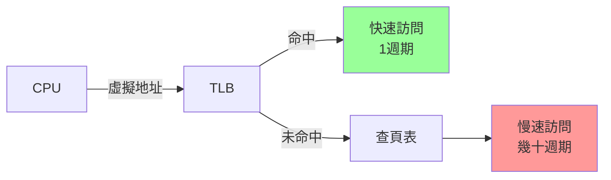

**TLB性能**：
```
TLB命中率 ≈ 98-99%
TLB命中時間 ≈ 1 cycle
TLB未命中時間 ≈ 10-100 cycles

有效訪問時間 = 0.98 × 1 + 0.02 × 50 = 1.98 cycles
```

**TLB刷新時機**：
```c
// 進程切換時刷新TLB
context_switch() {
    save_context();
    flush_tlb();        // ← 刷新TLB
    load_new_context();
}

// 這也是進程切換開銷的一部分
```

---

## 分段 (Segmentation)

### 基本概念

**按邏輯分成不同大小的段。**

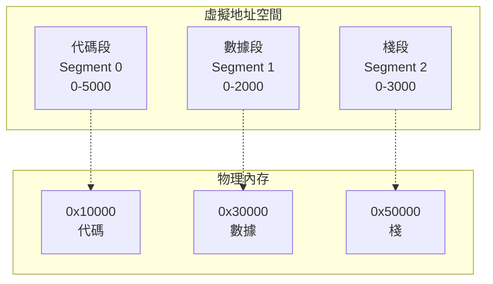

### 段表 (Segment Table)

| 段號 | 基址 | 長度 | 權限 |
|------|------|------|------|
| 0 (代碼) | 0x10000 | 5000 | R-X |
| 1 (數據) | 0x30000 | 2000 | RW- |
| 2 (棧) | 0x50000 | 3000 | RW- |

### 地址轉換

```
虛擬地址 = | 段號 | 段內偏移 |

物理地址 = 段表[段號].基址 + 偏移

// 同時檢查
if (偏移 >= 段表[段號].長度) {
    觸發段錯誤 (Segmentation Fault)
}
```

### 分段 vs 分頁

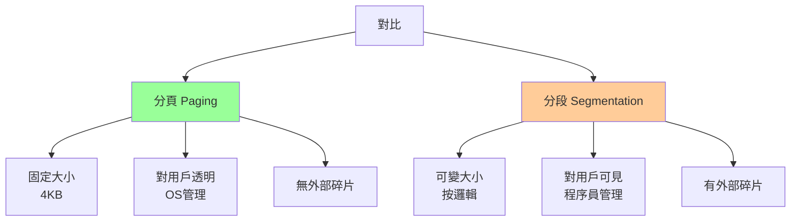

### 現代系統：段頁式

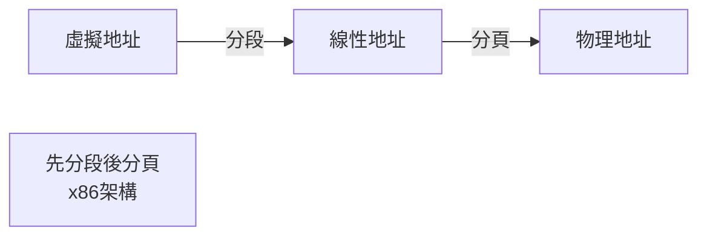

---

## 頁面置換算法

### 缺頁中斷 (Page Fault)

**當訪問的頁不在內存時觸發。**

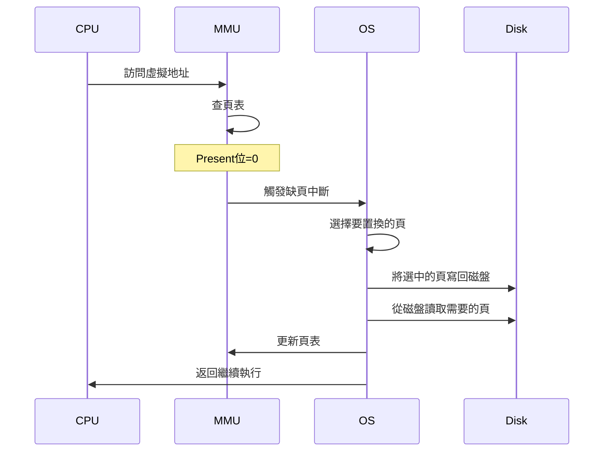

### 1. FIFO (First In First Out)

**最簡單：淘汰最早進入內存的頁。**

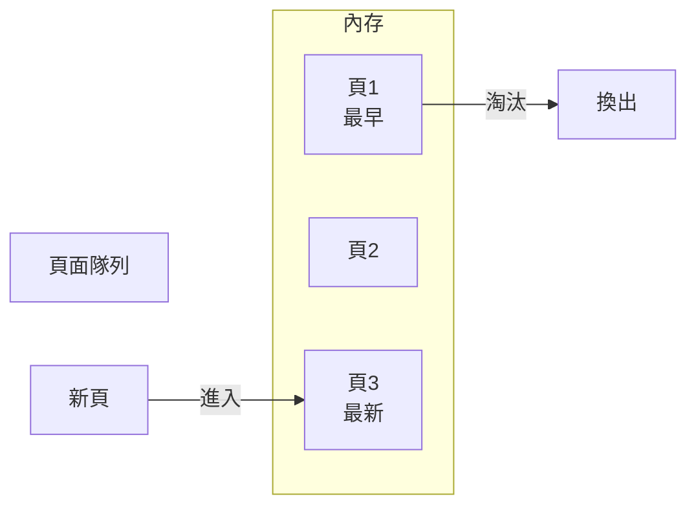

**示例**：
```
內存容量: 3頁
訪問序列: 1, 2, 3, 4, 1, 2, 5, 1, 2, 3, 4, 5

時間  訪問  內存狀態      缺頁
0     1     [1]           ✓
1     2     [1,2]         ✓
2     3     [1,2,3]       ✓
3     4     [4,2,3]       ✓ (淘汰1)
4     1     [4,1,3]       ✓ (淘汰2)
5     2     [4,1,2]       ✓ (淘汰3)
6     5     [5,1,2]       ✓ (淘汰4)
7     1     [5,1,2]       -
8     2     [5,1,2]       -
9     3     [5,3,2]       ✓ (淘汰1)
10    4     [5,3,4]       ✓ (淘汰2)
11    5     [5,3,4]       -

缺頁次數: 10
```

**Belady異常**：增加內存反而增加缺頁！

### 2. LRU (Least Recently Used)

**淘汰最久未使用的頁。**

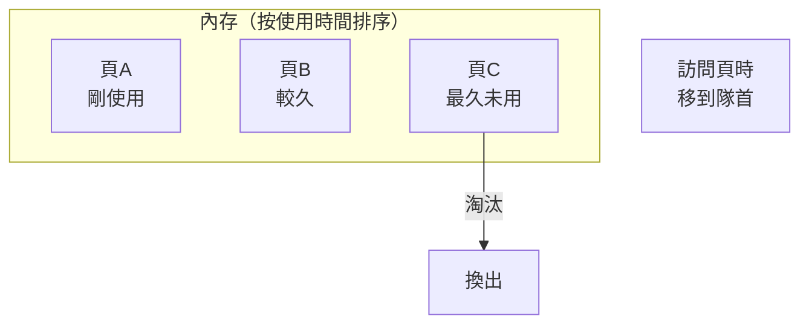

**示例**：
```
訪問序列: 1, 2, 3, 4, 1, 2, 5, 1, 2, 3, 4, 5

時間  訪問  內存狀態(最近→最久)  缺頁
0     1     [1]                  ✓
1     2     [2,1]                ✓
2     3     [3,2,1]              ✓
3     4     [4,3,2]              ✓ (淘汰1)
4     1     [1,4,3]              ✓ (淘汰2)
5     2     [2,1,4]              ✓ (淘汰3)
6     5     [5,2,1]              ✓ (淘汰4)
7     1     [1,5,2]              - (移到最前)
8     2     [2,1,5]              -
9     3     [3,2,1]              ✓ (淘汰5)
10    4     [4,3,2]              ✓ (淘汰1)
11    5     [5,4,3]              ✓ (淘汰2)

缺頁次數: 10
```

**實現方式**：

```python
# Python LRU實現（簡化）
from collections import OrderedDict

class LRUCache:
    def __init__(self, capacity):
        self.cache = OrderedDict()
        self.capacity = capacity
    
    def get(self, key):
        if key not in self.cache:
            return None
        # 移到最後（最近使用）
        self.cache.move_to_end(key)
        return self.cache[key]
    
    def put(self, key, value):
        if key in self.cache:
            self.cache.move_to_end(key)
        self.cache[key] = value
        if len(self.cache) > self.capacity:
            # 淘汰第一個（最久未用）
            self.cache.popitem(last=False)
```

**硬件支持**：
- 每次訪問更新時間戳（開銷大）
- 近似LRU算法

### 3. Clock算法（近似LRU）

**使用訪問位(Access Bit)近似LRU。**

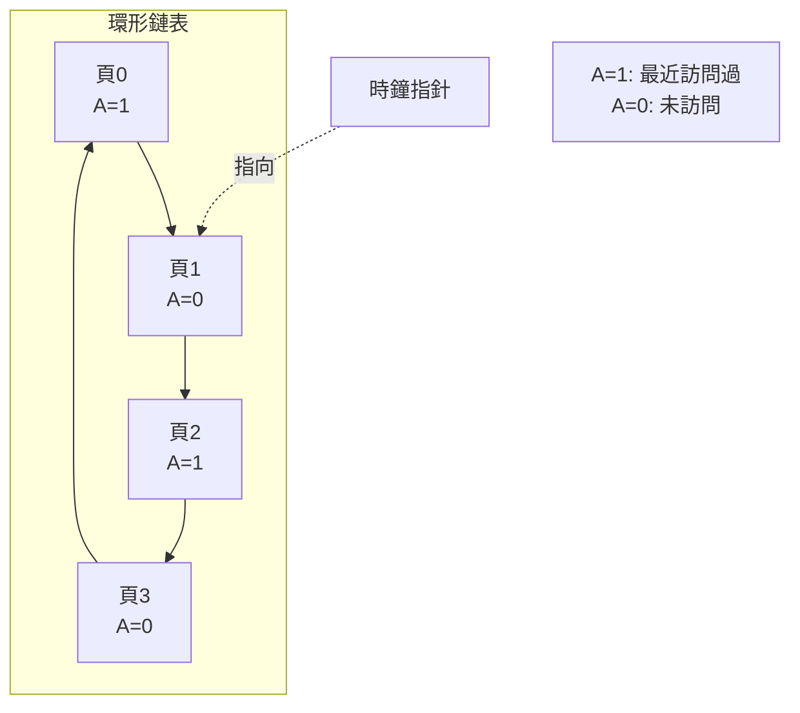

**算法**：
```c
// Clock算法
void* find_victim() {
    while (true) {
        if (pages[clock_hand].accessed == 0) {
            // 找到淘汰頁
            return &pages[clock_hand];
        }
        // 給第二次機會，清除訪問位
        pages[clock_hand].accessed = 0;
        clock_hand = (clock_hand + 1) % num_pages;
    }
}
```

### 4. LFU (Least Frequently Used)

**淘汰訪問次數最少的頁。**

```python
# LFU實現
class LFUCache:
    def __init__(self, capacity):
        self.capacity = capacity
        self.cache = {}         # key -> (value, freq)
        self.freq_map = {}      # freq -> set of keys
        self.min_freq = 0
    
    def get(self, key):
        if key not in self.cache:
            return None
        value, freq = self.cache[key]
        self._update_freq(key, freq)
        return value
    
    def _update_freq(self, key, freq):
        self.freq_map[freq].remove(key)
        if not self.freq_map[freq] and freq == self.min_freq:
            self.min_freq += 1
        
        new_freq = freq + 1
        self.cache[key] = (self.cache[key][0], new_freq)
        if new_freq not in self.freq_map:
            self.freq_map[new_freq] = set()
        self.freq_map[new_freq].add(key)
```

### 算法對比

| 算法 | 實現難度 | 性能 | 優點 | 缺點 |
|------|---------|------|------|------|
| **FIFO** | 簡單 | 一般 | 公平 | Belady異常 |
| **LRU** | 中等 | 好 | 符合局部性 | 開銷大 |
| **Clock** | 簡單 | 好 | 近似LRU，開銷小 | 不如LRU |
| **LFU** | 複雜 | 中等 | 適合訪問頻率固定 | 不適應訪問模式變化 |

---

## 內存分配

### malloc/free實現原理

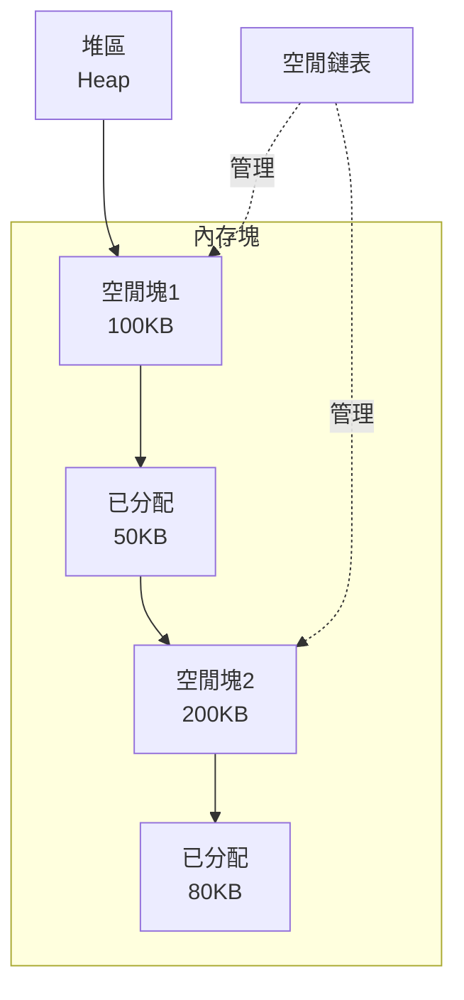

### 內存分配策略

**1. First Fit（首次適應）**
```c
// 找到第一個足夠大的空閒塊
void* first_fit(size_t size) {
    for (Block* b = free_list; b != NULL; b = b->next) {
        if (b->size >= size) {
            return allocate(b, size);
        }
    }
    return NULL;  // 分配失敗
}
```

**2. Best Fit（最佳適應）**
```c
// 找到最小的足夠大的空閒塊
void* best_fit(size_t size) {
    Block* best = NULL;
    size_t min_size = SIZE_MAX;
    
    for (Block* b = free_list; b != NULL; b = b->next) {
        if (b->size >= size && b->size < min_size) {
            best = b;
            min_size = b->size;
        }
    }
    return allocate(best, size);
}
```

**3. Worst Fit（最差適應）**
```c
// 找到最大的空閒塊
// 理論：分割後剩餘塊更大，更有用
```

### 內存碎片

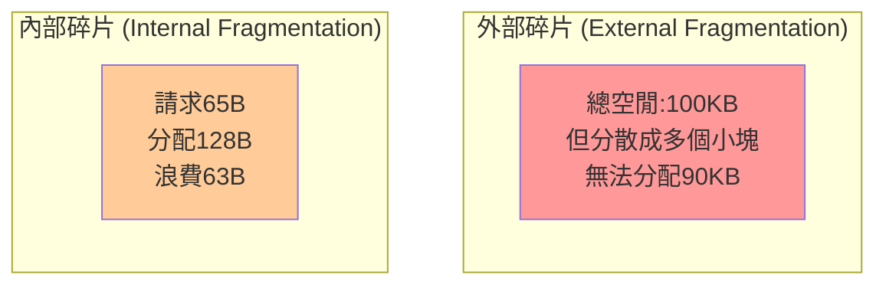

**解決外部碎片**：
1. **緊縮(Compaction)**：移動已分配塊，合併空閒空間
2. **分頁**：固定大小分配，無外部碎片

**解決內部碎片**：
1. **Buddy System**：2的冪次分配
2. **Slab Allocator**：特定大小對象池

### Buddy System

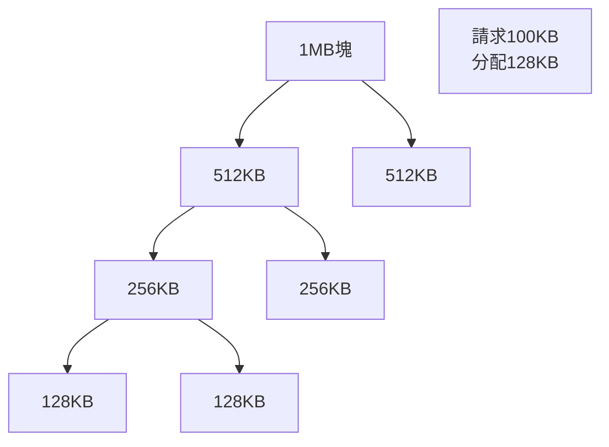

**特點**：
- 分配：找到足夠大的2^n塊，可能分裂
- 釋放：與buddy合併

```c
// Buddy分配
void* buddy_alloc(size_t size) {
    // 向上取整到2的冪
    size_t alloc_size = next_power_of_2(size);
    // 找到對應大小的空閒塊
    return find_free_block(alloc_size);
}

// Buddy釋放
void buddy_free(void* ptr) {
    Block* block = ptr;
    Block* buddy = find_buddy(block);
    
    if (buddy && buddy->is_free) {
        // 合併
        merge(block, buddy);
        // 遞歸向上合併
        buddy_free(merged_block);
    }
}
```

---

## Linux內存管理

### 虛擬地址空間佈局

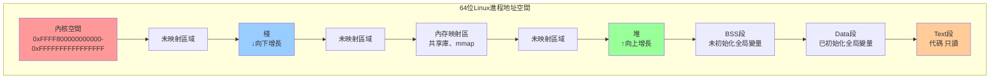

### 查看進程內存

```bash
# 查看進程內存映射
cat /proc/[pid]/maps

# 示例輸出
00400000-00401000 r-xp  /bin/cat        # 代碼段
00600000-00601000 r--p  /bin/cat        # 只讀數據
00601000-00602000 rw-p  /bin/cat        # 可讀寫數據
7f1234567000-...  r-xp  /lib/libc.so    # 共享庫
7ffe12345000-...  rw-p  [stack]         # 棧
7ffe12367000-...  r-xp  [vdso]          # 虛擬動態共享對象
```

### OOM Killer

**Out Of Memory Killer - 內存不足時殺進程。**

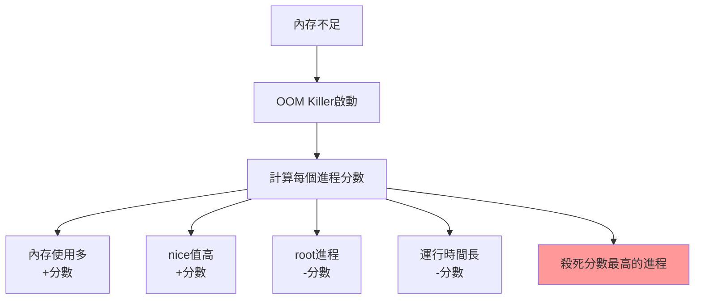

**oom_score計算**：
```bash
# 查看進程OOM分數
cat /proc/[pid]/oom_score

# 調整OOM分數（-1000到1000）
echo -500 > /proc/[pid]/oom_score_adj  # 降低被殺概率
echo 1000 > /proc/[pid]/oom_score_adj  # 提高被殺概率
```

**避免關鍵進程被殺**：
```bash
# 禁用OOM Killer（危險！）
echo -17 > /proc/[pid]/oom_adj

# 或在代碼中
echo 0 > /proc/self/oom_score_adj
```

### 內存過量分配 (Overcommit)

**Linux允許分配超過物理內存+swap的內存。**

```bash
# 查看overcommit策略
cat /proc/sys/vm/overcommit_memory

# 0: 啟發式（默認）
# 1: 總是允許
# 2: 嚴格限制
```

**為什麼要overcommit？**
```c
// 很多進程malloc後不使用
char* buf = malloc(1GB);  // 分配成功
// 實際只使用很小一部分
memset(buf, 0, 1MB);
```

---

## 內存性能調優

### 1. 監控內存使用

```bash
# 查看內存概況
free -h
#               total    used    free   shared  buff/cache  available
# Mem:          16Gi     5.0Gi   2.0Gi   500Mi      9.0Gi       10Gi

# 詳細內存信息
cat /proc/meminfo

# 實時監控
vmstat 1
# procs -----------memory---------- ---swap-- -----io---- -system-- ------cpu-----
#  r  b   swpd   free   buff  cache   si   so    bi    bo   in   cs us sy id wa st
#  2  0      0 2048000 512000 9216000   0    0     0     0  100  200  5  2 93  0  0

# 查看進程內存
top -o %MEM
ps aux --sort=-%mem | head -10
```

### 2. 減少內存使用

```python
# 錯誤：一次性加載大文件
with open('huge_file.txt', 'r') as f:
    data = f.read()  # 整個文件加載到內存
    process(data)

# 正確：流式處理
with open('huge_file.txt', 'r') as f:
    for line in f:  # 逐行讀取
        process(line)
```

```python
# 使用生成器而非列表
# 錯誤
def get_numbers():
    return [i for i in range(10000000)]  # 佔用大量內存

# 正確
def get_numbers():
    for i in range(10000000):  # 按需生成
        yield i
```

### 3. 緩存優化

```go
// Go語言示例：對齊與緩存行
// 錯誤：頻繁訪問的字段分散
type BadStruct struct {
    field1 int64    // 8字節
    field2 bool     // 1字節
    field3 int64    // 8字節 - 跨緩存行
}

// 正確：按訪問頻率排列
type GoodStruct struct {
    field1 int64    // 熱數據
    field3 int64    // 熱數據（同一緩存行）
    field2 bool     // 冷數據
}
```

### 4. 大頁 (Huge Pages)

**使用2MB或1GB頁而非4KB。**

```bash
# 查看大頁配置
cat /proc/meminfo | grep Huge

# 配置大頁數量
echo 1024 > /proc/sys/vm/nr_hugepages  # 1024個2MB頁 = 2GB

# 透明大頁（THP）
echo always > /sys/kernel/mm/transparent_hugepage/enabled
```

**優勢**：
- 減少TLB未命中
- 減少頁表項數量
- 提升性能（數據庫、高性能計算）

**使用**：
```c
// mmap使用大頁
void* addr = mmap(NULL, 2MB, 
                  PROT_READ | PROT_WRITE,
                  MAP_PRIVATE | MAP_ANONYMOUS | MAP_HUGETLB,
                  -1, 0);
```

### 5. 內存池

```cpp
// C++ 內存池示例
class MemoryPool {
private:
    std::vector<char*> blocks;
    char* current;
    size_t remaining;
    
public:
    void* allocate(size_t size) {
        if (size > remaining) {
            // 分配新塊
            char* block = new char[BLOCK_SIZE];
            blocks.push_back(block);
            current = block;
            remaining = BLOCK_SIZE;
        }
        
        void* ptr = current;
        current += size;
        remaining -= size;
        return ptr;
    }
    
    // 批量釋放
    ~MemoryPool() {
        for (char* block : blocks) {
            delete[] block;
        }
    }
};
```

### 6. mmap vs read/write

```python
# 使用mmap處理大文件
import mmap

# 傳統方式
with open('large_file.bin', 'rb') as f:
    data = f.read()  # 整個文件讀入內存

# mmap方式（內存映射）
with open('large_file.bin', 'r+b') as f:
    mmapped = mmap.mmap(f.fileno(), 0)
    # 按需加載頁面到內存
    value = mmapped[1000000:1000100]
    mmapped.close()
```

---

## 內存洩漏檢測

### Valgrind

```bash
# 編譯時加調試信息
gcc -g -o myapp myapp.c

# 檢測內存洩漏
valgrind --leak-check=full ./myapp

# 輸出示例
==12345== HEAP SUMMARY:
==12345==     in use at exit: 1,024 bytes in 1 blocks
==12345==   total heap usage: 10 allocs, 9 frees, 10,240 bytes allocated
==12345== 
==12345== 1,024 bytes in 1 blocks are definitely lost
==12345==    at malloc (vg_replace_malloc.c:299)
==12345==    by main (myapp.c:15)
```

### AddressSanitizer

```bash
# 編譯時啟用ASan
gcc -fsanitize=address -g -o myapp myapp.c

# 運行
./myapp

# 自動檢測：
# - 內存洩漏
# - Use after free
# - 堆緩衝區溢出
# - 棧緩衝區溢出
```

---

## 關鍵要點

1. **虛擬內存是基礎**
   - 每個進程獨立地址空間
   - MMU負責地址轉換
   - 頁表管理映射關係

2. **理解分頁機制**
   - 4KB固定大小
   - 多級頁表節省空間
   - TLB加速地址轉換

3. **頁面置換影響性能**
   - LRU最常用
   - Clock是實用的近似算法
   - 減少缺頁提升性能

4. **內存分配策略**
   - 理解malloc/free原理
   - 注意內存碎片
   - 使用對象池提升性能

5. **後端調優實踐**
   - 監控內存使用
   - 避免內存洩漏
   - 使用大頁提升性能
   - 流式處理大數據
   - 防止OOM Killer

---

## 下一章預告

**06-文件系統與I/O**將探討：
- VFS虛擬文件系統
- inode與目錄結構
- 文件描述符
- 磁盤I/O原理
- 頁緩存與緩衝區
- 後端文件操作優化
