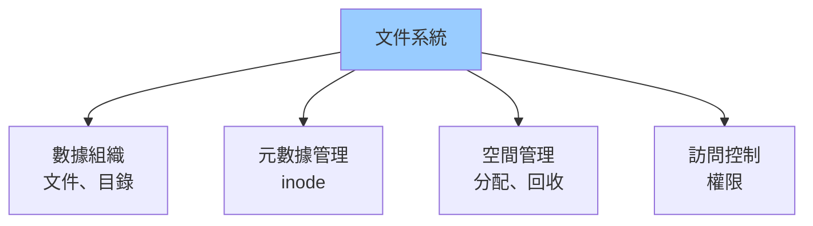
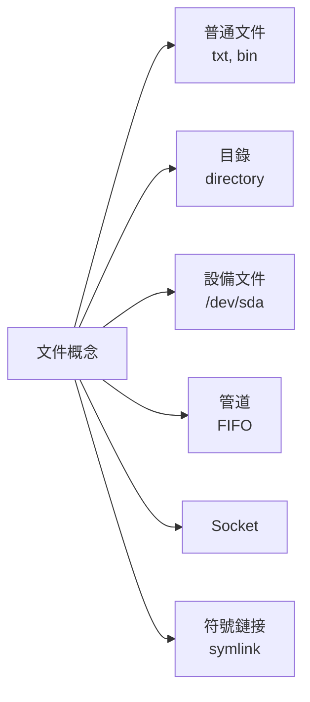
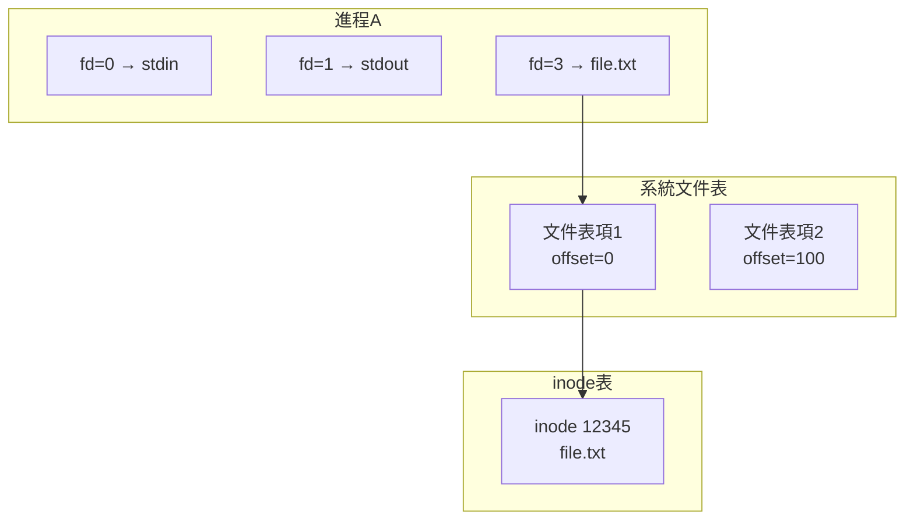
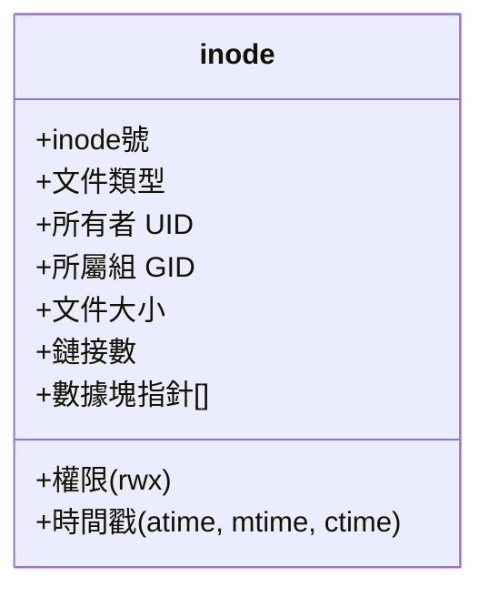
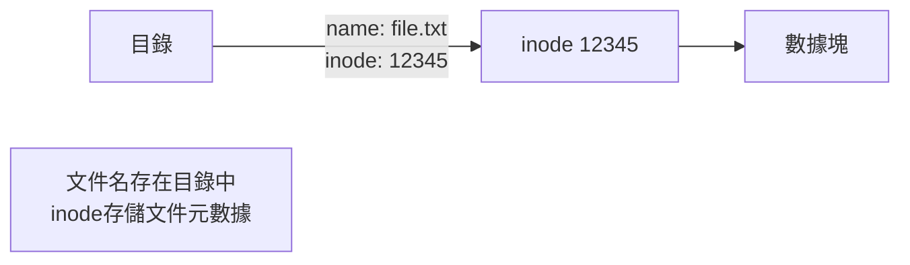
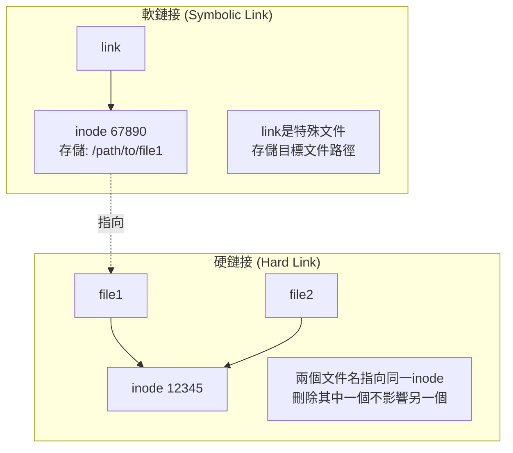
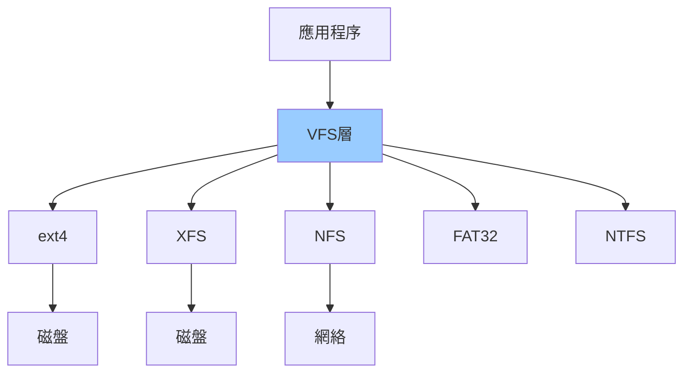
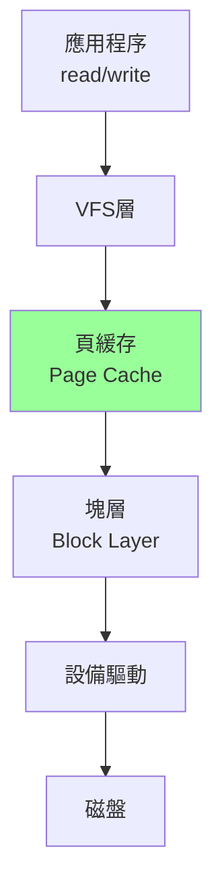
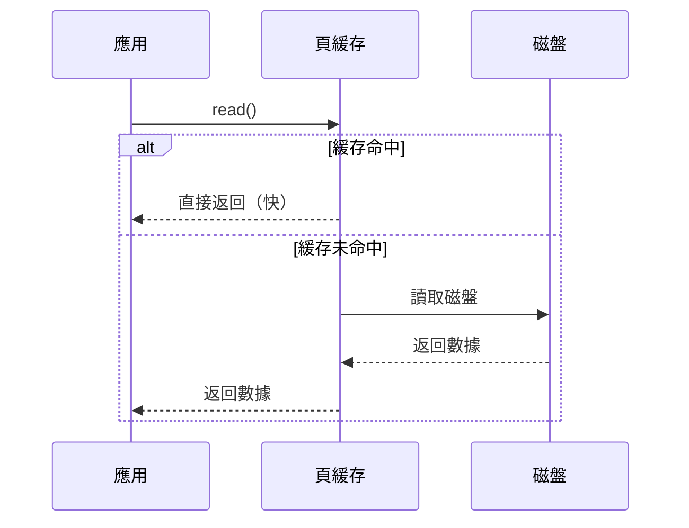
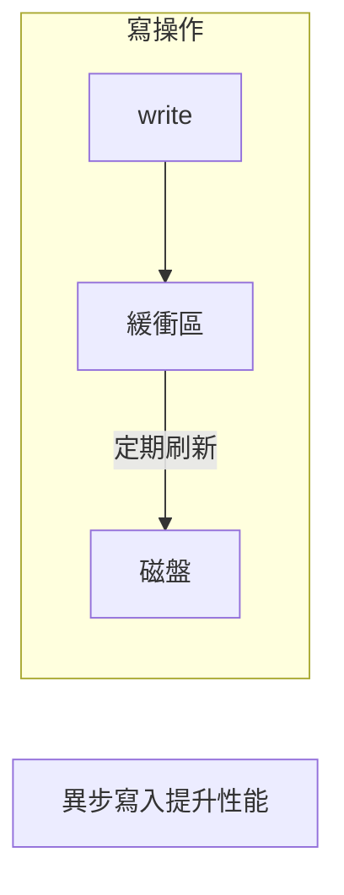

# 06-文件系統與I/O (File System & I/O)

## 文件系統概述

### 什麼是文件系統？

**組織和管理存儲設備上數據的方式。**



### Linux一切皆文件



---

## 文件描述符 (File Descriptor, FD)

### 核心概念

**文件描述符是內核給進程的整數句柄，用於訪問文件。**


### 標準文件描述符

| FD | 名稱 | 說明 |
|----|------|------|
| 0 | stdin | 標準輸入 |
| 1 | stdout | 標準輸出 |
| 2 | stderr | 標準錯誤 |

```c
// 示例
printf("hello");           // 寫到fd=1 (stdout)
fprintf(stderr, "error");  // 寫到fd=2 (stderr)
scanf("%d", &n);           // 從fd=0 (stdin)讀
```

### 文件描述符操作

```c
#include <fcntl.h>
#include <unistd.h>

// 打開文件
int fd = open("/path/to/file", O_RDONLY);
if (fd == -1) {
    perror("open");
    return 1;
}

// 讀取
char buf[100];
ssize_t n = read(fd, buf, sizeof(buf));

// 寫入
write(fd, "data", 4);

// 關閉
close(fd);
```

### 文件描述符表



---

## inode結構

### 什麼是inode？

**存儲文件元數據的數據結構（不包含文件名）。**



### inode與文件名的關係



### 查看inode

```bash
# 查看文件inode
ls -i file.txt
# 12345 file.txt

# 查看詳細信息
stat file.txt
#   File: file.txt
#   Size: 1024      	Blocks: 8          IO Block: 4096
# Device: 802h/2050d	Inode: 12345      Links: 1
# Access: 2024-01-01 10:00:00
# Modify: 2024-01-01 10:00:00
# Change: 2024-01-01 10:00:00
```

### 硬鏈接 vs 軟鏈接



```bash
# 創建硬鏈接
ln file1 file2

# 創建軟鏈接
ln -s file1 link

# 查看鏈接數
ls -l file1
# -rw-r--r-- 2 user group ...  # 2表示有2個硬鏈接
```

---

## VFS (Virtual File System)

### 虛擬文件系統層

**VFS提供統一接口，支持多種文件系統。**



### VFS對象

```c
// 簡化的VFS結構
struct file_operations {
    ssize_t (*read)(struct file *, char __user *, size_t, loff_t *);
    ssize_t (*write)(struct file *, const char __user *, size_t, loff_t *);
    int (*open)(struct inode *, struct file *);
    int (*release)(struct inode *, struct file *);
};

// 每個文件系統實現這些操作
```

---

## 磁盤I/O

### I/O棧



### 頁緩存 (Page Cache)

**內核緩存最近訪問的文件數據。**



### 緩衝區 (Buffer)



### 同步與異步I/O

```c
// 1. 阻塞I/O（默認）
int fd = open("file.txt", O_RDONLY);
read(fd, buf, size);  // ← 阻塞直到數據就緒

// 2. 非阻塞I/O
int fd = open("file.txt", O_RDONLY | O_NONBLOCK);
ssize_t n = read(fd, buf, size);
if (n == -1 && errno == EAGAIN) {
    // 數據未就緒，稍後重試
}

// 3. 異步I/O (aio)
struct aiocb cb;
aio_read(&cb);  // 立即返回
// ... 做其他事情
aio_suspend(&cb);  // 等待完成
```

### Direct I/O

```c
// 繞過頁緩存，直接訪問磁盤
int fd = open("file.txt", O_RDONLY | O_DIRECT);
// 數據庫常用，避免雙重緩存
```

---

## 文件系統類型

### ext4

**Linux默認文件系統。**

特點：
- 支持大文件（16TB）
- 日誌功能（崩潰恢復）
- 延遲分配（性能優化）
- 在線碎片整理

```bash
# 格式化為ext4
mkfs.ext4 /dev/sdb1

# 掛載
mount /dev/sdb1 /mnt

# 查看文件系統
df -T
```

### XFS

**高性能文件系統。**

特點：
- 大文件性能好
- 並行I/O
- 適合高並發

### Btrfs

**現代寫時複製文件系統。**

特點：
- 快照
- 壓縮
- RAID支持

---

## 後端I/O優化

### 1. 減少系統調用

```python
# 錯誤：逐字節讀取
for i in range(file_size):
    byte = file.read(1)  # 每次系統調用

# 正確：批量讀取
data = file.read(4096)  # 一次讀4KB
```

### 2. 使用緩衝I/O

```c
// C語言 - 使用緩衝
FILE* fp = fopen("file.txt", "r");  // 有緩衝
char buf[4096];
fread(buf, 1, sizeof(buf), fp);
fclose(fp);
```

### 3. 順序訪問 vs 隨機訪問

```
順序讀取（快）: ████████████
隨機讀取（慢）: █  █   █ █  █

磁盤順序讀: ~100MB/s
磁盤隨機讀: ~1MB/s（HDD）
SSD隨機讀: ~50MB/s
```

### 4. 預讀與預寫

```c
// 預讀
posix_fadvise(fd, 0, 0, POSIX_FADV_SEQUENTIAL);

// 預寫
fallocate(fd, 0, 0, size);  // 預分配空間
```

### 5. mmap映射

```c
// 內存映射文件
int fd = open("file.dat", O_RDWR);
void* addr = mmap(NULL, size, PROT_READ|PROT_WRITE, 
                  MAP_SHARED, fd, 0);

// 直接操作內存
((char*)addr)[100] = 'x';

munmap(addr, size);
```

---

## 監控I/O性能

```bash
# iostat - I/O統計
iostat -x 1
# Device  r/s  w/s  rkB/s  wkB/s  await  %util
# sda     100  50   4096   2048   5.2    45%

# iotop - 進程I/O排序
sudo iotop

# 查看頁緩存
free -h
#              total   used   free   shared  buff/cache
# Mem:           16G    5G     2G     500M      9G

# 清空緩存（測試用）
echo 3 > /proc/sys/vm/drop_caches
```

---

## 關鍵要點

1. **文件描述符是核心**
   - 進程訪問文件的句柄
   - 理解fd=0,1,2

2. **inode存儲元數據**
   - 文件名在目錄中
   - inode存儲實際信息

3. **VFS統一接口**
   - 支持多種文件系統
   - 對應用透明

4. **頁緩存提升性能**
   - 緩存熱數據
   - 減少磁盤訪問

5. **I/O優化策略**
   - 批量操作
   - 順序訪問
   - 使用緩衝
   - mmap大文件

---

## 下一章預告

**07-I/O多路復用**（重點epoll）將深入探討：
- select/poll/epoll原理
- epoll詳細實現
- 水平觸發 vs 邊緣觸發
- Reactor模式
- 高性能服務器設計
