# 07-I/O多路復用 (I/O Multiplexing) - 重點epoll

## 為什麼需要I/O多路復用？

### 問題場景

**服務器需要同時處理多個客戶端連接。**

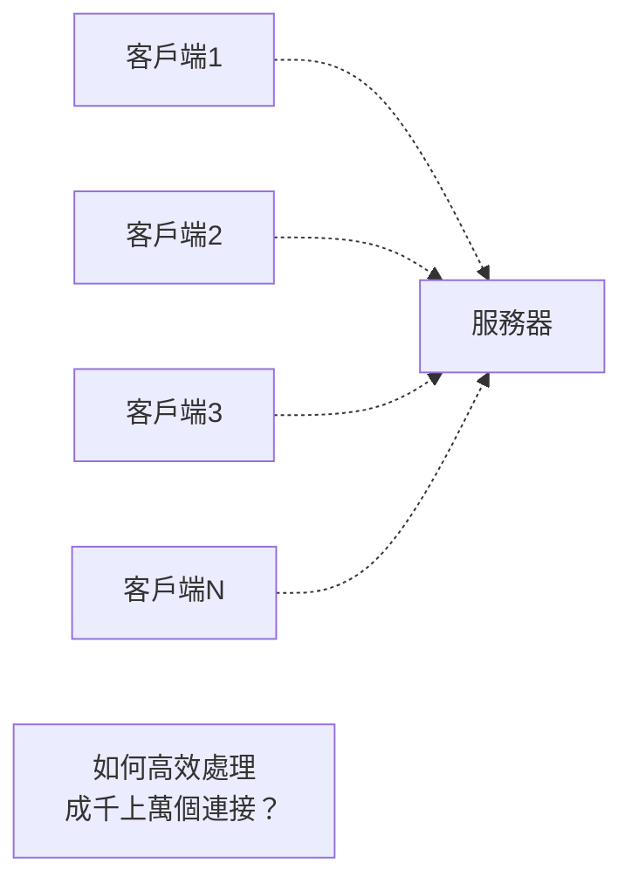

### 傳統方案的問題

**方案1：為每個連接創建一個進程/線程**
```c
while (1) {
    int client_fd = accept(server_fd, ...);
    
    if (fork() == 0) {  // 創建子進程
        handle_client(client_fd);
        exit(0);
    }
}
```

❌ 問題：
- 創建進程/線程開銷大
- 上下文切換頻繁
- 內存消耗大（每個線程~1MB）
- C10K問題：無法支持10000個並發連接

**方案2：非阻塞I/O + 輪詢**
```c
// 設置非阻塞
fcntl(fd, F_SETFL, O_NONBLOCK);

// 不斷輪詢
while (1) {
    for (int i = 0; i < num_fds; i++) {
        read(fds[i], buf, size);  // 立即返回
    }
}
```

❌ 問題：
- CPU空轉，浪費資源
- 效率極低

---

## I/O模型對比

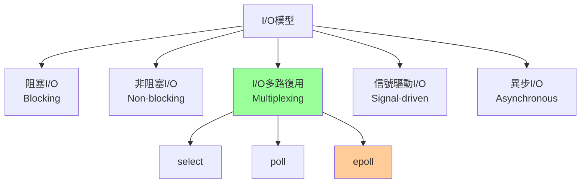

### 同步 vs 異步

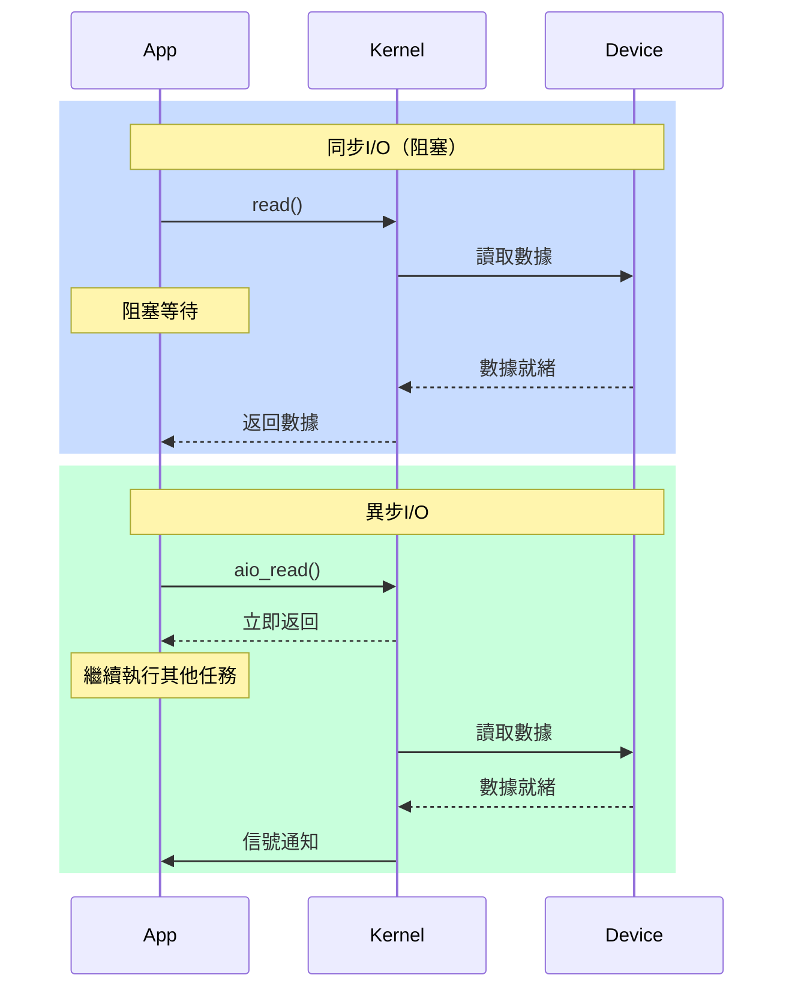

---

## select

### 原理

**監視多個文件描述符，等待其中任何一個就緒。**

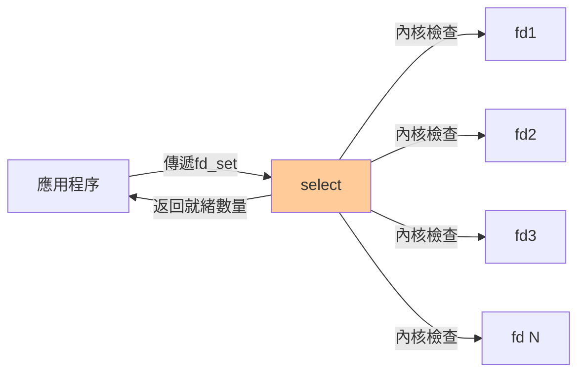

### API

```c
#include <sys/select.h>

int select(int nfds,                // 最大fd+1
           fd_set *readfds,         // 讀fd集合
           fd_set *writefds,        // 寫fd集合
           fd_set *exceptfds,       // 異常fd集合
           struct timeval *timeout); // 超時

// fd_set操作宏
FD_ZERO(&set);        // 清空集合
FD_SET(fd, &set);     // 添加fd
FD_CLR(fd, &set);     // 移除fd
FD_ISSET(fd, &set);   // 檢查fd是否在集合中
```

### 使用示例

```c
#include <sys/select.h>
#include <stdio.h>

int main() {
    int server_fd = socket(...);
    bind(server_fd, ...);
    listen(server_fd, 5);
    
    fd_set master_set, read_set;
    FD_ZERO(&master_set);
    FD_SET(server_fd, &master_set);
    
    int max_fd = server_fd;
    
    while (1) {
        read_set = master_set;  // 複製（select會修改）
        
        int ret = select(max_fd + 1, &read_set, NULL, NULL, NULL);
        
        if (ret < 0) {
            perror("select");
            break;
        }
        
        // 遍歷所有fd
        for (int fd = 0; fd <= max_fd; fd++) {
            if (FD_ISSET(fd, &read_set)) {
                if (fd == server_fd) {
                    // 新連接
                    int client_fd = accept(server_fd, ...);
                    FD_SET(client_fd, &master_set);
                    if (client_fd > max_fd) max_fd = client_fd;
                } else {
                    // 數據就緒
                    char buf[1024];
                    int n = read(fd, buf, sizeof(buf));
                    if (n <= 0) {
                        close(fd);
                        FD_CLR(fd, &master_set);
                    } else {
                        // 處理數據
                        handle_data(buf, n);
                    }
                }
            }
        }
    }
    
    return 0;
}
```

### select的限制

❌ **缺點**：

1. **fd數量限制**：默認最大1024（FD_SETSIZE）
```c
// 定義在 <sys/select.h>
#define FD_SETSIZE 1024
```

2. **每次調用都要拷貝fd_set**
```
用戶空間 fd_set → 內核空間
內核空間 fd_set → 用戶空間
```

3. **需要遍歷所有fd**
```c
// O(n)複雜度
for (int fd = 0; fd <= max_fd; fd++) {
    if (FD_ISSET(fd, &read_set)) {
        // 處理
    }
}
```

4. **內核需要輪詢所有fd**
```c
// 內核實現（簡化）
for (each fd in fd_set) {
    if (fd_is_ready(fd)) {
        mark_ready(fd);
    }
}
```

---

## poll

### 改進

**使用pollfd結構替代fd_set，無1024限制。**

### API

```c
#include <poll.h>

struct pollfd {
    int fd;         // 文件描述符
    short events;   // 監聽的事件
    short revents;  // 返回的事件
};

int poll(struct pollfd *fds,  // pollfd數組
         nfds_t nfds,          // 數組大小
         int timeout);          // 超時（毫秒）
```

### 使用示例

```c
#include <poll.h>

#define MAX_CLIENTS 1000

int main() {
    struct pollfd fds[MAX_CLIENTS];
    int num_fds = 0;
    
    int server_fd = socket(...);
    bind(server_fd, ...);
    listen(server_fd, 5);
    
    fds[0].fd = server_fd;
    fds[0].events = POLLIN;  // 監聽可讀事件
    num_fds = 1;
    
    while (1) {
        int ret = poll(fds, num_fds, -1);  // -1表示無限等待
        
        if (ret < 0) {
            perror("poll");
            break;
        }
        
        for (int i = 0; i < num_fds; i++) {
            if (fds[i].revents & POLLIN) {
                if (fds[i].fd == server_fd) {
                    // 新連接
                    int client_fd = accept(server_fd, ...);
                    fds[num_fds].fd = client_fd;
                    fds[num_fds].events = POLLIN;
                    num_fds++;
                } else {
                    // 數據就緒
                    char buf[1024];
                    int n = read(fds[i].fd, buf, sizeof(buf));
                    if (n <= 0) {
                        close(fds[i].fd);
                        // 移除fd（交換到末尾並減少計數）
                        fds[i] = fds[num_fds - 1];
                        num_fds--;
                        i--;
                    }
                }
            }
        }
    }
    
    return 0;
}
```

### poll vs select

| 特性 | select | poll |
|------|--------|------|
| **fd數量** | 限制1024 | 無限制 |
| **數據結構** | fd_set（位圖） | pollfd數組 |
| **性能** | O(n) | O(n) |
| **可移植性** | 好 | 較好 |

❌ **poll仍然有的問題**：
- 每次調用需要拷貝整個pollfd數組
- 需要遍歷所有fd查找就緒的
- 內核需要輪詢所有fd

---

## epoll - 詳解

### 為什麼epoll最優？

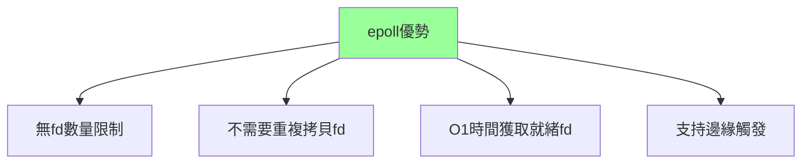

### epoll API

```c
#include <sys/epoll.h>

// 1. 創建epoll實例
int epfd = epoll_create1(0);

// 2. 控制epoll（添加/修改/刪除fd）
int epoll_ctl(int epfd,           // epoll實例
              int op,              // 操作類型
              int fd,              // 目標fd
              struct epoll_event *event);

// op可以是：
// EPOLL_CTL_ADD  - 添加fd
// EPOLL_CTL_MOD  - 修改fd的事件
// EPOLL_CTL_DEL  - 刪除fd

// 3. 等待事件
int epoll_wait(int epfd,
               struct epoll_event *events,  // 輸出事件數組
               int maxevents,                // 數組大小
               int timeout);                 // 超時（毫秒）

// epoll_event結構
struct epoll_event {
    uint32_t events;   // 事件類型
    epoll_data_t data; // 用戶數據
};

typedef union epoll_data {
    void *ptr;
    int fd;
    uint32_t u32;
    uint64_t u64;
} epoll_data_t;
```

### 事件類型

| 事件 | 說明 |
|------|------|
| **EPOLLIN** | 可讀 |
| **EPOLLOUT** | 可寫 |
| **EPOLLERR** | 錯誤 |
| **EPOLLHUP** | 掛斷 |
| **EPOLLET** | 邊緣觸發模式 |
| **EPOLLONESHOT** | 一次性監聽 |

### 使用示例

```c
#include <sys/epoll.h>
#include <stdio.h>
#include <stdlib.h>
#include <unistd.h>
#include <string.h>
#include <fcntl.h>

#define MAX_EVENTS 10
#define BUFFER_SIZE 1024

// 設置非阻塞
void set_nonblocking(int fd) {
    int flags = fcntl(fd, F_GETFL, 0);
    fcntl(fd, F_SETFL, flags | O_NONBLOCK);
}

int main() {
    // 創建socket
    int server_fd = socket(AF_INET, SOCK_STREAM, 0);
    
    struct sockaddr_in addr;
    addr.sin_family = AF_INET;
    addr.sin_port = htons(8080);
    addr.sin_addr.s_addr = INADDR_ANY;
    
    bind(server_fd, (struct sockaddr*)&addr, sizeof(addr));
    listen(server_fd, 5);
    
    set_nonblocking(server_fd);
    
    // 創建epoll實例
    int epfd = epoll_create1(0);
    if (epfd == -1) {
        perror("epoll_create1");
        return 1;
    }
    
    // 添加server_fd到epoll
    struct epoll_event ev;
    ev.events = EPOLLIN;  // 監聽可讀事件
    ev.data.fd = server_fd;
    
    if (epoll_ctl(epfd, EPOLL_CTL_ADD, server_fd, &ev) == -1) {
        perror("epoll_ctl");
        return 1;
    }
    
    struct epoll_event events[MAX_EVENTS];
    
    printf("Server listening on port 8080...\n");
    
    // 事件循環
    while (1) {
        // 等待事件
        int nfds = epoll_wait(epfd, events, MAX_EVENTS, -1);
        
        if (nfds == -1) {
            perror("epoll_wait");
            break;
        }
        
        // 處理就緒的事件
        for (int i = 0; i < nfds; i++) {
            int fd = events[i].data.fd;
            
            if (fd == server_fd) {
                // 新連接到達
                while (1) {
                    int client_fd = accept(server_fd, NULL, NULL);
                    if (client_fd == -1) {
                        break;  // 沒有更多連接
                    }
                    
                    set_nonblocking(client_fd);
                    
                    // 添加client_fd到epoll
                    ev.events = EPOLLIN | EPOLLET;  // 邊緣觸發
                    ev.data.fd = client_fd;
                    epoll_ctl(epfd, EPOLL_CTL_ADD, client_fd, &ev);
                    
                    printf("New client connected: fd=%d\n", client_fd);
                }
            } else {
                // 客戶端數據就緒
                char buf[BUFFER_SIZE];
                
                while (1) {
                    ssize_t n = read(fd, buf, sizeof(buf));
                    
                    if (n > 0) {
                        // 處理數據
                        write(fd, buf, n);  // echo回去
                    } else if (n == 0) {
                        // 連接關閉
                        printf("Client disconnected: fd=%d\n", fd);
                        epoll_ctl(epfd, EPOLL_CTL_DEL, fd, NULL);
                        close(fd);
                        break;
                    } else {
                        if (errno != EAGAIN) {
                            perror("read");
                            close(fd);
                        }
                        break;  // EAGAIN: 數據讀完
                    }
                }
            }
        }
    }
    
    close(server_fd);
    close(epfd);
    return 0;
}
```

---

## epoll內部實現

### 數據結構

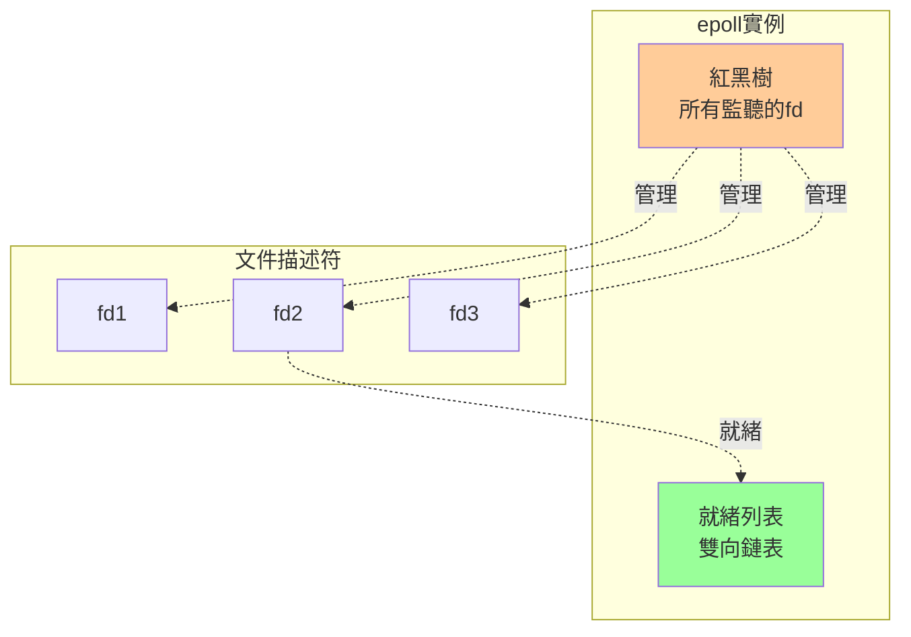

**紅黑樹**：
- 存儲所有監聽的fd
- O(log n)時間添加/刪除
- 快速查找

**就緒列表**：
- 存儲就緒的fd
- O(1)時間獲取就緒fd
- epoll_wait直接返回這個列表

### epoll_ctl工作流程

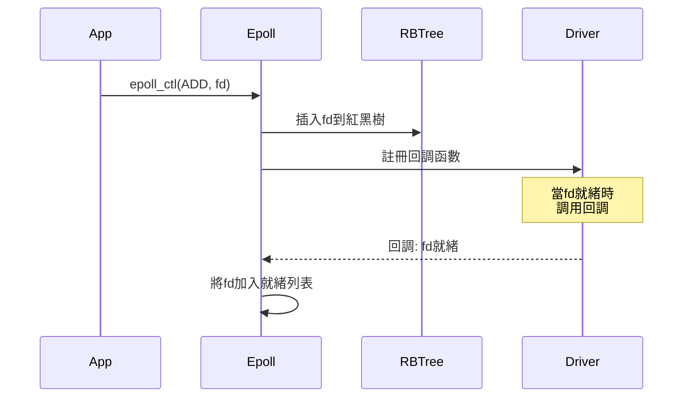

### epoll_wait工作流程

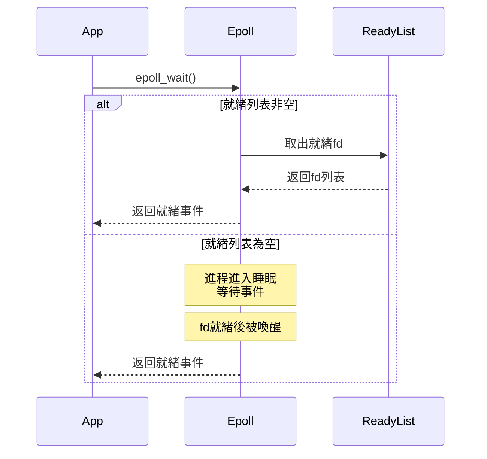

### 為什麼高效？

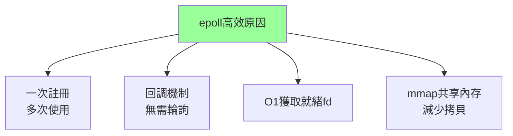

**select/poll vs epoll**：
```
select/poll:
1. 每次調用拷貝整個fd集合
2. 內核輪詢所有fd檢查就緒
3. 遍歷所有fd找到就緒的

epoll:
1. 只在epoll_ctl時操作
2. 回調機制，fd就緒時主動通知
3. 直接返回就緒列表
```

---

## 水平觸發 vs 邊緣觸發

### LT (Level-Triggered) - 水平觸發

**只要fd處於就緒狀態，就會持續通知。**

```mermaid
gantt
    title 水平觸發（LT）
    dateFormat X
    axisFormat %L
    
    section 數據到達
    100字節到達 :0, 1
    
    section epoll_wait
    通知1 :1, 2
    通知2 :2, 3
    通知3 :3, 4
    通知N :4, 5
```

**特點**：
- 默認模式
- 類似select/poll
- 即使沒有讀完數據，下次epoll_wait仍會通知
- **安全、容易使用**

```c
// LT模式示例
ev.events = EPOLLIN;  // 默認就是LT
epoll_ctl(epfd, EPOLL_CTL_ADD, fd, &ev);

// 可以只讀部分數據
char buf[10];
read(fd, buf, 10);  // 假設有100字節數據
// 下次epoll_wait還會通知這個fd
```

### ET (Edge-Triggered) - 邊緣觸發

**只在狀態變化時通知一次。**

```mermaid
gantt
    title 邊緣觸發（ET）
    dateFormat X
    axisFormat %L
    
    section 數據到達
    100字節到達 :0, 1
    
    section epoll_wait
    通知1次 :1, 2
    不再通知 :milestone, 2, 0d
```

**特點**：
- 需要顯式設置EPOLLET
- 高性能，減少通知次數
- **必須一次讀完所有數據**
- **必須使用非阻塞I/O**

```c
// ET模式示例
set_nonblocking(fd);  // 必須非阻塞

ev.events = EPOLLIN | EPOLLET;  // 邊緣觸發
epoll_ctl(epfd, EPOLL_CTL_ADD, fd, &ev);

// 必須讀完所有數據
while (1) {
    char buf[1024];
    ssize_t n = read(fd, buf, sizeof(buf));
    if (n > 0) {
        // 處理數據
    } else if (n == 0) {
        // 連接關閉
        break;
    } else {
        if (errno == EAGAIN) {
            // 數據讀完了，正常退出
            break;
        }
        // 其他錯誤
        break;
    }
}
```

### LT vs ET對比

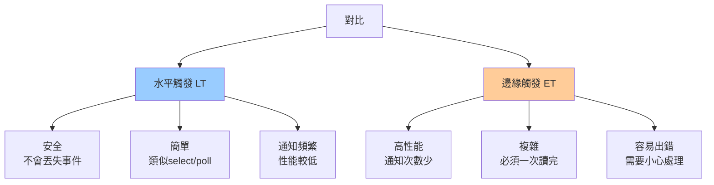

| 特性 | LT | ET |
|------|----|----|
| **通知次數** | 多 | 少 |
| **編程難度** | 簡單 | 複雜 |
| **性能** | 較低 | 高 |
| **是否需要非阻塞** | 否 | 是 |
| **數據處理** | 可分批 | 必須一次讀完 |
| **安全性** | 高 | 需小心 |

### 選擇建議

```python
# 選擇LT還是ET？

if 追求性能 and 能處理複雜性:
    use ET
elif 代碼簡單、維護性優先:
    use LT
else:
    use LT  # 默認選擇
```

---

## Reactor模式

### 設計模式

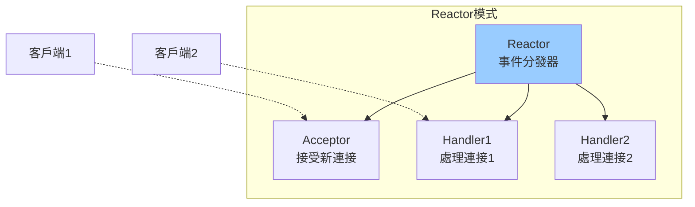

### 實現

```cpp
// C++ Reactor模式示例
class Reactor {
private:
    int epfd;
    std::map<int, EventHandler*> handlers;
    
public:
    Reactor() {
        epfd = epoll_create1(0);
    }
    
    void register_handler(int fd, EventHandler* handler, uint32_t events) {
        handlers[fd] = handler;
        
        struct epoll_event ev;
        ev.events = events;
        ev.data.fd = fd;
        epoll_ctl(epfd, EPOLL_CTL_ADD, fd, &ev);
    }
    
    void run() {
        struct epoll_event events[MAX_EVENTS];
        
        while (true) {
            int nfds = epoll_wait(epfd, events, MAX_EVENTS, -1);
            
            for (int i = 0; i < nfds; i++) {
                int fd = events[i].data.fd;
                EventHandler* handler = handlers[fd];
                
                if (events[i].events & EPOLLIN) {
                    handler->on_readable(fd);
                }
                if (events[i].events & EPOLLOUT) {
                    handler->on_writable(fd);
                }
            }
        }
    }
};

class EventHandler {
public:
    virtual void on_readable(int fd) = 0;
    virtual void on_writable(int fd) = 0;
};
```

---

## 高性能服務器架構

### 單Reactor單線程

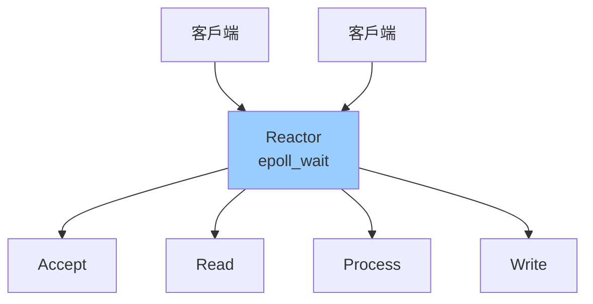

**優點**：簡單
**缺點**：無法利用多核

### 單Reactor多線程

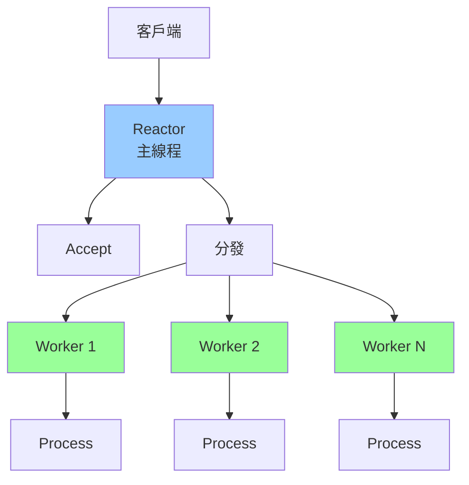

**Nginx、Redis使用類似架構**

### 多Reactor多線程

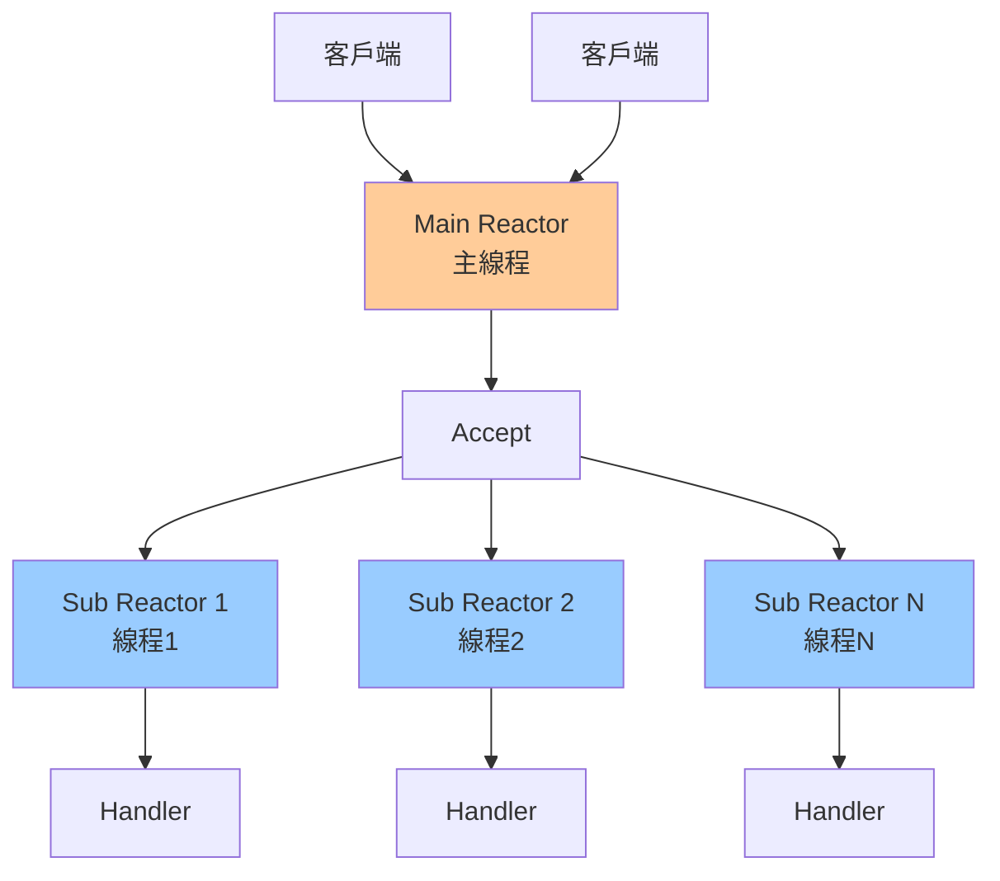

**Netty、Memcached使用此架構**

---

## 實戰：高性能Echo服務器

```c
// 完整的高性能Echo服務器（ET模式）
#include <sys/epoll.h>
#include <sys/socket.h>
#include <netinet/in.h>
#include <fcntl.h>
#include <unistd.h>
#include <stdio.h>
#include <stdlib.h>
#include <string.h>
#include <errno.h>

#define PORT 8080
#define MAX_EVENTS 1024
#define BUFFER_SIZE 4096

void set_nonblocking(int fd) {
    int flags = fcntl(fd, F_GETFL, 0);
    fcntl(fd, F_SETFL, flags | O_NONBLOCK);
}

int main() {
    // 創建socket
    int server_fd = socket(AF_INET, SOCK_STREAM, 0);
    int opt = 1;
    setsockopt(server_fd, SOL_SOCKET, SO_REUSEADDR, &opt, sizeof(opt));
    
    struct sockaddr_in addr = {
        .sin_family = AF_INET,
        .sin_port = htons(PORT),
        .sin_addr.s_addr = INADDR_ANY
    };
    
    bind(server_fd, (struct sockaddr*)&addr, sizeof(addr));
    listen(server_fd, 128);
    set_nonblocking(server_fd);
    
    // 創建epoll
    int epfd = epoll_create1(0);
    struct epoll_event ev, events[MAX_EVENTS];
    
    ev.events = EPOLLIN | EPOLLET;
    ev.data.fd = server_fd;
    epoll_ctl(epfd, EPOLL_CTL_ADD, server_fd, &ev);
    
    printf("Server running on port %d\n", PORT);
    
    while (1) {
        int nfds = epoll_wait(epfd, events, MAX_EVENTS, -1);
        
        for (int i = 0; i < nfds; i++) {
            int fd = events[i].data.fd;
            
            if (fd == server_fd) {
                // Accept所有新連接
                while (1) {
                    int client_fd = accept(server_fd, NULL, NULL);
                    if (client_fd == -1) {
                        if (errno != EAGAIN && errno != EWOULDBLOCK) {
                            perror("accept");
                        }
                        break;
                    }
                    
                    set_nonblocking(client_fd);
                    
                    ev.events = EPOLLIN | EPOLLET;
                    ev.data.fd = client_fd;
                    epoll_ctl(epfd, EPOLL_CTL_ADD, client_fd, &ev);
                    
                    printf("New connection: fd=%d\n", client_fd);
                }
            } else {
                // 處理客戶端數據（必須讀完）
                char buf[BUFFER_SIZE];
                
                while (1) {
                    ssize_t n = read(fd, buf, sizeof(buf));
                    
                    if (n > 0) {
                        // Echo回去
                        write(fd, buf, n);
                    } else if (n == 0) {
                        // 連接關閉
                        printf("Connection closed: fd=%d\n", fd);
                        epoll_ctl(epfd, EPOLL_CTL_DEL, fd, NULL);
                        close(fd);
                        break;
                    } else {
                        if (errno == EAGAIN) {
                            // 數據讀完
                            break;
                        }
                        // 錯誤
                        perror("read");
                        epoll_ctl(epfd, EPOLL_CTL_DEL, fd, NULL);
                        close(fd);
                        break;
                    }
                }
            }
        }
    }
    
    close(server_fd);
    close(epfd);
    return 0;
}
```

---

## 性能測試

### 壓測工具

```bash
# 1. wrk
wrk -t12 -c400 -d30s http://localhost:8080

# 2. ab (Apache Bench)
ab -n 100000 -c 1000 http://localhost:8080/

# 3. siege
siege -c 1000 -r 100 http://localhost:8080
```

### 性能對比

| 模型 | QPS | 並發連接數 | CPU使用率 |
|------|-----|-----------|----------|
| **多進程** | 1,000 | 100 | 高 |
| **多線程** | 5,000 | 1,000 | 高 |
| **select** | 10,000 | 1,024 | 中 |
| **poll** | 10,000 | 無限 | 中 |
| **epoll (LT)** | 50,000 | 100,000 | 低 |
| **epoll (ET)** | 100,000 | 100,000 | 低 |

---

## 關鍵要點

1. **epoll解決C10K問題**
   - 支持百萬並發連接
   - O(1)時間複雜度

2. **理解LT vs ET**
   - LT：安全簡單，默認選擇
   - ET：高性能，需小心使用

3. **epoll三步驟**
   - epoll_create：創建實例
   - epoll_ctl：管理fd
   - epoll_wait：等待事件

4. **ET模式要點**
   - 必須非阻塞I/O
   - 必須讀完所有數據
   - 使用while循環讀到EAGAIN

5. **實際應用**
   - Nginx：多進程+epoll
   - Redis：單線程+epoll
   - Node.js：單線程+epoll

---

## 下一章預告

**08-系統調用與內核機制**將探討：
- 系統調用原理
- 用戶態與內核態切換
- 中斷與異常
- 系統調用開銷
- vDSO優化
- strace調試工具
