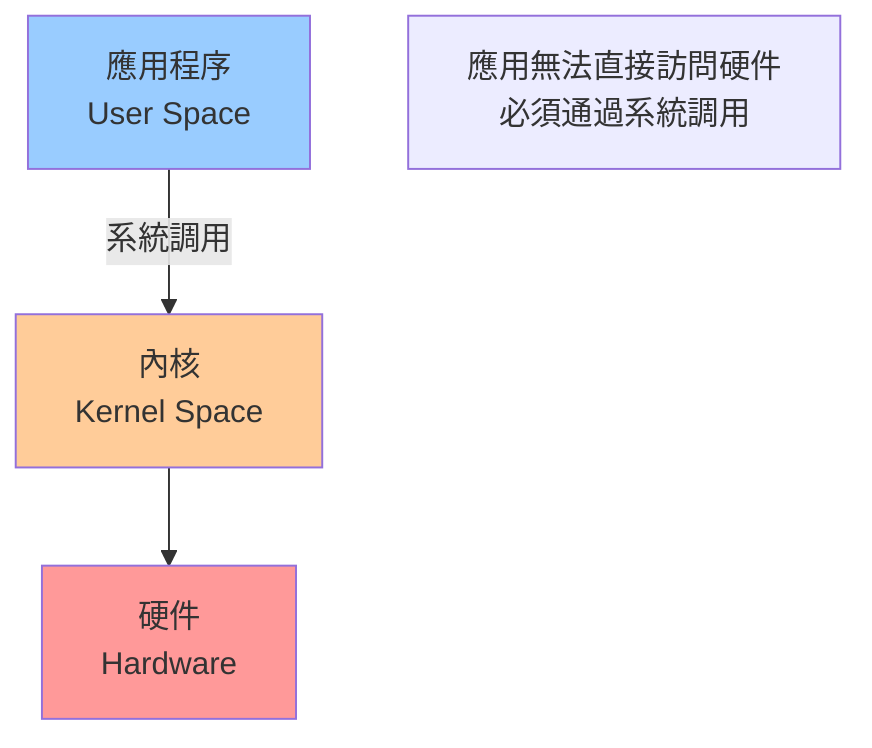
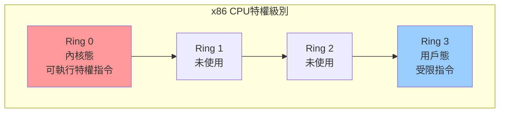
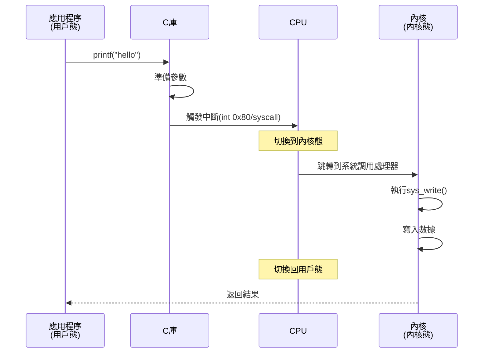
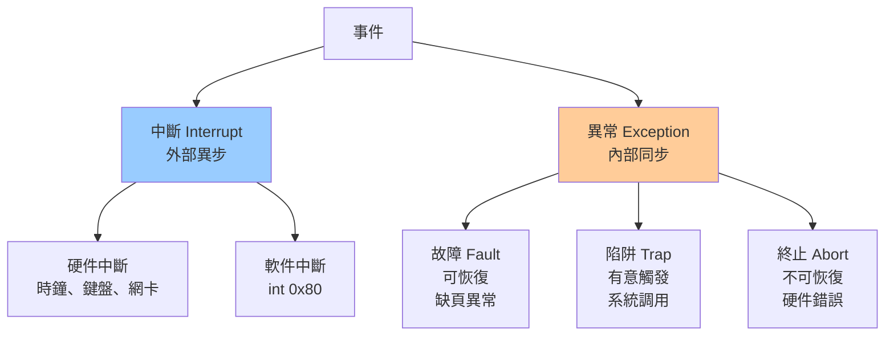
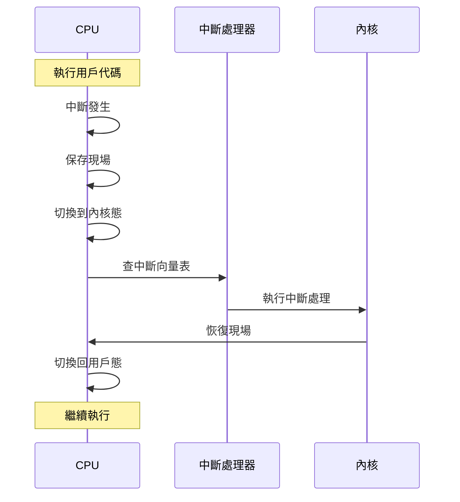
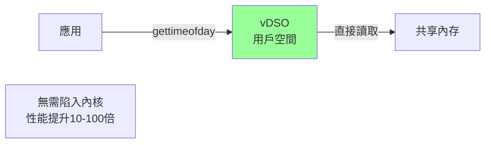

# 08-系統調用與內核機制 (System Call & Kernel Mechanism)

## 什麼是系統調用？

**應用程序請求內核服務的接口。**



---

## 用戶態與內核態

### 特權級別



### 為什麼需要兩種模式？

**安全性與穩定性**

| 模式 | 可執行操作 | 崩潰影響 |
|------|----------|---------|
| **用戶態** | 普通指令 | 只影響當前進程 |
| **內核態** | 所有指令 | 可能導致系統崩潰 |

**特權指令**：
- 訪問I/O端口
- 修改頁表
- 禁用中斷
- 訪問控制寄存器

---

## 系統調用流程

### 完整流程



### 系統調用表

```c
// Linux系統調用表（簡化）
#define __NR_read     0
#define __NR_write    1
#define __NR_open     2
#define __NR_close    3
#define __NR_fork     57
#define __NR_execve   59
#define __NR_exit     60

// 內核中的系統調用表
void *sys_call_table[] = {
    sys_read,     // 0
    sys_write,    // 1
    sys_open,     // 2
    sys_close,    // 3
    // ...
};
```

### 系統調用開銷

```
用戶態函數調用:    ~5 ns
系統調用:         ~100 ns (約20倍)

開銷來源：
1. 保存用戶態寄存器
2. 切換到內核態
3. 查系統調用表
4. 執行內核函數
5. 恢復用戶態寄存器
6. 切換回用戶態
```

---

## 常見系統調用

### 1. 進程管理

```c
// fork - 創建子進程
pid_t pid = fork();

// exec - 執行新程序
execve("/bin/ls", argv, envp);

// exit - 終止進程
exit(0);

// wait - 等待子進程
wait(&status);
```

### 2. 文件操作

```c
// open - 打開文件
int fd = open("/path/file", O_RDONLY);

// read - 讀取
ssize_t n = read(fd, buf, count);

// write - 寫入
ssize_t n = write(fd, buf, count);

// close - 關閉
close(fd);

// lseek - 定位
off_t pos = lseek(fd, offset, SEEK_SET);
```

### 3. 內存管理

```c
// brk/sbrk - 調整堆大小
int brk(void *addr);

// mmap - 內存映射
void *addr = mmap(NULL, len, PROT_READ|PROT_WRITE,
                  MAP_PRIVATE|MAP_ANONYMOUS, -1, 0);

// munmap - 解除映射
munmap(addr, len);
```

### 4. 網絡通信

```c
// socket - 創建套接字
int sockfd = socket(AF_INET, SOCK_STREAM, 0);

// bind - 綁定地址
bind(sockfd, (struct sockaddr*)&addr, sizeof(addr));

// listen - 監聽
listen(sockfd, backlog);

// accept - 接受連接
int connfd = accept(sockfd, (struct sockaddr*)&client, &len);
```

---

## 直接使用系統調用

### syscall函數

```c
#include <unistd.h>
#include <sys/syscall.h>

// 直接調用系統調用
long result = syscall(SYS_write, fd, buf, count);
```

### 內聯彙編

```c
// x86-64 彙編實現write
ssize_t my_write(int fd, const void *buf, size_t count) {
    ssize_t ret;
    asm volatile (
        "movq $1, %%rax\n"      // syscall number
        "movq %1, %%rdi\n"      // fd
        "movq %2, %%rsi\n"      // buf
        "movq %3, %%rdx\n"      // count
        "syscall\n"
        "movq %%rax, %0\n"
        : "=r"(ret)
        : "r"((long)fd), "r"(buf), "r"(count)
        : "rax", "rdi", "rsi", "rdx", "memory"
    );
    return ret;
}
```

---

## 中斷與異常

### 分類



### 中斷向量表

```c
// 中斷向量表（簡化）
void (*interrupt_handlers[256])();

// 中斷0: 除零錯誤
interrupt_handlers[0] = divide_error_handler;

// 中斷14: 缺頁異常
interrupt_handlers[14] = page_fault_handler;

// 中斷128: 系統調用
interrupt_handlers[128] = system_call_handler;
```

### 中斷處理流程



---

## vDSO優化

### 什麼是vDSO？

**Virtual Dynamic Shared Object - 將常用系統調用映射到用戶空間。**



### vDSO加速的系統調用

```c
// 這些調用通過vDSO加速
gettimeofday()    // 獲取時間
time()            // 獲取時間戳
clock_gettime()   // 高精度時間
getcpu()          // 獲取CPU編號
```

### 性能對比

```c
// 測試gettimeofday性能
#include <sys/time.h>
#include <stdio.h>

int main() {
    struct timeval tv;
    
    // 使用vDSO（快）
    for (int i = 0; i < 1000000; i++) {
        gettimeofday(&tv, NULL);
    }
    // 約10ms
    
    // 傳統系統調用（慢）
    for (int i = 0; i < 1000000; i++) {
        syscall(SYS_gettimeofday, &tv, NULL);
    }
    // 約100ms
    
    return 0;
}
```

---

## strace調試工具

### 基本使用

```bash
# 追蹤程序的系統調用
strace ./myapp

# 輸出到文件
strace -o trace.log ./myapp

# 只顯示特定系統調用
strace -e open,read,write ./myapp

# 顯示時間戳
strace -t ./myapp

# 統計系統調用
strace -c ./myapp
```

### 示例輸出

```bash
$ strace -e open,read ./cat file.txt

open("/etc/ld.so.cache", O_RDONLY|O_CLOEXEC) = 3
open("/lib/x86_64-linux-gnu/libc.so.6", O_RDONLY|O_CLOEXEC) = 3
open("file.txt", O_RDONLY)              = 3
read(3, "Hello World\n", 131072)        = 12
read(3, "", 131072)                     = 0
+++ exited with 0 +++
```

### 性能分析

```bash
$ strace -c ./myapp

% time     seconds  usecs/call     calls    errors syscall
------ ----------- ----------- --------- --------- ----------------
 99.50    0.497500         497      1000           read
  0.30    0.001500          15       100           write
  0.20    0.001000          10       100           open
------ ----------- ----------- --------- --------- ----------------
100.00    0.500000                  1200           total
```

---

## 系統調用優化

### 1. 減少系統調用次數

```c
// 錯誤：頻繁調用
for (int i = 0; i < 1000; i++) {
    write(fd, &data[i], 1);  // 1000次系統調用
}

// 正確：批量調用
write(fd, data, 1000);  // 1次系統調用
```

### 2. 使用緩衝I/O

```c
// 標準I/O庫自動緩衝
FILE *fp = fopen("file.txt", "w");
for (int i = 0; i < 1000; i++) {
    fprintf(fp, "%d\n", i);  // 緩衝在用戶空間
}
fclose(fp);  // 最後一次性寫入
```

### 3. mmap替代read/write

```c
// 傳統方式
int fd = open("file", O_RDONLY);
char buf[SIZE];
read(fd, buf, SIZE);  // 系統調用 + 數據拷貝

// mmap方式
int fd = open("file", O_RDONLY);
char *data = mmap(NULL, SIZE, PROT_READ, MAP_PRIVATE, fd, 0);
// 直接訪問內存，按需頁面加載
```

### 4. 零拷貝技術

```c
// sendfile - 零拷貝發送文件
#include <sys/sendfile.h>

int in_fd = open("file", O_RDONLY);
int out_fd = socket(...);

// 直接在內核空間傳輸，無需用戶空間拷貝
sendfile(out_fd, in_fd, NULL, file_size);
```

---

## 關鍵要點

1. **系統調用是唯一接口**
   - 應用無法直接訪問硬件
   - 必須通過系統調用

2. **理解開銷**
   - 系統調用約100ns
   - 函數調用約5ns
   - 盡量減少系統調用次數

3. **用戶態/內核態切換**
   - 保存/恢復寄存器
   - 切換頁表
   - 這是主要開銷來源

4. **vDSO優化**
   - 常用調用映射到用戶空間
   - 無需陷入內核

5. **調試工具**
   - strace追蹤系統調用
   - 分析性能瓶頸
   - 定位錯誤

---

## 下一章預告

**09-後端性能調優實戰**將綜合應用所有知識：
- CPU性能分析
- 內存優化
- I/O優化
- 網絡調優
- 監控工具
- 實戰案例
