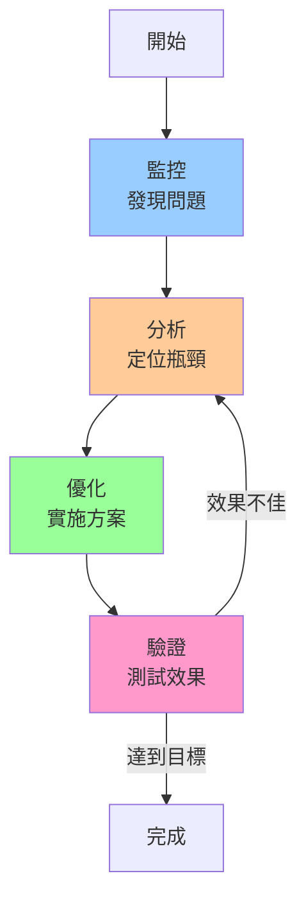

# 09-後端性能調優實戰 (Performance Tuning in Practice)

## 性能調優方法論



---

## CPU性能調優

### 1. 識別CPU瓶頸

```bash
# 查看整體CPU使用
top
# 關注指標：
# %us - 用戶態CPU
# %sy - 內核態CPU
# %wa - I/O等待
# %id - 空閒

# 詳細CPU統計
mpstat -P ALL 1
# CPU  %usr  %sys  %iowait  %idle
#   0   45    10       5      40
#   1   50    15       2      33

# 查看進程CPU使用
pidstat -u 1
```

### 2. CPU綁定

```bash
# 綁定進程到特定CPU
taskset -c 0,1 ./myapp

# 綁定運行中的進程
taskset -cp 0,1 12345
```

```python
# Python綁定CPU
import os
os.sched_setaffinity(0, {0, 1})  # 綁定到CPU 0和1
```

### 3. 減少上下文切換

```bash
# 查看上下文切換
vmstat 1
# r: 運行隊列長度
# cs: 上下文切換次數/秒

# 理想值：
# r <= CPU核心數
# cs < 10000
```

**優化策略**：
```python
# 錯誤：過多線程
for i in range(1000):
    threading.Thread(target=work).start()

# 正確：線程池
from concurrent.futures import ThreadPoolExecutor
with ThreadPoolExecutor(max_workers=4) as executor:
    executor.map(work, tasks)
```

### 4. 優先級調整

```bash
# 提高優先級（需root）
nice -n -10 ./important_app

# 降低優先級
nice -n 19 ./batch_job

# 修改運行中進程
renice -n 5 -p 12345
```

---

## 內存性能調優

### 1. 監控內存使用

```bash
# 內存概況
free -h
#               total  used  free  shared  buff/cache  available
# Mem:           16Gi   5Gi   2Gi    500M         9Gi       10Gi

# 詳細內存信息
cat /proc/meminfo | grep -E 'MemTotal|MemFree|Cached|Buffers'

# 進程內存使用
ps aux --sort=-%mem | head -10
pmap -x <pid>
```

### 2. 減少內存分配

```python
# 錯誤：頻繁創建對象
def process_data():
    for i in range(1000000):
        obj = MyObject()  # 頻繁分配
        process(obj)

# 正確：對象復用
def process_data():
    obj = MyObject()
    for i in range(1000000):
        obj.reset()
        process(obj)
```

### 3. 使用內存池

```cpp
// C++ 內存池
class MemoryPool {
    std::vector<char*> blocks;
    size_t block_size = 1024 * 1024;  // 1MB
    
public:
    void* allocate(size_t size) {
        // 從池中分配
        // 避免頻繁系統調用
    }
};
```

### 4. 大頁優化

```bash
# 配置大頁
echo 1024 > /proc/sys/vm/nr_hugepages

# 啟用透明大頁
echo always > /sys/kernel/mm/transparent_hugepage/enabled
```

### 5. 避免內存洩漏

```bash
# Valgrind檢測
valgrind --leak-check=full ./myapp

# 查看進程內存增長
watch -n 1 'ps aux | grep myapp'
```

---

## I/O性能調優

### 1. 監控I/O性能

```bash
# I/O統計
iostat -x 1
# Device  r/s  w/s  rkB/s  wkB/s  await  %util
# sda     100   50  4096   2048    5.2    45%

# 關注指標：
# await: 平均等待時間（ms）
# %util: 設備使用率
```

### 2. 批量I/O操作

```c
// 錯誤：逐字節寫入
for (int i = 0; i < 1000000; i++) {
    write(fd, &data[i], 1);
}

// 正確：批量寫入
write(fd, data, 1000000);
```

### 3. 使用緩衝I/O

```python
# 標準I/O自動緩衝
with open('file.txt', 'w', buffering=8192) as f:
    for line in data:
        f.write(line)  # 緩衝在內存
```

### 4. mmap大文件

```python
import mmap

# 傳統方式
with open('large_file.bin', 'r+b') as f:
    data = f.read()  # 全部讀入內存

# mmap方式
with open('large_file.bin', 'r+b') as f:
    mmapped = mmap.mmap(f.fileno(), 0)
    # 按需加載頁面
    value = mmapped[1000000:1000100]
```

### 5. 異步I/O

```python
# Python asyncio
import asyncio

async def read_file(filename):
    async with aiofiles.open(filename, 'r') as f:
        return await f.read()

async def main():
    # 並發讀取多個文件
    tasks = [read_file(f) for f in files]
    results = await asyncio.gather(*tasks)
```

---

## 網絡性能調優

### 1. 監控網絡

```bash
# 網絡統計
netstat -s

# 實時流量
iftop
nethogs

# TCP連接狀態
ss -s
# Total: 1000
# TCP:   500 (estab 450, closed 20, orphaned 5)
```

### 2. TCP調優

```bash
# /etc/sysctl.conf

# 增加TCP緩衝區
net.core.rmem_max = 16777216
net.core.wmem_max = 16777216
net.ipv4.tcp_rmem = 4096 87380 16777216
net.ipv4.tcp_wmem = 4096 65536 16777216

# 增加連接隊列
net.core.somaxconn = 1024
net.ipv4.tcp_max_syn_backlog = 2048

# TIME_WAIT優化
net.ipv4.tcp_tw_reuse = 1
net.ipv4.tcp_fin_timeout = 30

# 應用配置
sysctl -p
```

### 3. 連接池

```python
# 數據庫連接池
from sqlalchemy import create_engine
from sqlalchemy.pool import QueuePool

engine = create_engine(
    'postgresql://...',
    poolclass=QueuePool,
    pool_size=10,        # 常駐連接
    max_overflow=20,     # 最大額外連接
    pool_timeout=30,     # 獲取超時
    pool_recycle=3600    # 連接回收時間
)
```

### 4. Keep-Alive

```python
# HTTP Keep-Alive
import requests

session = requests.Session()  # 保持連接
for url in urls:
    response = session.get(url)
```

### 5. 減少網絡往返

```python
# 錯誤：多次查詢
for user_id in user_ids:
    user = db.query(User).filter_by(id=user_id).first()

# 正確：批量查詢
users = db.query(User).filter(User.id.in_(user_ids)).all()
```

---

## 數據庫性能調優

### 1. 索引優化

```sql
-- 添加索引
CREATE INDEX idx_user_email ON users(email);

-- 複合索引
CREATE INDEX idx_order_user_time ON orders(user_id, created_at);

-- 查看索引使用
EXPLAIN SELECT * FROM users WHERE email = 'user@example.com';
```

### 2. 查詢優化

```sql
-- 錯誤：N+1查詢
SELECT * FROM users;  -- 1次
-- 然後為每個user查詢orders
SELECT * FROM orders WHERE user_id = ?;  -- N次

-- 正確：JOIN查詢
SELECT u.*, o.* 
FROM users u 
LEFT JOIN orders o ON u.id = o.user_id;  -- 1次
```

### 3. 連接池配置

```python
# Django配置
DATABASES = {
    'default': {
        'ENGINE': 'django.db.backends.postgresql',
        'CONN_MAX_AGE': 600,  # 連接保持10分鐘
        'OPTIONS': {
            'connect_timeout': 10,
        }
    }
}
```

---

## 緩存策略

### 1. 多級緩存


### 2. 緩存實現

```python
from functools import lru_cache
import redis

# 本地緩存
@lru_cache(maxsize=1000)
def get_user(user_id):
    return expensive_query(user_id)

# Redis緩存
redis_client = redis.Redis()

def get_user_cached(user_id):
    key = f'user:{user_id}'
    
    # 嘗試從緩存獲取
    cached = redis_client.get(key)
    if cached:
        return json.loads(cached)
    
    # 緩存未命中，查詢數據庫
    user = db.query(User).get(user_id)
    
    # 寫入緩存
    redis_client.setex(key, 3600, json.dumps(user))
    
    return user
```

### 3. 緩存失效策略

```python
# LRU緩存
from collections import OrderedDict

class LRUCache:
    def __init__(self, capacity):
        self.cache = OrderedDict()
        self.capacity = capacity
    
    def get(self, key):
        if key not in self.cache:
            return None
        self.cache.move_to_end(key)
        return self.cache[key]
    
    def put(self, key, value):
        if key in self.cache:
            self.cache.move_to_end(key)
        self.cache[key] = value
        if len(self.cache) > self.capacity:
            self.cache.popitem(last=False)
```

---

## 監控工具

### 1. 系統監控

```bash
# 綜合監控
htop
glances

# CPU
mpstat -P ALL 1

# 內存
free -h
vmstat 1

# I/O
iostat -x 1
iotop

# 網絡
iftop
nethogs
ss -s
```

### 2. 進程監控

```bash
# 進程資源使用
pidstat -u -r -d 1

# 線程監控
top -H -p <pid>

# 打開文件
lsof -p <pid>

# 網絡連接
lsof -i -p <pid>
```

### 3. 性能分析工具

```bash
# perf - CPU性能分析
perf top
perf record -g ./myapp
perf report

# strace - 系統調用追蹤
strace -c ./myapp

# ltrace - 庫函數追蹤
ltrace ./myapp
```

### 4. 火焰圖

```bash
# 生成火焰圖
perf record -F 99 -p <pid> -g -- sleep 60
perf script > out.perf
stackcollapse-perf.pl out.perf > out.folded
flamegraph.pl out.folded > flame.svg
```

---

## 實戰案例

### 案例1：CPU密集型優化

**問題**：Web服務響應慢，CPU使用率100%

**分析**：
```bash
# 1. 查看CPU使用
top
# CPU: 100% us

# 2. 性能分析
perf record -g ./app
perf report
# 發現：大量時間在JSON序列化
```

**優化**：
```python
# 優化前：使用標準json
import json
data = json.dumps(large_object)  # 慢

# 優化後：使用orjson
import orjson
data = orjson.dumps(large_object)  # 快5-10倍
```

**結果**：CPU使用率降至30%，吞吐量提升3倍

---

### 案例2：I/O瓶頸優化

**問題**：數據導入任務緩慢

**分析**：
```bash
# iostat顯示磁盤使用率100%
iostat -x 1
# %util: 100
```

**優化**：
```python
# 優化前：逐條插入
for record in records:
    db.execute(INSERT_SQL, record)
    db.commit()  # 每次提交

# 優化後：批量插入
batch_size = 1000
for i in range(0, len(records), batch_size):
    batch = records[i:i+batch_size]
    db.executemany(INSERT_SQL, batch)
db.commit()  # 一次提交
```

**結果**：導入速度提升100倍

---

### 案例3：內存洩漏排查

**問題**：服務運行一段時間後內存持續增長，最終OOM

**分析**：
```bash
# 1. 監控內存增長
watch -n 1 'ps aux | grep myapp'

# 2. Valgrind檢測
valgrind --leak-check=full ./myapp
# 發現：循環引用導致對象無法釋放
```

**優化**：
```python
# 問題代碼
class Node:
    def __init__(self):
        self.parent = None
        self.children = []

node1 = Node()
node2 = Node()
node1.children.append(node2)
node2.parent = node1  # 循環引用

# 解決方案：使用弱引用
import weakref

class Node:
    def __init__(self):
        self.parent = None  # 使用weakref
        self.children = []

node1 = Node()
node2 = Node()
node1.children.append(node2)
node2.parent = weakref.ref(node1)
```

**結果**：內存穩定，無洩漏

---

## 性能優化檢查清單

### CPU優化
- [ ] 減少不必要的計算
- [ ] 使用更高效的算法
- [ ] CPU綁定關鍵進程
- [ ] 調整進程優先級
- [ ] 減少上下文切換

### 內存優化
- [ ] 對象復用，減少分配
- [ ] 使用內存池
- [ ] 啟用大頁
- [ ] 檢測內存洩漏
- [ ] 流式處理大數據

### I/O優化
- [ ] 批量操作代替頻繁小I/O
- [ ] 使用緩衝I/O
- [ ] mmap大文件
- [ ] 異步I/O
- [ ] 順序訪問優於隨機

### 網絡優化
- [ ] 連接池復用連接
- [ ] HTTP Keep-Alive
- [ ] 批量操作減少往返
- [ ] 調整TCP參數
- [ ] 使用CDN加速

### 數據庫優化
- [ ] 添加適當索引
- [ ] 優化查詢（避免N+1）
- [ ] 使用連接池
- [ ] 讀寫分離
- [ ] 分庫分表

### 緩存優化
- [ ] 多級緩存
- [ ] 合理的過期時間
- [ ] 緩存預熱
- [ ] 防止緩存擊穿
- [ ] 防止緩存雪崩

---

## 關鍵要點

1. **先測量再優化**
   - 不要憑感覺優化
   - 使用工具定位瓶頸
   - 驗證優化效果

2. **80/20法則**
   - 20%的代碼佔用80%的時間
   - 優化熱點代碼效果最好

3. **權衡取捨**
   - 性能 vs 可維護性
   - 內存 vs 速度
   - 複雜度 vs 收益

4. **持續監控**
   - 建立監控體系
   - 及時發現問題
   - 預警機制

5. **系統性優化**
   - CPU、內存、I/O、網絡
   - 綜合考慮
   - 找最大瓶頸

---

## 總結

本章綜合應用了前面所有章節的知識：
- **進程/線程管理** → CPU綁定、優先級
- **並發同步** → 減少鎖競爭
- **IPC** → 高效進程通信
- **CPU調度** → 減少上下文切換
- **內存管理** → 大頁、內存池
- **文件系統** → I/O優化
- **epoll** → 高並發網絡服務
- **系統調用** → 減少開銷

**性能調優是持續的過程**，需要：
1. 深入理解操作系統原理
2. 熟練使用性能分析工具
3. 不斷實踐和總結
4. 保持系統性思維

---

## 推薦資源

**書籍**：
- 《Operating System Concepts》
- 《Linux Performance》
- 《Systems Performance》

**工具**：
- perf, strace, ltrace
- valgrind, AddressSanitizer
- htop, iotop, iftop

**在線資源**：
- Brendan Gregg的博客
- Linux Performance網站
