# 系統設計導論與思維模型

## 🎯 學習目標

本章將幫助你建立系統設計的基礎思維框架，理解：
- 什麼是資料密集型應用 (Data-Intensive Applications)
- 系統設計的三大核心目標：可靠性、可擴展性、可維護性
- 如何像架構師一樣思考問題
- 真實世界中系統設計的挑戰與權衡

---

## 💡 什麼是資料密集型應用？

### 傳統應用 vs 資料密集型應用

在過去，大多數應用是 **計算密集型 (Compute-Intensive)**，瓶頸在於 CPU 處理能力。但現今的應用面臨的挑戰已經改變：

**資料密集型應用 (Data-Intensive Applications)** 的特點：
- 資料量巨大 (Volume)
- 資料結構複雜 (Complexity)
- 資料變化快速 (Velocity)
- 需要持續演化 (Evolution)

### 典型的資料密集型應用案例

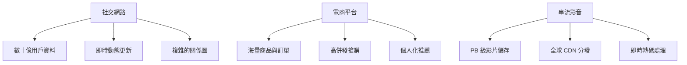

### 為什麼資料系統設計變得困難？

1. **工具選擇爆炸**：關聯式資料庫、NoSQL、訊息佇列、快取、搜尋引擎...
2. **沒有銀彈**：沒有一種工具能解決所有問題
3. **需求多樣化**：不同場景需要不同的 trade-offs
4. **系統需要組合**：現代應用是多種資料系統的組合

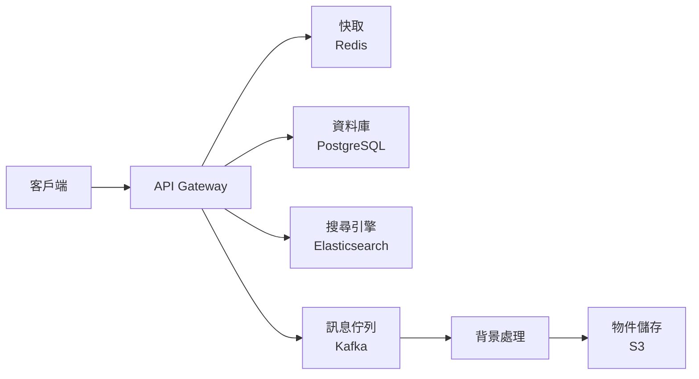

---

## 🔍 系統設計的三大支柱

### 1. 可靠性 (Reliability)

**定義**：系統在面對故障時仍能正常運作

**核心問題**：當事情出錯時，系統是否能繼續運作？

#### 常見故障類型

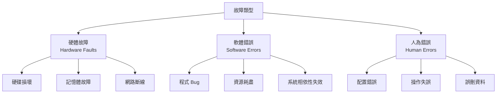

#### 提升可靠性的策略

1. **硬體冗餘 (Hardware Redundancy)**
   - RAID 磁碟陣列
   - 多台伺服器備援
   - 不斷電系統 (UPS)

2. **軟體容錯 (Software Fault Tolerance)**
   - 自動重試機制
   - 斷路器模式 (Circuit Breaker)
   - 優雅降級 (Graceful Degradation)

3. **降低人為錯誤**
   - 完善的測試
   - 分段部署 (Staged Rollout)
   - 快速回滾機制

#### 真實案例：AWS S3 的可靠性設計

AWS S3 宣稱達到 **99.999999999% (11 個 9)** 的耐久性：

```yaml
# S3 如何達成高可靠性
策略:
  - 資料自動複製到至少 3 個可用區域
  - 使用糾刪碼 (Erasure Coding) 技術
  - 持續檢查資料完整性
  - 自動修復損壞資料
  - 版本控制與刪除保護
```

---

### 2. 可擴展性 (Scalability)

**定義**：系統處理增長負載的能力

**核心問題**：當負載增加時，如何保持效能？

#### 描述負載的指標

不同系統有不同的關鍵負載指標：

| 系統類型 | 關鍵負載指標 |
|---------|------------|
| Web 應用 | 每秒請求數 (RPS) |
| 資料庫 | 讀寫比例、查詢複雜度 |
| 串流系統 | 每秒事件數 |
| 快取系統 | 命中率、資料量 |

#### Twitter 案例：發文的兩種設計

**問題**：用戶發推文後，如何讓追蹤者看到？

**方案 1：讀時查詢 (Fan-out on Read)**

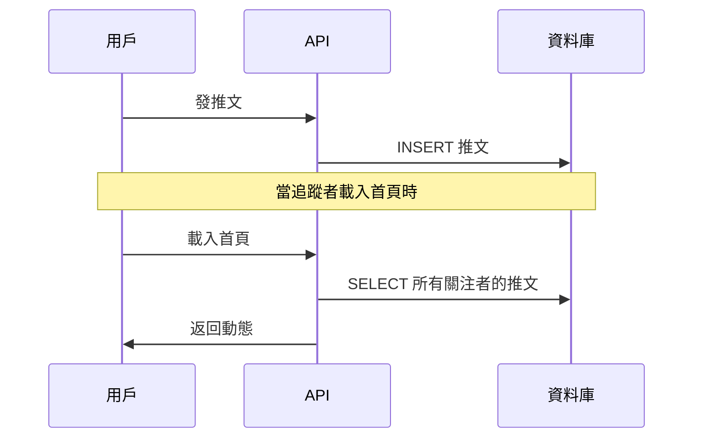

**優點**：寫入快速  
**缺點**：讀取時需要即時查詢大量資料，慢

**方案 2：寫時推送 (Fan-out on Write)**

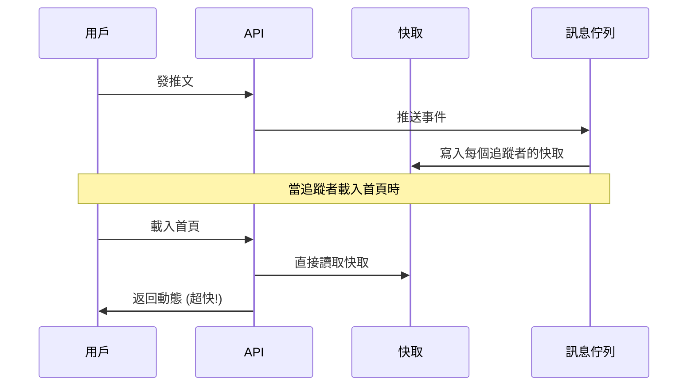

**優點**：讀取超快  
**缺點**：如果用戶有數百萬追蹤者，寫入會很慢

**Twitter 的實際方案**：混合模式
- 一般用戶：使用方案 2 (寫時推送)
- 名人用戶 (追蹤者過多)：使用方案 1 (讀時查詢)

#### 擴展的兩種方向

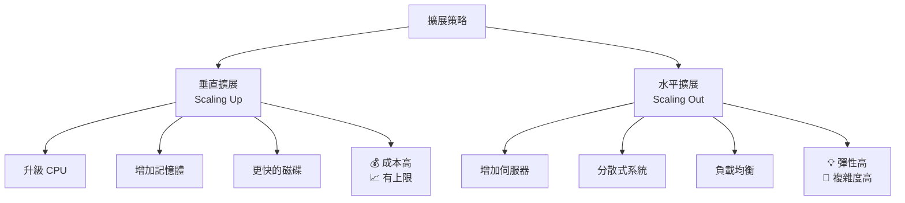

#### 性能指標與百分位數 (Percentiles)

**為什麼不用平均值？**

假設一個 API 的回應時間：
- 99 個請求：100ms
- 1 個請求：10,000ms (超慢!)

平均值 = (99×100 + 10000) / 100 = 199ms (看起來不錯？)  
但實際上有用戶體驗非常差！

**使用百分位數 (Percentile)**

```
P50 (中位數)：50% 的請求低於此時間
P95：95% 的請求低於此時間
P99：99% 的請求低於此時間
P99.9：99.9% 的請求低於此時間
```

**真實案例：Amazon 的 P99.9 優化**

Amazon 發現優化 P99.9 延遲能顯著提升營收，因為：
- 高消費用戶往往查看更多商品
- 這些用戶更容易遇到慢請求
- 改善最慢請求 = 改善最重要客戶的體驗

---

### 3. 可維護性 (Maintainability)

**定義**：讓系統在未來容易維護和演化

**核心問題**：如何降低長期維護成本？

#### 可維護性的三個面向

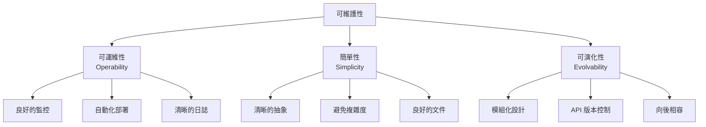

#### 1. 可運維性 (Operability)

**讓運維團隊的工作更輕鬆**

好的運維設計包含：

```yaml
監控與告警:
  - 健康檢查端點: /health, /ready
  - 結構化日誌: JSON 格式
  - 指標收集: Prometheus metrics
  - 分散式追蹤: OpenTelemetry

部署與恢復:
  - 零停機部署: Blue-Green, Canary
  - 快速回滾: 保留前 N 個版本
  - 自動擴展: HPA (Horizontal Pod Autoscaler)

除錯工具:
  - 日誌聚合: ELK Stack
  - 效能剖析: pprof, flame graphs
  - 資料庫慢查詢日誌
```

#### 2. 簡單性 (Simplicity)

**管理複雜度是系統設計的核心挑戰**

**複雜度的來源**：
- 狀態空間爆炸
- 緊密耦合的模組
- 糾纏的相依性
- 不一致的命名與約定
- 為特殊案例的 Hack

**簡化的方法**：使用抽象 (Abstraction)

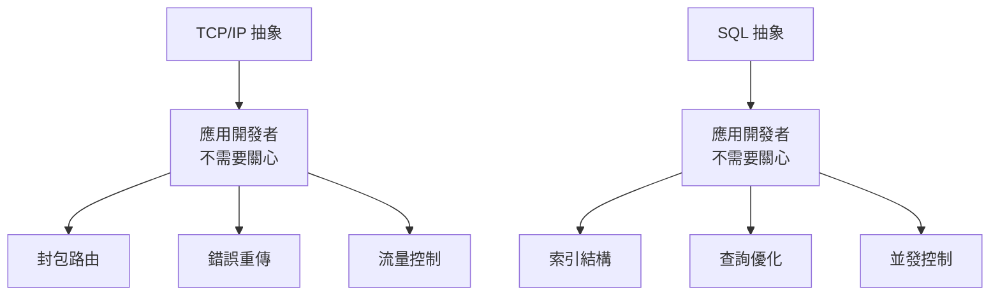

**好的抽象**：
- 隱藏實作細節
- 提供清晰的介面
- 降低認知負擔

#### 3. 可演化性 (Evolvability)

**系統需求會變，讓改變變容易**

**敏捷開發的系統設計原則**：

```yaml
設計原則:
  - 單一職責: 每個服務做一件事
  - 開放封閉: 對擴展開放，對修改封閉
  - API 優先: 清楚定義介面
  - 向後相容: 不破壞既有用戶

技術實踐:
  - 資料模型版本化
  - 功能開關 (Feature Flags)
  - 漸進式遷移
  - A/B 測試支援
```

**案例：Stripe 的 API 版本管理**

```python
# Stripe 允許每個客戶鎖定 API 版本
import stripe
stripe.api_version = "2023-10-16"

# 新功能逐步推出
# 舊客戶不受影響
# 新客戶自動使用新版本
```

---

## 🏗️ 資料系統的組成元件

現代應用是多種資料系統的組合：

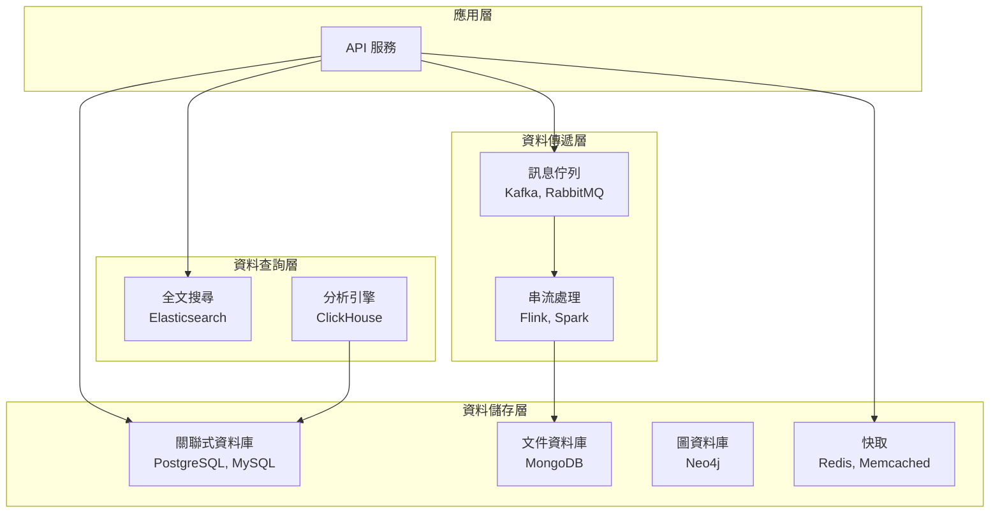

### 每種系統的職責

| 系統類型   | 主要用途          | 代表產品                |
| ------ | ------------- | ------------------- |
| 關聯式資料庫 | 結構化資料、ACID 事務 | PostgreSQL, MySQL   |
| 文件資料庫  | 彈性結構、水平擴展     | MongoDB, Couchbase  |
| 快取     | 降低延遲、減輕 DB 壓力 | Redis, Memcached    |
| 訊息佇列   | 非同步處理、解耦服務    | Kafka, RabbitMQ     |
| 搜尋引擎   | 全文檢索、複雜查詢     | Elasticsearch, Solr |
| 資料倉儲   | 分析型查詢、BI 報表   | Snowflake, BigQuery |

---

## ⚖️ 系統設計的權衡思維

**沒有完美的架構，只有適合的架構**

### 常見的 Trade-offs

#### 1. 一致性 vs 可用性 (CAP 定理)

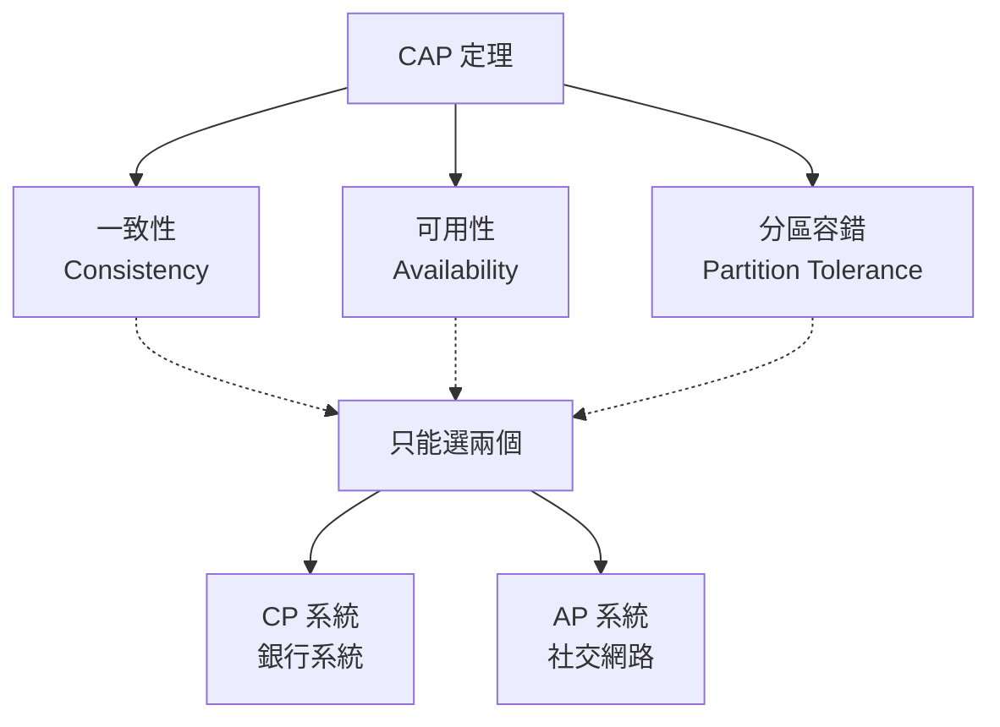

#### 2. 效能 vs 正確性

```yaml
高效能方案:
  - 最終一致性
  - 樂觀鎖
  - 非同步處理
  風險: 可能出現暫時性錯誤

高正確性方案:
  - 強一致性
  - 悲觀鎖
  - 同步處理
  風險: 效能較差
```

#### 3. 延遲 vs 吞吐量

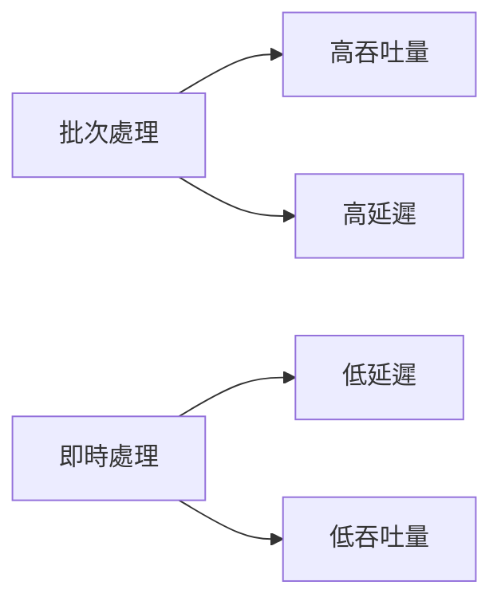

#### 4. 簡單性 vs 功能性

**過度設計的警告**：
- ❌ 一開始就建微服務架構
- ❌ 為了未來可能的需求增加複雜度
- ✅ 從簡單開始，逐步演化
- ✅ 真正需要時再優化

---

## 🤔 系統設計思考框架

### 設計系統時的問題清單

#### 1. 需求分析

```
功能需求:
  - 核心功能是什麼？
  - 哪些功能是必須的？
  - 哪些功能是加分的？

非功能需求:
  - 預期用戶數量？
  - 讀寫比例？
  - 延遲要求？
  - 一致性要求？
```

#### 2. 規模估算

```python
# 案例：設計 URL 縮短服務

# 假設
寫入: 100 個新 URL/秒
讀取: 10,000 次訪問/秒
讀寫比 = 100:1

# 儲存估算
URL 長度 = 500 bytes
每天寫入 = 100 * 86400 = 8,640,000 ≈ 8.6M
每年寫入 = 8.6M * 365 ≈ 3.1B
儲存 5 年 = 3.1B * 5 * 500 bytes ≈ 7.75 TB

# 頻寬估算
寫入頻寬 = 100 * 500 bytes = 50 KB/s
讀取頻寬 = 10,000 * 500 bytes = 5 MB/s
```

#### 3. 選擇技術

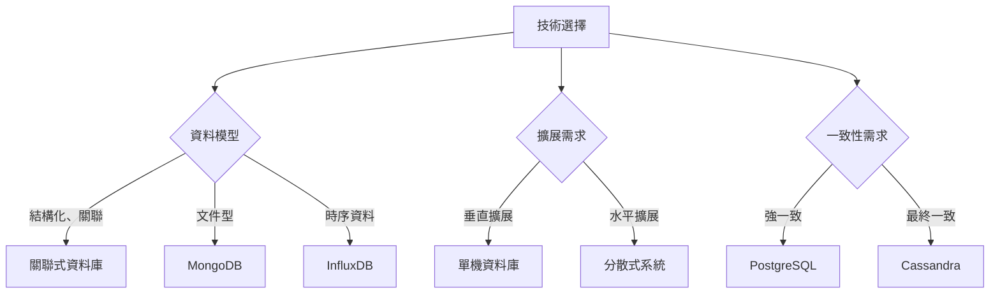

---

## 💻 實戰案例：設計一個部落格系統

### 第一版：簡單開始

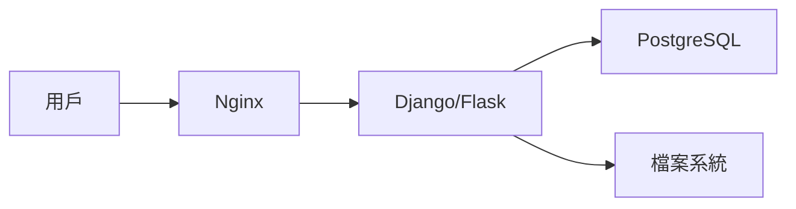

**特點**：
- 單體應用
- 關聯式資料庫
- 圖片存本地
- **適合**: 每天 < 10,000 訪問

### 第二版：增加快取

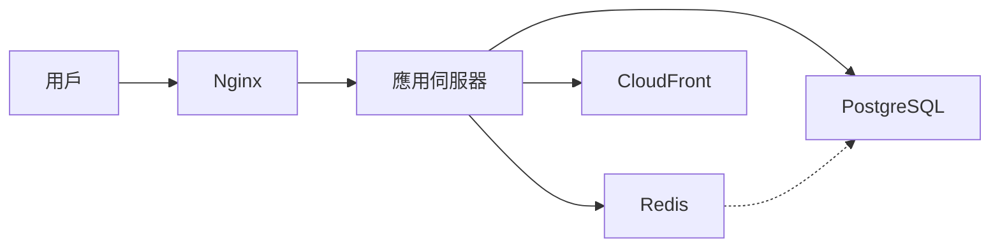

**改進**：
- 熱門文章快取
- 圖片上傳到 CDN
- **適合**: 每天 < 100,000 訪問

### 第三版：水平擴展

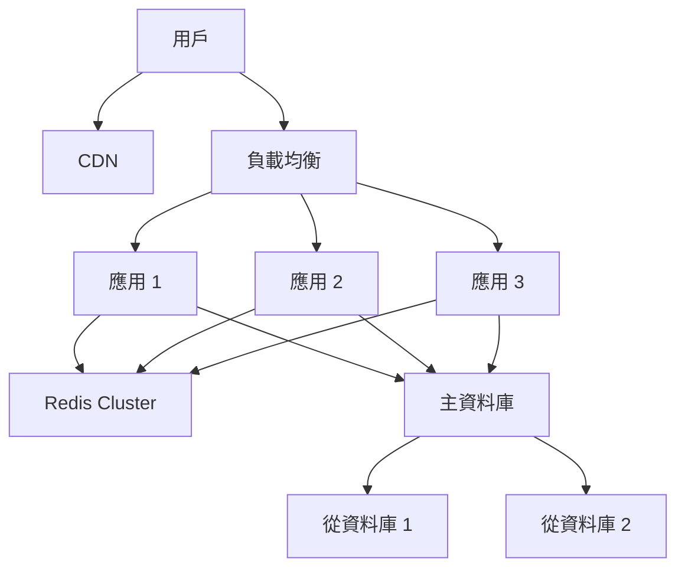

**改進**：
- 多個應用實例
- 主從資料庫
- Redis 叢集
- **適合**: 每天 > 1,000,000 訪問

---

## 📊 思考題

1. **為什麼 Netflix 可以容忍推薦系統的短暫不一致，但銀行不能容忍餘額的不一致？**

<details>
<summary>答案</summary>

- Netflix: 推薦不準影響體驗，但不影響核心功能（觀看影片）
- 銀行: 餘額錯誤會導致財務損失和信任問題
- 一致性需求取決於業務風險

</details>

2. **為什麼 Twitter 的首頁載入需要快取，而發推文可以稍慢？**

<details>
<summary>答案</summary>

- 讀寫比例懸殊：讀取次數遠超寫入
- 用戶期望：瀏覽首頁要快，發文可以等待
- 優化策略：優化高頻操作

</details>

3. **什麼時候應該從單體架構遷移到微服務？**

<details>
<summary>答案</summary>

考慮微服務的時機：
- 團隊規模 > 10 人
- 部署瓶頸嚴重
- 不同模組需要獨立擴展
- 技術棧需要多樣化

不要太早微服務化！
</details>

---

## 📚 本章總結

### 核心要點

1. **資料密集型應用**是現代系統的主要挑戰
2. **三大支柱**：可靠性、可擴展性、可維護性
3. **沒有銀彈**：所有設計都是權衡
4. **從簡單開始**：過度設計是大敵
5. **持續演化**：系統需要隨需求成長

### 設計原則

```yaml
黃金法則:
  - 先讓它運作 (Make it work)
  - 再讓它正確 (Make it right)
  - 最後讓它快速 (Make it fast)

避免陷阱:
  - ❌ 過早優化
  - ❌ 為不存在的問題設計
  - ❌ 盲目追隨大公司架構
  - ✅ 理解問題本質
  - ✅ 選擇適合的方案
  - ✅ 保持演化能力
```

### 下一步

在下一章中，我們將深入探討 **資料模型與查詢語言**，理解：
- 關聯式、文件式、圖式資料庫的差異
- 如何選擇適合的資料模型
- 查詢語言的演進與權衡

---

## 參考資料 (References)

1. Martin Kleppmann, *Designing Data-Intensive Applications* (O'Reilly, 2017)
2. [AWS Architecture Blog](https://aws.amazon.com/blogs/architecture/)
3. [High Scalability](http://highscalability.com/)
4. Werner Vogels, ["Eventually Consistent"](https://www.allthingsdistributed.com/2008/12/eventually_consistent.html)
5. [The Twelve-Factor App](https://12factor.net/)
6. [Google SRE Book](https://sre.google/sre-book/table-of-contents/)
