# 資料模型與查詢語言

## 🎯 學習目標

本章將幫助你理解：
- 關聯式、文件式、圖式資料庫的核心差異
- 如何根據資料特性選擇適合的模型
- 不同查詢語言的設計哲學與權衡
- NoSQL 的興起背景與實際應用
- 多對多關係的處理策略

---

## 💡 為什麼資料模型如此重要？

**資料模型是軟體開發中最重要的決定之一**

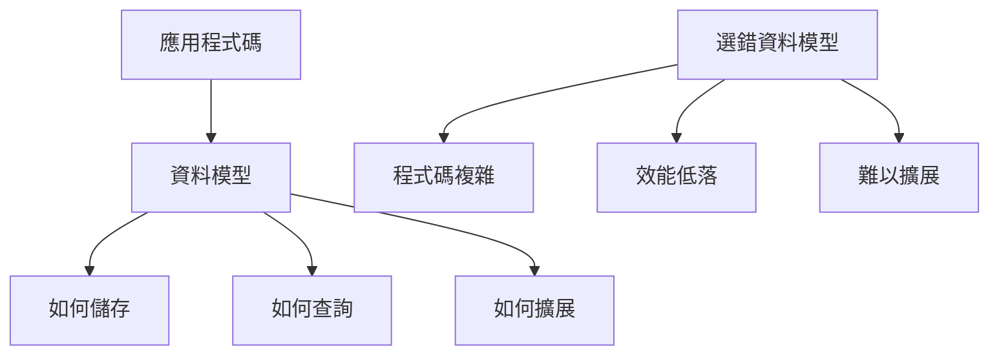

資料模型影響：
- **如何思考問題**：你會用模型的術語思考
- **軟體的可能性**：模型限制了你能做什麼
- **系統的效能**：不同模型有不同的效能特性

---

## 🔍 關聯式模型 (Relational Model)

### 歷史背景

**1970 年，Edgar Codd 提出關聯式模型**

在此之前：
- 層次模型 (Hierarchical Model) - IBM IMS
- 網狀模型 (Network Model) - CODASYL

關聯式模型的革命性創新：
- **資料獨立性**：查詢不需要知道資料如何儲存
- **聲明式查詢**：描述想要什麼，不是如何取得
- **數學基礎**：基於集合論與謂詞邏輯

### 關聯式模型的核心概念

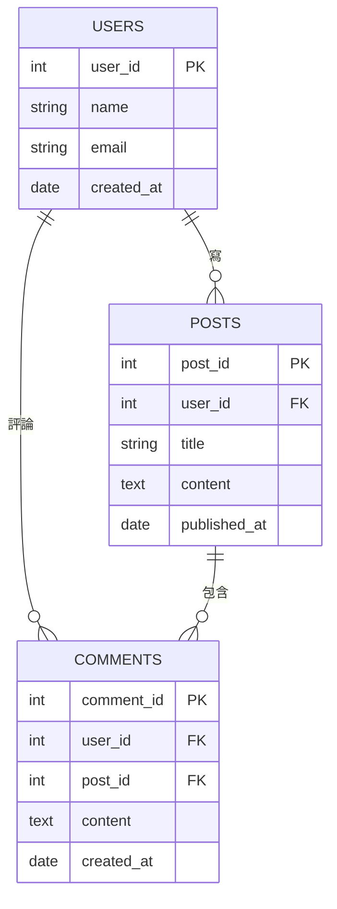

**關鍵特性**：
1. **Schema-on-Write**：寫入前必須定義結構
2. **正規化 (Normalization)**：減少資料重複
3. **JOIN 操作**：組合多個表格
4. **ACID 保證**：強一致性

### 關聯式模型的優勢

```sql
-- 聲明式查詢：描述想要什麼
SELECT u.name, COUNT(p.post_id) as post_count
FROM users u
LEFT JOIN posts p ON u.user_id = p.user_id
WHERE u.created_at > '2024-01-01'
GROUP BY u.user_id, u.name
HAVING post_count > 5
ORDER BY post_count DESC;

-- 資料庫負責:
-- - 選擇最佳執行計畫
-- - 使用適當的索引
-- - 優化 JOIN 順序
```

**優勢**：
- ✅ 強大的查詢能力
- ✅ 事務保證 (ACID)
- ✅ 成熟的工具生態
- ✅ 廣泛的知識基礎

**劣勢**：
- ❌ Schema 變更困難
- ❌ Object-Relational 阻抗不匹配
- ❌ 水平擴展困難
- ❌ JOIN 在大規模資料時昂貴

---

## 📄 文件模型 (Document Model)

### NoSQL 的興起

**2000 年代後期，NoSQL 運動興起**

驅動因素：
1. **超大規模資料集**：超越單機資料庫容量
2. **高寫入吞吐量**：關聯式資料庫難以擴展
3. **開源偏好**：避免商業資料庫鎖定
4. **特殊查詢**：關聯式模型不適合的場景
5. **動態 Schema**：敏捷開發需要彈性

### 文件模型的核心概念

**資料以文件為單位儲存，通常是 JSON**

```json
{
  "user_id": "u123",
  "name": "Alice Chen",
  "email": "alice@example.com",
  "created_at": "2024-01-15",
  "profile": {
    "bio": "Backend Developer",
    "location": "Taipei",
    "skills": ["Python", "Go", "PostgreSQL"]
  },
  "posts": [
    {
      "post_id": "p456",
      "title": "Learning DDIA",
      "content": "Great book!",
      "published_at": "2024-11-01"
    },
    {
      "post_id": "p789",
      "title": "System Design Tips",
      "content": "Start simple...",
      "published_at": "2024-11-10"
    }
  ]
}
```

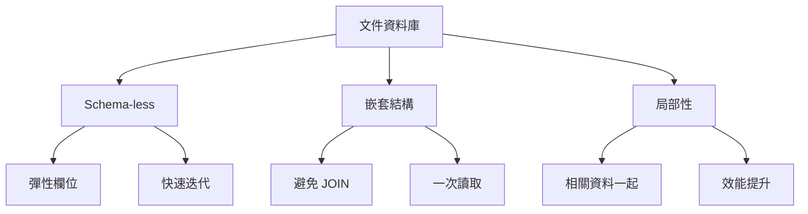

### Object-Relational 阻抗不匹配

**問題**：應用程式使用物件，資料庫使用表格

**關聯式做法**：需要轉換層 (ORM)

```python
# Python + SQLAlchemy (ORM)
class User(Base):
    __tablename__ = 'users'
    user_id = Column(Integer, primary_key=True)
    name = Column(String)
    posts = relationship("Post", back_populates="user")

class Post(Base):
    __tablename__ = 'posts'
    post_id = Column(Integer, primary_key=True)
    user_id = Column(Integer, ForeignKey('users.user_id'))
    title = Column(String)
    user = relationship("User", back_populates="posts")

# 需要配置複雜的映射
```

**文件式做法**：直接儲存

```python
# Python + MongoDB
user_doc = {
    "name": "Alice Chen",
    "posts": [
        {"title": "Learning DDIA", "content": "..."},
        {"title": "System Design Tips", "content": "..."}
    ]
}
db.users.insert_one(user_doc)

# 讀取時也是完整文件
user = db.users.find_one({"name": "Alice Chen"})
print(user["posts"][0]["title"])  # 直接存取
```

### 一對多關係的處理

**案例：LinkedIn 履歷**

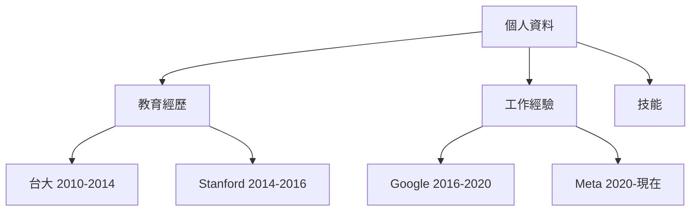

**關聯式模型**：多個表格 + JOIN

```sql
-- 需要 3 個表格
CREATE TABLE profiles (
    profile_id INT PRIMARY KEY,
    name VARCHAR(255),
    email VARCHAR(255)
);

CREATE TABLE educations (
    education_id INT PRIMARY KEY,
    profile_id INT REFERENCES profiles(profile_id),
    school VARCHAR(255),
    degree VARCHAR(255),
    start_year INT,
    end_year INT
);

CREATE TABLE experiences (
    experience_id INT PRIMARY KEY,
    profile_id INT REFERENCES profiles(profile_id),
    company VARCHAR(255),
    title VARCHAR(255),
    start_year INT,
    end_year INT
);

-- 查詢需要 JOIN
SELECT p.*, e.*, ex.*
FROM profiles p
LEFT JOIN educations e ON p.profile_id = e.profile_id
LEFT JOIN experiences ex ON p.profile_id = ex.profile_id
WHERE p.profile_id = 123;
```

**文件模型**：一個文件包含全部

```json
{
  "profile_id": 123,
  "name": "Alice Chen",
  "email": "alice@example.com",
  "education": [
    {
      "school": "台灣大學",
      "degree": "資訊工程學士",
      "start_year": 2010,
      "end_year": 2014
    },
    {
      "school": "Stanford University",
      "degree": "Computer Science MS",
      "start_year": 2014,
      "end_year": 2016
    }
  ],
  "experience": [
    {
      "company": "Google",
      "title": "Software Engineer",
      "start_year": 2016,
      "end_year": 2020
    },
    {
      "company": "Meta",
      "title": "Senior SWE",
      "start_year": 2020,
      "end_year": null
    }
  ]
}
```

**文件模型的優勢**：
- ✅ **局部性 (Locality)**：相關資料存在一起，一次讀取
- ✅ **Schema 彈性**：不同用戶可以有不同欄位
- ✅ **更接近應用程式資料結構**

### 多對多關係的挑戰

**問題**：當關係變複雜時

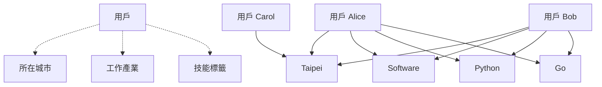

**文件模型的困境**：

```json
// 方案 1: 重複資料
{
  "user_id": "alice",
  "name": "Alice Chen",
  "location": {
    "city": "Taipei",
    "country": "Taiwan",
    "region": "Asia"  // 如果 Taipei 改名了？
  }
}

// 方案 2: 使用 ID 引用（失去局部性優勢）
{
  "user_id": "alice",
  "name": "Alice Chen",
  "location_id": "taipei_tw"  // 需要額外查詢
}
```

**關聯式模型的優勢**：JOIN 處理多對多很自然

```sql
-- 正規化避免重複
CREATE TABLE locations (
    location_id VARCHAR(50) PRIMARY KEY,
    city VARCHAR(100),
    country VARCHAR(100),
    region VARCHAR(100)
);

-- 城市改名只需改一處
UPDATE locations 
SET city = 'New Taipei City' 
WHERE location_id = 'taipei_tw';
```

---

## 🌐 圖模型 (Graph Model)

### 何時使用圖資料庫？

**當多對多關係變得非常複雜時**

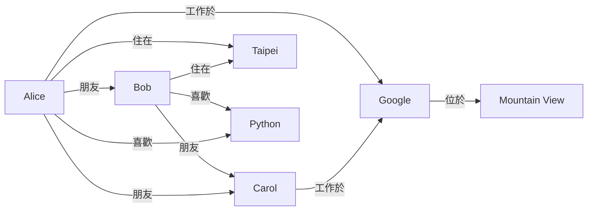

**適合圖模型的場景**：
- 社交網路
- 推薦系統
- 詐欺檢測
- 知識圖譜
- 路徑規劃

### 圖模型的核心概念

**Property Graph Model** (Neo4j, Neptune)

```cypher
// 創建節點與關係 (Cypher 語言)
CREATE (alice:Person {name: "Alice Chen", email: "alice@example.com"})
CREATE (bob:Person {name: "Bob Lin"})
CREATE (google:Company {name: "Google", founded: 1998})
CREATE (taipei:City {name: "Taipei", country: "Taiwan"})

CREATE (alice)-[:FRIEND_OF {since: 2015}]->(bob)
CREATE (alice)-[:WORKS_AT {title: "SWE", since: 2020}]->(google)
CREATE (alice)-[:LIVES_IN]->(taipei)
CREATE (bob)-[:LIVES_IN]->(taipei)
```

### 圖查詢的威力

**案例 1：找出朋友的朋友**

```cypher
// Cypher: 簡潔直觀
MATCH (alice:Person {name: "Alice Chen"})-[:FRIEND_OF]->(friend)
      -[:FRIEND_OF]->(friendOfFriend)
WHERE NOT (alice)-[:FRIEND_OF]->(friendOfFriend)
  AND alice <> friendOfFriend
RETURN friendOfFriend.name, COUNT(*) as mutual_friends
ORDER BY mutual_friends DESC;
```

```sql
-- SQL: 需要遞迴 CTE，複雜且效能差
WITH RECURSIVE friend_of_friends AS (
  SELECT friend_id, 1 as level
  FROM friendships
  WHERE user_id = 'alice'
  
  UNION
  
  SELECT f.friend_id, fof.level + 1
  FROM friend_of_friends fof
  JOIN friendships f ON fof.friend_id = f.user_id
  WHERE fof.level < 2
)
SELECT ...  -- 還需要更多過濾邏輯
```

**案例 2：推薦系統**

```cypher
// 找出住在同城市、有共同朋友、在同產業工作的人
MATCH (me:Person {name: "Alice Chen"})-[:LIVES_IN]->(city:City)
      <-[:LIVES_IN]-(other:Person)
MATCH (me)-[:FRIEND_OF]-(mutual)-[:FRIEND_OF]-(other)
MATCH (me)-[:WORKS_AT]->(company1:Company)-[:IN_INDUSTRY]->(industry:Industry)
      <-[:IN_INDUSTRY]-(company2:Company)<-[:WORKS_AT]-(other)
WHERE me <> other
  AND NOT (me)-[:FRIEND_OF]-(other)
RETURN other.name, 
       COUNT(DISTINCT mutual) as mutual_friends,
       city.name as shared_city,
       industry.name as shared_industry
ORDER BY mutual_friends DESC
LIMIT 10;
```

### Triple-Store 模型

**RDF (Resource Description Framework)**

所有資料表示為：`(主詞, 謂詞, 受詞)`

```turtle
# Turtle 格式
@prefix : <http://example.com/> .

:alice  a               :Person .
:alice  :name           "Alice Chen" .
:alice  :email          "alice@example.com" .
:alice  :friendOf       :bob .
:alice  :worksAt        :google .
:alice  :livesIn        :taipei .

:google a               :Company .
:google :name           "Google" .
:google :founded        "1998"^^xsd:integer .

:taipei a               :City .
:taipei :name           "Taipei" .
:taipei :country        "Taiwan" .
```

**SPARQL 查詢語言**

```sparql
# 找出住在同城市的同事
PREFIX : <http://example.com/>

SELECT ?colleague ?city_name
WHERE {
  :alice :worksAt ?company .
  ?colleague :worksAt ?company .
  ?colleague :livesIn ?city .
  :alice :livesIn ?city .
  ?city :name ?city_name .
  FILTER (?colleague != :alice)
}
```

---

## 🔄 查詢語言的演進

### 命令式 vs 聲明式

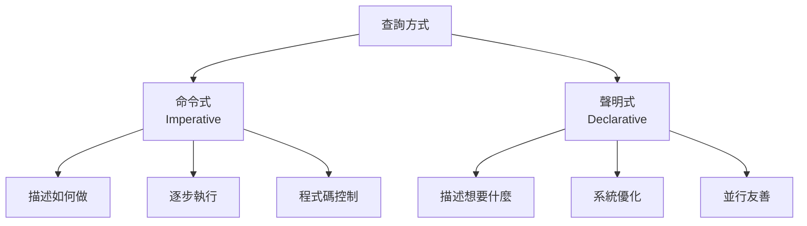

**命令式範例 (JavaScript)**

```javascript
// 找出所有住在 Taipei 的用戶
function getUsersInTaipei(users) {
  const result = [];
  for (let i = 0; i < users.length; i++) {
    if (users[i].location.city === "Taipei") {
      result.push(users[i]);
    }
  }
  return result;
}

// 你告訴電腦：
// 1. 創建空陣列
// 2. 遍歷每個用戶
// 3. 檢查條件
// 4. 符合就加入結果
// 5. 返回結果
```

**聲明式範例 (SQL)**

```sql
-- 描述想要什麼
SELECT * FROM users WHERE location_city = 'Taipei';

-- 資料庫決定：
-- - 是否使用索引
-- - 掃描順序
-- - 並行執行
-- - 查詢計畫優化
```

**聲明式的優勢**：

1. **更簡潔**：程式碼更短，意圖更清晰
2. **可優化**：系統可自動優化執行
3. **並行友善**：沒有指定順序，容易並行化
4. **抽象層**：底層實作可改進，不影響查詢

### MapReduce 查詢

**介於命令式與聲明式之間**

```javascript
// MongoDB MapReduce 範例
// 統計每個城市的用戶數

db.users.mapReduce(
  // Map 函數：輸出 (key, value)
  function map() {
    emit(this.location.city, 1);
  },
  
  // Reduce 函數：聚合相同 key 的 values
  function reduce(key, values) {
    return Array.sum(values);
  },
  
  {
    out: "city_user_counts"
  }
);
```

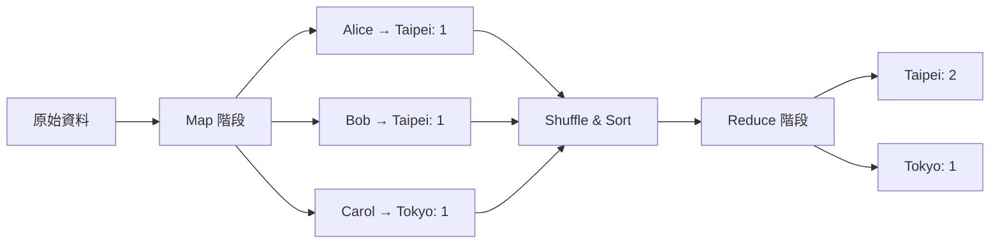

**聲明式版本 (MongoDB Aggregation Pipeline)**

```javascript
// 更現代、更聲明式的寫法
db.users.aggregate([
  {
    $group: {
      _id: "$location.city",
      count: { $sum: 1 }
    }
  }
]);
```

---

## ⚖️ 資料模型的選擇指南

### 決策樹

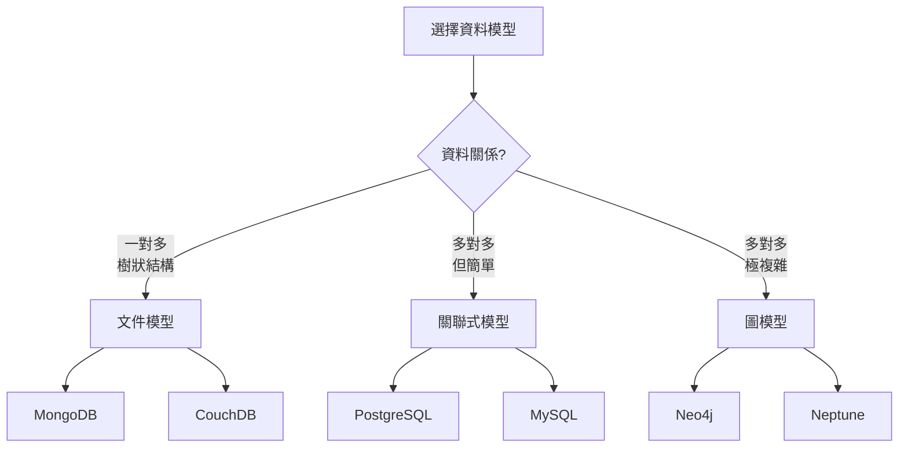

### 場景對照表

| 場景 | 推薦模型 | 理由 |
|-----|---------|------|
| 部落格、CMS | 文件 | 文章結構完整，一次讀取 |
| 電商訂單 | 關聯式 | 複雜交易，ACID 保證 |
| 社交網路 | 圖 | 複雜關係，路徑查詢 |
| 分析報表 | 關聯式 | 強大的聚合與 JOIN |
| 即時推薦 | 圖 | 快速路徑查詢 |
| 使用者設定 | 文件 | Schema 彈性 |
| 金融交易 | 關聯式 | 強一致性需求 |

### 混合使用策略

**現代應用常使用多種資料庫**

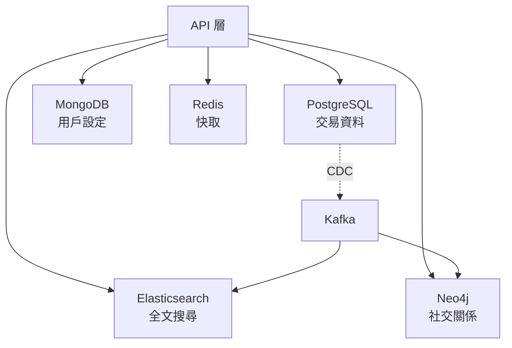

**Polyglot Persistence（多語資料持久化）**

```yaml
應用場景:
  用戶資料:
    儲存: PostgreSQL
    原因: ACID, 結構化
    
  用戶活動日誌:
    儲存: MongoDB
    原因: 寫入量大, Schema 彈性
    
  產品搜尋:
    儲存: Elasticsearch
    原因: 全文搜尋, 即時
    
  社交圖譜:
    儲存: Neo4j
    原因: 複雜關係查詢
    
  工作階段:
    儲存: Redis
    原因: 高速讀寫
```

---

## 💻 實戰範例

### 案例：設計 Twitter

**資料結構分析**

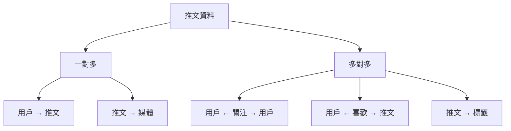

**方案 1：關聯式模型**

```sql
CREATE TABLE users (
    user_id BIGINT PRIMARY KEY,
    username VARCHAR(15) UNIQUE,
    display_name VARCHAR(50),
    bio TEXT,
    created_at TIMESTAMP
);

CREATE TABLE tweets (
    tweet_id BIGINT PRIMARY KEY,
    user_id BIGINT REFERENCES users(user_id),
    content VARCHAR(280),
    created_at TIMESTAMP,
    retweet_count INT DEFAULT 0,
    like_count INT DEFAULT 0
);

CREATE TABLE follows (
    follower_id BIGINT REFERENCES users(user_id),
    following_id BIGINT REFERENCES users(user_id),
    created_at TIMESTAMP,
    PRIMARY KEY (follower_id, following_id)
);

CREATE TABLE likes (
    user_id BIGINT REFERENCES users(user_id),
    tweet_id BIGINT REFERENCES tweets(tweet_id),
    created_at TIMESTAMP,
    PRIMARY KEY (user_id, tweet_id)
);
```

**優點**：
- ✅ 一致性強
- ✅ 複雜查詢容易
- ✅ 資料正規化

**缺點**：
- ❌ 讀取首頁需要大量 JOIN
- ❌ 水平擴展困難

**方案 2：文件模型（實際使用）**

```json
// 推文文件
{
  "tweet_id": 123456789,
  "user": {
    "user_id": 101,
    "username": "alice",
    "display_name": "Alice Chen",
    "avatar_url": "https://..."
  },
  "content": "Learning about data models! #DDIA",
  "created_at": "2024-11-13T10:30:00Z",
  "metrics": {
    "retweet_count": 42,
    "like_count": 128,
    "reply_count": 15
  },
  "hashtags": ["DDIA"],
  "media": [
    {
      "type": "image",
      "url": "https://..."
    }
  ]
}

// 用戶首頁 Timeline（預先計算）
{
  "user_id": 202,
  "timeline": [
    {
      "tweet_id": 123456789,
      "cached_at": "2024-11-13T10:30:01Z"
      // 嵌入完整推文內容
    },
    // ... 更多推文
  ],
  "updated_at": "2024-11-13T10:30:01Z"
}
```

**Twitter 的實際架構**：
- 推文資料：Cassandra + Manhattan (Key-Value Store)
- 首頁 Timeline：Redis (快取預先計算的結果)
- 社交圖譜：FlockDB (圖資料庫)
- 搜尋：Elasticsearch

---

## 🤔 思考題

### 1. 何時應該反正規化 (Denormalization)？

<details>
<summary>答案</summary>

**反正規化的時機**：
- 讀取頻率 >> 寫入頻率
- JOIN 成為效能瓶頸
- 資料很少改變

**範例**：
```json
// 反正規化：嵌入用戶名稱
{
  "post_id": 123,
  "user_id": 456,
  "author_name": "Alice",  // 重複資料
  "content": "..."
}
```

**Trade-off**：
- ✅ 讀取快（不需 JOIN）
- ❌ 資料重複
- ❌ 更新時需同步多處（如用戶改名）

</details>

### 2. 文件資料庫如何處理多對多關係？

<details>
<summary>答案</summary>

**策略 1：嵌入 ID 陣列**
```json
{
  "user_id": 123,
  "friend_ids": [456, 789, 101]
}
```
- 需要額外查詢取得朋友詳細資料

**策略 2：應用層 JOIN**
```javascript
const user = await db.users.findOne({_id: 123});
const friends = await db.users.find({
  _id: {$in: user.friend_ids}
});
```

**策略 3：使用關聯式資料庫處理關係**
- 用文件資料庫儲存內容
- 用關聯式資料庫儲存關係

</details>

### 3. 什麼情況下圖資料庫比關聯式資料庫更好？

<details>
<summary>答案</summary>

**圖資料庫優勢場景**：

1. **可變深度查詢**
   - "找出我的朋友的朋友的朋友..."
   - SQL 需要遞迴 CTE，效能差

2. **多種關係類型**
   - 朋友、同事、家人、粉絲...
   - 每種關係有不同屬性

3. **路徑查詢**
   - 最短路徑
   - 所有可能路徑
   - 推薦連結

4. **即時查詢需求**
   - 社交網路「你可能認識」
   - 詐欺檢測
   - 影響力分析

**範例**：LinkedIn 的「你可能認識」功能用圖資料庫實作
</details>

---

## 📊 總結對照表

| 特性 | 關聯式 | 文件 | 圖 |
|-----|-------|------|---|
| **Schema** | 嚴格 | 彈性 | 半結構化 |
| **關係** | JOIN | 嵌入/引用 | 原生邊 |
| **查詢語言** | SQL | MongoDB QL | Cypher/SPARQL |
| **水平擴展** | 困難 | 容易 | 中等 |
| **事務** | 完整 ACID | 有限 | 有限 |
| **適合場景** | 結構化資料 | 文件/樹狀 | 複雜關係 |
| **查詢彈性** | 極高 | 中等 | 路徑查詢強 |
| **學習曲線** | 低（廣泛知識） | 中 | 高 |

---

## 📚 本章總結

### 核心要點

1. **沒有最好的模型**，只有最適合的模型
2. **關聯式模型**：成熟、強大、適合大多數場景
3. **文件模型**：彈性、局部性、適合一對多
4. **圖模型**：處理複雜關係、路徑查詢
5. **聲明式查詢**優於命令式：可優化、可並行
6. **現代應用**常混合使用多種資料庫

### 選擇建議

```yaml
起步階段:
  - 預設選擇: PostgreSQL
  - 原因: 成熟、功能完整、社群支援
  - 等待: 真實需求出現再考慮其他

特殊需求:
  - 彈性 Schema: MongoDB
  - 複雜關係: Neo4j
  - 全文搜尋: Elasticsearch
  - 高速快取: Redis
```

### 下一章預告

在下一章《儲存引擎原理》中，我們將深入資料庫內部，理解：
- 資料如何在磁碟上儲存
- LSM-Tree vs B-Tree 的權衡
- OLTP vs OLAP 的差異
- 索引結構與效能優化

---

## 參考資料 (References)

1. Martin Kleppmann, *Designing Data-Intensive Applications*, Chapter 2 (O'Reilly, 2017)
2. Edgar F. Codd, ["A Relational Model of Data for Large Shared Data Banks"](https://www.seas.upenn.edu/~zives/03f/cis550/codd.pdf) (1970)
3. [MongoDB Data Modeling](https://www.mongodb.com/docs/manual/core/data-modeling-introduction/)
4. [Neo4j Graph Database](https://neo4j.com/docs/)
5. [The Cost of a Join](https://www.percona.com/blog/2020/01/10/the-cost-of-a-join/)
6. [Twitter: Scaling Timeline](https://blog.twitter.com/engineering/en_us/topics/infrastructure/2017/the-infrastructure-behind-twitter-scale)
