# 儲存引擎原理

## 🎯 學習目標

本章將幫助你理解：
- 資料庫如何在磁碟上儲存與檢索資料
- LSM-Tree vs B-Tree 的權衡
- OLTP vs OLAP 的差異
- 索引結構與效能優化
- 列式儲存的優勢

---

## 💡 儲存引擎的重要性

**選擇合適的儲存引擎，效能可能差距 10-1000 倍**

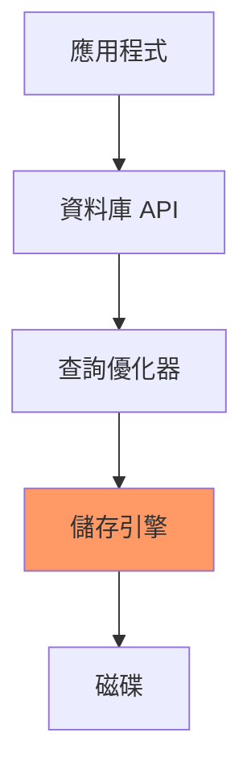

儲存引擎決定：
- **寫入效能**：如何高效寫入資料
- **讀取效能**：如何快速查詢資料
- **空間效率**：資料壓縮與儲存
- **並發控制**：多用戶同時存取

---

## 🔍 最簡單的資料庫

### Append-Only Log

**世界上最簡單的資料庫**

```bash
#!/bin/bash

# 寫入：追加到檔案末尾
db_set() {
  echo "$1,$2" >> database.txt
}

# 讀取：從後往前找最新的值
db_get() {
  grep "^$1," database.txt | tail -n 1 | cut -d, -f2
}
```

**使用範例**

```bash
$ db_set "name" "Alice"
$ db_set "age" "25"
$ db_set "name" "Bob"    # 更新 name
$ db_get "name"
Bob                       # 返回最新值

$ cat database.txt
name,Alice
age,25
name,Bob
```

**效能分析**

```yaml
寫入 (Append):
  - 時間複雜度: O(1)
  - 優點: 極快
  - 原因: 順序寫入磁碟

讀取 (Scan):
  - 時間複雜度: O(n)
  - 缺點: 極慢
  - 原因: 需要掃描整個檔案
```

### 加入索引

**為了加速讀取，我們需要索引**

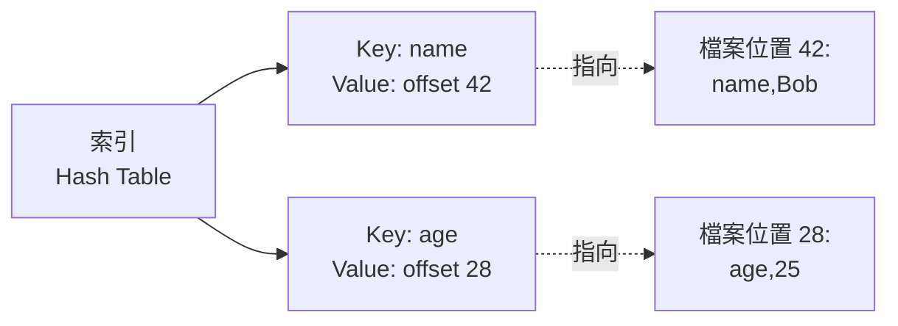

**改進版本**

```python
import os

class SimpleDB:
    def __init__(self, filename):
        self.filename = filename
        self.index = {}  # Key -> File Offset
        self._build_index()
    
    def _build_index(self):
        """啟動時重建索引"""
        if not os.path.exists(self.filename):
            return
        
        with open(self.filename, 'r') as f:
            offset = 0
            for line in f:
                key = line.split(',')[0]
                self.index[key] = offset
                offset = f.tell()
    
    def set(self, key, value):
        """寫入資料"""
        with open(self.filename, 'a') as f:
            offset = f.tell()
            f.write(f"{key},{value}\n")
            self.index[key] = offset  # 更新索引
    
    def get(self, key):
        """讀取資料"""
        if key not in self.index:
            return None
        
        with open(self.filename, 'r') as f:
            f.seek(self.index[key])  # 直接跳到位置
            line = f.readline()
            return line.split(',')[1].strip()
```

**效能改進**

```yaml
寫入:
  - 時間複雜度: O(1)
  - 維護索引: O(1)
  - 總體: O(1)

讀取:
  - 查索引: O(1) - Hash Table
  - 讀檔案: O(1) - 直接 seek
  - 總體: O(1)

問題:
  - ❌ 檔案無限增長
  - ❌ 刪除的資料仍占空間
  - ❌ 當機時索引遺失
```

---

## 📊 Hash 索引與 Compaction

### 問題：檔案持續增長

**解決方案：Segmentation + Compaction**

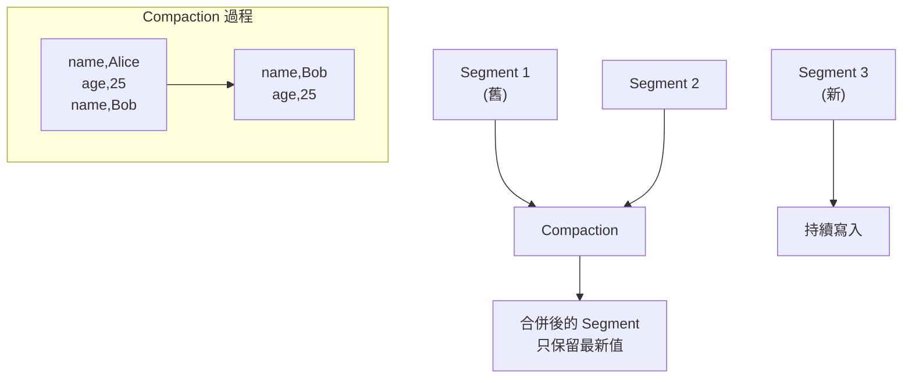

### Bitcask 模型

**Riak 的預設儲存引擎**

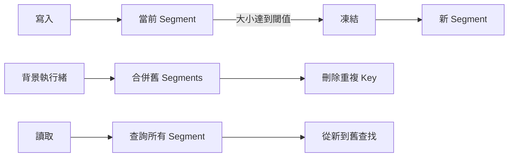

**設計要點**

```yaml
檔案格式:
  - 二進制格式更高效
  - 每條記錄: [Key長度][Value長度][Key][Value]

刪除記錄:
  - 寫入特殊標記 (Tombstone)
  - Compaction 時移除

當機恢復:
  - 重建索引耗時
  - 解法: 定期儲存索引快照

並發控制:
  - 單一寫入執行緒
  - 多個讀取執行緒

部分更新:
  - 不支援
  - 必須重寫整個值
```

**Hash 索引的限制**

```yaml
優勢:
  - ✅ 讀寫都是 O(1)
  - ✅ 實作簡單
  - ✅ 順序寫入快速

劣勢:
  - ❌ 索引必須放記憶體
  - ❌ 不支援範圍查詢
  - ❌ Key 數量受限於記憶體大小
```

---

## 🌲 LSM-Tree (Log-Structured Merge Tree)

### SSTable (Sorted String Table)

**關鍵改進：Segment 內部 Key 排序**

```
普通 Segment:
name,Bob
age,25
city,Taipei
name,Alice     # Key 可重複

SSTable:
age,25
city,Taipei
name,Alice     # Key 按字典序排列
```

**SSTable 的優勢**

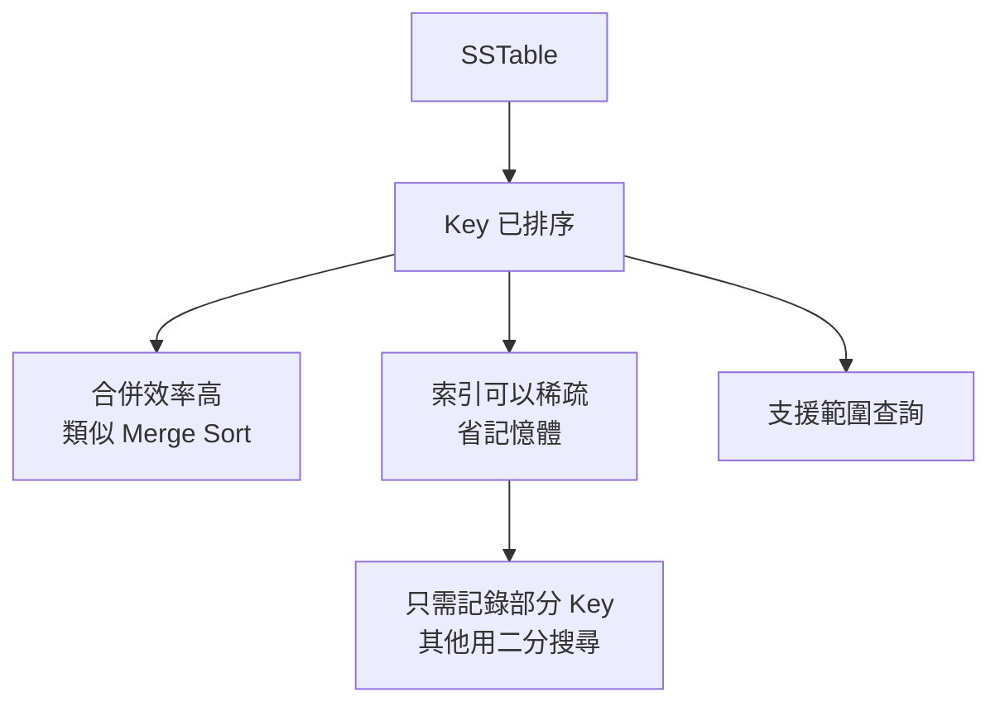

### LSM-Tree 完整架構

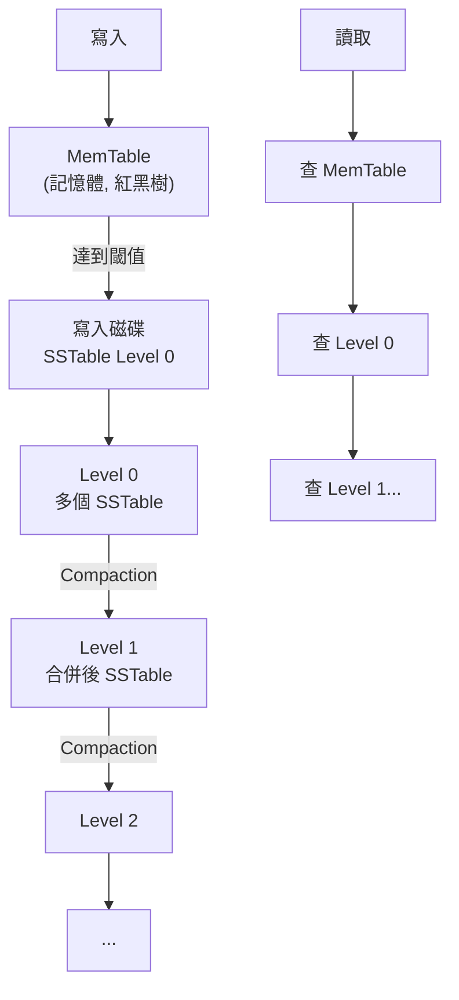

**寫入流程**

```python
class LSMTree:
    def __init__(self):
        self.memtable = {}  # 記憶體表 (實際用紅黑樹)
        self.wal = WAL()    # Write-Ahead Log
        self.sstables = []  # 磁碟上的 SSTable
    
    def put(self, key, value):
        # 1. 先寫 WAL (防止當機)
        self.wal.append(key, value)
        
        # 2. 寫入 MemTable
        self.memtable[key] = value
        
        # 3. MemTable 太大時刷到磁碟
        if len(self.memtable) > THRESHOLD:
            self._flush_memtable()
    
    def _flush_memtable(self):
        # 將 MemTable 排序後寫入 SSTable
        sorted_data = sorted(self.memtable.items())
        new_sstable = SSTable.create(sorted_data)
        self.sstables.append(new_sstable)
        
        # 清空 MemTable
        self.memtable = {}
        self.wal.clear()
        
        # 觸發 Compaction
        self._maybe_compact()
```

**讀取流程**

```python
    def get(self, key):
        # 1. 先查 MemTable
        if key in self.memtable:
            return self.memtable[key]
        
        # 2. 從新到舊查 SSTable
        for sstable in reversed(self.sstables):
            value = sstable.get(key)
            if value is not None:
                return value
        
        return None  # 找不到
```

### Bloom Filter 優化

**問題：查詢不存在的 Key 很慢**

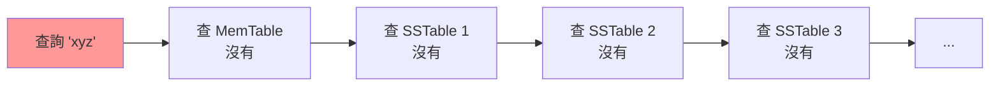

**解決方案：Bloom Filter**

```python
class BloomFilter:
    """空間高效的概率性資料結構"""
    
    def __init__(self, size, hash_count):
        self.bit_array = [0] * size
        self.hash_count = hash_count
    
    def add(self, key):
        for i in range(self.hash_count):
            index = hash(key, i) % len(self.bit_array)
            self.bit_array[index] = 1
    
    def might_contain(self, key):
        """可能包含 (可能誤判) 或 確定不包含"""
        for i in range(self.hash_count):
            index = hash(key, i) % len(self.bit_array)
            if self.bit_array[index] == 0:
                return False  # 確定不存在
        return True  # 可能存在
```

**使用 Bloom Filter 後**

```python
    def get(self, key):
        # 快速檢查：這個 SSTable 可能有這個 Key 嗎？
        for sstable in reversed(self.sstables):
            if not sstable.bloom_filter.might_contain(key):
                continue  # 跳過這個 SSTable
            
            value = sstable.get(key)
            if value is not None:
                return value
```

**Bloom Filter 特性**

```yaml
優點:
  - 空間極小 (每個 Key 約 10 bits)
  - 查詢極快 (幾次 Hash)

缺點:
  - 可能誤判 (說有但沒有)
  - 絕不漏判 (說沒有就真沒有)

配置:
  - 1% 誤判率: 約 10 bits per key
  - 0.1% 誤判率: 約 15 bits per key
```

### Compaction 策略

**Size-Tiered Compaction** (Cassandra, HBase)

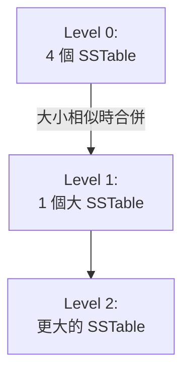

**Leveled Compaction** (LevelDB, RocksDB)

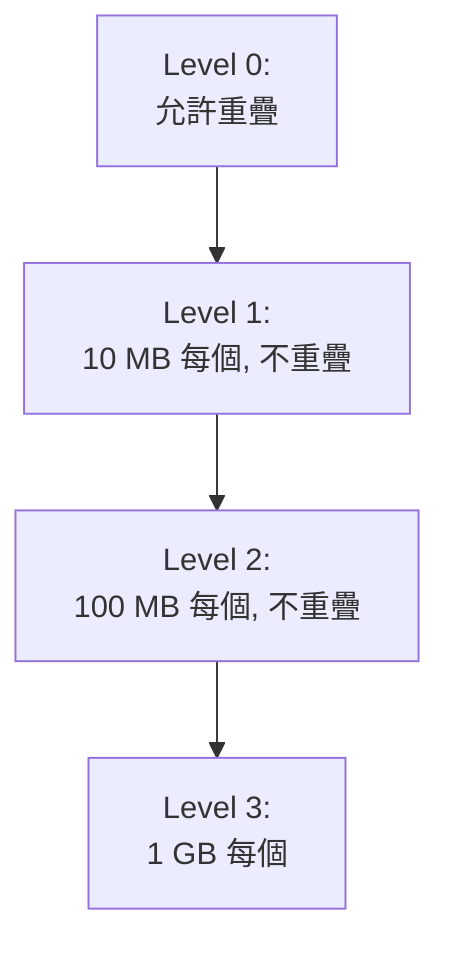

**權衡對比**

```yaml
Size-Tiered:
  寫入放大: 低
  讀取放大: 高 (需查多個檔案)
  空間放大: 高 (舊資料延遲刪除)
  適合: 寫入密集

Leveled:
  寫入放大: 高 (需多次重寫)
  讀取放大: 低 (每層最多一個檔案)
  空間放大: 低
  適合: 讀取密集
```

### LSM-Tree 實際應用

```yaml
LevelDB:
  - Google 開發
  - 單機 Key-Value Store
  - Chrome IndexedDB 底層

RocksDB:
  - Facebook 基於 LevelDB
  - 效能優化、可配置
  - MyRocks (MySQL), MongoDB 使用

Cassandra:
  - 分散式 LSM-Tree
  - Size-Tiered Compaction
  - 高寫入吞吐量

HBase:
  - 基於 Hadoop
  - LSM-Tree 架構
  - 大資料場景
```

---

## 🌳 B-Tree

### B-Tree 的核心概念

**傳統關聯式資料庫的標準索引**

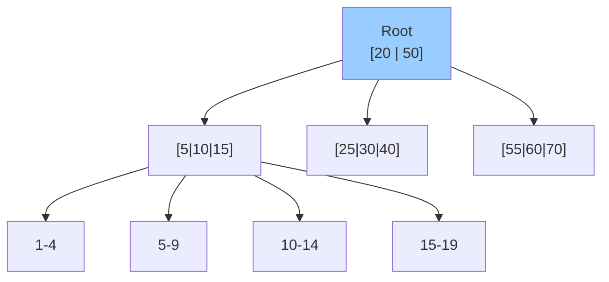

**B-Tree vs 二元樹**

```yaml
二元樹:
  - 每個節點最多 2 個子節點
  - 深度 log₂(n)
  - 磁碟 I/O 多

B-Tree:
  - 每個節點數百個子節點
  - 深度 log₁₀₀(n) 
  - 磁碟 I/O 少
  
範例:
  1 億筆資料
  - 二元樹深度: ~27 層
  - B-Tree 深度: ~4 層
```

### B-Tree 的操作

**查詢流程**

```python
def search(root, key):
    node = root
    
    while not node.is_leaf:
        # 在節點內二分搜尋
        i = binary_search(node.keys, key)
        
        if node.keys[i] == key:
            return node.values[i]  # 找到
        
        # 往下走
        node = node.children[i]
    
    # 在葉節點查找
    return node.get(key)
```

**插入流程**

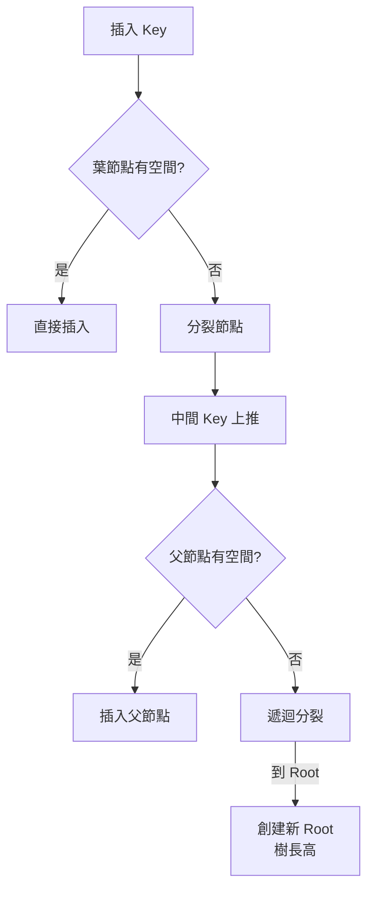

**範例：插入導致分裂**

```
初始狀態:
[10 | 20 | 30 | 40]  (已滿, 最多 4 個 Key)

插入 25:
[10 | 20] → 30 ↑ ← [40 | 25排序後 = 25,40]
           
結果:
          [30]
         /    \
    [10|20]  [25|40]
```

### B-Tree vs LSM-Tree 對比

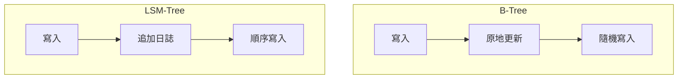

**詳細對比**

| 特性 | B-Tree | LSM-Tree |
|-----|--------|----------|
| **寫入** | 原地更新、隨機 I/O | 順序追加、高吞吐 |
| **讀取** | 單次查詢快 | 需查多個檔案 |
| **寫入放大** | 低 (只更新必要頁) | 高 (Compaction 重寫) |
| **空間放大** | 中 (碎片) | 低到高 (視策略) |
| **並發** | 頁級鎖 | 更好 (不變檔案) |
| **範圍查詢** | 優秀 (葉節點相連) | 良好 |
| **成熟度** | 極高 (40+ 年) | 較新 |
| **適用場景** | 讀多寫少、OLTP | 寫多讀少、日誌 |

**寫入放大計算**

```python
# B-Tree 範例
每次寫入 1 KB 資料
但需要:
  - 更新葉節點 (4 KB 頁)
  - 更新父節點 (4 KB 頁)
  - 更新 WAL (1 KB)
實際寫入: 9 KB
寫入放大: 9x

# LSM-Tree 範例
寫入 1 KB 到 MemTable
後續 Compaction:
  - Level 0→1: 重寫 1 次
  - Level 1→2: 重寫 10 次
  - Level 2→3: 重寫 10 次
總寫入放大: 可達 10-30x (視 Compaction 策略)
```

---

## 📈 OLTP vs OLAP

### 兩種工作負載

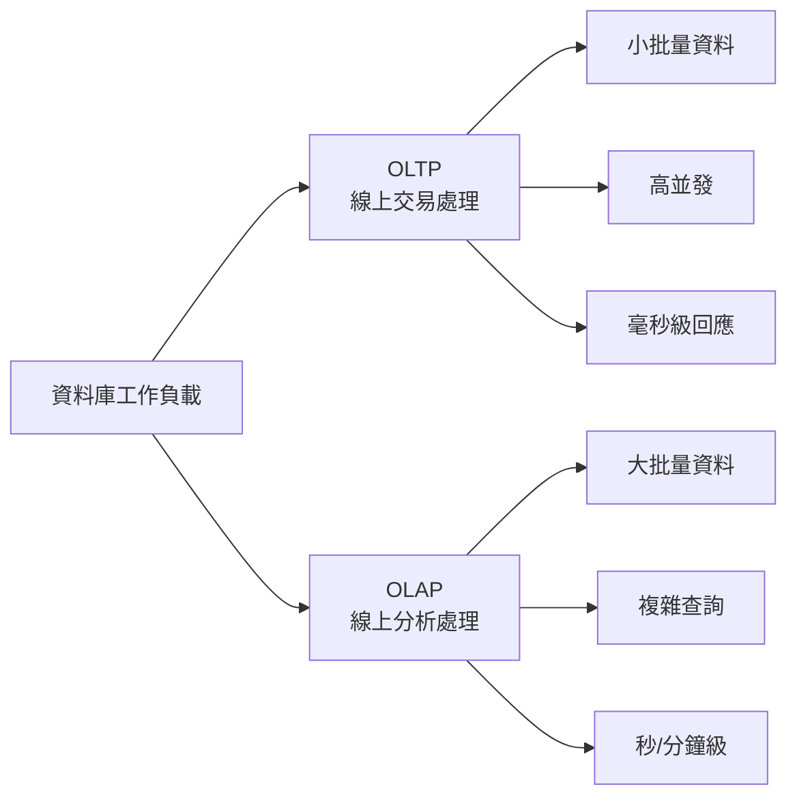

**特性對比**

| 特性 | OLTP | OLAP |
|-----|------|------|
| **讀取模式** | 少量記錄，依 Key | 大量記錄聚合 |
| **寫入模式** | 隨機寫入，低延遲 | 批量匯入 (ETL) |
| **使用者** | 終端用戶，成千上萬 | 內部分析師，少數 |
| **資料量** | GB ~ TB | TB ~ PB |
| **查詢範例** | 查詢用戶訂單 | 本季度銷售分析 |
| **瓶頸** | 磁碟 seek 時間 | 磁碟頻寬 |

**範例對比**

```sql
-- OLTP 查詢
SELECT * FROM orders 
WHERE order_id = 'ord_123456';
-- 查詢 1 筆, 0.001 秒

-- OLAP 查詢
SELECT 
  product_category,
  SUM(revenue) as total_revenue,
  COUNT(*) as order_count
FROM orders
WHERE order_date >= '2024-01-01'
  AND order_date < '2024-04-01'
GROUP BY product_category
ORDER BY total_revenue DESC;
-- 掃描數百萬筆, 10 秒
```

### 資料倉儲 (Data Warehouse)

**為什麼需要分離？**

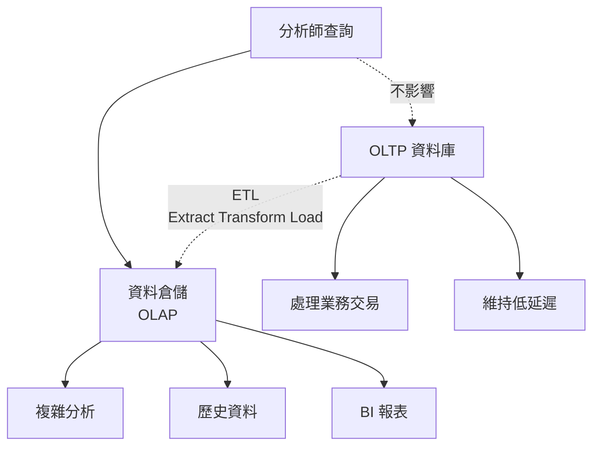

**ETL 流程**

```python
# 簡化的 ETL 範例
def etl_daily():
    # Extract: 從 OLTP 提取資料
    orders = extract_from_postgres(
        "SELECT * FROM orders WHERE date = YESTERDAY"
    )
    
    # Transform: 轉換與豐富
    transformed = []
    for order in orders:
        transformed.append({
            'order_id': order['id'],
            'revenue': order['amount'],
            'product_category': lookup_category(order['product_id']),
            'customer_segment': classify_customer(order['customer_id']),
            'date': order['created_at'].date()
        })
    
    # Load: 載入資料倉儲
    load_to_warehouse(transformed, table='fact_orders')
```

### Star Schema vs Snowflake Schema

**Star Schema (星型架構)**

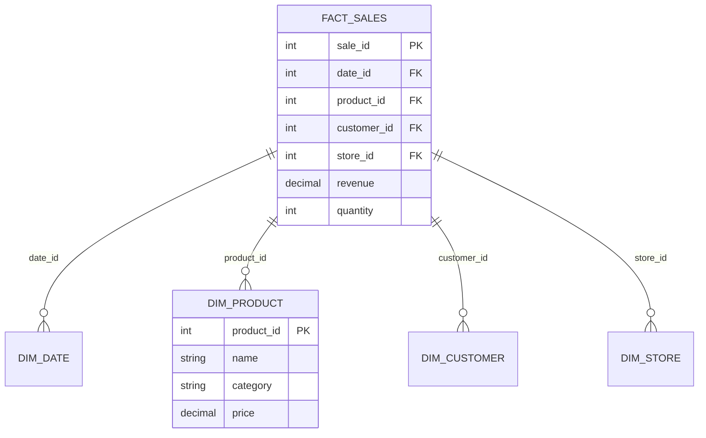

**Snowflake Schema (雪花架構)**

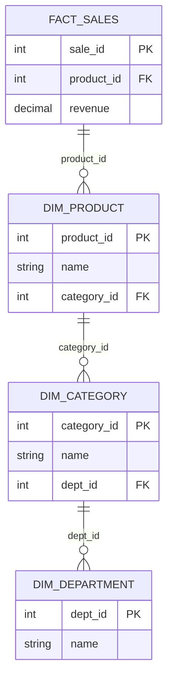

**選擇建議**

```yaml
Star Schema:
  優點:
    - 查詢簡單 (JOIN 少)
    - 效能好
    - 易於理解
  缺點:
    - 資料重複 (反正規化)

Snowflake Schema:
  優點:
    - 節省空間
    - 正規化
  缺點:
    - 查詢複雜 (更多 JOIN)
    - 效能較差

推薦: Star Schema (磁碟便宜，效能重要)
```

---

## 📊 列式儲存 (Column-Oriented Storage)

### 為什麼需要列式儲存？

**OLAP 查詢的特點**

```sql
-- 典型 OLAP 查詢：只需少數欄位
SELECT 
  product_category,
  SUM(revenue) 
FROM sales
WHERE date >= '2024-01-01'
GROUP BY product_category;

-- 問題：表有 100 個欄位
-- 但查詢只用到 3 個 (date, product_category, revenue)
-- 傳統行式儲存仍需讀取所有欄位！
```

### 行式 vs 列式儲存

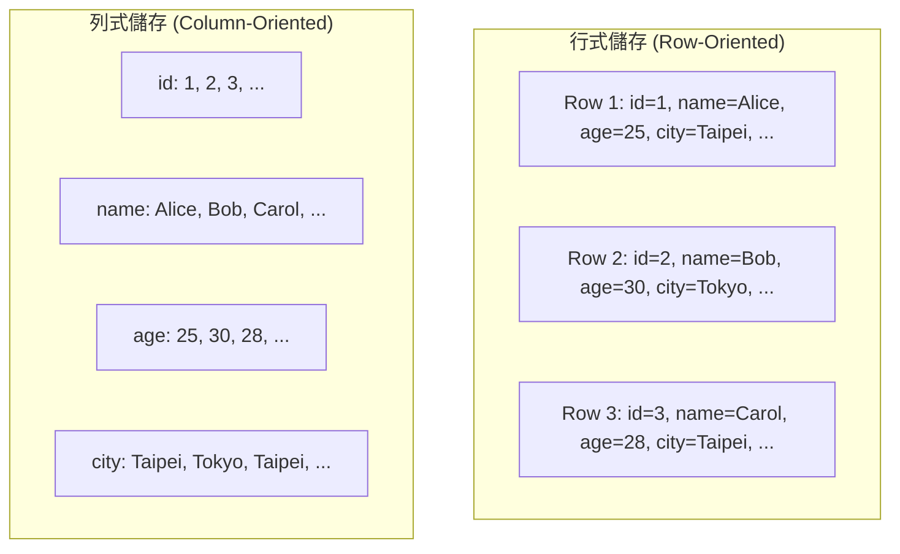

**列式儲存的優勢**

```python
# 行式儲存：讀取 1 億行，每行 100 欄位
# 需要讀取: 100 億個值

# 列式儲存：只讀取需要的欄位
# 需要讀取: 3 億個值 (僅需要的 3 個欄位)

# 減少 I/O: 97% 的資料不需要讀取！
```

### 列式壓縮

**Bitmap Encoding**

```
原始資料 (country 欄位):
Taiwan, USA, Taiwan, Japan, USA, Taiwan, USA

Bitmap:
Taiwan: 1001010
USA:    0101001
Japan:  0010000

查詢 "Taiwan 或 USA":
1001010 OR 0101001 = 1101011
-> Row 0,1,3,4,6

優勢:
- 極高壓縮比
- 位元運算極快
- 適合低基數欄位
```

**Run-Length Encoding**

```
原始資料:
Taiwan, Taiwan, Taiwan, USA, USA, Japan, Japan, Japan, Japan

編碼:
Taiwan: 3, USA: 2, Japan: 4

查詢範圍:
Row 0-2: Taiwan
Row 3-4: USA
Row 5-8: Japan
```

**真實案例：效能提升**

```yaml
Scenario: 10 億行資料，100 個欄位

行式儲存:
  - 原始大小: 1 TB
  - 查詢需讀取: 1 TB
  - 查詢時間: 60 秒

列式儲存 + 壓縮:
  - 壓縮後大小: 100 GB (10x)
  - 查詢需讀取: 3 GB (只讀 3 個欄位)
  - 查詢時間: 2 秒 (30x faster!)
```

### 列式儲存的寫入

**問題：寫入變複雜**

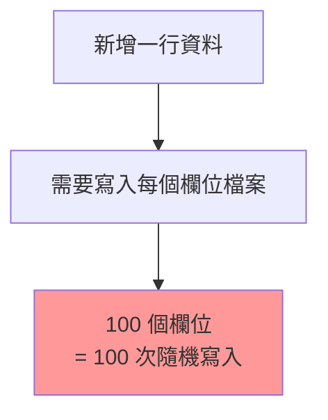

**解決方案：LSM-Tree 混合**

```yaml
架構:
  - 寫入: 先到 MemTable (行式)
  - 定期刷到磁碟時: 轉換為列式格式
  - 讀取: 合併 MemTable + 列式檔案

範例: Apache Parquet, ORC
```

### 實際產品

```yaml
ClickHouse:
  - 極致列式儲存
  - 即時 OLAP
  - 數十億行秒級查詢

Apache Parquet:
  - Hadoop 生態標準
  - 列式檔案格式
  - Spark, Hive 支援

Amazon Redshift:
  - 雲端資料倉儲
  - 列式儲存
  - MPP 架構

Google BigQuery:
  - Serverless
  - 列式儲存 (Capacitor)
  - PB 級資料分析
```

---

## 💻 實戰：選擇合適的儲存引擎

### 決策流程圖

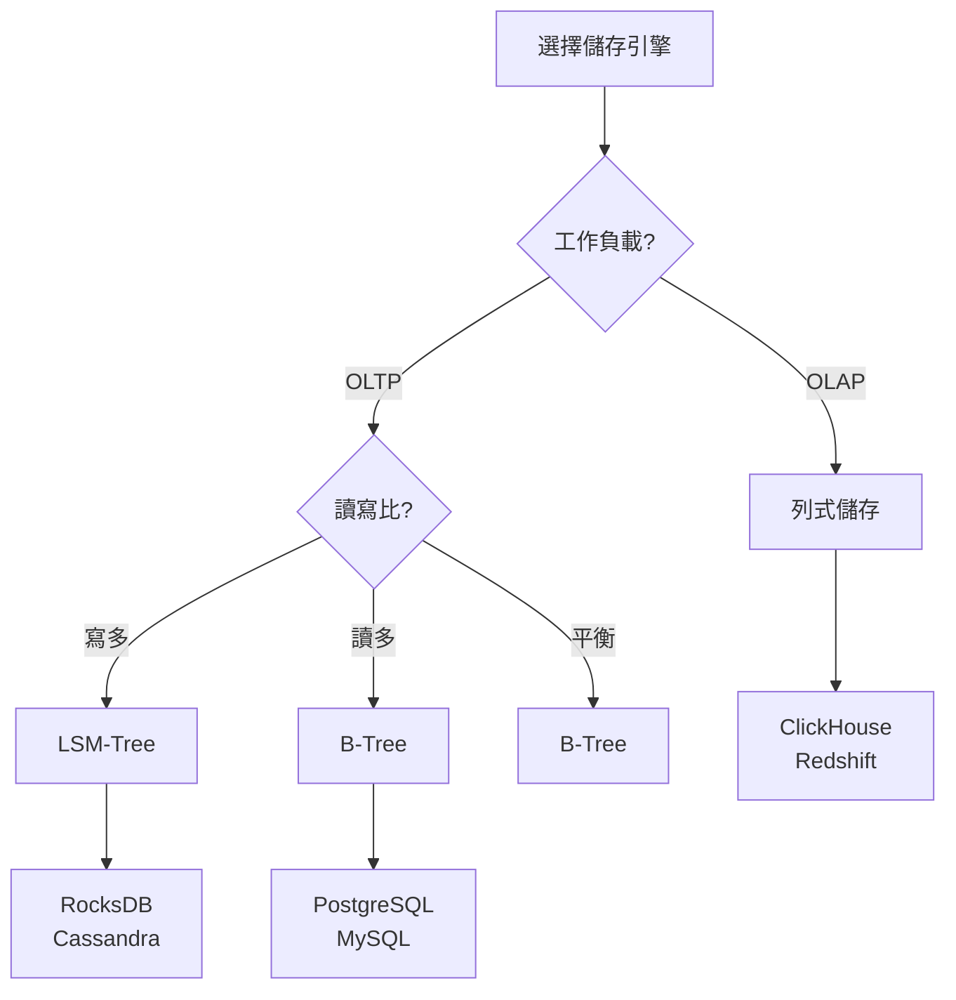

### 場景對應表

| 場景 | 推薦引擎 | 原因 |
|-----|---------|------|
| 用戶資料、訂單 | B-Tree (PostgreSQL) | 事務、一致性 |
| 時序資料、日誌 | LSM-Tree (InfluxDB) | 高寫入吞吐 |
| 即時分析 | 列式 (ClickHouse) | 聚合查詢快 |
| 快取、計數器 | Hash Index (Redis) | 極低延遲 |
| 全文搜尋 | 倒排索引 (Elasticsearch) | 文字查詢 |
| 圖關係 | 鄰接表 (Neo4j) | 路徑查詢 |

---

## 🤔 思考題

### 1. 為什麼 SSD 仍然偏好順序寫入？

<details>
<summary>答案</summary>

雖然 SSD 隨機讀取很快，但：

1. **寫入放大**：SSD 需以 Block 為單位抹除
2. **並行性**：順序寫入能利用多通道並行
3. **預取**：OS 能預測順序存取模式
4. **磨損均衡**：隨機寫入加速磨損

實測：SSD 順序寫入仍比隨機寫入快 3-5 倍
</details>

### 2. 何時應該使用覆蓋索引 (Covering Index)？

<details>
<summary>答案</summary>

**覆蓋索引**：索引包含查詢所需的所有欄位

```sql
-- 查詢只需要 user_id 和 email
SELECT user_id, email 
FROM users 
WHERE status = 'active';

-- 如果索引是 (status, user_id, email)
-- 則不需要回表查詢 (Index-Only Scan)
```

**適用場景**：
- 查詢欄位少
- 查詢頻繁
- 欄位資料小

**Trade-off**：
- ✅ 查詢快
- ❌ 索引更大
- ❌ 寫入變慢
</details>

---

## 📚 本章總結

### 核心要點

1. **索引是效能關鍵**：選對索引，快 1000 倍
2. **兩大陣營**：
   - LSM-Tree：寫入優化、順序 I/O
   - B-Tree：讀取優化、原地更新
3. **OLTP vs OLAP**：不同工作負載需要不同引擎
4. **列式儲存**：OLAP 的革命性改進

### 選擇建議

```yaml
預設選擇:
  - OLTP: PostgreSQL (B-Tree)
  - 高寫入: RocksDB (LSM-Tree)
  - OLAP: ClickHouse (列式)

持續監控:
  - 寫入吞吐量
  - 查詢延遲
  - 磁碟使用量
  - Compaction 狀況

適時調整:
  - 索引策略
  - Compaction 參數
  - 資料分區
```

### 下一章預告

在下一章《資料編碼與演化》中，我們將探討：
- 資料序列化格式
- 向前/向後相容性
- Schema 演化策略
- 資料流模式

---

## 參考資料 (References)

1. Martin Kleppmann, *Designing Data-Intensive Applications*, Chapter 3 (O'Reilly, 2017)
2. [LevelDB Implementation](https://github.com/google/leveldb)
3. [RocksDB Tuning Guide](https://github.com/facebook/rocksdb/wiki/RocksDB-Tuning-Guide)
4. Patrick O'Neil et al., ["The Log-Structured Merge-Tree (LSM-Tree)"](http://www.cs.umb.edu/~poneil/lsmtree.pdf) (1996)
5. [ClickHouse Documentation](https://clickhouse.com/docs/)
6. [Parquet File Format](https://parquet.apache.org/docs/)
