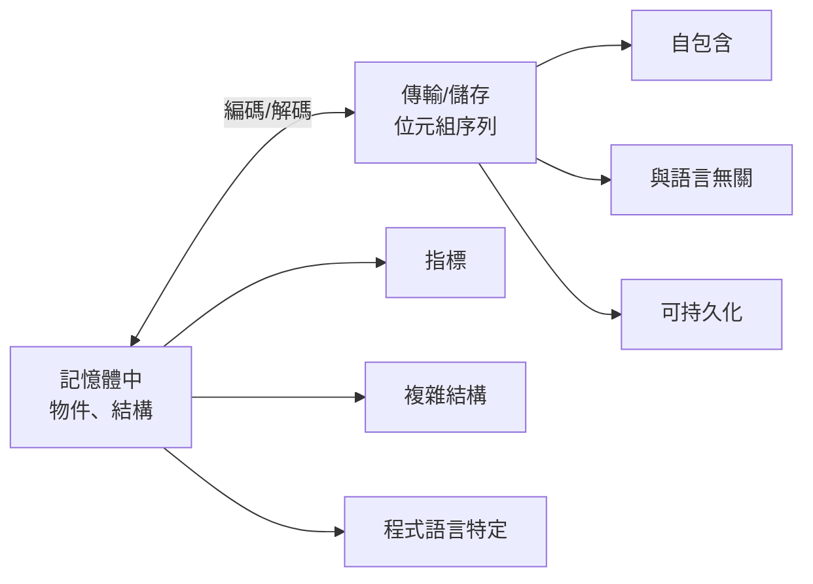
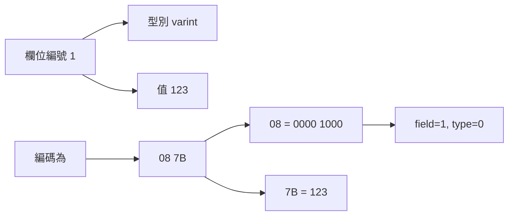
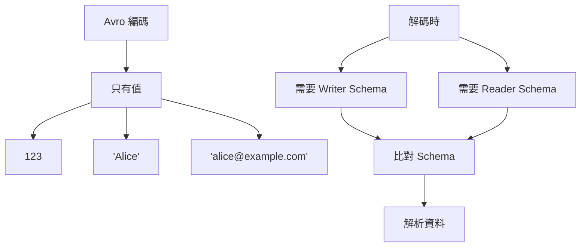
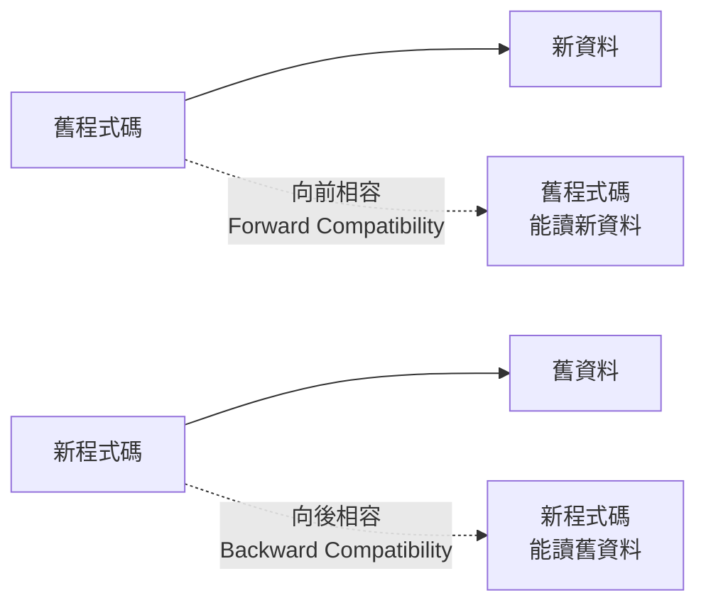
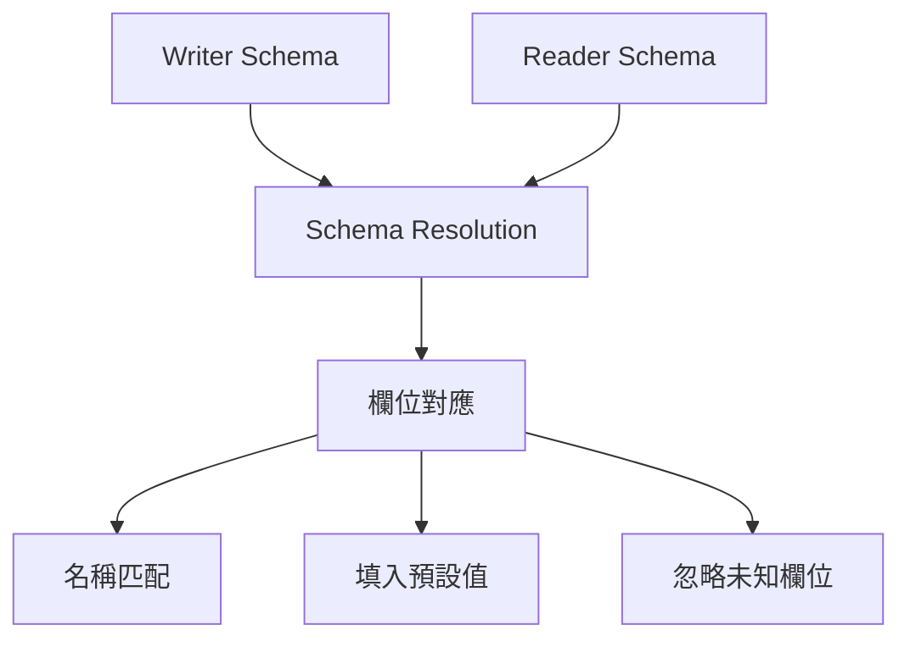
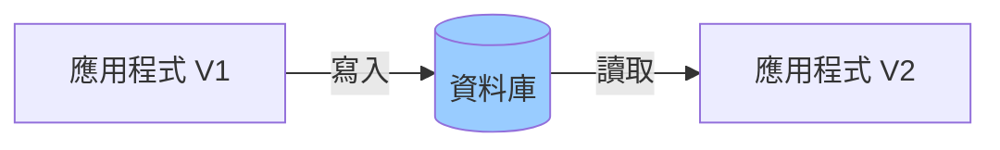
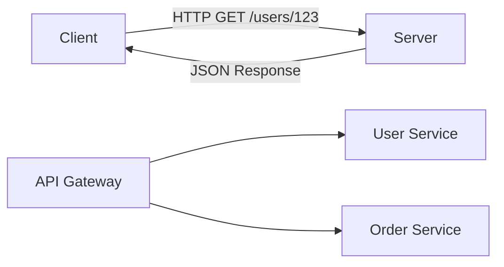
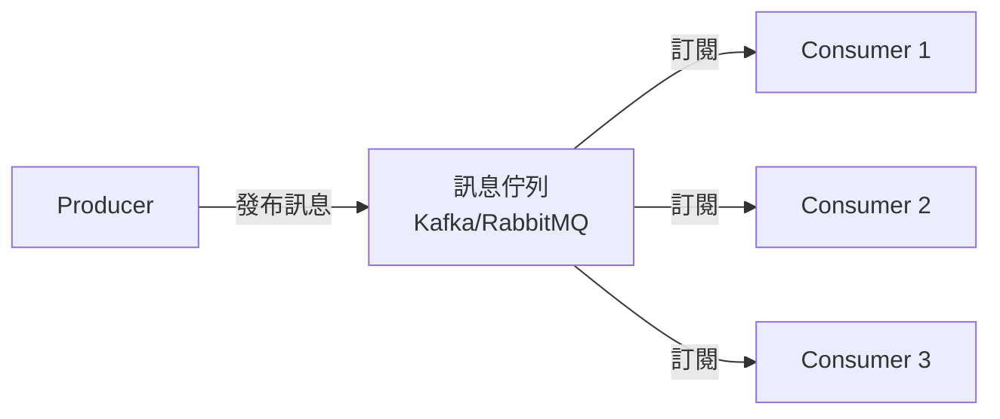
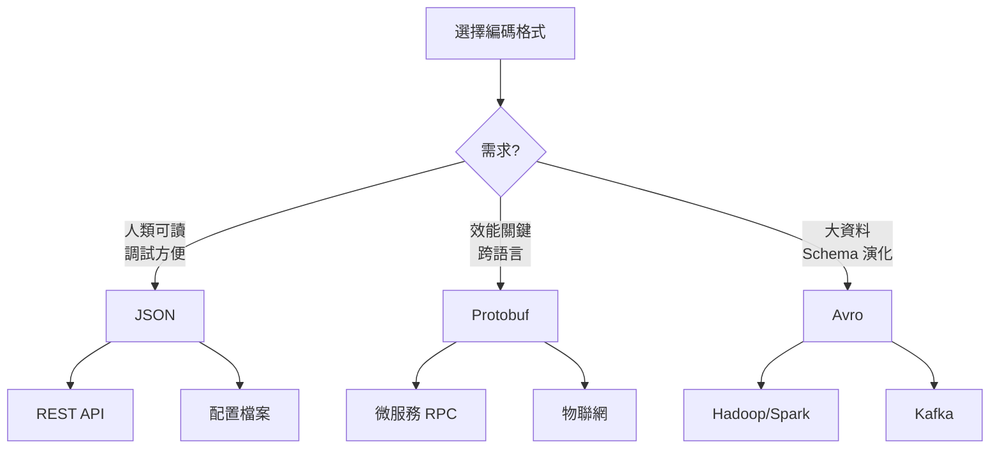

# 資料編碼與演化

## 🎯 學習目標

本章將幫助你理解：
- 資料序列化格式的演進
- 向前相容性與向後相容性
- Schema 演化策略
- 不同編碼格式的權衡
- 資料流模式

---

## 💡 為什麼需要編碼？

**應用程式中資料存在兩種形式**



**編碼的需求場景**

```yaml
1. 持久化儲存:
   - 寫入資料庫
   - 寫入檔案系統

2. 網路傳輸:
   - REST API
   - RPC 呼叫
   - 訊息佇列

3. 跨語言通訊:
   - 微服務 (Go → Python)
   - 前後端 (JS ↔ Java)
```

---

## 🔍 語言內建的編碼

### 問題：只能同語言使用

**範例：Python Pickle**

```python
import pickle

# 編碼
user = {"name": "Alice", "age": 25}
encoded = pickle.dumps(user)
# b'\x80\x04\x95\x1e\x00\x00\x00...'

# 解碼
decoded = pickle.loads(encoded)
# {"name": "Alice", "age": 25}
```

**其他語言內建編碼**

```yaml
Java: Serializable
Ruby: Marshal
Python: Pickle
.NET: BinaryFormatter
```

**致命缺陷**

```yaml
❌ 安全性問題:
   - 可執行任意程式碼
   - 反序列化漏洞常見

❌ 跨語言困難:
   - 只能同語言使用
   - 版本升級問題

❌ 效能差:
   - 編碼/解碼慢
   - 資料量大

❌ 演化困難:
   - Schema 不明確
   - 相容性差

結論: 不要用於跨系統通訊！
```

---

## 📝 文字編碼格式

### JSON、XML、CSV

**JSON 範例**

```json
{
  "user_id": 123,
  "name": "Alice Chen",
  "email": "alice@example.com",
  "created_at": "2024-01-15T10:30:00Z",
  "preferences": {
    "theme": "dark",
    "language": "zh-TW"
  },
  "tags": ["developer", "golang"]
}
```

**優勢**

```yaml
✅ 人類可讀:
   - 易於除錯
   - 直接查看內容

✅ 廣泛支援:
   - 幾乎所有語言
   - 豐富的工具

✅ 跨平台:
   - Web 標準
   - API 常見格式

✅ Schema-less:
   - 彈性高
   - 快速迭代
```

**劣勢與陷阱**

```yaml
❌ 數字類型模糊:
   JSON: {"value": 123}
   - 是 int32? int64? float?
   - 精度問題 (JavaScript Number 限制)

❌ 沒有二進制支援:
   JSON: {"image": "base64encodedstring..."}
   - 需要 Base64 編碼
   - 增加 33% 大小

❌ Schema 可選:
   - 沒有強制驗證
   - 容易出錯

❌ 冗長:
   - 欄位名重複
   - 檔案大
```

**數字精度問題範例**

```javascript
// JavaScript 的陷阱
const json = '{"user_id": 9007199254740993}';
const obj = JSON.parse(json);

console.log(obj.user_id);
// 9007199254740992  <- 錯了！

// 原因: JavaScript Number 是 IEEE 754 double
// 只能精確表示 -(2^53-1) ~ (2^53-1)
```

**解決方案**

```json
// 方案 1: 用字串
{"user_id": "9007199254740993"}

// 方案 2: 用專門的大數函式庫
// 方案 3: 用二進制格式 (Protocol Buffers, Avro)
```

---

## 🔧 二進制編碼格式

### 為什麼需要二進制？

**大小比較**

```json
// JSON: 82 bytes
{
  "user_id": 123,
  "name": "Alice Chen",
  "email": "alice@example.com"
}

// MessagePack: 50 bytes (39% 節省)
// Protocol Buffers: 33 bytes (60% 節省)
// Avro: 32 bytes (61% 節省)
```

### Protocol Buffers (Protobuf)

**由 Google 開發**

**定義 Schema**

```protobuf
// user.proto
syntax = "proto3";

message User {
  int64 user_id = 1;      // 欄位編號
  string name = 2;
  string email = 3;
  int32 age = 4;
  repeated string tags = 5;  // 陣列
}
```

**編碼原理**



**編碼細節**

```
原始資料:
user_id: 123
name: "Alice"

編碼 (十六進制):
08 7B                    # field 1, varint, value=123
12 05 41 6C 69 63 65    # field 2, string, length=5, "Alice"

解析:
08 = 00001000
  ↑↑↑  ↑↑↑
  001  000 = field 1, wire type 0 (varint)

7B = 01111011 = 123

12 = 00010010 = field 2, wire type 2 (length-delimited)
05 = 長度 5
41 6C 69 63 65 = "Alice" (UTF-8)
```

**優勢**

```yaml
✅ 緊湊:
   - 欄位編號代替欄位名
   - Varint 編碼小數字

✅ 快速:
   - 解析簡單
   - 不需要字串比對

✅ Schema 定義:
   - 強型別
   - 自動生成程式碼

✅ 向前/向後相容:
   - 良好的演化支援
```

**使用範例**

```python
# Python
from user_pb2 import User

# 序列化
user = User()
user.user_id = 123
user.name = "Alice"
user.email = "alice@example.com"

binary_data = user.SerializeToString()

# 反序列化
user2 = User()
user2.ParseFromString(binary_data)
print(user2.name)  # "Alice"
```

### Apache Thrift

**由 Facebook 開發**

```thrift
// user.thrift
struct User {
  1: required i64 userId,
  2: required string name,
  3: optional string email,
  4: optional i32 age
}
```

**兩種二進制編碼**

```yaml
BinaryProtocol:
  - 可讀性較好
  - 稍大
  
CompactProtocol:
  - 更緊湊
  - 類似 Protobuf
```

### Apache Avro

**由 Hadoop 生態開發**

**Schema 定義**

```json
{
  "type": "record",
  "name": "User",
  "fields": [
    {"name": "user_id", "type": "long"},
    {"name": "name", "type": "string"},
    {"name": "email", "type": ["null", "string"], "default": null}
  ]
}
```

**關鍵特性：沒有欄位編號！**



**Avro 的獨特之處**

```yaml
編碼:
  - 只儲存值，不儲存型別或欄位名
  - 最緊湊

解碼:
  - 需要知道寫入時用的 Schema
  - 可以用不同 Schema 讀取 (Schema 演化)

使用場景:
  - 大資料 (Hadoop, Spark)
  - 每個檔案內嵌 Schema
  - Schema Registry
```

---

## 🔄 Schema 演化

### 向前相容 vs 向後相容



**實際場景**

```yaml
滾動升級 (Rolling Update):
  1. 舊版本服務運行中
  2. 部署新版本服務
  3. 新舊版本共存
  4. 逐步替換所有實例
  
  需求:
  - 新程式碼讀舊資料 (向後相容)
  - 舊程式碼讀新資料 (向前相容)
```

### Protobuf Schema 演化

**規則**

```yaml
✅ 允許:
  - 新增 optional 欄位
  - 新增 repeated 欄位
  - 刪除 optional 欄位 (欄位編號不能重用)

❌ 禁止:
  - 改變欄位型別
  - 改變欄位編號
  - 新增 required 欄位
```

**演化範例**

```protobuf
// Version 1
message User {
  int64 user_id = 1;
  string name = 2;
}

// Version 2: 新增可選欄位
message User {
  int64 user_id = 1;
  string name = 2;
  string email = 3;        // ✅ 新增 optional
  repeated string tags = 4; // ✅ 新增 repeated
  // int32 age = 1;         // ❌ 不能重用編號 1
}
```

**向後相容性**

```python
# 新程式碼讀舊資料
old_data = b'\x08\x7B\x12\x05Alice'  # 只有 user_id 和 name

user = User()
user.ParseFromString(old_data)

print(user.user_id)  # 123
print(user.name)     # "Alice"
print(user.email)    # "" (預設值)
print(user.tags)     # [] (空陣列)
```

**向前相容性**

```python
# 舊程式碼讀新資料
new_data = encode_user_v2()  # 包含 email, tags

user = UserV1()  # 舊版本結構
user.ParseFromString(new_data)

print(user.user_id)  # 123
print(user.name)     # "Alice"
# email 和 tags 被忽略，但資料保留
```

### Avro Schema 演化

**更強大的演化能力**

```json
// Writer Schema (寫入時)
{
  "type": "record",
  "name": "User",
  "fields": [
    {"name": "user_id", "type": "long"},
    {"name": "name", "type": "string"}
  ]
}

// Reader Schema (讀取時)
{
  "type": "record",
  "name": "User",
  "fields": [
    {"name": "user_id", "type": "long"},
    {"name": "name", "type": "string"},
    {"name": "email", "type": "string", "default": ""}  // 新欄位
  ]
}
```

**Avro 的 Schema Resolution**



**欄位重新命名**

```json
// Writer Schema
{
  "name": "User",
  "fields": [
    {"name": "full_name", "type": "string"}
  ]
}

// Reader Schema (可讀舊資料)
{
  "name": "User",
  "fields": [
    {
      "name": "name",
      "type": "string",
      "aliases": ["full_name"]  // 別名
    }
  ]
}
```

---

## 🌊 資料流模式

### 1. 資料庫資料流



**挑戰**

```yaml
問題:
  - 資料可能存在數年
  - 程式碼持續演化
  - 無法強制刷新所有資料

解決方案:
  - Schema-less (JSON 欄位)
  - 向後相容
  - 資料遷移策略
```

**LinkedIn 的做法**

```sql
-- 使用 Avro 儲存在資料庫
CREATE TABLE users (
  user_id BIGINT PRIMARY KEY,
  data BYTEA  -- Avro 編碼的資料
);

-- Schema 儲存在 Schema Registry
-- 每筆記錄包含 Schema ID
```

### 2. 服務資料流 (REST & RPC)

**REST API**



**API 版本管理**

```yaml
方法 1: URL 版本
  GET /v1/users/123
  GET /v2/users/123

方法 2: Header 版本
  GET /users/123
  Header: Accept: application/vnd.api+json;version=2

方法 3: 內容協商
  GET /users/123
  Header: Accept: application/vnd.user.v2+json

推薦: URL 版本 (最清晰)
```

**RPC 框架**

```yaml
gRPC:
  - 基於 HTTP/2
  - 使用 Protobuf
  - 強型別
  - 程式碼生成

優勢:
  - ✅ 效能好
  - ✅ 型別安全
  - ✅ 跨語言

劣勢:
  - ❌ 調試困難 (二進制)
  - ❌ 需要程式碼生成
  - ❌ 瀏覽器支援差
```

**gRPC 範例**

```protobuf
// user_service.proto
service UserService {
  rpc GetUser (GetUserRequest) returns (User);
  rpc CreateUser (CreateUserRequest) returns (User);
}

message GetUserRequest {
  int64 user_id = 1;
}

message User {
  int64 user_id = 1;
  string name = 2;
  string email = 3;
}
```

```go
// Go Server
func (s *server) GetUser(ctx context.Context, req *pb.GetUserRequest) (*pb.User, error) {
    user := &pb.User{
        UserId: req.UserId,
        Name:   "Alice",
        Email:  "alice@example.com",
    }
    return user, nil
}
```

### 3. 訊息傳遞資料流



**訊息格式挑戰**

```yaml
問題:
  - Producer 和 Consumer 獨立部署
  - 版本可能不一致
  - 訊息可能積壓數天

需求:
  - 強向前/向後相容
  - Schema 管理
```

**Schema Registry**

```mermaid
graph TD
    A["Producer"] -->|1. 註冊 Schema| B["Schema Registry"]
    A -->|2. 獲得 Schema ID| C["編碼訊息"]
    C -->|3. 發送 [Schema ID][Data]| D["Kafka"]
    
    E["Consumer"] -->|4. 讀取訊息| D
    E -->|5. 查詢 Schema ID| B
    B -->|6. 返回 Schema| E
    E -->|7. 解碼| F["處理"]
```

**Confluent Schema Registry 範例**

```python
from confluent_kafka import avro
from confluent_kafka.avro import AvroProducer

# 定義 Schema
value_schema_str = """
{
  "type": "record",
  "name": "User",
  "fields": [
    {"name": "user_id", "type": "long"},
    {"name": "name", "type": "string"}
  ]
}
"""

# Producer
producer = AvroProducer({
    'bootstrap.servers': 'localhost:9092',
    'schema.registry.url': 'http://localhost:8081'
}, default_value_schema=avro.loads(value_schema_str))

# 發送訊息 (自動註冊 Schema)
producer.produce(topic='users', value={
    'user_id': 123,
    'name': 'Alice'
})
```

---

## ⚖️ 編碼格式比較

### 功能對比

| 特性 | JSON | Protobuf | Thrift | Avro |
|-----|------|----------|--------|------|
| **可讀性** | ✅ 人類可讀 | ❌ 二進制 | ❌ 二進制 | ❌ 二進制 |
| **緊湊性** | ❌ 冗長 | ✅ 緊湊 | ✅ 緊湊 | ✅ 最緊湊 |
| **Schema** | 可選 | 必須 | 必須 | 必須 |
| **演化** | 弱 | 強 | 強 | 最強 |
| **程式碼生成** | 不需要 | 需要 | 需要 | 可選 |
| **動態類型** | ✅ | ❌ | ❌ | ✅ |
| **欄位識別** | 名稱 | 編號 | 編號 | 名稱 |

### 效能對比

```yaml
大小 (1000 筆用戶資料):
  JSON:     82 KB
  Protobuf: 33 KB (60% 小)
  Avro:     32 KB (61% 小)

編碼速度:
  JSON:     基準
  Protobuf: 5-10x 快
  Avro:     3-5x 快

解碼速度:
  JSON:     基準
  Protobuf: 5-10x 快
  Avro:     3-5x 快

記憶體使用:
  - 二進制格式需要額外的 Schema
  - 但整體仍更省
```

### 選擇指南



---

## 💻 實戰：API 版本管理

### 案例：用戶 API 演化

**V1: 初始版本**

```json
// GET /v1/users/123
{
  "id": 123,
  "name": "Alice Chen"
}
```

**V2: 新增欄位**

```json
// GET /v2/users/123
{
  "id": 123,
  "name": "Alice Chen",
  "email": "alice@example.com",
  "created_at": "2024-01-15T10:30:00Z"
}
```

**V3: 重構結構**

```json
// GET /v3/users/123
{
  "user_id": 123,  // 改名
  "profile": {     // 嵌套結構
    "name": "Alice Chen",
    "email": "alice@example.com"
  },
  "metadata": {
    "created_at": "2024-01-15T10:30:00Z",
    "updated_at": "2024-11-13T14:20:00Z"
  }
}
```

**實作策略**

```python
from flask import Flask, jsonify, request

app = Flask(__name__)

def get_user_from_db(user_id):
    # 從資料庫獲取完整資料
    return {
        'user_id': user_id,
        'name': 'Alice Chen',
        'email': 'alice@example.com',
        'created_at': '2024-01-15T10:30:00Z',
        'updated_at': '2024-11-13T14:20:00Z'
    }

# V1 API: 最小欄位
@app.route('/v1/users/<int:user_id>')
def get_user_v1(user_id):
    user = get_user_from_db(user_id)
    return jsonify({
        'id': user['user_id'],
        'name': user['name']
    })

# V2 API: 新增欄位
@app.route('/v2/users/<int:user_id>')
def get_user_v2(user_id):
    user = get_user_from_db(user_id)
    return jsonify({
        'id': user['user_id'],
        'name': user['name'],
        'email': user['email'],
        'created_at': user['created_at']
    })

# V3 API: 重構結構
@app.route('/v3/users/<int:user_id>')
def get_user_v3(user_id):
    user = get_user_from_db(user_id)
    return jsonify({
        'user_id': user['user_id'],
        'profile': {
            'name': user['name'],
            'email': user['email']
        },
        'metadata': {
            'created_at': user['created_at'],
            'updated_at': user['updated_at']
        }
    })
```

---

## 🤔 思考題

### 1. JSON 中如何表示二進制資料？

<details>
<summary>答案</summary>

**方法 1: Base64 編碼**
```json
{
  "image": "iVBORw0KGgoAAAANSUhEUgAA..."
}
```
- ❌ 增加 33% 大小
- ✅ 標準方法

**方法 2: 使用 Data URL**
```json
{
  "image": "data:image/png;base64,iVBORw0..."
}
```
- 包含 MIME 類型

**方法 3: 分離儲存**
```json
{
  "image_url": "https://cdn.example.com/img123.png"
}
```
- ✅ 最佳方案
- JSON 只存 URL
- 二進制檔案單獨傳輸

</details>

### 2. 什麼時候應該使用 gRPC 而不是 REST？

<details>
<summary>答案</summary>

**使用 gRPC**：
- ✅ 微服務內部通訊
- ✅ 效能關鍵路徑
- ✅ 需要串流 (Server/Client Streaming)
- ✅ 強型別需求

**使用 REST**：
- ✅ 公開 API
- ✅ 瀏覽器直接呼叫
- ✅ 需要人類可讀
- ✅ 簡單 CRUD

**混合策略**：
- 內部服務用 gRPC
- 對外 API 用 REST
- API Gateway 轉換

</details>

---

## 📚 本章總結

### 核心要點

1. **編碼無處不在**：儲存、傳輸都需要
2. **相容性至關重要**：滾動升級的基礎
3. **沒有完美格式**：根據場景選擇
4. **Schema 演化**：系統長期演化的關鍵

### 選擇建議

```yaml
公開 API:
  - 預設: JSON
  - 考慮: OpenAPI/Swagger 文件

微服務通訊:
  - 推薦: gRPC + Protobuf
  - 備選: REST + JSON

訊息佇列:
  - 推薦: Avro + Schema Registry
  - 備選: Protobuf

大資料:
  - 推薦: Avro (Parquet 檔案)
  - 原因: 最佳壓縮、Schema 演化

配置檔案:
  - 推薦: YAML / JSON
  - 原因: 人類可讀
```

### 下一章預告

在下一章《資料複製 (Replication)》中，我們將進入分散式系統領域，探討：
- 主從複製、多主複製、無主複製
- 同步 vs 異步複製
- 複製延遲問題
- 一致性保證

---

## 參考資料 (References)

1. Martin Kleppmann, *Designing Data-Intensive Applications*, Chapter 4 (O'Reilly, 2017)
2. [Protocol Buffers Documentation](https://protobuf.dev/)
3. [Apache Avro Specification](https://avro.apache.org/docs/current/spec.html)
4. [gRPC Documentation](https://grpc.io/docs/)
5. [Confluent Schema Registry](https://docs.confluent.io/platform/current/schema-registry/)
6. [API Versioning Best Practices](https://www.freecodecamp.org/news/rest-api-best-practices-rest-endpoint-design-examples/)
