# 04 - 資料複製 (Replication)

## 🎯 學習目標

完成本章後,你將能夠:
- 理解資料複製的目的與挑戰
- 掌握三種主流複製架構的運作原理
- 分析複製延遲帶來的一致性問題
- 根據業務需求選擇合適的複製策略

---

## 💡 核心概念

### 什麼是資料複製?

**資料複製 (Replication)** 是在多個節點上維護相同資料副本的技術。

**為什麼需要複製?**

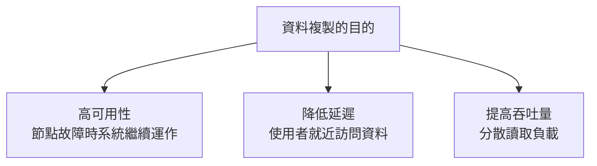

**核心挑戰**: 如何在多個副本間**同步資料變更**,同時處理網路延遲、節點故障等問題。

---

## 📊 主從複製 (Leader-Follower Replication)

### 基本架構

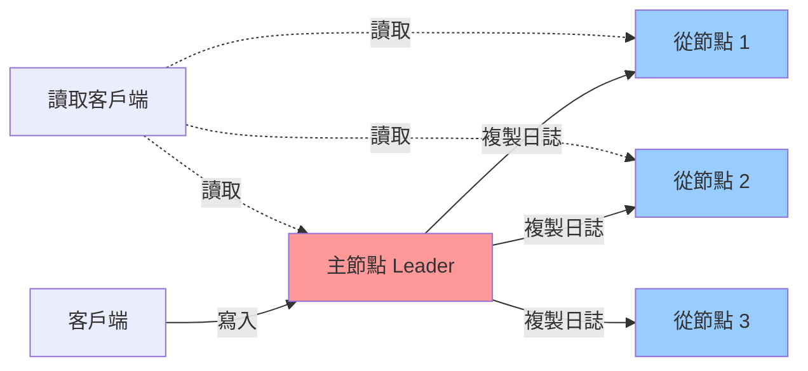

**運作流程**:

1. **寫入**: 所有寫入操作發送到 Leader
2. **複製**: Leader 將變更記錄 (Replication Log) 發送給所有 Follower
3. **應用**: Follower 按相同順序應用變更
4. **讀取**: 可從 Leader 或任何 Follower 讀取

### 💻 實作範例

**PostgreSQL 主從複製配置**:

```sql
-- 主節點配置 (postgresql.conf)
wal_level = replica
max_wal_senders = 3
wal_keep_size = 1GB

-- 從節點連接命令
pg_basebackup -h primary_host -D /var/lib/postgresql/data -U replication -P --wal-method=stream
```

**應用層讀寫分離**:

```python
from sqlalchemy import create_engine

# 主節點連線 (處理寫入)
write_engine = create_engine('postgresql://master:5432/db')

# 從節點連線池 (處理讀取)
read_engines = [
    create_engine('postgresql://replica1:5432/db'),
    create_engine('postgresql://replica2:5432/db')
]

def execute_write(query):
    return write_engine.execute(query)

def execute_read(query):
    # 簡單的負載均衡
    import random
    engine = random.choice(read_engines)
    return engine.execute(query)
```

### 同步 vs 異步複製

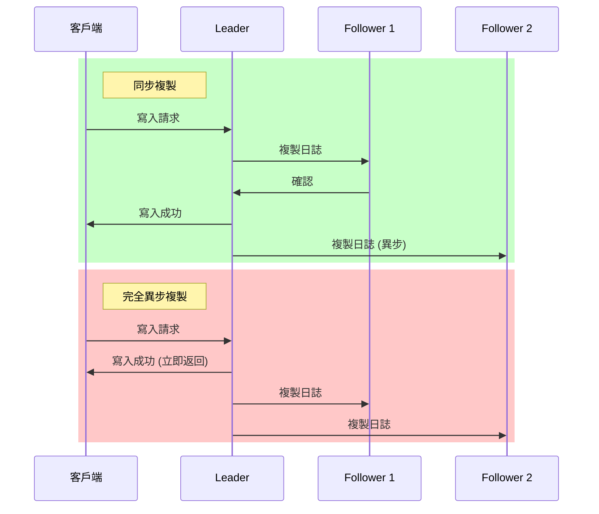

**⚖️ 權衡分析**:

| 特性 | 同步複製 | 異步複製 |
|------|----------|----------|
| **資料耐久性** | ✅ 強保證 (至少 2 個副本) | ❌ 可能丟失未複製的寫入 |
| **寫入延遲** | ❌ 高 (等待網路 RTT) | ✅ 低 (立即返回) |
| **可用性** | ❌ Follower 故障時寫入受阻 | ✅ Follower 故障不影響寫入 |

**實務做法**: **半同步複製 (Semi-synchronous)**
- 至少一個 Follower 同步確認
- 其餘 Follower 異步複製
- 平衡耐久性與可用性

### 故障處理

#### Follower 故障: 追趕恢復 (Catch-up Recovery)


#### Leader 故障: 故障轉移 (Failover)

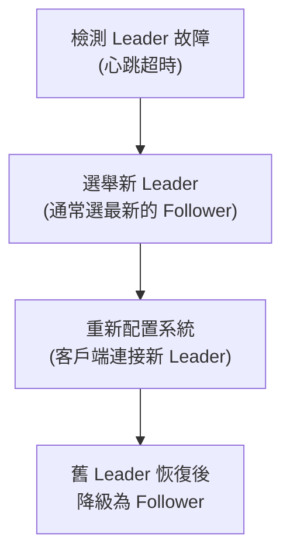

**⚠️ 故障轉移的陷阱**:

1. **資料丟失**: 異步複製時,新 Leader 可能缺少部分寫入
2. **腦裂 (Split-brain)**: 兩個節點都認為自己是 Leader
3. **超時設定**: 太短會導致誤判,太長影響可用性

**🏢 真實案例: GitHub 2012 故障**

- MySQL 主從複製環境
- 網路故障導致 Follower 與 Leader 斷開
- 自動故障轉移選出新 Leader
- 舊 Leader 恢復後產生腦裂
- **後果**: 部分數據不一致,需要手動修復
- **教訓**: 需要更可靠的共識算法 (如 Raft)

---

## 📊 多主複製 (Multi-Leader Replication)

### 使用場景

**適用情境**:
1. **多資料中心部署**: 每個資料中心有一個 Leader
2. **離線客戶端**: 移動設備離線編輯,上線後同步 (如 Notion, Obsidian)
3. **協同編輯**: 多人同時編輯文件 (如 Google Docs)

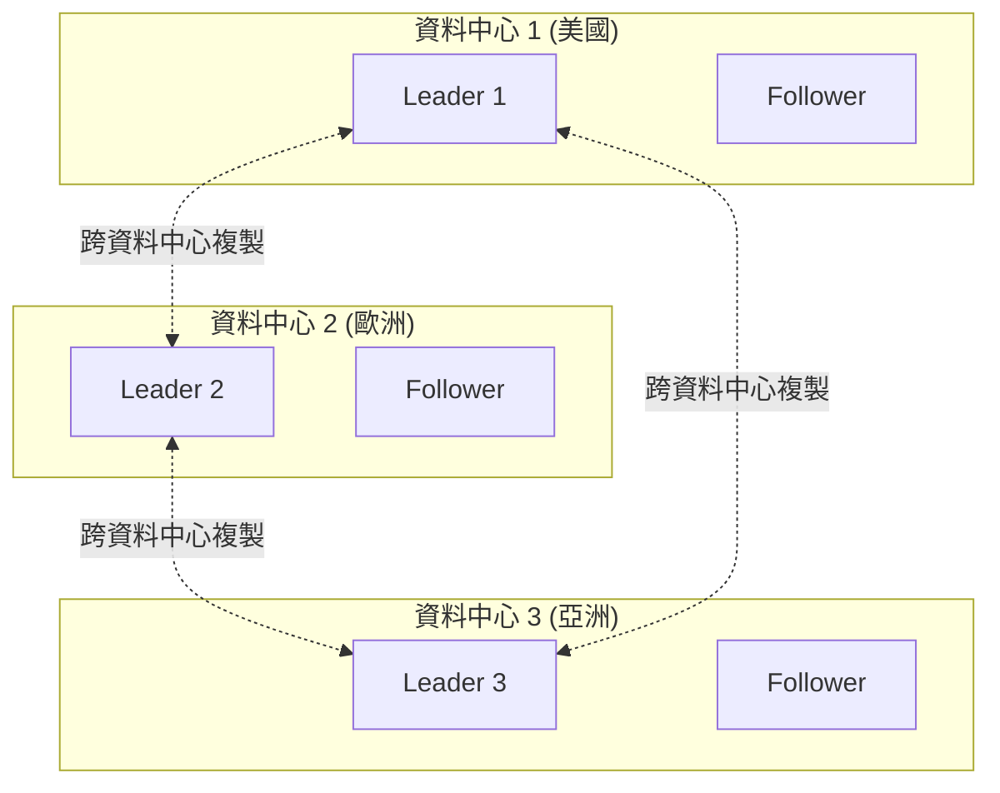

### 核心挑戰: 寫入衝突

**衝突範例**:

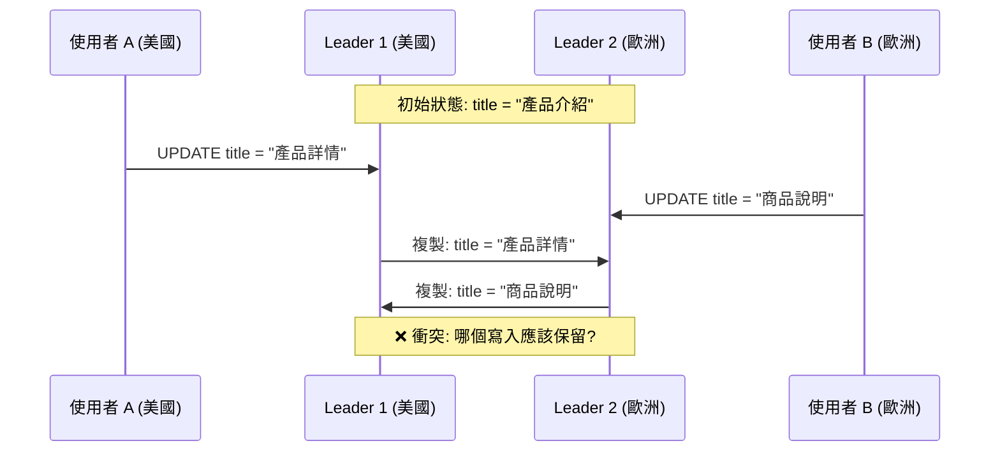

### 衝突解決策略

#### 策略 1: 最後寫入者勝出 (LWW, Last Write Wins)

```python
class LWWRegister:
    def __init__(self):
        self.value = None
        self.timestamp = 0
    
    def write(self, value, timestamp):
        # 只保留時間戳最大的寫入
        if timestamp > self.timestamp:
            self.value = value
            self.timestamp = timestamp
    
    def merge(self, other):
        if other.timestamp > self.timestamp:
            self.value = other.value
            self.timestamp = other.timestamp

# 使用範例
register1 = LWWRegister()
register1.write("產品詳情", 1000)

register2 = LWWRegister()
register2.write("商品說明", 1001)  # 稍晚的寫入

register1.merge(register2)
print(register1.value)  # 輸出: "商品說明"
```

**⚠️ 問題**: 依賴時鐘同步,可能丟失資料

#### 策略 2: 保留所有衝突版本

```python
class MultiValueRegister:
    def __init__(self):
        self.versions = {}  # {timestamp: value}
    
    def write(self, value, timestamp, node_id):
        self.versions[(timestamp, node_id)] = value
    
    def read(self):
        if len(self.versions) == 1:
            return list(self.versions.values())[0]
        else:
            # 返回所有衝突版本,由應用層處理
            return list(self.versions.values())

# 使用範例
register = MultiValueRegister()
register.write("產品詳情", 1000, "node1")
register.write("商品說明", 1000, "node2")  # 相同時間戳

conflicts = register.read()
print(conflicts)  # ["產品詳情", "商品說明"]

# 應用層處理: 合併或讓使用者選擇
resolved = merge_titles(conflicts)
```

#### 策略 3: 自動合併 (CRDT)

**CRDT (Conflict-free Replicated Data Type)** 是能自動無衝突合併的資料結構。

**範例: G-Counter (增長計數器)**

```python
class GCounter:
    def __init__(self, node_id):
        self.node_id = node_id
        self.counts = {}  # {node_id: count}
    
    def increment(self):
        if self.node_id not in self.counts:
            self.counts[self.node_id] = 0
        self.counts[self.node_id] += 1
    
    def value(self):
        return sum(self.counts.values())
    
    def merge(self, other):
        # 取每個節點的最大值
        for node, count in other.counts.items():
            self.counts[node] = max(
                self.counts.get(node, 0),
                count
            )

# 使用範例
counter1 = GCounter("node1")
counter1.increment()
counter1.increment()  # node1: 2

counter2 = GCounter("node2")
counter2.increment()  # node2: 1

counter1.merge(counter2)
print(counter1.value())  # 輸出: 3 (正確合併)
```

**🏢 真實案例: Amazon Dynamo**

- 購物車使用多主複製
- 使用向量時鐘 (Vector Clock) 追蹤因果關係
- 保留所有衝突版本,由客戶端合併
- **合併策略**: 購物車取聯集 (寧可多加商品也不遺漏)

---

## 📊 無主複製 (Leaderless Replication)

### 基本架構

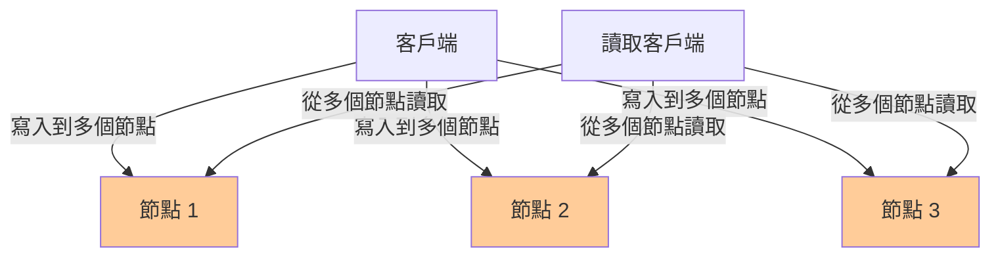

**核心概念**: 沒有 Leader,所有節點地位平等。

### 法定人數 (Quorum)

**寫入和讀取的法定人數規則**:

設總節點數為 `n`:
- `w`: 寫入必須成功的節點數
- `r`: 讀取必須查詢的節點數

**一致性保證**: 當 `w + r > n` 時,讀取必然能看到最新寫入

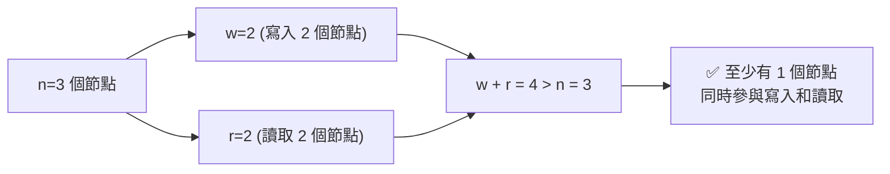

### 💻 實作範例

**Cassandra 風格的法定人數寫入**:

```python
class QuorumStore:
    def __init__(self, nodes, n=3, w=2, r=2):
        self.nodes = nodes  # 節點列表
        self.n = n
        self.w = w
        self.r = r
    
    def write(self, key, value):
        # 並行寫入所有節點
        responses = []
        for node in self.nodes:
            try:
                response = node.write(key, value, timestamp=time.time())
                responses.append(response)
            except Exception as e:
                print(f"節點 {node} 寫入失敗: {e}")
        
        # 檢查是否達到法定人數
        if len(responses) >= self.w:
            return True
        else:
            raise Exception(f"寫入失敗: 只有 {len(responses)} 個節點成功,需要 {self.w} 個")
    
    def read(self, key):
        # 並行讀取多個節點
        responses = []
        for node in self.nodes[:self.r]:
            try:
                value, timestamp = node.read(key)
                responses.append((value, timestamp))
            except Exception as e:
                print(f"節點 {node} 讀取失敗: {e}")
        
        if len(responses) < self.r:
            raise Exception(f"讀取失敗: 只讀到 {len(responses)} 個節點,需要 {self.r} 個")
        
        # 返回時間戳最新的值
        return max(responses, key=lambda x: x[1])[0]
```

### 處理節點故障: 讀修復與反熵

#### 讀修復 (Read Repair)

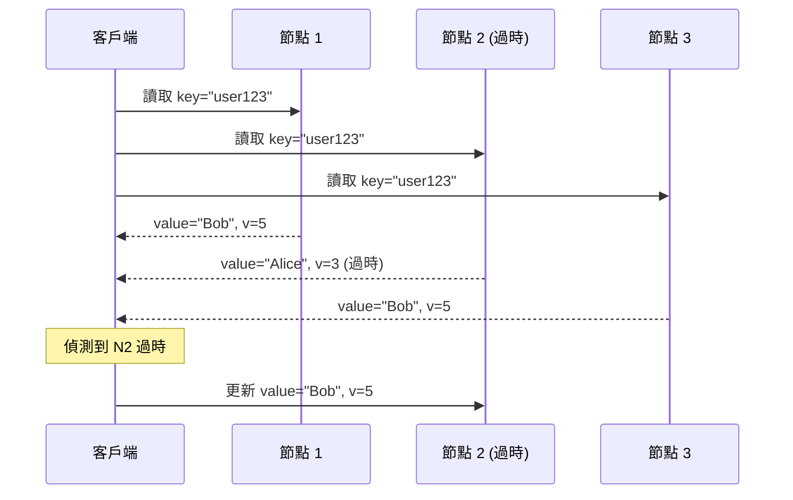

#### 反熵過程 (Anti-Entropy)

後台進程週期性比較副本並同步差異:

```python
import hashlib

class MerkleTree:
    """用於高效檢測資料差異的梅克爾樹"""
    
    def build_tree(self, data):
        # 將資料範圍切分為多個區塊
        leaves = [hashlib.sha256(block.encode()).hexdigest() 
                  for block in data]
        
        # 構建二元樹
        tree = [leaves]
        while len(tree[-1]) > 1:
            level = []
            for i in range(0, len(tree[-1]), 2):
                left = tree[-1][i]
                right = tree[-1][i+1] if i+1 < len(tree[-1]) else left
                parent = hashlib.sha256(f"{left}{right}".encode()).hexdigest()
                level.append(parent)
            tree.append(level)
        
        return tree
    
    def compare(self, tree1, tree2):
        """比較兩棵樹,找出差異的資料區塊"""
        # 如果根節點雜湊相同,資料完全一致
        if tree1[-1] == tree2[-1]:
            return []
        
        # 遞迴找出不同的葉節點
        diff_blocks = []
        # ... (實作細節省略)
        return diff_blocks

# 使用範例
node1_data = ["block1", "block2", "block3", "block4"]
node2_data = ["block1", "block2", "block3_modified", "block4"]

tree1 = MerkleTree().build_tree(node1_data)
tree2 = MerkleTree().build_tree(node2_data)

diff = MerkleTree().compare(tree1, tree2)
print(f"需要同步的區塊: {diff}")  # [2] (第 3 個區塊)
```

**⚖️ 讀修復 vs 反熵**:

| 特性 | 讀修復 | 反熵 |
|------|--------|------|
| **觸發時機** | 讀取時 | 後台週期性執行 |
| **修復範圍** | 只修復被讀取的資料 | 修復所有資料 |
| **資源消耗** | 低 | 高 (需要比較大量資料) |

### ⚖️ 無主複製 vs 主從複製

| 特性 | 主從複製 | 無主複製 |
|------|----------|----------|
| **寫入延遲** | 取決於 Leader | 取決於法定人數 (更低) |
| **故障轉移** | 需要故障轉移流程 | 無需故障轉移 (更簡單) |
| **一致性** | 強一致性 (從 Leader 讀取) | 最終一致性 |
| **衝突處理** | 無衝突 (序列化寫入) | 需要衝突解決機制 |

---

## 🔍 複製延遲的問題

### 最終一致性 (Eventual Consistency)

**定義**: 如果停止寫入,在一段時間後所有副本會收斂到相同狀態。

**問題**: 在收斂之前,從不同副本讀取可能看到不一致的資料。

### 常見的一致性問題

#### 問題 1: 讀自己的寫入 (Read-Your-Writes)

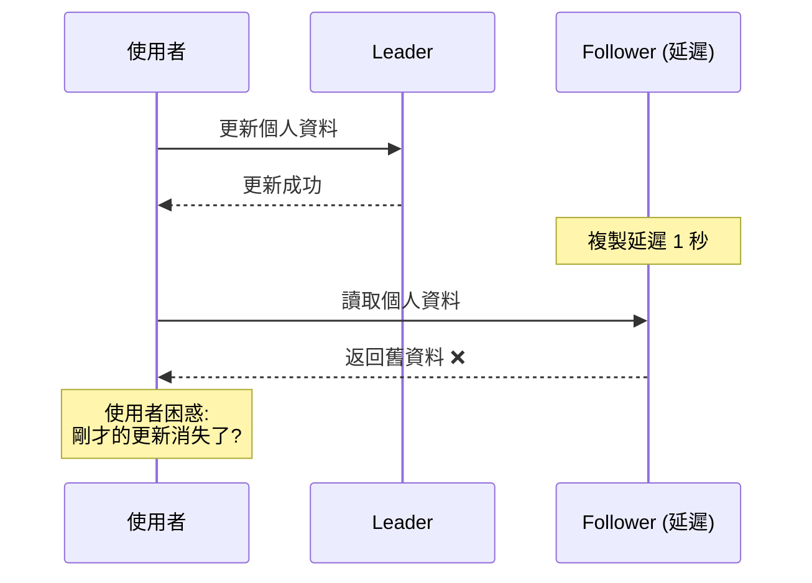

**解決方案**:

```python
class ReadYourWritesSession:
    def __init__(self, master_db, replica_db):
        self.master = master_db
        self.replica = replica_db
        self.last_write_timestamp = None
    
    def write(self, query):
        result = self.master.execute(query)
        self.last_write_timestamp = time.time()
        return result
    
    def read(self, query):
        # 寫入後 5 秒內從主庫讀取
        if (self.last_write_timestamp and 
            time.time() - self.last_write_timestamp < 5):
            return self.master.execute(query)
        else:
            return self.replica.execute(query)
```

#### 問題 2: 單調讀 (Monotonic Reads)

**場景**: 連續讀取看到「時光倒流」

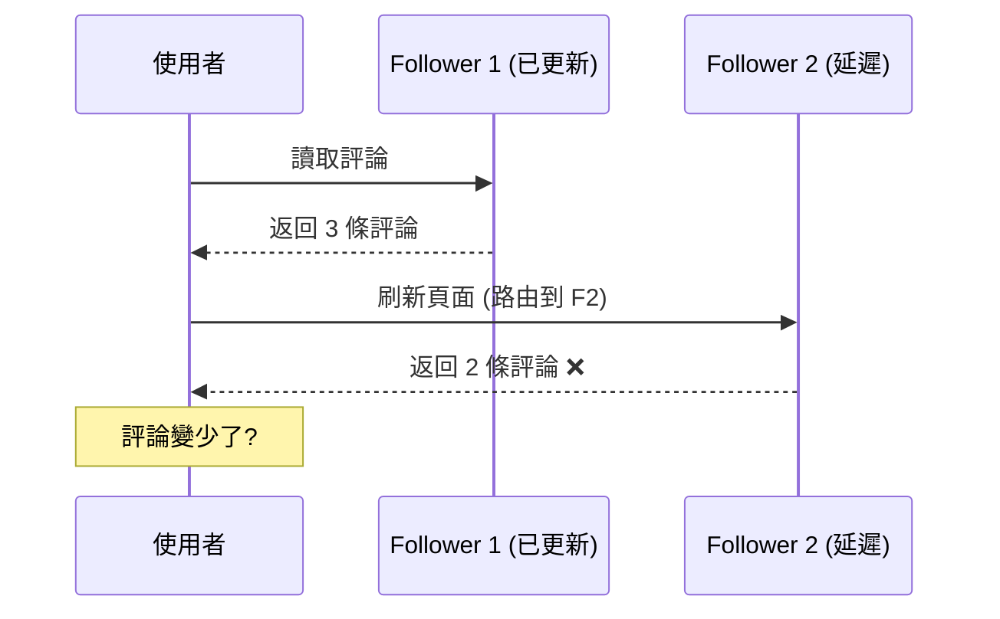

**解決方案**: 同一使用者的讀取總是路由到相同副本

```python
def get_replica_for_user(user_id, replicas):
    # 使用使用者 ID 的雜湊值選擇固定副本
    replica_index = hash(user_id) % len(replicas)
    return replicas[replica_index]
```

#### 問題 3: 一致性前綴讀 (Consistent Prefix Reads)

**場景**: 因果順序被打亂

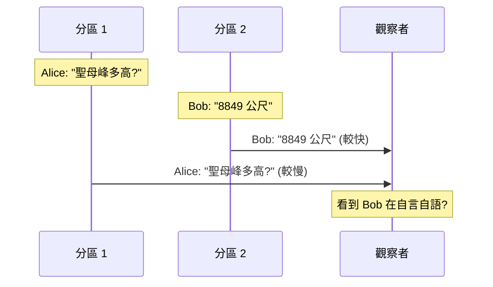

**解決方案**: 有因果關係的寫入發送到同一分區

```python
def get_partition(key, num_partitions):
    # 相關的操作使用相同的分區鍵
    return hash(key) % num_partitions

# 使用對話 ID 作為分區鍵,確保對話內的訊息有序
conversation_id = "conv_123"
partition = get_partition(conversation_id, num_partitions=10)
```

---

## 🏢 真實世界案例研究

### 案例 1: Twitter Timeline 架構

**需求**:
- 使用者發推文後,需要分發到數百萬粉絲的時間線
- 高讀取吞吐量 (查看時間線)

**架構**:

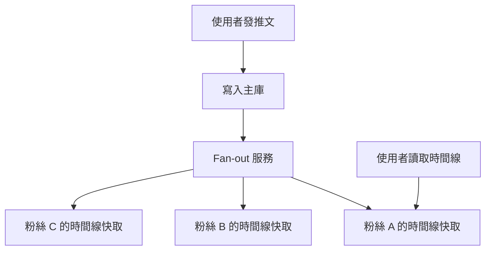

**複製策略**:
- **主從複製**: MySQL 主從架構存儲推文
- **Fan-out 寫入**: 將推文複製到所有粉絲的 Redis 快取
- **優化**: 名人賬號 (百萬粉絲) 的推文不 fan-out,讀取時動態查詢

### 案例 2: Netflix 全球部署

**需求**:
- 全球使用者就近訪問
- 跨區域災難恢復

**架構**:

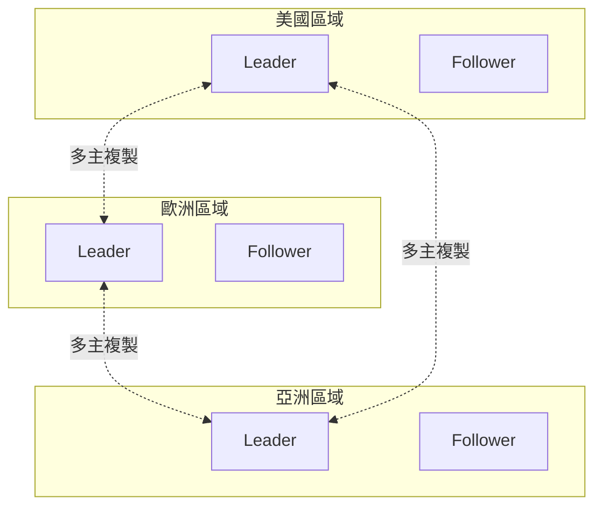

**複製策略**:
- **多主複製**: 每個區域有本地 Leader
- **衝突解決**: LWW + 業務邏輯檢查
- **非同步複製**: 容忍短暫不一致

### 案例 3: Cassandra 在 Apple

**使用場景**: iCloud 後端儲存

**配置**:
- `n = 3` (3 個副本)
- `w = 2` (寫入 2 個節點)
- `r = 2` (讀取 2 個節點)

**優勢**:
- 容忍 1 個節點故障
- 無單點故障
- 線性擴展

---

## 🤔 深入思考

### 練習 1: 選擇複製策略

給定以下場景,選擇最合適的複製架構:

**場景 A**: 銀行轉帳系統
- 要求: 強一致性,不允許資料丟失
- 寫入: 低頻率,高價值
- 讀取: 中等頻率

**場景 B**: 社交媒體貼文
- 要求: 高可用性,容忍短暫不一致
- 寫入: 高頻率
- 讀取: 極高頻率

**場景 C**: 多人協同文件編輯
- 要求: 支持離線編輯,自動合併
- 寫入: 高頻率並發寫入
- 讀取: 高頻率

<details>
<summary>💡 參考答案</summary>

**場景 A: 主從複製 + 同步複製**
- 強一致性需求 → 從 Leader 讀取
- 高資料價值 → 同步複製到至少 1 個 Follower
- 可以犧牲部分可用性換取一致性

**場景 B: 主從複製 + 異步複製**
- 高讀取吞吐量 → 多個 Follower 分散負載
- 容忍不一致 → 異步複製降低寫入延遲
- 簡單的故障轉移

**場景 C: 無主複製 + CRDT**
- 支持離線 → 無需中央協調
- 並發寫入 → CRDT 自動無衝突合併
- 例如: Automerge, Yjs

</details>

### 練習 2: 分析複製延遲問題

系統配置:
- 主從複製,1 個 Leader + 2 個 Follower
- 平均複製延遲: 100ms
- 寫入 QPS: 1000

問題:
1. 在高峰期,Follower 可能落後多少條寫入?
2. 如何監控和緩解此問題?

<details>
<summary>💡 參考答案</summary>

1. **落後寫入數計算**:
   - 100ms 延遲 × 1000 QPS = 100 條寫入
   - 實際可能更多 (網路抖動、負載尖峰)

2. **監控指標**:
   ```sql
   -- PostgreSQL 範例
   SELECT 
     client_addr,
     pg_wal_lsn_diff(pg_current_wal_lsn(), replay_lsn) AS lag_bytes,
     replay_lag AS lag_time
   FROM pg_stat_replication;
   ```

3. **緩解方案**:
   - 監控 `lag_time`,設定告警閾值 (如 1 秒)
   - 負載過高時限流寫入
   - 用戶剛寫入後從 Leader 讀取
   - 擴展 Follower 機器性能

</details>

---

## 📚 總結

### 核心要點

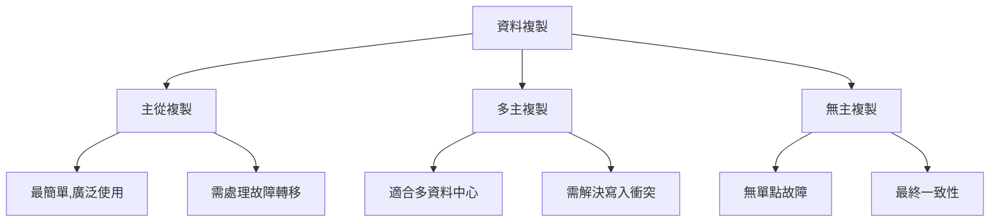

**選擇指南**:

| 如果你需要... | 選擇... |
|---------------|---------|
| 強一致性 | 主從複製 + 同步 + 從 Leader 讀取 |
| 高可用性 | 無主複製 (Dynamo 風格) |
| 全球低延遲 | 多主複製 (每區域一個 Leader) |
| 離線支持 | 無主複製 + CRDT |
| 最簡單運維 | 主從複製 |

### 延遲與一致性的權衡

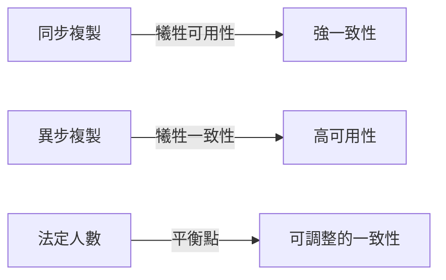

**記住**: 沒有完美的複製方案,只有適合你業務需求的方案。

---

## 🔗 參考資料

1. **書籍**:
   - Martin Kleppmann, *Designing Data-Intensive Applications*, Chapter 5
   - Brendan Burns et al., *Distributed Systems Patterns*

2. **論文**:
   - [Dynamo: Amazon's Highly Available Key-value Store](https://www.allthingsdistributed.com/files/amazon-dynamo-sosp2007.pdf)
   - [Conflict-free Replicated Data Types (CRDTs)](https://hal.inria.fr/hal-00932836/document)

3. **實務資源**:
   - [PostgreSQL Replication Documentation](https://www.postgresql.org/docs/current/high-availability.html)
   - [Cassandra Architecture](https://cassandra.apache.org/doc/latest/architecture/)
   - [Scaling Memcache at Facebook](https://www.usenix.org/system/files/conference/nsdi13/nsdi13-final170_update.pdf)

4. **部落格**:
   - [Jepsen: Consistency Models](https://jepsen.io/consistency)
   - [AWS: Multi-Region Replication](https://aws.amazon.com/blogs/database/)
