# 05 - 資料分區 (Partitioning)

## 🎯 學習目標

完成本章後,你將能夠:
- 理解資料分區的目的與挑戰
- 掌握主流分區策略的原理與應用場景
- 設計合理的分區方案避免熱點問題
- 處理分區重平衡與路由機制

---

## 💡 核心概念

### 什麼是資料分區?

**資料分區 (Partitioning/Sharding)** 是將大型資料集拆分成多個較小的**分區 (Partition)** 或**分片 (Shard)**,並分散存儲在不同節點上。

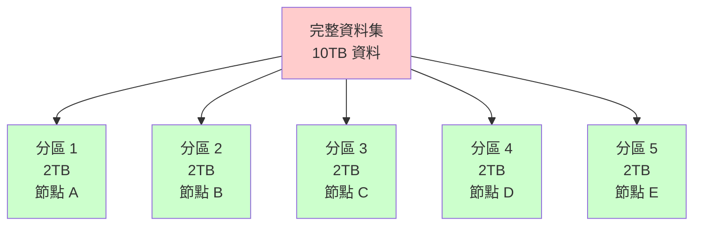

**為什麼需要分區?**

1. **擴展性 (Scalability)**: 單機存儲容量有限
2. **吞吐量 (Throughput)**: 分散負載到多台機器
3. **查詢效能**: 並行查詢多個分區

**與複製的關係**:

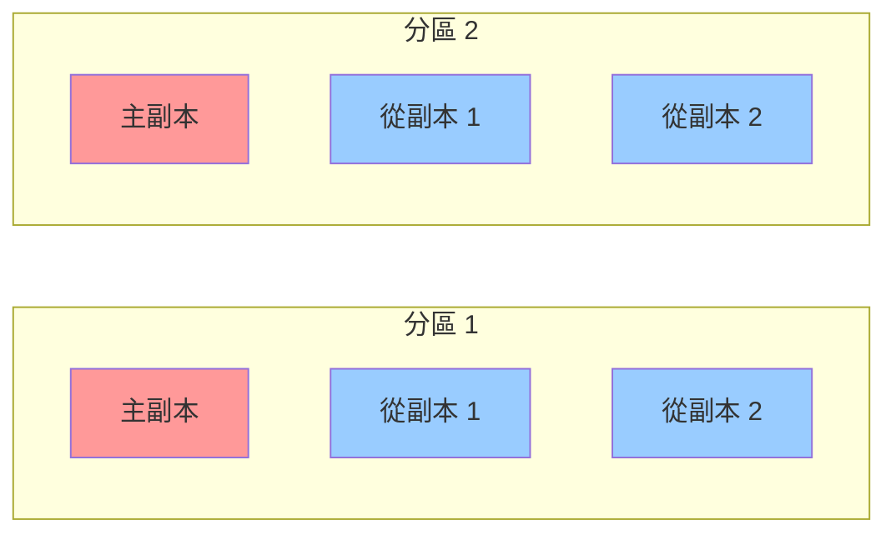

**分區 + 複製**: 每個分區通常有多個副本,兼顧擴展性與高可用性。

---

## 📊 分區策略

### 策略 1: 基於鍵範圍的分區 (Range-based Partitioning)

**原理**: 將連續的鍵範圍分配到不同分區。

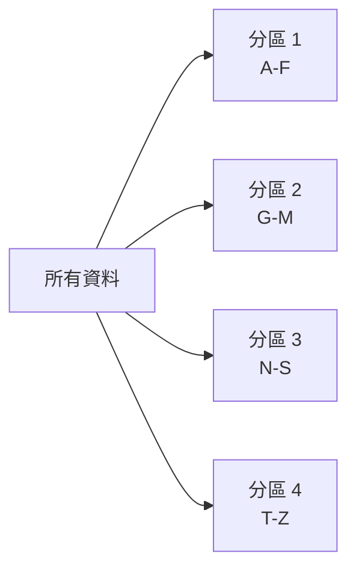

**示例: 用戶表按姓氏分區**

| 分區 | 鍵範圍 | 存儲節點 |
|------|--------|----------|
| P1 | A-F | 節點 1 |
| P2 | G-M | 節點 2 |
| P3 | N-S | 節點 3 |
| P4 | T-Z | 節點 4 |

### 💻 實作範例

```python
class RangePartitioner:
    def __init__(self, ranges):
        """
        ranges: [(end_key, partition_id), ...]
        例如: [('F', 0), ('M', 1), ('S', 2), ('Z', 3)]
        """
        self.ranges = sorted(ranges)
    
    def get_partition(self, key):
        """根據鍵返回分區 ID"""
        for end_key, partition_id in self.ranges:
            if key <= end_key:
                return partition_id
        return self.ranges[-1][1]  # 超出範圍使用最後分區
    
    # 使用範例
    partitioner = RangePartitioner([
        ('F', 0), ('M', 1), ('S', 2), ('Z', 3)
    ])
    
    print(partitioner.get_partition('Alice'))   # 0 (A-F)
    print(partitioner.get_partition('Charlie')) # 0 (A-F)
    print(partitioner.get_partition('Mike'))    # 1 (G-M)
    print(partitioner.get_partition('Zara'))    # 3 (T-Z)
```

**✅ 優點**:
- 支持**範圍查詢**: `SELECT * FROM users WHERE name BETWEEN 'A' AND 'D'` 只需查詢分區 1
- 鍵的順序被保留

**❌ 缺點**:
- **熱點問題 (Hot Spot)**: 如果鍵的分布不均,某些分區會過載

**🏢 真實案例: HBase**

- 按行鍵 (Row Key) 的字典序分區
- 每個**區域 (Region)** 存儲連續的行範圍
- 支持高效的範圍掃描

```java
// HBase 範圍掃描
Scan scan = new Scan();
scan.setStartRow(Bytes.toBytes("user_2023"));
scan.setStopRow(Bytes.toBytes("user_2024"));
ResultScanner scanner = table.getScanner(scan);
```

---

### 策略 2: 基於雜湊的分區 (Hash-based Partitioning)

**原理**: 對鍵計算雜湊值,根據雜湊值分配分區。


### 💻 實作範例

```python
import hashlib

class HashPartitioner:
    def __init__(self, num_partitions):
        self.num_partitions = num_partitions
    
    def get_partition(self, key):
        # 使用 MD5 雜湊
        hash_value = int(hashlib.md5(key.encode()).hexdigest(), 16)
        return hash_value % self.num_partitions

# 使用範例
partitioner = HashPartitioner(num_partitions=4)

print(partitioner.get_partition('Alice'))   # 可能輸出: 1
print(partitioner.get_partition('Bob'))     # 可能輸出: 3
print(partitioner.get_partition('Charlie')) # 可能輸出: 0
print(partitioner.get_partition('Diana'))   # 可能輸出: 2
```

**資料分布示例**:

```python
# 測試雜湊分區的均勻性
from collections import Counter

partitioner = HashPartitioner(num_partitions=4)
keys = [f"user_{i}" for i in range(10000)]
distribution = Counter(partitioner.get_partition(key) for key in keys)

print(distribution)
# 輸出: Counter({0: 2503, 1: 2487, 2: 2521, 3: 2489})
# 分布相對均勻
```

**✅ 優點**:
- **均勻分布**: 避免熱點問題
- 實作簡單

**❌ 缺點**:
- **無法範圍查詢**: 鍵的順序被打亂
- **重新分區成本高**: 添加/移除節點時需要重新計算大量資料的分區

**🏢 真實案例: Cassandra**

- 使用**一致性雜湊 (Consistent Hashing)** 的變體 (Token Ring)
- 每個節點負責雜湊環上的一個範圍
- 添加節點時只需移動部分資料

---

### 策略 3: 一致性雜湊 (Consistent Hashing)

**問題**: 普通雜湊分區在添加/移除節點時,幾乎所有鍵需要重新分配。

**範例**:
```python
# 4 個節點時
key = "Alice"
partition = hash(key) % 4  # 假設結果 = 2

# 增加到 5 個節點後
partition = hash(key) % 5  # 假設結果 = 4 (改變了!)
```

**一致性雜湊解決方案**:

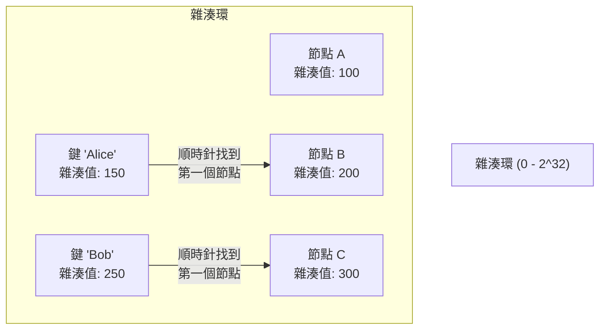

### 💻 實作範例

```python
import hashlib
import bisect

class ConsistentHash:
    def __init__(self, num_replicas=150):
        self.num_replicas = num_replicas  # 虛擬節點數
        self.ring = {}  # {hash_value: node_id}
        self.sorted_keys = []
    
    def _hash(self, key):
        return int(hashlib.md5(key.encode()).hexdigest(), 16)
    
    def add_node(self, node_id):
        """添加節點 (包含虛擬節點)"""
        for i in range(self.num_replicas):
            virtual_key = f"{node_id}:{i}"
            hash_value = self._hash(virtual_key)
            self.ring[hash_value] = node_id
            bisect.insort(self.sorted_keys, hash_value)
    
    def remove_node(self, node_id):
        """移除節點"""
        for i in range(self.num_replicas):
            virtual_key = f"{node_id}:{i}"
            hash_value = self._hash(virtual_key)
            del self.ring[hash_value]
            self.sorted_keys.remove(hash_value)
    
    def get_node(self, key):
        """找到負責該鍵的節點"""
        if not self.ring:
            return None
        
        hash_value = self._hash(key)
        # 找到第一個 >= hash_value 的節點
        idx = bisect.bisect_right(self.sorted_keys, hash_value)
        if idx == len(self.sorted_keys):
            idx = 0  # 環形,回到起點
        
        return self.ring[self.sorted_keys[idx]]

# 使用範例
ch = ConsistentHash(num_replicas=150)
ch.add_node("node1")
ch.add_node("node2")
ch.add_node("node3")

print(ch.get_node("Alice"))   # node2
print(ch.get_node("Bob"))     # node1

# 添加新節點
ch.add_node("node4")
print(ch.get_node("Alice"))   # 可能還是 node2 (大部分鍵不變!)
```

**虛擬節點 (Virtual Nodes)** 的作用:

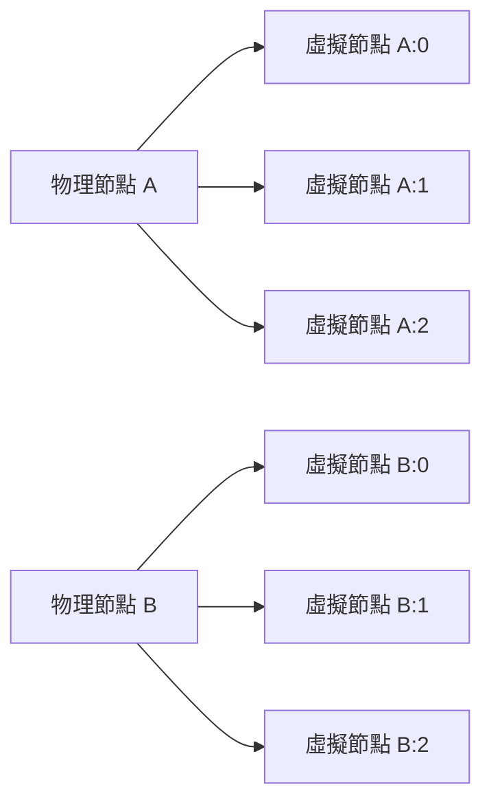

**好處**: 負載分布更均勻,避免節點負責的雜湊範圍過大或過小。

**✅ 優點**:
- 添加/移除節點時,只有 **1/N** 的鍵需要重新分配 (N 為節點數)
- 負載相對均勻

**❌ 缺點**:
- 實作較複雜
- 仍無法支持範圍查詢

---

## 🔥 熱點問題與解決方案

### 什麼是熱點?

**熱點 (Hot Spot)** 指某個分區承受遠高於平均水平的負載。

**常見原因**:

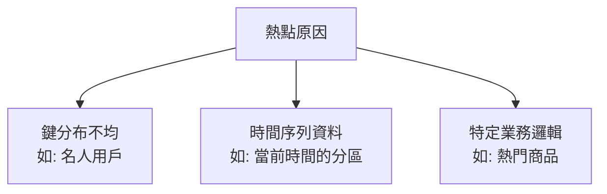

### 案例 1: 社交媒體名人賬號

**問題**:
- 用戶 ID 作為分區鍵
- 名人賬號 (千萬粉絲) 和普通用戶 (幾十粉絲) 在同一分區策略下
- 名人賬號的分區承受巨大的讀取壓力

```python
# 問題示例
partitioner = HashPartitioner(num_partitions=10)

# 普通用戶
normal_user = "user_12345"
partition = partitioner.get_partition(normal_user)  # 假設 = 3

# 名人用戶
celebrity = "user_celebrity"
partition = partitioner.get_partition(celebrity)  # 假設也 = 3

# 分區 3 承受大量讀取壓力!
```

**解決方案**:

#### 方案 1: 分裂熱鍵 (Key Splitting)

```python
class HotKeyPartitioner:
    def __init__(self, num_partitions, hot_keys, split_factor=10):
        self.num_partitions = num_partitions
        self.hot_keys = hot_keys  # 需要分裂的熱鍵集合
        self.split_factor = split_factor
    
    def get_partitions(self, key):
        """返回鍵對應的所有分區"""
        if key in self.hot_keys:
            # 熱鍵分裂成多個子鍵
            base_hash = hash(key)
            return [
                (base_hash + i) % self.num_partitions 
                for i in range(self.split_factor)
            ]
        else:
            return [hash(key) % self.num_partitions]
    
    def write(self, key, value):
        """寫入所有相關分區"""
        partitions = self.get_partitions(key)
        for partition in partitions:
            self.write_to_partition(partition, key, value)
    
    def read(self, key):
        """從隨機一個分區讀取"""
        import random
        partitions = self.get_partitions(key)
        partition = random.choice(partitions)
        return self.read_from_partition(partition, key)

# 使用範例
partitioner = HotKeyPartitioner(
    num_partitions=10,
    hot_keys={'celebrity_user_1', 'celebrity_user_2'}
)

# 普通用戶: 1 個分區
print(partitioner.get_partitions('normal_user'))
# 輸出: [3]

# 名人用戶: 10 個分區 (分散讀取壓力)
print(partitioner.get_partitions('celebrity_user_1'))
# 輸出: [7, 8, 9, 0, 1, 2, 3, 4, 5, 6]
```

#### 方案 2: 加入隨機前綴

```python
import random

def write_with_prefix(key, value, num_replicas=10):
    """寫入時加入隨機前綴"""
    for i in range(num_replicas):
        prefixed_key = f"{i}_{key}"
        write_to_db(prefixed_key, value)

def read_with_prefix(key, num_replicas=10):
    """讀取時隨機選擇一個前綴"""
    prefix = random.randint(0, num_replicas - 1)
    prefixed_key = f"{prefix}_{key}"
    return read_from_db(prefixed_key)

# 使用範例
write_with_prefix("celebrity_user", {"followers": 10000000})

# 讀取時負載分散到 10 個鍵
value1 = read_with_prefix("celebrity_user")  # 可能讀取 "3_celebrity_user"
value2 = read_with_prefix("celebrity_user")  # 可能讀取 "7_celebrity_user"
```

### 案例 2: 時間序列資料

**問題**:
- 使用時間戳作為分區鍵
- 所有當前的寫入都集中在最新的分區

```python
# 按日期分區
def get_partition(timestamp):
    date = timestamp.date()
    return hash(date) % num_partitions

# 2024-01-15 的所有資料寫入同一分區 (熱點!)
```

**解決方案: 複合分區鍵**

```python
def get_partition(sensor_id, timestamp):
    # 使用 sensor_id + 日期作為複合鍵
    date = timestamp.date()
    composite_key = f"{sensor_id}_{date}"
    return hash(composite_key) % num_partitions

# 同一天的資料根據 sensor_id 分散到多個分區
partition1 = get_partition("sensor_001", datetime(2024, 1, 15))
partition2 = get_partition("sensor_002", datetime(2024, 1, 15))
# partition1 != partition2
```

**⚖️ 權衡**: 範圍查詢 (如查詢某天的所有資料) 需要掃描多個分區。

---

## 🔄 分區重平衡 (Rebalancing)

### 為什麼需要重平衡?

**觸發場景**:
1. 資料量增長,需要增加節點
2. 節點故障,需要移除節點
3. 硬體升級

**目標**:
- 重新分配分區,使負載均勻
- 盡量減少資料移動
- 服務持續可用

### 策略 1: 固定數量的分區

**設計**:
- 創建**遠多於節點數**的分區 (如 1000 個分區,10 個節點)
- 每個節點負責多個分區
- 添加節點時,從現有節點轉移部分分區

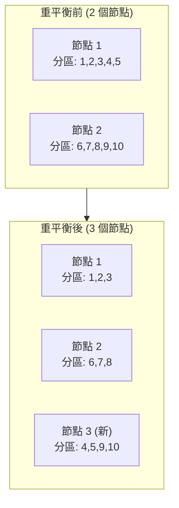

**💻 實作範例**:

```python
class FixedPartitionRebalancer:
    def __init__(self, num_partitions=1000):
        self.num_partitions = num_partitions
        self.partition_to_node = {}  # {partition_id: node_id}
    
    def initial_assignment(self, nodes):
        """初始分配"""
        for partition in range(self.num_partitions):
            node = nodes[partition % len(nodes)]
            self.partition_to_node[partition] = node
    
    def add_node(self, new_node, existing_nodes):
        """添加新節點,重新分配部分分區"""
        target_per_node = self.num_partitions // (len(existing_nodes) + 1)
        
        # 從每個現有節點轉移一些分區到新節點
        transferred = 0
        for partition, node in list(self.partition_to_node.items()):
            if node in existing_nodes and transferred < target_per_node:
                self.partition_to_node[partition] = new_node
                transferred += 1
    
    def get_node(self, key):
        partition = hash(key) % self.num_partitions
        return self.partition_to_node[partition]

# 使用範例
rebalancer = FixedPartitionRebalancer(num_partitions=1000)
rebalancer.initial_assignment(['node1', 'node2'])

# node1 和 node2 各負責 500 個分區
print(rebalancer.get_node('Alice'))  # node1 或 node2

# 添加 node3
rebalancer.add_node('node3', ['node1', 'node2'])
# 現在每個節點負責約 333 個分區
```

**🏢 真實案例: Riak, Elasticsearch**

- Elasticsearch 默認每個索引 5 個主分片 (Primary Shard)
- 分片數創建後不可改變
- 添加節點時重新分配分片

**✅ 優點**:
- 操作簡單,只需移動整個分區
- 分區數量固定,便於管理

**❌ 缺點**:
- 分區數需要預先規劃 (太少會限制擴展,太多會增加開銷)

---

### 策略 2: 動態分區

**設計**:
- 分區根據資料大小**自動分裂或合併**
- 類似 B-Tree 的分裂策略

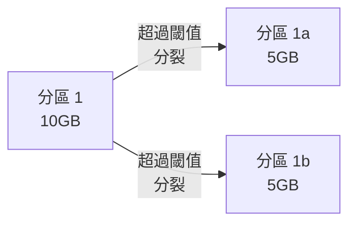

**分裂條件**: 當分區大小超過閾值 (如 10GB) 時分裂成兩個分區

**合併條件**: 當分區大小低於閾值 (如 1GB) 時合併相鄰分區

**🏢 真實案例: HBase, MongoDB**

HBase Region 分裂:
```java
// HBase 自動分裂配置
hbase.hregion.max.filesize = 10737418240  // 10GB
```

**✅ 優點**:
- 自動適應資料量變化
- 無需預先規劃分區數

**❌ 缺點**:
- 初始只有一個分區 (需要預分區避免早期瓶頸)
- 分裂操作可能影響性能

---

### 策略 3: 按節點比例分區

**設計**:
- 每個節點負責固定數量的分區 (如每個節點 256 個分區)
- 添加節點時,隨機選擇現有分區進行分裂

**🏢 真實案例: Cassandra**

- 每個節點配置固定數量的虛擬節點 (vnodes)
- 默認每個節點 256 個 vnodes

**✅ 優點**:
- 與節點數成比例,自動擴展

**❌ 缺點**:
- 實作複雜

---

## 🗺️ 路由機制 (Request Routing)

### 問題: 客戶端如何知道訪問哪個節點?

**三種路由方案**:

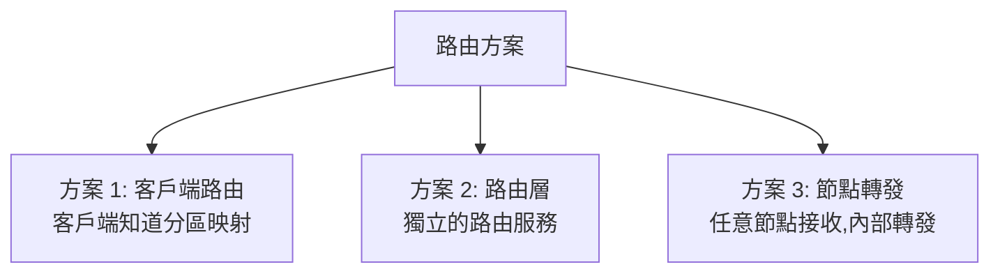

### 方案 1: 客戶端路由

**架構**:

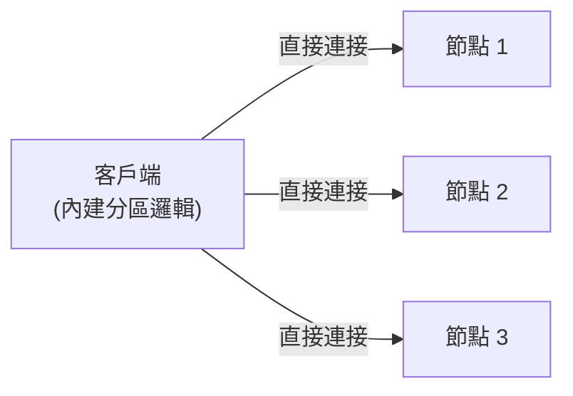

**實作範例**:

```python
class SmartClient:
    def __init__(self, nodes):
        self.nodes = nodes
        self.partitioner = ConsistentHash()
        for node in nodes:
            self.partitioner.add_node(node)
    
    def get(self, key):
        # 客戶端計算分區
        node = self.partitioner.get_node(key)
        return self.send_request(node, f"GET {key}")
    
    def put(self, key, value):
        node = self.partitioner.get_node(key)
        return self.send_request(node, f"PUT {key} {value}")

# 使用範例
client = SmartClient(['node1:9000', 'node2:9000', 'node3:9000'])
value = client.get('Alice')
```

**🏢 真實案例: Cassandra, Memcached 客戶端**

**✅ 優點**: 減少網路跳轉,低延遲

**❌ 缺點**: 客戶端需要知道集群拓撲,動態變更時需要更新客戶端

---

### 方案 2: 路由層 (Routing Tier)

**架構**:

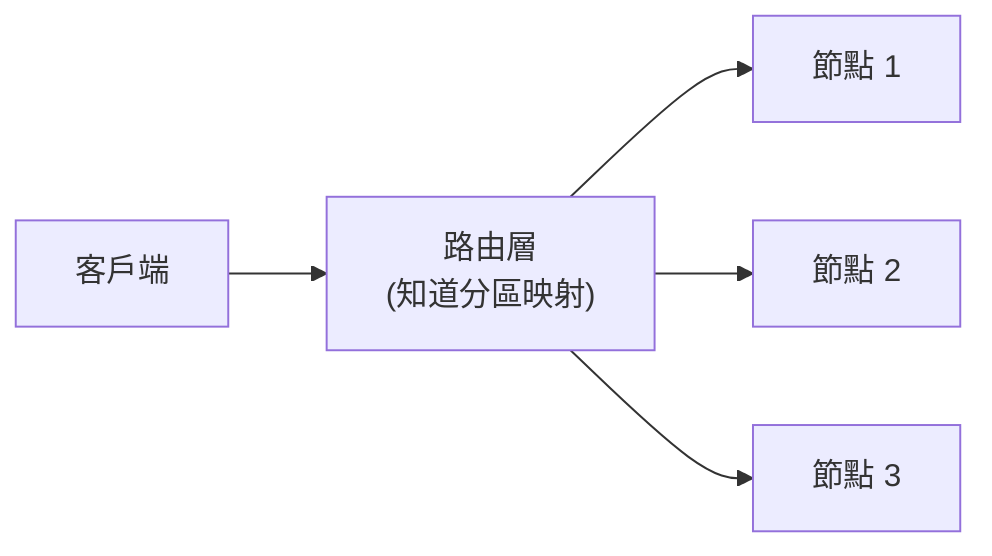

**實作範例**:

```python
from flask import Flask, request
import requests

app = Flask(__name__)
partitioner = ConsistentHash()
partitioner.add_node("http://node1:9000")
partitioner.add_node("http://node2:9000")
partitioner.add_node("http://node3:9000")

@app.route('/get/<key>')
def get_key(key):
    # 路由層計算目標節點
    node = partitioner.get_node(key)
    response = requests.get(f"{node}/get/{key}")
    return response.json()

@app.route('/put/<key>', methods=['POST'])
def put_key(key):
    node = partitioner.get_node(key)
    response = requests.post(f"{node}/put/{key}", json=request.json)
    return response.json()

# 客戶端只需要知道路由層地址
# curl http://router:8080/get/Alice
```

**🏢 真實案例: MongoDB (mongos 路由器)**

**✅ 優點**: 客戶端簡單,集群變更對客戶端透明

**❌ 缺點**: 路由層成為單點故障 (需要高可用部署)

---

### 方案 3: 節點內部轉發

**架構**:

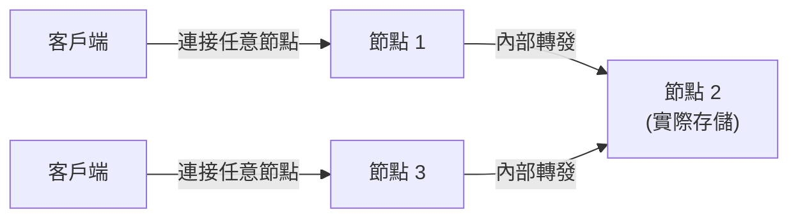

**實作概念**:

```python
class Node:
    def __init__(self, node_id, all_nodes):
        self.node_id = node_id
        self.all_nodes = all_nodes
        self.partitioner = ConsistentHash()
        for node in all_nodes:
            self.partitioner.add_node(node)
    
    def handle_request(self, key, operation):
        # 計算實際負責的節點
        target_node = self.partitioner.get_node(key)
        
        if target_node == self.node_id:
            # 本節點負責,直接處理
            return self.local_handle(key, operation)
        else:
            # 轉發到正確的節點
            return self.forward_request(target_node, key, operation)

# 客戶端可以連接任意節點
# 節點會自動轉發到正確位置
```

**🏢 真實案例: Dynamo, Riak**

**✅ 優點**: 客戶端無需知道集群拓撲

**❌ 缺點**: 多一次網路跳轉

---

### 協調服務 (Coordination Service)

**問題**: 分區映射在集群變更時如何同步?

**解決方案: 使用協調服務 (如 ZooKeeper, etcd)**

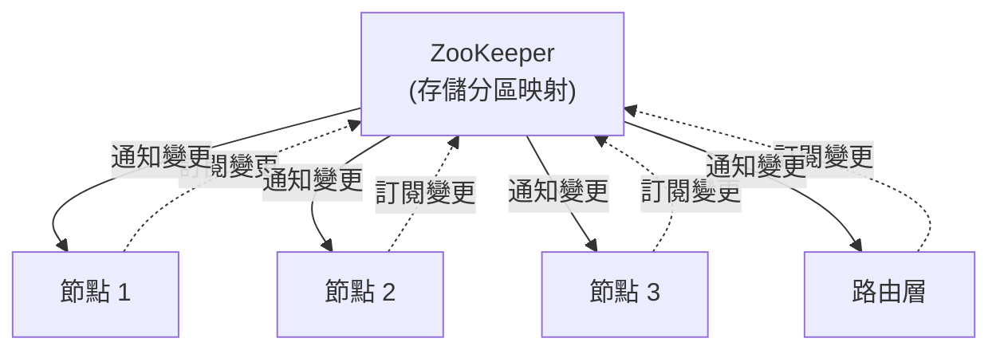

**實作範例 (使用 etcd)**:

```python
import etcd3

class PartitionRegistry:
    def __init__(self, etcd_host='localhost'):
        self.etcd = etcd3.client(host=etcd_host)
    
    def register_partition(self, partition_id, node_id):
        """註冊分區到節點的映射"""
        key = f"/partitions/{partition_id}"
        self.etcd.put(key, node_id)
    
    def get_node(self, partition_id):
        """查詢分區對應的節點"""
        key = f"/partitions/{partition_id}"
        value, _ = self.etcd.get(key)
        return value.decode() if value else None
    
    def watch_changes(self, callback):
        """監聽分區映射變更"""
        events, cancel = self.etcd.watch_prefix("/partitions/")
        for event in events:
            callback(event)

# 節點啟動時註冊分區
registry = PartitionRegistry()
registry.register_partition(partition_id=1, node_id="node1")

# 路由層監聽變更
def on_partition_change(event):
    print(f"分區映射變更: {event}")

registry.watch_changes(on_partition_change)
```

**🏢 真實案例**:
- **HBase**: 使用 ZooKeeper 追蹤 Region Server
- **Kafka**: 使用 ZooKeeper (舊版) / KRaft (新版) 管理分區分配
- **Elasticsearch**: 使用內建的集群狀態管理

---

## 🏢 真實世界案例研究

### 案例 1: Cassandra 分區架構

**分區策略**:
- **Murmur3 雜湊分區**
- **Token Ring**: 雜湊空間 `0 - 2^64`

**架構圖**:

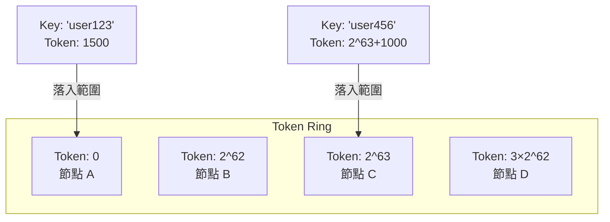

**複製策略**:
```sql
CREATE KEYSPACE my_keyspace
WITH replication = {
  'class': 'SimpleStrategy',
  'replication_factor': 3
};
```
- 每個分區複製到 3 個連續的節點

**讀寫流程**:
```python
# 客戶端計算 Token
token = murmur3_hash('user123')

# 找到協調者節點 (Coordinator)
coordinator = find_node_by_token(token)

# 寫入 (複製因子 = 3)
coordinator.write(['node1', 'node2', 'node3'], data)

# 讀取 (法定人數 = 2)
values = coordinator.read(['node1', 'node2'], key)
```

---

### 案例 2: MongoDB 分片架構

**組件**:

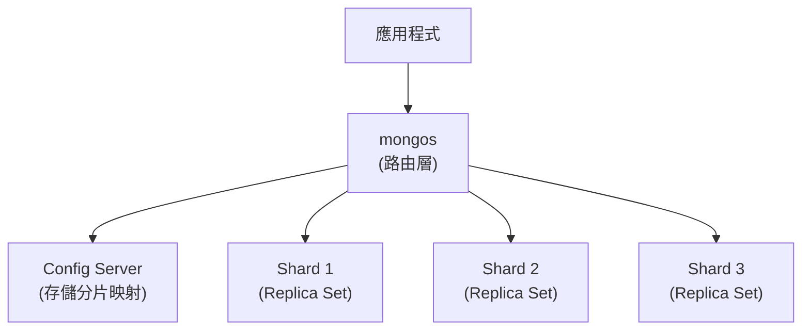

**分片配置**:
```javascript
// 啟用分片
sh.enableSharding("mydb")

// 選擇分片鍵
sh.shardCollection("mydb.users", { "userId": 1 })

// MongoDB 自動分配資料到各分片
```

**分片鍵選擇原則**:
1. **高基數 (High Cardinality)**: 鍵值多樣化
2. **低頻率 (Low Frequency)**: 避免大量文件有相同鍵值
3. **非單調 (Non-Monotonic)**: 避免熱點

**錯誤示例**:
```javascript
// ❌ 使用自增 ID (單調增長,造成熱點)
sh.shardCollection("mydb.orders", { "_id": 1 })

// ✅ 使用複合鍵
sh.shardCollection("mydb.orders", { "userId": 1, "timestamp": 1 })
```

---

### 案例 3: Amazon DynamoDB 分區

**分區策略**:
- **一致性雜湊 + 虛擬節點**
- 自動重平衡

**分區鍵 (Partition Key) + 排序鍵 (Sort Key)**:

```python
# 表定義
table = dynamodb.Table('Orders')

# 分區鍵: 'userId'
# 排序鍵: 'timestamp'

# 寫入
table.put_item(
    Item={
        'userId': 'user123',  # 決定分區
        'timestamp': 1704067200,  # 分區內排序
        'orderId': 'order_456',
        'amount': 99.99
    }
)

# 查詢 (高效: 只掃描一個分區)
response = table.query(
    KeyConditionExpression=Key('userId').eq('user123') &
                           Key('timestamp').between(start, end)
)
```

**自動擴展**:
- 分區大小達 10GB 時自動分裂
- 讀寫吞吐量不足時自動增加分區

**熱點處理**:
- **自適應容量 (Adaptive Capacity)**: 自動將更多資源分配給熱分區

---

## 🤔 深入思考

### 練習 1: 設計分區方案

**場景**: 設計一個 Twitter 風格的社交媒體資料庫

**需求**:
- 10 億使用者
- 每個使用者平均 1000 條推文
- 查詢類型:
  1. 根據使用者 ID 查詢推文
  2. 根據時間範圍查詢推文
  3. 熱門推文排行

**問題**:
1. 選擇什麼分區鍵?
2. 如何避免名人賬號的熱點?
3. 如何支持時間範圍查詢?

<details>
<summary>💡 參考答案</summary>

**方案 1: 按使用者 ID 分區**

```python
# 分區鍵: user_id
partition = hash(user_id) % num_partitions

# ✅ 優點:
# - 查詢某使用者的推文高效 (單分區)
# - 寫入推文均勻分布

# ❌ 缺點:
# - 名人賬號熱點
# - 時間範圍查詢需要掃描所有分區
```

**熱點解決**: 名人賬號使用鍵分裂
```python
if is_celebrity(user_id):
    # 分裂成 10 個子鍵
    replica_id = random.randint(0, 9)
    partition = hash(f"{user_id}_{replica_id}") % num_partitions
```

**方案 2: 按時間分區 (輔助索引)**

```python
# 主表: 按 user_id 分區
tweets_by_user = {
    partition_key: user_id,
    sort_key: timestamp,
    data: tweet_content
}

# 二級索引: 按時間分區
tweets_by_time = {
    partition_key: date,
    sort_key: timestamp,
    data: tweet_id
}
```

**方案 3: 複合分區鍵**

```python
# 結合 user_id 和日期
composite_key = f"{user_id}_{date}"
partition = hash(composite_key) % num_partitions

# ✅ 支持查詢特定使用者在特定日期的推文
# ❌ 跨日期查詢需要多個請求
```

</details>

---

### 練習 2: 分析分區重平衡

**場景**: 電商網站使用雜湊分區,4 個節點存儲商品資料。

**初始狀態**:
- 節點 A, B, C, D
- 每個節點 100GB 資料
- 分區策略: `hash(product_id) % 4`

**操作**: 添加節點 E,變成 5 個節點

**問題**:
1. 使用簡單取模 `% 5`,有多少比例的鍵需要遷移?
2. 使用一致性雜湊,需要遷移多少鍵?
3. 哪種方案更適合頻繁擴展的場景?

<details>
<summary>💡 參考答案</summary>

**1. 簡單取模遷移比例**:

```python
# 模擬分析
num_keys = 100000
old_partitions = 4
new_partitions = 5

changed = 0
for key in range(num_keys):
    old_partition = key % old_partitions
    new_partition = key % new_partitions
    if old_partition != new_partition:
        changed += 1

print(f"需要遷移: {changed / num_keys * 100:.1f}%")
# 輸出: 約 80% 的鍵需要遷移!
```

**2. 一致性雜湊遷移比例**:

理論上:
```
遷移比例 = 1 / (n_new) = 1 / 5 = 20%
```

**3. 方案對比**:

| 方案 | 遷移比例 | 實作複雜度 | 適用場景 |
|------|---------|-----------|----------|
| 簡單取模 | ~80% | 簡單 | 節點數固定 |
| 一致性雜湊 | ~20% | 中等 | 頻繁擴展 |
| 固定分區 | ~20% | 簡單 | 預先規劃 |

**結論**: 頻繁擴展應使用一致性雜湊或固定分區數。

</details>

---

## 📚 總結

### 核心要點

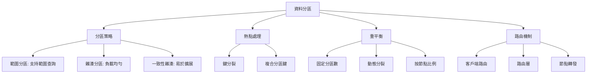

### 決策指南

**選擇分區策略**:

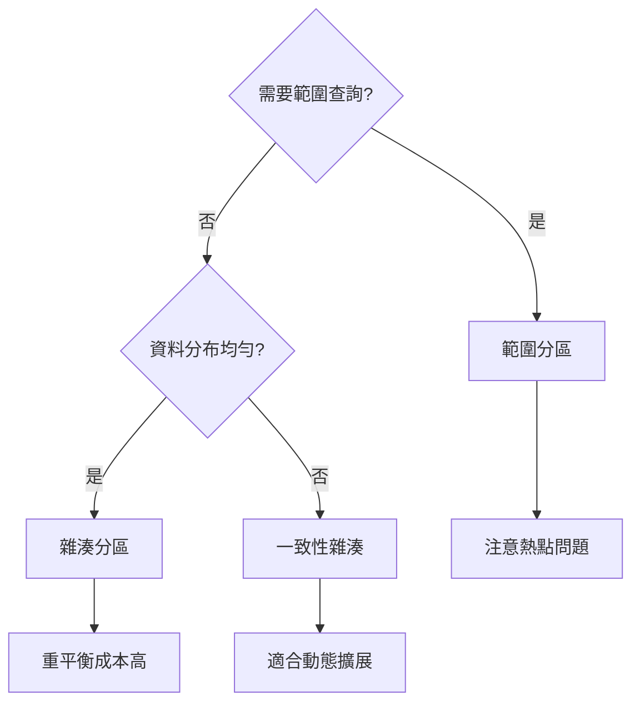

**避免常見陷阱**:

| 問題 | 症狀 | 解決方案 |
|------|------|----------|
| **熱點** | 單個分區負載過高 | 鍵分裂、複合分區鍵 |
| **不均勻分布** | 某些分區遠大於其他 | 雜湊分區、動態分裂 |
| **重平衡風暴** | 添加節點導致大量遷移 | 一致性雜湊、固定分區數 |
| **無法範圍查詢** | 雜湊打亂順序 | 使用範圍分區或二級索引 |

### 最佳實踐

1. **分區鍵選擇**:
   - 高基數 (Cardinality)
   - 均勻分布
   - 與查詢模式匹配

2. **監控指標**:
   - 每個分區的大小
   - 每個分區的 QPS
   - 分區間的不平衡程度

3. **測試**:
   - 模擬熱點場景
   - 測試重平衡操作
   - 驗證故障恢復

---

## 🔗 參考資料

1. **書籍**:
   - Martin Kleppmann, *Designing Data-Intensive Applications*, Chapter 6
   - Alex Petrov, *Database Internals*

2. **論文**:
   - [Consistent Hashing and Random Trees](https://www.akamai.com/us/en/multimedia/documents/technical-publication/consistent-hashing-and-random-trees-distributed-caching-protocols-for-relieving-hot-spots-on-the-world-wide-web-technical-publication.pdf)
   - [Dynamo: Amazon's Highly Available Key-value Store](https://www.allthingsdistributed.com/files/amazon-dynamo-sosp2007.pdf)

3. **技術文件**:
   - [Cassandra Architecture](https://cassandra.apache.org/doc/latest/architecture/dynamo.html)
   - [MongoDB Sharding](https://docs.mongodb.com/manual/sharding/)
   - [HBase Region Splitting](https://hbase.apache.org/book.html#regions.arch)

4. **部落格**:
   - [Sharding Pinterest: How we scaled our MySQL fleet](https://medium.com/pinterest-engineering/sharding-pinterest-how-we-scaled-our-mysql-fleet-3f341e96ca6f)
   - [How Discord Stores Billions of Messages](https://discord.com/blog/how-discord-stores-billions-of-messages)
