# 06 - 事務與隔離級別 (Transactions and Isolation Levels)

## 🎯 學習目標

完成本章後,你將能夠:
- 理解事務的 ACID 特性及其重要性
- 掌握不同隔離級別的語義與應用場景
- 識別並發問題 (髒讀、不可重複讀、幻讀)
- 理解鎖機制與 MVCC 的實作原理

---

## 💡 核心概念

### 什麼是事務?

**事務 (Transaction)** 是一組資料庫操作的邏輯單元,要麼全部成功,要麼全部失敗。

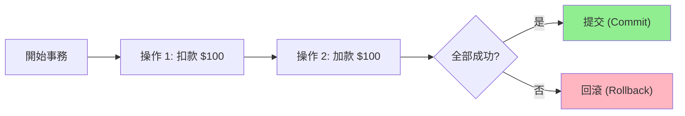

**經典案例: 銀行轉帳**

```python
def transfer(from_account, to_account, amount):
    # 開始事務
    with db.transaction():
        # 操作 1: 扣款
        db.execute(
            "UPDATE accounts SET balance = balance - ? WHERE id = ?",
            (amount, from_account)
        )
        
        # 操作 2: 加款
        db.execute(
            "UPDATE accounts SET balance = balance + ? WHERE id = ?",
            (amount, to_account)
        )
        
        # 提交事務
        db.commit()
```

**為什麼需要事務?**

沒有事務的場景:
```python
# ❌ 不安全的轉帳
balance_a = get_balance('Alice')  # $100
balance_b = get_balance('Bob')    # $50

set_balance('Alice', balance_a - 50)  # $50
# 💥 這裡系統崩潰!
set_balance('Bob', balance_b + 50)    # 永遠不會執行

# 結果: Alice 損失 $50,Bob 沒收到,憑空消失!
```

有事務的場景:
```python
# ✅ 安全的轉帳
with transaction:
    set_balance('Alice', get_balance('Alice') - 50)
    # 💥 這裡系統崩潰!
    set_balance('Bob', get_balance('Bob') + 50)

# 結果: 事務自動回滾,兩人餘額不變
```

---

## 📊 ACID 特性

### A - 原子性 (Atomicity)

**定義**: 事務中的所有操作要麼全部完成,要麼全部不做。

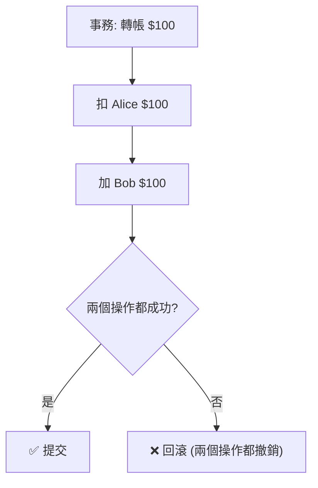

**實作機制: 預寫日誌 (Write-Ahead Log, WAL)**

```python
class TransactionLog:
    def __init__(self):
        self.log_file = open('transaction.log', 'a')
        self.operations = []
    
    def begin(self, txn_id):
        self.log_file.write(f"BEGIN {txn_id}\n")
        self.operations = []
    
    def log_operation(self, operation):
        # 先寫日誌,再執行操作
        self.log_file.write(f"OP: {operation}\n")
        self.log_file.flush()  # 確保寫入磁碟
        self.operations.append(operation)
    
    def commit(self, txn_id):
        self.log_file.write(f"COMMIT {txn_id}\n")
        self.log_file.flush()
    
    def rollback(self, txn_id):
        # 執行所有操作的逆操作
        for operation in reversed(self.operations):
            operation.undo()
        self.log_file.write(f"ROLLBACK {txn_id}\n")

# 崩潰恢復
def recover():
    for line in open('transaction.log'):
        if 'BEGIN' in line:
            # 開始新事務
            pass
        elif 'COMMIT' in line:
            # 事務已完成,無需操作
            pass
        else:
            # 未完成的事務,重新執行或回滾
            pass
```

---

### C - 一致性 (Consistency)

**定義**: 事務將資料庫從一個一致狀態轉換到另一個一致狀態。

**一致性約束範例**:

```sql
-- 約束 1: 總金額守恆
CREATE TRIGGER check_total_balance
AFTER UPDATE ON accounts
FOR EACH STATEMENT
BEGIN
    IF (SELECT SUM(balance) FROM accounts) != @initial_total THEN
        SIGNAL SQLSTATE '45000'
        SET MESSAGE_TEXT = '總金額不守恆';
    END IF;
END;

-- 約束 2: 餘額不能為負
ALTER TABLE accounts ADD CONSTRAINT balance_non_negative
CHECK (balance >= 0);
```

**應用層一致性**:

```python
class BankAccount:
    def transfer(self, to_account, amount):
        with db.transaction():
            # 業務規則: 轉帳金額必須為正
            if amount <= 0:
                raise ValueError("金額必須為正")
            
            # 業務規則: 餘額不足
            if self.balance < amount:
                raise ValueError("餘額不足")
            
            self.balance -= amount
            to_account.balance += amount
            
            # 業務規則: 轉帳後總金額不變
            assert self.balance + to_account.balance == initial_total
```

---

### I - 隔離性 (Isolation)

**定義**: 多個事務並發執行時,彼此不應相互干擾。

**理想情況**: 事務看起來像是串行執行

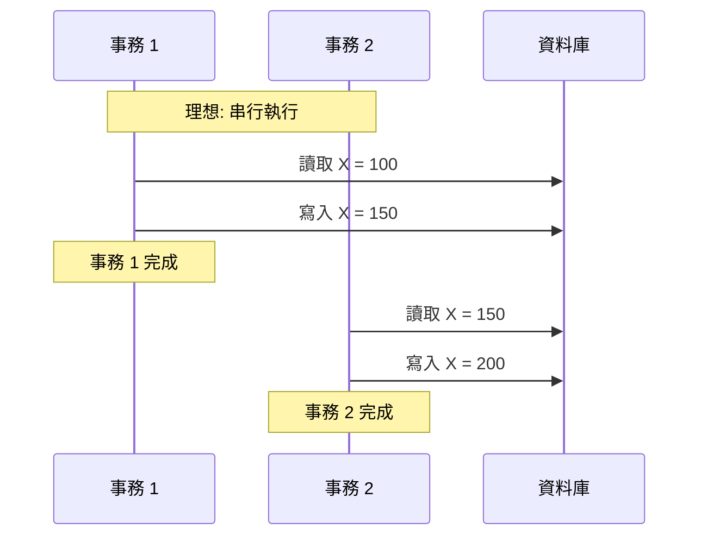

**現實情況**: 為了性能,允許一定程度的相互影響 → **隔離級別**

---

### D - 持久性 (Durability)

**定義**: 一旦事務提交,其結果永久保存,即使系統崩潰也不會丟失。

**實作機制**:


**💻 實作範例**:

```python
import os

class DurableStorage:
    def __init__(self, filename):
        self.file = open(filename, 'a')
    
    def write(self, data):
        # 寫入緩衝區
        self.file.write(data)
        
        # 刷新到 OS 緩衝區
        self.file.flush()
        
        # 強制寫入磁碟 (關鍵!)
        os.fsync(self.file.fileno())
        
        # 現在可以保證數據已持久化

# 即使這裡系統崩潰,資料也已安全存儲
```

**⚖️ 性能與持久性的權衡**:

| 方法 | 持久性 | 性能 |
|------|--------|------|
| 每次 fsync | ✅ 強 | ❌ 慢 (10-100ms/次) |
| 批次 fsync | ⚠️ 中 | ✅ 快 (攤銷成本) |
| 異步複製 | ⚠️ 中 | ✅ 快 |
| 只寫內存 | ❌ 弱 | ✅ 極快 |

**🏢 真實案例: Redis 持久性選項**

```conf
# 選項 1: 每次寫入都 fsync (最慢,最安全)
appendfsync always

# 選項 2: 每秒 fsync 一次 (平衡)
appendfsync everysec

# 選項 3: 由 OS 決定 (最快,可能丟失數據)
appendfsync no
```

---

## 🔒 隔離級別 (Isolation Levels)

### 並發問題概覽

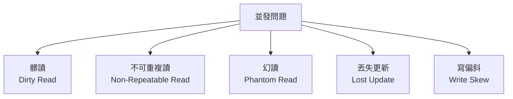

### 問題 1: 髒讀 (Dirty Read)

**定義**: 讀取到其他事務未提交的資料。

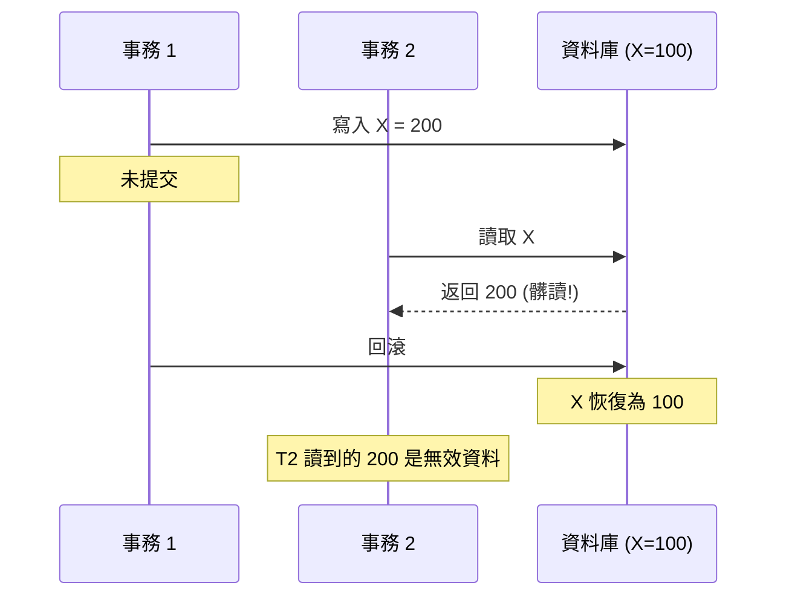

**💻 實際範例**:

```python
# 事務 1: 轉帳
with db.transaction():
    set_balance('Alice', 0)  # 餘額暫時為 0
    time.sleep(5)  # 模擬耗時操作
    set_balance('Alice', 1000)  # 最終餘額 1000
    commit()

# 事務 2: 查詢餘額
balance = get_balance('Alice')
print(f"Alice 餘額: {balance}")

# 如果 T2 在 T1 sleep 期間執行:
# 輸出: Alice 餘額: 0 (髒讀! 實際應該是 100 或 1000)
```

---

### 問題 2: 不可重複讀 (Non-Repeatable Read)

**定義**: 同一事務內多次讀取同一資料,結果不一致。

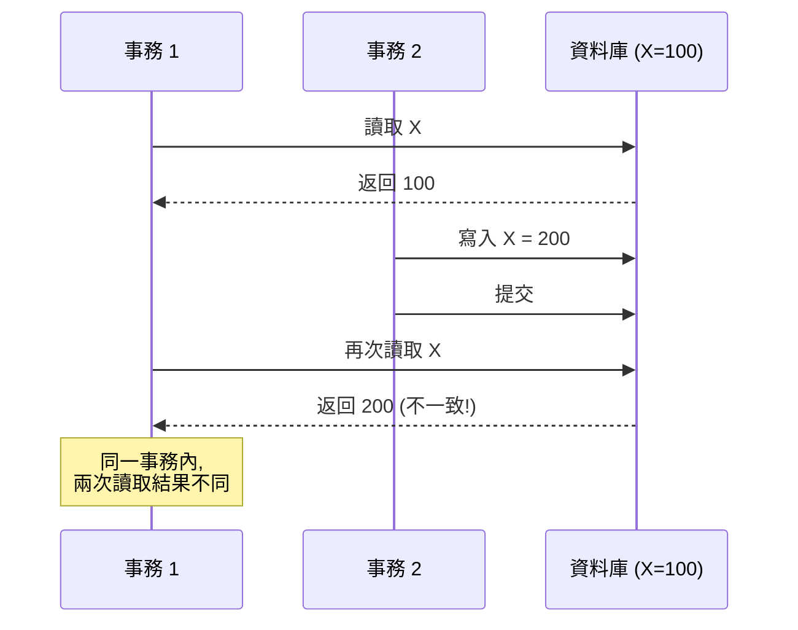

**💻 實際範例**:

```python
# 轉帳邏輯
with db.transaction():
    # 第 1 次讀取
    balance = get_balance('Alice')  # 100
    
    # 檢查餘額是否足夠
    if balance >= 50:
        # 其他事務在這裡修改了餘額
        # Alice 的餘額被別人扣成 10
        
        # 第 2 次讀取
        new_balance = get_balance('Alice')  # 10 (不可重複讀!)
        
        # 基於第一次讀取的決策已經無效
        deduct(50)  # 錯誤: 餘額不足但仍扣款
```

---

### 問題 3: 幻讀 (Phantom Read)

**定義**: 同一查詢條件,多次讀取返回的**資料集合**不同。

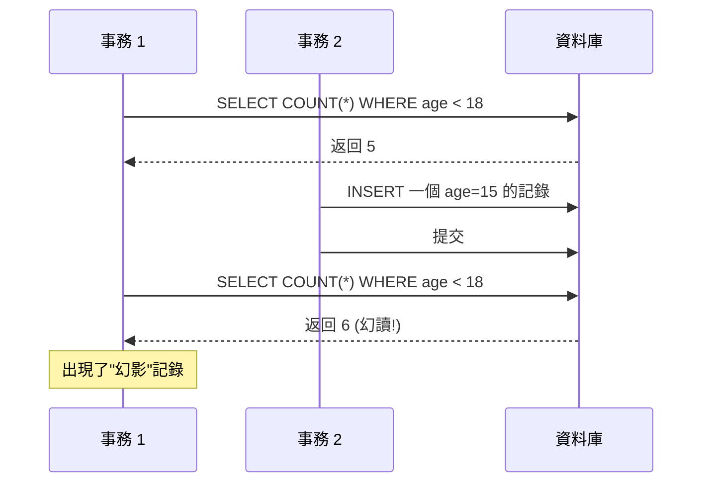

**💻 實際範例**:

```python
# 統計與更新邏輯
with db.transaction():
    # 第 1 次查詢
    count = db.execute("SELECT COUNT(*) FROM students WHERE age < 18").fetchone()[0]
    print(f"未成年學生: {count} 人")  # 5 人
    
    # 其他事務插入了一個 age=15 的學生
    
    # 更新所有未成年學生的資料
    db.execute("UPDATE students SET discount = 0.5 WHERE age < 18")
    
    # 第 2 次查詢
    count = db.execute("SELECT COUNT(*) FROM students WHERE age < 18").fetchone()[0]
    print(f"更新了 {count} 人")  # 6 人 (幻讀!)
    
    # 結果: 統計與實際更新的數量不一致
```

---

### 問題 4: 丟失更新 (Lost Update)

**定義**: 兩個事務同時讀取並修改同一資料,後提交的覆蓋前一個。

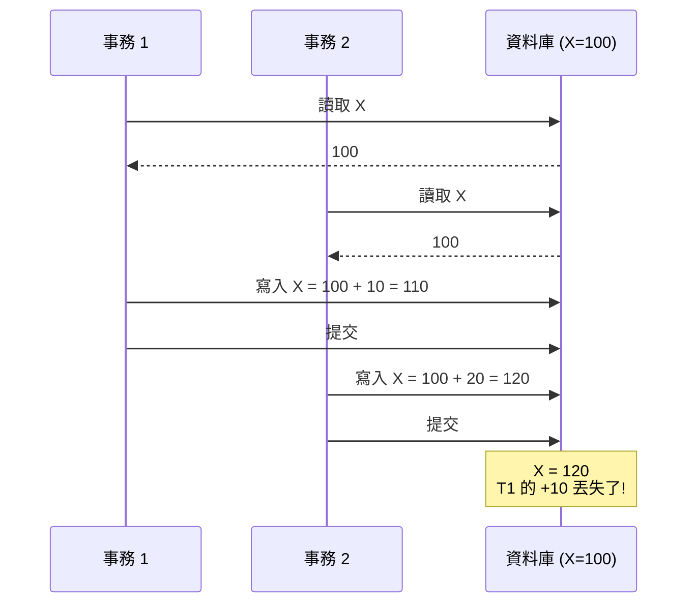

**💻 實際範例**:

```python
# 增加瀏覽計數
def increment_view_count(article_id):
    with db.transaction():
        # 讀取當前計數
        count = db.execute(
            "SELECT view_count FROM articles WHERE id = ?",
            (article_id,)
        ).fetchone()[0]
        
        # 增加 1
        new_count = count + 1
        
        # 寫回資料庫
        db.execute(
            "UPDATE articles SET view_count = ? WHERE id = ?",
            (new_count, article_id)
        )

# 並發場景
# T1 和 T2 同時執行 increment_view_count(1)
# T1: 讀取 100 → 寫入 101
# T2: 讀取 100 → 寫入 101 (覆蓋 T1)
# 結果: 兩次增加,但計數只增加了 1 (丟失更新!)
```

---

### 問題 5: 寫偏斜 (Write Skew)

**定義**: 多個事務讀取相同資料,基於讀取結果做決策,各自寫入不同的資料,導致約束被違反。

**經典案例: 值班醫生問題**

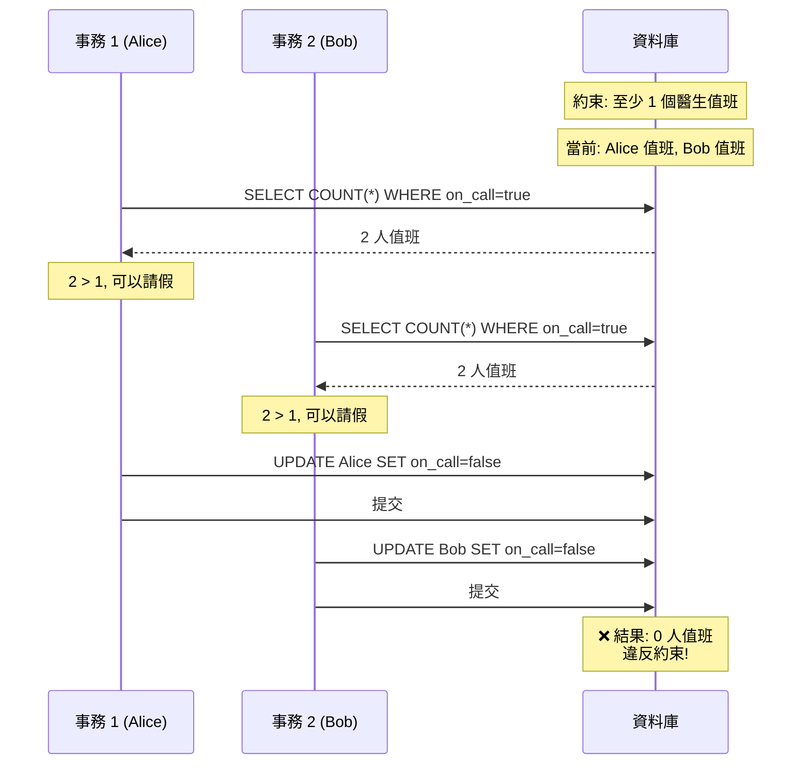

**💻 實際範例**:

```python
# Alice 的請假邏輯
with db.transaction():
    on_call_count = db.execute(
        "SELECT COUNT(*) FROM doctors WHERE on_call = true"
    ).fetchone()[0]
    
    if on_call_count > 1:
        # 還有其他醫生值班,可以請假
        db.execute(
            "UPDATE doctors SET on_call = false WHERE name = 'Alice'"
        )

# Bob 的請假邏輯 (同時執行)
with db.transaction():
    on_call_count = db.execute(
        "SELECT COUNT(*) FROM doctors WHERE on_call = true"
    ).fetchone()[0]
    
    if on_call_count > 1:
        # 還有其他醫生值班,可以請假
        db.execute(
            "UPDATE doctors SET on_call = false WHERE name = 'Bob'"
        )

# 結果: 兩人都請假成功,無人值班!
```

---

## 📊 隔離級別詳解

### 標準 SQL 隔離級別

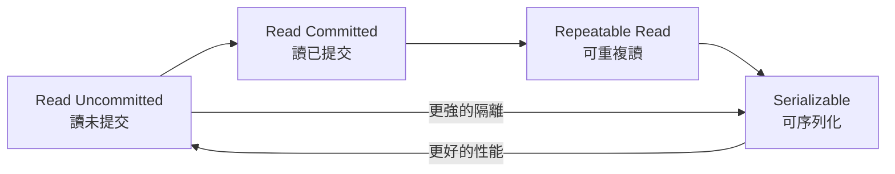

### 級別對比表

| 隔離級別 | 髒讀 | 不可重複讀 | 幻讀 | 丟失更新 | 寫偏斜 |
|----------|------|-----------|------|---------|--------|
| Read Uncommitted | ❌ 可能 | ❌ 可能 | ❌ 可能 | ❌ 可能 | ❌ 可能 |
| Read Committed | ✅ 不會 | ❌ 可能 | ❌ 可能 | ❌ 可能 | ❌ 可能 |
| Repeatable Read | ✅ 不會 | ✅ 不會 | ⚠️ 可能* | ⚠️ 可能* | ⚠️ 可能* |
| Serializable | ✅ 不會 | ✅ 不會 | ✅ 不會 | ✅ 不會 | ✅ 不會 |

*注: 不同資料庫實作的 Repeatable Read 行為可能不同

---

### 級別 1: Read Uncommitted (讀未提交)

**特性**: 允許讀取未提交的資料。

```sql
SET TRANSACTION ISOLATION LEVEL READ UNCOMMITTED;
```

**⚠️ 幾乎從不使用**: 允許髒讀,資料一致性無保障。

---

### 級別 2: Read Committed (讀已提交)

**特性**: 只能讀取已提交的資料。

**實作機制 1: 讀鎖**

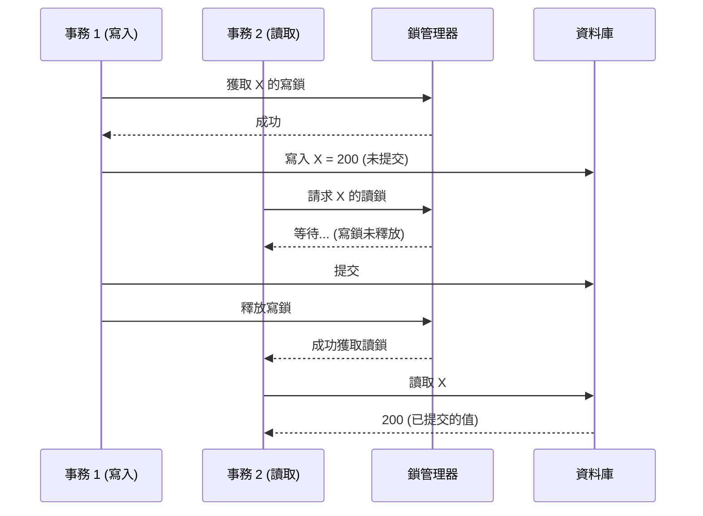

**實作機制 2: MVCC (更常見)**

```python
class MVCCDatabase:
    def __init__(self):
        self.data = {}  # {key: [(value, txn_id, committed), ...]}
        self.next_txn_id = 1
    
    def begin_transaction(self):
        txn_id = self.next_txn_id
        self.next_txn_id += 1
        return txn_id
    
    def read(self, key, txn_id):
        """讀取已提交的最新版本"""
        versions = self.data.get(key, [])
        
        # 找到最新的已提交版本
        for value, version_txn_id, committed in reversed(versions):
            if committed:
                return value
        
        return None  # 無已提交版本
    
    def write(self, key, value, txn_id):
        """寫入新版本 (未提交)"""
        if key not in self.data:
            self.data[key] = []
        
        self.data[key].append((value, txn_id, False))
    
    def commit(self, txn_id):
        """提交事務,標記所有版本為已提交"""
        for versions in self.data.values():
            for i, (value, version_txn_id, committed) in enumerate(versions):
                if version_txn_id == txn_id:
                    versions[i] = (value, version_txn_id, True)

# 使用範例
db = MVCCDatabase()

# 事務 1: 寫入
t1 = db.begin_transaction()
db.write('X', 200, t1)

# 事務 2: 讀取 (T1 未提交)
t2 = db.begin_transaction()
print(db.read('X', t2))  # None 或舊值 (不會讀到 200)

# 事務 1 提交
db.commit(t1)

# 事務 2: 再次讀取
print(db.read('X', t2))  # 200 (已提交)
```

**🏢 真實案例**:
- PostgreSQL, Oracle 默認隔離級別
- 適合大多數應用

**✅ 優點**: 防止髒讀,性能較好

**❌ 缺點**: 不防止不可重複讀

---

### 級別 3: Repeatable Read (可重複讀)

**特性**: 同一事務內多次讀取結果一致。

**實作機制: MVCC + 快照隔離 (Snapshot Isolation)**

```python
class SnapshotIsolationDB:
    def __init__(self):
        self.data = {}  # {key: [(value, txn_id), ...]}
        self.next_txn_id = 1
    
    def begin_transaction(self):
        """事務開始時,記錄當前快照版本"""
        txn_id = self.next_txn_id
        self.next_txn_id += 1
        snapshot_version = txn_id - 1
        return txn_id, snapshot_version
    
    def read(self, key, snapshot_version):
        """讀取快照版本的資料"""
        versions = self.data.get(key, [])
        
        # 找到 <= snapshot_version 的最新版本
        for value, version_txn_id in reversed(versions):
            if version_txn_id <= snapshot_version:
                return value
        
        return None
    
    def write(self, key, value, txn_id):
        if key not in self.data:
            self.data[key] = []
        self.data[key].append((value, txn_id))

# 使用範例
db = SnapshotIsolationDB()

# 初始化資料
db.data['X'] = [(100, 0)]

# 事務 1: 長時間運行
t1, snapshot1 = db.begin_transaction()
print(db.read('X', snapshot1))  # 100

# 事務 2: 更新資料
t2, snapshot2 = db.begin_transaction()
db.write('X', 200, t2)

# 事務 1: 再次讀取 (仍然是快照版本)
print(db.read('X', snapshot1))  # 100 (可重複讀!)

# 新事務 3: 讀取
t3, snapshot3 = db.begin_transaction()
print(db.read('X', snapshot3))  # 200 (看到 T2 的寫入)
```

**可視化示意**:

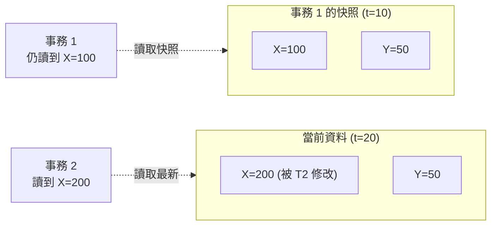

**🏢 真實案例: MySQL InnoDB**

MySQL 的 Repeatable Read 還防止了幻讀 (通過間隙鎖):

```sql
SET TRANSACTION ISOLATION LEVEL REPEATABLE READ;

BEGIN;

-- 第一次查詢
SELECT * FROM students WHERE age < 18;  -- 5 條記錄

-- 其他事務嘗試插入 age=15 的學生
-- 會被阻塞 (間隙鎖)

-- 第二次查詢
SELECT * FROM students WHERE age < 18;  -- 仍然 5 條記錄 (無幻讀)

COMMIT;
```

**✅ 優點**: 符合大多數直覺,防止常見異常

**❌ 缺點**: 仍可能出現寫偏斜

---

### 級別 4: Serializable (可序列化)

**特性**: 最強的隔離級別,完全串行化執行的效果。

**實作機制 1: 兩階段鎖 (2PL, Two-Phase Locking)**


**鎖的類型**:

| 操作 | 鎖類型 | 相容性 |
|------|--------|--------|
| 讀取 | 共享鎖 (S-Lock) | 多個事務可同時持有 |
| 寫入 | 排他鎖 (X-Lock) | 獨占,其他事務必須等待 |

**💻 實作範例**:

```python
from threading import Lock
from collections import defaultdict

class TwoPhaseLocking:
    def __init__(self):
        self.locks = defaultdict(lambda: {'S': [], 'X': None})
        self.lock_mutex = Lock()
    
    def acquire_shared_lock(self, key, txn_id):
        """獲取共享鎖 (讀鎖)"""
        with self.lock_mutex:
            # 如果有排他鎖,等待
            while self.locks[key]['X'] is not None:
                pass  # 實際應使用條件變量
            
            # 添加共享鎖
            self.locks[key]['S'].append(txn_id)
    
    def acquire_exclusive_lock(self, key, txn_id):
        """獲取排他鎖 (寫鎖)"""
        with self.lock_mutex:
            # 如果有其他鎖,等待
            while (self.locks[key]['X'] is not None or 
                   len(self.locks[key]['S']) > 0):
                pass  # 實際應使用條件變量
            
            # 添加排他鎖
            self.locks[key]['X'] = txn_id
    
    def release_all_locks(self, txn_id):
        """事務結束時釋放所有鎖"""
        with self.lock_mutex:
            for key in list(self.locks.keys()):
                # 釋放共享鎖
                if txn_id in self.locks[key]['S']:
                    self.locks[key]['S'].remove(txn_id)
                
                # 釋放排他鎖
                if self.locks[key]['X'] == txn_id:
                    self.locks[key]['X'] = None

# 使用範例
db = TwoPhaseLocking()

# 事務 1
db.acquire_shared_lock('X', txn_id=1)  # 讀取 X
db.acquire_exclusive_lock('Y', txn_id=1)  # 寫入 Y
# ... 執行操作 ...
db.release_all_locks(txn_id=1)  # 提交時釋放

# 事務 2 (如果在 T1 期間嘗試獲取 X 的寫鎖,會被阻塞)
```

**⚠️ 問題: 死鎖 (Deadlock)**

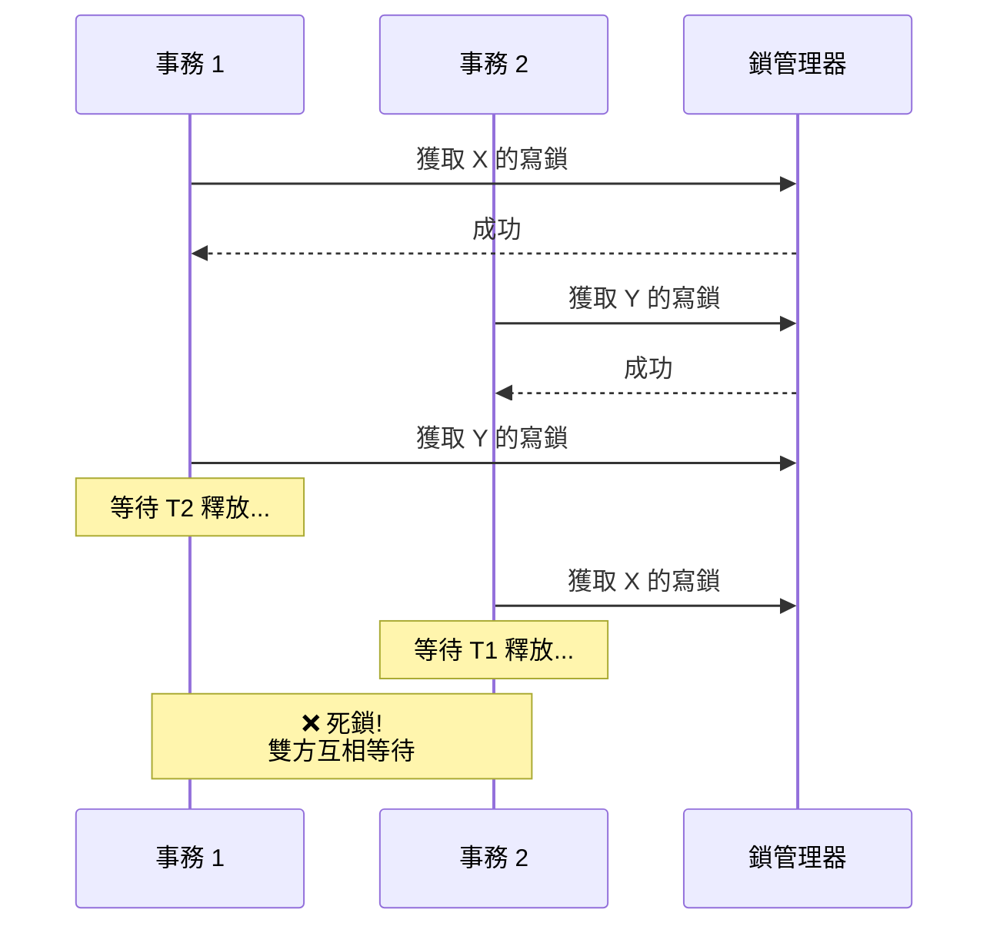

**死鎖檢測與解決**:

```python
class DeadlockDetector:
    def __init__(self):
        self.wait_graph = defaultdict(list)  # {txn: [waiting_for_txn, ...]}
    
    def add_wait_edge(self, txn_id, waiting_for):
        """事務 txn_id 正在等待 waiting_for"""
        self.wait_graph[txn_id].append(waiting_for)
    
    def detect_cycle(self):
        """檢測等待圖中的環 (死鎖)"""
        visited = set()
        rec_stack = set()
        
        def dfs(node):
            visited.add(node)
            rec_stack.add(node)
            
            for neighbor in self.wait_graph[node]:
                if neighbor not in visited:
                    if dfs(neighbor):
                        return True
                elif neighbor in rec_stack:
                    return True  # 找到環
            
            rec_stack.remove(node)
            return False
        
        for node in self.wait_graph:
            if node not in visited:
                if dfs(node):
                    return True  # 存在死鎖
        
        return False
    
    def resolve_deadlock(self):
        """解決死鎖: 中止代價最小的事務"""
        # 選擇一個事務回滾
        victim = self.choose_victim()
        self.abort_transaction(victim)

# PostgreSQL 死鎖示例
# 事務 1
BEGIN;
UPDATE accounts SET balance = balance - 100 WHERE id = 1;  -- 鎖住 id=1
UPDATE accounts SET balance = balance + 100 WHERE id = 2;  -- 等待 id=2

# 事務 2 (同時執行)
BEGIN;
UPDATE accounts SET balance = balance - 50 WHERE id = 2;  -- 鎖住 id=2
UPDATE accounts SET balance = balance + 50 WHERE id = 1;  -- 等待 id=1 (死鎖!)

-- PostgreSQL 會自動檢測並中止其中一個事務:
-- ERROR: deadlock detected
```

---

**實作機制 2: 串行執行 (Single-threaded Execution)**

**設計**: 所有事務在單線程中串行執行。

**適用場景**: 事務**極快** (全內存操作),如 Redis。

```python
import queue

class SerialExecutor:
    def __init__(self):
        self.task_queue = queue.Queue()
        self.data = {}
    
    def submit_transaction(self, transaction):
        """提交事務到隊列"""
        self.task_queue.put(transaction)
    
    def run(self):
        """單線程執行所有事務"""
        while True:
            transaction = self.task_queue.get()
            
            # 串行執行,無需鎖
            transaction.execute(self.data)

# 使用範例
executor = SerialExecutor()

def transfer(data):
    data['Alice'] -= 100
    data['Bob'] += 100

executor.submit_transaction(transfer)
executor.run()
```

**🏢 真實案例: Redis**

```python
# Redis 事務 (串行執行)
import redis

r = redis.Redis()

# 使用 MULTI/EXEC 串行執行命令
pipe = r.pipeline()
pipe.multi()
pipe.decrby('Alice:balance', 100)
pipe.incrby('Bob:balance', 100)
pipe.execute()  # 原子性串行執行
```

**✅ 優點**: 無鎖,無死鎖,實作簡單

**❌ 缺點**: 吞吐量受限於單線程性能

---

**實作機制 3: 序列化快照隔離 (SSI, Serializable Snapshot Isolation)**

**設計**: 在快照隔離基礎上,檢測可能破壞序列化的衝突。

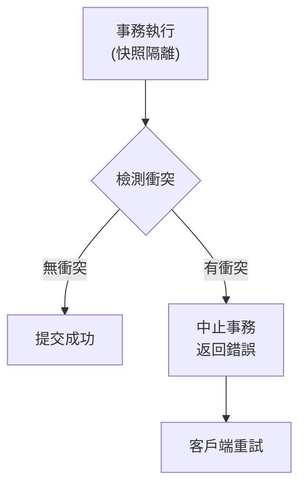

**檢測的衝突類型**:

1. **讀寫衝突**: T1 讀取 X,T2 修改 X,T1 基於讀取結果寫入
2. **寫寫衝突**: T1 和 T2 同時寫入同一資料

**💻 PostgreSQL SSI 範例**:

```sql
SET TRANSACTION ISOLATION LEVEL SERIALIZABLE;

BEGIN;

-- T1: 檢查值班醫生數量
SELECT COUNT(*) FROM doctors WHERE on_call = true;  -- 2 人

-- T2 同時執行相同邏輯並修改資料

-- T1: 基於讀取結果更新
UPDATE doctors SET on_call = false WHERE name = 'Alice';

COMMIT;
-- ERROR: could not serialize access due to read/write dependencies among transactions
```

**🏢 真實案例: PostgreSQL 9.1+, CockroachDB**

**✅ 優點**: 性能遠優於 2PL,無死鎖

**❌ 缺點**: 事務可能被中止,需要應用層重試

---

## 🤔 深入思考

### 練習 1: 選擇隔離級別

給定以下場景,選擇最合適的隔離級別:

**場景 A: 銀行轉帳系統**
- 要求: 絕對不能丟失金額,不能出現負餘額
- 並發: 中等

**場景 B: 社交媒體瀏覽計數**
- 要求: 大致準確即可,允許偶爾少計數幾次
- 並發: 極高

**場景 C: 庫存扣減**
- 要求: 不能超賣,但允許短暫的不一致
- 並發: 高

<details>
<summary>💡 參考答案</summary>

**場景 A: Serializable**
```sql
SET TRANSACTION ISOLATION LEVEL SERIALIZABLE;
BEGIN;
-- 轉帳邏輯
COMMIT;
```
理由: 金額準確性至關重要,必須使用最強隔離級別。

**場景 B: Read Committed 或更低**
```sql
-- 使用 Redis 原子操作
INCR article:123:views
```
理由: 計數不需要絕對準確,性能優先。

**場景 C: Repeatable Read + 樂觀鎖**
```sql
SET TRANSACTION ISOLATION LEVEL REPEATABLE READ;
BEGIN;

SELECT stock, version FROM products WHERE id = 123 FOR UPDATE;

UPDATE products 
SET stock = stock - 1, version = version + 1
WHERE id = 123 AND version = @old_version;

IF @@ROWCOUNT = 0 THEN
    ROLLBACK;  -- 版本衝突,重試
ELSE
    COMMIT;
END IF;
```
理由: 平衡一致性與性能。

</details>

---

### 練習 2: 分析並發異常

以下程式碼在 Read Committed 隔離級別下運行,指出可能的問題:

```python
def book_seat(user_id, seat_id):
    with db.transaction(isolation='READ COMMITTED'):
        # 檢查座位是否可用
        seat = db.execute(
            "SELECT * FROM seats WHERE id = ? AND booked = false",
            (seat_id,)
        ).fetchone()
        
        if seat:
            # 預訂座位
            db.execute(
                "UPDATE seats SET booked = true, user_id = ? WHERE id = ?",
                (user_id, seat_id)
            )
            return "預訂成功"
        else:
            return "座位已被預訂"

# 兩個用戶同時預訂同一座位
book_seat(user_1, seat_101)  # T1
book_seat(user_2, seat_101)  # T2
```

<details>
<summary>💡 參考答案</summary>

**問題: 不可重複讀導致雙重預訂**

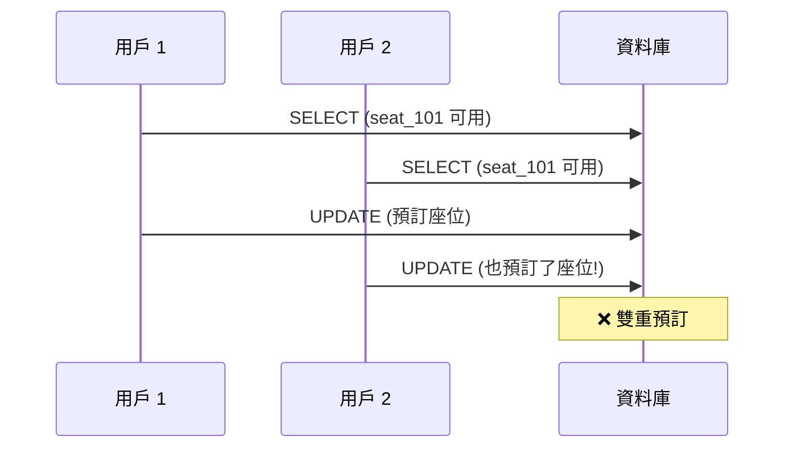

**解決方案 1: 使用 FOR UPDATE (悲觀鎖)**

```python
def book_seat(user_id, seat_id):
    with db.transaction():
        # 鎖住該行
        seat = db.execute(
            "SELECT * FROM seats WHERE id = ? AND booked = false FOR UPDATE",
            (seat_id,)
        ).fetchone()
        
        if seat:
            db.execute(
                "UPDATE seats SET booked = true, user_id = ? WHERE id = ?",
                (user_id, seat_id)
            )
            return "預訂成功"
        else:
            return "座位已被預訂"
```

**解決方案 2: 使用樂觀鎖 (版本號)**

```python
def book_seat(user_id, seat_id):
    with db.transaction():
        seat = db.execute(
            "SELECT version FROM seats WHERE id = ? AND booked = false",
            (seat_id,)
        ).fetchone()
        
        if seat:
            version = seat['version']
            
            # 更新時檢查版本
            rows = db.execute(
                """UPDATE seats 
                   SET booked = true, user_id = ?, version = version + 1
                   WHERE id = ? AND version = ?""",
                (user_id, seat_id, version)
            ).rowcount
            
            if rows == 1:
                return "預訂成功"
            else:
                return "預訂失敗,請重試"  # 版本衝突
```

**解決方案 3: 使用 Serializable 隔離級別**

```python
def book_seat(user_id, seat_id):
    with db.transaction(isolation='SERIALIZABLE'):
        # 自動檢測衝突
        seat = db.execute(
            "SELECT * FROM seats WHERE id = ? AND booked = false",
            (seat_id,)
        ).fetchone()
        
        if seat:
            db.execute(
                "UPDATE seats SET booked = true, user_id = ? WHERE id = ?",
                (user_id, seat_id)
            )
            return "預訂成功"
```

</details>

---

## 📚 總結

### 核心要點

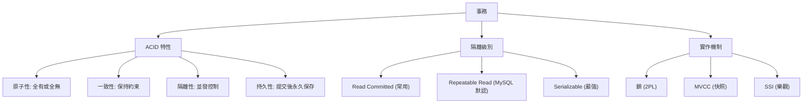

### 決策指南

**選擇隔離級別**:

| 場景 | 推薦隔離級別 | 理由 |
|------|-------------|------|
| 金融交易 | Serializable | 不容許任何異常 |
| 訂單系統 | Repeatable Read + 樂觀鎖 | 平衡性能與一致性 |
| 社交媒體 | Read Committed | 性能優先,容忍短暫不一致 |
| 數據分析 (只讀) | Read Committed 或更低 | 無寫入衝突 |

**避免常見陷阱**:

1. **不要假設默認隔離級別足夠**: 明確設置隔離級別
2. **注意長事務**: 持有鎖時間過長,影響並發
3. **處理死鎖**: 實作重試邏輯
4. **測試並發場景**: 單線程測試無法發現並發問題

---

## 🔗 參考資料

1. **書籍**:
   - Martin Kleppmann, *Designing Data-Intensive Applications*, Chapter 7
   - Jim Gray, *Transaction Processing: Concepts and Techniques*

2. **論文**:
   - [A Critique of ANSI SQL Isolation Levels](https://www.microsoft.com/en-us/research/wp-content/uploads/2016/02/tr-95-51.pdf)
   - [Serializable Snapshot Isolation in PostgreSQL](https://drkp.net/papers/ssi-vldb12.pdf)

3. **技術文件**:
   - [PostgreSQL Transaction Isolation](https://www.postgresql.org/docs/current/transaction-iso.html)
   - [MySQL InnoDB Locking](https://dev.mysql.com/doc/refman/8.0/en/innodb-locking.html)

4. **部落格**:
   - [Jepsen: Consistency Models](https://jepsen.io/consistency)
   - [Understanding Isolation Levels](https://www.cockroachlabs.com/blog/sql-isolation-levels-explained/)
