# 07 - 分散式系統的困境 (The Trouble with Distributed Systems)

## 🎯 學習目標

完成本章後,你將能夠:
- 理解分散式系統中的根本性挑戰
- 認識網路、時鐘、進程故障的影響
- 掌握設計容錯系統的基本原則
- 理解為什麼分散式系統比單機系統困難得多

---

## 💡 核心概念

### 分散式系統的根本問題

**Murphy 定律在分散式系統中的體現**: 任何可能出錯的事情,都會出錯。

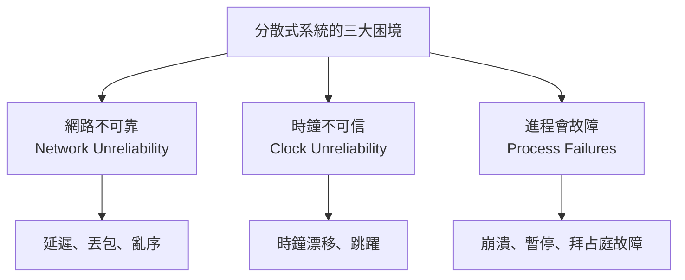

**為什麼要使用分散式系統?**

| 原因 | 說明 |
|------|------|
| **擴展性** | 單機容量有限 |
| **容錯性** | 單點故障風險 |
| **低延遲** | 地理分布的使用者 |
| **成本** | 商用硬體比大型機便宜 |

**但是**: 分散式系統遠比單機系統複雜,必須應對各種不確定性。

---

## 🌐 網路不可靠

### 常見網路問題

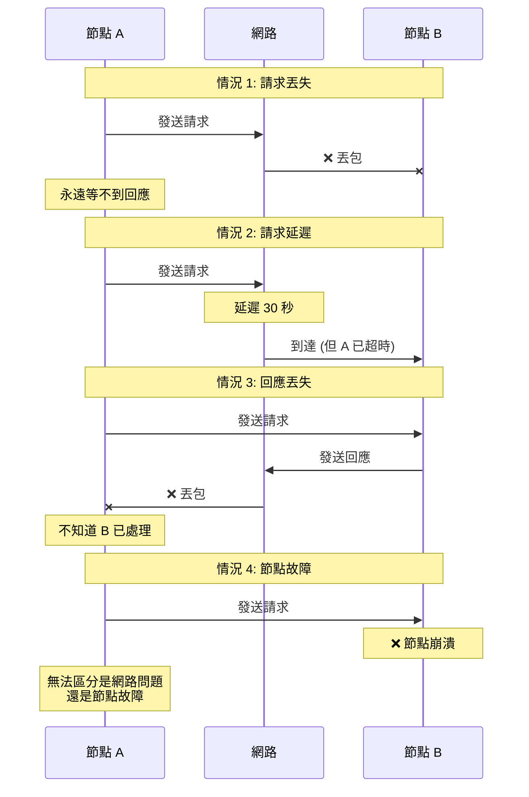

### 真實世界的網路故障

**🏢 案例 1: GitHub 2012 網路分區**

- **事件**: 資料中心間的網路連接故障
- **持續時間**: 約 1 小時
- **影響**: 主從資料庫無法同步,導致腦裂 (Split-brain)
- **後果**: 部分寫入丟失,需手動修復

**🏢 案例 2: Amazon S3 2017 故障**

- **事件**: 內部網路配置錯誤
- **持續時間**: 4 小時
- **影響**: 大量依賴 S3 的服務中斷
- **教訓**: 即使是雲服務商,網路也會出問題

### 超時與重試

**問題**: 如何判斷請求失敗?

```python
import time
import random

def send_request(node, request, timeout=5.0):
    """發送請求,帶超時機制"""
    start = time.time()
    
    try:
        response = node.send(request, timeout=timeout)
        return response
    except TimeoutError:
        # 超時了,但不知道發生了什麼:
        # 1. 請求丟失?
        # 2. 節點故障?
        # 3. 請求正在處理,但很慢?
        # 4. 回應丟失?
        
        elapsed = time.time() - start
        print(f"請求超時 (等待 {elapsed:.2f} 秒)")
        
        # ⚠️ 無法判斷是否應該重試
        raise

# 使用範例
try:
    response = send_request(node_b, {"action": "transfer", "amount": 100})
except TimeoutError:
    # 應該重試嗎?
    # - 如果請求已執行,重試會導致重複操作 (轉帳兩次!)
    # - 如果請求未執行,不重試會導致操作失敗
    pass
```

**超時時間的選擇**:

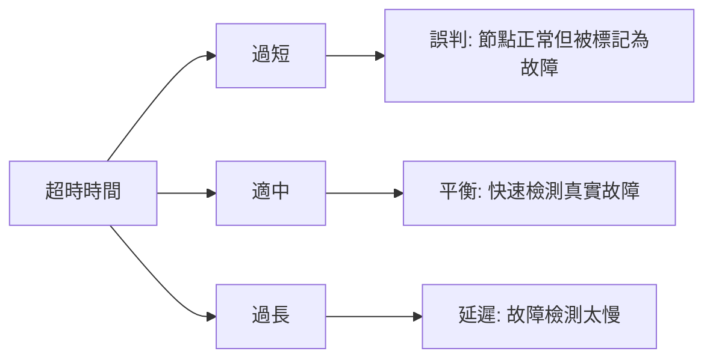

**💻 自適應超時實作**:

```python
import time
from collections import deque

class AdaptiveTimeout:
    def __init__(self, initial_timeout=1.0, window_size=100):
        self.timeout = initial_timeout
        self.response_times = deque(maxlen=window_size)
    
    def record_response_time(self, response_time):
        """記錄回應時間"""
        self.response_times.append(response_time)
        
        # 更新超時: 平均值 + 2 * 標準差
        if len(self.response_times) >= 10:
            avg = sum(self.response_times) / len(self.response_times)
            variance = sum((x - avg) ** 2 for x in self.response_times) / len(self.response_times)
            stddev = variance ** 0.5
            
            self.timeout = avg + 2 * stddev
    
    def get_timeout(self):
        return self.timeout

# 使用範例
timeout_manager = AdaptiveTimeout()

for _ in range(1000):
    start = time.time()
    try:
        response = send_request(node, request, timeout=timeout_manager.get_timeout())
        elapsed = time.time() - start
        timeout_manager.record_response_time(elapsed)
    except TimeoutError:
        # 超時,不更新統計
        pass
```

---

### 冪等性 (Idempotence)

**定義**: 多次執行相同操作,結果與執行一次相同。

**為什麼重要**: 網路不可靠時,客戶端可能重試,必須保證重複請求的安全性。

**💻 冪等操作範例**:

```python
# ✅ 冪等: 設置值
def set_user_email(user_id, email):
    db.execute("UPDATE users SET email = ? WHERE id = ?", (email, user_id))
    # 執行 1 次或 10 次,結果相同

# ✅ 冪等: 刪除
def delete_user(user_id):
    db.execute("DELETE FROM users WHERE id = ?", (user_id,))
    # 重複刪除不影響結果

# ❌ 非冪等: 增加值
def increment_counter(key):
    value = db.get(key)
    db.set(key, value + 1)
    # 執行 2 次會增加 2,而不是 1

# ✅ 改進: 使用冪等鍵
def increment_counter_idempotent(key, request_id):
    # 檢查請求是否已處理
    if db.exists(f"processed:{request_id}"):
        return  # 已處理,跳過
    
    value = db.get(key)
    db.set(key, value + 1)
    db.set(f"processed:{request_id}", "1", ex=3600)  # 標記已處理,1 小時過期
```

**HTTP API 的冪等性設計**:

| HTTP 方法 | 冪等性 | 範例 |
|-----------|--------|------|
| GET | ✅ 是 | 查詢資料 |
| PUT | ✅ 是 | 更新整個資源 |
| DELETE | ✅ 是 | 刪除資源 |
| POST | ❌ 否* | 創建資源、提交表單 |
| PATCH | ❌ 否* | 部分更新 |

*可通過設計實現冪等性

**POST 冪等性設計**:

```python
from flask import Flask, request
import uuid

app = Flask(__name__)
processed_requests = set()

@app.route('/transfer', methods=['POST'])
def transfer():
    # 客戶端生成唯一請求 ID
    request_id = request.headers.get('X-Request-ID')
    
    if not request_id:
        return {"error": "缺少 X-Request-ID"}, 400
    
    # 檢查是否已處理
    if request_id in processed_requests:
        return {"status": "已處理 (冪等)"}
    
    # 處理轉帳
    amount = request.json['amount']
    from_account = request.json['from']
    to_account = request.json['to']
    
    perform_transfer(from_account, to_account, amount)
    
    # 記錄已處理
    processed_requests.add(request_id)
    
    return {"status": "成功"}

# 客戶端使用
import requests

request_id = str(uuid.uuid4())

# 可安全重試
for attempt in range(3):
    try:
        response = requests.post(
            'http://api.example.com/transfer',
            json={"from": "Alice", "to": "Bob", "amount": 100},
            headers={"X-Request-ID": request_id},
            timeout=5
        )
        break
    except requests.Timeout:
        print(f"重試第 {attempt + 1} 次")
```

---

## 🕰️ 時鐘不可信

### 兩種時鐘

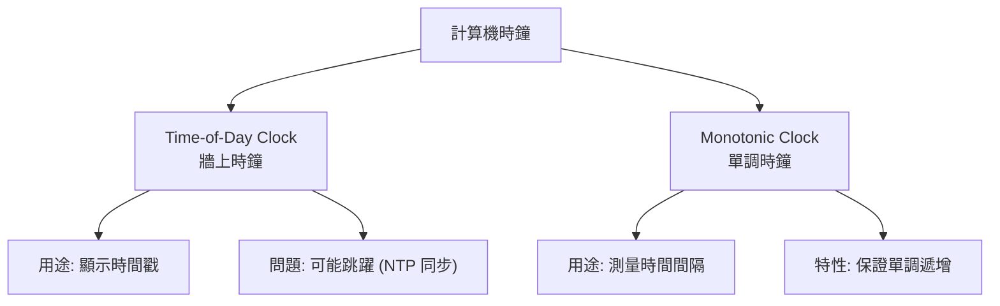

### Time-of-Day Clock (牆上時鐘)

**特性**: 返回當前日期時間,可以與 NTP 同步。

**問題 1: 時鐘跳躍**

```python
import time

# 測量操作耗時 (錯誤用法)
start = time.time()  # 使用 time-of-day clock
do_something()
end = time.time()
elapsed = end - start

# ⚠️ 問題: 如果中間發生 NTP 同步,elapsed 可能是負數或異常大!

# 範例: NTP 同步導致時間回撥
# start = 1609459200.5  (2021-01-01 00:00:00.5)
# [NTP 同步: 時鐘回撥 1 秒]
# end = 1609459199.8    (2020-12-31 23:59:59.8)
# elapsed = -0.7 秒 (負數!)
```

**正確做法: 使用 Monotonic Clock**

```python
import time

# ✅ 正確: 使用單調時鐘
start = time.monotonic()  # 單調時鐘,不受 NTP 影響
do_something()
end = time.monotonic()
elapsed = end - start  # 保證非負
```

---

### 問題 2: 時鐘偏移 (Clock Skew)

**定義**: 不同機器的時鐘不一致。

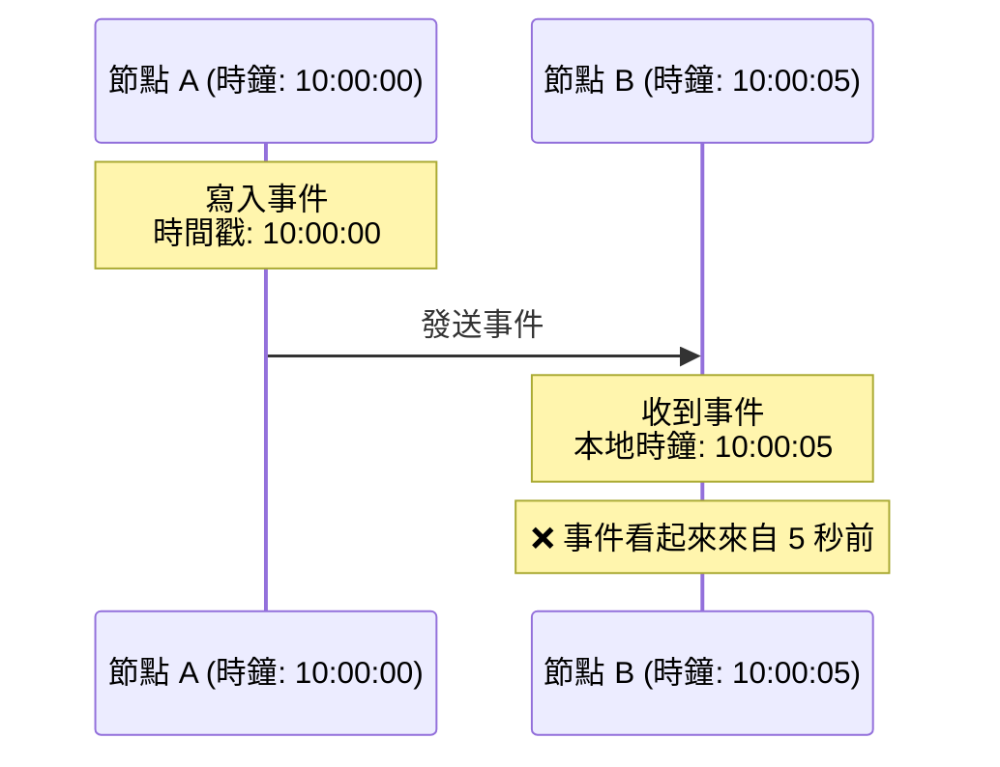

**實際影響範例**:

```python
# Last-Write-Wins (LWW) 策略
class LWWRegister:
    def __init__(self):
        self.value = None
        self.timestamp = 0
    
    def write(self, value, timestamp):
        # 只保留時間戳最大的寫入
        if timestamp > self.timestamp:
            self.value = value
            self.timestamp = timestamp

# 節點 A (時鐘慢 5 秒)
register_a = LWWRegister()
register_a.write("A", timestamp=100)  # 實際應該是 105

# 節點 B (時鐘準確)
register_b = LWWRegister()
register_b.write("B", timestamp=103)

# 合併時
register_a.merge(register_b)
print(register_a.value)  # "B" (正確)

# 但如果 A 的時鐘快 5 秒:
register_a.write("A", timestamp=110)  # 實際應該是 103
register_a.merge(register_b)
print(register_a.value)  # "A" (錯誤! 應該是 B)
```

**🏢 真實案例: Amazon 的 NTP 故障**

- **事件**: DynamoDB 某些節點的 NTP 同步失敗
- **影響**: 時鐘偏移導致數據版本判斷錯誤
- **教訓**: 不能完全信任時間戳進行版本控制

---

### 時鐘同步: NTP

**NTP (Network Time Protocol)** 通過網路同步時鐘。

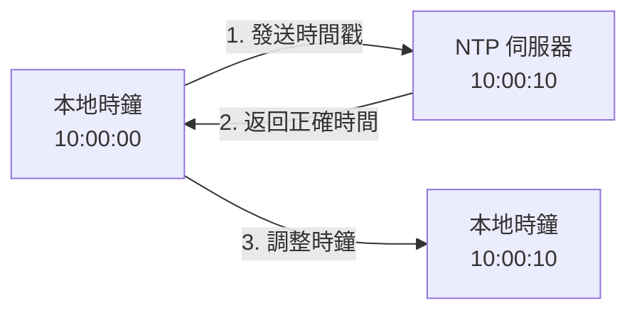

**問題**:

1. **網路延遲**: NTP 伺服器的時間到達需要時間,精度受限
2. **時鐘跳躍**: 如果偏移較大,時鐘會突然跳躍
3. **NTP 伺服器故障**: 如果無法連接,時鐘逐漸漂移

**精度範圍**:

| 條件 | 精度 |
|------|------|
| 本地網路 NTP 伺服器 | ±1-10 毫秒 |
| 公網 NTP 伺服器 | ±10-100 毫秒 |
| 無 NTP 同步 | 每天漂移 ±幾秒 |
| 硬體時鐘 (GPS/原子鐘) | ±微秒級 |

**Google Spanner 的 TrueTime API**:

```python
# TrueTime 返回時間區間 [earliest, latest]
tt = TrueTime.now()
print(f"當前時間: {tt.earliest} - {tt.latest}")
# 輸出: 當前時間: 1609459200.000 - 1609459200.007

# 保證: 實際時間一定在這個區間內
# Google 使用 GPS 和原子鐘將誤差控制在 7ms 以內
```

---

### 依賴時鐘的危險

**案例: 使用時間戳作為鍵**

```python
# ❌ 危險: 使用時間戳作為唯一鍵
def generate_order_id():
    return int(time.time() * 1000000)  # 微秒時間戳

# 問題 1: 時鐘回撥可能產生重複 ID
order1 = generate_order_id()  # 1609459200000000
# [NTP 同步,時鐘回撥]
order2 = generate_order_id()  # 1609459199000000 (更小!)

# 問題 2: 不同節點的時鐘偏移可能產生亂序 ID
# 節點 A (時鐘快): 1609459205000000
# 節點 B (時鐘慢): 1609459200000000
```

**✅ 更好的方案: 混合時鐘 (Hybrid Logical Clock)**

```python
class HybridLogicalClock:
    def __init__(self, node_id):
        self.node_id = node_id
        self.logical_time = 0
        self.last_physical_time = 0
    
    def now(self):
        """生成混合邏輯時鐘時間戳"""
        physical_time = int(time.time() * 1000)  # 毫秒
        
        # 如果物理時鐘前進,重置邏輯時鐘
        if physical_time > self.last_physical_time:
            self.last_physical_time = physical_time
            self.logical_time = 0
        else:
            # 物理時鐘未前進(或回撥),邏輯時鐘遞增
            self.logical_time += 1
        
        # 返回 (物理時間, 邏輯計數, 節點 ID)
        return (self.last_physical_time, self.logical_time, self.node_id)
    
    def update(self, remote_timestamp):
        """接收遠程時間戳,更新本地時鐘"""
        remote_physical, remote_logical, _ = remote_timestamp
        local_physical = int(time.time() * 1000)
        
        # 取最大的物理時間
        self.last_physical_time = max(local_physical, remote_physical, self.last_physical_time)
        
        # 如果物理時間相同,取最大邏輯時間 + 1
        if self.last_physical_time == remote_physical:
            self.logical_time = max(self.logical_time, remote_logical) + 1
        else:
            self.logical_time = 0

# 使用範例
clock_a = HybridLogicalClock(node_id="A")
clock_b = HybridLogicalClock(node_id="B")

# 節點 A 生成時間戳
ts_a = clock_a.now()  # (1609459200000, 0, "A")

# 節點 B 收到事件,更新時鐘
clock_b.update(ts_a)
ts_b = clock_b.now()  # (1609459200000, 1, "B")

# 保證: ts_b > ts_a (即使物理時鐘相同)
```

---

## 💣 進程會故障

### 進程暫停的原因

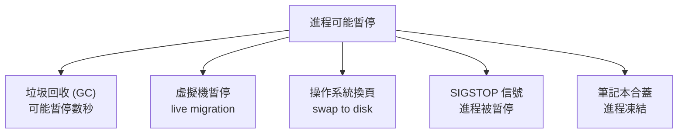

**問題**: 進程無法感知自己被暫停了多久。

### 危險的假設

**錯誤假設: 程式會連續執行**

```python
import time

def unsafe_lease_checker():
    """❌ 不安全的租約檢查"""
    lease_expiry = time.time() + 10  # 10 秒租約
    
    # 執行關鍵操作
    while time.time() < lease_expiry:
        perform_critical_operation()
        time.sleep(1)
    
    # ⚠️ 問題: 如果 GC 暫停了 15 秒,
    # 進程會在租約過期後繼續執行!

# 時間線:
# t=0: 獲取租約,到 t=10 過期
# t=1: perform_critical_operation()
# t=2: [GC 開始,暫停 15 秒]
# t=17: [GC 結束,恢復執行]
# t=17: while 條件判斷 (17 < 10? False) ← 但已經執行了 16 秒!
```

**現實場景**:

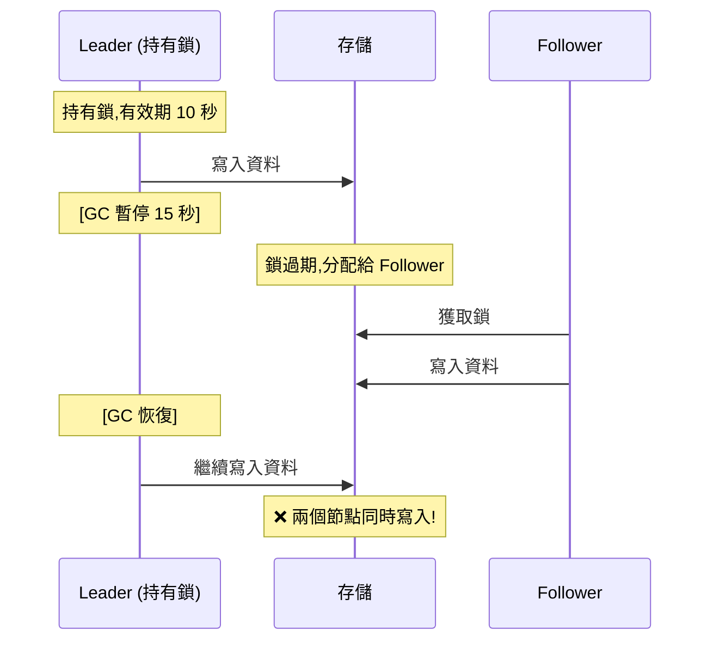

---

### 解決方案: Fencing Token

**設計**: 使用遞增的令牌 (Token) 保護資源。

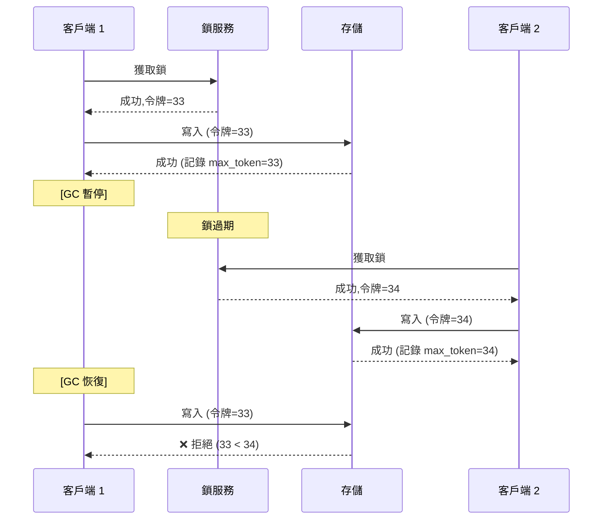

**💻 實作範例**:

```python
class FencedStorage:
    def __init__(self):
        self.data = {}
        self.max_token = 0
    
    def write(self, key, value, token):
        """寫入資料,檢查令牌"""
        if token < self.max_token:
            raise ValueError(f"令牌過期: {token} < {self.max_token}")
        
        self.max_token = token
        self.data[key] = value
        return True

class LockService:
    def __init__(self):
        self.token_counter = 0
        self.lock_holder = None
    
    def acquire_lock(self, client_id):
        """獲取鎖,返回遞增令牌"""
        if self.lock_holder is not None:
            return None
        
        self.token_counter += 1
        self.lock_holder = client_id
        return self.token_counter

# 使用範例
storage = FencedStorage()
lock_service = LockService()

# 客戶端 1
token1 = lock_service.acquire_lock("client1")  # token=1
storage.write("key", "value1", token1)  # 成功

# 客戶端 2 (在客戶端 1 暫停後獲取鎖)
token2 = lock_service.acquire_lock("client2")  # token=2
storage.write("key", "value2", token2)  # 成功

# 客戶端 1 恢復 (使用舊令牌)
try:
    storage.write("key", "value1", token1)  # token=1
except ValueError:
    print("令牌過期,寫入被拒絕")  # ✅ 安全!
```

---

## 🎯 真實世界案例

### 案例 1: AWS DynamoDB 的 2015 故障

**事件**: 鬧鐘系統軟體 bug 導致時鐘跳躍

**影響**:
- 租約過期判斷錯誤
- 多個節點認為自己是主節點
- 部分寫入丟失

**教訓**: 不能假設時鐘總是正確的

---

### 案例 2: Cloudflare 的 2020 故障

**事件**: SSD 故障導致一個資料中心不可用

**影響**:
- 全球流量無法路由到該資料中心
- 負載均衡器花了 30 分鐘才將流量切走

**教訓**: 故障檢測必須足夠快,但不能太敏感

---

### 案例 3: GitHub 的 2018 網路分區

**事件**: 網路維護導致美國東西海岸資料中心斷開 43 秒

**影響**:
- 兩個資料中心都認為對方故障
- 各自選舉主節點,產生腦裂
- 43 秒內的寫入不一致

**恢復**:
- 停止服務 24 小時進行資料修復
- 使用 MySQL binlog 對比和修復不一致的資料

**教訓**: 即使短暫的網路分區也可能導致嚴重後果

---

## 🛡️ 設計原則

### 原則 1: 拜占庭將軍問題 vs 非拜占庭故障

**非拜占庭故障 (Crash-Stop Failure)**:
- 節點會崩潰,但不會說謊
- 網路可能丟包,但不會篡改訊息

**拜占庭故障 (Byzantine Failure)**:
- 節點可能惡意行為,發送錯誤訊息
- 網路可能被攻擊者控制

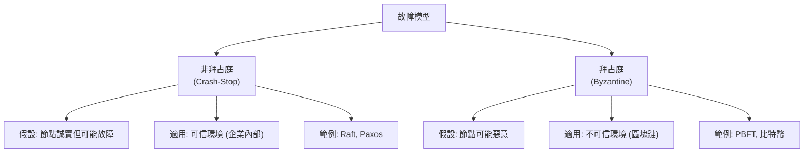

**大多數系統假設非拜占庭故障**: 實作簡單,性能更好。

---

### 原則 2: 系統模型

**同步模型 (Synchronous Model)**:
- 假設: 網路延遲有上界,時鐘誤差有上界
- 現實: 不存在 (網路可能任意延遲)

**異步模型 (Asynchronous Model)**:
- 假設: 網路延遲無限,時鐘不可用
- 現實: 太悲觀,無法設計實用系統

**部分同步模型 (Partially Synchronous Model)**:
- 假設: 大部分時間同步,偶爾異步
- 現實: 符合實際情況
- **大多數分散式算法基於此模型**

---

### 原則 3: 容錯設計

**假設所有可能出錯的都會出錯**:

```python
class RobustDistributedSystem:
    def send_request(self, node, request):
        """健壯的請求發送"""
        max_retries = 3
        timeout = 5.0
        
        for attempt in range(max_retries):
            try:
                # 1. 使用超時
                response = node.send(request, timeout=timeout)
                
                # 2. 驗證回應
                if not self.is_valid_response(response):
                    raise ValueError("無效回應")
                
                # 3. 檢查冪等性
                if self.is_duplicate_response(response):
                    return response  # 重複請求,返回快取結果
                
                return response
                
            except TimeoutError:
                # 4. 超時重試
                if attempt < max_retries - 1:
                    # 指數退避
                    time.sleep(2 ** attempt)
                    continue
                else:
                    # 5. 最終失敗,降級處理
                    return self.fallback_handler()
            
            except Exception as e:
                # 6. 記錄錯誤
                self.log_error(e)
                raise
    
    def is_valid_response(self, response):
        """驗證回應的完整性"""
        # 檢查 checksum, 簽名等
        return True
    
    def is_duplicate_response(self, response):
        """檢查是否為重複回應"""
        request_id = response.get('request_id')
        return request_id in self.processed_requests
    
    def fallback_handler(self):
        """降級處理"""
        # 返回快取資料或默認值
        return {"status": "degraded"}
```

---

## 🤔 深入思考

### 練習 1: 分析故障場景

**場景**: 分散式鎖服務,使用租約機制:

```python
class DistributedLock:
    def acquire(self, resource, ttl=10):
        """獲取鎖,有效期 ttl 秒"""
        return self.set_if_not_exists(resource, "locked", ttl)
    
    def release(self, resource):
        """釋放鎖"""
        self.delete(resource)

# 客戶端使用
lock = DistributedLock()
if lock.acquire("resource1"):
    # 執行關鍵操作
    process_critical_section()
    lock.release("resource1")
```

**問題**:
1. 如果客戶端在 `process_critical_section()` 中 GC 暫停 15 秒,會發生什麼?
2. 如果網路分區導致 `lock.release()` 失敗,會發生什麼?
3. 如何改進設計?

<details>
<summary>💡 參考答案</summary>

**問題 1: GC 暫停導致的鎖過期**

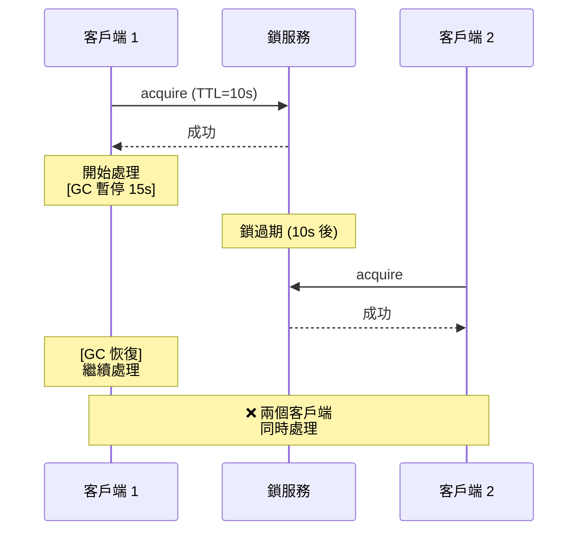

**問題 2: 網路分區導致無法釋放鎖**
- 鎖會在 TTL 過期後自動釋放
- 但期間其他客戶端無法獲取鎖 (可用性降低)

**改進方案**: 使用 Fencing Token

```python
class ImprovedDistributedLock:
    def __init__(self):
        self.token_counter = 0
    
    def acquire(self, resource, ttl=10):
        """獲取鎖,返回遞增令牌"""
        self.token_counter += 1
        token = self.token_counter
        
        if self.set_if_not_exists(resource, token, ttl):
            return token
        return None

# 客戶端使用
token = lock.acquire("resource1")
if token:
    # 傳遞令牌給後端服務
    backend.process(resource="resource1", token=token)

# 後端服務
class Backend:
    def __init__(self):
        self.max_token = {}
    
    def process(self, resource, token):
        # 檢查令牌
        if token <= self.max_token.get(resource, 0):
            raise ValueError("令牌過期")
        
        self.max_token[resource] = token
        # 執行操作
```

</details>

---

### 練習 2: 設計容錯的分散式計數器

**需求**:
- 多個節點並發增加計數
- 容忍網路分區
- 容忍節點故障
- 最終一致性

**嘗試設計一個方案**。

<details>
<summary>💡 參考答案</summary>

**方案: PN-Counter (Positive-Negative Counter)**

```python
class PNCounter:
    """分散式計數器,支持增加和減少"""
    
    def __init__(self, node_id):
        self.node_id = node_id
        self.positive = {}  # {node_id: count}
        self.negative = {}  # {node_id: count}
    
    def increment(self, delta=1):
        """增加計數"""
        if self.node_id not in self.positive:
            self.positive[self.node_id] = 0
        self.positive[self.node_id] += delta
    
    def decrement(self, delta=1):
        """減少計數"""
        if self.node_id not in self.negative:
            self.negative[self.node_id] = 0
        self.negative[self.node_id] += delta
    
    def value(self):
        """當前計數值"""
        pos_sum = sum(self.positive.values())
        neg_sum = sum(self.negative.values())
        return pos_sum - neg_sum
    
    def merge(self, other):
        """合併其他節點的狀態"""
        # 取每個節點的最大值
        for node, count in other.positive.items():
            self.positive[node] = max(
                self.positive.get(node, 0),
                count
            )
        
        for node, count in other.negative.items():
            self.negative[node] = max(
                self.negative.get(node, 0),
                count
            )

# 使用範例
counter1 = PNCounter("node1")
counter1.increment(5)  # +5

counter2 = PNCounter("node2")
counter2.increment(3)  # +3

# 網路分區後合併
counter1.merge(counter2)
print(counter1.value())  # 8

# 特性:
# ✅ 無需協調,本地操作
# ✅ 合併是冪等的
# ✅ 最終一致性
```

</details>

---

## 📚 總結

### 核心要點

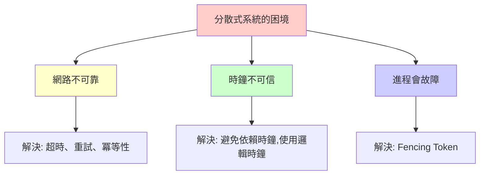

### 設計清單

在設計分散式系統時,檢查以下問題:

- [ ] **網路**: 是否處理超時和重試?
- [ ] **冪等性**: 重複請求是否安全?
- [ ] **時鐘**: 是否依賴了不可靠的時鐘?
- [ ] **故障檢測**: 如何區分慢響應和節點故障?
- [ ] **租約**: 是否有租約過期後仍執行的風險?
- [ ] **腦裂**: 是否可能出現多個主節點?
- [ ] **降級**: 部分組件故障時系統如何降級?

---

## 🔗 參考資料

1. **書籍**:
   - Martin Kleppmann, *Designing Data-Intensive Applications*, Chapter 8
   - Leslie Lamport, *Time, Clocks, and the Ordering of Events in a Distributed System*

2. **論文**:
   - [Harvest, Yield, and Scalable Tolerant Systems](http://citeseerx.ist.psu.edu/viewdoc/summary?doi=10.1.1.24.3690)
   - [The Network is Reliable (反諷)](https://queue.acm.org/detail.cfm?id=2655736)

3. **技術文件**:
   - [AWS Best Practices for DynamoDB](https://docs.aws.amazon.com/amazondynamodb/latest/developerguide/best-practices.html)
   - [Google Spanner TrueTime](https://cloud.google.com/spanner/docs/true-time-external-consistency)

4. **事故報告**:
   - [GitHub Availability This Week](https://github.blog/2018-10-30-oct21-post-incident-analysis/)
   - [Summary of the Amazon S3 Service Disruption](https://aws.amazon.com/message/41926/)
