# 08 - 一致性與共識 (Consistency and Consensus)

## 🎯 學習目標

完成本章後,你將能夠:
- 理解分散式系統中的一致性模型
- 掌握共識算法的原理 (Paxos, Raft)
- 理解 CAP 定理與實際應用
- 設計需要共識的分散式系統

---

## 💡 核心概念

### 什麼是共識?

**共識 (Consensus)**: 讓多個節點對某個值達成一致意見。

**為什麼困難?**

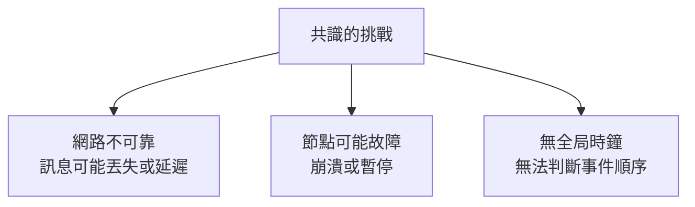

**共識的應用場景**:

| 應用 | 需要共識的內容 |
|------|--------------|
| **Leader 選舉** | 誰是新的 Leader |
| **原子提交** | 事務是否提交 |
| **複製日誌** | 日誌條目的順序 |
| **鎖服務** | 誰獲得鎖 |
| **配置管理** | 集群配置的版本 |

---

## 📊 一致性模型

### 一致性光譜

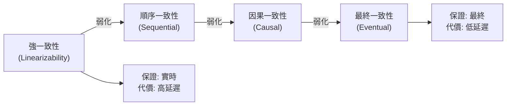

---

### 線性一致性 (Linearizability)

**定義**: 最強的一致性保證,系統表現得像只有一個副本,操作瞬間完成且順序明確。

**特性**:
1. **實時性 (Real-time)**: 如果操作 A 在操作 B 開始前完成,則 A 必須在 B 之前生效
2. **全局順序**: 所有操作有唯一的全局順序
3. **讀取最新值**: 讀操作必須返回最新寫入的值

**可視化示意**:

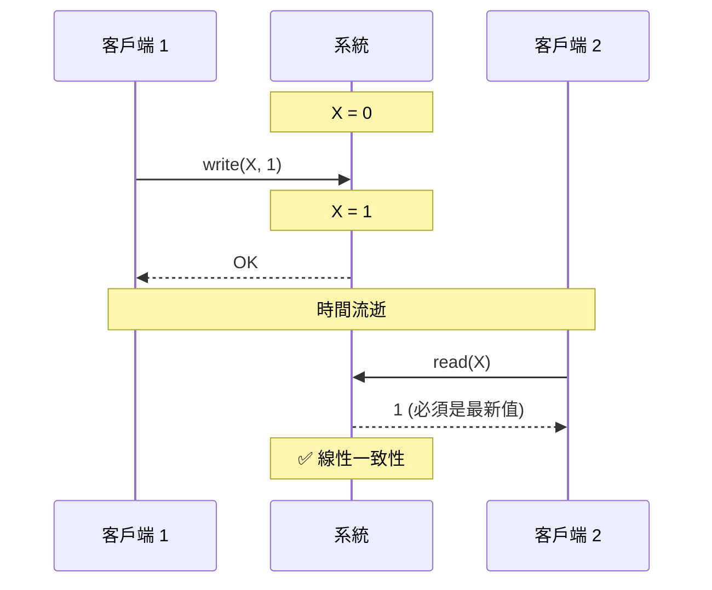

**非線性一致性範例**:

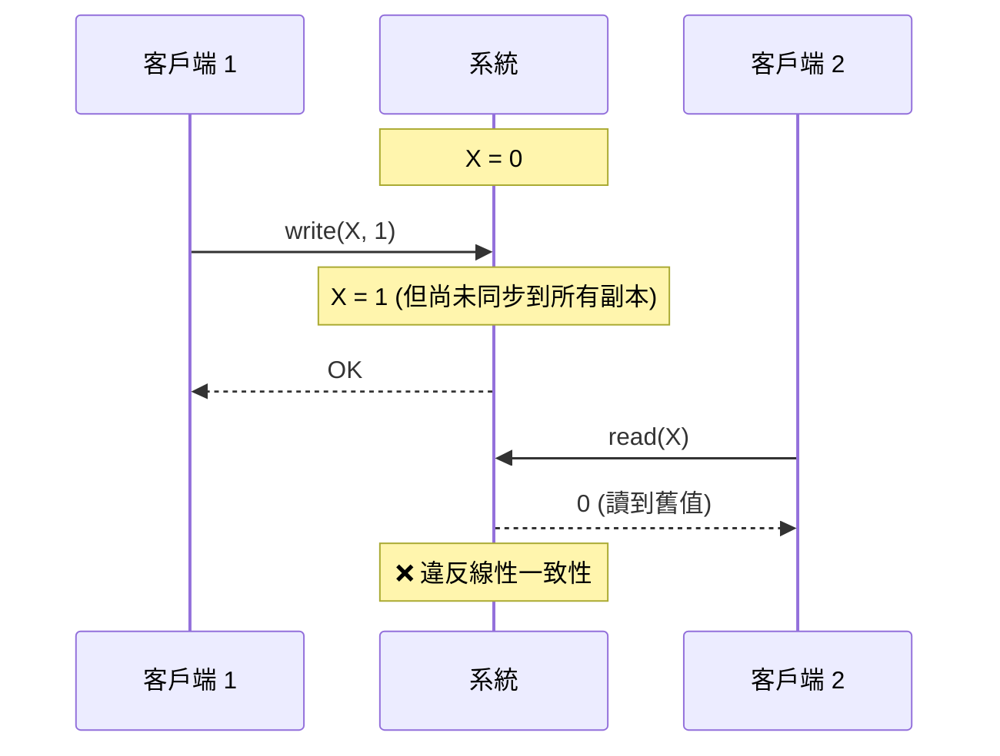

---

### 💻 實作範例: 檢測線性一致性

```python
class LinearizabilityChecker:
    """檢測操作歷史是否滿足線性一致性"""
    
    def __init__(self):
        self.history = []  # [(operation, start_time, end_time), ...]
    
    def add_operation(self, op_type, key, value, start_time, end_time):
        """記錄操作"""
        self.history.append({
            'type': op_type,  # 'read' or 'write'
            'key': key,
            'value': value,
            'start': start_time,
            'end': end_time
        })
    
    def check(self):
        """檢查是否線性一致"""
        # 嘗試找到一個合法的線性順序
        return self._find_linearization(self.history)
    
    def _find_linearization(self, history):
        """嘗試構造線性順序"""
        # 簡化實作: 檢查讀操作是否返回最近的寫入值
        state = {}  # {key: value}
        
        # 按操作結束時間排序
        sorted_history = sorted(history, key=lambda x: x['end'])
        
        for op in sorted_history:
            if op['type'] == 'write':
                state[op['key']] = op['value']
            elif op['type'] == 'read':
                # 檢查讀取的值是否是最新寫入的值
                expected = state.get(op['key'])
                if op['value'] != expected:
                    return False
        
        return True

# 使用範例
checker = LinearizabilityChecker()

# 場景 1: 線性一致
checker.add_operation('write', 'X', 1, start_time=0, end_time=1)
checker.add_operation('read', 'X', 1, start_time=2, end_time=3)
print(checker.check())  # True

# 場景 2: 非線性一致
checker2 = LinearizabilityChecker()
checker2.add_operation('write', 'X', 1, start_time=0, end_time=1)
checker2.add_operation('read', 'X', 0, start_time=2, end_time=3)  # 讀到舊值
print(checker2.check())  # False
```

---

### 線性一致性的代價

**問題**: 網路分區時無法保證線性一致性。

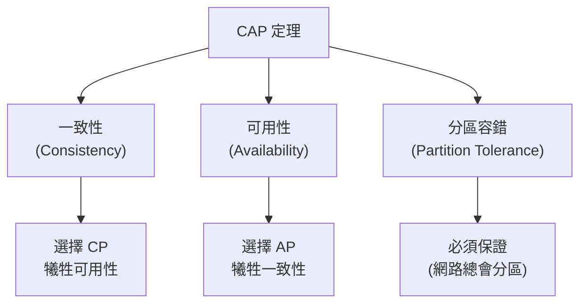

**範例: etcd 的 CP 選擇**

```python
# etcd 在網路分區時的行為
import etcd3

client = etcd3.client(host='etcd-node1')

try:
    # 如果當前節點與 Leader 失聯
    client.put('key', 'value')
except Exception as e:
    print("寫入失敗: 節點不在多數派") # ❌ 犧牲可用性保證一致性
```

**範例: Cassandra 的 AP 選擇**

```python
# Cassandra 在網路分區時的行為
from cassandra.cluster import Cluster

cluster = Cluster(['node1', 'node2'])
session = cluster.connect('keyspace')

# 即使網路分區,仍然可以寫入
session.execute(
    "INSERT INTO users (id, name) VALUES (1, 'Alice')"
)  # ✅ 保證可用性,但可能不一致
```

---

### 因果一致性 (Causal Consistency)

**定義**: 保證有因果關係的操作順序,但不保證無關操作的順序。

**因果關係範例**:

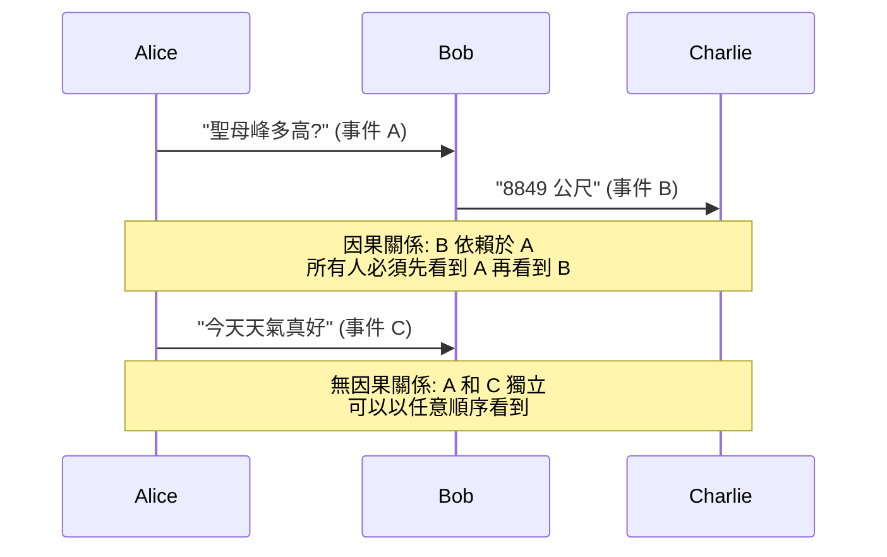

**向量時鐘 (Vector Clock)** 追蹤因果關係:

```python
class VectorClock:
    def __init__(self, node_id, num_nodes):
        self.node_id = node_id
        self.clock = [0] * num_nodes
    
    def increment(self):
        """本地事件,時鐘遞增"""
        self.clock[self.node_id] += 1
    
    def update(self, other_clock):
        """接收訊息,更新時鐘"""
        for i in range(len(self.clock)):
            self.clock[i] = max(self.clock[i], other_clock[i])
        self.increment()  # 接收也是一個事件
    
    def happens_before(self, other_clock):
        """判斷是否有因果關係: self -> other"""
        less_or_equal = all(self.clock[i] <= other_clock[i] for i in range(len(self.clock)))
        strictly_less = any(self.clock[i] < other_clock[i] for i in range(len(self.clock)))
        return less_or_equal and strictly_less
    
    def concurrent(self, other_clock):
        """判斷是否並發 (無因果關係)"""
        return not self.happens_before(other_clock) and not VectorClock.happens_before_static(other_clock, self.clock)
    
    @staticmethod
    def happens_before_static(clock1, clock2):
        less_or_equal = all(clock1[i] <= clock2[i] for i in range(len(clock1)))
        strictly_less = any(clock1[i] < clock2[i] for i in range(len(clock1)))
        return less_or_equal and strictly_less

# 使用範例 (3 個節點)
alice = VectorClock(node_id=0, num_nodes=3)
bob = VectorClock(node_id=1, num_nodes=3)
charlie = VectorClock(node_id=2, num_nodes=3)

# Alice 發送訊息
alice.increment()  # [1, 0, 0]

# Bob 接收訊息
bob.update(alice.clock)  # [1, 1, 0]

# Bob 發送回覆
bob.increment()  # [1, 2, 0]

# Charlie 接收 Bob 的訊息
charlie.update(bob.clock)  # [1, 2, 1]

# 檢查因果關係
print(alice.happens_before(charlie.clock))  # True (Alice -> Charlie)
```

---

## 🗳️ 共識算法

### 共識問題的形式化定義

**要求**:
1. **一致性 (Agreement)**: 所有節點決定相同的值
2. **合法性 (Validity)**: 決定的值必須是某個節點提議的值
3. **終止性 (Termination)**: 所有正常節點最終會做出決定

**不可能結果 (FLP Impossibility)**:
- 在異步網路中,即使只有一個節點可能故障,也**不存在**確定性共識算法
- 實務解決方案: 使用超時等啟發式方法,犧牲確定性

---

### Raft 共識算法

**設計目標**: 易於理解的共識算法。

**核心概念**:

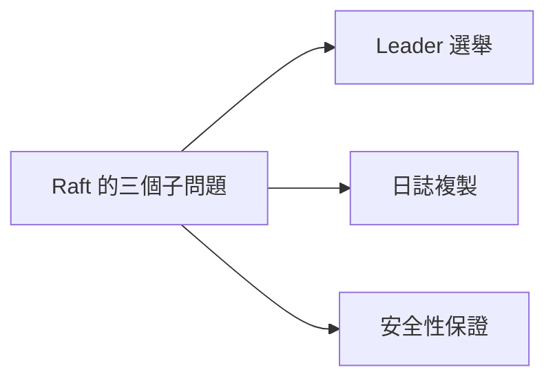

---

#### 1. Leader 選舉

**角色**:

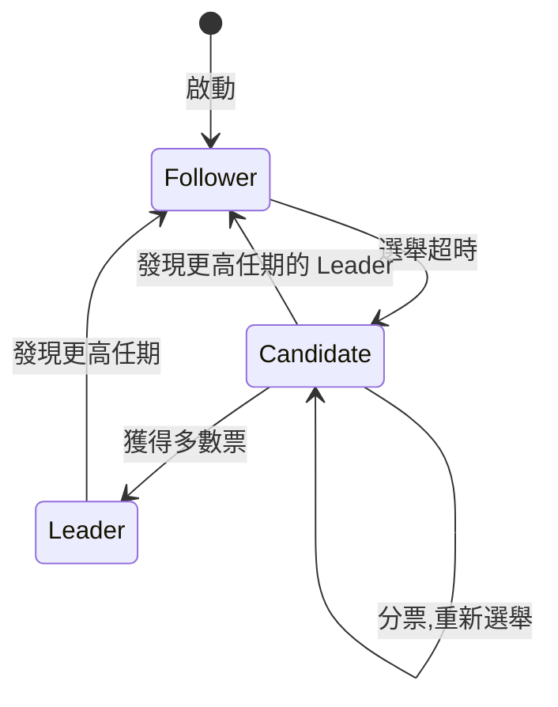

**選舉流程**:

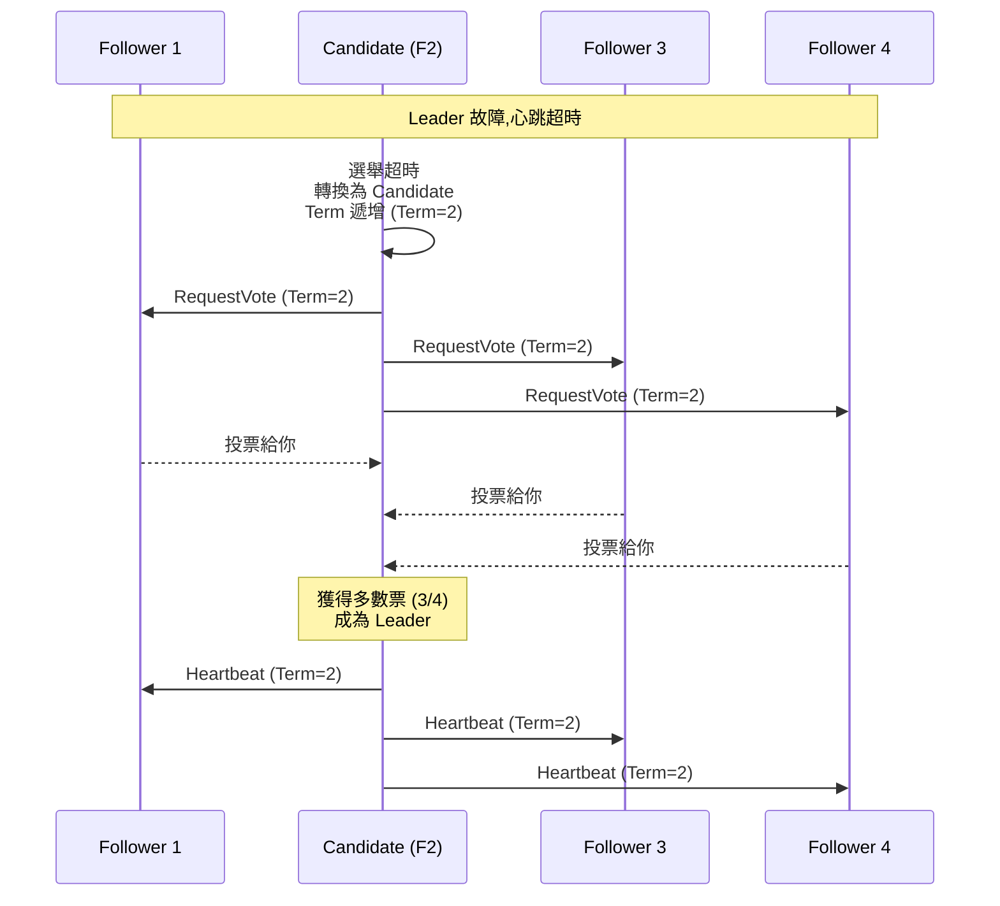

**💻 實作範例**:

```python
import time
import random
from enum import Enum

class Role(Enum):
    FOLLOWER = 1
    CANDIDATE = 2
    LEADER = 3

class RaftNode:
    def __init__(self, node_id, peers):
        self.node_id = node_id
        self.peers = peers  # 其他節點列表
        
        # 持久狀態
        self.current_term = 0
        self.voted_for = None
        self.log = []
        
        # 易失狀態
        self.role = Role.FOLLOWER
        self.leader_id = None
        
        # 選舉超時 (隨機 150-300ms)
        self.election_timeout = random.uniform(0.15, 0.3)
        self.last_heartbeat = time.time()
    
    def start_election(self):
        """發起選舉"""
        self.role = Role.CANDIDATE
        self.current_term += 1
        self.voted_for = self.node_id
        
        votes = 1  # 給自己投票
        
        # 向所有節點請求投票
        for peer in self.peers:
            response = peer.request_vote(
                term=self.current_term,
                candidate_id=self.node_id,
                last_log_index=len(self.log) - 1,
                last_log_term=self.log[-1]['term'] if self.log else 0
            )
            
            if response['vote_granted']:
                votes += 1
        
        # 檢查是否獲得多數票
        if votes > len(self.peers) / 2:
            self.become_leader()
    
    def request_vote(self, term, candidate_id, last_log_index, last_log_term):
        """處理投票請求"""
        # 如果對方任期更高,更新自己的任期
        if term > self.current_term:
            self.current_term = term
            self.voted_for = None
            self.role = Role.FOLLOWER
        
        # 投票條件:
        # 1. 當前任期內尚未投票,或已投票給該候選人
        # 2. 候選人的日誌至少與自己一樣新
        vote_granted = False
        
        if term >= self.current_term and (self.voted_for is None or self.voted_for == candidate_id):
            # 檢查日誌新舊 (簡化版)
            if last_log_index >= len(self.log) - 1:
                self.voted_for = candidate_id
                vote_granted = True
                self.last_heartbeat = time.time()  # 重置心跳
        
        return {'term': self.current_term, 'vote_granted': vote_granted}
    
    def become_leader(self):
        """成為 Leader"""
        self.role = Role.LEADER
        self.leader_id = self.node_id
        print(f"節點 {self.node_id} 成為 Leader (Term {self.current_term})")
        
        # 開始發送心跳
        self.send_heartbeats()
    
    def send_heartbeats(self):
        """發送心跳 (空的日誌複製請求)"""
        for peer in self.peers:
            peer.append_entries(
                term=self.current_term,
                leader_id=self.node_id,
                entries=[]
            )
    
    def append_entries(self, term, leader_id, entries):
        """處理日誌複製請求 (心跳)"""
        if term >= self.current_term:
            self.current_term = term
            self.role = Role.FOLLOWER
            self.leader_id = leader_id
            self.last_heartbeat = time.time()
        
        return {'term': self.current_term, 'success': True}
    
    def run(self):
        """主循環"""
        while True:
            if self.role == Role.FOLLOWER or self.role == Role.CANDIDATE:
                # 檢查選舉超時
                if time.time() - self.last_heartbeat > self.election_timeout:
                    self.start_election()
            
            elif self.role == Role.LEADER:
                # 定期發送心跳
                time.sleep(0.05)  # 50ms 心跳間隔
                self.send_heartbeats()
```

---

#### 2. 日誌複製

**流程**:

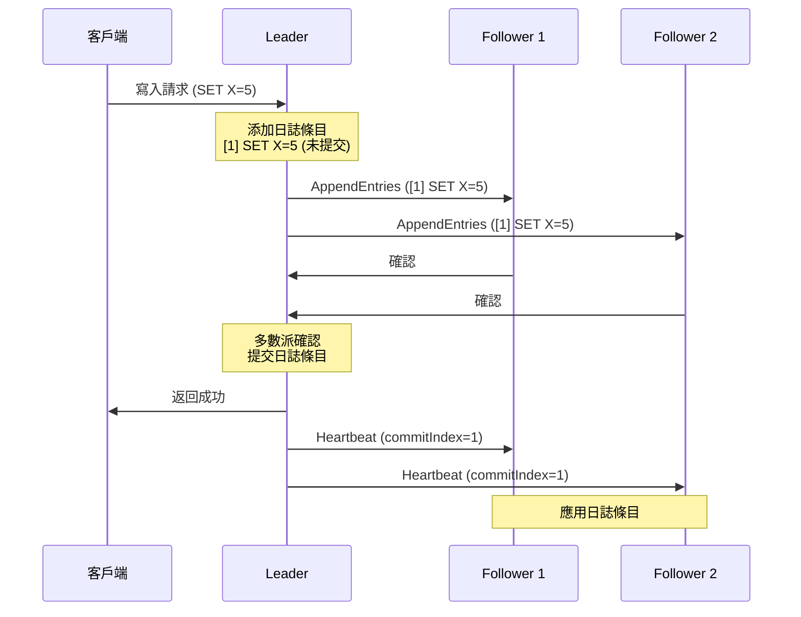

**日誌結構**:

```python
class LogEntry:
    def __init__(self, term, command):
        self.term = term        # 日誌條目的任期
        self.command = command  # 狀態機命令

class RaftLog:
    def __init__(self):
        self.entries = []       # 日誌條目列表
        self.commit_index = -1  # 已提交的最高索引
        self.last_applied = -1  # 已應用到狀態機的最高索引
    
    def append(self, term, command):
        """添加日誌條目"""
        entry = LogEntry(term, command)
        self.entries.append(entry)
        return len(self.entries) - 1
    
    def commit(self, index):
        """提交日誌條目"""
        self.commit_index = index
    
    def apply_to_state_machine(self, state_machine):
        """應用已提交但未應用的日誌"""
        while self.last_applied < self.commit_index:
            self.last_applied += 1
            entry = self.entries[self.last_applied]
            state_machine.apply(entry.command)

# Leader 的日誌複製邏輯
class RaftLeader:
    def replicate_log(self, command):
        """複製日誌到所有 Follower"""
        # 1. 添加到本地日誌
        index = self.log.append(self.current_term, command)
        
        # 2. 並行發送到所有 Follower
        ack_count = 1  # 自己的確認
        
        for peer in self.peers:
            response = peer.append_entries(
                term=self.current_term,
                leader_id=self.node_id,
                prev_log_index=index - 1,
                prev_log_term=self.log.entries[index - 1].term if index > 0 else 0,
                entries=[self.log.entries[index]],
                leader_commit=self.log.commit_index
            )
            
            if response['success']:
                ack_count += 1
        
        # 3. 如果獲得多數派確認,提交日誌
        if ack_count > len(self.peers) / 2:
            self.log.commit(index)
            return True
        
        return False
```

---

#### 3. 安全性保證

**Leader 完整性 (Leader Completeness)**:
- 如果日誌條目在某個任期被提交,則它會出現在所有更高任期的 Leader 日誌中

**實現方式**: 選舉限制

```python
def request_vote(self, term, candidate_id, last_log_index, last_log_term):
    """處理投票請求"""
    # 檢查候選人的日誌是否至少與自己一樣新
    my_last_index = len(self.log) - 1
    my_last_term = self.log[my_last_index].term if self.log else 0
    
    # 日誌"更新"的定義:
    # 1. 最後一條日誌的任期更大,或
    # 2. 任期相同但索引更大
    log_is_up_to_date = (
        last_log_term > my_last_term or
        (last_log_term == my_last_term and last_log_index >= my_last_index)
    )
    
    if not log_is_up_to_date:
        return {'vote_granted': False}
    
    # ... 其他投票邏輯
```

---

### Paxos 算法

**核心思想**: 分兩階段達成共識。

**角色**:
- **Proposer**: 提議者
- **Acceptor**: 接受者
- **Learner**: 學習者

**兩階段流程**:

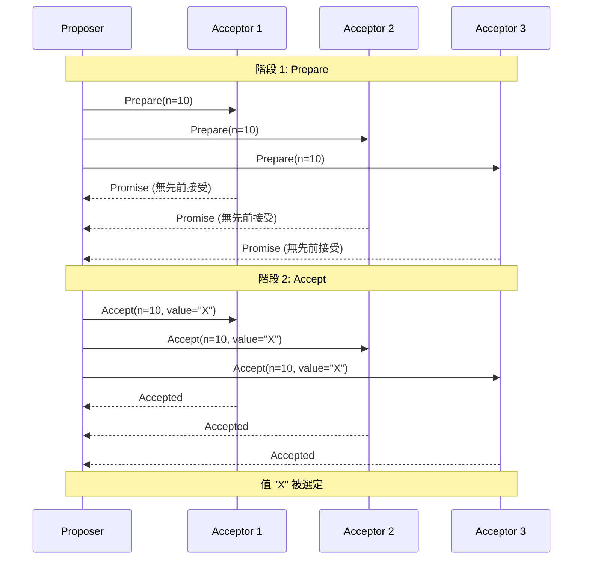

**Paxos vs Raft**:

| 特性 | Paxos | Raft |
|------|-------|------|
| **易理解性** | ❌ 複雜 | ✅ 簡單 |
| **實作複雜度** | ❌ 高 | ✅ 中等 |
| **效能** | ⚠️ 需優化 (Multi-Paxos) | ✅ 高效 |
| **工業應用** | Google Chubby, ZooKeeper (ZAB) | etcd, Consul, CockroachDB |

---

## 🔐 原子提交 (Atomic Commit)

### 兩階段提交 (2PC, Two-Phase Commit)

**使用場景**: 分散式事務,確保所有參與者一致提交或回滾。

**流程**:

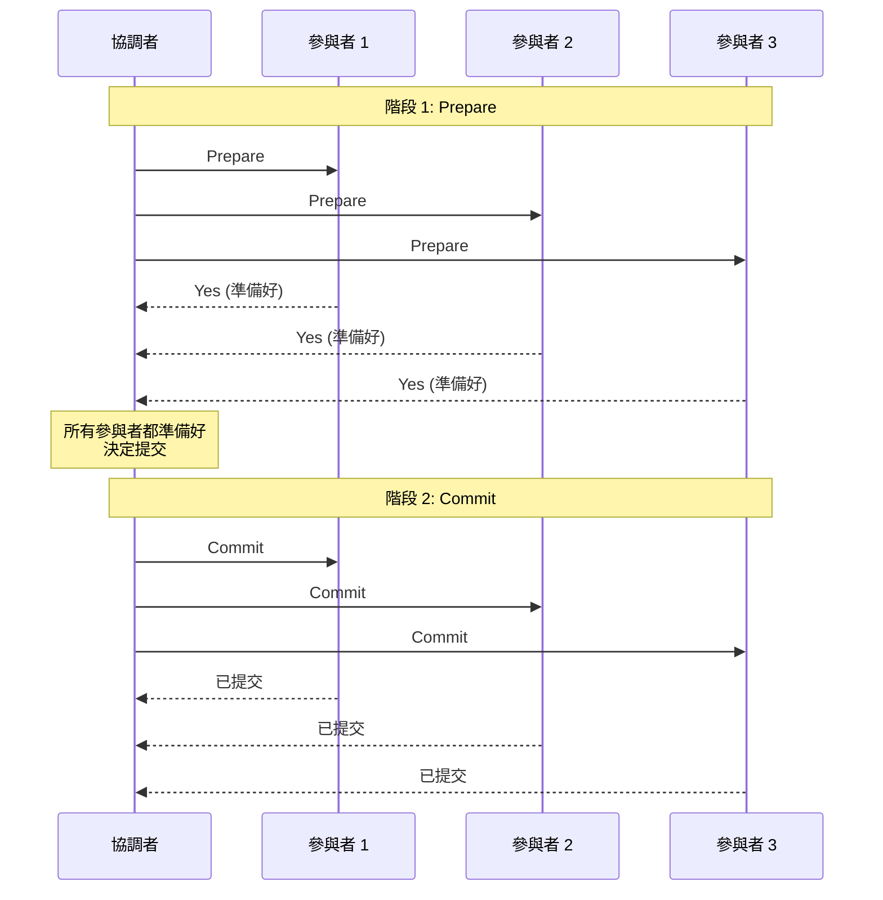

**失敗場景**:

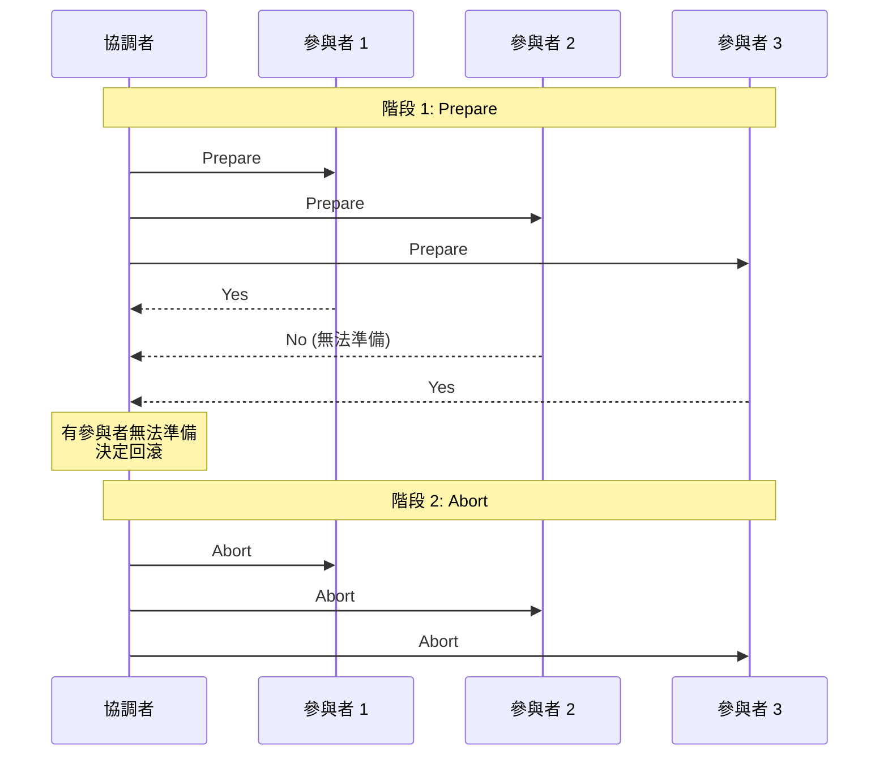

**💻 實作範例**:

```python
from enum import Enum

class Vote(Enum):
    YES = 1
    NO = 2

class Decision(Enum):
    COMMIT = 1
    ABORT = 2

class TwoPhaseCommitCoordinator:
    def __init__(self, participants):
        self.participants = participants
    
    def execute_transaction(self, transaction):
        """執行兩階段提交"""
        # 階段 1: Prepare
        votes = []
        for participant in self.participants:
            try:
                vote = participant.prepare(transaction)
                votes.append(vote)
            except Exception as e:
                print(f"參與者 {participant} 準備失敗: {e}")
                votes.append(Vote.NO)
        
        # 決策: 所有參與者都投 Yes 才提交
        decision = Decision.COMMIT if all(v == Vote.YES for v in votes) else Decision.ABORT
        
        # 階段 2: Commit 或 Abort
        for participant in self.participants:
            if decision == Decision.COMMIT:
                participant.commit(transaction)
            else:
                participant.abort(transaction)
        
        return decision

class Participant:
    def __init__(self, name):
        self.name = name
        self.prepared_transactions = {}
    
    def prepare(self, transaction):
        """準備事務"""
        try:
            # 檢查是否可以執行事務
            if self.can_execute(transaction):
                # 鎖住資源,寫入 undo log
                self.prepared_transactions[transaction.id] = transaction
                return Vote.YES
            else:
                return Vote.NO
        except Exception:
            return Vote.NO
    
    def commit(self, transaction):
        """提交事務"""
        # 應用變更,釋放鎖
        print(f"{self.name}: 提交事務 {transaction.id}")
        del self.prepared_transactions[transaction.id]
    
    def abort(self, transaction):
        """回滾事務"""
        # 根據 undo log 回滾,釋放鎖
        print(f"{self.name}: 回滾事務 {transaction.id}")
        if transaction.id in self.prepared_transactions:
            del self.prepared_transactions[transaction.id]
    
    def can_execute(self, transaction):
        """檢查是否可以執行"""
        # 簡化實作
        return True

# 使用範例
participants = [
    Participant("DB1"),
    Participant("DB2"),
    Participant("DB3")
]

coordinator = TwoPhaseCommitCoordinator(participants)

class Transaction:
    def __init__(self, txn_id):
        self.id = txn_id

txn = Transaction(txn_id=1)
decision = coordinator.execute_transaction(txn)
print(f"最終決策: {decision}")
```

**⚠️ 2PC 的問題**:

1. **阻塞**: 協調者故障時,參與者無限等待
2. **單點故障**: 協調者是單點
3. **性能**: 兩輪網路通信,延遲高

---

### 三階段提交 (3PC)

**改進**: 添加超時機制,避免無限阻塞。

**流程**:
1. **CanCommit**: 詢問是否可以提交
2. **PreCommit**: 通知參與者準備提交
3. **DoCommit**: 真正提交

**但仍有問題**: 網路分區時可能產生不一致。

---

## 🌍 真實世界案例

### 案例 1: Google Chubby (基於 Paxos)

**用途**: 分散式鎖服務

**架構**:
- 5 個副本 (容忍 2 個故障)
- 使用 Multi-Paxos 選舉 Master
- 客戶端只與 Master 通信

**性能**: 讀取延遲 < 10ms,寫入延遲 ~ 100ms

---

### 案例 2: etcd (基於 Raft)

**用途**: Kubernetes 的配置存儲

**特性**:
- 強一致性 (線性一致性)
- Watch API (監聽鍵變更)
- 租約 (Lease) 機制

**使用範例**:

```python
import etcd3

# 連接 etcd
client = etcd3.client(host='localhost', port=2379)

# 線性一致性寫入
client.put('config/database/host', 'localhost')

# 讀取
value, metadata = client.get('config/database/host')
print(value.decode())

# Watch 監聽變更
watch_id = client.add_watch_callback('config/', lambda event: print(event))

# 租約機制 (用於服務發現)
lease = client.lease(ttl=10)
client.put('services/api/instance1', 'http://api1:8080', lease=lease)
# 10 秒後自動過期
```

---

### 案例 3: Spanner (全球分散式資料庫)

**特性**:
- 跨資料中心的強一致性
- 外部一致性 (比線性一致性更強)
- 基於 TrueTime + Paxos

**核心技術**:
- **TrueTime API**: 提供時間區間 [earliest, latest]
- **Commit Wait**: 等待時間區間過去後才返回,保證外部一致性

```python
# 偽代碼: Spanner 的 Commit Wait
def commit_transaction(txn):
    # 獲取提交時間戳
    commit_timestamp = TrueTime.now().latest
    
    # 等待到該時間戳 (確保其他人讀到的時間不會早於此)
    wait_until(TrueTime.now().earliest >= commit_timestamp)
    
    # 返回成功
    return commit_timestamp
```

---

## 🤔 深入思考

### 練習 1: 分析一致性需求

給定以下場景,選擇合適的一致性模型:

**場景 A**: 社交媒體的貼文發布
- 用戶發布貼文後,刷新頁面應該看到

**場景 B**: 銀行轉帳
- 扣款後,立即查詢餘額應該反映變更

**場景 C**: DNS 更新
- 更新 DNS 記錄,允許一段時間後生效

<details>
<summary>💡 參考答案</summary>

**場景 A: Read-Your-Writes 一致性**
- 不需要全局線性一致性
- 只需保證用戶自己能讀到自己的寫入

```python
class ReadYourWritesSession:
    def __init__(self, user_id):
        self.user_id = user_id
        self.last_write_version = None
    
    def write(self, post):
        version = db.write(post)
        self.last_write_version = version
    
    def read(self):
        # 讀取時要求至少看到自己最後的寫入
        return db.read(min_version=self.last_write_version)
```

**場景 B: 線性一致性**
- 金融數據要求強一致性
- 必須使用線性一致性

```python
# 使用支持線性一致性的資料庫
# 如 etcd, Spanner, CockroachDB
```

**場景 C: 最終一致性**
- DNS 本身設計為最終一致
- TTL 機制允許延遲

```python
# DNS 更新
update_dns_record('example.com', 'new-ip', ttl=3600)
# 1 小時內逐漸生效
```

</details>

---

### 練習 2: 設計分散式鎖

**需求**:
- 互斥: 同時只有一個客戶端持有鎖
- 死鎖自由: 持鎖者崩潰後,鎖自動釋放
- 容錯: 容忍節點故障

**嘗試設計一個方案**。

<details>
<summary>💡 參考答案</summary>

**方案: 基於 etcd 的分散式鎖 + Fencing Token**

```python
import etcd3
import time
import uuid

class DistributedLock:
    def __init__(self, etcd_client, lock_name, ttl=10):
        self.client = etcd_client
        self.lock_name = f"/locks/{lock_name}"
        self.ttl = ttl
        self.lease = None
        self.lock_id = None
    
    def acquire(self):
        """獲取鎖"""
        # 創建租約
        self.lease = self.client.lease(ttl=self.ttl)
        self.lock_id = str(uuid.uuid4())
        
        # 嘗試獲取鎖 (使用事務保證原子性)
        success, responses = self.client.transaction(
            compare=[
                # 檢查鎖是否存在
                self.client.transactions.create(self.lock_name) == 0
            ],
            success=[
                # 不存在則創建
                self.client.transactions.put(
                    self.lock_name,
                    self.lock_id,
                    lease=self.lease
                )
            ],
            failure=[]
        )
        
        if success:
            # 獲取鎖的版本號作為 Fencing Token
            _, metadata = self.client.get(self.lock_name)
            return metadata.mod_revision
        else:
            return None
    
    def release(self):
        """釋放鎖"""
        # 只釋放自己持有的鎖
        self.client.transaction(
            compare=[
                self.client.transactions.value(self.lock_name) == self.lock_id.encode()
            ],
            success=[
                self.client.transactions.delete(self.lock_name)
            ],
            failure=[]
        )
        
        # 撤銷租約
        if self.lease:
            self.lease.revoke()
    
    def keep_alive(self):
        """保持鎖活躍"""
        if self.lease:
            self.lease.refresh()

# 使用範例
client = etcd3.client()
lock = DistributedLock(client, "my-resource")

token = lock.acquire()
if token:
    try:
        print(f"獲取鎖成功,令牌: {token}")
        
        # 執行關鍵操作 (傳遞令牌)
        perform_critical_operation(token=token)
        
    finally:
        lock.release()
else:
    print("獲取鎖失敗")
```

**特性**:
- ✅ 互斥: etcd 事務保證
- ✅ 死鎖自由: 租約自動過期
- ✅ 容錯: etcd 使用 Raft 保證高可用
- ✅ Fencing: 使用版本號防止過期鎖

</details>

---

## 📚 總結

### 核心要點

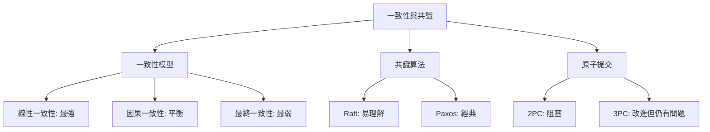

### 選擇指南

| 如果你需要... | 選擇... |
|---------------|---------|
| 強一致性 + 高可用 | Raft/Paxos + 多數派 |
| 全球分佈 + 強一致 | Spanner (TrueTime) |
| 低延遲 + 高可用 | 最終一致性 (Dynamo 風格) |
| 分散式鎖 | etcd (Raft) 或 Chubby (Paxos) |
| 分散式事務 | 避免或使用 Saga 模式 |

---

## 🔗 參考資料

1. **書籍**:
   - Martin Kleppmann, *Designing Data-Intensive Applications*, Chapter 9
   - Diego Ongaro, *In Search of an Understandable Consensus Algorithm (Raft)*

2. **論文**:
   - [Paxos Made Simple](https://lamport.azurewebsites.net/pubs/paxos-simple.pdf)
   - [The Raft Consensus Algorithm](https://raft.github.io/raft.pdf)
   - [Spanner: Google's Globally-Distributed Database](https://research.google/pubs/pub39966/)

3. **技術文件**:
   - [etcd Documentation](https://etcd.io/docs/)
   - [Consul Consensus Protocol](https://www.consul.io/docs/architecture/consensus)

4. **可視化工具**:
   - [Raft Visualization](http://thesecretlivesofdata.com/raft/)
   - [Paxos Visualization](https://harry.me/blog/2014/12/27/neat-algorithms-paxos/)
