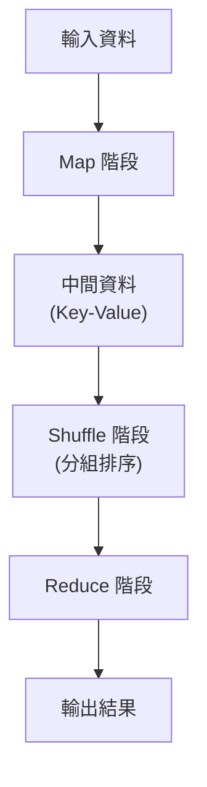
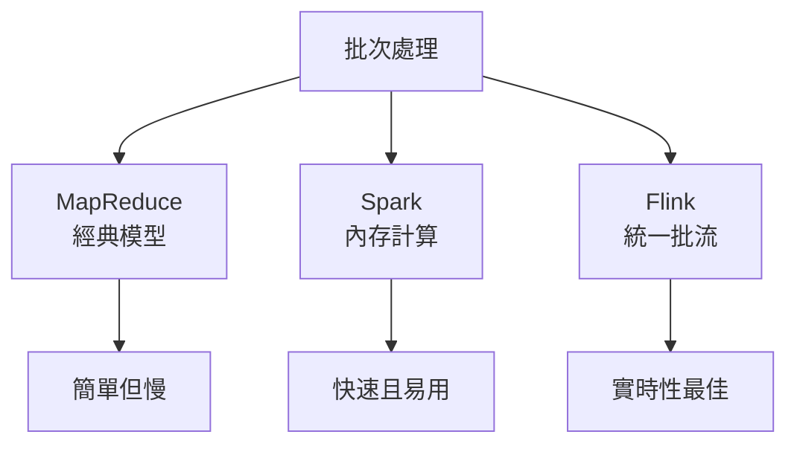

# 09 - 批次處理 (Batch Processing)

## 🎯 學習目標

完成本章後,你將能夠:
- 理解批次處理的概念與應用場景
- 掌握 MapReduce 編程模型
- 理解現代資料流引擎的設計
- 選擇合適的批次處理框架

---

## 💡 核心概念

### 什麼是批次處理?

**批次處理 (Batch Processing)**: 定期處理大量累積的資料,通常以小時、天為單位。


**特性**:
- **延遲**: 分鐘到小時級別
- **吞吐量**: 極高 (TB/PB 級資料)
- **容錯**: 失敗可重試

**vs 串流處理**:

| 特性 | 批次處理 | 串流處理 |
|------|---------|---------|
| **延遲** | 高 (小時) | 低 (秒/毫秒) |
| **資料量** | 大 (TB/PB) | 小 (持續流入) |
| **使用場景** | 離線分析、訓練模型 | 實時監控、即時推薦 |

---

## 📊 MapReduce 編程模型

### 基本概念

**MapReduce**: Google 提出的分散式計算模型,將計算分為 Map 和 Reduce 兩個階段。



### 💻 Word Count 範例

**問題**: 統計文本中每個單詞的出現次數。

**Python 實作**:

```python
from collections import defaultdict
from typing import Iterator, Tuple

def map_function(document: str) -> Iterator[Tuple[str, int]]:
    """Map: 拆分文檔,發出 (word, 1)"""
    words = document.lower().split()
    for word in words:
        yield (word, 1)

def reduce_function(word: str, counts: Iterator[int]) -> Tuple[str, int]:
    """Reduce: 累加相同單詞的計數"""
    return (word, sum(counts))

# 範例執行
documents = [
    "hello world",
    "hello hadoop",
    "hello mapreduce"
]

# Map 階段
intermediate = []
for doc in documents:
    for key_value in map_function(doc):
        intermediate.append(key_value)

print("Map 輸出:", intermediate)
# [('hello', 1), ('world', 1), ('hello', 1), ('hadoop', 1), ('hello', 1), ('mapreduce', 1)]

# Shuffle 階段: 按 Key 分組
grouped = defaultdict(list)
for key, value in intermediate:
    grouped[key].append(value)

# Reduce 階段
results = []
for word, counts in grouped.items():
    results.append(reduce_function(word, counts))

print("最終結果:", dict(results))
# {'hello': 3, 'world': 1, 'hadoop': 1, 'mapreduce': 1}
```

### Hadoop MapReduce 實作

```python
# Hadoop Streaming 範例: mapper.py
import sys

for line in sys.stdin:
    words = line.strip().split()
    for word in words:
        print(f"{word}\t1")

# reducer.py
import sys
from collections import defaultdict

current_word = None
current_count = 0

for line in sys.stdin:
    word, count = line.strip().split('\t')
    count = int(count)
    
    if word == current_word:
        current_count += count
    else:
        if current_word:
            print(f"{current_word}\t{current_count}")
        current_word = word
        current_count = count

if current_word:
    print(f"{current_word}\t{current_count}")

# 執行
# hadoop jar hadoop-streaming.jar \
#   -input /input/data.txt \
#   -output /output/ \
#   -mapper mapper.py \
#   -reducer reducer.py
```

---

## 🔗 Join 操作

### Sort-Merge Join

**場景**: 關聯兩個大型資料集。

```python
# 使用者資料
users = [
    {"user_id": 1, "name": "Alice"},
    {"user_id": 2, "name": "Bob"}
]

# 訂單資料
orders = [
    {"order_id": 101, "user_id": 1, "amount": 50},
    {"order_id": 102, "user_id": 2, "amount": 30},
    {"order_id": 103, "user_id": 1, "amount": 70}
]

# Map 階段: 標記資料來源
def map_users(user):
    return (user['user_id'], ('user', user))

def map_orders(order):
    return (order['user_id'], ('order', order))

# Shuffle: 按 user_id 分組
# {1: [('user', {...}), ('order', {...}), ('order', {...})],
#  2: [('user', {...}), ('order', {...})]}

# Reduce: Join
def reduce_join(user_id, records):
    user_data = None
    orders_data = []
    
    for source, record in records:
        if source == 'user':
            user_data = record
        else:
            orders_data.append(record)
    
    # 輸出關聯結果
    for order in orders_data:
        yield {
            'user_id': user_id,
            'user_name': user_data['name'],
            'order_id': order['order_id'],
            'amount': order['amount']
        }
```

### Broadcast Join

**優化**: 當一個資料集很小時,可以廣播到所有節點。

```python
# PySpark 範例
from pyspark.sql import SparkSession

spark = SparkSession.builder.appName("BroadcastJoin").getOrCreate()

# 大表
orders = spark.read.parquet("/data/orders")

# 小表 (可以放入內存)
users = spark.read.parquet("/data/users")

# 廣播 Join
from pyspark.sql.functions import broadcast

result = orders.join(broadcast(users), "user_id")
```

---

## 🚀 現代批次處理框架

### Apache Spark

**特點**:
- 內存計算,比 Hadoop 快 10-100 倍
- 支持 SQL、ML、圖計算
- 惰性求值 (Lazy Evaluation)

**範例: 日誌分析**:

```python
from pyspark.sql import SparkSession
from pyspark.sql.functions import col, count, hour

spark = SparkSession.builder.appName("LogAnalysis").getOrCreate()

# 讀取日誌
logs = spark.read.json("/logs/access.log")

# 統計每小時的請求數
hourly_stats = (
    logs
    .withColumn("hour", hour(col("timestamp")))
    .groupBy("hour")
    .agg(count("*").alias("request_count"))
    .orderBy("hour")
)

hourly_stats.show()

# +----+-------------+
# |hour|request_count|
# +----+-------------+
# |   0|        1250 |
# |   1|         980 |
# ...
```

**DataFrame vs RDD**:

```python
# RDD (低階 API)
rdd = spark.sparkContext.textFile("/data/users.csv")
result = (
    rdd
    .map(lambda line: line.split(','))
    .filter(lambda fields: int(fields[2]) > 18)
    .count()
)

# DataFrame (高階 API, 推薦)
df = spark.read.csv("/data/users.csv", header=True)
result = df.filter(col("age") > 18).count()
```

---

### Apache Flink

**特點**:
- 統一批次和串流處理
- 真正的串流處理引擎 (非微批次)
- 狀態管理與 Exactly-Once 語義

**範例**:

```python
from pyflink.datastream import StreamExecutionEnvironment
from pyflink.table import StreamTableEnvironment

# 環境設置
env = StreamExecutionEnvironment.get_execution_environment()
table_env = StreamTableEnvironment.create(env)

# 定義表
table_env.execute_sql("""
    CREATE TABLE orders (
        order_id BIGINT,
        user_id BIGINT,
        amount DECIMAL(10, 2),
        order_time TIMESTAMP(3)
    ) WITH (
        'connector' = 'kafka',
        'topic' = 'orders',
        'properties.bootstrap.servers' = 'localhost:9092'
    )
""")

# 查詢
result = table_env.sql_query("""
    SELECT 
        user_id,
        COUNT(*) as order_count,
        SUM(amount) as total_amount
    FROM orders
    WHERE order_time > CURRENT_TIMESTAMP - INTERVAL '1' HOUR
    GROUP BY user_id
""")

result.execute().print()
```

---

## 🏢 真實世界案例

### 案例 1: Netflix 推薦系統

**批次處理部分**:
- 每天處理數百 TB 的觀看日誌
- 使用 Spark 計算用戶相似度
- 訓練機器學習模型

**架構**:


---

### 案例 2: Uber 資料湖

**技術棧**:
- **存儲**: HDFS / S3
- **計算**: Spark / Presto
- **調度**: Airflow
- **目錄**: Hive Metastore

**ETL 流程**:

```python
from airflow import DAG
from airflow.operators.spark_submit_operator import SparkSubmitOperator
from datetime import datetime, timedelta

default_args = {
    'owner': 'data-team',
    'depends_on_past': False,
    'start_date': datetime(2024, 1, 1),
    'retries': 3,
    'retry_delay': timedelta(minutes=5)
}

dag = DAG(
    'trip_analytics',
    default_args=default_args,
    schedule_interval='@daily'
)

# 任務 1: 提取原始資料
extract = SparkSubmitOperator(
    task_id='extract_trips',
    application='/jobs/extract_trips.py',
    dag=dag
)

# 任務 2: 轉換
transform = SparkSubmitOperator(
    task_id='transform_trips',
    application='/jobs/transform_trips.py',
    dag=dag
)

# 任務 3: 加載到資料倉儲
load = SparkSubmitOperator(
    task_id='load_to_warehouse',
    application='/jobs/load_trips.py',
    dag=dag
)

extract >> transform >> load
```

---

## 📚 總結

### 核心要點



### 選擇指南

| 場景 | 推薦框架 |
|------|---------|
| 簡單 ETL | Spark |
| 複雜分析 | Spark + SQL |
| 實時 + 批次 | Flink |
| 超大規模 | Spark / Hadoop |

---

## 🔗 參考資料

1. **書籍**:
   - Martin Kleppmann, *Designing Data-Intensive Applications*, Chapter 10
   - *Hadoop: The Definitive Guide*

2. **論文**:
   - [MapReduce: Simplified Data Processing on Large Clusters](https://research.google/pubs/pub62/)
   - [Spark: Cluster Computing with Working Sets](https://www.usenix.org/legacy/event/hotcloud10/tech/full_papers/Zaharia.pdf)

3. **文件**:
   - [Apache Spark Documentation](https://spark.apache.org/docs/latest/)
   - [Apache Flink Documentation](https://flink.apache.org/docs/stable/)
