# 10 - 串流處理 (Stream Processing)

## 🎯 學習目標

完成本章後,你將能夠:
- 理解串流處理與批次處理的差異
- 掌握事件驅動架構的設計
- 理解視窗 (Window) 操作與時間語義
- 實作容錯的串流處理應用

---

## 💡 核心概念

### 什麼是串流處理?

**串流處理 (Stream Processing)**: 持續處理無界的事件流,低延遲輸出結果。

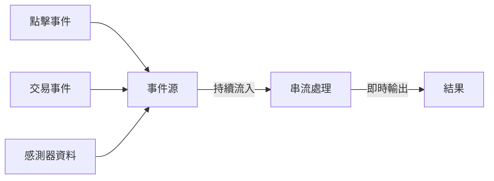

**特性**:
- **無界資料**: 永不結束的事件流
- **低延遲**: 毫秒到秒級
- **增量計算**: 逐個處理事件

---

## 📨 訊息傳遞語義

### 三種保證級別

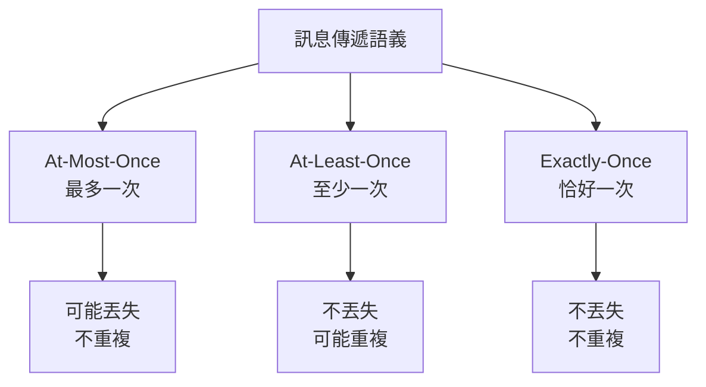

### 💻 實作範例

**At-Least-Once with Idempotency**:

```python
import hashlib

class IdempotentProcessor:
    def __init__(self):
        self.processed_ids = set()
    
    def process_event(self, event):
        # 生成事件指紋
        event_id = hashlib.md5(
            str(event).encode()
        ).hexdigest()
        
        # 檢查是否已處理
        if event_id in self.processed_ids:
            print(f"跳過重複事件: {event_id}")
            return
        
        # 處理事件
        self.do_processing(event)
        
        # 標記已處理
        self.processed_ids.add(event_id)
    
    def do_processing(self, event):
        print(f"處理事件: {event}")
```

---

## ⏰ 時間語義

### Event Time vs Processing Time

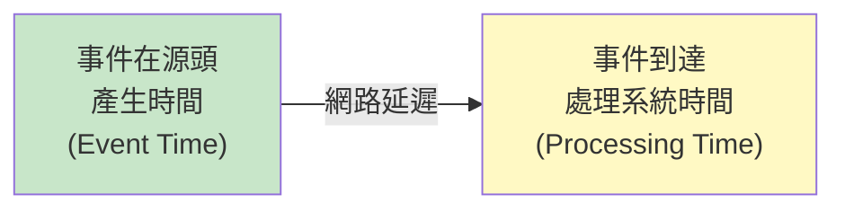

**問題: 亂序與延遲**

```python
# 事件流 (實際到達順序)
events = [
    {"user": "Alice", "event_time": 100, "processing_time": 105},
    {"user": "Bob",   "event_time": 102, "processing_time": 103},  # 亂序!
    {"user": "Alice", "event_time": 101, "processing_time": 108}   # 延遲
]

# 如果按 processing_time 統計,會漏計延遲事件
# 必須使用 event_time + Watermark
```

### Watermark 機制

**Watermark**: 表示"早於此時間戳的事件已全部到達"。

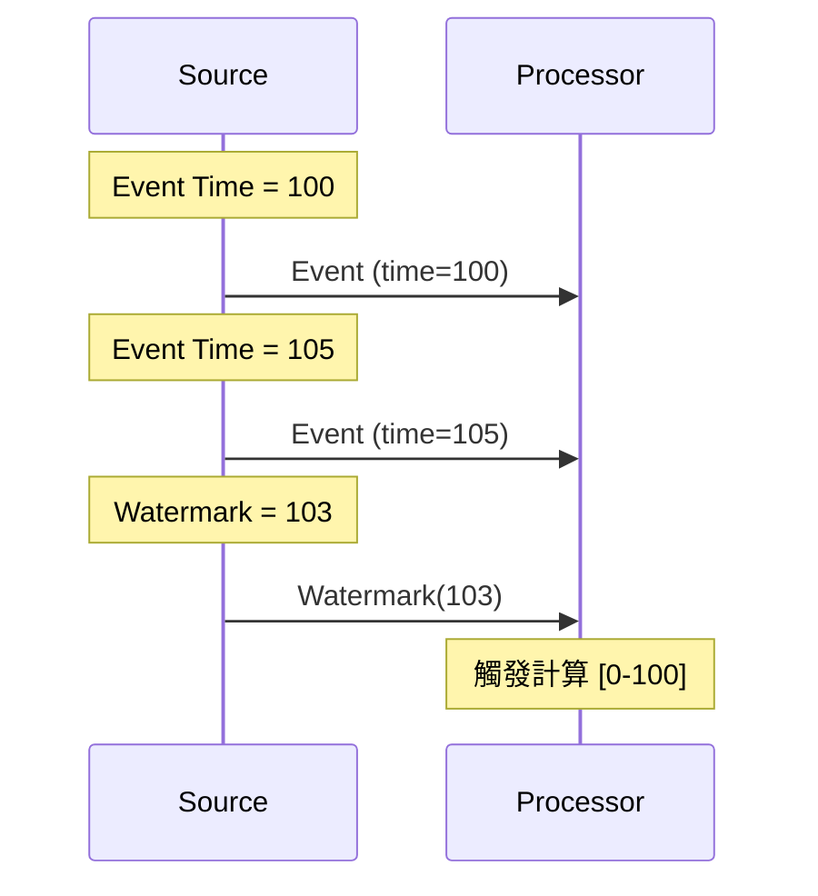

**Apache Flink 實作**:

```python
from pyflink.datastream import StreamExecutionEnvironment
from pyflink.common import WatermarkStrategy, Duration

env = StreamExecutionEnvironment.get_execution_environment()

# 定義 Watermark 策略
watermark_strategy = (
    WatermarkStrategy
    .for_bounded_out_of_orderness(Duration.of_seconds(5))  # 容忍 5 秒亂序
    .with_timestamp_assigner(lambda event, timestamp: event['event_time'])
)

stream = env.from_collection([...])
stream = stream.assign_timestamps_and_watermarks(watermark_strategy)
```

---

## 🪟 視窗操作 (Windowing)

### 視窗類型

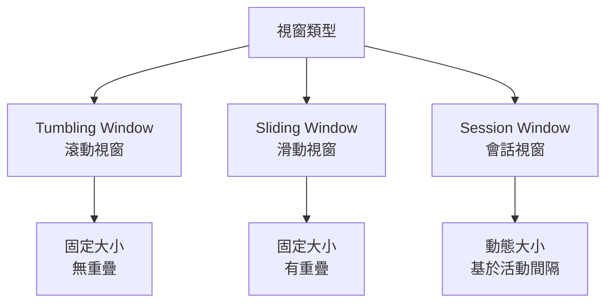

### 滾動視窗 (Tumbling Window)

```python
# Kafka Streams 範例
from kafka import KafkaConsumer
from collections import defaultdict
import time

def tumbling_window_count(stream, window_size=60):
    """每 60 秒統計一次"""
    window_start = int(time.time() / window_size) * window_size
    counts = defaultdict(int)
    
    for event in stream:
        event_window = int(event['timestamp'] / window_size) * window_size
        
        if event_window > window_start:
            # 輸出當前視窗結果
            print(f"Window [{window_start}-{window_start + window_size}]: {dict(counts)}")
            
            # 開始新視窗
            window_start = event_window
            counts.clear()
        
        counts[event['user']] += 1

# Flink SQL 範例
"""
SELECT 
    user_id,
    COUNT(*) as event_count,
    TUMBLE_START(event_time, INTERVAL '1' MINUTE) as window_start
FROM events
GROUP BY user_id, TUMBLE(event_time, INTERVAL '1' MINUTE)
"""
```

### 滑動視窗 (Sliding Window)

```python
# 過去 5 分鐘內,每分鐘更新一次的統計
"""
SELECT 
    user_id,
    COUNT(*) as event_count,
    HOP_START(event_time, INTERVAL '1' MINUTE, INTERVAL '5' MINUTE) as window_start
FROM events
GROUP BY user_id, HOP(event_time, INTERVAL '1' MINUTE, INTERVAL '5' MINUTE)
"""
```

### 會話視窗 (Session Window)

```python
# 用戶活動超過 30 分鐘無動作則結束會話
"""
SELECT 
    user_id,
    COUNT(*) as event_count,
    SESSION_START(event_time, INTERVAL '30' MINUTE) as session_start,
    SESSION_END(event_time, INTERVAL '30' MINUTE) as session_end
FROM events
GROUP BY user_id, SESSION(event_time, INTERVAL '30' MINUTE)
"""
```

---

## 📊 狀態管理

### 有狀態處理範例

```python
class StatefulCounter:
    def __init__(self):
        self.state = {}  # {key: count}
    
    def process(self, key, value):
        """累加計數"""
        if key not in self.state:
            self.state[key] = 0
        
        self.state[key] += value
        return self.state[key]

# Apache Flink Managed State
from pyflink.datastream import StreamExecutionEnvironment
from pyflink.datastream.state import ValueStateDescriptor

class CountFunction(KeyedProcessFunction):
    def __init__(self):
        self.count_state = None
    
    def open(self, runtime_context):
        # 註冊狀態
        descriptor = ValueStateDescriptor("count", Types.LONG())
        self.count_state = runtime_context.get_state(descriptor)
    
    def process_element(self, value, ctx):
        # 讀取狀態
        current_count = self.count_state.value()
        if current_count is None:
            current_count = 0
        
        # 更新狀態
        current_count += 1
        self.count_state.update(current_count)
        
        yield (value, current_count)
```

### Checkpoint 機制

**目的**: 實現 Exactly-Once 語義。

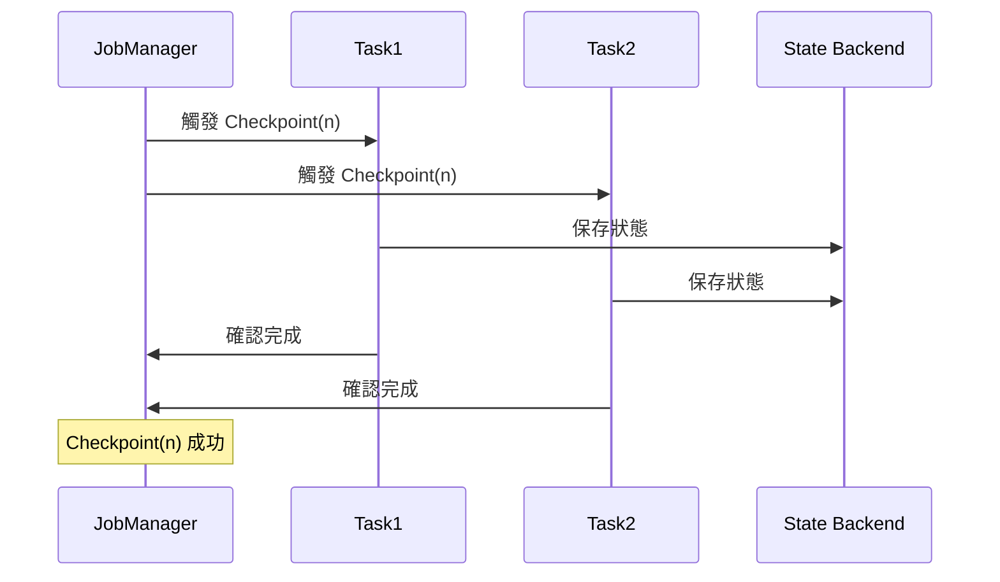

---

## 🔄 變更資料捕獲 (CDC)

### 什麼是 CDC?

**CDC (Change Data Capture)**: 捕獲資料庫的變更事件,發送到串流處理系統。

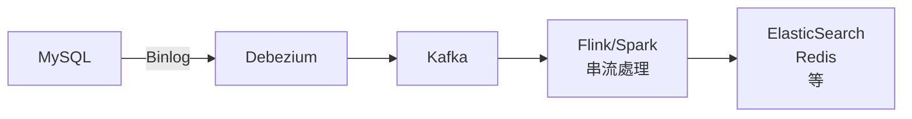

### 💻 Debezium 範例

```json
// MySQL 變更事件
{
  "before": {
    "id": 1,
    "name": "Alice",
    "balance": 100
  },
  "after": {
    "id": 1,
    "name": "Alice",
    "balance": 150
  },
  "op": "u",  // update
  "ts_ms": 1609459200000
}
```

**處理 CDC 事件**:

```python
def process_cdc_event(event):
    op = event['op']
    
    if op == 'c':  # create
        insert_to_cache(event['after'])
    elif op == 'u':  # update
        update_cache(event['after'])
    elif op == 'd':  # delete
        delete_from_cache(event['before']['id'])
```

---

## 🏢 真實世界案例

### 案例 1: LinkedIn 的 Kafka + Samza

**架構**:

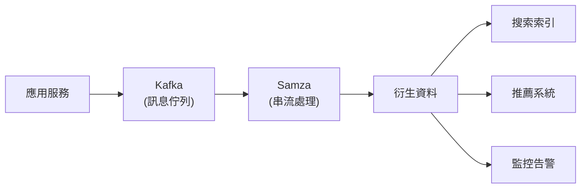

**使用場景**:
- 實時推薦
- 新聞 Feed 生成
- 監控告警

---

### 案例 2: Uber 的實時定價

**需求**:
- 根據供需實時調整價格
- 延遲 < 1 秒

**技術棧**:
- Kafka: 事件流
- Flink: 串流處理
- Redis: 狀態存儲

**流程**:

```python
# 偽代碼
def calculate_surge_pricing(region, time_window):
    # 統計該區域的供需
    demand = count_ride_requests(region, time_window)
    supply = count_available_drivers(region, time_window)
    
    # 計算倍數
    if supply == 0:
        surge_multiplier = 2.0
    else:
        ratio = demand / supply
        surge_multiplier = min(1.0 + ratio * 0.5, 3.0)
    
    return surge_multiplier
```

---

### 案例 3: Netflix 的實時異常檢測

**監控指標**:
- 視頻播放失敗率
- API 延遲
- 錯誤率

**Apache Flink 實作**:

```python
from pyflink.datastream import StreamExecutionEnvironment
from pyflink.datastream.window import TumblingEventTimeWindows
from pyflink.common import Time

env = StreamExecutionEnvironment.get_execution_environment()

# 讀取事件流
events = env.add_source(KafkaSource(...))

# 計算每分鐘的錯誤率
error_rate = (
    events
    .key_by(lambda e: e['service'])
    .window(TumblingEventTimeWindows.of(Time.minutes(1)))
    .apply(lambda key, window, events: {
        'service': key,
        'error_rate': sum(1 for e in events if e['status'] == 'error') / len(events),
        'window': window
    })
)

# 檢測異常
alerts = error_rate.filter(lambda e: e['error_rate'] > 0.05)

# 發送告警
alerts.add_sink(AlertSink())
```

---

## 🤔 Lambda vs Kappa 架構

### Lambda 架構

**設計**: 批次層 + 速度層 + 服務層

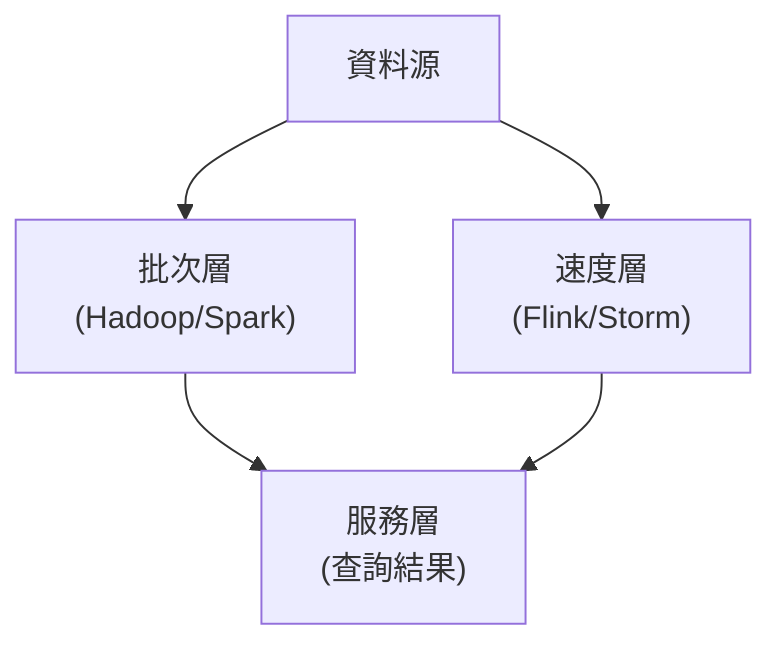

**優點**: 批次層提供完整準確的結果
**缺點**: 維護兩套程式碼

---

### Kappa 架構

**設計**: 只有串流層

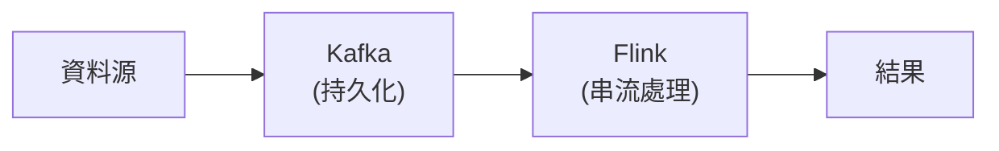

**優點**: 程式碼簡化
**缺點**: 需要支持重新處理歷史資料

---

## 📚 總結

### 核心要點

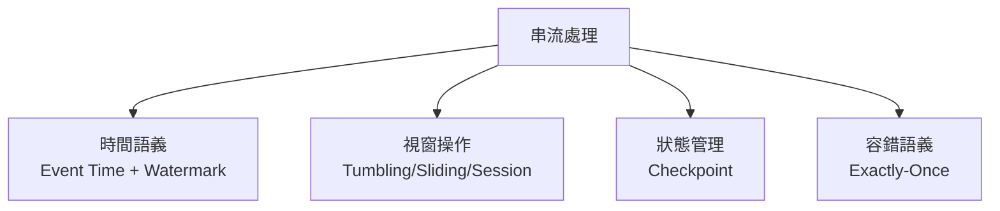

### 選擇指南

| 需求 | 推薦方案 |
|------|---------|
| 實時監控 | Kafka + Flink |
| 實時推薦 | Kafka + Spark Streaming |
| CDC 同步 | Debezium + Kafka |
| 複雜事件處理 | Flink CEP |

---

## 🔗 參考資料

1. **書籍**:
   - Martin Kleppmann, *Designing Data-Intensive Applications*, Chapter 11
   - *Streaming Systems* by Tyler Akidau

2. **論文**:
   - [The Dataflow Model](https://research.google/pubs/pub43864/)
   - [Kafka: a Distributed Messaging System](https://notes.stephenholiday.com/Kafka.pdf)

3. **文件**:
   - [Apache Flink Documentation](https://flink.apache.org/)
   - [Kafka Streams](https://kafka.apache.org/documentation/streams/)
