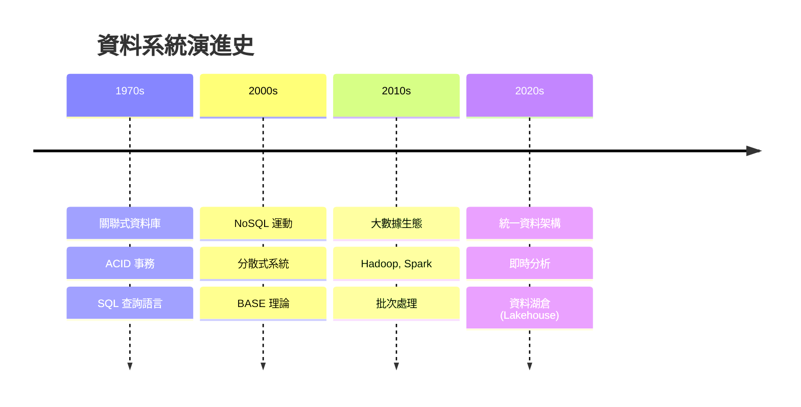
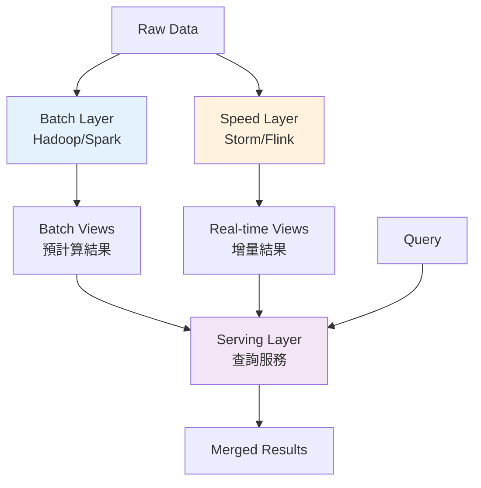
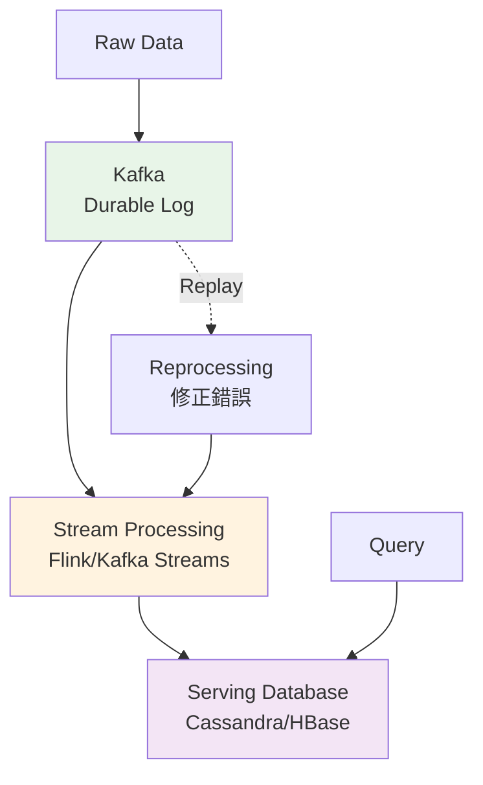
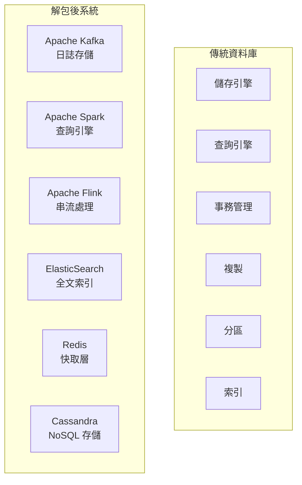
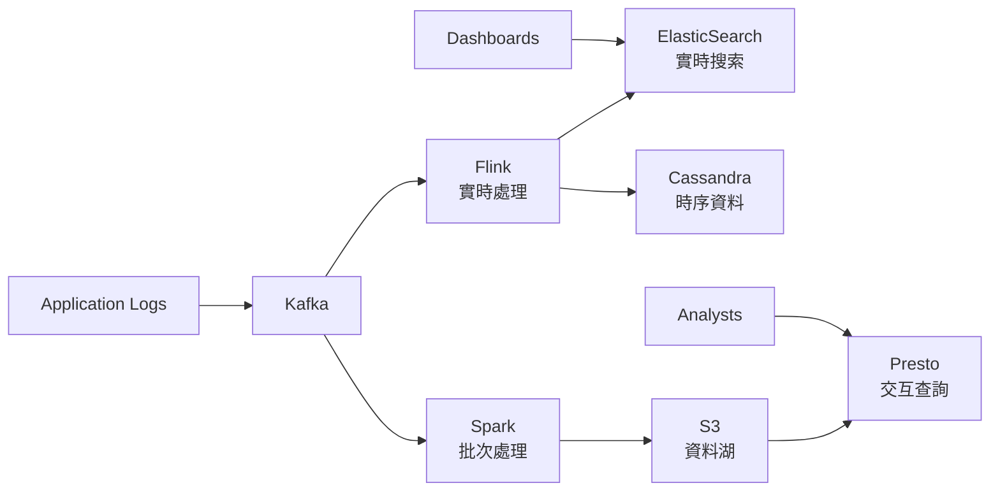
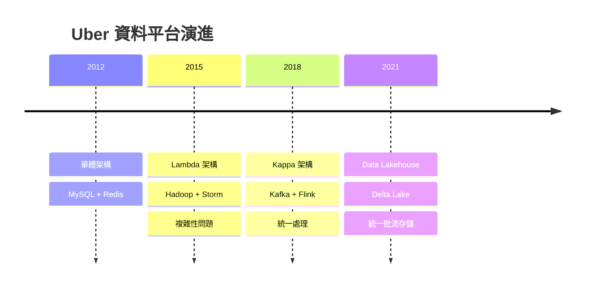
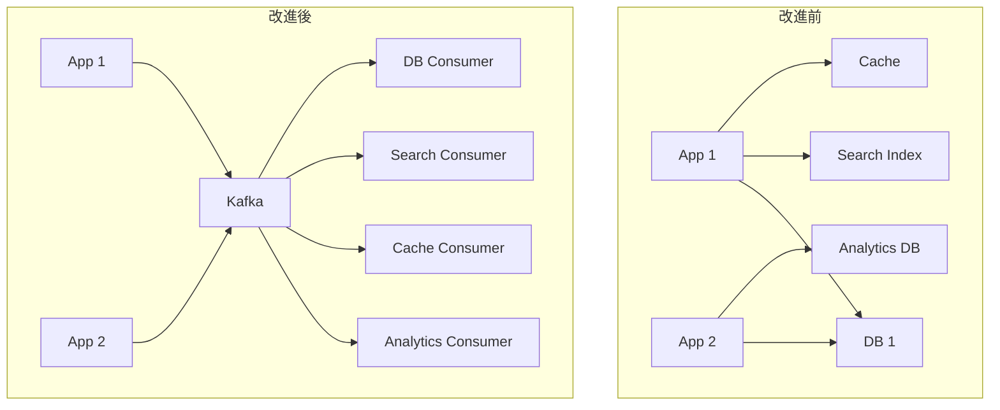
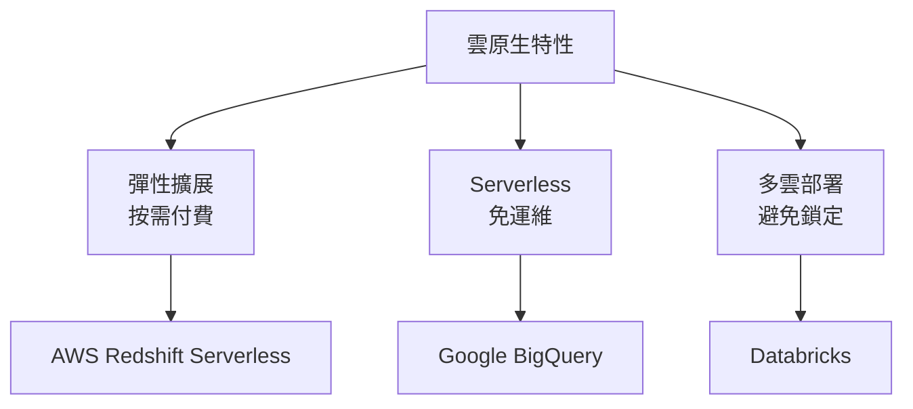
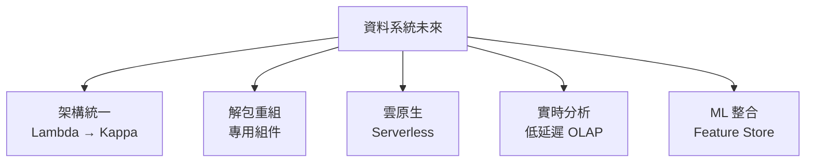

# 11 - 資料系統的未來 (The Future of Data Systems)

## 🎯 學習目標

完成本章後,你將能夠:
- 理解資料系統的演進趨勢
- 掌握 Lambda 和 Kappa 架構的設計
- 理解資料庫的解包 (Database Unbundling) 概念
- 設計整合批次和串流處理的系統

---

## 💡 核心概念

### 資料系統的演進



**現代挑戰**:
- **資料量**: PB 到 EB 級別
- **多樣性**: 結構化、半結構化、非結構化
- **速度**: 實時分析需求
- **整合**: 統一批次和串流

---

## 🏗️ Lambda 架構

### 架構概覽

**設計理念**: 用批次層保證準確性,速度層提供低延遲。



### 💻 實作範例

**批次層 (Spark)**:

```python
from pyspark.sql import SparkSession
from pyspark.sql.functions import *

spark = SparkSession.builder.appName("BatchLayer").getOrCreate()

def compute_batch_views():
    """每日批次計算用戶統計"""
    
    # 讀取歷史資料
    events = spark.read.parquet("/data/events/")
    
    # 計算用戶活躍度
    user_stats = (
        events
        .filter(col("event_date") >= date_sub(current_date(), 30))
        .groupBy("user_id")
        .agg(
            count("*").alias("event_count"),
            countDistinct("session_id").alias("session_count"),
            max("event_timestamp").alias("last_activity")
        )
    )
    
    # 寫入服務層
    (user_stats
     .write
     .mode("overwrite")
     .parquet("/batch_views/user_stats/"))
    
    return user_stats

# 每日執行
batch_stats = compute_batch_views()
```

**速度層 (Flink)**:

```python
from pyflink.datastream import StreamExecutionEnvironment
from pyflink.table import StreamTableEnvironment

def setup_speed_layer():
    """實時計算增量統計"""
    
    env = StreamExecutionEnvironment.get_execution_environment()
    table_env = StreamTableEnvironment.create(env)
    
    # 定義事件流
    table_env.execute_sql("""
        CREATE TABLE events (
            user_id BIGINT,
            event_type STRING,
            event_timestamp TIMESTAMP(3),
            WATERMARK FOR event_timestamp AS event_timestamp - INTERVAL '5' SECOND
        ) WITH (
            'connector' = 'kafka',
            'topic' = 'user_events'
        )
    """)
    
    # 實時統計 (過去 1 小時)
    table_env.execute_sql("""
        CREATE TABLE real_time_stats (
            user_id BIGINT,
            event_count BIGINT,
            window_start TIMESTAMP(3),
            window_end TIMESTAMP(3)
        ) WITH (
            'connector' = 'redis',
            'key-pattern' = 'rt_stats:{user_id}'
        )
    """)
    
    # 插入統計結果
    table_env.execute_sql("""
        INSERT INTO real_time_stats
        SELECT 
            user_id,
            COUNT(*) as event_count,
            TUMBLE_START(event_timestamp, INTERVAL '1' HOUR) as window_start,
            TUMBLE_END(event_timestamp, INTERVAL '1' HOUR) as window_end
        FROM events
        GROUP BY user_id, TUMBLE(event_timestamp, INTERVAL '1' HOUR)
    """)

setup_speed_layer()
```

**服務層 (查詢合併)**:

```python
class ServingLayer:
    def __init__(self, batch_store, realtime_store):
        self.batch_store = batch_store      # Cassandra/HBase
        self.realtime_store = realtime_store # Redis
    
    def get_user_stats(self, user_id, current_time):
        """合併批次和實時統計"""
        
        # 從批次層獲取基礎統計 (截至昨天)
        batch_stats = self.batch_store.get(
            f"user_stats:{user_id}"
        )
        
        # 從速度層獲取今日增量
        realtime_stats = self.realtime_store.get(
            f"rt_stats:{user_id}"
        )
        
        # 合併結果
        if batch_stats and realtime_stats:
            return {
                'user_id': user_id,
                'total_events': batch_stats['event_count'] + realtime_stats['event_count'],
                'last_update': current_time,
                'data_freshness': 'real-time'
            }
        elif batch_stats:
            return {
                **batch_stats,
                'data_freshness': 'batch-only'
            }
        else:
            return None

# 使用範例
serving = ServingLayer(batch_store, realtime_store)
stats = serving.get_user_stats(user_id=12345, current_time=datetime.now())
```

### Lambda 架構的挑戰

**❌ 缺點**:
1. **複雜性**: 維護兩套程式碼
2. **一致性**: 批次和實時結果可能不一致
3. **運維成本**: 需要管理多個系統

**範例: 重複程式碼問題**

```python
# 批次層邏輯
def batch_user_segments(events_df):
    return (
        events_df
        .groupBy("user_id")
        .agg(
            count("*").alias("event_count"),
            sum(when(col("event_type") == "purchase", 1).otherwise(0)).alias("purchases")
        )
        .withColumn("segment", 
            when(col("purchases") >= 10, "VIP")
            .when(col("purchases") >= 1, "Customer")
            .otherwise("Visitor")
        )
    )

# 速度層邏輯 (需要重複相同邏輯!)
def realtime_user_segments(events_stream):
    return (
        events_stream
        .keyBy("user_id")
        .window(TumblingEventTimeWindows.of(Time.hours(1)))
        .aggregate(
            lambda acc, event: {
                'event_count': acc.get('event_count', 0) + 1,
                'purchases': acc.get('purchases', 0) + (1 if event.event_type == 'purchase' else 0)
            }
        )
        .map(lambda stats: {
            **stats,
            'segment': 'VIP' if stats['purchases'] >= 10 else ('Customer' if stats['purchases'] >= 1 else 'Visitor')
        })
    )
```

---

## 🌊 Kappa 架構

### 架構概覽

**設計理念**: 只用串流處理,重新處理歷史資料來處理錯誤。



### 💻 實作範例

**統一串流處理**:

```python
from pyflink.datastream import StreamExecutionEnvironment
from pyflink.datastream.connectors import FlinkKafkaConsumer
from pyflink.common.serialization import SimpleStringSchema

def create_kappa_pipeline():
    """Kappa 架構的統一處理管道"""
    
    env = StreamExecutionEnvironment.get_execution_environment()
    
    # 啟用 Checkpoint (容錯)
    env.enable_checkpointing(60000)  # 每分鐘
    
    # 從 Kafka 讀取事件
    kafka_source = FlinkKafkaConsumer(
        topics=['user_events'],
        deserialization_schema=SimpleStringSchema(),
        properties={'bootstrap.servers': 'localhost:9092'}
    )
    
    # 設定從最早開始讀取 (支持重新處理)
    kafka_source.set_start_from_earliest()
    
    events = env.add_source(kafka_source)
    
    # 解析事件
    parsed_events = events.map(lambda x: json.loads(x))
    
    # 統一處理邏輯
    user_stats = (
        parsed_events
        .key_by(lambda event: event['user_id'])
        .window(TumblingEventTimeWindows.of(Time.hours(1)))
        .apply(WindowFunction(
            lambda key, window, events: compute_user_metrics(key, list(events))
        ))
    )
    
    # 輸出到服務資料庫
    user_stats.add_sink(CassandraSink(...))
    
    env.execute("Kappa Architecture Pipeline")

def compute_user_metrics(user_id, events):
    """統一的用戶指標計算邏輯"""
    metrics = {
        'user_id': user_id,
        'event_count': len(events),
        'purchase_count': sum(1 for e in events if e['event_type'] == 'purchase'),
        'session_count': len(set(e['session_id'] for e in events)),
        'revenue': sum(e.get('amount', 0) for e in events if e['event_type'] == 'purchase')
    }
    
    # 計算用戶等級
    if metrics['purchase_count'] >= 10:
        metrics['user_tier'] = 'VIP'
    elif metrics['purchase_count'] >= 1:
        metrics['user_tier'] = 'Customer'
    else:
        metrics['user_tier'] = 'Visitor'
    
    return metrics

create_kappa_pipeline()
```

**重新處理機制**:

```python
class KappaReprocessor:
    """Kappa 架構的重新處理工具"""
    
    def __init__(self, kafka_cluster, flink_cluster):
        self.kafka = kafka_cluster
        self.flink = flink_cluster
    
    def reprocess_data(self, start_date, end_date, new_logic_version):
        """重新處理指定時間範圍的資料"""
        
        # 1. 停止當前作業
        current_job_id = self.flink.get_running_job("user_metrics")
        self.flink.stop_job(current_job_id, savepoint=True)
        
        # 2. 部署新版本程式碼
        new_job_jar = f"user_metrics_v{new_logic_version}.jar"
        
        # 3. 從指定時間點開始重新處理
        job_config = {
            'kafka.start.timestamp': start_date.timestamp() * 1000,
            'kafka.end.timestamp': end_date.timestamp() * 1000,
            'output.table.suffix': f'_reprocessed_v{new_logic_version}'
        }
        
        # 4. 啟動重新處理作業
        reprocess_job_id = self.flink.submit_job(
            jar_path=new_job_jar,
            config=job_config
        )
        
        # 5. 監控重新處理進度
        while not self.flink.is_job_finished(reprocess_job_id):
            time.sleep(60)
            progress = self.flink.get_job_progress(reprocess_job_id)
            print(f"重新處理進度: {progress}%")
        
        # 6. 切換到新結果
        self.switch_serving_table(f'user_metrics_v{new_logic_version}')
        
        print(f"重新處理完成: {start_date} 到 {end_date}")
    
    def switch_serving_table(self, new_table):
        """原子性切換服務表"""
        # 使用資料庫的 RENAME 操作
        self.execute_sql(f"""
            BEGIN;
            ALTER TABLE user_metrics RENAME TO user_metrics_old;
            ALTER TABLE {new_table} RENAME TO user_metrics;
            COMMIT;
        """)
```

### Kappa 架構的優勢

**✅ 優點**:
1. **簡化**: 只需維護一套程式碼
2. **一致性**: 批次和實時使用相同邏輯
3. **敏捷**: 更容易修改和部署

**⚠️ 要求**:
- 串流處理框架必須支持重新處理
- 需要足夠的存儲保留歷史資料
- 重新處理時間必須可接受

---

## 🗃️ 資料庫解包 (Database Unbundling)

### 傳統資料庫 vs 解包後系統



### 現代資料棧範例

**Netflix 的資料平台**:



**各組件職責**:
- **Kafka**: 事件存儲與分發
- **Flink**: 實時計算
- **Spark**: 批次分析
- **ElasticSearch**: 全文搜索
- **Cassandra**: 運營資料存儲
- **S3**: 長期歸檔
- **Presto**: 臨時分析查詢

---

## 🏢 真實世界案例

### 案例 1: Uber 的統一資料平台

**架構演進**:



**技術棧**:

```python
# Uber 的 Kappa 架構實作 (簡化版)
class UberDataPipeline:
    def __init__(self):
        self.kafka = KafkaCluster()
        self.flink = FlinkCluster() 
        self.pinot = PinotCluster()  # OLAP 資料庫
        
    def setup_trip_analytics(self):
        """行程分析管道"""
        
        # 1. 事件接入
        trip_events = self.kafka.create_topic('trip_events', partitions=100)
        
        # 2. 實時處理
        flink_sql = """
        CREATE TABLE trip_metrics AS
        SELECT 
            city,
            product_type,
            COUNT(*) as trip_count,
            AVG(fare_amount) as avg_fare,
            AVG(trip_duration) as avg_duration,
            TUMBLE_START(event_time, INTERVAL '5' MINUTE) as window_start
        FROM trip_events
        WHERE event_type = 'trip_completed'
        GROUP BY city, product_type, TUMBLE(event_time, INTERVAL '5' MINUTE)
        """
        
        # 3. 輸出到服務層
        self.flink.execute_sql(flink_sql)
        
        # 4. 供應需求匹配 (實時定價)
        pricing_stream = self.flink.create_stream("""
        SELECT 
            geohash,
            COUNT(*) as demand,
            (SELECT COUNT(*) FROM driver_locations 
             WHERE ST_Distance(location, trip_requests.pickup_location) < 1000) as supply,
            CASE 
                WHEN supply = 0 THEN 2.0
                WHEN demand / supply > 2 THEN 1.5
                ELSE 1.0
            END as surge_multiplier
        FROM trip_requests
        GROUP BY geohash, TUMBLE(event_time, INTERVAL '1' MINUTE)
        """)
        
        return pricing_stream
```

---

### 案例 2: LinkedIn 的統一訊息平台

**Kafka 的誕生背景**:
- 原始問題: 各種資料管道雜亂無章
- 解決方案: 統一的訊息平台



**統一日誌的威力**:

```python
# LinkedIn 的統一事件模型
class LinkedInEvent:
    def __init__(self, member_id, event_type, timestamp, payload):
        self.member_id = member_id
        self.event_type = event_type
        self.timestamp = timestamp
        self.payload = payload
    
    def to_avro(self):
        """統一序列化格式"""
        return {
            'memberId': self.member_id,
            'eventType': self.event_type,
            'timestamp': self.timestamp,
            'payload': self.payload
        }

# 各種消費者
class ProfileUpdateConsumer:
    def consume(self, event):
        if event.event_type == 'profile_update':
            self.update_search_index(event.member_id, event.payload)
            self.invalidate_cache(event.member_id)

class RecommendationConsumer:
    def consume(self, event):
        if event.event_type in ['connection_made', 'job_view']:
            self.update_recommendation_model(event.member_id, event.payload)

class AnalyticsConsumer:
    def consume(self, event):
        # 所有事件都進入分析系統
        self.write_to_data_warehouse(event)
```

---

### 案例 3: Airbnb 的資料湖倉 (Lakehouse)

**Delta Lake + Apache Spark**:

```python
from delta.tables import *
from pyspark.sql import SparkSession

spark = SparkSession.builder \
    .appName("AirbnbLakehouse") \
    .config("spark.sql.extensions", "io.delta.sql.DeltaSparkSessionExtension") \
    .getOrCreate()

class AirbnbDataLakehouse:
    def __init__(self):
        self.spark = spark
    
    def create_booking_table(self):
        """創建預訂事實表"""
        
        # 批次載入歷史資料
        historical_bookings = (
            self.spark.read.parquet("s3://airbnb-raw/bookings_historical/")
            .write
            .format("delta")
            .mode("overwrite")
            .save("s3://airbnb-lakehouse/bookings/")
        )
        
        # 串流更新 (CDC)
        streaming_updates = (
            self.spark
            .readStream
            .format("kafka")
            .option("kafka.bootstrap.servers", "kafka:9092")
            .option("subscribe", "booking_changes")
            .load()
            .select(from_json(col("value").cast("string"), booking_schema).alias("data"))
            .select("data.*")
        )
        
        # Upsert 到 Delta Lake
        def upsert_to_delta(batch_df, batch_id):
            delta_table = DeltaTable.forPath(spark, "s3://airbnb-lakehouse/bookings/")
            
            delta_table.alias("target").merge(
                batch_df.alias("source"),
                "target.booking_id = source.booking_id"
            ).whenMatchedUpdateAll() \
             .whenNotMatchedInsertAll() \
             .execute()
        
        streaming_updates.writeStream \
            .foreachBatch(upsert_to_delta) \
            .outputMode("update") \
            .start()
    
    def run_analytics(self):
        """在湖倉上運行分析"""
        
        # 讀取 Delta 表 (支持時間旅行)
        bookings = self.spark.read.format("delta").load("s3://airbnb-lakehouse/bookings/")
        
        # 複雜分析查詢
        city_metrics = bookings.createOrReplaceTempView("bookings")
        
        result = self.spark.sql("""
        SELECT 
            city,
            DATE_TRUNC('month', booking_date) as month,
            COUNT(*) as total_bookings,
            AVG(nights) as avg_nights,
            SUM(total_price) as revenue,
            COUNT(DISTINCT guest_id) as unique_guests
        FROM bookings 
        WHERE booking_date >= '2023-01-01'
        GROUP BY city, DATE_TRUNC('month', booking_date)
        ORDER BY revenue DESC
        """)
        
        return result
```

**Lakehouse 的優勢**:
- ✅ **統一存儲**: 批次和串流共用
- ✅ **ACID 支持**: 資料品質保證
- ✅ **時間旅行**: 可查詢歷史版本
- ✅ **Schema 演進**: 靈活的格式變更

---

## 🔮 未來趨勢

### 1. 雲原生資料系統



### 2. 實時 OLAP

```python
# Apache Pinot - 實時分析資料庫
class RealTimeOLAP:
    """毫秒級複雜查詢"""
    
    def query_user_behavior(self, user_segment, time_range):
        sql = """
        SELECT 
            product_category,
            COUNT(*) as events,
            AVG(session_duration) as avg_duration
        FROM user_events 
        WHERE user_segment = '{segment}'
          AND event_time BETWEEN '{start}' AND '{end}'
        GROUP BY product_category
        ORDER BY events DESC
        LIMIT 10
        """.format(
            segment=user_segment,
            start=time_range['start'],
            end=time_range['end']
        )
        
        # 毫秒級返回結果
        return self.execute_query(sql)
```

### 3. 機器學習與資料系統整合

```python
# Feature Store 範例
class MLFeatureStore:
    """機器學習特徵存儲"""
    
    def create_features(self):
        """從事件流計算特徵"""
        
        user_features = """
        SELECT 
            user_id,
            COUNT(*) as total_orders,
            AVG(order_amount) as avg_order_value,
            MAX(order_time) as last_order_time,
            COUNT(DISTINCT product_id) as unique_products
        FROM order_events
        WHERE order_time >= NOW() - INTERVAL '30' DAY
        GROUP BY user_id
        """
        
        # 實時特徵服務
        return self.feature_serving.get_features(
            feature_view="user_behavior",
            entity_key=user_id
        )
```

---

## 📚 總結

### 核心要點



### 設計原則

1. **統一優於分離**: 盡量使用統一的處理模型
2. **專用優於通用**: 選擇最適合的專用工具
3. **實時優於批次**: 趨向更低延遲的分析
4. **雲原生優先**: 利用雲的彈性和便利性

---

## 🔗 參考資料

1. **書籍**:
   - Martin Kleppmann, *Designing Data-Intensive Applications*, Chapter 12
   - Nathan Marz, *Big Data: Principles and best practices*

2. **論文**:
   - [The Log: What every software engineer should know](https://engineering.linkedin.com/distributed-systems/log-what-every-software-engineer-should-know-about-real-time-datas-unifying)
   - [Delta Lake: High-Performance ACID Table Storage](https://databricks.com/research/delta-lake-high-performance-acid-table-storage-over-cloud-object-stores)

3. **技術資源**:
   - [Confluent Platform Documentation](https://docs.confluent.io/)
   - [Databricks Lakehouse](https://databricks.com/lakehouse/)
   - [Apache Pinot](https://pinot.apache.org/)