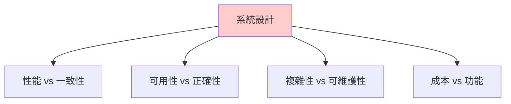
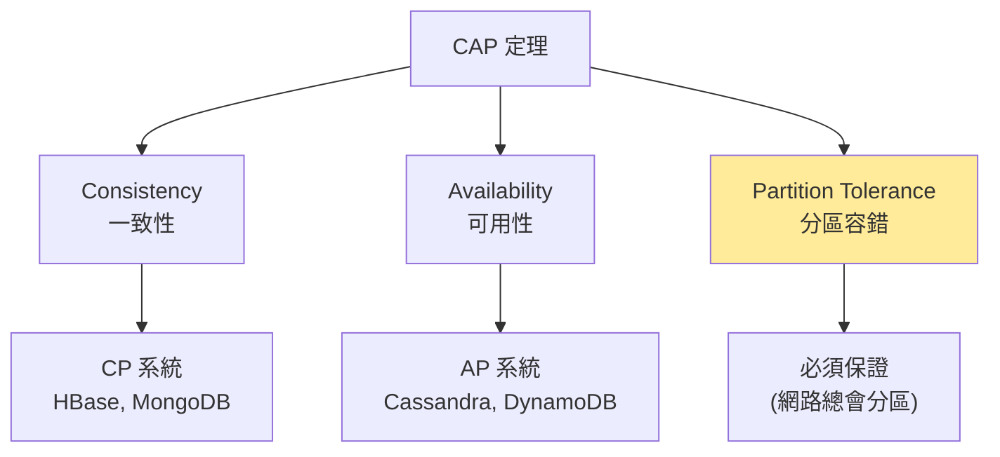
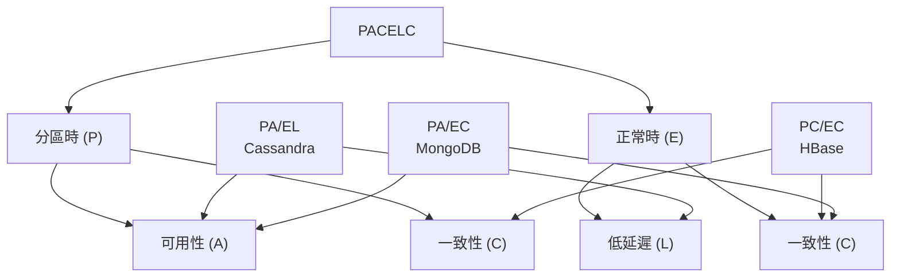
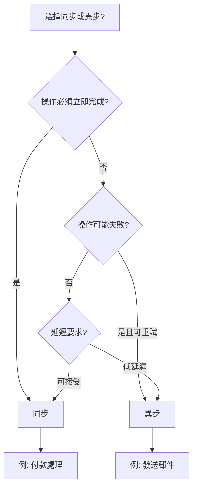
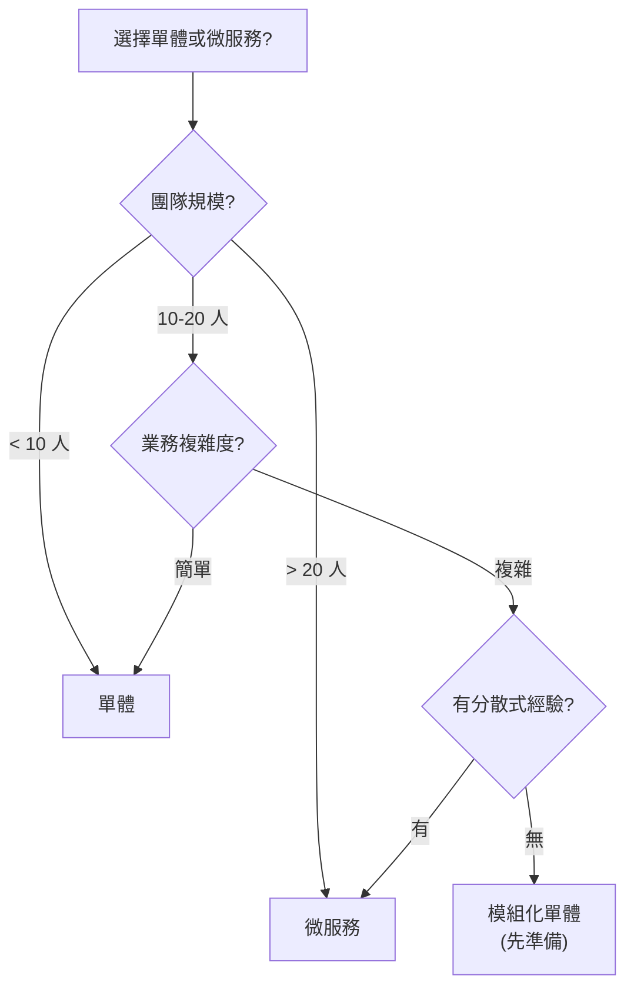
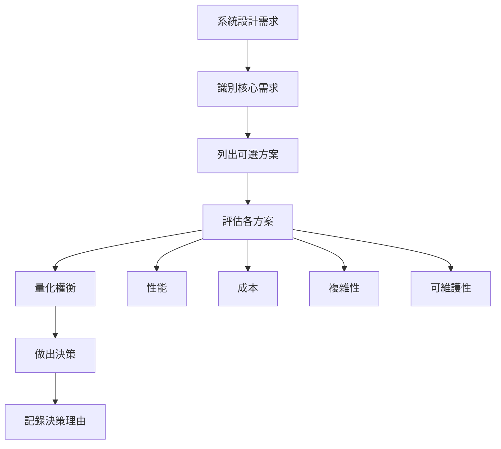
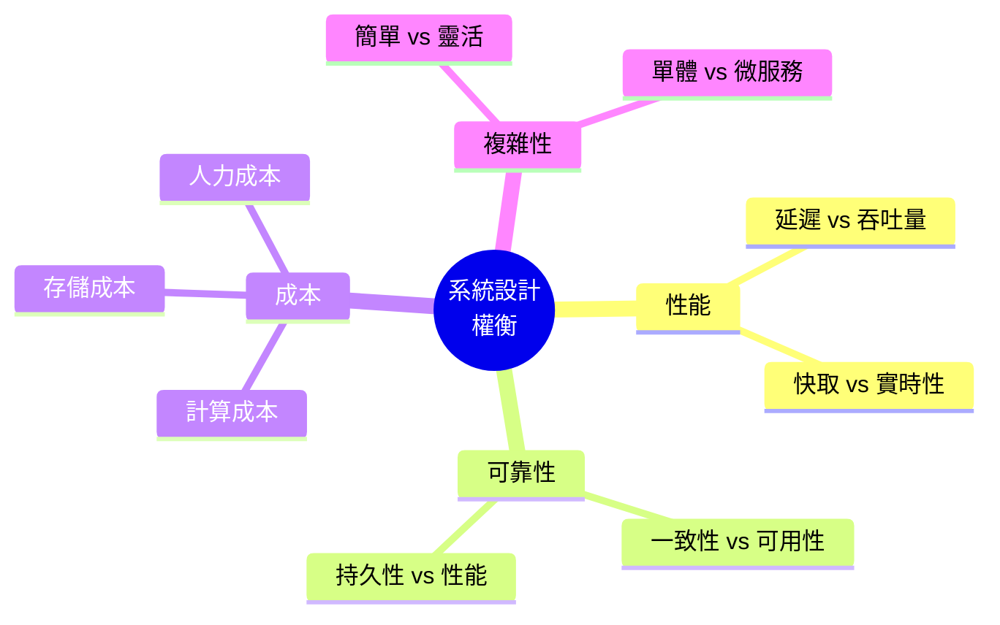

# 12 - 系統設計權衡分析 (System Design Trade-offs)

## 🎯 學習目標

完成本章後,你將能夠:
- 理解系統設計中的核心權衡
- 掌握 CAP 和 PACELC 定理的實際應用
- 分析不同場景下的最佳選擇
- 進行系統設計的成本效益分析

---

## 💡 核心概念

### 沒有完美的系統

**根本真理**: 所有系統設計都是權衡的結果。



**設計哲學**:
- 沒有"最好"的設計,只有"最適合"的設計
- 根據業務需求選擇權衡方向
- 明確說明設計決策的理由

---

## 📊 CAP 定理深入分析

### CAP 三角



### 💻 實際案例分析

**場景: 購物車系統**

**CP 選擇 (犧牲可用性)**:

```python
class CPShoppingCart:
    """強一致性購物車 (使用 etcd)"""
    
    def __init__(self, etcd_client):
        self.etcd = etcd_client
    
    def add_item(self, user_id, item_id, quantity):
        """添加商品到購物車"""
        try:
            # 使用分散式鎖保證一致性
            with self.etcd.lock(f"cart:{user_id}", ttl=10):
                # 讀取當前購物車
                cart = self.get_cart(user_id)
                
                # 檢查庫存 (強一致性查詢)
                stock = self.check_stock_consistent(item_id)
                if stock < quantity:
                    raise InsufficientStockError()
                
                # 更新購物車
                cart[item_id] = cart.get(item_id, 0) + quantity
                self.etcd.put(f"cart:{user_id}", json.dumps(cart))
                
                return True
        except LockTimeout:
            # 網路分區時無法獲取鎖
            raise ServiceUnavailableError("購物車服務暫時不可用")
```

**AP 選擇 (犧牲一致性)**:

```python
class APShoppingCart:
    """高可用購物車 (使用 Cassandra)"""
    
    def __init__(self, cassandra_session):
        self.session = cassandra_session
    
    def add_item(self, user_id, item_id, quantity):
        """添加商品到購物車 (最終一致性)"""
        
        # 使用 LWW (Last-Write-Wins)
        self.session.execute("""
            INSERT INTO shopping_carts (user_id, item_id, quantity, updated_at)
            VALUES (%s, %s, %s, %s)
        """, (user_id, item_id, quantity, datetime.now()))
        
        # ✅ 即使網路分區也能寫入
        # ⚠️ 可能短暫不一致
        return True
    
    def get_cart(self, user_id):
        """讀取購物車 (可能讀到舊資料)"""
        rows = self.session.execute("""
            SELECT item_id, quantity FROM shopping_carts 
            WHERE user_id = %s
        """, (user_id,))
        
        return {row.item_id: row.quantity for row in rows}
```

**權衡分析**:

| 方面 | CP (etcd) | AP (Cassandra) |
|------|-----------|----------------|
| **網路分區時** | 拒絕服務 ❌ | 繼續服務 ✅ |
| **一致性** | 強一致性 ✅ | 最終一致性 ⚠️ |
| **用戶體驗** | 可能無法加入購物車 | 總能加入購物車 |
| **適用場景** | 金融交易 | 社交媒體 |

**Amazon 的選擇**: AP (購物車設計為高可用,寧可偶爾多加商品也不能讓用戶無法購物)

---

## 📐 PACELC 定理

### 更全面的權衡模型

**PACELC**: 
- **P**artition: 網路分區時,選擇 **A**vailability 或 **C**onsistency
- **E**lse: 正常情況下,選擇 **L**atency 或 **C**onsistency



### 💻 實際系統分類

**PA/EL 系統 (Cassandra, DynamoDB)**:

```python
# Cassandra 配置
CREATE KEYSPACE shopping WITH replication = {
    'class': 'NetworkTopologyStrategy',
    'dc1': 3,
    'dc2': 3
};

# 讀寫配置: 法定人數
READ CONSISTENCY = ONE;    # 快速讀取 (犧牲一致性)
WRITE CONSISTENCY = ONE;   # 快速寫入 (犧牲一致性)

# 特性:
# - 分區時: 可用 (A)
# - 正常時: 低延遲 (L)
# - 最終一致性
```

**PC/EC 系統 (HBase, Google Spanner)**:

```python
# HBase 配置
# 所有讀寫都經過 Region Server (單點寫入)

# 特性:
# - 分區時: 少數分區不可用 (C)
# - 正常時: 強一致性,但延遲較高 (C)
# - 適合需要強一致性的場景
```

**PA/EC 系統 (MongoDB)**:

```python
# MongoDB 配置
db.users.insert(
    {...},
    writeConcern: { w: "majority" }  # 多數派確認 (一致性)
)

db.users.find({...}).readPreference("primaryPreferred")  # 優先主節點

# 特性:
# - 分區時: 可用 (允許從副本讀取)
# - 正常時: 強一致性 (寫入需要多數派)
```

---

## ⚖️ 核心權衡維度

### 1. 性能 vs 一致性

**寫入性能對比**:

```python
import time

class PerformanceTest:
    def test_eventual_consistency(self):
        """最終一致性 (快)"""
        start = time.time()
        
        # 異步寫入,立即返回
        for i in range(1000):
            cassandra.execute_async(
                "INSERT INTO data VALUES (%s)", (i,)
            )
        
        elapsed = time.time() - start
        print(f"最終一致性: {elapsed:.2f}秒")  # ~0.5 秒
    
    def test_strong_consistency(self):
        """強一致性 (慢)"""
        start = time.time()
        
        # 同步寫入,等待多數派確認
        for i in range(1000):
            etcd.put(f"key_{i}", str(i))
        
        elapsed = time.time() - start
        print(f"強一致性: {elapsed:.2f}秒")  # ~5 秒
```

**選擇指南**:

| 場景 | 選擇 | 理由 |
|------|------|------|
| 社交媒體按讚 | 最終一致性 | 延遲可接受,性能優先 |
| 銀行轉帳 | 強一致性 | 正確性至關重要 |
| 搜索索引 | 最終一致性 | 輕微延遲可接受 |
| 庫存扣減 | 強一致性 | 避免超賣 |

---

### 2. 正規化 vs 反正規化

**正規化 (Normalized)**:

```sql
-- 用戶表
CREATE TABLE users (
    user_id INT PRIMARY KEY,
    username VARCHAR(50),
    email VARCHAR(100)
);

-- 訂單表
CREATE TABLE orders (
    order_id INT PRIMARY KEY,
    user_id INT REFERENCES users(user_id),
    order_date TIMESTAMP,
    total_amount DECIMAL(10, 2)
);

-- 查詢需要 JOIN
SELECT u.username, o.order_id, o.total_amount
FROM users u
JOIN orders o ON u.user_id = o.user_id
WHERE u.user_id = 123;
```

**反正規化 (Denormalized)**:

```sql
-- 訂單表 (冗餘用戶資訊)
CREATE TABLE orders_denorm (
    order_id INT PRIMARY KEY,
    user_id INT,
    username VARCHAR(50),      -- 冗餘
    email VARCHAR(100),        -- 冗餘
    order_date TIMESTAMP,
    total_amount DECIMAL(10, 2)
);

-- 查詢無需 JOIN (快!)
SELECT username, order_id, total_amount
FROM orders_denorm
WHERE user_id = 123;
```

**權衡分析**:

| 維度 | 正規化 | 反正規化 |
|------|--------|---------|
| **讀取性能** | ❌ 慢 (需要 JOIN) | ✅ 快 (單表查詢) |
| **寫入性能** | ✅ 快 (只寫一次) | ❌ 慢 (需要更新多處) |
| **存儲空間** | ✅ 省空間 | ❌ 冗餘資料 |
| **一致性** | ✅ 單一數據源 | ⚠️ 需要同步更新 |
| **適用場景** | OLTP (頻繁更新) | OLAP (頻繁查詢) |

**混合策略**:

```python
class HybridDataModel:
    """混合正規化與反正規化"""
    
    def update_user_profile(self, user_id, new_username):
        """更新用戶資料"""
        
        # 1. 更新主表 (正規化)
        self.db.execute("""
            UPDATE users SET username = %s WHERE user_id = %s
        """, (new_username, user_id))
        
        # 2. 異步更新反正規化表
        self.queue.publish({
            'event': 'user_updated',
            'user_id': user_id,
            'username': new_username
        })
    
    def sync_denormalized_data(self, event):
        """後台同步反正規化資料"""
        self.db.execute("""
            UPDATE orders_denorm 
            SET username = %s 
            WHERE user_id = %s
        """, (event['username'], event['user_id']))
```

---

### 3. 同步 vs 異步

**同步處理**:

```python
def sync_order_processing(order):
    """同步訂單處理 (慢但可靠)"""
    
    # 扣減庫存
    inventory.reduce_stock(order.item_id, order.quantity)
    
    # 處理付款
    payment.charge(order.user_id, order.amount)
    
    # 發送通知
    notification.send_email(order.user_id, "訂單確認")
    
    # 更新訂單狀態
    orders.update_status(order.id, "COMPLETED")
    
    return "訂單處理完成"

# 特性:
# - 用戶等待所有步驟完成 (~3-5 秒)
# - 任何步驟失敗都會回滾
# - 簡單易理解
```

**異步處理**:

```python
def async_order_processing(order):
    """異步訂單處理 (快但複雜)"""
    
    # 立即返回
    orders.create(order)
    
    # 發送到訊息佇列
    queue.publish('order_created', order)
    
    return "訂單已提交"

# 後台處理器
class OrderProcessor:
    def process(self, order):
        try:
            inventory.reduce_stock(order.item_id, order.quantity)
            payment.charge(order.user_id, order.amount)
            notification.send_email(order.user_id, "訂單確認")
            orders.update_status(order.id, "COMPLETED")
        except Exception as e:
            # 失敗重試或補償
            self.handle_failure(order, e)

# 特性:
# - 用戶立即得到回應 (~100ms)
# - 失敗需要重試機制
# - 實作較複雜
```

**選擇指南**:



---

### 4. 單體 vs 微服務

**單體架構**:

```python
# 單一應用程式
class MonolithicEcommerce:
    def __init__(self):
        self.user_service = UserService()
        self.product_service = ProductService()
        self.order_service = OrderService()
        self.payment_service = PaymentService()
    
    def create_order(self, user_id, items):
        """所有邏輯在同一進程"""
        user = self.user_service.get_user(user_id)
        products = self.product_service.get_products(items)
        order = self.order_service.create_order(user, products)
        payment = self.payment_service.process_payment(order)
        
        return order

# 優點:
# - 簡單部署 (單一可執行檔)
# - 無網路延遲 (本地函數調用)
# - 易於調試 (單一進程)

# 缺點:
# - 難以擴展 (必須整體擴展)
# - 單點故障 (任何 bug 影響全部)
# - 技術棧鎖定 (難以使用不同語言)
```

**微服務架構**:

```python
# 用戶服務 (獨立部署)
class UserService:
    def get_user(self, user_id):
        return requests.get(f"http://user-service/users/{user_id}").json()

# 訂單服務 (獨立部署)
class OrderService:
    def create_order(self, user_id, items):
        # 調用其他服務
        user = self.user_service.get_user(user_id)
        products = self.product_service.get_products(items)
        
        # 本地邏輯
        order = Order(user=user, items=products)
        self.db.save(order)
        
        # 發布事件
        self.event_bus.publish('order_created', order)
        
        return order

# 優點:
# - 獨立擴展 (每個服務按需擴展)
# - 技術多樣性 (不同服務用不同語言)
# - 故障隔離 (一個服務故障不影響其他)

# 缺點:
# - 網路延遲 (服務間調用)
# - 分散式複雜性 (需要服務發現、負載均衡等)
# - 運維成本高 (多個服務部署監控)
```

**決策樹**:



---

## 💰 成本效益分析

### 1. 計算成本

**雲服務成本估算**:

```python
class CloudCostEstimator:
    """雲服務成本估算器"""
    
    def __init__(self):
        # AWS 價格 (2024, us-east-1)
        self.ec2_prices = {
            't3.medium': 0.0416,   # $/小時
            'm5.large': 0.096,
            'c5.2xlarge': 0.34
        }
        
        self.rds_prices = {
            'db.t3.medium': 0.068,
            'db.m5.large': 0.182
        }
        
        self.s3_price = 0.023  # $/GB/月
        self.data_transfer_price = 0.09  # $/GB
    
    def estimate_monthly_cost(self, architecture):
        """估算月度成本"""
        
        cost = 0
        
        # 計算伺服器成本
        for instance_type, count in architecture['ec2'].items():
            hourly_cost = self.ec2_prices[instance_type] * count
            monthly_cost = hourly_cost * 24 * 30
            cost += monthly_cost
            print(f"{instance_type} x{count}: ${monthly_cost:.2f}/月")
        
        # 計算資料庫成本
        for db_type, count in architecture['rds'].items():
            hourly_cost = self.rds_prices[db_type] * count
            monthly_cost = hourly_cost * 24 * 30
            cost += monthly_cost
            print(f"{db_type} x{count}: ${monthly_cost:.2f}/月")
        
        # 計算存儲成本
        storage_gb = architecture['storage_gb']
        storage_cost = storage_gb * self.s3_price
        cost += storage_cost
        print(f"S3 存儲 {storage_gb}GB: ${storage_cost:.2f}/月")
        
        # 計算流量成本
        data_transfer_gb = architecture['data_transfer_gb']
        transfer_cost = data_transfer_gb * self.data_transfer_price
        cost += transfer_cost
        print(f"資料傳輸 {data_transfer_gb}GB: ${transfer_cost:.2f}/月")
        
        print(f"\n總成本: ${cost:.2f}/月 (${cost * 12:.2f}/年)")
        return cost

# 使用範例
estimator = CloudCostEstimator()

# 小型架構
small_architecture = {
    'ec2': {'t3.medium': 2},
    'rds': {'db.t3.medium': 1},
    'storage_gb': 100,
    'data_transfer_gb': 500
}

# 大型架構
large_architecture = {
    'ec2': {'m5.large': 10, 'c5.2xlarge': 5},
    'rds': {'db.m5.large': 3},
    'storage_gb': 10000,
    'data_transfer_gb': 50000
}

print("=== 小型架構 ===")
estimator.estimate_monthly_cost(small_architecture)
# 輸出: ~$150/月

print("\n=== 大型架構 ===")
estimator.estimate_monthly_cost(large_architecture)
# 輸出: ~$10,000/月
```

### 2. 性能成本權衡

**案例: 快取策略選擇**

```python
class CacheStrategyAnalysis:
    """快取策略成本分析"""
    
    def analyze_no_cache(self, qps, db_latency_ms):
        """無快取方案"""
        return {
            'strategy': '無快取',
            'latency_p99': db_latency_ms,  # 100ms
            'db_load': qps,  # 1000 QPS
            'cost': self.calculate_db_cost(qps),  # $500/月
            'complexity': '簡單'
        }
    
    def analyze_redis_cache(self, qps, cache_hit_rate, db_latency_ms, cache_latency_ms):
        """Redis 快取方案"""
        cache_qps = qps * cache_hit_rate
        db_qps = qps * (1 - cache_hit_rate)
        
        avg_latency = (
            cache_qps * cache_latency_ms + db_qps * db_latency_ms
        ) / qps
        
        return {
            'strategy': 'Redis 快取',
            'latency_p99': avg_latency,  # ~15ms (90% 命中率)
            'db_load': db_qps,  # 100 QPS
            'cost': self.calculate_db_cost(db_qps) + 50,  # $100 + $50 Redis
            'complexity': '中等'
        }
    
    def analyze_cdn_cache(self, qps, cdn_hit_rate):
        """CDN 快取方案"""
        origin_qps = qps * (1 - cdn_hit_rate)
        
        return {
            'strategy': 'CDN 快取',
            'latency_p99': 5,  # ~5ms (邊緣節點)
            'db_load': origin_qps,  # 50 QPS
            'cost': self.calculate_db_cost(origin_qps) + 100,  # $50 + $100 CDN
            'complexity': '中等'
        }
    
    def recommend(self, qps, requirements):
        """推薦最佳方案"""
        strategies = [
            self.analyze_no_cache(qps, 100),
            self.analyze_redis_cache(qps, 0.9, 100, 1),
            self.analyze_cdn_cache(qps, 0.95)
        ]
        
        # 根據需求篩選
        if requirements['max_latency_ms'] < 20:
            strategies = [s for s in strategies if s['latency_p99'] < 20]
        
        if requirements['max_budget'] < 200:
            strategies = [s for s in strategies if s['cost'] < 200]
        
        # 選擇最低成本方案
        best = min(strategies, key=lambda s: s['cost'])
        return best

# 使用範例
analyzer = CacheStrategyAnalysis()
recommendation = analyzer.recommend(
    qps=1000,
    requirements={
        'max_latency_ms': 20,
        'max_budget': 300
    }
)

print(f"推薦方案: {recommendation['strategy']}")
print(f"延遲: {recommendation['latency_p99']}ms")
print(f"成本: ${recommendation['cost']}/月")
```

---

## 🎯 決策框架

### 系統設計決策流程



### 決策文件範本

```markdown
# 架構決策記錄 (ADR)

## 背景
當前系統面臨高併發場景,資料庫成為瓶頸。

## 需求
- QPS: 10,000
- 延遲: P99 < 50ms
- 預算: < $2,000/月

## 可選方案

### 方案 1: 垂直擴展資料庫
- 優點: 簡單,無需改程式碼
- 缺點: 成本高 ($5,000/月),有上限
- 延遲: P99 30ms

### 方案 2: 添加 Redis 快取
- 優點: 成本適中 ($1,500/月),延遲低
- 缺點: 增加複雜性,需處理快取失效
- 延遲: P99 15ms

### 方案 3: 讀寫分離 + 快取
- 優點: 成本最低 ($1,200/月)
- 缺點: 複雜性最高,最終一致性
- 延遲: P99 20ms

## 決策
選擇方案 2: 添加 Redis 快取

## 理由
- 滿足性能需求 (15ms < 50ms)
- 符合預算約束 ($1,500 < $2,000)
- 複雜性可控 (團隊有 Redis 經驗)
- 可逐步遷移,風險較低

## 後果
- 需要實作快取預熱邏輯
- 需要監控快取命中率
- 需要處理快取穿透、雪崩問題
```

---

## 📚 總結

### 核心權衡原則



### 決策清單

設計系統時,檢查以下問題:

- [ ] **性能需求**: QPS? 延遲? 吞吐量?
- [ ] **一致性需求**: 強一致性或最終一致性?
- [ ] **可用性需求**: SLA? 容忍停機時間?
- [ ] **成本約束**: 預算上限?
- [ ] **團隊能力**: 團隊經驗與技能?
- [ ] **時間限制**: 上線期限?
- [ ] **擴展性**: 未來流量預期?

### 常見反模式

**❌ 過度設計**:
```python
# 不必要的複雜性
# 日活 100 人的應用使用 Kubernetes + 微服務
```

**❌ 過早優化**:
```python
# 在需求不明確時就進行複雜優化
```

**❌ 忽視成本**:
```python
# 使用最貴的服務而不考慮 ROI
```

**✅ 正確方法**:
- 從簡單開始
- 根據實際需求優化
- 持續監控和調整

---

## 🔗 參考資料

1. **書籍**:
   - Martin Kleppmann, *Designing Data-Intensive Applications*
   - Sam Newman, *Building Microservices*

2. **論文**:
   - [CAP Twelve Years Later](https://www.infoq.com/articles/cap-twelve-years-later-how-the-rules-have-changed/)
   - [Life beyond Distributed Transactions](https://queue.acm.org/detail.cfm?id=3025012)

3. **資源**:
   - [AWS Cost Calculator](https://calculator.aws/)
   - [System Design Primer](https://github.com/donnemartin/system-design-primer)
