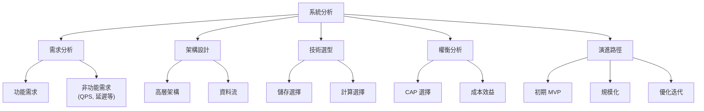
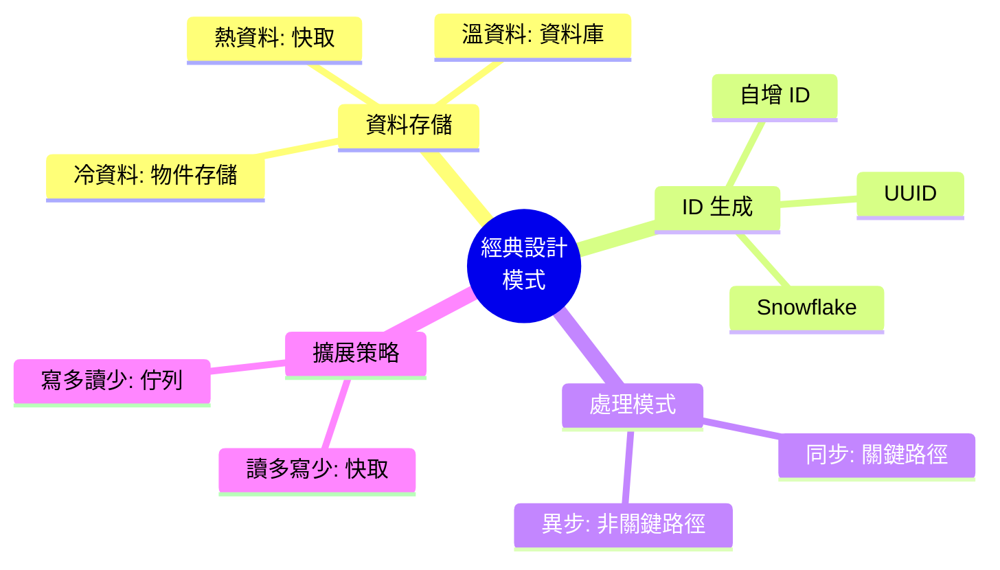

# 13 - 經典案例分析 (Classic Case Studies)

## 🎯 學習目標

完成本章後,你將能夠:
- 分析真實系統的設計決策
- 理解不同規模系統的演進路徑
- 掌握常見系統的設計模式
- 應用所學知識到實際系統設計

---

## 💡 案例學習方法

### 系統設計分析框架



---

## 🔗 案例 1: URL 短網址服務 (URL Shortener)

### 需求分析

**功能需求**:
- 生成短網址: `https://example.com/abc123`
- 重定向: 訪問短網址跳轉到原網址
- 自訂短網址 (可選)
- 過期時間 (可選)

**非功能需求**:
- QPS: 10,000 (讀) / 100 (寫)
- 延遲: P99 < 100ms
- 可用性: 99.9%
- 短網址長度: 6-8 字元

### 容量估算

```python
class CapacityEstimation:
    """容量估算"""
    
    def __init__(self):
        self.write_qps = 100  # 每秒寫入
        self.read_qps = 10000  # 每秒讀取
        self.read_write_ratio = 100  # 讀寫比
    
    def estimate_storage(self, years=5):
        """估算存儲需求"""
        
        # 每年新增短網址數量
        urls_per_year = self.write_qps * 86400 * 365
        print(f"每年新增 URL: {urls_per_year:,}")
        # 輸出: 3,153,600,000 (~30億)
        
        # 5 年總量
        total_urls = urls_per_year * years
        print(f"5 年總 URL: {total_urls:,}")
        # 輸出: 15,768,000,000 (~150億)
        
        # 存儲大小 (假設每條記錄 500 bytes)
        storage_bytes = total_urls * 500
        storage_gb = storage_bytes / (1024 ** 3)
        print(f"存儲需求: {storage_gb:,.0f} GB")
        # 輸出: 7,350 GB (~7.5 TB)
        
        return storage_gb
    
    def estimate_bandwidth(self):
        """估算頻寬需求"""
        
        # 寫入頻寬
        write_bandwidth = self.write_qps * 500  # bytes/s
        print(f"寫入頻寬: {write_bandwidth / 1024:.2f} KB/s")
        
        # 讀取頻寬 (包含重定向)
        read_bandwidth = self.read_qps * 500  # bytes/s
        print(f"讀取頻寬: {read_bandwidth / 1024:.2f} KB/s")
        
        return write_bandwidth, read_bandwidth

estimator = CapacityEstimation()
estimator.estimate_storage()
estimator.estimate_bandwidth()
```

### 核心設計: 短網址生成

**方法 1: 雜湊 + Base62 編碼**

```python
import hashlib
import base64

class URLShortener:
    """短網址生成器"""
    
    def __init__(self):
        self.base62_chars = "0123456789abcdefghijklmnopqrstuvwxyzABCDEFGHIJKLMNOPQRSTUVWXYZ"
    
    def shorten_hash(self, long_url):
        """使用雜湊生成短網址"""
        
        # MD5 雜湊
        hash_value = hashlib.md5(long_url.encode()).hexdigest()
        
        # 取前 8 個字元
        short_hash = hash_value[:8]
        
        # 轉換為 Base62
        num = int(short_hash, 16)
        short_url = self._base62_encode(num)[:6]
        
        return short_url
    
    def _base62_encode(self, num):
        """Base62 編碼"""
        if num == 0:
            return self.base62_chars[0]
        
        result = []
        while num:
            num, rem = divmod(num, 62)
            result.append(self.base62_chars[rem])
        
        return ''.join(reversed(result))
    
    def _base62_decode(self, string):
        """Base62 解碼"""
        num = 0
        for char in string:
            num = num * 62 + self.base62_chars.index(char)
        return num

# 測試
shortener = URLShortener()
short_url = shortener.shorten_hash("https://www.example.com/very/long/url")
print(f"短網址: {short_url}")  # 輸出: abc123

# 問題: 可能產生衝突!
```

**方法 2: 自增 ID + Base62**

```python
class URLShortenerWithID:
    """使用自增 ID 生成短網址 (無衝突)"""
    
    def __init__(self, db):
        self.db = db
        self.base62_chars = "0123456789abcdefghijklmnopqrstuvwxyzABCDEFGHIJKLMNOPQRSTUVWXYZ"
    
    def shorten(self, long_url):
        """生成短網址"""
        
        # 1. 獲取自增 ID
        url_id = self.db.get_next_id()
        
        # 2. Base62 編碼
        short_code = self._base62_encode(url_id)
        
        # 3. 存儲映射
        self.db.save({
            'id': url_id,
            'short_code': short_code,
            'long_url': long_url,
            'created_at': datetime.now()
        })
        
        return short_code
    
    def expand(self, short_code):
        """展開短網址"""
        
        # 解碼 ID
        url_id = self._base62_decode(short_code)
        
        # 查詢長網址
        record = self.db.get_by_id(url_id)
        
        return record['long_url'] if record else None
    
    def _base62_encode(self, num):
        """Base62 編碼"""
        if num == 0:
            return self.base62_chars[0]
        
        result = []
        while num:
            num, rem = divmod(num, 62)
            result.append(self.base62_chars[rem])
        
        return ''.join(reversed(result))
    
    def _base62_decode(self, string):
        """Base62 解碼"""
        num = 0
        for char in string:
            num = num * 62 + self.base62_chars.index(char)
        return num

# 6 位 Base62: 62^6 = 568億個 URL (足夠!)
```

### 架構設計


**資料庫設計**:

```sql
CREATE TABLE urls (
    id BIGINT PRIMARY KEY AUTO_INCREMENT,
    short_code VARCHAR(10) UNIQUE NOT NULL,
    long_url TEXT NOT NULL,
    user_id BIGINT,
    created_at TIMESTAMP DEFAULT CURRENT_TIMESTAMP,
    expires_at TIMESTAMP,
    click_count INT DEFAULT 0,
    INDEX idx_short_code (short_code),
    INDEX idx_user_id (user_id)
);

CREATE TABLE clicks (
    id BIGINT PRIMARY KEY AUTO_INCREMENT,
    short_code VARCHAR(10),
    ip_address VARCHAR(45),
    user_agent TEXT,
    referer TEXT,
    clicked_at TIMESTAMP DEFAULT CURRENT_TIMESTAMP,
    INDEX idx_short_code (short_code),
    INDEX idx_clicked_at (clicked_at)
);
```

### 完整實作

```python
from flask import Flask, request, redirect
import redis
import mysql.connector

app = Flask(__name__)

class URLShortenerService:
    def __init__(self):
        self.redis = redis.Redis(host='localhost', decode_responses=True)
        self.mysql = mysql.connector.connect(
            host='localhost',
            user='root',
            password='password',
            database='url_shortener'
        )
        self.cache_ttl = 3600  # 1 小時
    
    def create_short_url(self, long_url, custom_code=None):
        """創建短網址"""
        
        cursor = self.mysql.cursor()
        
        if custom_code:
            # 檢查自訂代碼是否可用
            cursor.execute(
                "SELECT id FROM urls WHERE short_code = %s",
                (custom_code,)
            )
            if cursor.fetchone():
                raise ValueError("自訂代碼已被使用")
            
            short_code = custom_code
        else:
            # 生成短代碼
            cursor.execute("SELECT MAX(id) FROM urls")
            max_id = cursor.fetchone()[0] or 0
            next_id = max_id + 1
            short_code = self._base62_encode(next_id)
        
        # 存儲到資料庫
        cursor.execute("""
            INSERT INTO urls (short_code, long_url) 
            VALUES (%s, %s)
        """, (short_code, long_url))
        
        self.mysql.commit()
        
        # 預熱快取
        self.redis.setex(
            f"url:{short_code}",
            self.cache_ttl,
            long_url
        )
        
        return short_code
    
    def get_long_url(self, short_code):
        """獲取長網址"""
        
        # 1. 查詢快取
        cache_key = f"url:{short_code}"
        long_url = self.redis.get(cache_key)
        
        if long_url:
            print("快取命中")
            return long_url
        
        # 2. 查詢資料庫
        cursor = self.mysql.cursor()
        cursor.execute(
            "SELECT long_url FROM urls WHERE short_code = %s",
            (short_code,)
        )
        
        result = cursor.fetchone()
        if not result:
            return None
        
        long_url = result[0]
        
        # 3. 寫入快取
        self.redis.setex(cache_key, self.cache_ttl, long_url)
        
        # 4. 異步更新點擊統計
        self._increment_click_count(short_code)
        
        return long_url
    
    def _increment_click_count(self, short_code):
        """增加點擊計數 (異步)"""
        cursor = self.mysql.cursor()
        cursor.execute(
            "UPDATE urls SET click_count = click_count + 1 WHERE short_code = %s",
            (short_code,)
        )
        self.mysql.commit()
    
    def _base62_encode(self, num):
        """Base62 編碼"""
        chars = "0123456789abcdefghijklmnopqrstuvwxyzABCDEFGHIJKLMNOPQRSTUVWXYZ"
        if num == 0:
            return chars[0]
        
        result = []
        while num:
            num, rem = divmod(num, 62)
            result.append(chars[rem])
        
        return ''.join(reversed(result))

# Flask 路由
service = URLShortenerService()

@app.route('/shorten', methods=['POST'])
def shorten():
    """創建短網址 API"""
    data = request.json
    long_url = data.get('url')
    custom_code = data.get('custom_code')
    
    try:
        short_code = service.create_short_url(long_url, custom_code)
        return {
            'short_url': f"https://short.url/{short_code}",
            'short_code': short_code
        }
    except Exception as e:
        return {'error': str(e)}, 400

@app.route('/<short_code>')
def redirect_url(short_code):
    """重定向短網址"""
    long_url = service.get_long_url(short_code)
    
    if not long_url:
        return "URL not found", 404
    
    return redirect(long_url, code=301)

if __name__ == '__main__':
    app.run(host='0.0.0.0', port=5000)
```

### 優化與擴展

**1. 快取策略優化**:

```python
class CacheWarmer:
    """快取預熱器"""
    
    def warm_popular_urls(self):
        """預熱熱門 URL"""
        
        cursor = self.mysql.cursor()
        cursor.execute("""
            SELECT short_code, long_url 
            FROM urls 
            ORDER BY click_count DESC 
            LIMIT 10000
        """)
        
        for short_code, long_url in cursor:
            self.redis.setex(
                f"url:{short_code}",
                3600,
                long_url
            )
```

**2. 分散式 ID 生成 (Snowflake)**:

```python
import time
import threading

class SnowflakeIDGenerator:
    """Twitter Snowflake ID 生成器"""
    
    def __init__(self, datacenter_id, worker_id):
        self.datacenter_id = datacenter_id  # 5 bits
        self.worker_id = worker_id          # 5 bits
        self.sequence = 0                    # 12 bits
        self.last_timestamp = -1
        self.lock = threading.Lock()
        
        # Epoch (自訂起始時間)
        self.epoch = 1609459200000  # 2021-01-01 00:00:00
    
    def generate_id(self):
        """生成唯一 ID"""
        with self.lock:
            timestamp = int(time.time() * 1000)
            
            if timestamp < self.last_timestamp:
                raise Exception("時鐘回撥")
            
            if timestamp == self.last_timestamp:
                # 同一毫秒內,序號遞增
                self.sequence = (self.sequence + 1) & 0xFFF
                if self.sequence == 0:
                    # 序號溢出,等待下一毫秒
                    while timestamp <= self.last_timestamp:
                        timestamp = int(time.time() * 1000)
            else:
                self.sequence = 0
            
            self.last_timestamp = timestamp
            
            # 組合 ID
            id = ((timestamp - self.epoch) << 22) | \
                 (self.datacenter_id << 17) | \
                 (self.worker_id << 12) | \
                 self.sequence
            
            return id

# 使用範例
id_gen = SnowflakeIDGenerator(datacenter_id=1, worker_id=1)
url_id = id_gen.generate_id()
print(f"生成 ID: {url_id}")
```

**3. 分析統計**:

```python
class URLAnalytics:
    """URL 分析服務"""
    
    def get_statistics(self, short_code):
        """獲取統計資訊"""
        
        # 查詢點擊記錄
        cursor = self.mysql.cursor()
        
        # 總點擊數
        cursor.execute("""
            SELECT COUNT(*) FROM clicks 
            WHERE short_code = %s
        """, (short_code,))
        total_clicks = cursor.fetchone()[0]
        
        # 每日點擊趨勢
        cursor.execute("""
            SELECT DATE(clicked_at) as date, COUNT(*) as count
            FROM clicks 
            WHERE short_code = %s 
                AND clicked_at >= DATE_SUB(NOW(), INTERVAL 30 DAY)
            GROUP BY DATE(clicked_at)
            ORDER BY date
        """, (short_code,))
        daily_clicks = cursor.fetchall()
        
        # 來源分析
        cursor.execute("""
            SELECT referer, COUNT(*) as count
            FROM clicks 
            WHERE short_code = %s 
            GROUP BY referer 
            ORDER BY count DESC 
            LIMIT 10
        """, (short_code,))
        top_referers = cursor.fetchall()
        
        return {
            'total_clicks': total_clicks,
            'daily_clicks': [{'date': str(date), 'count': count} for date, count in daily_clicks],
            'top_referers': [{'referer': ref, 'count': count} for ref, count in top_referers]
        }
```

---

## 📱 案例 2: Instagram 照片儲存

### 需求分析

**功能需求**:
- 上傳照片
- 瀏覽照片
- 生成多種尺寸 (縮圖、中圖、原圖)

**非功能需求**:
- 使用者: 10億
- 每日上傳: 1億張照片
- 平均照片大小: 3MB
- 存儲: PB 級別

### 容量估算

```python
class InstagramStorageEstimation:
    """Instagram 存儲估算"""
    
    def __init__(self):
        self.daily_uploads = 100_000_000  # 1億張/天
        self.avg_photo_size_mb = 3  # 3MB
        self.thumbnail_size_kb = 50  # 50KB
        self.medium_size_kb = 500  # 500KB
    
    def estimate_daily_storage(self):
        """每日存儲增長"""
        
        # 原圖
        original_gb = (self.daily_uploads * self.avg_photo_size_mb) / 1024
        
        # 縮圖
        thumbnail_gb = (self.daily_uploads * self.thumbnail_size_kb / 1024) / 1024
        
        # 中圖
        medium_gb = (self.daily_uploads * self.medium_size_kb / 1024) / 1024
        
        total_gb = original_gb + thumbnail_gb + medium_gb
        
        print(f"每日存儲增長: {total_gb:,.0f} GB")
        print(f"  - 原圖: {original_gb:,.0f} GB")
        print(f"  - 中圖: {medium_gb:,.0f} GB")
        print(f"  - 縮圖: {thumbnail_gb:,.0f} GB")
        
        # 每年
        yearly_pb = (total_gb * 365) / 1024
        print(f"\n每年存儲增長: {yearly_pb:.1f} PB")
        
        return total_gb

estimator = InstagramStorageEstimation()
estimator.estimate_daily_storage()
# 輸出: ~293 TB/天, ~104 PB/年
```

### 架構設計


**資料模型**:

```python
# Cassandra Schema
"""
CREATE TABLE photos (
    photo_id UUID PRIMARY KEY,
    user_id UUID,
    caption TEXT,
    location TEXT,
    upload_time TIMESTAMP,
    original_url TEXT,
    medium_url TEXT,
    thumbnail_url TEXT,
    likes_count COUNTER,
    comments_count COUNTER
);

CREATE TABLE user_photos (
    user_id UUID,
    photo_id UUID,
    upload_time TIMESTAMP,
    PRIMARY KEY (user_id, upload_time, photo_id)
) WITH CLUSTERING ORDER BY (upload_time DESC);

CREATE TABLE photo_likes (
    photo_id UUID,
    user_id UUID,
    liked_at TIMESTAMP,
    PRIMARY KEY (photo_id, user_id)
);
"""
```

### 核心實作: 照片上傳

```python
import uuid
import boto3
from PIL import Image
import io

class PhotoUploadService:
    """照片上傳服務"""
    
    def __init__(self):
        self.s3 = boto3.client('s3')
        self.bucket = 'instagram-photos'
        self.cassandra = CassandraClient()
        self.queue = MessageQueue()
    
    def upload_photo(self, user_id, image_file, caption=None):
        """上傳照片"""
        
        # 1. 生成唯一 ID
        photo_id = uuid.uuid4()
        
        # 2. 上傳原圖到 S3
        original_key = f"original/{photo_id}.jpg"
        self.s3.upload_fileobj(
            image_file,
            self.bucket,
            original_key,
            ExtraArgs={'ContentType': 'image/jpeg'}
        )
        
        original_url = f"https://cdn.instagram.com/{original_key}"
        
        # 3. 發送到處理佇列 (異步生成縮圖)
        self.queue.publish({
            'photo_id': str(photo_id),
            'original_key': original_key,
            'user_id': str(user_id)
        })
        
        # 4. 存儲元資料
        self.cassandra.execute("""
            INSERT INTO photos (photo_id, user_id, caption, upload_time, original_url)
            VALUES (?, ?, ?, ?, ?)
        """, (photo_id, user_id, caption, datetime.now(), original_url))
        
        self.cassandra.execute("""
            INSERT INTO user_photos (user_id, photo_id, upload_time)
            VALUES (?, ?, ?)
        """, (user_id, photo_id, datetime.now()))
        
        return {
            'photo_id': str(photo_id),
            'url': original_url
        }
    
    def process_photo(self, message):
        """處理照片 (Worker)"""
        
        photo_id = message['photo_id']
        original_key = message['original_key']
        
        # 1. 從 S3 下載原圖
        response = self.s3.get_object(Bucket=self.bucket, Key=original_key)
        image_data = response['Body'].read()
        image = Image.open(io.BytesIO(image_data))
        
        # 2. 生成縮圖 (150x150)
        thumbnail = image.copy()
        thumbnail.thumbnail((150, 150))
        thumbnail_key = f"thumbnail/{photo_id}.jpg"
        self._upload_processed_image(thumbnail, thumbnail_key)
        
        # 3. 生成中圖 (640x640)
        medium = image.copy()
        medium.thumbnail((640, 640))
        medium_key = f"medium/{photo_id}.jpg"
        self._upload_processed_image(medium, medium_key)
        
        # 4. 更新元資料
        thumbnail_url = f"https://cdn.instagram.com/{thumbnail_key}"
        medium_url = f"https://cdn.instagram.com/{medium_key}"
        
        self.cassandra.execute("""
            UPDATE photos 
            SET thumbnail_url = ?, medium_url = ?
            WHERE photo_id = ?
        """, (thumbnail_url, medium_url, uuid.UUID(photo_id)))
    
    def _upload_processed_image(self, image, key):
        """上傳處理後的圖片"""
        buffer = io.BytesIO()
        image.save(buffer, format='JPEG', quality=85)
        buffer.seek(0)
        
        self.s3.upload_fileobj(
            buffer,
            self.bucket,
            key,
            ExtraArgs={'ContentType': 'image/jpeg'}
        )
    
    def get_user_photos(self, user_id, limit=20):
        """獲取用戶照片"""
        
        rows = self.cassandra.execute("""
            SELECT photo_id, upload_time 
            FROM user_photos 
            WHERE user_id = ? 
            LIMIT ?
        """, (user_id, limit))
        
        photo_ids = [row.photo_id for row in rows]
        
        # 批次查詢照片資訊
        photos = self.cassandra.execute("""
            SELECT * FROM photos 
            WHERE photo_id IN ?
        """, (photo_ids,))
        
        return [self._photo_to_dict(photo) for photo in photos]
    
    def _photo_to_dict(self, photo):
        """轉換為字典"""
        return {
            'photo_id': str(photo.photo_id),
            'user_id': str(photo.user_id),
            'caption': photo.caption,
            'thumbnail_url': photo.thumbnail_url,
            'medium_url': photo.medium_url,
            'original_url': photo.original_url,
            'likes_count': photo.likes_count,
            'upload_time': photo.upload_time.isoformat()
        }
```

### 優化: CDN 與快取

```python
class PhotoCDNOptimization:
    """CDN 與快取優化"""
    
    def __init__(self):
        self.cdn_domain = "cdn.instagram.com"
        self.cache = RedisClient()
    
    def get_photo_url(self, photo_id, size='medium'):
        """獲取照片 URL (帶 CDN)"""
        
        # 1. 檢查快取
        cache_key = f"photo:{photo_id}:{size}"
        cached_url = self.cache.get(cache_key)
        
        if cached_url:
            return cached_url
        
        # 2. 查詢資料庫
        photo = self.cassandra.execute("""
            SELECT thumbnail_url, medium_url, original_url 
            FROM photos 
            WHERE photo_id = ?
        """, (uuid.UUID(photo_id),)).one()
        
        # 3. 根據尺寸返回 URL
        if size == 'thumbnail':
            url = photo.thumbnail_url
        elif size == 'medium':
            url = photo.medium_url
        else:
            url = photo.original_url
        
        # 4. 快取 URL (1 小時)
        self.cache.setex(cache_key, 3600, url)
        
        return url
    
    def prefetch_feed_photos(self, user_id):
        """預取 Feed 照片到快取"""
        
        # 獲取用戶 Feed
        feed_photo_ids = self.get_user_feed(user_id, limit=50)
        
        # 批次預取到快取
        for photo_id in feed_photo_ids:
            for size in ['thumbnail', 'medium']:
                self.get_photo_url(photo_id, size)
```

---

## 📚 總結

### 設計模式總結



### 關鍵要點

1. **容量估算**: 先估算,後設計
2. **權衡分析**: 明確取捨
3. **演進思維**: 從簡單開始,逐步優化
4. **真實數據**: 基於實際流量設計

---

## 🔗 參考資料

1. **系統設計**:
   - [System Design Primer](https://github.com/donnemartin/system-design-primer)
   - [Grokking the System Design Interview](https://www.educative.io/courses/grokking-the-system-design-interview)

2. **真實案例**:
   - [Instagram Engineering Blog](https://instagram-engineering.com/)
   - [Twitter Engineering Blog](https://blog.twitter.com/engineering)
   - [Uber Engineering Blog](https://eng.uber.com/)

3. **書籍**:
   - Alex Xu, *System Design Interview*
   - Martin Kleppmann, *Designing Data-Intensive Applications*
