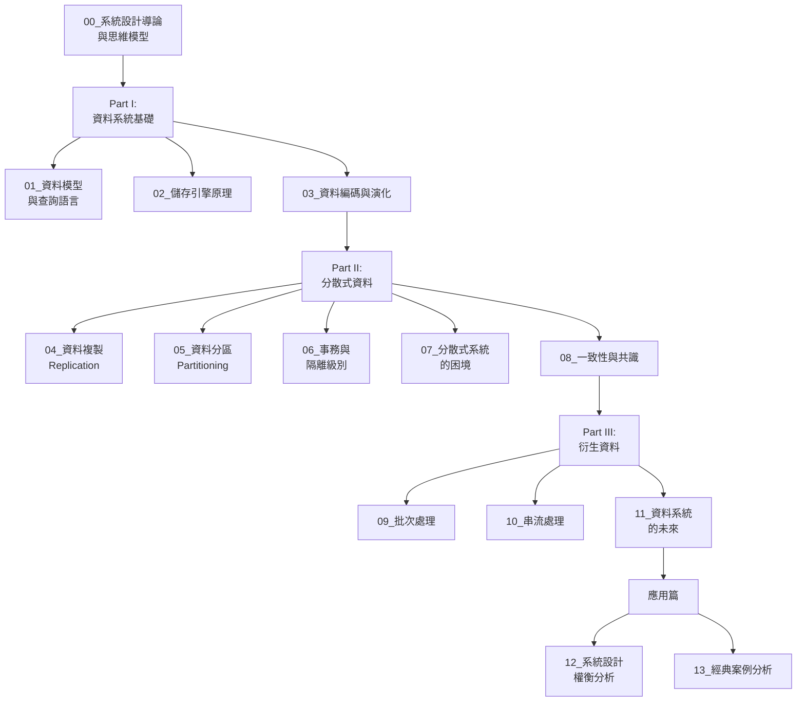

# 系統設計學習指南

## 📚 課程概覽

本系列筆記基於 Martin Kleppmann 的經典著作《Designing Data-Intensive Applications (DDIA)》，以教學導向的方式整理系統設計的核心概念。

---

## 🗺️ 學習路線圖



---

## 📖 章節內容

### Part I: 資料系統基礎 (Foundations)

#### ✅ [00_系統設計導論與思維模型](./00_系統設計導論與思維模型.md)
- 什麼是資料密集型應用
- 可靠性、可擴展性、可維護性
- 系統設計的思考框架
- **適合**: 初學者，建立整體觀念

#### ✅ [01_資料模型與查詢語言](./01_資料模型與查詢語言.md)
- 關聯式 vs 文件式 vs 圖式資料庫
- 資料模型的選擇指南
- 查詢語言的演進
- **適合**: 理解不同資料庫的適用場景

#### ✅ [02_儲存引擎原理](./02_儲存引擎原理.md)
- LSM-Tree vs B-Tree
- OLTP vs OLAP
- 列式儲存
- **適合**: 深入理解資料庫內部運作

#### ✅ [03_資料編碼與演化](./03_資料編碼與演化.md)
- JSON, Protobuf, Avro 比較
- Schema 演化策略
- 向前/向後相容性
- **適合**: API 設計、微服務通訊

---

### Part II: 分散式資料 (Distributed Data)

#### ✅ [04_資料複製 (Replication)](./04_資料複製_Replication.md)
- 主從複製 (Leader-Follower): 最常見，一寫多讀
- 多主複製 (Multi-Leader): 多地區寫入，衝突解決
- 無主複製 (Leaderless): Cassandra, Dynamo 模式
- 同步 vs 異步: 一致性與效能的權衡
- 複製延遲問題: Read-after-Write, Monotonic Reads
- **適合**: 理解高可用設計

#### ✅ [05_資料分區 (Partitioning)](./05_資料分區_Partitioning.md)
- 分區策略: 範圍分區 vs 雜湊分區
- 一致性雜湊 (Consistent Hashing)
- 熱點問題處理
- 重新平衡 (Rebalancing)
- 請求路由機制
- **適合**: 理解可擴展性設計

#### ✅ [06_事務與隔離級別](./06_事務與隔離級別.md)
- ACID 特性詳解
- 隔離級別: Read Uncommitted, Read Committed, Repeatable Read, Serializable
- 並發問題: 髒讀、不可重複讀、幻讀、丟失更新、寫偏斜
- 鎖機制: 2PL, MVCC
- 序列化快照隔離 (SSI)
- **適合**: 理解資料一致性保證

#### ✅ [07_分散式系統的困境](./07_分散式系統的困境.md)
- 網路不可靠: 封包延遲、遺失、亂序
- 時鐘不準確: NTP 誤差、時鐘跳躍、時鐘偏移
- 程序暫停: GC, Page Fault, 虛擬機暫停
- Fencing Token 機制
- 冪等性設計
- **適合**: 理解分散式系統的根本挑戰

#### ✅ [08_一致性與共識](./08_一致性與共識.md)
- 線性一致性 (Linearizability)
- 因果一致性 (Causal Consistency)
- 共識演算法: Paxos, Raft
- 原子提交: 2PC, 3PC
- CAP 定理實際應用
- **適合**: 理解分散式系統核心算法

---

### Part III: 衍生資料 (Derived Data)

#### ✅ [09_批次處理](./09_批次處理.md)
- MapReduce 編程模型
- Join 操作 (Sort-Merge, Broadcast)
- Apache Spark 與 Flink
- 批次處理優化
- **適合**: 理解大數據處理

#### ✅ [10_串流處理](./10_串流處理.md)
- 訊息傳遞語義: At-Most-Once, At-Least-Once, Exactly-Once
- 時間語義: Event Time vs Processing Time
- 視窗操作: Tumbling, Sliding, Session Window
- 變更資料捕獲 (CDC)
- 狀態管理與 Checkpoint
- **適合**: 理解實時數據處理

#### ✅ [11_資料系統的未來](./11_資料系統的未來.md)
- Lambda vs Kappa 架構
- 資料庫解包 (Database Unbundling)
- 資料湖倉 (Data Lakehouse)
- 雲原生資料系統
- 實時 OLAP
- **適合**: 理解現代資料架構演進

---

### 應用篇 (Practical Applications)

#### ✅ [12_系統設計權衡分析](./12_系統設計權衡分析.md)
- CAP/PACELC 定理深度解析
- 性能 vs 一致性權衡
- 正規化 vs 反正規化
- 同步 vs 異步處理
- 單體 vs 微服務
- 成本效益分析
- **適合**: 學習系統設計決策思維

#### ✅ [13_經典案例分析](./13_經典案例分析.md)
- URL 短網址服務完整設計
- Instagram 照片存儲系統
- 容量估算方法
- ID 生成策略 (Snowflake)
- 快取與 CDN 優化
- **適合**: 實戰系統設計練習

---

## 🎓 學習建議

### 初學者路線
```
1. 00_系統設計導論 (建立整體觀念)
2. 01_資料模型 (理解資料庫選擇)
3. 04_資料複製 (分散式基礎)
4. 12_權衡分析 (學習決策思維)
5. 13_案例分析 (實戰演練)
```

### 進階路線
```
1-11 章順序學習 (完整理論體系)
重點: 06_事務, 08_一致性, 07_困境
```

### 面試準備
```
重點章節:
- 00_導論 (思維框架)
- 01_資料模型 (技術選型)
- 04_複製 (高可用)
- 05_分區 (可擴展性)
- 08_一致性 (CAP)
- 12_權衡分析 (決策能力)
- 13_案例 (實戰經驗)
```

---

## 📝 學習方法

### 1. 理解概念
- 先看 **學習目標**
- 理解 **為什麼** 需要這個概念
- 理解 **解決什麼問題**

### 2. 視覺化
- 仔細看 Mermaid 圖表
- 自己畫一遍加深理解

### 3. 實踐
- 運行程式碼範例
- 修改參數觀察變化
- 部署真實系統測試

### 4. 思考
- 完成每章的思考題
- 思考如何應用到自己的專案

### 5. 總結
- 用自己的話總結核心概念
- 整理成筆記或心智圖

---

## 🔧 實踐資源

### 本機實驗
```bash
# Docker 環境快速啟動
docker-compose up -d

# 包含:
# - PostgreSQL (關聯式)
# - MongoDB (文件式)
# - Redis (快取)
# - Kafka (訊息佇列)
# - Elasticsearch (搜尋)
```

### 線上資源
- [System Design Primer](https://github.com/donnemartin/system-design-primer)
- [Awesome System Design](https://github.com/madd86/awesome-system-design)
- [ByteByteGo](https://bytebytego.com/)

---

## 📊 學習進度追蹤

### 基礎知識 (必修)
- [x] 00_系統設計導論
- [x] 01_資料模型與查詢語言
- [x] 02_儲存引擎原理
- [x] 03_資料編碼與演化
- [x] 04_資料複製
- [x] 05_資料分區
- [x] 06_事務與隔離級別

### 分散式系統 (進階)
- [x] 07_分散式系統的困境
- [x] 08_一致性與共識

### 資料處理 (專業)
- [x] 09_批次處理
- [x] 10_串流處理
- [x] 11_資料系統的未來

### 實戰應用 (實務)
- [x] 12_系統設計權衡分析
- [x] 13_經典案例分析

**🎉 所有章節已完成！**

---

## 🎯 學習里程碑

### 🏆 Level 1: 入門 (完成 0-3 章)
能力:
- 理解系統設計基本概念
- 選擇合適的資料模型
- 理解儲存引擎差異

### 🏆 Level 2: 中級 (完成 0-6 章)
能力:
- 設計分散式系統
- 處理複製與分區
- 理解事務與一致性

### 🏆 Level 3: 高級 (完成 0-11 章)
能力:
- 深入理解分散式系統
- 設計批次與串流處理
- 做出正確的技術決策

### 🏆 Level 4: 專家 (完成所有章節)
能力:
- 設計大規模系統
- 分析複雜 trade-offs
- 解決實際生產問題

---

## 💬 學習社群

### 討論與提問
- 在每章筆記中留下你的疑問
- 與其他學習者交流
- 分享你的實踐經驗

### 貢獻
- 發現錯誤請提出
- 補充實際案例
- 分享學習心得

---

## 📚 參考資料

### 核心書籍
1. **Martin Kleppmann**, *Designing Data-Intensive Applications* (O'Reilly, 2017)
   - 本系列筆記的主要來源
   - 系統設計聖經

2. **Alex Xu**, *System Design Interview*
   - 面試準備
   - 實戰案例

3. **Google SRE Book**
   - 生產環境實踐
   - 可靠性工程

### 線上課程
- MIT 6.824: Distributed Systems
- Stanford CS244b: Distributed Systems
- Grokking the System Design Interview

### 重要論文
- [Google File System (GFS)](https://static.googleusercontent.com/media/research.google.com/zh-TW//archive/gfs-sosp2003.pdf)
- [MapReduce](https://static.googleusercontent.com/media/research.google.com/zh-TW//archive/mapreduce-osdi04.pdf)
- [Bigtable](https://static.googleusercontent.com/media/research.google.com/zh-TW//archive/bigtable-osdi06.pdf)
- [Dynamo](https://www.allthingsdistributed.com/files/amazon-dynamo-sosp2007.pdf)
- [Raft](https://raft.github.io/raft.pdf)

---

## 🚀 開始學習

**建議**: 從 [00_系統設計導論與思維模型](./00_系統設計導論與思維模型.md) 開始

**記住**: 
- 系統設計沒有標準答案
- 重要的是理解 trade-offs
- 持續實踐與反思

祝你學習愉快！🎉
