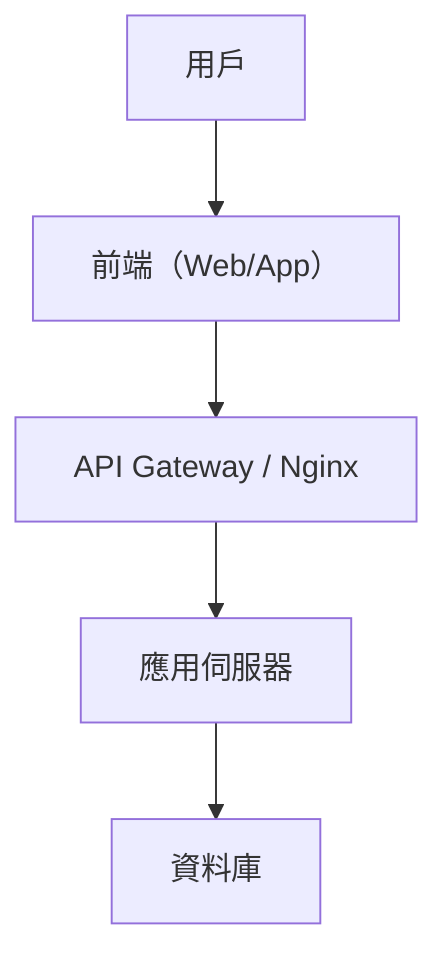

# 系統設計基礎概念

## 1. 系統設計的定義與重要性

系統設計（System Design）是指針對一個複雜系統，從需求分析、架構規劃、元件劃分、資料流設計到技術選型等一系列規劃與設計過程。其目標是確保系統具備可擴展性、可靠性、維護性與效能，並能有效解決實際業務問題。

**重要性：**
- 提升系統可擴展性與彈性
- 降低維護成本
- 增強系統穩定性與容錯能力
- 有助於團隊協作與溝通

---

## 2. 系統設計全貌圖解

### Markdown 簡易架構圖

```
用戶
  │
  ▼
前端（Web/App）
  │
  ▼
API Gateway / 反向代理（如 Nginx）
  │
  ▼
應用伺服器（Backend）
  │
  ▼
資料庫（Database）
```

### Mermaid 架構圖



---

## 3. 真實世界範例

- **網站**：如電子商務平台（Shopee、PChome），前端與後端分離，並透過 API Gateway 管理流量。
- **App**：如即時通訊軟體（LINE），需處理大量用戶連線與訊息同步。
- **雲端服務**：如 Google Drive，需考慮高可用性、分散式儲存與資料一致性。

---

## 4. 代碼片段：Nginx 最簡單反向代理設定

```nginx
server {
    listen 80;
    server_name example.com;

    location / {
        proxy_pass http://localhost:3000;
        proxy_set_header Host $host;
        proxy_set_header X-Real-IP $remote_addr;
    }
}
```
**說明：**
此設定將所有來自 `example.com` 的流量，轉發到本機的 3000 埠（通常為應用伺服器），常見於前後端分離架構。

---

## 5. 架構師實務建議與 Trade-off 分析

- **可擴展性 vs. 複雜度**
  採用微服務架構可提升擴展性，但也會增加部署與維護的複雜度。小型專案可考慮單體架構，降低初期負擔。
- **效能 vs. 一致性**
  分散式系統常需在效能（如快取）與資料一致性（如 CAP 理論）間取捨。需根據業務需求選擇適合的策略。
- **可靠性 vs. 成本**
  高可用架構（如多活、多區部署）可提升可靠性，但會增加基礎設施與運維成本。
- **安全性**
  建議從設計階段即納入安全考量，如權限控管、資料加密與日誌監控。

**總結：**
系統設計需根據實際需求、預算與團隊能力做出最適合的選擇，並持續優化與調整。
