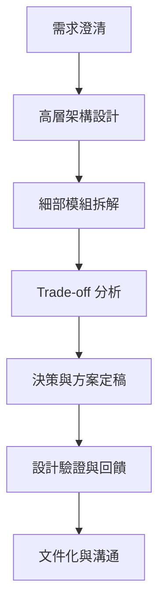

# 系統設計的目標與思維方式

---

## 1. 系統設計的主要目標

在設計大型系統時，需考量多個核心目標，以下為常見且重要的系統設計目標：

- **可擴展性（Scalability）**
  指系統能隨著負載增加（如用戶數、資料量、請求量）而平滑擴展，維持效能與穩定。常見手法包括橫向擴展（增加伺服器數量）、分散式架構、快取機制等。

- **可靠性（Reliability）**
  系統能持續穩定運作，並在部分元件失效時仍能維持服務。常見做法有冗餘設計、故障轉移（failover）、資料備援等。

- **可維護性（Maintainability）**
  系統易於維護、修正與擴充。良好的模組化、清晰的程式碼結構、完善的文件與測試皆有助於提升可維護性。

- **效能（Performance）**
  系統能在合理時間內回應請求，並有效利用資源。需考量延遲、吞吐量、資源使用率等指標。

- **安全性（Security）**
  保護系統免於未授權存取、資料洩漏與攻擊。需設計權限控管、加密、審計等機制。

- **成本效益（Cost-effectiveness）**
  在滿足需求的前提下，控制建置與維運成本，避免過度設計或資源浪費。

---

## 2. 系統設計思維流程

一個完整的系統設計流程，通常包含以下步驟：

- **需求澄清**：與利害關係人確認功能、非功能需求與限制條件。
- **高層架構設計**：規劃系統整體架構、主要元件與資料流。
- **細部模組拆解**：將架構細分為可管理的模組，定義介面與責任。
- **Trade-off 分析**：針對不同設計方案進行優缺點比較，考量效能、成本、維護性等。
- **決策與方案定稿**：根據分析結果選擇最適合的設計方案。
- **設計驗證與回饋**：進行原型、測試或審查，收集回饋並修正設計。
- **文件化與溝通**：將設計內容文件化，並與團隊及利害關係人充分溝通。

---

## 3. 真實世界範例：大型網站設計決策流程

以設計一個類似 Facebook 的社交網站為例，設計決策流程如下：

1. **需求澄清**
   - 每日活躍用戶數百萬
   - 需支援即時訊息、動態牆、圖片上傳
   - 高可用性與低延遲

2. **高層架構設計**
   - 前端伺服器、應用伺服器、資料庫、快取層、CDN
   - 微服務架構，將不同功能拆分為獨立服務

3. **細部模組拆解**
   - 用戶服務、訊息服務、動態牆服務、媒體服務等
   - 定義 API 介面與資料格式

4. **Trade-off 分析**
   - 資料一致性 vs. 可用性（CAP 理論）
   - 單體 vs. 微服務架構
   - SQL vs. NoSQL 資料庫
   - 快取命中率與資料新鮮度

5. **決策與方案定稿**
   - 採用微服務架構，提升可擴展性與維護性
   - 重要資料採用強一致性，次要資料允許最終一致性
   - 熱門資料加快取，減少資料庫壓力

6. **設計驗證與回饋**
   - 建立原型系統，進行壓力測試與故障模擬
   - 根據測試結果調整架構

7. **文件化與溝通**
   - 撰寫設計文件，與團隊成員討論並取得共識

---

## 4. 架構師實務建議與 Trade-off 分析

- **務實評估需求**：避免過度設計，聚焦於當前與可預見的需求，預留擴充彈性但不過度預先優化。
- **分層與模組化**：將系統拆分為獨立模組，降低耦合度，提升維護與擴展性。
- **Trade-off 分析**：每個設計選擇都伴隨取捨，需根據實際情境評估。例如：
  - **一致性 vs. 可用性**：分散式系統中，強一致性會降低可用性，需根據業務需求選擇。
  - **效能 vs. 成本**：高效能通常需投入更多資源，需評估投資報酬率。
  - **複雜度 vs. 可維護性**：過度複雜的設計雖能解決更多問題，但會增加維護難度。
- **持續溝通與文件化**：設計過程中與團隊、利害關係人保持溝通，並將設計決策與原因文件化，方便後續維護與知識傳承。
- **預留監控與回饋機制**：設計時納入監控、日誌與告警機制，便於後續問題追蹤與系統優化。

---
