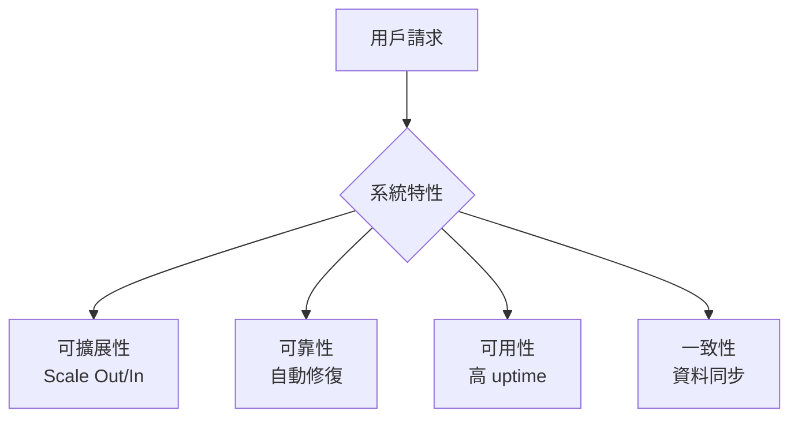

# Scalability、Reliability、Availability、Consistency 四大特性基礎

## 一、理論解釋

### 1. 可擴展性（Scalability）
可擴展性指的是系統在面對負載增加時，能夠透過增加資源（如伺服器、儲存空間等）來維持或提升效能的能力。良好的可擴展性意味著系統能夠隨著需求成長而線性或近線性地擴充，不會因為規模變大而效能急劇下降。

### 2. 可靠性（Reliability）
可靠性是指系統在特定時間內，能夠持續正確運作、不發生錯誤或故障的能力。高可靠性的系統能夠預防、偵測並自動修復故障，確保資料不遺失且服務不中斷。

### 3. 可用性（Availability）
可用性描述的是系統在任何時刻都能夠正常提供服務的能力，通常以「正常運作時間百分比」來衡量（如 99.99% uptime）。高可用性系統即使部分元件失效，仍能維持服務不中斷。

### 4. 一致性（Consistency）
一致性指的是系統中的所有資料副本在任何時刻都保持相同狀態。對於分散式系統而言，一致性確保用戶無論從哪個節點讀取資料，都能獲得相同的結果。

---

## 二、四大特性比較圖解

### 表格比較

| 特性         | 定義                         | 目標                     | 常見挑戰                   | 代表技術/架構         |
|--------------|------------------------------|--------------------------|----------------------------|-----------------------|
| 可擴展性     | 負載增加時可線性擴充         | 彈性應對成長             | 資源分配、分散式協調       | 負載平衡、分片、雲端  |
| 可靠性       | 長時間正確運作               | 避免資料遺失與錯誤       | 軟硬體故障、bug            | RAID、備援、監控      |
| 可用性       | 隨時可用、不中斷             | 提供高 uptime            | 單點故障、網路中斷         | 多活架構、故障轉移    |
| 一致性       | 資料副本狀態一致             | 保證資料正確性           | 分散式同步、網路延遲       | 強一致性、最終一致性  |

### Mermaid 圖解

---

## 三、真實系統範例

1. **高可用架構（High Availability, HA）**
   - 例：多區域部署的 Web 服務，使用負載平衡器（如 AWS ELB）分散流量，後端多台伺服器互為備援，單一節點故障時自動切換。
2. **分散式資料庫**
   - 例：Cassandra、MongoDB、CockroachDB 等，透過資料分片（Sharding）與多副本（Replication）提升可擴展性與可用性，並根據需求調整一致性等級。
3. **雲端自動擴展（Auto Scaling）**
   - 例：Kubernetes HPA（Horizontal Pod Autoscaler）根據負載自動調整服務實例數量，確保系統彈性與效能。
4. **強一致性系統**
   - 例：傳統關聯式資料庫（如 PostgreSQL、MySQL）在主從同步模式下，確保資料寫入後所有讀取都能獲得最新狀態。

---

## 四、架構師實務建議與 Trade-off 分析

- **可擴展性 vs. 一致性**
  - 分散式系統常需在高可擴展性與強一致性間取捨。強一致性會降低擴展效率，最終一致性則提升擴展性但犧牲即時正確性。
- **可靠性 vs. 成本**
  - 提升可靠性需投入更多備援、監控與自動修復機制，會增加系統複雜度與運維成本。
- **可用性 vs. 一致性（CAP 定理）**
  - 當網路分割發生時，系統只能在可用性與一致性間選擇其一。依據業務需求決定優先順序。
- **實務建議**
  - 依據業務目標與 SLA 要求，明確定義各特性優先順序。
  - 採用模組化設計，針對不同子系統分別優化特性。
  - 持續監控與測試，及早發現瓶頸與潛在風險。
  - 參考業界最佳實踐（如微服務、雲原生架構）靈活調整設計。

---

## 五、結語

Scalability、Reliability、Availability、Consistency 是現代系統設計的核心指標。架構師需根據實際需求與限制，靈活取捨並設計出最適合的系統架構。