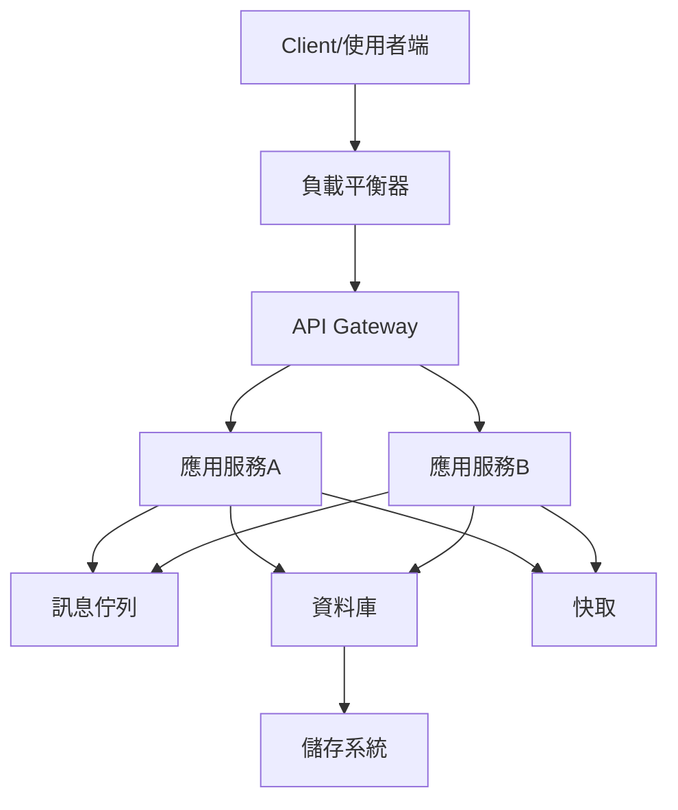

# 05 核心組件與基礎設施

## 1. 常見核心組件分類與解釋

- **負載平衡器（Load Balancer）**
  負載平衡器負責將進來的流量分配到多個伺服器或服務實例上，以提升系統的可用性與擴展性。常見類型有 L4（傳輸層）與 L7（應用層）負載平衡。

- **快取（Cache）**
  快取用於暫存常用資料，減少資料庫或後端服務的負載，加速回應速度。常見快取有記憶體型（如 Redis、Memcached）與本地快取。

- **資料庫（Database）**
  資料庫負責持久化儲存資料，分為關聯式（如 MySQL、PostgreSQL）與非關聯式（如 MongoDB、Cassandra）等類型。選擇依據資料一致性、可擴展性與查詢需求。

- **訊息佇列（Message Queue）**
  訊息佇列用於解耦服務之間的通訊，支援非同步處理與流量削峰。常見方案有 RabbitMQ、Kafka、AWS SQS 等。

- **API Gateway**
  API Gateway 作為前端與後端服務的中介，統一管理 API 請求、認證、流量控管與日誌記錄。

- **服務註冊與發現（Service Registry & Discovery）**
  在微服務架構中，服務註冊中心協助追蹤各服務實例的位置，常見工具如 Consul、Eureka。

---

## 2. 基礎設施說明

- **網路（Networking）**
  提供服務間通訊的基礎，包含交換器、路由器、防火牆、VPC、CDN 等。設計時需考慮頻寬、延遲、隔離與安全性。

- **儲存（Storage）**
  包含區塊儲存（Block Storage）、檔案儲存（File Storage）、物件儲存（Object Storage）。依據資料型態與存取模式選擇合適方案。

- **運算資源（Compute）**
  包含實體伺服器、虛擬機（VM）、容器（Container）、無伺服器運算（Serverless）。依應用需求選擇彈性與成本最佳化的運算方式。

- **監控與日誌（Monitoring & Logging）**
  監控系統健康狀態、資源使用與異常警示，常見工具如 Prometheus、Grafana、ELK Stack。

---

## 3. 分層架構圖解

---

## 4. 真實世界範例

### 典型三層架構（Three-Tier Architecture）

1. **表示層（Presentation Layer）**：如 Web 前端、行動 App，負責與使用者互動。
2. **邏輯層（Logic Layer）**：應用伺服器處理業務邏輯，連接前端與資料層。
3. **資料層（Data Layer）**：資料庫、快取、檔案儲存等，負責資料持久化。

### 雲端服務組合範例（以 AWS 為例）

- **運算**：EC2、Lambda
- **儲存**：S3、EBS、EFS
- **資料庫**：RDS、DynamoDB
- **快取**：ElastiCache
- **訊息佇列**：SQS、SNS
- **API Gateway**：AWS API Gateway
- **監控**：CloudWatch

---

## 5. 架構師實務建議與 Trade-off 分析

- **可擴展性 vs. 複雜度**
  引入快取、訊息佇列、微服務等可提升擴展性，但也增加系統複雜度與維運成本。

- **一致性 vs. 可用性**
  根據 CAP 定理，需在一致性與可用性間取得平衡。例如分散式資料庫常需犧牲部分一致性以提升可用性。

- **成本 vs. 彈性**
  雲端資源可彈性擴展，但長期成本需評估。自建基礎設施雖初期投入高，但長期可控。

- **監控與自動化**
  建議導入完善的監控、日誌與自動化部署工具，提升可觀察性與運維效率。

- **安全性設計**
  基礎設施與核心組件需考慮存取控管、加密、網路隔離等安全措施。

---

以上內容涵蓋核心組件、基礎設施、分層架構圖、真實範例與實務建議，並針對每一主題給予解釋與分析，適合作為系統設計入門與實務參考。